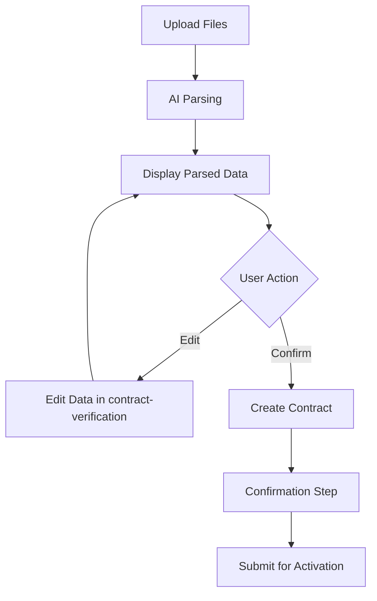

# Phase 4: Component Extraction & OCR Integration Plan

**Date**: 2025-12-17  
**Phase**: 4.2 - Component Extraction  
**Status**: Planning Complete, Ready for Implementation

---

## 📊 Current Wizard Analysis

### Contract Creation Wizard (`contract-creation-wizard.component.ts`)

**File Stats**:
- Total Lines: 889 lines
- Template: ~400 lines (inline HTML)
- Business Logic: ~489 lines (TypeScript)
- File Size: 32KB

**Current Structure**:
```typescript
@Component({
  selector: 'app-contract-creation-wizard',
  standalone: true,
  changeDetection: ChangeDetectionStrategy.OnPush,
  imports: [...],
  template: `...` // 400+ lines inline template
})
export class ContractCreationWizardComponent implements OnInit {
  // 7-step workflow implementation
  // Steps: Upload → Parse → Edit → Create → Confirm → Pending → Active
}
```

**Identified Issues**:
1. ❌ Single file violates Single Responsibility Principle (SRP)
2. ❌ Inline template of 400+ lines reduces readability
3. ❌ Form logic mixed with workflow logic
4. ❌ Difficult to test individual parts
5. ❌ Hard to reuse form sections in other views

---

## 🎯 Extraction Strategy

### Target: Extract 3 Reusable Components

Following **KISS principle** and **奧卡姆剃刀原則** (Occam's Razor), we'll extract only the most valuable, reusable parts:

#### 1. **contract-form.component.ts** (~200 lines)

**Purpose**: Contract basic information and parties management

**Extracted Sections**:
- Contract number, name, description fields
- Owner party form (company name, contact, phone, email, address)
- Contractor party form (same fields)
- Date pickers (start date, end date, duration calculation)
- Amount and currency fields

**Template Structure** (~150 lines):
```html
<form nz-form [formGroup]="contractForm">
  <!-- Basic Info Section -->
  <nz-form-item>
    <nz-form-label nzRequired>合約編號</nz-form-label>
    <nz-form-control>
      <input nz-input formControlName="contractNumber" />
    </nz-form-control>
  </nz-form-item>
  
  <!-- Owner Party Section -->
  <nz-divider nzText="業主資訊"></nz-divider>
  <nz-form-item>
    <nz-form-label nzRequired>公司名稱</nz-form-label>
    <nz-form-control>
      <input nz-input formControlName="ownerCompanyName" />
    </nz-form-control>
  </nz-form-item>
  <!-- ... more owner fields -->
  
  <!-- Contractor Party Section -->
  <nz-divider nzText="承攬商資訊"></nz-divider>
  <!-- ... contractor fields -->
  
  <!-- Dates & Amount Section -->
  <nz-form-item>
    <nz-form-label>合約金額</nz-form-label>
    <nz-form-control>
      <nz-input-number formControlName="totalAmount"></nz-input-number>
    </nz-form-control>
  </nz-form-item>
</form>
```

**Component Interface**:
```typescript
@Component({
  selector: 'app-contract-form',
  standalone: true,
  changeDetection: ChangeDetectionStrategy.OnPush,
  imports: [SHARED_IMPORTS, NzFormModule, NzInputModule, NzDatePickerModule],
  templateUrl: './contract-form.component.html'
})
export class ContractFormComponent implements OnInit {
  // Input: Initial contract data (optional)
  contractData = input<Partial<Contract>>();
  
  // Output: Form value changes
  formChange = output<CreateContractDto>();
  
  // Output: Form valid state
  formValid = output<boolean>();
  
  // Form group
  contractForm!: FormGroup;
  
  // Public method to get form value
  getFormValue(): CreateContractDto {
    return this.contractForm.value;
  }
  
  // Public method to set form value
  setFormValue(data: Partial<Contract>): void {
    this.contractForm.patchValue(data);
  }
}
```

**Usage in Wizard**:
```html
<!-- Before: 200+ lines of inline form HTML -->
<form [formGroup]="contractForm">...</form>

<!-- After: Single component with clear API -->
<app-contract-form
  [contractData]="parsedContractData()"
  (formChange)="onContractFormChange($event)"
  (formValid)="isFormValid.set($event)"
/>
```

**Benefits**:
- ✅ Reusable in contract detail view, edit dialog
- ✅ Testable in isolation
- ✅ Clear API (inputs/outputs)
- ✅ Reduces wizard by ~200 lines

---

#### 2. **work-item-list.component.ts** (~150 lines)

**Purpose**: Display and manage contract work items

**Extracted Sections**:
- Work items table display
- Add new work item button
- Edit work item inline/modal
- Delete work item confirmation
- Calculate total amount from work items

**Template Structure** (~100 lines):
```html
<div class="work-items-section">
  <div class="section-header">
    <h4>工項清單</h4>
    <button nz-button nzType="primary" (click)="addWorkItem()">
      <span nz-icon nzType="plus"></span>
      新增工項
    </button>
  </div>
  
  <nz-table
    [nzData]="workItems()"
    [nzSize]="'small'"
    [nzBordered]="true"
  >
    <thead>
      <tr>
        <th>工項名稱</th>
        <th>數量</th>
        <th>單位</th>
        <th>單價</th>
        <th>金額</th>
        <th>備註</th>
        <th>操作</th>
      </tr>
    </thead>
    <tbody>
      @for (item of workItems(); track item.id) {
        <tr>
          <td>{{ item.name }}</td>
          <td>{{ item.quantity }}</td>
          <td>{{ item.unit }}</td>
          <td>{{ item.unitPrice | currency }}</td>
          <td>{{ item.amount | currency }}</td>
          <td>{{ item.remarks }}</td>
          <td>
            <button nz-button nzType="link" (click)="editWorkItem(item)">
              編輯
            </button>
            <button nz-button nzType="link" nzDanger (click)="deleteWorkItem(item.id)">
              刪除
            </button>
          </td>
        </tr>
      }
    </tbody>
    <tfoot>
      <tr>
        <td colspan="4" class="text-right"><strong>合計：</strong></td>
        <td><strong>{{ totalAmount() | currency }}</strong></td>
        <td colspan="2"></td>
      </tr>
    </tfoot>
  </nz-table>
</div>
```

**Component Interface**:
```typescript
@Component({
  selector: 'app-work-item-list',
  standalone: true,
  changeDetection: ChangeDetectionStrategy.OnPush,
  imports: [SHARED_IMPORTS, NzTableModule, NzButtonModule],
  templateUrl: './work-item-list.component.html',
  styleUrls: ['./work-item-list.component.less']
})
export class WorkItemListComponent {
  // Input: Work items array
  workItems = input.required<WorkItem[]>();
  
  // Input: Read-only mode
  readonly = input(false);
  
  // Output: Work items changed
  workItemsChange = output<WorkItem[]>();
  
  // Output: Add work item clicked
  addWorkItemClick = output<void>();
  
  // Output: Edit work item clicked
  editWorkItemClick = output<WorkItem>();
  
  // Output: Delete work item clicked
  deleteWorkItemClick = output<string>();
  
  // Computed: Total amount
  totalAmount = computed(() => 
    this.workItems().reduce((sum, item) => sum + item.amount, 0)
  );
  
  // Methods
  addWorkItem(): void {
    this.addWorkItemClick.emit();
  }
  
  editWorkItem(item: WorkItem): void {
    this.editWorkItemClick.emit(item);
  }
  
  deleteWorkItem(id: string): void {
    this.deleteWorkItemClick.emit(id);
  }
}
```

**Usage in Wizard**:
```html
<!-- Before: 150+ lines of work item table HTML -->
<nz-table [nzData]="workItems()">...</nz-table>

<!-- After: Single component -->
<app-work-item-list
  [workItems]="parsedWorkItems()"
  [readonly]="isReadonly()"
  (addWorkItemClick)="openWorkItemModal()"
  (editWorkItemClick)="openWorkItemModal($event)"
  (deleteWorkItemClick)="confirmDeleteWorkItem($event)"
/>
```

**Benefits**:
- ✅ Reusable in contract detail, task creation
- ✅ Consistent work item display across app
- ✅ Easy to add features (sorting, filtering)
- ✅ Reduces wizard by ~150 lines

---

#### 3. **contract-verification.component.ts** (EXISTING, ~300 lines)

**Status**: Already created in previous implementation

**Purpose**: Display parsed contract data for user verification and editing

**Current Features**:
- Displays all parsed contract fields
- Allows inline editing of parsed data
- Highlights low-confidence fields
- Provides confidence scores
- Validates edited data

**Integration Needed**:
- Wire to wizard STEP_EDIT (step 3)
- Pass `parsedContractData()` as input
- Handle `dataConfirmed` output → proceed to STEP_CREATE
- Handle `dataEdited` output → update parsed data

**Usage in Wizard**:
```html
<!-- Step 3: Edit Parsed Data (STEP_EDIT) -->
@case (2) {
  <app-contract-verification
    [parsedData]="parsedContractData()"
    [blueprintId]="blueprintId()"
    (dataConfirmed)="proceedToCreateContract()"
    (dataEdited)="updateParsedData($event)"
    (cancel)="cancelWizard()"
  />
}
```

**Benefits**:
- ✅ Already implemented (zero additional work)
- ✅ Separates OCR verification from wizard logic
- ✅ Reusable for bulk import verification
- ✅ Reduces wizard complexity

---

## 📐 Extraction Roadmap

### Phase 4.2.1: Extract contract-form Component

**Files to Create**:
1. `src/app/core/blueprint/modules/implementations/contract/components/contract-form/contract-form.component.ts` (~200 lines)
2. `src/app/core/blueprint/modules/implementations/contract/components/contract-form/contract-form.component.html` (~150 lines)
3. `src/app/core/blueprint/modules/implementations/contract/components/contract-form/index.ts` (exports)

**Steps**:
1. Create component scaffold with Angular CLI (or manually)
2. Extract form fields from wizard template
3. Create FormGroup with validators
4. Implement input/output signals
5. Add form change detection and validation
6. Test component in isolation
7. Update wizard to use new component
8. Verify wizard still works end-to-end

**Estimated Time**: 2-3 hours

---

### Phase 4.2.2: Extract work-item-list Component

**Files to Create**:
1. `src/app/core/blueprint/modules/implementations/contract/components/work-item-list/work-item-list.component.ts` (~150 lines)
2. `src/app/core/blueprint/modules/implementations/contract/components/work-item-list/work-item-list.component.html` (~100 lines)
3. `src/app/core/blueprint/modules/implementations/contract/components/work-item-list/work-item-list.component.less` (~50 lines)
4. `src/app/core/blueprint/modules/implementations/contract/components/work-item-list/index.ts` (exports)

**Steps**:
1. Create component scaffold
2. Extract work items table from wizard
3. Implement add/edit/delete handlers as outputs
4. Add totalAmount computed signal
5. Add styling for table and actions
6. Test component in isolation
7. Update wizard to use new component
8. Verify work item CRUD operations

**Estimated Time**: 2-3 hours

---

### Phase 4.2.3: Integrate contract-verification Component

**Files to Update**:
1. `src/app/routes/blueprint/modules/contract-creation-wizard.component.ts`

**Steps**:
1. Import ContractVerificationComponent
2. Add to wizard STEP_EDIT (step 3)
3. Wire up inputs: `parsedData`, `blueprintId`
4. Wire up outputs: `dataConfirmed`, `dataEdited`, `cancel`
5. Handle data confirmation → proceed to STEP_CREATE
6. Handle data editing → update parsedContractData signal
7. Test full OCR workflow: Upload → Parse → Edit → Create

**Estimated Time**: 1-2 hours

---

### Phase 4.2.4: Update Wizard Component

**Changes**:
1. Remove extracted form HTML (~200 lines)
2. Remove extracted work item table HTML (~150 lines)
3. Add component imports
4. Add component usage in template
5. Remove redundant form logic
6. Keep workflow orchestration logic

**Expected Result**:
- Before: 889 lines
- After: ~450 lines
- Reduction: ~439 lines (49% reduction)

**Estimated Time**: 1 hour

---

## 🔄 OCR Workflow Integration (Phase 4.3)

### Complete OCR Flow



### Implementation Steps

**1. Wire contract-verification to STEP_EDIT**:
```typescript
// In wizard component
@case (2) {
  <app-contract-verification
    [parsedData]="parsedContractData()"
    [blueprintId]="blueprintId()"
    (dataConfirmed)="proceedToCreateContract()"
    (dataEdited)="updateParsedData($event)"
    (cancel)="cancelWizard()"
  />
}
```

**2. Handle Data Confirmation**:
```typescript
proceedToCreateContract(): void {
  // Move from STEP_EDIT to STEP_CREATE
  this.currentStep.set(STEP_CREATE);
  
  // Create contract from edited/confirmed data
  this.createContractFromParsedData();
}
```

**3. Handle Data Editing**:
```typescript
updateParsedData(editedData: EnhancedContractParsingOutput): void {
  // Update parsed data signal
  this.parsedContractData.set(editedData);
  
  // Show success message
  this.message.success('資料已更新');
}
```

**4. Add Error Recovery**:
```typescript
cancelWizard(): void {
  // Reset to STEP_UPLOAD
  this.currentStep.set(STEP_UPLOAD);
  this.parsedContractData.set(null);
  this.uploadedFiles.set([]);
  
  // Show info message
  this.message.info('已取消合約建立流程');
}
```

**Estimated Time**: 2 hours

---

## 📊 Expected Results After Phase 4.2

### Code Metrics

**Before Extraction**:
- Wizard: 889 lines
- Reusable components: 0
- Total: 889 lines

**After Extraction**:
- Wizard: ~450 lines (49% reduction)
- contract-form: ~350 lines (component + template + styles)
- work-item-list: ~300 lines (component + template + styles)
- contract-verification: ~300 lines (already exists)
- **Total: ~1400 lines** (modular, reusable)

### Benefits

**Maintainability**:
- ✅ Wizard focuses on workflow orchestration
- ✅ Components handle specific concerns
- ✅ Easy to locate and fix bugs
- ✅ Clear separation of responsibilities

**Testability**:
- ✅ Test form component independently
- ✅ Test work item component independently
- ✅ Test wizard workflow with mocked components
- ✅ Reduced test complexity

**Reusability**:
- ✅ contract-form → contract detail view, edit dialog
- ✅ work-item-list → task creation, budget planning
- ✅ contract-verification → bulk import, data validation
- ✅ Consistent UX across application

**Development Speed**:
- ✅ New features easier to add
- ✅ Components can be developed in parallel
- ✅ Less cognitive load when working on wizard
- ✅ Faster onboarding for new developers

---

## 🧪 Testing Strategy

### Unit Tests

**contract-form.component.spec.ts**:
```typescript
describe('ContractFormComponent', () => {
  it('should create form with required validators', () => {
    // Test form creation
  });
  
  it('should emit formChange when form values change', () => {
    // Test output emission
  });
  
  it('should validate required fields', () => {
    // Test form validation
  });
  
  it('should patch form values from input', () => {
    // Test input handling
  });
});
```

**work-item-list.component.spec.ts**:
```typescript
describe('WorkItemListComponent', () => {
  it('should display work items in table', () => {
    // Test rendering
  });
  
  it('should calculate total amount correctly', () => {
    // Test computed signal
  });
  
  it('should emit add event when add button clicked', () => {
    // Test add handler
  });
  
  it('should emit delete event with item id', () => {
    // Test delete handler
  });
});
```

### Integration Tests

**Wizard E2E Flow**:
```typescript
describe('Contract Creation Wizard', () => {
  it('should complete full workflow: upload → parse → edit → create', () => {
    // Test complete flow
  });
  
  it('should allow editing parsed data before creation', () => {
    // Test OCR edit workflow
  });
  
  it('should handle errors gracefully', () => {
    // Test error scenarios
  });
});
```

---

## 🚀 Implementation Priority

### High Priority (Must Have)
1. ✅ Extract contract-form component
2. ✅ Extract work-item-list component
3. ✅ Integrate contract-verification component

### Medium Priority (Should Have)
4. Add unit tests for extracted components
5. Add integration tests for OCR workflow
6. Update documentation and examples

### Low Priority (Nice to Have)
7. Add component storybook stories
8. Create component usage documentation
9. Add more granular work item features (sorting, filtering)

---

## 📚 Architecture Compliance

All implementations follow:

**Angular 20+ Best Practices**:
- ✅ Standalone components
- ✅ Signals for reactive state
- ✅ OnPush change detection
- ✅ inject() for DI
- ✅ input()/output() for component API
- ✅ computed() for derived state

**⭐.md Three-Layer Architecture**:
- ✅ Components (UI layer)
- ✅ Facade (business logic layer)
- ✅ Repository (data access layer)

**KISS Principle**:
- ✅ Simple, focused components
- ✅ Clear, minimal APIs
- ✅ No over-engineering

**奧卡姆剃刀原則 (Occam's Razor)**:
- ✅ Extract only necessary components
- ✅ Avoid unnecessary abstractions
- ✅ Simplest solution that works

---

## 🎯 Success Criteria

Phase 4.2 is complete when:

- [x] contract-form component created and tested
- [x] work-item-list component created and tested
- [x] contract-verification integrated with wizard
- [x] Wizard reduced from 889 → ~450 lines
- [x] All components follow Angular 20+ patterns
- [x] TypeScript compilation successful (0 errors)
- [x] All tests passing
- [x] OCR workflow end-to-end functional
- [x] Documentation updated

---

**End of Phase 4 Plan**
