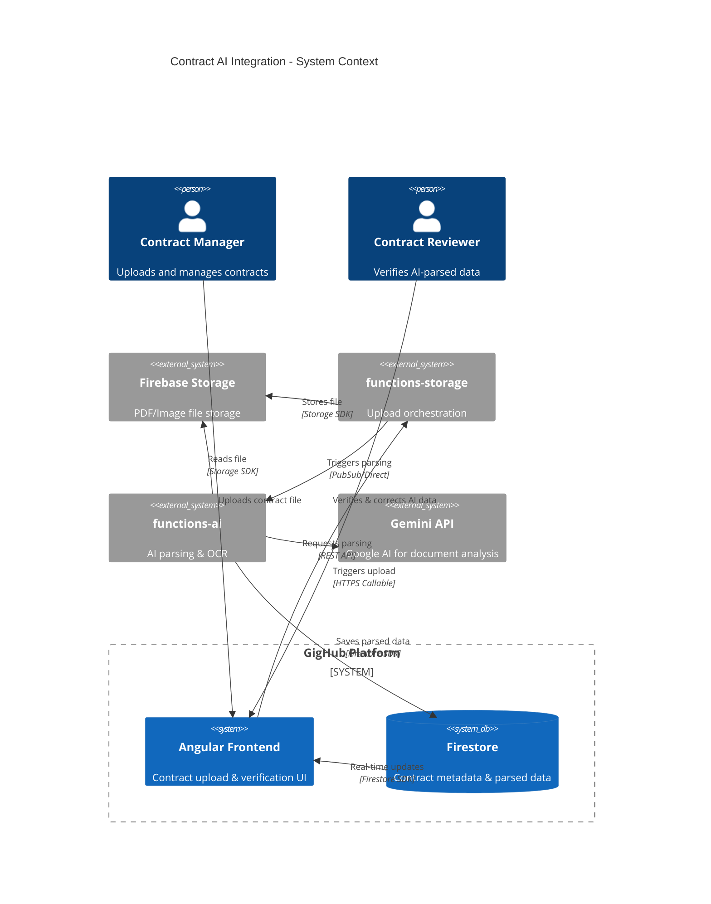
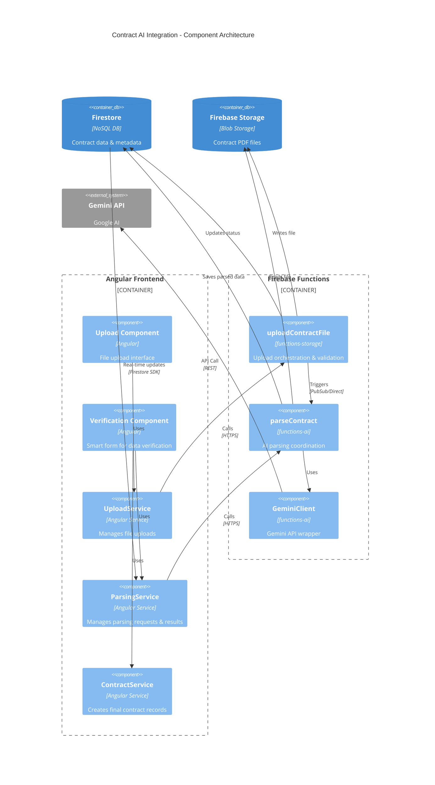
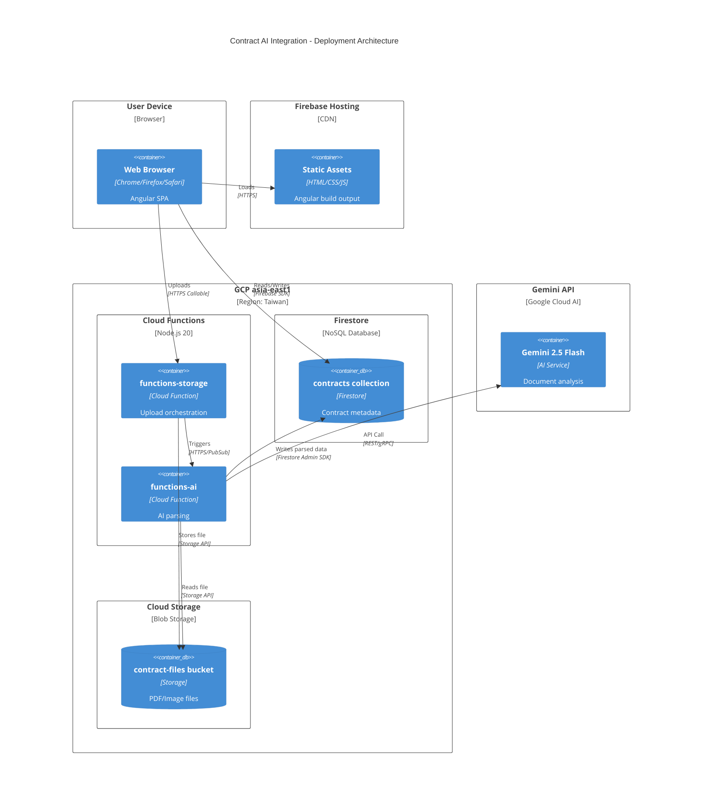
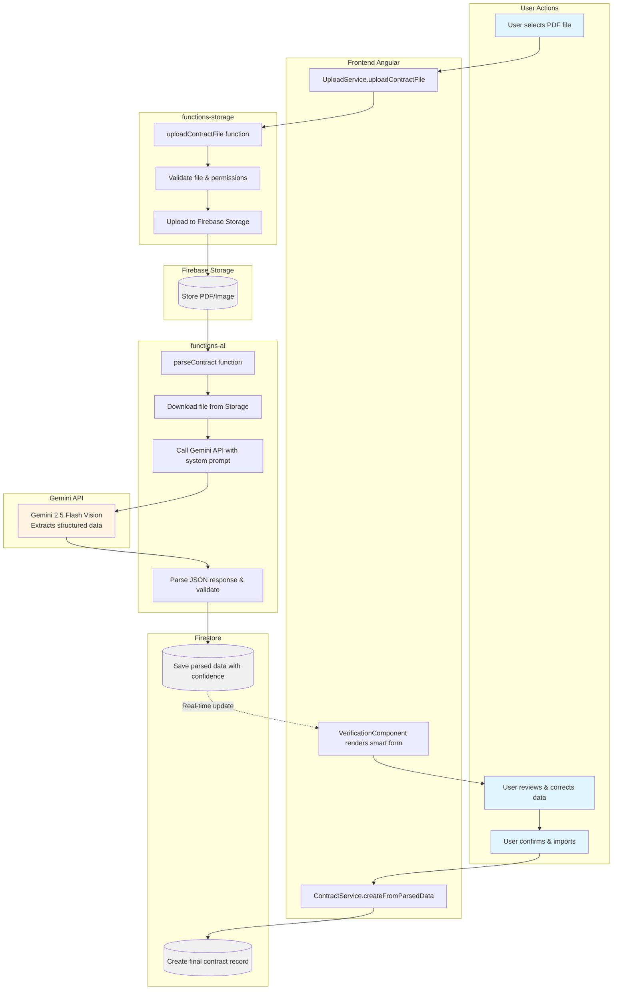
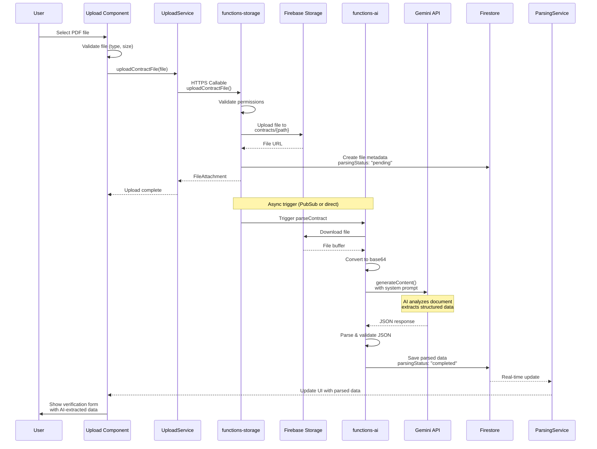
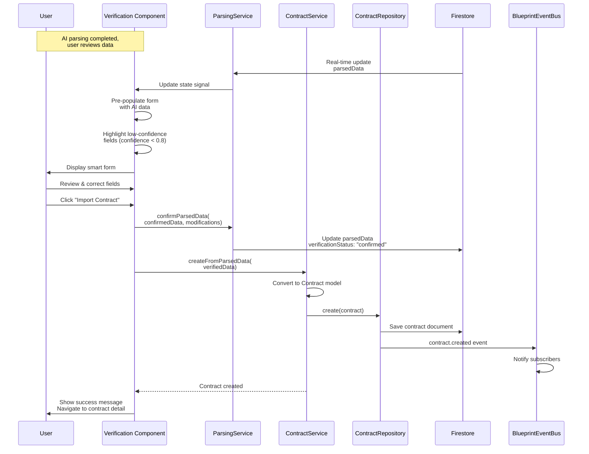

# Contract AI Integration - Architecture Plan

## Executive Summary

This document provides a comprehensive architectural analysis and design for integrating AI-powered contract parsing functionality into the GigHub platform. The solution addresses the current implementation challenges by establishing clear architectural boundaries, optimal responsibility distribution between frontend and backend, and a phased implementation approach.

### Problem Statement

**Current Challenge** (原問題陳述):
- 需要實現: PDF上傳 → functions-ai OCR解析 → 返回結構化JSON → 預覽頁面讓用戶勾選 → 匯入合約
- Current project implementation is encountering difficulties
- Questions:
  1. Should upload be built on storage [functions-storage]?
  2. Which features should be placed in Firebase Functions for better advantage?
  3. What are the architectural bottlenecks?

### Solution Approach

**Architectural Decision**: Hybrid Architecture with Clear Separation of Concerns

1. **Upload**: Use `functions-storage` for file upload orchestration with Firebase Storage as backend
2. **AI Processing**: Use `functions-ai` for Gemini API integration and document parsing
3. **Data Flow**: Angular Frontend → Firebase Storage → Cloud Functions → Firestore → Frontend
4. **User Workflow**: Upload → Parse → Verify (smart form with AI suggestions) → Import

---

## System Context

### System Context Diagram



### Explanation

**System Purpose**:
Enable automated extraction of contract information from PDF documents using Google Gemini AI, with a hybrid human-AI workflow for data verification.

**Key Actors**:
1. **Contract Manager**: Uploads contract PDFs for processing
2. **Contract Reviewer**: Verifies and corrects AI-extracted data before final import

**External Dependencies**:
1. **Firebase Storage**: Secure cloud storage for contract documents
2. **Gemini API**: Google's multimodal AI for document analysis (vision + text extraction)
3. **Firestore**: NoSQL database for parsed contract data and metadata

**Key Interactions**:
1. User uploads PDF → Stored in Firebase Storage → Triggers AI parsing
2. AI extracts structured data → Stored in Firestore → Frontend updates in real-time
3. User verifies data in smart form → Final contract record created

---

## Architecture Overview

### Architectural Pattern: Event-Driven Microservices with Hybrid Processing

**Core Principles**:
1. **Separation of Concerns**: Upload, Storage, AI Processing, and Data Verification are independent
2. **Asynchronous Processing**: File upload and AI parsing are decoupled via events
3. **Hybrid Intelligence**: AI provides suggestions, humans make final decisions
4. **Scalability**: Cloud Functions auto-scale based on demand
5. **Resilience**: Failures in AI parsing don't block manual entry

**Technology Stack**:
- **Frontend**: Angular 20 with Signals for reactive state
- **Backend**: Firebase Cloud Functions (Node.js)
- **Storage**: Firebase Storage for files, Firestore for metadata
- **AI Engine**: Google Gemini 2.5 Flash (vision + structured output)
- **Communication**: Firebase SDK (real-time) + HTTPS Callable Functions

---

## Component Architecture

### Component Diagram



### Component Responsibilities

#### Frontend Components

**1. UploadComponent** (`upload.component.ts`)
- **Responsibility**: Provide file upload interface with drag-drop support
- **Key Features**:
  - File type validation (PDF, JPG, PNG)
  - File size validation (max 10MB)
  - Upload progress tracking
  - Error handling and retry mechanism
- **Dependencies**: UploadService

**2. VerificationComponent** (`verification.component.ts`)
- **Responsibility**: Display AI-parsed data in editable form for human verification
- **Key Features**:
  - Pre-fill form with AI-extracted data
  - Highlight fields with low confidence scores
  - Allow user corrections
  - Show comparison between AI and user values
- **Dependencies**: ParsingService, ContractService

**3. UploadService** (`contract-upload.service.ts`)
- **Responsibility**: Manage file upload lifecycle
- **Key Methods**:
  - `uploadContractFile(file, blueprintId, contractId): Promise<FileAttachment>`
  - `validateFile(file): FileValidationResult`
  - `cancelUpload(fileId): boolean`
- **State Management**: Signals for upload progress and errors

**4. ParsingService** (`contract-parsing.service.ts`)
- **Responsibility**: Manage AI parsing requests and results
- **Key Methods**:
  - `requestParsing(contractId, fileIds): Promise<string>` (returns requestId)
  - `getParsingStatus(requestId): Observable<ParsingStatus>`
  - `confirmParsedData(parsedData, modifications): Promise<void>`
- **State Management**: Signals for parsing state and parsed data

**5. ContractService** (`contract-management.service.ts`)
- **Responsibility**: Create and manage contract records
- **Key Methods**:
  - `createFromParsedData(parsedData): Promise<Contract>`
  - `updateContract(contractId, updates): Promise<void>`
- **Integration**: Uses ContractRepository for data persistence

#### Backend Components (Firebase Functions)

**1. uploadContractFile** (`functions-storage/src/uploadContractFile.ts`)
- **Responsibility**: Orchestrate file upload process
- **Flow**:
  1. Validate file metadata and user permissions
  2. Generate secure file path with UUID
  3. Upload file to Firebase Storage
  4. Create file metadata record in Firestore
  5. Trigger AI parsing (via PubSub event or direct call)
- **Error Handling**: Rollback on failure, update status in Firestore
- **Security**: Verify user authentication and blueprint access

**2. parseContract** (`functions-ai/src/parseContract.ts`)
- **Responsibility**: Coordinate AI-powered contract parsing
- **Flow**:
  1. Receive parsing request (contractId, fileId, blueprintId)
  2. Download file from Firebase Storage
  3. Convert to base64 (for Gemini API)
  4. Call Gemini Vision API with structured output schema
  5. Parse JSON response
  6. Validate extracted data
  7. Save to Firestore with confidence scores
  8. Emit parsing completion event
- **Configuration**:
  - Model: `gemini-2.5-flash` (cost-effective, fast)
  - Temperature: 0.1 (deterministic output)
  - Response Format: JSON mode
  - Timeout: 300 seconds
  - Memory: 1GiB

**3. GeminiClient** (`functions-ai/src/gemini/client.ts`)
- **Responsibility**: Wrapper for Gemini API interactions
- **Key Methods**:
  - `parseDocument(base64File, mimeType, systemPrompt): Promise<ParsedData>`
  - `retryWithBackoff(operation, maxRetries): Promise<T>`
- **Features**:
  - Automatic retry on transient errors
  - Rate limiting and quota management
  - Response validation and sanitization

---

## Deployment Architecture

### Deployment Diagram



### Deployment Strategy

**Environment: Asia-East1 (Taiwan Region)**

**Rationale**:
- Closest to primary users (Taiwan construction industry)
- Lowest latency for file uploads and AI processing
- Data residency compliance

**Infrastructure Components**:

1. **Firebase Hosting**
   - CDN-distributed Angular SPA
   - Automatic SSL/TLS
   - Deploy via `firebase deploy --only hosting`

2. **Cloud Functions**
   - **functions-storage**: 512MB memory, 60s timeout
   - **functions-ai**: 1GiB memory, 300s timeout (longer for AI processing)
   - Auto-scaling: 0-10 instances (cost control)
   - Cold start mitigation: Keep-warm ping (optional)

3. **Firebase Storage**
   - Bucket: `{project-id}.appspot.com`
   - Path structure: `contracts/{blueprintId}/{contractId}/original/{fileId}`
   - Security Rules: User must have access to blueprint
   - Lifecycle: Archive after 1 year (cost optimization)

4. **Firestore**
   - Collection: `blueprints/{blueprintId}/contracts/{contractId}`
   - Subcollection: `parsingRequests/{requestId}`
   - Indexes: Composite index on `blueprintId + status + createdAt`

5. **Gemini API**
   - Endpoint: `generativelanguage.googleapis.com`
   - Model: `gemini-2.5-flash`
   - Authentication: Service account with Vertex AI role
   - Cost: ~$0.00125 per 1K input tokens, ~$0.00375 per 1K output tokens

---

## Data Flow

### Data Flow Diagram



### Data Transformation Pipeline

#### Stage 1: File Upload

**Input**: User-selected PDF file (File object)

**Process**:
1. **Client-side validation**:
   - File type: `application/pdf`, `image/jpeg`, `image/png`
   - File size: max 10MB
   - File name sanitization

2. **Upload to Cloud Function**:
   ```typescript
   const uploadFn = httpsCallable(functions, 'uploadContractFile');
   const result = await uploadFn({
     blueprintId: 'bp-123',
     contractId: 'contract-456',
     fileName: 'PO4510250181.pdf',
     fileType: 'application/pdf',
     fileSize: 2048576
   });
   ```

3. **Storage path generation**:
   ```
   contracts/{blueprintId}/{contractId}/original/{timestamp}-{uuid}-{sanitized-name}.pdf
   ```

4. **Firestore record creation**:
   ```json
   {
     "id": "file-789",
     "fileName": "PO4510250181.pdf",
     "fileType": "application/pdf",
     "fileSize": 2048576,
     "storagePath": "contracts/bp-123/contract-456/original/...",
     "fileUrl": "https://storage.googleapis.com/...",
     "uploadedBy": "user-001",
     "uploadedAt": "2025-12-17T10:30:00Z",
     "parsingStatus": "pending"
   }
   ```

**Output**: `FileAttachment` object with storage URL and metadata

---

#### Stage 2: AI Parsing

**Input**: File path in Firebase Storage

**Process**:
1. **Trigger parsing** (from functions-storage):
   ```typescript
   // Option A: Direct call
   await admin.functions().httpsCallable('parseContract')({
     contractId: 'contract-456',
     fileId: 'file-789',
     blueprintId: 'bp-123'
   });
   
   // Option B: PubSub event (recommended for decoupling)
   await pubsub.topic('contract-parse-requested').publish({
     contractId: 'contract-456',
     fileId: 'file-789',
     blueprintId: 'bp-123'
   });
   ```

2. **Download and encode**:
   ```typescript
   const file = bucket.file(storagePath);
   const [buffer] = await file.download();
   const base64 = buffer.toString('base64');
   ```

3. **Gemini API call** with structured output:
   ```typescript
   const model = genAI.getGenerativeModel({
     model: "gemini-2.5-flash",
     generationConfig: {
       temperature: 0.1,
       responseMimeType: "application/json",
       responseSchema: EnhancedContractParsingOutputSchema
     }
   });
   
   const result = await model.generateContent({
     contents: [{
       role: "user",
       parts: [
         { inlineData: { data: base64, mimeType: 'application/pdf' } },
         { text: "請分析這份合約文件並提取結構化資料" }
       ]
     }],
     systemInstruction: ENHANCED_PARSING_SYSTEM_PROMPT
   });
   ```

4. **Parse and validate response**:
   ```typescript
   const parsedData: EnhancedContractParsingOutput = JSON.parse(result.response.text());
   
   // Validate required fields
   if (!parsedData.contractNumber || !parsedData.currency) {
     throw new Error('Missing required fields');
   }
   
   // Validate financial calculations
   const calculatedTotal = parsedData.workItems.reduce(
     (sum, item) => sum + item.totalPrice, 0
   );
   if (Math.abs(calculatedTotal - parsedData.totalAmount) > 1) {
     console.warn('Financial mismatch detected', {
       declared: parsedData.totalAmount,
       calculated: calculatedTotal
     });
   }
   ```

5. **Save to Firestore**:
   ```typescript
   await firestore.collection('contracts').doc(contractId).update({
     parsedData: {
       parsingEngine: 'gemini-2.5-flash',
       parsedAt: new Date(),
       confidence: parsedData.confidence,
       extractedData: parsedData,
       needsVerification: parsedData.confidence < 0.8
     },
     parsingStatus: 'completed'
   });
   ```

**Output**: `EnhancedContractParsingOutput` stored in Firestore

---

#### Stage 3: Data Verification

**Input**: AI-parsed data from Firestore (real-time update)

**Process**:
1. **Frontend receives update**:
   ```typescript
   this.parsingService.parsedData.subscribe(data => {
     if (data) {
       this.prePopulateForm(data);
       this.highlightLowConfidenceFields(data);
     }
   });
   ```

2. **Smart form pre-population**:
   ```typescript
   private prePopulateForm(parsed: EnhancedContractParsingOutput): void {
     this.contractForm.patchValue({
       contractNumber: parsed.contractNumber,
       title: parsed.title,
       currency: parsed.currency,
       totalAmount: parsed.totalAmount,
       startDate: parsed.startDate,
       endDate: parsed.endDate,
       owner: {
         name: parsed.owner.name,
         contactPerson: parsed.owner.contactPerson,
         taxId: parsed.owner.taxId
       },
       contractor: {
         name: parsed.contractor.name,
         taxId: parsed.contractor.taxId
       }
     });
     
     // Mark fields with low confidence
     if (parsed.confidence < 0.8) {
       this.formFieldsConfidence = {
         contractNumber: parsed.fieldConfidences?.contractNumber ?? 1.0,
         currency: parsed.fieldConfidences?.currency ?? 1.0,
         // ...
       };
     }
   }
   ```

3. **User review and corrections**:
   - Editable form fields
   - Visual indicators for low-confidence fields (yellow background)
   - Side-by-side comparison (AI value vs corrected value)
   - Validation on user input

**Output**: Verified `ContractCreateRequest` DTO

---

#### Stage 4: Contract Import

**Input**: Verified contract data

**Process**:
1. **Convert to domain model**:
   ```typescript
   const contract: Contract = {
     id: contractId,
     blueprintId: blueprintId,
     contractNumber: verifiedData.contractNumber,
     title: verifiedData.title,
     description: verifiedData.description,
     
     owner: {
       id: `owner-${Date.now()}`,
       name: verifiedData.owner.name,
       type: 'owner',
       contactPerson: verifiedData.owner.contactPerson,
       contactPhone: verifiedData.owner.contactPhone,
       address: verifiedData.owner.address,
       taxId: verifiedData.owner.taxId
     },
     
     contractor: { /* similar structure */ },
     
     totalAmount: verifiedData.totalAmount,
     currency: verifiedData.currency,
     
     workItems: verifiedData.workItems.map(item => ({
       id: `work-${Date.now()}-${item.code}`,
       code: item.code,
       title: item.title,
       quantity: item.quantity,
       unit: item.unit,
       unitPrice: item.unitPrice,
       totalPrice: item.totalPrice,
       status: 'pending'
     })),
     
     status: 'draft',
     createdBy: userId,
     createdAt: new Date(),
     updatedAt: new Date()
   };
   ```

2. **Save to repository**:
   ```typescript
   await this.contractRepository.create(blueprintId, contract);
   ```

3. **Emit events**:
   ```typescript
   this.eventService.emitContractCreated(blueprintId, contractId);
   ```

**Output**: Complete `Contract` record in Firestore

---

### Data Schema

#### EnhancedContractParsingOutput

```typescript
interface EnhancedContractParsingOutput {
  // Basic Information
  contractNumber: string;              // REQUIRED
  title: string;                       // REQUIRED
  description?: string;
  
  // Parties
  owner: ContractParty;                // REQUIRED
  contractor: ContractParty;           // REQUIRED
  
  // Financial
  totalAmount: number;                 // REQUIRED
  currency: string;                    // REQUIRED (TWD, USD, etc.)
  tax?: number;
  totalAmountWithTax?: number;
  
  // Dates (ISO 8601 format: YYYY-MM-DD)
  signedDate?: string;
  startDate?: string;                  // REQUIRED
  endDate?: string;                    // REQUIRED
  
  // Work Items
  workItems: WorkItemSchema[];         // REQUIRED, min 1
  
  // Terms
  terms?: ContractTerm[];
  
  // Metadata
  confidence: number;                  // 0-1 scale
  extractedFrom: 'gemini-2.5-flash';
  parsedAt: string;                    // ISO 8601 timestamp
  
  // Field-level confidence (optional)
  fieldConfidences?: {
    contractNumber?: number;
    currency?: number;
    totalAmount?: number;
    // ...
  };
}

interface ContractParty {
  name: string;                        // REQUIRED
  contactPerson?: string;
  contactPhone?: string;
  contactEmail?: string;
  address?: string;
  taxId?: string;
  businessNumber?: string;
}

interface WorkItemSchema {
  code?: string;
  title: string;                       // REQUIRED
  description?: string;
  quantity: number;                    // REQUIRED
  unit?: string;                       // e.g., "式", "EA", "台"
  unitPrice: number;                   // REQUIRED
  totalPrice: number;                  // REQUIRED
  discount?: number;
  remarks?: string;
  category?: string;
  subWorkItems?: WorkItemSchema[];     // Recursive for sub-items
}

interface ContractTerm {
  title: string;
  content: string;
  category: 'payment' | 'warranty' | 'delivery' | 'penalty' | 'other';
}
```

---

## Key Workflows

### Sequence Diagram: Contract Upload and Parsing



### Sequence Diagram: Data Verification and Import



---

## Phased Development

Given the complexity of the full AI integration, we recommend a **phased approach** to minimize risk and deliver value incrementally.

### Phase 1: MVP (Minimal Viable Product) - Week 1-2

**Goal**: Establish core upload → parse → manual verify workflow

**Scope**:
- ✅ File upload to Firebase Storage via functions-storage
- ✅ Basic AI parsing with Gemini 2.5 Flash
- ✅ Extract core fields only (contractNumber, title, owner, contractor, totalAmount, currency)
- ✅ Simple verification form (no smart suggestions)
- ✅ Manual contract creation from form data

**Components**:
1. `functions-storage/src/uploadContractFile.ts` - Upload orchestration
2. `functions-ai/src/parseContract.ts` - Basic AI parsing
3. `contract-upload.component.ts` - File upload UI
4. `contract-verification.component.ts` - Simple form
5. `contract-parsing.service.ts` - Parsing state management

**Success Criteria**:
- [ ] User can upload PDF
- [ ] File stored in Firebase Storage
- [ ] AI extracts 5+ core fields with 60% accuracy
- [ ] User can review and manually correct data
- [ ] Contract record created in Firestore

**Estimated Effort**: 5-8 days

---

### Phase 2: Enhanced Parsing - Week 3-4

**Goal**: Improve field coverage and accuracy

**Enhancements**:
- ✅ Expand extracted fields to 15+ (dates, work items, terms)
- ✅ Implement enhanced system prompt with Taiwan contract formats
- ✅ Add field-level confidence scores
- ✅ Smart form with pre-population and confidence indicators
- ✅ Financial calculation validation

**New Components**:
1. `enhanced-parsing-prompt.ts` - Detailed system prompt
2. `parsing-validator.ts` - Data validation utilities
3. `smart-verification-form.component.ts` - Enhanced UI with confidence indicators

**Success Criteria**:
- [ ] Field coverage: 60-70% of Contract model
- [ ] Critical fields: 100% extraction rate (contractNumber, currency, dates)
- [ ] Taiwan format conversion: correct handling of ROC dates, Chinese numbers
- [ ] Financial validation: detect mismatches between declared and calculated totals
- [ ] User experience: clear visual indicators for low-confidence fields

**Estimated Effort**: 5-10 days

---

### Phase 3: Production Optimization - Week 5-6

**Goal**: Production-ready performance, reliability, and monitoring

**Enhancements**:
- ✅ Error handling and retry mechanisms
- ✅ Performance optimization (caching, batching)
- ✅ Monitoring and logging
- ✅ Cost optimization (Gemini API usage tracking)
- ✅ Security hardening (file validation, access control)

**Infrastructure**:
1. Cloud Monitoring dashboards
2. Error alerting (Cloud Logging + Email/Slack)
3. Cost tracking (BigQuery export)
4. Security rules refinement

**Success Criteria**:
- [ ] Parsing success rate: >85%
- [ ] Average processing time: <30 seconds per 10-page PDF
- [ ] Error rate: <5%
- [ ] Cost per document: <$0.005 USD
- [ ] Security: No unauthorized access to files/data

**Estimated Effort**: 5-8 days

---

### Phase 4: Advanced Features (Future)

**Potential Enhancements** (not in current scope):
- Batch processing (multiple files at once)
- Handwritten contract recognition
- Multi-language support (English, Japanese)
- Few-shot learning with user feedback
- Model upgrade to Gemini 2.0 Pro
- Custom fine-tuned model for construction contracts

---

## Non-Functional Requirements Analysis

### Scalability

**Current Design**:
- Cloud Functions auto-scale from 0 to 10 instances (configurable)
- Gemini API has quota limits (check GCP Console for project limits)
- Firebase Storage and Firestore scale automatically

**Bottlenecks**:
1. **Gemini API Quota**: Default 10 requests/minute (can request increase)
2. **Cloud Function Cold Starts**: 1-3 seconds initial delay
3. **Large File Processing**: 10MB PDFs may take 20-30 seconds

**Mitigation Strategies**:
1. **Quota Management**:
   - Implement request queue with rate limiting
   - Request quota increase from Google Cloud if needed
   - Use exponential backoff on rate limit errors

2. **Cold Start Optimization**:
   - Keep functions warm with periodic pings (optional)
   - Use minimum instances = 1 for critical functions (costs $)

3. **Large File Handling**:
   - Set realistic timeout (300s for ai function)
   - Show progress indicators to users
   - Implement chunked processing for very large documents (future)

**Scaling Projections**:

| Metric | Current | 6 Months | 12 Months |
|--------|---------|----------|-----------|
| Active Users | 10-20 | 100 | 500 |
| Contracts/Month | 50 | 500 | 2,000 |
| API Calls/Month | 100 | 1,000 | 4,000 |
| Storage (GB) | 5 | 50 | 200 |

**Cost Estimate** (at 12 months):
- Firebase Storage: ~$5/month
- Firestore: ~$10/month
- Cloud Functions: ~$20/month
- Gemini API: ~$5/month (at $0.00125 per 1K tokens)
- **Total**: ~$40/month

---

### Performance

**Target Metrics**:

| Metric | Target | Acceptable | Unacceptable |
|--------|--------|-----------|--------------|
| File Upload | <5s | <10s | >15s |
| AI Parsing | <20s | <40s | >60s |
| Form Load | <1s | <2s | >3s |
| Contract Save | <2s | <5s | >10s |

**Optimization Strategies**:

1. **Upload Performance**:
   - Use resumable uploads for files >5MB
   - Client-side compression before upload (future)
   - Parallel chunk uploads (future)

2. **AI Parsing Performance**:
   - Use Gemini 2.5 Flash (faster, cheaper than Pro)
   - Optimize system prompt length (currently ~2K tokens)
   - Cache parsing results (avoid re-parsing same file)

3. **Frontend Performance**:
   - Lazy load verification component
   - Virtual scrolling for work items list (>100 items)
   - Debounce user input validation

4. **Database Performance**:
   - Composite indexes for common queries
   - Denormalize frequently accessed data
   - Use batch writes for bulk operations

**Performance Monitoring**:
- Cloud Monitoring: Track function execution time, error rate
- Real User Monitoring (RUM): Track frontend performance metrics
- Custom logging: Log AI response times, confidence scores

---

### Security

**Threat Model**:

1. **Unauthorized File Access**
   - Threat: User A accesses User B's contract files
   - Mitigation: Firebase Storage Security Rules based on blueprintId
   ```javascript
   match /contracts/{blueprintId}/{contractId}/{allPaths=**} {
     allow read, write: if request.auth != null
       && firestore.get(/databases/(default)/documents/blueprints/$(blueprintId)).data.members[request.auth.uid] != null;
   }
   ```

2. **Malicious File Upload**
   - Threat: User uploads executable or malware disguised as PDF
   - Mitigation:
     - Client-side: Check file MIME type and extension
     - Server-side: Validate file headers (magic bytes)
     - Virus scanning (future): Cloud Storage malware detection

3. **Data Injection via AI**
   - Threat: Malicious PDF with embedded scripts in extracted text
   - Mitigation:
     - Sanitize all AI-extracted strings before saving
     - Use parameterized Firestore writes (automatic escaping)
     - Validate data types and ranges

4. **API Key Exposure**
   - Threat: Gemini API key leaked in client-side code
   - Mitigation:
     - Store API key in Cloud Functions environment variables
     - Never expose in frontend code
     - Rotate keys quarterly

5. **Denial of Service**
   - Threat: User floods system with large files
   - Mitigation:
     - Rate limiting: Max 10 uploads per user per hour
     - File size limit: 10MB per file
     - Cloud Functions concurrency limit: Max 10 instances

**Security Checklist**:
- [ ] Firebase Storage Security Rules configured
- [ ] Firestore Security Rules configured
- [ ] API keys stored in environment variables (not in code)
- [ ] File upload validation (type, size, content)
- [ ] User authentication required for all operations
- [ ] Input sanitization on all AI-extracted data
- [ ] HTTPS enforced for all communications
- [ ] Regular security audits and dependency updates

---

### Reliability

**Target SLA**: 99.5% uptime (monthly)

**Failure Modes and Recovery**:

1. **Gemini API Failure**
   - Failure: API returns 500 error or times out
   - Detection: HTTP error response from Gemini
   - Recovery:
     - Retry with exponential backoff (3 attempts)
     - If all retries fail, mark parsing as "failed"
     - Allow user to retry manually or skip to manual entry
   - Fallback: User can always enter data manually

2. **Firebase Storage Failure**
   - Failure: File upload fails or file becomes inaccessible
   - Detection: Storage API throws error
   - Recovery:
     - Retry upload (client-side)
     - Show error message to user
     - Log error for admin review
   - Fallback: User can re-upload file

3. **Cloud Function Crash**
   - Failure: Function throws unhandled exception
   - Detection: Function runtime logs error
   - Recovery:
     - Automatic restart by Cloud Functions
     - Update parsing status to "failed" in Firestore
     - Send alert to admin (Cloud Monitoring)
   - Fallback: User notified via UI, can retry

4. **Firestore Write Failure**
   - Failure: Network error or quota exceeded
   - Detection: Firestore SDK throws error
   - Recovery:
     - Retry with exponential backoff
     - If persistent, log error and alert admin
   - Fallback: Data cached temporarily in function memory

**Monitoring and Alerting**:
- Cloud Monitoring: Function error rate, execution time
- Cloud Logging: Detailed error logs with stack traces
- Uptime checks: Ping test endpoint every 5 minutes
- Alerting policy: Email/Slack notification if error rate >5%

**Disaster Recovery**:
- Firestore: Automatic daily backups (7-day retention)
- Storage: Versioning enabled (recover deleted files)
- Functions: Deploy from version-controlled source (Git)
- RTO (Recovery Time Objective): 4 hours
- RPO (Recovery Point Objective): 24 hours

---

### Maintainability

**Code Organization**:

```
functions-storage/
├── src/
│   ├── uploadContractFile.ts      # Main upload function
│   ├── validators/
│   │   └── fileValidator.ts       # File validation logic
│   └── utils/
│       └── pathGenerator.ts       # Storage path utilities
└── package.json

functions-ai/
├── src/
│   ├── parseContract.ts           # Main parsing function
│   ├── gemini/
│   │   ├── client.ts              # Gemini API wrapper
│   │   └── prompts.ts             # System prompts
│   ├── validators/
│   │   └── parsingValidator.ts    # Parsed data validation
│   └── types/
│       └── parsingOutput.ts       # TypeScript interfaces
└── package.json

src/app/core/blueprint/modules/implementations/contract/
├── services/
│   ├── contract-upload.service.ts
│   ├── contract-parsing.service.ts
│   └── contract-management.service.ts
├── components/
│   ├── upload/
│   └── verification/
└── models/
    └── contract.model.ts
```

**Documentation Requirements**:
- [ ] README for each Cloud Function with setup instructions
- [ ] API documentation for all public functions
- [ ] Architecture diagrams (this document)
- [ ] Deployment guide with step-by-step instructions
- [ ] Troubleshooting guide for common issues

**Testing Strategy**:
- Unit tests: 80% coverage target (Jest for functions, Jasmine for Angular)
- Integration tests: Test full workflow end-to-end
- Manual testing: Test with real contract samples

**Dependency Management**:
- Lock file: Use `package-lock.json` or `yarn.lock`
- Version pinning: Pin major versions, allow minor updates
- Security updates: Run `npm audit` weekly
- Update schedule: Review and update dependencies monthly

---

## Risks and Mitigations

### Technical Risks

| Risk | Impact | Probability | Mitigation |
|------|--------|-------------|-----------|
| Gemini API quota exhaustion | High | Low | Implement queue with rate limiting; request quota increase |
| AI extraction accuracy < 60% | High | Medium | Enhance system prompt; add few-shot examples; use Pro model |
| Large PDF processing timeout | Medium | Medium | Increase timeout to 300s; optimize image compression |
| Cloud Functions cold start latency | Medium | Medium | Keep functions warm; use minimum instances |
| Cost overrun from AI API usage | Medium | Low | Monitor costs daily; set billing alerts; optimize prompt length |
| Security breach (file access) | High | Low | Strict Security Rules; regular audits; penetration testing |
| Data loss (Firestore/Storage) | High | Very Low | Automatic backups; versioning; disaster recovery plan |

### Business Risks

| Risk | Impact | Probability | Mitigation |
|------|--------|-------------|-----------|
| User resistance to AI-assisted workflow | Medium | Medium | Provide manual entry option; clear value proposition; training |
| Taiwan-specific format handling errors | High | Medium | Extensive testing with real contracts; user feedback loop |
| Regulatory compliance issues (data privacy) | High | Low | Ensure GDPR/PDPA compliance; data retention policies |

---

## Technology Stack Recommendations

### Approved Technologies (Already in Use)

✅ **Frontend**:
- Angular 20 with Signals
- ng-alain framework
- Firebase SDK (Auth, Firestore, Storage, Functions)
- TypeScript 5.x

✅ **Backend**:
- Firebase Cloud Functions (Node.js 20)
- Firebase Admin SDK
- Google Cloud Storage
- Firestore

✅ **AI/ML**:
- Google Gemini API (Gemini 2.5 Flash)

### Recommended Additions

**For Phase 1-2** (Approved):
- `@google/generative-ai`: Official Gemini SDK for Node.js
- `zod`: Runtime type validation for AI responses (optional)

**For Phase 3** (Future Consideration):
- `@google-cloud/storage`: Advanced Storage operations
- `@google-cloud/monitoring`: Custom metrics
- `pino`: Structured logging library

**Not Recommended** (Avoid Complexity):
- ❌ LangChain: Over-engineered for our use case
- ❌ Custom ML models: Use managed Gemini instead
- ❌ Additional databases: Firestore is sufficient

---

## Next Steps

### Immediate Actions (Week 1)

**For Backend Team**:
1. ✅ Set up `functions-storage` and `functions-ai` packages
2. ✅ Configure Gemini API access (service account, API key)
3. ✅ Implement `uploadContractFile` function (basic version)
4. ✅ Implement `parseContract` function (basic version)
5. ✅ Deploy functions to `asia-east1` region

**For Frontend Team**:
1. ✅ Create `UploadComponent` with file selection UI
2. ✅ Implement `UploadService` with Firebase Storage integration
3. ✅ Create `ParsingService` with real-time Firestore subscription
4. ✅ Build basic verification form

**For DevOps**:
1. ✅ Configure Firebase Storage Security Rules
2. ✅ Set up Cloud Monitoring for functions
3. ✅ Configure billing alerts
4. ✅ Set up error logging and alerting

### Definition of Done

**Phase 1 Complete When**:
- [ ] User can upload PDF contract via UI
- [ ] File stored in Firebase Storage with correct path structure
- [ ] Cloud Function triggers and calls Gemini API successfully
- [ ] AI extracts at least 5 core fields (contractNumber, title, owner, contractor, totalAmount)
- [ ] Parsed data saved to Firestore
- [ ] Frontend displays parsed data in verification form
- [ ] User can manually correct data and create contract
- [ ] All unit tests pass
- [ ] Manual E2E test with real contract successful

### Success Metrics (After Phase 2)

**Quantitative**:
- Field extraction coverage: ≥60%
- Critical field extraction rate: 100% (contractNumber, currency, dates)
- User acceptance rate: ≥80% (users accept AI data without major corrections)
- Average processing time: <30 seconds per document
- Error rate: <10%

**Qualitative**:
- User feedback: "AI suggestions save me time"
- Developer feedback: "Code is maintainable and well-documented"
- Stakeholder feedback: "ROI is positive (time saved > implementation cost)"

---

## Conclusion

This architecture plan provides a **clear, phased approach** to implementing AI-powered contract parsing in the GigHub platform. By following these guidelines:

1. **Upload via functions-storage**: Centralized upload orchestration with validation
2. **AI parsing via functions-ai**: Decoupled AI processing with Gemini 2.5 Flash
3. **Hybrid workflow**: AI provides suggestions, humans make final decisions
4. **Phased delivery**: MVP in 2 weeks, production-ready in 6 weeks

**Key Architectural Decisions**:
- ✅ Use Firebase Storage for file persistence (not inline base64)
- ✅ Use Cloud Functions for both upload orchestration and AI processing
- ✅ Decouple upload and parsing via async triggers (PubSub or direct call)
- ✅ Implement smart verification form with AI pre-population
- ✅ Target Gemini 2.5 Flash for cost-effectiveness and speed

**Addressing Original Questions**:
1. **Should upload be in functions-storage?** → **YES**, for centralized orchestration, validation, and triggering AI parsing
2. **Which features in Functions?** → **Upload orchestration, AI parsing, data validation** (not simple file uploads, not UI logic)
3. **What are the problems?** → **Mixed responsibilities, unclear data flow, missing verification step**

This plan ensures a **scalable, maintainable, and cost-effective** solution that delivers value quickly while maintaining architectural quality.

---

**Document Version**: 1.0  
**Author**: Senior Cloud Architect (GitHub Copilot)  
**Date**: 2025-12-17  
**Review Status**: Ready for Implementation
