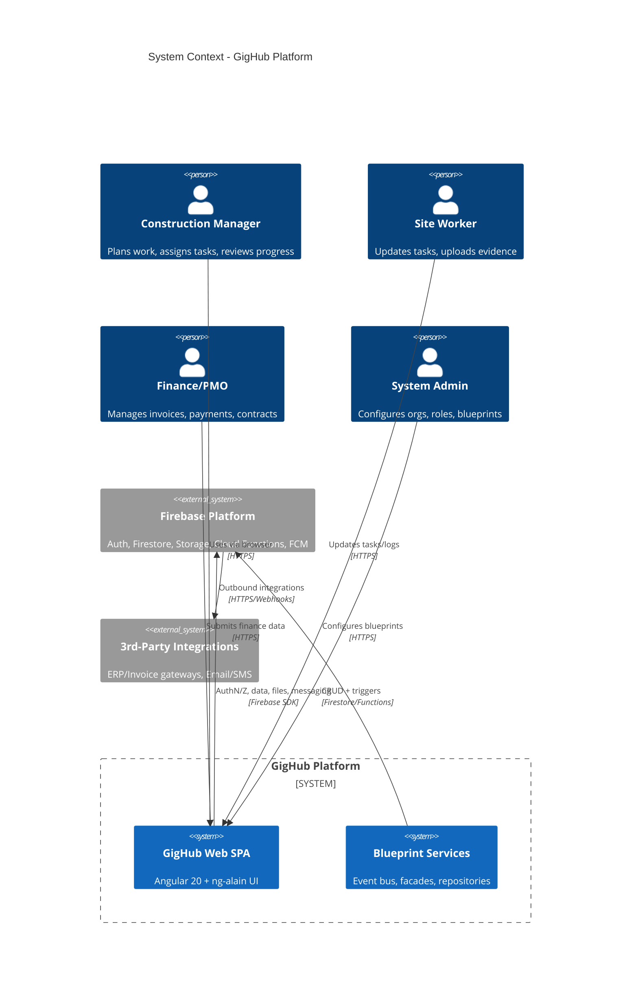
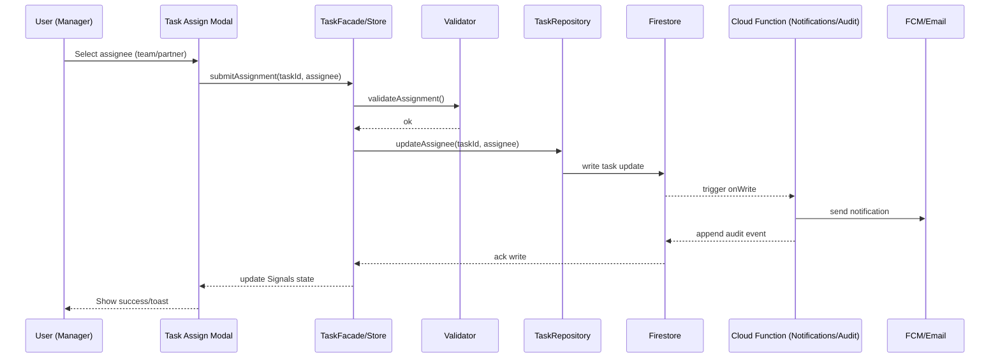
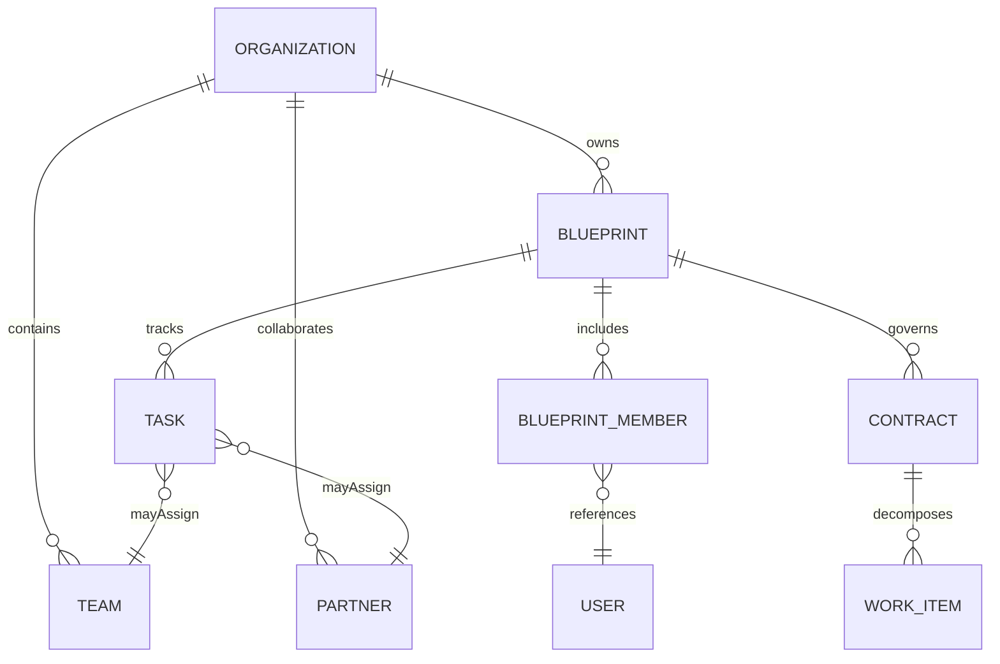

# GigHub - Architecture Plan

## Executive Summary
GigHub is an enterprise-grade construction progress tracking platform built on Angular 20, Firebase, and the ng-alain/ng-zorro stack. The system follows a strict three-layer model (UI → Service/Facade → Repository → Firebase) with an event-driven Blueprint architecture for modular business capabilities (tasks, finance, contracts, QA, cloud files, etc.). The current build errors in `error.md` (unused imports/parameters across multiple modules) signal technical debt that impacts build reliability and maintainability. This document presents the target architecture, phased evolution, and a remediation plan to close the identified gaps.

---

## System Context


**Overview**: Shows GigHub’s position between users and Firebase services with optional third-party integrations.  
**Key Components**: Browsers, SPA, Blueprint services, Firebase (Auth/Firestore/Storage/Functions/FCM), external ERP/email/SMS.  
**Relationships**: Users interact with SPA; SPA and services rely on Firebase for identity, data, storage, and messaging; Functions bridge to third parties.  
**Design Decisions**: Firebase-first (managed auth/data), SPA for responsive UX, modular Blueprint boundary for multi-tenant isolation.  
**NFR Considerations**: Scalability via Firebase elasticity; performance via CDN + client rendering; security via Firebase Auth/Security Rules; reliability via managed services; maintainability via modular Blueprint plug-ins.  
**Trade-offs**: Vendor lock-in to Firebase; complex rule management; offline support deferred.  
**Risks/Mitigations**: Rule misconfiguration → enforce rule tests; integration failures → retries/Dead Letter; auth outage → graceful degradation with cached session.

---

## Architecture Overview
- **Pattern**: Three-layer architecture with Repository pattern; event-driven Blueprint modules; Signals-based state.  
- **Boundaries**: UI (standalone components) → Services/Facades/Stores → Repositories → Firebase.  
- **Cross-cutting**: Security Rules, logging/observability, feature flags, background jobs (scheduler Functions).  
- **Error posture**: Treat unused symbols and dead code (as listed in `error.md`) as hygiene debt; enforce lint gates to keep builds green.

---

## Component Architecture
```mermaid
flowchart LR
    subgraph UI["Presentation (Angular SPA)"]
        shell[Shell/Layout]
        modules[Blueprint Modules\n(Tasks, Finance, Contracts, QA, Cloud, Warranty, Explore)]
        shared[Shared Components\n(Forms, Tables, Charts)]
    end

    subgraph Services["Business Layer"]
        facades[Facades/Stores\n(Signals + Effects)]
        eventBus[Enhanced Event Bus\n(Blueprint Events)]
        authSvc[Auth/Permission Service]
        validation[Domain Validators]
    end

    subgraph Data["Data Access Layer"]
        repos[Repositories (Firestore/Storage)]
        dto[DTO Mappers & Guards]
    end

    subgraph Firebase["Backend (Managed)"]
        firestore[Firestore]
        storage[Cloud Storage]
        functions[Cloud Functions\n(AI, Integration, Scheduler, Event, Governance)]
        fcm[FCM]
    end

    shell --> modules --> facades --> repos --> firestore
    shared --> modules
    facades --> eventBus
    facades --> authSvc
    repos --> storage
    functions --> firestore
    functions --> storage
    facades --> functions
    functions --> fcm
```

**Overview**: Highlights major components and their dependencies across presentation, business, and data layers.  
**Key Components**: Shell/layout, Blueprint feature modules, facades/stores (Signals), event bus, auth/permission, repositories/mappers, Firebase services, Cloud Functions families.  
**Relationships**: UI drives facades; facades call repositories and event bus; repositories abstract Firebase; Functions extend server logic and integrations.  
**Design Decisions**: Signals for UI reactivity; repositories to isolate Firebase SDK; event bus for decoupled module comms.  
**NFR Considerations**: Scalability via stateless facades and managed Firebase; performance through Signals and targeted queries; security via permission service + Security Rules; reliability via Functions retries and idempotent repos; maintainability via clear layering.  
**Trade-offs**: More indirection vs. speed of development; event bus complexity vs. decoupling.  
**Risks/Mitigations**: Event storm → apply topic scoping and backpressure; repository drift → shared base repo and lint rules; unused-code errors → enforce linting and remove dead code.

---

## Deployment Architecture
```mermaid
flowchart TB
    users[Users (Managers/Workers/Admins)] -->|HTTPS| cdn[Firebase Hosting + CDN]
    cdn --> spa[Angular SPA]
    spa -->|SDK| firestore[Firestore (Prod/Stg/Dev)]
    spa -->|SDK| storage[Cloud Storage]
    spa -->|SDK| auth[Firebase Auth]
    spa -->|FCM| fcm[Cloud Messaging]
    firestore <--> functions[Cloud Functions (ai, integration, scheduler, event, governance, observability)]
    storage <--> functions
    functions --> thirdParty[ERP/Email/SMS/AI endpoints]
    subgraph Monitoring
        logs[Cloud Logging]
        traces[Cloud Trace/Metrics]
    end
    functions --> logs
    spa --> traces
```

**Overview**: Logical deployment across Firebase managed services with environment separation.  
**Key Components**: Hosting/CDN, SPA, Auth, Firestore, Storage, FCM, Cloud Functions suites, third-party endpoints, logging/metrics.  
**Relationships**: SPA served via CDN; SDK calls to Auth/Firestore/Storage/FCM; Functions triggered by HTTP or Firestore events; integrations outbound from Functions.  
**Design Decisions**: Fully serverless to minimize ops; environment parity (dev/stg/prod) with config isolation; centralized observability.  
**NFR Considerations**: Scalability via Firebase autoscale; performance via CDN and indexed queries; security via Auth + Security Rules + IAM per Function; reliability via multi-region Firestore/Storage and Function retries; maintainability via IaC (firebase.json/apphosting.yaml) and environment-specific configs.  
**Trade-offs**: Limited control over infra vs. low ops; cold starts for Functions mitigated with scheduler warm-ups.  
**Risks/Mitigations**: Region misalignment → standardize region; missing indexes → maintain firestore.indexes.json; secrets exposure → use environment config and Secret Manager.

---

## Data Flow
```mermaid
flowchart LR
    actor[User in SPA]
    ui[Task/Finance/Contract UI]
    facade[Facade/Store (Signals)]
    validator[Domain Validator]
    repo[Repository]
    fs[Firestore]
    fn[Cloud Function Trigger]
    storage[Cloud Storage]
    audit[Audit/Event Stream]

    actor --> ui --> facade --> validator --> repo --> fs
    fs --> fn --> audit
    repo --> storage
    facade --> ui
```

**Overview**: End-to-end data movement for a typical record change (e.g., task assignment or invoice upload).  
**Key Components**: UI, Signals-based facades, validators, repositories, Firestore, trigger Functions, Storage, audit stream.  
**Relationships**: UI actions propagate through facades/validators to repositories, which persist to Firestore/Storage; triggers emit audit/events.  
**Design Decisions**: Validation in facades to reduce bad writes; repositories centralize mapping; triggers enforce cross-entity integrity (e.g., numbering, notifications).  
**NFR Considerations**: Performance via minimal round-trips and indexed queries; security via input validation + Security Rules; reliability via idempotent writes and trigger retries; maintainability via shared validators and mappers.  
**Trade-offs**: More client validation vs. duplication with Security Rules; trigger complexity vs. centralized enforcement.  
**Risks/Mitigations**: Inconsistent validation → shared schemas; trigger failures → DLQ/alerting; oversized payloads → enforce limits and chunk uploads.

---

## Key Workflows
### Sequence: Task Assignment to a Team/Partner


**Overview**: Illustrates the critical assignment workflow with validation, persistence, and notification.  
**Key Components**: UI modal, facade/store, validator, repository, Firestore, Function triggers, messaging.  
**Relationships**: UI drives facade; facade validates then writes via repo; Firestore triggers Functions that notify and audit.  
**Design Decisions**: Client-side validation before writes; server-side audit via trigger for compliance; Signals for immediate UI feedback.  
**NFR Considerations**: Performance via optimistic UI updates; security via role/permission checks and Rules; reliability via Function retries; maintainability via centralized facade/repo patterns.  
**Trade-offs**: Slight duplication of validation vs. reduced failed writes; trigger latency vs. guaranteed audit.  
**Risks/Mitigations**: Notification failures → retry/backoff; concurrent edits → use transactions or versioning.

---

## Additional Diagrams
### ERD (Simplified) for Blueprint Membership & Work Items


**Overview**: Captures core entities governing access and work decomposition.  
**Key Components**: Organization, Blueprint, members, tasks, contracts, work items, teams/partners/users.  
**Relationships**: Blueprint scoped membership controls task/contract/work-item access.  
**Design Decisions**: Dedicated membership entity to enforce multi-tenant isolation and role-based permissions.  
**NFR Considerations**: Security via explicit membership; maintainability via clear ownership boundaries; scalability by avoiding polymorphic blobs.  
**Trade-offs**: Additional joins/queries vs. explicit clarity; requires composite indexes.  
**Risks/Mitigations**: Membership drift → periodic reconciliation; index gaps → maintain indexes file.

---

## Phased Development
### Phase 1: Initial Implementation (MVP)
- Focus: Tasks, Logs, Cloud files; core membership and permissions.  
- Data: Basic Firestore schemas, minimal Functions (audit, notifications).  
- Quality: Enforce lint to eliminate unused imports/parameters (errors in `error.md`), keep build green.  
- Observability: Basic logging + crash reporting.

### Phase 2+: Final Architecture (Target)
- Full module coverage (Finance, Contracts, QA/Warranty, Explore).  
- Optimizations: Indexed queries, caching in facades, lazy-loaded blueprints, backpressure on event bus.  
- Reliability: DLQ for Functions, synthetic checks, perf budgets.  
- Security: Complete Security Rules coverage and rule tests; scoped tokens for integrations.  
- Developer Productivity: Pre-commit lint to block unused symbols; automated cleanup scripts; CI gates.

### Migration Path
1. **Stabilize builds**: Remove unused imports/parameters flagged in `error.md`; enable TypeScript `noUnusedLocals`/`noUnusedParameters` in tsconfig and lint gates.  
2. **Align modules**: Normalize repo usage (Repositories only in services), refactor dead dependencies.  
3. **Enhance observability**: Add metrics/traces for Functions and critical facades.  
4. **Scale features**: Gradually roll out advanced modules with feature flags; backfill data migrations through Functions.

---

## Non-Functional Requirements Analysis
### Scalability
- Serverless Firebase stack scales elastically; stateless Angular SPA; CDN delivery.  
- Use paginated/indexed Firestore queries; cache in Signals-based stores; batch writes for bulk ops.

### Performance
- Signals for fine-grained UI updates; OnPush change detection; lazy route loading.  
- Optimize Firestore reads with projections and composite indexes; defer heavy Functions; warm critical Functions.

### Security
- Firebase Auth + Firestore/Storage Security Rules; permission checks in services; input validation and escape.  
- Secrets via environment/Secret Manager; least-privilege IAM for Functions; audit trails via triggers.

### Reliability
- Functions retries with idempotent writes; backups via export; multi-region configuration where needed.  
- Circuit breakers for third-party calls; monitoring/alerting on latency/error budgets.

### Maintainability
- Strict layering; repository pattern; shared validators/mappers; comprehensive lint (including unused symbol cleanup).  
- Documentation in `/docs`; consistent naming; pre-commit hooks to prevent regressions.

---

## Risks and Mitigations
| Risk | Impact | Mitigation |
|------|--------|------------|
| Unused imports/parameters (error.md) block builds | High | Enforce `noUnusedLocals/Parameters`, remove dead code, auto-fix via lint; add CI gate |
| Event bus overload | Medium | Topic scoping, debounce/backpressure, monitoring |
| Missing Firestore indexes | Medium | Maintain `firestore.indexes.json`, add rule tests |
| Integration failures | Medium | Retries with backoff, DLQ, circuit breakers |
| Security rule gaps | High | Rule tests, principle of least privilege, periodic reviews |
| Function cold starts | Low | Warmers for latency-critical endpoints |

---

## Technology Stack Recommendations
- **Frontend**: Angular 20, ng-alain/ng-zorro, Signals, new control flow; strict TypeScript with unused checks enabled.  
- **Backend**: Firebase Auth, Firestore, Storage, Cloud Functions (ai/integration/scheduler/event/governance/observability).  
- **Observability**: Cloud Logging/Trace, custom metrics per module; structured logs from Functions.  
- **Quality Gates**: ESLint + TypeScript unused checks; unit tests for validators/repositories; rule tests for Firestore Security Rules.  
- **CI/CD**: Enforce lint/test before deploy; automated format; feature-flagged releases.

---

## Next Steps
1. **Resolve current build errors**: Remove or use the unused imports/parameters listed in `error.md`; add lints to prevent reoccurrence.  
2. **Enable stricter compiler options**: Turn on `noUnusedLocals` and `noUnusedParameters` in tsconfig (or keep via ESLint) to keep builds clean.  
3. **Add CI guardrails**: Pre-commit hook + CI step running `yarn lint --max-warnings=0` to fail on unused symbols.  
4. **Prioritize module hardening**: Validate Contracts/Finance/Tasks validators and repositories for rule compliance; add missing indexes.  
5. **Observability uplift**: Add dashboards and alerts for Functions failure rates and latency.
