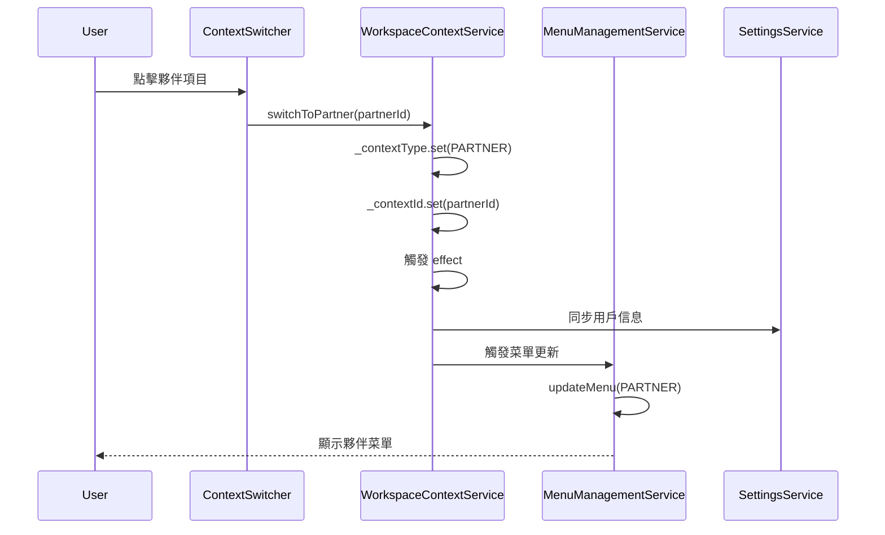
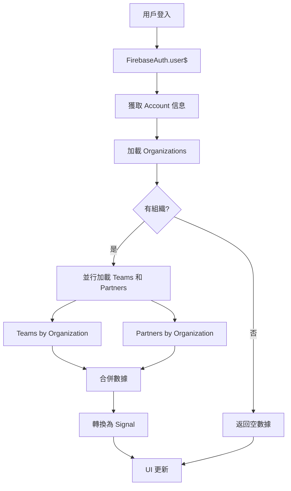

# 夥伴上下文切換功能實現文檔

## 📋 概述

本文檔記錄了 GigHub 系統中夥伴（Partner）上下文切換功能的實現細節。夥伴是組織的外部實體（如承包商、供應商、顧問等），與內部團隊（Team）在組織定位上有所區別。

## 🎯 核心概念

### 夥伴 vs 團隊

| 特徵 | 團隊 (Team) | 夥伴 (Partner) |
|------|------------|---------------|
| **定位** | 組織內部 | 組織外部 |
| **類型** | 單一類型 | 承包商、供應商、顧問、次承包商 |
| **圖標** | `usergroup-add` | `solution` |
| **用途** | 內部協作 | 外部協作 |
| **上下文** | `TEAM` | `PARTNER` |

### ContextType 枚舉

```typescript
export enum ContextType {
  USER = 'user',           // 個人帳戶上下文
  ORGANIZATION = 'organization', // 組織上下文
  TEAM = 'team',           // 團隊上下文（內部）
  PARTNER = 'partner',     // 夥伴上下文（外部）★ 新增
  BOT = 'bot'              // 機器人上下文
}
```

## 🏗️ 架構設計

### 1. 數據模型

夥伴相關的數據模型已存在於系統中：

```typescript
// Partner 實體
export interface Partner {
  id: string;
  organization_id: string;
  name: string;
  type: PartnerType;
  company_name?: string | null;
  contact_email?: string | null;
  contact_phone?: string | null;
  description?: string | null;
  created_at?: string;
}

// 夥伴類型
export enum PartnerType {
  CONTRACTOR = 'contractor',      // 承包商
  SUPPLIER = 'supplier',          // 供應商
  CONSULTANT = 'consultant',      // 顧問
  SUBCONTRACTOR = 'subcontractor' // 次承包商
}

// 夥伴角色
export enum PartnerRole {
  ADMIN = 'admin',   // 管理員
  MEMBER = 'member'  // 成員
}
```

### 2. 數據存取層

**PartnerRepository** 已實現完整的 CRUD 操作：

- `findById(partnerId: string): Observable<Partner | null>`
- `findByOrganization(organizationId: string): Observable<Partner[]>`
- `create(partner: Omit<Partner, 'id'>): Promise<string>`
- `update(partnerId: string, partner: Partial<Partner>): Promise<void>`
- `delete(partnerId: string): Promise<void>`

## 📦 實現內容

### 修改的文件列表

1. **核心類型定義**
   - `src/app/core/domain/types/account.types.ts`
     - 添加 `PARTNER` 到 `ContextType` 枚舉

2. **服務層**
   - `src/app/shared/services/workspace-context.service.ts`
     - 擴展以支持夥伴上下文
   - `src/app/shared/services/menu-management.service.ts`
     - 添加夥伴菜單配置支持

3. **UI 組件**
   - `src/app/layout/basic/widgets/context-switcher.component.ts`
     - 更新以顯示和切換夥伴上下文

4. **國際化**
   - `src/assets/tmp/i18n/zh-TW.json`
   - `src/assets/tmp/i18n/zh-CN.json`
   - `src/assets/tmp/i18n/en-US.json`

5. **配置文件**
   - `src/assets/tmp/app-data.json`
     - 添加夥伴菜單配置

### WorkspaceContextService 更新

#### 數據加載

```typescript
// UserData 接口擴展
interface UserData {
  user: Account | null;
  organizations: Organization[];
  teams: Team[];
  partners: Partner[];  // ★ 新增
  bots: Bot[];
}

// 並行加載 teams 和 partners
const teamObservables = organizations.map(org => 
  this.teamRepo.findByOrganization(org.id)
);
const partnerObservables = organizations.map(org => 
  this.partnerRepo.findByOrganization(org.id)
);

return combineLatest([
  combineLatest(teamObservables), 
  combineLatest(partnerObservables)
]).pipe(
  map(([teamArrays, partnerArrays]) => ({
    user: account,
    organizations,
    teams: teamArrays.flat(),
    partners: partnerArrays.flat(),  // ★ 新增
    bots: []
  }))
);
```

#### 狀態管理

```typescript
// Public readonly signals
readonly partners = computed(() => this._userData().partners);

// Partners grouped by organization
readonly partnersByOrganization = computed(() => {
  const partners = this.partners();
  const orgs = this.organizations();
  const map = new Map<string, Partner[]>();
  
  orgs.forEach(org => map.set(org.id, []));
  partners.forEach(partner => {
    const orgId = partner.organization_id;
    if (orgId && map.has(orgId)) {
      map.get(orgId)!.push(partner);
    }
  });
  
  return map;
});
```

#### 上下文切換

```typescript
/**
 * Switch to partner context
 */
switchToPartner(partnerId: string): void {
  this.switchContext(ContextType.PARTNER, partnerId);
}
```

#### 圖標和標籤

```typescript
// Context label
readonly contextLabel = computed(() => {
  const type = this.contextType();
  const id = this.contextId();
  
  // ... other cases
  
  case ContextType.PARTNER:
    const partner = this.partners().find(p => p.id === id);
    return partner?.name || '夥伴';
});

// Context icon
readonly contextIcon = computed(() => {
  const iconMap = {
    [ContextType.USER]: 'user',
    [ContextType.ORGANIZATION]: 'team',
    [ContextType.TEAM]: 'usergroup-add',
    [ContextType.PARTNER]: 'solution',  // ★ 新增
    [ContextType.BOT]: 'robot'
  };
  return iconMap[this.contextType()] || 'user';
});
```

#### Effect 更新

```typescript
effect(() => {
  // ... existing logic
  
  else if (type === ContextType.PARTNER) {
    const partner = this.partners().find(p => p.id === id);
    if (partner) {
      const parentOrg = this.organizations().find(o => o.id === partner.organization_id);
      avatarUrl = parentOrg?.logo_url || avatarUrl;
      name = partner.name;
    }
  }
  
  // Sync to SettingsService
  this.settingsService.setUser({
    name,
    email: user.email,
    avatar: avatarUrl || './assets/tmp/img/avatar.jpg'
  });
});
```

### MenuManagementService 更新

```typescript
// MenuConfig 接口
interface MenuConfig {
  user?: Menu[];
  organization?: Menu[];
  team?: Menu[];
  partner?: Menu[];  // ★ 新增
  bot?: Menu[];
}

// getBaseMenu 方法
private getBaseMenu(contextType: ContextType, config: MenuConfig): Menu[] {
  switch (contextType) {
    case ContextType.USER:
      return config.user || [];
    case ContextType.ORGANIZATION:
      return config.organization || [];
    case ContextType.TEAM:
      return config.team || [];
    case ContextType.PARTNER:  // ★ 新增
      return config.partner || [];
    case ContextType.BOT:
      return config.bot || [];
    default:
      return config.user || [];
  }
}
```

### Context Switcher UI 更新

```typescript
// Template 更新
@for (org of organizations(); track org.id) {
  @if (getTeamsForOrg(org.id).length > 0 || getPartnersForOrg(org.id).length > 0) {
    <li nz-submenu [nzTitle]="org.name" nzIcon="team">
      <ul nz-menu>
        <!-- Organization itself -->
        <li nz-menu-item (click)="switchToOrganization(org.id)">
          <i nz-icon nzType="team" class="mr-sm"></i>
          <span>{{ org.name }}</span>
        </li>
        <li nz-menu-divider></li>
        
        <!-- Internal Teams -->
        @if (getTeamsForOrg(org.id).length > 0) {
          <li nz-menu-group nzTitle="內部團隊">
            @for (team of getTeamsForOrg(org.id); track team.id) {
              <li nz-menu-item (click)="switchToTeam(team.id)">
                <i nz-icon nzType="usergroup-add" class="mr-sm"></i>
                <span>{{ team.name }}</span>
              </li>
            }
          </li>
        }
        
        <!-- External Partners -->
        @if (getPartnersForOrg(org.id).length > 0) {
          <li nz-menu-group nzTitle="外部夥伴">
            @for (partner of getPartnersForOrg(org.id); track partner.id) {
              <li nz-menu-item (click)="switchToPartner(partner.id)">
                <i nz-icon nzType="solution" class="mr-sm"></i>
                <span>{{ partner.name }}</span>
              </li>
            }
          </li>
        }
      </ul>
    </li>
  }
}

// Component logic
readonly partners = this.workspaceContext.partners;
readonly partnersByOrganization = this.workspaceContext.partnersByOrganization;

getPartnersForOrg(orgId: string): Partner[] {
  return this.workspaceContext.getPartnersForOrg(orgId);
}

isPartnerContext(partnerId: string): boolean {
  return this.currentContextType() === ContextType.PARTNER 
    && this.currentContextId() === partnerId;
}

switchToPartner(partnerId: string): void {
  this.workspaceContext.switchToPartner(partnerId);
}
```

### 國際化翻譯

#### 繁體中文 (zh-TW)
```json
{
  "menu.organization.partners": "夥伴管理",
  "menu.partner": "夥伴導航",
  "menu.partner.schedule": "夥伴排程",
  "menu.partner.members": "夥伴成員",
  "menu.partner.settings": "夥伴設定"
}
```

#### 簡體中文 (zh-CN)
```json
{
  "menu.organization.partners": "伙伴管理",
  "menu.partner": "伙伴导航",
  "menu.partner.schedule": "伙伴排程",
  "menu.partner.members": "伙伴成员",
  "menu.partner.settings": "伙伴设置"
}
```

#### 英文 (en-US)
```json
{
  "menu.organization.partners": "Partner Management",
  "menu.partner": "Partner Navigation",
  "menu.partner.schedule": "Partner Schedule",
  "menu.partner.members": "Partner Members",
  "menu.partner.settings": "Partner Settings"
}
```

### 菜單配置 (app-data.json)

```json
{
  "menus": {
    "partner": [
      {
        "text": "夥伴導航",
        "i18n": "menu.partner",
        "group": true,
        "hideInBreadcrumb": true,
        "children": [
          {
            "text": "夥伴工作臺",
            "i18n": "menu.dashboard",
            "icon": "anticon-dashboard",
            "link": "/dashboard/partner",
            "badge": 0
          },
          {
            "text": "夥伴排程",
            "i18n": "menu.partner.schedule",
            "icon": "anticon-calendar",
            "link": "/partner/schedule"
          },
          {
            "text": "夥伴成員",
            "i18n": "menu.partner.members",
            "icon": "anticon-team",
            "link": "/partner/members"
          },
          {
            "text": "夥伴設定",
            "i18n": "menu.partner.settings",
            "icon": "anticon-setting",
            "link": "/partner/settings"
          },
          {
            "text": "AI 助理",
            "i18n": "menu.ai_assistant",
            "icon": "anticon-robot",
            "link": "/ai-assistant"
          }
        ]
      }
    ]
  }
}
```

## 🔄 工作流程

### 夥伴上下文切換流程



### 數據加載流程



## 🧪 測試指南

### 手動測試步驟

1. **創建夥伴**
   - 登入系統並切換到組織上下文
   - 進入「夥伴管理」頁面
   - 創建新夥伴（測試各種類型：承包商、供應商等）

2. **驗證夥伴顯示**
   - 打開上下文切換下拉菜單
   - 確認夥伴出現在組織下方的「外部夥伴」分組
   - 確認圖標為 `solution`

3. **測試上下文切換**
   - 點擊夥伴項目
   - 確認上下文切換成功
   - 確認左側菜單更新為夥伴導航菜單

4. **驗證菜單項**
   - 確認顯示：夥伴工作臺、夥伴排程、夥伴成員、夥伴設定、AI 助理
   - 點擊各菜單項確認路由正確

5. **測試持久化**
   - 切換到夥伴上下文
   - 刷新頁面
   - 確認仍保持在夥伴上下文

6. **測試多語言**
   - 切換語言（繁體中文、簡體中文、英文）
   - 確認所有夥伴相關文本正確翻譯

### 自動化測試建議

```typescript
describe('Partner Context Switching', () => {
  let service: WorkspaceContextService;
  
  beforeEach(() => {
    // Setup test environment
  });
  
  it('should load partners for organization', () => {
    // Test partners loading
  });
  
  it('should switch to partner context', () => {
    service.switchToPartner('partner-id-123');
    expect(service.contextType()).toBe(ContextType.PARTNER);
    expect(service.contextId()).toBe('partner-id-123');
  });
  
  it('should update contextLabel for partner', () => {
    // Given partner exists
    service.switchToPartner('partner-id-123');
    expect(service.contextLabel()).toBe('Test Partner Name');
  });
  
  it('should use solution icon for partner', () => {
    service.switchToPartner('partner-id-123');
    expect(service.contextIcon()).toBe('solution');
  });
  
  it('should group partners by organization', () => {
    const grouped = service.partnersByOrganization();
    expect(grouped.get('org-id-123')).toBeDefined();
  });
});
```

## ✅ 驗證清單

### 功能驗證
- [ ] 夥伴數據正確加載
- [ ] 夥伴按組織分組
- [ ] 上下文切換功能正常
- [ ] 菜單更新正確
- [ ] 圖標顯示正確（solution）
- [ ] 標籤顯示正確
- [ ] 持久化存儲功能正常

### UI 驗證
- [ ] 上下文切換器顯示夥伴
- [ ] 分組顯示（內部團隊 vs 外部夥伴）
- [ ] 選中狀態正確顯示
- [ ] 圖標和文字對齊
- [ ] 多語言支持正常

### 性能驗證
- [ ] 並行加載不阻塞 UI
- [ ] Signal 響應式更新正常
- [ ] 無不必要的重複請求
- [ ] 上下文切換流暢

## 📝 技術決策

### 為什麼選擇這種實現方式？

1. **最小化變更（Occam's Razor）**
   - 複用團隊上下文的實現模式
   - 不引入新的抽象層
   - 保持代碼結構一致性

2. **並行加載優化**
   - 使用 `combineLatest` 並行加載 teams 和 partners
   - 減少總體加載時間
   - 提升用戶體驗

3. **Signal 響應式管理**
   - 使用 Angular 20 推薦的 Signals 模式
   - 自動觸發 UI 更新
   - 減少手動變更檢測

4. **視覺區分內外部**
   - 使用分組（nz-menu-group）清晰區分
   - 不同圖標（usergroup-add vs solution）
   - 標籤明確（內部團隊 vs 外部夥伴）

## 🚀 後續擴展

### 潛在改進方向

1. **夥伴儀表板**
   - 實現 `/dashboard/partner` 頁面
   - 顯示夥伴專屬統計數據

2. **夥伴排程**
   - 實現 `/partner/schedule` 頁面
   - 與組織排程整合

3. **夥伴成員管理**
   - 實現 `/partner/members` 頁面
   - 管理夥伴成員權限

4. **夥伴設定**
   - 實現 `/partner/settings` 頁面
   - 配置夥伴相關設置

5. **權限細化**
   - 定義夥伴特定權限
   - 實現 ACL 規則

6. **通知整合**
   - 夥伴上下文特定通知
   - 與組織通知區分

## 📚 參考資料

- [Angular 20 Signals Guide](https://angular.dev/guide/signals)
- [ng-alain Documentation](https://ng-alain.com)
- [ng-zorro-antd Menu Component](https://ng.ant.design/components/menu/zh)
- [RxJS combineLatest](https://rxjs.dev/api/index/function/combineLatest)
- [GigHub Project Architecture](./⭐.md)

## 🔗 相關文件

- `src/app/core/domain/types/account.types.ts` - 類型定義
- `src/app/shared/services/workspace-context.service.ts` - 上下文服務
- `src/app/shared/services/menu-management.service.ts` - 菜單服務
- `src/app/layout/basic/widgets/context-switcher.component.ts` - UI 組件
- `src/assets/tmp/app-data.json` - 菜單配置
- `src/assets/tmp/i18n/*.json` - 國際化翻譯

---

**實現日期**: 2025-12-17  
**版本**: 1.0.0  
**作者**: GitHub Copilot  
**審核**: Pending
