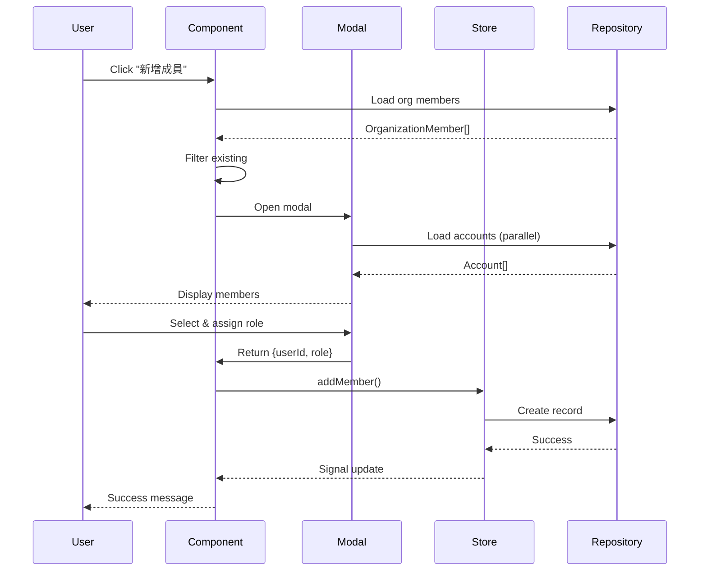
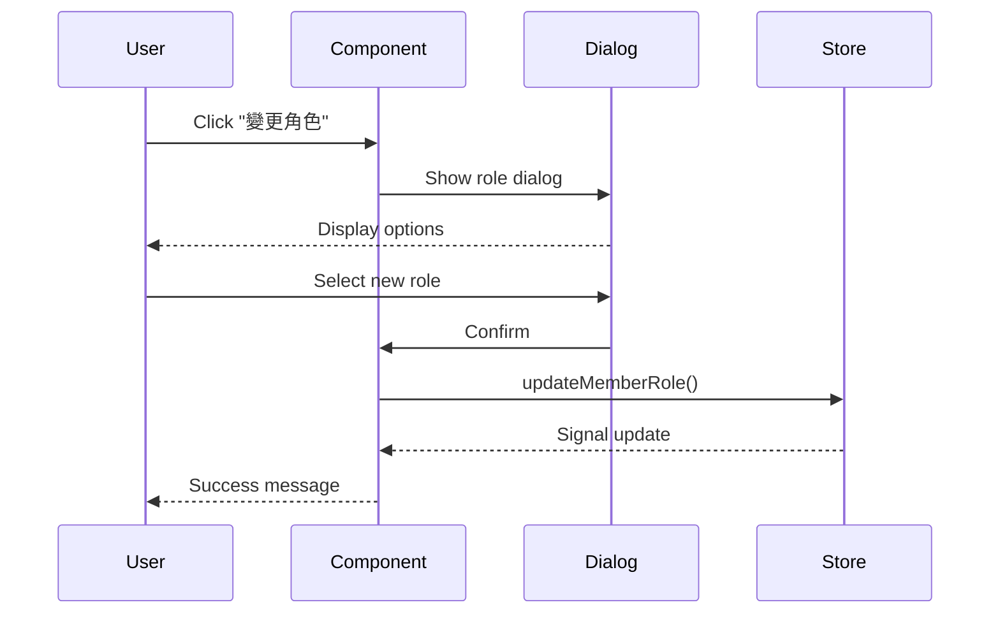
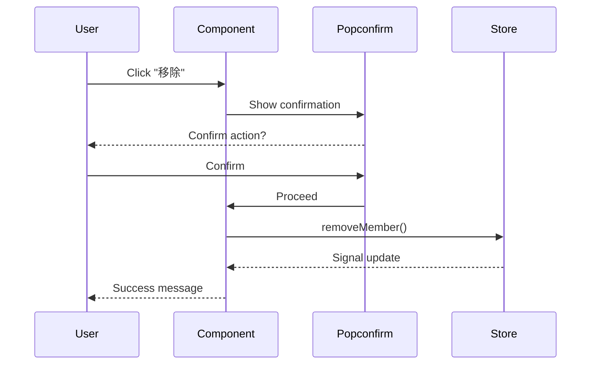

# Partner Member Management Implementation Guide

## Overview

This document describes the implementation of partner member management and user invitation functionality for the GigHub project.

## Architecture

### Component Structure

```
src/app/routes/partner/
├── members/
│   ├── partner-members.component.ts        # Main member management component
│   └── partner-member-modal.component.ts   # Add member modal
├── schedule/
│   └── partner-schedule.component.ts       # Placeholder
├── settings/
│   └── partner-settings.component.ts       # Placeholder
└── routes.ts                               # Partner routes configuration
```

### Data Flow

```
┌─────────────────────────────────────────────────────────────┐
│                    Partner Member Management                 │
└─────────────────────────────────────────────────────────────┘
                              │
        ┌─────────────────────┼─────────────────────┐
        │                     │                     │
        ▼                     ▼                     ▼
┌───────────────┐    ┌────────────────┐    ┌──────────────┐
│  Component    │    │     Store      │    │  Repository  │
│   (UI Layer)  │◄──►│  (State Mgmt)  │◄──►│ (Data Access)│
└───────────────┘    └────────────────┘    └──────────────┘
        │                     │                     │
        │                     │                     │
        ▼                     ▼                     ▼
┌───────────────┐    ┌────────────────┐    ┌──────────────┐
│   Signals     │    │  Computed      │    │  Firestore   │
│   (Reactive)  │    │  (Derived)     │    │  (Database)  │
└───────────────┘    └────────────────┘    └──────────────┘
```

## Key Features

### 1. Member List Management

**Component**: `PartnerMembersComponent`

Features:
- View all partner members
- Display member ID, role, join date
- Real-time updates via Signals
- Context-aware (switches based on partnerId query param)
- Loading and error states

### 2. Member Invitation

**Component**: `PartnerMemberModalComponent`

Features:
- Select from available organization members
- Search/filter functionality (ng-zorro select)
- Display full account info:
  - Avatar image
  - Full name
  - Email address
- Role selection (Admin/Member)
- Form validation

### 3. Role Management

Features:
- Change member role (Admin ↔ Member)
- Confirmation dialog
- Visual role indicators (badges with colors)

### 4. Member Removal

Features:
- Remove member from partner
- Confirmation popup (nz-popconfirm)
- Automatic list update

## Implementation Details

### Technologies Used

- **Angular 20.3.0**: Modern Angular with Signals
- **ng-zorro-antd**: UI component library
- **RxJS**: For async operations
- **Firebase Firestore**: Data persistence
- **Reactive Forms**: Form validation

### Key Patterns

1. **Signal-based State Management**
   ```typescript
   readonly members = signal<PartnerMember[]>([]);
   readonly loading = signal(false);
   readonly displayMembers = computed(() => {...});
   ```

2. **Repository Pattern**
   ```typescript
   PartnerMemberRepository
   ├── findByPartner()
   ├── addMember()
   ├── removeMember()
   └── isMember()
   ```

3. **Store Pattern**
   ```typescript
   PartnerStore
   ├── loadMembers()
   ├── addMember()
   ├── removeMember()
   └── updateMemberRole()
   ```

4. **Modal Pattern**
   ```typescript
   // Dynamic import for code splitting
   import('./partner-member-modal.component').then(({ PartnerMemberModalComponent }) => {
     this.modal.create({...});
   });
   ```

### Account Information Loading

**Parallel Loading with forkJoin**:
```typescript
const accountRequests = availableMembers.map(member =>
  this.accountRepository.findById(member.user_id).pipe(
    map(account => ({ ...member, account: account || undefined })),
    catchError(() => of({ ...member, account: undefined }))
  )
);

forkJoin(accountRequests).subscribe(membersWithAccounts => {
  this._membersWithAccounts.set(membersWithAccounts);
});
```

Benefits:
- Loads all accounts in parallel (not sequential)
- Graceful error handling (continues if some fail)
- Fast UI rendering with complete info

### Performance Optimizations

1. **OnPush Change Detection**
   - Only updates when inputs change
   - Reduces unnecessary renders

2. **Computed Signals**
   - Automatic memoization
   - Only recalculates when dependencies change

3. **queueMicrotask for Firestore**
   - Prevents UI blocking
   - Defers query preparation to next tick

4. **Dynamic Component Loading**
   - Code splitting for modal
   - Smaller initial bundle

### Context Management

**Lifecycle Pattern**:
```typescript
ngOnInit() {
  // Save previous context
  this.previousContext = {
    type: this.workspaceContext.contextType(),
    id: this.workspaceContext.contextId()
  };
  
  // Restore on destroy
  this.destroyRef.onDestroy(() => {
    if (this.didSwitchContext) {
      this.workspaceContext.switchContext(
        this.previousContext.type,
        this.previousContext.id
      );
    }
  });
}
```

## User Workflows

### Workflow 1: Add Member



### Workflow 2: Change Role



### Workflow 3: Remove Member



## Testing Guide

### Manual Testing Checklist

- [ ] Navigate to /partner/members?partnerId=XXX
- [ ] Verify member list displays correctly
- [ ] Click "新增成員" button
- [ ] Verify modal opens with org members
- [ ] Verify account info loads (avatar, name, email)
- [ ] Search/filter members works
- [ ] Select a member
- [ ] Choose role (Admin/Member)
- [ ] Confirm addition
- [ ] Verify member appears in list
- [ ] Change member role
- [ ] Verify role update
- [ ] Remove member
- [ ] Verify member removed
- [ ] Test with empty partner (no members)
- [ ] Test with no available org members

### Unit Testing Suggestions

```typescript
describe('PartnerMembersComponent', () => {
  it('should load members on context switch', () => {
    // Test member loading
  });
  
  it('should filter available org members', () => {
    // Test filtering logic
  });
  
  it('should add member with selected role', () => {
    // Test add member flow
  });
  
  it('should change member role', () => {
    // Test role change
  });
  
  it('should remove member', () => {
    // Test remove member
  });
});

describe('PartnerMemberModalComponent', () => {
  it('should load account info', () => {
    // Test account loading
  });
  
  it('should validate form', () => {
    // Test form validation
  });
  
  it('should return selected data', () => {
    // Test modal result
  });
});
```

## Routes Configuration

### Partner Routes (`src/app/routes/partner/routes.ts`)

```typescript
export const routes: Routes = [
  { path: '', redirectTo: 'members', pathMatch: 'full' },
  {
    path: 'members',
    loadComponent: () => import('./members/partner-members.component').then(m => m.PartnerMembersComponent),
    data: { title: '夥伴成員' }
  },
  // Additional routes...
];
```

### Main Routes (`src/app/routes/routes.ts`)

```typescript
{
  path: 'partner',
  loadChildren: () => import('./partner/routes').then(m => m.routes),
  data: { title: '夥伴管理' }
}
```

## i18n Support

The menu translations are already configured in:
- `src/assets/tmp/i18n/zh-TW.json`
- `src/assets/tmp/i18n/zh-CN.json`
- `src/assets/tmp/i18n/en-US.json`

Menu items:
- `menu.partner` - 夥伴導航
- `menu.partner.members` - 夥伴成員
- `menu.partner.schedule` - 夥伴排程
- `menu.partner.settings` - 夥伴設定

## Code Quality

### Linting

All new files pass ESLint:
```bash
npm run lint
# ✅ No errors in new files
```

### Best Practices Applied

✅ Angular 20+ Signals for state management  
✅ OnPush change detection for performance  
✅ Standalone components (no NgModules)  
✅ inject() for dependency injection  
✅ Reactive Forms with validation  
✅ Error handling with user feedback  
✅ TypeScript strict mode  
✅ Comprehensive JSDoc comments  
✅ Consistent naming conventions  
✅ Repository pattern for data access  
✅ Store pattern for state management  

## Dependencies

**Existing Dependencies Used**:
- PartnerStore (already implemented)
- PartnerRepository (already implemented)
- PartnerMemberRepository (already implemented)
- OrganizationMemberRepository (already implemented)
- AccountRepository (already implemented)
- WorkspaceContextService (already implemented)

**No New Dependencies Added** ✅

## Future Enhancements

1. **Batch Operations**
   - Add multiple members at once
   - Bulk role changes

2. **Member Search**
   - Advanced filtering in member list
   - Search by name/email

3. **Member Details**
   - Click member to view full profile
   - Activity history

4. **Permissions**
   - Fine-grained permission management
   - Custom role definitions

5. **Notifications**
   - Email notification on member addition
   - In-app notifications for role changes

## Documentation

- Main documentation: `PARTNER_CONTEXT_IMPLEMENTATION.md`
- This guide: `PARTNER_MEMBER_MANAGEMENT.md`
- Architecture standards: `⭐.md`

## Support

For issues or questions:
1. Check existing documentation
2. Review code comments
3. Check implementation patterns in TeamMembersComponent
4. Refer to Angular/ng-zorro documentation

---

**Implementation Status**: ✅ Complete  
**Testing Status**: Manual testing guide provided  
**Documentation**: Complete with diagrams and examples  
**Code Quality**: Follows all project standards
