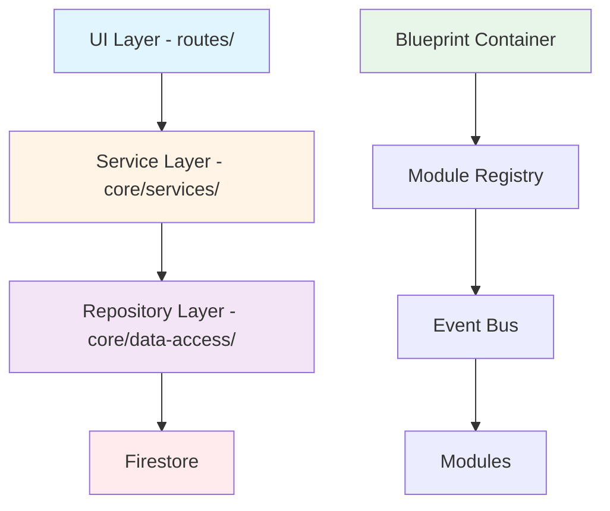
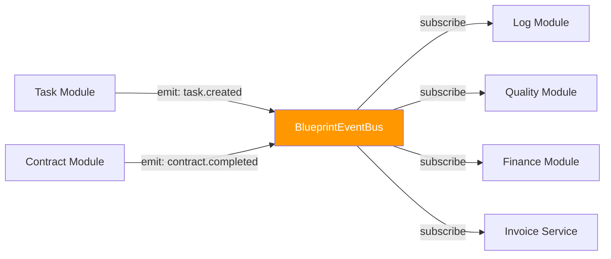

# GigHub 專案結構文檔

> **文檔目的**: 提供 GigHub 專案的完整架構與目錄結構導覽  
> **目標讀者**: 開發者、架構師、Copilot Agent  
> **版本**: 2.0.0  
> **最後更新**: 2025-12-16

---

## 📖 目錄

1. [架構概覽](#架構概覽)
2. [核心設計原則](#核心設計原則)
3. [當前專案結構](#當前專案結構)
4. [詳細目錄說明](#詳細目錄說明)
5. [模組通訊機制](#模組通訊機制)
6. [命名規範](#命名規範)
7. [開發指南](#開發指南)

---

## 架構概覽

### 架構理念

GigHub 採用 **三層架構** + **Blueprint 模組化系統**，遵循 **領域驅動設計 (DDD)** 原則：



### 技術棧

| 層級 | 技術 | 版本 | 用途 |
|------|------|------|------|
| 前端框架 | Angular | 20.3.0 | Standalone Components + Signals |
| UI 框架 | ng-alain | 20.1.0 | 企業級管理框架 |
| UI 元件 | ng-zorro-antd | 20.3.1 | Ant Design for Angular |
| 後端服務 | Firebase/Firestore | 20.0.1 | BaaS + NoSQL 資料庫 |
| 狀態管理 | Angular Signals | 內建 | 響應式狀態管理 |
| 類型系統 | TypeScript | 5.9 | ES2022 編譯目標 |
| 套件管理 | Yarn | 4.9.2 | Berry (Plug'n'Play) |

---

## 核心設計原則

### 🌟 奧卡姆剃刀定律基礎

1. **KISS** (Keep It Simple, Stupid) - 簡單優於複雜
2. **YAGNI** (You Aren't Gonna Need It) - 不做預設需求
3. **MVP** (Minimum Viable Product) - 優先核心功能
4. **SRP** (Single Responsibility Principle) - 單一職責
5. **低耦合、高內聚** - 模組獨立、內部緊密
6. **80/20 法則** - 聚焦關鍵 20%
7. **可讀性 > 聰明** - 清晰程式碼勝於技巧

### 🏗️ 三層架構嚴格分離

```
┌─────────────────────────────────────────┐
│  UI 層 (routes/)                         │
│  - 展示與使用者互動                      │
│  - Standalone Components                 │
│  - OnPush 變更檢測                      │
└─────────────────────────────────────────┘
              ↓ 只能呼叫
┌─────────────────────────────────────────┐
│  Service 層 (core/services/)             │
│  - 業務邏輯協調                          │
│  - 狀態管理 (Signals)                    │
│  - 事件發送/訂閱                        │
└─────────────────────────────────────────┘
              ↓ 只能呼叫
┌─────────────────────────────────────────┐
│  Repository 層 (core/data-access/)       │
│  - 資料存取抽象                          │
│  - Firestore 操作封裝                    │
│  - Query 優化                           │
└─────────────────────────────────────────┘
              ↓ 存取
┌─────────────────────────────────────────┐
│  Firestore (Cloud NoSQL Database)       │
└─────────────────────────────────────────┘
```

**禁止行為**:
- ❌ UI 直接呼叫 Repository
- ❌ UI 直接操作 Firestore
- ❌ Service 繞過 Repository

### 📦 Repository 模式 (強制)

所有 Firestore 操作必須透過 Repository：

```typescript
// ✅ 正確: 透過 Repository
@Injectable({ providedIn: 'root' })
export class TaskRepository {
  private firestore = inject(Firestore);
  
  findAll(): Observable<Task[]> {
    const tasksCol = collection(this.firestore, 'tasks');
    return collectionData(tasksCol, { idField: 'id' });
  }
}

// ❌ 禁止: 元件直接操作 Firestore
@Component({ ... })
export class TaskComponent {
  private firestore = inject(Firestore); // ❌ 禁止
  
  loadTasks() {
    collectionData(collection(this.firestore, 'tasks')).subscribe(...); // ❌ 禁止
  }
}
```

### 📡 事件驅動架構

所有模組事件透過 `BlueprintEventBus` 集中管理：

```typescript
// 事件命名規範: [module].[action]
// 範例: task.created, log.updated, quality.deleted

// 發送事件
this.eventBus.emit({
  type: 'task.created',
  blueprintId: task.blueprintId,
  timestamp: new Date(),
  actor: this.userContext.currentUser()?.id,
  data: { taskId, task }
});

// 訂閱事件
this.eventBus.on('task.created')
  .pipe(takeUntilDestroyed(this.destroyRef))
  .subscribe(event => {
    console.log('New task created:', event.data);
  });
```

---

## 當前專案結構

### 📁 根目錄結構

```
ng-gighub/
├── .github/                    # GitHub 配置與 Copilot 指引
│   ├── agents/                 # 統一開發代理
│   ├── copilot/                # Copilot 配置與規則
│   └── instructions/           # 開發指引文檔 (8 個專業指引)
│
├── docs/                       # 專案文檔
│   ├── ARCHITECTURE.md         # 系統架構總覽
│   ├── TREE.md                 # 專案結構文檔 (本文檔)
│   ├── README.md               # 文檔導覽
│   └── discussions/            # 詳細任務規劃 (69 個任務)
│       ├── ⭐.md              # 核心開發規範
│       ├── SETC-*.md           # 任務規劃文檔
│       └── SUMMARY.md          # 進度總覽
│
├── functions*/                 # Firebase Cloud Functions (8 個)
│   ├── functions-ai/           # AI 相關功能
│   ├── functions-auth/         # 認證功能
│   ├── functions-firestore/    # Firestore 觸發器
│   └── ...                     # 其他雲函數
│
├── src/                        # 主要原始碼
│   ├── app/                    # Angular 應用程式
│   │   ├── core/               # 核心基礎設施層 ⭐
│   │   ├── layout/             # 佈局層
│   │   ├── routes/             # 路由層 (UI 元件) ⭐
│   │   └── shared/             # 共享模組層
│   │
│   ├── assets/                 # 靜態資源
│   ├── environments/           # 環境配置
│   └── styles/                 # 全域樣式
│
├── public/                     # 公開資源
├── scripts/                    # 建置腳本
├── ⭐.md                      # 根目錄核心規範 (ARCHIVED)
├── angular.json                # Angular 配置
├── package.json                # 專案依賴
├── tsconfig.json               # TypeScript 配置
├── firebase.json               # Firebase 配置
├── firestore.rules             # Firestore Security Rules
└── yarn.lock                   # Yarn 鎖定檔
```

### 📊 結構統計

| 類別 | 數量 | 說明 |
|------|------|------|
| Cloud Functions | 8 | AI, Auth, Analytics, FCM, Firestore, Event, Storage, Scheduler |
| Core Services | 15+ | Blueprint, Firebase, AI, Logger, State, etc. |
| Routes (Pages) | 10+ | Dashboard, Blueprint, Organization, Team, etc. |
| Repositories | 20+ | Task, Log, Contract, Quality, etc. |
| Shared Components | 30+ | Breadcrumb, Modals, Drawers, etc. |
| Documentation Files | 80+ | SETC tasks, READMEs, Architecture docs |

---

## 詳細目錄說明

### 1️⃣ Core Layer - 核心基礎設施層

#### 目錄結構

```
src/app/core/
├── blueprint/                              # Blueprint 核心系統 ⭐
│   ├── config/                             # 系統配置
│   │   ├── blueprint-config.interface.ts   # Blueprint 配置介面
│   │   └── index.ts
│   │
│   ├── container/                          # 容器管理 (DI & 生命週期)
│   │   ├── blueprint-container.interface.ts
│   │   ├── blueprint-container.ts
│   │   ├── lifecycle-manager.ts
│   │   ├── module-registry.ts              # 模組註冊器
│   │   ├── resource-provider.ts
│   │   └── index.ts
│   │
│   ├── context/                            # 上下文管理 (共享狀態)
│   │   ├── execution-context.interface.ts
│   │   ├── shared-context.ts
│   │   ├── tenant-info.interface.ts
│   │   └── index.ts
│   │
│   ├── events/                             # 事件系統 (Event Bus)
│   │   ├── models/
│   │   │   ├── blueprint-event.model.ts
│   │   │   ├── event-log-entry.model.ts
│   │   │   ├── event-priority.enum.ts
│   │   │   └── index.ts
│   │   ├── types/
│   │   │   ├── system-event-type.enum.ts
│   │   │   └── index.ts
│   │   ├── event-bus.interface.ts
│   │   ├── event-bus.ts                    # 事件匯流排核心
│   │   ├── enhanced-event-bus.service.ts
│   │   └── index.ts
│   │
│   ├── modules/                            # 模組基礎設施
│   │   ├── base/                           # 模組基礎類別
│   │   ├── implementations/                # 模組實作 (未來遷移至 domains/)
│   │   ├── module.interface.ts
│   │   ├── module-status.enum.ts
│   │   └── index.ts
│   │
│   ├── models/                             # Blueprint 核心模型
│   │   ├── module-connection.interface.ts
│   │   └── index.ts
│   │
│   ├── repositories/                       # Blueprint 資料存取層
│   │   ├── blueprint.repository.ts
│   │   ├── blueprint-module.repository.ts
│   │   ├── blueprint-member.repository.ts
│   │   └── index.ts
│   │
│   ├── services/                           # Blueprint 核心服務
│   │   ├── blueprint.service.ts
│   │   ├── validation.service.ts
│   │   ├── dependency-validator.service.ts
│   │   └── index.ts
│   │
│   ├── workflow/                           # 工作流編排
│   │   ├── handlers/                       # 工作流處理器
│   │   │   ├── task-completed.handler.ts
│   │   │   ├── log-created.handler.ts
│   │   │   ├── qc-passed.handler.ts
│   │   │   └── index.ts
│   │   ├── models/
│   │   │   ├── workflow-config.model.ts
│   │   │   ├── workflow-context.model.ts
│   │   │   └── index.ts
│   │   ├── setc-workflow-orchestrator.service.ts
│   │   └── index.ts
│   │
│   └── index.ts
│
├── data-access/                            # 資料存取層 (Repository 模式)
│   ├── ai/
│   │   ├── ai.repository.ts
│   │   ├── ai.types.ts
│   │   └── index.ts
│   │
│   ├── repositories/
│   │   ├── base/                           # 基礎 Repository
│   │   │   └── firestore-base.repository.ts
│   │   │
│   │   ├── shared/                         # 共享 Repositories
│   │   │   ├── account.repository.ts
│   │   │   ├── organization.repository.ts
│   │   │   ├── organization-member.repository.ts
│   │   │   ├── organization-invitation.repository.ts
│   │   │   ├── team.repository.ts
│   │   │   ├── team-member.repository.ts
│   │   │   ├── friend.repository.ts
│   │   │   ├── notification.repository.ts
│   │   │   ├── notification-preferences.repository.ts
│   │   │   └── fcm-token.repository.ts
│   │   │
│   │   ├── task-firestore.repository.ts    # 任務 Repository
│   │   ├── log-firestore.repository.ts     # 日誌 Repository
│   │   └── index.ts
│   │
│   └── index.ts
│
├── domain/                                 # 領域模型層 (業務實體定義)
│   ├── models/
│   │   ├── blueprint.model.ts
│   │   ├── blueprint-module.model.ts
│   │   ├── blueprint-config.model.ts
│   │   ├── friend.model.ts
│   │   ├── notification.model.ts
│   │   └── index.ts
│   │
│   ├── types/                              # 類型定義
│   │   ├── blueprint/
│   │   │   ├── blueprint.types.ts
│   │   │   ├── blueprint-status.enum.ts
│   │   │   └── owner-type.enum.ts
│   │   ├── module/
│   │   │   ├── module.types.ts
│   │   │   └── module-state.enum.ts
│   │   ├── permission/
│   │   │   ├── permission.types.ts
│   │   │   ├── permission-level.enum.ts
│   │   │   └── role.enum.ts
│   │   ├── task/
│   │   │   ├── task.types.ts
│   │   │   ├── task-view.types.ts
│   │   │   └── task-quantity.types.ts
│   │   ├── log/
│   │   ├── workflow/
│   │   ├── events/
│   │   ├── storage/
│   │   ├── quality-control/
│   │   ├── configuration/
│   │   ├── account.types.ts
│   │   └── index.ts
│   │
│   └── index.ts
│
├── infrastructure/                         # 基礎設施層 (外部服務整合)
│   ├── storage/
│   │   ├── storage.repository.ts
│   │   ├── firebase-storage.repository.ts
│   │   └── index.ts
│   └── index.ts
│
├── services/                               # 核心服務層
│   ├── ai/
│   │   ├── ai.service.ts
│   │   └── index.ts
│   ├── logger/
│   │   ├── logger.service.ts
│   │   ├── log-transport.interface.ts
│   │   ├── console-transport.ts
│   │   └── index.ts
│   ├── layout/                             # 佈局服務
│   ├── firebase.service.ts                 # Firebase 服務
│   ├── firebase-auth.service.ts            # Firebase 認證
│   ├── firebase-analytics.service.ts       # Firebase 分析
│   ├── push-messaging.service.ts           # 推送訊息
│   ├── friend.service.ts                   # 好友服務
│   ├── error-tracking.service.ts           # 錯誤追蹤
│   ├── performance-monitoring.service.ts   # 效能監控
│   ├── notification-analytics.service.ts   # 通知分析
│   └── index.ts
│
├── state/                                  # 全域狀態管理 (Signals)
│   ├── stores/
│   │   ├── task.store.ts
│   │   ├── log.store.ts
│   │   ├── construction-log.store.ts
│   │   ├── friend.store.ts
│   │   ├── team.store.ts
│   │   ├── notification.store.ts
│   │   └── index.ts
│   └── index.ts
│
├── facades/                                # 外觀模式服務 (簡化複雜操作)
│   ├── ai/
│   │   ├── ai.store.ts
│   │   └── index.ts
│   └── index.ts
│
├── errors/                                 # 自訂錯誤類型
│   ├── blueprint-error.ts
│   ├── module-not-found-error.ts
│   ├── permission-denied-error.ts
│   ├── validation-error.ts
│   └── index.ts
│
├── net/                                    # 網路層 (HTTP 攔截器)
│   ├── default.interceptor.ts
│   ├── refresh-token.ts
│   ├── helper.ts
│   └── index.ts
│
├── i18n/                                   # 國際化服務
│   └── i18n.service.ts
│
├── utils/                                  # 工具函數
│   └── task-hierarchy.util.ts
│
├── startup/                                # 應用啟動服務
│   └── startup.service.ts
│
├── start-page.guard.ts                     # 起始頁守衛
└── index.ts
```

#### 職責說明

| 子目錄 | 職責 | 核心文件 |
|--------|------|----------|
| `blueprint/` | Blueprint 核心系統，模組化架構基礎 | `container/`, `events/`, `workflow/` |
| `data-access/` | 統一資料存取，Repository 模式實作 | `repositories/base/`, `repositories/shared/` |
| `domain/` | 領域模型與類型定義，業務實體 | `models/`, `types/` |
| `infrastructure/` | 外部服務整合 (Storage, 3rd-party APIs) | `storage/` |
| `services/` | 核心業務服務 (Firebase, Logger, AI, etc.) | `firebase.service.ts`, `ai.service.ts` |
| `state/` | 全域狀態管理，Signals-based Stores | `stores/task.store.ts`, `stores/log.store.ts` |
| `facades/` | 外觀模式，簡化複雜服務組合 | `ai/ai.store.ts` |
| `errors/` | 自訂錯誤類型，錯誤處理 | `blueprint-error.ts`, `validation-error.ts` |
| `net/` | HTTP 攔截器，Token 管理 | `default.interceptor.ts` |
| `i18n/` | 國際化與本地化 | `i18n.service.ts` |
| `utils/` | 工具函數與輔助方法 | `task-hierarchy.util.ts` |
| `startup/` | 應用啟動邏輯 | `startup.service.ts` |

---

### 2️⃣ Layout Layer - 佈局層

#### 目錄結構

```
src/app/layout/
├── basic/                                  # 基礎佈局
│   ├── widgets/                            # 佈局小工具
│   │   ├── clear-storage.component.ts      # 清除儲存
│   │   ├── context-switcher.component.ts   # 上下文切換
│   │   ├── fullscreen.component.ts         # 全螢幕
│   │   ├── i18n.component.ts               # 語言切換
│   │   ├── icon.component.ts               # 圖示
│   │   ├── notify.component.ts             # 通知中心
│   │   ├── rtl.component.ts                # RTL 切換
│   │   ├── search.component.ts             # 全域搜尋
│   │   ├── task.component.ts               # 任務小工具
│   │   └── user.component.ts               # 使用者選單
│   ├── basic.component.ts                  # 基礎佈局元件
│   └── README.md
│
├── blank/                                  # 空白佈局 (全螢幕頁面)
│   ├── blank.component.ts
│   └── README.md
│
├── passport/                               # 認證佈局 (登入/註冊)
│   ├── passport.component.ts
│   └── passport.component.less
│
└── index.ts
```

#### 職責說明

- **basic**: 標準管理介面佈局，包含側邊欄、頂部導覽、footer
- **blank**: 全螢幕佈局，用於特殊頁面 (如 Blueprint Designer)
- **passport**: 認證相關頁面佈局 (登入、註冊、忘記密碼)

---

### 3️⃣ Routes Layer - 路由層 (UI 元件)

#### 目錄結構

```
src/app/routes/
├── ai-assistant/                           # AI 助理頁面
│   └── ai-assistant.component.less
│
├── blueprint/                              # Blueprint 管理頁面
│   ├── components/                         # 共享元件
│   │   ├── connection-layer.component.ts
│   │   ├── validation-alerts.component.ts
│   │   └── index.ts
│   │
│   ├── construction-log/                   # 施工日誌
│   │   ├── construction-log.component.ts
│   │   ├── construction-log-modal.component.ts
│   │   └── index.ts
│   │
│   ├── container/                          # 容器管理
│   │   ├── container-dashboard.component.ts
│   │   └── event-bus-monitor.component.ts
│   │
│   ├── finance/                            # 財務管理
│   │   ├── finance-dashboard.component.ts
│   │   ├── finance-dashboard.component.html
│   │   ├── invoice-list.component.ts
│   │   ├── approval-dialog.component.ts
│   │   ├── routes.ts
│   │   └── index.ts
│   │
│   ├── members/                            # 成員管理
│   │   ├── blueprint-members.component.ts
│   │   └── member-modal.component.ts
│   │
│   ├── modules/                            # 模組視圖
│   │   ├── acceptance-module-view.component.ts
│   │   ├── cloud-module-view.component.ts
│   │   ├── communication-module-view.component.ts
│   │   ├── contract-module-view.component.ts
│   │   ├── contract-modal.component.ts
│   │   ├── finance-module-view.component.ts
│   │   ├── issues-module-view.component.ts
│   │   ├── issue-modal.component.ts
│   │   ├── log-module-view.component.ts
│   │   ├── material-module-view.component.ts
│   │   ├── qa-module-view.component.ts
│   │   ├── safety-module-view.component.ts
│   │   ├── shared-module-view.component.ts
│   │   ├── warranty-module-view.component.ts
│   │   └── workflow-module-view.component.ts
│   │
│   ├── warranty/                           # 保固管理
│   │   ├── warranty-list.component.ts
│   │   ├── warranty-defect-list.component.ts
│   │   └── routes.ts
│   │
│   ├── blueprint-designer.component.ts     # Blueprint 設計器
│   ├── blueprint-detail.component.ts       # Blueprint 詳情
│   ├── blueprint-list.component.ts         # Blueprint 列表
│   ├── blueprint-modal.component.ts        # Blueprint 對話框
│   └── routes.ts
│
├── dashboard/                              # 儀表板
│   └── (dashboard 相關元件)
│
├── exception/                              # 異常頁面 (404, 403, 500)
│   ├── exception.component.ts
│   ├── trigger.component.ts
│   └── routes.ts
│
├── explore/                                # 探索頁面 (搜尋 Blueprints)
│   ├── components/
│   │   ├── search-bar.component.ts
│   │   ├── filter-panel.component.ts
│   │   ├── result-grid.component.ts
│   │   └── index.ts
│   ├── models/
│   │   ├── search-result.model.ts
│   │   └── index.ts
│   ├── services/
│   │   ├── explore-search.facade.ts
│   │   ├── search-cache.service.ts
│   │   └── index.ts
│   ├── explore-page.component.ts
│   └── routes.ts
│
├── module-manager/                         # 模組管理器
│   ├── components/
│   │   ├── module-card.component.ts
│   │   ├── module-config-form.component.ts
│   │   ├── module-dependency-graph.component.ts
│   │   └── module-status-badge.component.ts
│   ├── module-manager.component.ts
│   ├── module-manager.service.ts
│   ├── module-manager.routes.ts
│   └── index.ts
│
├── monitoring/                             # 監控頁面
│   ├── monitoring-dashboard.component.ts
│   └── routes.ts
│
├── organization/                           # 組織管理
│   ├── members/
│   │   └── organization-members.component.ts
│   ├── settings/
│   │   └── organization-settings.component.ts
│   ├── teams/
│   │   ├── organization-teams.component.ts
│   │   └── team-modal.component.ts
│   └── routes.ts
│
├── passport/                               # 認證頁面
│   ├── login/
│   │   ├── login.component.ts
│   │   ├── login.component.html
│   │   └── login.component.less
│   ├── register/
│   │   ├── register.component.ts
│   │   ├── register.component.html
│   │   └── register.component.less
│   ├── register-result/
│   │   ├── register-result.component.ts
│   │   └── register-result.component.html
│   ├── lock/
│   │   ├── lock.component.ts
│   │   ├── lock.component.html
│   │   └── lock.component.less
│   ├── callback.component.ts
│   └── routes.ts
│
├── settings/                               # 設定頁面
│   └── notification-settings/
│       └── notification-settings.component.ts
│
├── social/                                 # 社交功能
│   ├── components/
│   │   └── friend-card.component.ts
│   ├── pages/
│   │   └── friends.page.ts
│   └── routes/
│       └── friends.routes.ts
│
├── team/                                   # 團隊管理
│   ├── members/
│   │   ├── team-members.component.ts
│   │   └── team-member-modal.component.ts
│   └── routes.ts
│
├── user/                                   # 使用者設定
│   ├── settings/
│   │   └── settings.component.ts
│   └── routes.ts
│
└── routes.ts                               # 全域路由配置
```

#### 職責說明

| 路由模組 | 功能 | 核心元件 |
|---------|------|----------|
| `ai-assistant/` | AI 助理聊天介面 | ai-assistant.component |
| `blueprint/` | Blueprint 管理核心 | blueprint-designer, blueprint-detail, blueprint-list |
| `dashboard/` | 主儀表板 | dashboard.component |
| `exception/` | 錯誤頁面 | 404, 403, 500 |
| `explore/` | 探索與搜尋 | search-bar, filter-panel, result-grid |
| `module-manager/` | 模組管理器 | module-card, module-config-form |
| `monitoring/` | 系統監控 | monitoring-dashboard |
| `organization/` | 組織管理 | organization-members, organization-settings |
| `passport/` | 認證流程 | login, register, lock |
| `settings/` | 系統設定 | notification-settings |
| `social/` | 社交功能 | friends, friend-card |
| `team/` | 團隊管理 | team-members, team-modal |
| `user/` | 使用者設定 | user-settings |

---

### 4️⃣ Shared Layer - 共享模組層

#### 目錄結構

```
src/app/shared/
├── cdk/                                    # CDK 模組封裝
│   ├── shared-cdk.module.ts
│   ├── index.ts
│   └── README.md
│
├── cell-widget/                            # 單元格小工具 (ST 表格)
│   └── index.ts
│
├── components/                             # 共享元件
│   ├── breadcrumb/
│   │   └── breadcrumb.component.ts
│   ├── create-organization/
│   │   └── create-organization.component.ts
│   ├── create-team-modal/
│   │   └── create-team-modal.component.ts
│   ├── edit-team-modal/
│   │   └── edit-team-modal.component.ts
│   └── team-detail-drawer/
│       ├── team-detail-drawer.component.ts
│       └── team-detail-drawer.component.html
│
├── json-schema/                            # JSON Schema 表單 (SF 動態表單)
│   ├── test/
│   │   └── test.widget.ts
│   ├── index.ts
│   └── README.md
│
├── services/                               # 共享服務
│   ├── permission/
│   │   └── permission.service.ts
│   ├── breadcrumb.service.ts
│   ├── menu-management.service.ts
│   ├── workspace-context.service.ts
│   └── index.ts
│
├── st-widget/                              # ST 表格小工具 (客製化列/操作)
│   ├── index.ts
│   └── README.md
│
├── utils/                                  # 共享工具函數
│   ├── async-state.ts
│   └── index.ts
│
├── shared-delon.module.ts                  # Delon 共享模組
├── shared-zorro.module.ts                  # Zorro 共享模組
├── shared-imports.ts                       # 統一匯入 (SHARED_IMPORTS)
├── index.ts
└── README.md
```

#### 職責說明

- **cdk/**: Angular CDK 模組封裝與擴展
- **components/**: 可重用 UI 元件 (Breadcrumb, Modals, Drawers)
- **json-schema/**: SF 動態表單自訂小工具
- **services/**: 共享業務服務 (Permission, Menu, Context)
- **st-widget/**: ST 表格自訂列與操作小工具
- **utils/**: 共享工具函數 (async-state, validators)
- **shared-imports.ts**: 統一匯入常用模組 (減少重複 import)

---

## 模組通訊機制

### 事件驅動架構



### 事件命名規範

```typescript
// 格式: [module].[action]
// 範例:
- task.created
- task.updated
- task.deleted
- task.completed
- log.created
- log.updated
- quality.passed
- quality.failed
- contract.completed
- invoice.generated
```

### 依賴注入

```typescript
// 透過 Blueprint Container 管理模組依賴
@Injectable({ providedIn: 'root' })
export class FinanceModule {
  private contractApi = inject(ContractModuleApi);  // 注入其他模組 API
  private eventBus = inject(BlueprintEventBus);
  
  constructor() {
    // 監聽合約完成事件，自動生成發票
    this.eventBus.on('contract.completed')
      .pipe(takeUntilDestroyed(this.destroyRef))
      .subscribe(event => {
        this.invoiceService.generateInvoice(event.data);
      });
  }
}
```

---

## 命名規範

### 檔案命名

```typescript
// 格式: [name].[type].ts
module.ts              // 模組定義
service.ts             // 服務類別
repository.ts          // 倉儲類別
model.ts               // 模型類別
interface.ts           // 介面定義
enum.ts                // 列舉定義
types.ts               // 類型定義
component.ts           // 元件 TypeScript
component.html         // 元件模板
component.less         // 元件樣式
component.spec.ts      // 元件測試
```

### 目錄命名

```bash
# 使用 kebab-case (小寫加連字號)
✅ invoice-management/
✅ cost-tracking/
✅ blueprint-designer/

❌ InvoiceManagement/    # 禁止 PascalCase
❌ cost_tracking/        # 禁止 snake_case
❌ INVOICE-MANAGEMENT/   # 禁止全大寫
```

### 類別命名

```typescript
// 使用 PascalCase
class TaskService { }           // ✅ 服務
class TaskRepository { }        // ✅ Repository
interface TaskModel { }         // ✅ 介面
enum TaskStatus { }             // ✅ 列舉
type TaskFilter = ...;          // ✅ 類型別名

// 變數使用 camelCase
const taskService = inject(TaskService);  // ✅
let currentTask: Task;                    // ✅
```

---

## 開發指南

### 如何新增模組

#### 步驟 1: 確定模組放置位置

```bash
# 共享功能 → shared/
# 特定 Blueprint 功能 → core/blueprint/modules/implementations/
# 未來架構 → domains/[domain-name]/[module-name]/
```

#### 步驟 2: 建立模組結構

```bash
# 範例: 新增「採購管理模組」
mkdir -p src/app/core/blueprint/modules/implementations/procurement-module

# 建立標準結構
procurement-module/
├── models/
│   ├── procurement.model.ts
│   └── index.ts
├── repositories/
│   ├── procurement.repository.ts
│   └── index.ts
├── services/
│   ├── procurement.service.ts
│   └── index.ts
├── procurement.module.ts
├── module.metadata.ts
├── index.ts
└── README.md
```

#### 步驟 3: 實作模組

```typescript
// procurement.module.ts
import { Injectable } from '@angular/core';
import { BaseModule } from '@core/blueprint/modules/base';

@Injectable({ providedIn: 'root' })
export class ProcurementModule extends BaseModule {
  constructor() {
    super();
  }

  async initialize(): Promise<void> {
    // 初始化邏輯
    console.log('Procurement Module initialized');
  }

  async dispose(): Promise<void> {
    // 清理邏輯
    console.log('Procurement Module disposed');
  }
}
```

#### 步驟 4: 註冊到 Blueprint

```typescript
// module.metadata.ts
export const ProcurementModuleMetadata = {
  id: 'procurement',
  name: '採購管理模組',
  version: '1.0.0',
  category: 'construction-domain',
  dependencies: ['contract-module', 'finance-module'],
  exports: ['ProcurementApi']
};
```

#### 步驟 5: 更新 Module Registry

```typescript
// core/blueprint/container/module-registry.ts
import { ProcurementModule } from '@core/blueprint/modules/implementations/procurement-module';

export const MODULE_REGISTRY = {
  // ... existing modules
  'procurement': ProcurementModule,
};
```

### 最佳實踐

#### ✅ 推薦做法

1. **使用 Standalone Components**
```typescript
@Component({
  selector: 'app-task-list',
  standalone: true,
  imports: [SHARED_IMPORTS],
  ...
})
```

2. **使用 Signals 管理狀態**
```typescript
tasks = signal<Task[]>([]);
loading = signal(false);
completedCount = computed(() => this.tasks().filter(t => t.completed).length);
```

3. **使用 inject() 注入依賴**
```typescript
private taskService = inject(TaskService);
private destroyRef = inject(DestroyRef);
```

4. **使用 takeUntilDestroyed() 管理訂閱**
```typescript
this.taskService.tasks$
  .pipe(takeUntilDestroyed(this.destroyRef))
  .subscribe(tasks => this.tasks.set(tasks));
```

5. **使用 OnPush 變更檢測**
```typescript
@Component({
  changeDetection: ChangeDetectionStrategy.OnPush,
  ...
})
```

#### ❌ 禁止做法

1. **禁止建立 NgModule**
```typescript
// ❌ 禁止
@NgModule({
  declarations: [TaskComponent],
  ...
})
```

2. **禁止使用 any 類型**
```typescript
// ❌ 禁止
function process(data: any): any { ... }

// ✅ 正確
function process(data: TaskDto): Task { ... }
```

3. **禁止直接操作 Firestore**
```typescript
// ❌ 禁止
private firestore = inject(Firestore);
collectionData(collection(this.firestore, 'tasks')).subscribe(...);

// ✅ 正確
private taskRepository = inject(TaskRepository);
this.taskRepository.findAll().subscribe(...);
```

4. **禁止在 constructor 執行業務邏輯**
```typescript
// ❌ 禁止
constructor() {
  this.loadTasks(); // ❌ 業務邏輯
}

// ✅ 正確
ngOnInit(): void {
  this.loadTasks(); // ✅ 在 ngOnInit 執行
}
```

5. **禁止手動管理訂閱**
```typescript
// ❌ 禁止
subscription: Subscription;
ngOnInit() {
  this.subscription = this.data$.subscribe(...);
}
ngOnDestroy() {
  this.subscription.unsubscribe();
}

// ✅ 正確
private destroyRef = inject(DestroyRef);
ngOnInit() {
  this.data$
    .pipe(takeUntilDestroyed(this.destroyRef))
    .subscribe(...);
}
```

---

## 測試結構

### 測試檔案組織

```
module-name/
├── services/
│   ├── service-a.service.ts
│   └── service-a.service.spec.ts          # 單元測試
├── components/
│   ├── component-a.component.ts
│   └── component-a.component.spec.ts      # 元件測試
├── module-name.integration.spec.ts        # 整合測試
└── module-name.e2e.spec.ts                # E2E 測試 (放在 e2e/ 目錄)
```

### 測試指令

```bash
# 單元測試
yarn test

# 單元測試 + Coverage
yarn test-coverage

# E2E 測試
yarn e2e

# 完整檢查 (lint + test + build)
yarn check:full
```

---

## 文檔規範

### 每個模組必須包含 README.md

```markdown
# 模組名稱

## 功能說明
簡述模組功能與用途

## 目錄結構
列出模組內部結構

## 核心 API
列出提供給其他模組的 API

## 依賴模組
列出依賴的其他模組

## 使用範例
提供程式碼範例

## 事件
列出發送與訂閱的事件

## 測試
測試覆蓋率與測試指令
```

---

## 遷移指南（未來架構）

### 從當前結構遷移到 Domains 架構

#### 目標結構

```
src/app/
├── core/                      # 核心基礎設施 (不變)
├── domains/                   # 業務領域層 (新增) ⭐
│   ├── shared-domain/         # 共享領域
│   ├── project-management-domain/  # 專案管理領域
│   ├── construction-domain/   # 營建工程領域
│   ├── quality-assurance-domain/   # 品質保證領域
│   └── financial-domain/      # 財務管理領域
├── layout/                    # 佈局層 (不變)
├── routes/                    # 路由層 (不變)
└── shared/                    # 共享模組 (不變)
```

#### 遷移步驟

1. **建立領域目錄**
```bash
mkdir -p src/app/domains/construction-domain
```

2. **移動模組**
```bash
# 保持模組內部結構不變
mv src/app/core/blueprint/modules/implementations/contract-module \
   src/app/domains/construction-domain/contract-module
```

3. **更新匯入路徑**
```typescript
// 舊路徑
import { ContractService } from '@core/blueprint/modules/implementations/contract-module';

// 新路徑
import { ContractService } from '@domains/construction-domain/contract-module';
```

4. **更新 TypeScript Path Mapping**
```json
// tsconfig.json
{
  "compilerOptions": {
    "paths": {
      "@core/*": ["src/app/core/*"],
      "@domains/*": ["src/app/domains/*"],
      "@shared/*": ["src/app/shared/*"],
      "@routes/*": ["src/app/routes/*"]
    }
  }
}
```

---

## 附錄

### A. 技術決策記錄 (ADR)

#### ADR-001: 採用 Standalone Components
- **日期**: 2025-11-15
- **狀態**: 已採用
- **理由**: Angular 19+ 推薦，減少 NgModule 複雜度
- **影響**: 所有新元件使用 Standalone，禁止建立 NgModule

#### ADR-002: 使用 Signals 取代 RxJS Subject
- **日期**: 2025-11-20
- **狀態**: 已採用
- **理由**: 更好的效能，更簡潔的 API
- **影響**: 新狀態管理優先使用 Signals

#### ADR-003: Repository 模式強制
- **日期**: 2025-11-25
- **狀態**: 已採用
- **理由**: 資料存取層抽象，易於測試與替換
- **影響**: 禁止直接操作 Firestore，必須透過 Repository

### B. 參考資源

- [Angular 官方文檔](https://angular.dev)
- [ng-alain 官方文檔](https://ng-alain.com)
- [ng-zorro-antd 官方文檔](https://ng.ant.design)
- [Firebase 官方文檔](https://firebase.google.com/docs)
- [專案 ARCHITECTURE.md](./ARCHITECTURE.md)
- [專案 ⭐.md](./discussions/⭐.md)

### C. 變更日誌

| 版本 | 日期 | 變更內容 |
|------|------|----------|
| 2.0.0 | 2025-12-16 | 完全重構文檔，結構化組織，符合 ⭐.md 規範 |
| 1.0.0 | 2025-11-01 | 初始版本，描述未來 Domains 架構 |

---

**文檔維護**: 本文檔應隨專案架構演進持續更新  
**聯絡人**: 專案架構團隊  
**最後審核**: 2025-12-16
