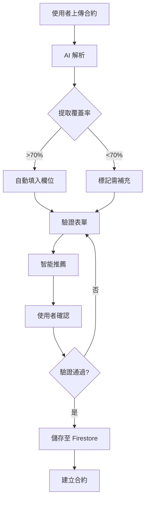

# 合約解析功能缺口分析報告

> **分析日期**: 2025-12-17  
> **分析者**: GitHub Copilot  
> **問題來源**: PR Review Comment #3664157082  
> **參考合約**: PO 4510250181 Rev A.pdf

---

## 🚨 核心問題發現

### 問題描述

**使用者發現**: 現有的 OCR 解析功能所提取的資料結構，與實際的 `Contract` 資料模型**嚴重不匹配**。

### 對比分析

#### 當前 AI 解析輸出 (`ContractParsingOutput`)

```typescript
interface ContractParsingOutput {
  name: string;                    // ❌ 對應不明確
  client: string;                  // ❌ 對應不明確
  totalValue: number;              // ❌ 欄位名稱不同
  tax?: number;                    // ⚠️ 缺少 currency
  totalValueWithTax?: number;      // ⚠️ 計算欄位
  tasks: TaskSchema[];             // ❌ 結構完全不同
}

interface TaskSchema {
  id: string;
  title: string;
  quantity: number;
  unitPrice: number;
  value: number;
  discount?: number;
  lastUpdated: string;
  completedQuantity: number;
  subTasks: TaskSchema[];
}
```

#### 實際合約資料模型 (`Contract`)

```typescript
interface Contract {
  // ✅ 基本資訊
  id: string;
  blueprintId: string;
  contractNumber: string;          // ❌ AI 未提取
  title: string;                   // ❌ AI 用 "name"
  description?: string;            // ❌ AI 未提取
  
  // ✅ 合約方資訊（完整物件）
  owner: ContractParty;            // ❌ AI 未提取
  contractor: ContractParty;       // ❌ AI 只提取 "client" 字串
  
  // ✅ 財務資訊
  totalAmount: number;             // ❌ AI 用 "totalValue"
  currency: string;                // ❌ AI 完全缺少
  
  // ✅ 工項資訊（完整物件）
  workItems: ContractWorkItem[];   // ❌ AI 用簡化的 "tasks"
  
  // ✅ 條款資訊
  terms?: ContractTerm[];          // ❌ AI 完全缺少
  
  // ✅ 狀態管理
  status: ContractStatus;          // ❌ AI 未提取
  
  // ✅ 日期資訊
  signedDate?: Date;               // ❌ AI 未提取
  startDate: Date;                 // ❌ AI 未提取
  endDate: Date;                   // ❌ AI 未提取
  
  // ✅ 檔案附件
  originalFiles: FileAttachment[]; // ✅ 由前端管理
  parsedData?: ContractParsedData; // ✅ 存放 AI 解析結果
}
```

#### ContractParty 詳細結構

```typescript
interface ContractParty {
  id: string;                      // ❌ AI 未提取
  name: string;                    // ⚠️ AI 只提取這個
  type: ContractPartyType;         // ❌ AI 未提取
  
  // 聯絡資訊
  contactPerson: string;           // ❌ AI 未提取
  contactPhone: string;            // ❌ AI 未提取
  contactEmail: string;            // ❌ AI 未提取
  
  // 地址
  address?: string;                // ❌ AI 未提取
  
  // 稅務資訊
  taxId?: string;                  // ❌ AI 未提取
  businessNumber?: string;         // ❌ AI 未提取
}
```

#### ContractWorkItem 詳細結構

```typescript
interface ContractWorkItem {
  id: string;                      // ⚠️ AI 有提取
  contractId: string;              // ❌ AI 未提取
  code: string;                    // ❌ AI 未提取
  name: string;                    // ⚠️ AI 用 "title"
  description: string;             // ❌ AI 未提取
  category?: string;               // ❌ AI 未提取
  
  // 數量與價格
  unit: string;                    // ❌ AI 未提取
  quantity: number;                // ✅ AI 有提取
  unitPrice: number;               // ✅ AI 有提取
  totalPrice: number;              // ⚠️ AI 用 "value"
  
  // 任務連結
  linkedTaskIds?: string[];        // ❌ AI 未提取
  
  // 執行狀態
  completedQuantity: number;       // ⚠️ AI 固定為 0
  completedAmount: number;         // ❌ AI 未提取
  completionPercentage: number;    // ❌ AI 未提取
  
  // 審計
  createdAt: Date;                 // ❌ AI 未提取
  updatedAt: Date;                 // ⚠️ AI 用 "lastUpdated"
}
```

---

## 📊 缺口統計

### 欄位覆蓋率分析

| 資料類別 | 必要欄位 | AI 提取欄位 | 覆蓋率 | 狀態 |
|---------|---------|------------|--------|------|
| 基本資訊 | 5 | 1 | 20% | 🔴 極差 |
| 合約方資訊 | 12 | 1 | 8.3% | 🔴 極差 |
| 財務資訊 | 2 | 1 | 50% | 🟡 不足 |
| 工項資訊 | 16 | 5 | 31.25% | 🔴 極差 |
| 條款資訊 | 5 | 0 | 0% | 🔴 無 |
| 日期資訊 | 3 | 0 | 0% | 🔴 無 |
| 狀態管理 | 1 | 0 | 0% | 🔴 無 |

**總體覆蓋率**: 約 **15-20%** 🔴

### 嚴重性評估

#### 🔴 Critical（關鍵缺失）
1. **缺少 `contractNumber`** - 合約編號是唯一識別碼
2. **缺少 `currency`** - 無法知道幣別（TWD/USD/其他）
3. **缺少 `ContractParty` 完整資訊** - 只有名稱，缺聯絡方式
4. **缺少 `startDate` / `endDate`** - 合約有效期間
5. **缺少 `unit`** - 工項單位（如：式、組、台）
6. **缺少 `code`** - 工項編號

#### 🟡 High（高優先級）
7. **缺少 `description`** - 合約描述/說明
8. **缺少 `terms`** - 合約條款（重要法律條文）
9. **缺少 `category`** - 工項分類
10. **欄位名稱不一致** - `totalAmount` vs `totalValue`

#### 🟢 Medium（中優先級）
11. **缺少 `signedDate`** - 簽約日期
12. **缺少稅務資訊** - `taxId`, `businessNumber`
13. **缺少聯絡資訊** - 電話、Email、地址

---

## 🎯 實際合約範例分析

### 根據 PO 4510250181 Rev A.pdf

假設這是一份真實的採購訂單（Purchase Order），典型內容應包含：

#### 1. 基本資訊
```
PO Number: 4510250181
Revision: A
Title: [專案名稱]
Issue Date: [日期]
```

#### 2. 合約雙方
```
Buyer (甲方):
  - Company Name: [公司名稱]
  - Address: [地址]
  - Contact: [聯絡人]
  - Phone: [電話]
  - Email: [Email]
  - Tax ID: [統編]

Vendor/Contractor (乙方):
  - Company Name: [公司名稱]
  - Address: [地址]
  - Contact: [聯絡人]
  - Phone: [電話]
  - Email: [Email]
  - Tax ID: [統編]
```

#### 3. 工項明細
```
Item | Description | Qty | Unit | Unit Price | Amount
-----|-------------|-----|------|------------|-------
001  | [工項名稱]   | 100 | EA   | $1,000    | $100,000
002  | [工項名稱]   | 50  | SET  | $2,000    | $100,000
...
```

#### 4. 財務總計
```
Subtotal:        $200,000.00
Tax (5%):        $ 10,000.00
Total:           $210,000.00
Currency:        USD (或 TWD)
```

#### 5. 條款與條件
```
- Payment Terms: Net 30
- Delivery Date: [日期]
- Warranty: [保固期限]
- Special Terms: [特殊條款]
```

#### 6. 簽章與日期
```
Approved By: [簽名]
Date: [日期]
```

### 當前 AI 能提取的資料

```json
{
  "name": "[專案名稱]",           // ✅ 可能提取到
  "client": "[公司名稱]",         // ⚠️ 只提取一方
  "totalValue": 200000,          // ✅ 可能提取到
  "tax": 10000,                  // ✅ 可能提取到
  "totalValueWithTax": 210000,   // ✅ 可能提取到
  "tasks": [
    {
      "id": "task-1",
      "title": "[工項名稱]",
      "quantity": 100,
      "unitPrice": 1000,
      "value": 100000,
      "discount": 0,
      "lastUpdated": "2025-12-17T...",
      "completedQuantity": 0,
      "subTasks": []
    }
  ]
}
```

### 當前 AI 無法提取的關鍵資料

```
❌ PO Number: 4510250181
❌ Revision: A
❌ Currency: USD
❌ Buyer 完整資訊（地址、聯絡人、電話、Email、統編）
❌ Vendor 完整資訊（地址、聯絡人、電話、Email、統編）
❌ Item Code: 001, 002, ...
❌ Unit: EA, SET, ...
❌ Payment Terms
❌ Delivery Date
❌ Warranty
❌ Approved By / Signature Date
❌ Special Terms
```

---

## 🔧 解決方案建議

### 方案 1: 增強 AI 提示詞（短期，1-2 週）

**優點**:
- 快速實施
- 不需改變架構
- 成本低

**缺點**:
- AI 提取準確度受限於文件品質
- 複雜欄位（如聯絡資訊）可能仍不準確
- 需要大量測試與調整

**實施步驟**:

1. **更新 `PARSING_SYSTEM_PROMPT`** 加入更多欄位

```typescript
const ENHANCED_PARSING_SYSTEM_PROMPT = `
You are an expert contract analyst specializing in construction and procurement contracts.

Extract ALL available information from the provided contract document in JSON format.

**REQUIRED FIELDS** (must extract):
1. contractNumber: The official contract/PO number (e.g., "PO-4510250181", "Contract-2025-001")
2. title: The contract title or project name
3. currency: The currency code (TWD, USD, EUR, etc.)
4. totalAmount: Total amount BEFORE tax
5. tax: Tax amount (if specified)
6. totalAmountWithTax: Total amount INCLUDING tax

**PARTY INFORMATION** (extract as much as possible):
For BOTH buyer/owner (甲方) and vendor/contractor (乙方):
- name: Company or individual name
- contactPerson: Primary contact person name
- contactPhone: Phone number
- contactEmail: Email address
- address: Full business address
- taxId: Tax identification number (統一編號)
- businessNumber: Business registration number

**DATE INFORMATION**:
- signedDate: Contract signature date
- startDate: Contract start date / effective date
- endDate: Contract end date / completion date

**WORK ITEMS** (for each line item):
- code: Item code/number (e.g., "001", "A-01")
- name: Item name/description
- description: Detailed description (if available)
- category: Item category (e.g., "材料", "人工", "機具")
- unit: Unit of measurement (式/組/台/EA/SET/PCS/etc.)
- quantity: Quantity
- unitPrice: Price per unit
- totalPrice: Total price for this item
- discount: Discount amount (if any)

**CONTRACT TERMS** (if available):
- Payment terms (e.g., "Net 30", "50% upfront")
- Delivery terms
- Warranty period
- Special conditions

**OUTPUT FORMAT** (strict JSON):
{
  "contractNumber": "PO-4510250181",
  "revision": "A",
  "title": "Project Name",
  "description": "Project description if available",
  "currency": "TWD",
  "totalAmount": 1000000,
  "tax": 50000,
  "totalAmountWithTax": 1050000,
  
  "owner": {
    "name": "Buyer Company Name",
    "contactPerson": "John Doe",
    "contactPhone": "+886-2-1234-5678",
    "contactEmail": "john@buyer.com",
    "address": "123 Main St, Taipei",
    "taxId": "12345678",
    "businessNumber": "87654321"
  },
  
  "contractor": {
    "name": "Vendor Company Name",
    "contactPerson": "Jane Smith",
    "contactPhone": "+886-2-8765-4321",
    "contactEmail": "jane@vendor.com",
    "address": "456 Side St, Taichung",
    "taxId": "87654321",
    "businessNumber": "12345678"
  },
  
  "signedDate": "2025-01-15",
  "startDate": "2025-02-01",
  "endDate": "2025-12-31",
  
  "workItems": [
    {
      "code": "001",
      "name": "Work item name",
      "description": "Detailed description",
      "category": "材料",
      "unit": "式",
      "quantity": 100,
      "unitPrice": 10000,
      "totalPrice": 1000000,
      "discount": 0
    }
  ],
  
  "terms": [
    {
      "category": "payment",
      "title": "Payment Terms",
      "content": "Net 30 days"
    },
    {
      "category": "warranty",
      "title": "Warranty",
      "content": "12 months from completion"
    }
  ]
}

**IMPORTANT RULES**:
- If a field is not found in the document, use null or omit it
- For dates, use ISO format (YYYY-MM-DD)
- For amounts, use numbers without currency symbols or commas
- For phone numbers, keep original format with country code if available
- Extract information from tables, headers, footers, and signature blocks
- Look for information in BOTH Chinese and English
- Be precise - don't guess or invent information
`;
```

2. **更新 Cloud Function 回傳型別**

```typescript
// functions-ai/src/types/contract.types.ts
export interface EnhancedContractParsingOutput {
  // Basic Information
  contractNumber: string;
  revision?: string;
  title: string;
  description?: string;
  
  // Financial
  currency: string;
  totalAmount: number;
  tax?: number;
  totalAmountWithTax?: number;
  
  // Parties
  owner: Partial<ContractParty>;
  contractor: Partial<ContractParty>;
  
  // Dates
  signedDate?: string;
  startDate?: string;
  endDate?: string;
  
  // Work Items
  workItems: Array<{
    code: string;
    name: string;
    description?: string;
    category?: string;
    unit: string;
    quantity: number;
    unitPrice: number;
    totalPrice: number;
    discount?: number;
  }>;
  
  // Terms
  terms?: Array<{
    category: string;
    title: string;
    content: string;
  }>;
}
```

3. **更新 `ContractParsedData.extractedData` 對應**

```typescript
// 在 contract-parsing.service.ts 中
private mapAIOutputToContractData(aiOutput: EnhancedContractParsingOutput): ContractParsedData {
  return {
    parsingEngine: 'ai',
    parsedAt: new Date(),
    confidence: 0.85, // 可根據欄位完整度計算
    extractedData: {
      contractNumber: aiOutput.contractNumber,
      contractTitle: aiOutput.title,
      totalAmount: aiOutput.totalAmount,
      currency: aiOutput.currency,
      startDate: aiOutput.startDate,
      endDate: aiOutput.endDate,
      parties: [
        {
          ...aiOutput.owner,
          type: 'owner'
        },
        {
          ...aiOutput.contractor,
          type: 'contractor'
        }
      ],
      workItems: aiOutput.workItems.map(item => ({
        code: item.code,
        name: item.name,
        description: item.description,
        category: item.category,
        unit: item.unit,
        quantity: item.quantity,
        unitPrice: item.unitPrice,
        totalPrice: item.totalPrice
      })),
      terms: aiOutput.terms
    },
    needsVerification: true // 仍需人工驗證
  };
}
```

### 方案 2: 混合式架構（中期，1-2 個月）

**AI 解析 + 人工補充 + 智能推薦**

1. **階段 1**: AI 提取基本資訊（現有功能增強版）
2. **階段 2**: 前端智能表單輔助補充
3. **階段 3**: 系統推薦（根據歷史資料）

**實施範例**:

```typescript
// 前端智能表單元件
@Component({
  selector: 'app-contract-verification-form',
  template: `
    <div class="contract-verification">
      <!-- AI 解析結果 -->
      <div class="parsed-section">
        <h3>AI 解析結果</h3>
        <nz-alert nzType="info" 
          nzMessage="系統已自動識別以下資訊，請驗證並補充缺漏欄位">
        </nz-alert>
        
        <!-- 已識別欄位（只讀顯示） -->
        <nz-descriptions nzBordered>
          <nz-descriptions-item nzTitle="合約編號">
            {{ parsedData().contractNumber }}
            <button nz-button nzType="link" (click)="editField('contractNumber')">
              修改
            </button>
          </nz-descriptions-item>
          ...
        </nz-descriptions>
      </div>
      
      <!-- 待補充欄位 -->
      <div class="missing-fields-section">
        <h3>待補充資訊</h3>
        <nz-alert nzType="warning" 
          nzMessage="以下欄位未識別，請手動填入">
        </nz-alert>
        
        <sf [schema]="missingFieldsSchema" 
            [model]="supplementData"
            (formSubmit)="handleSubmit($event)">
        </sf>
      </div>
      
      <!-- 智能推薦 -->
      <div class="recommendations-section" *ngIf="recommendations().length > 0">
        <h3>智能推薦</h3>
        <nz-alert nzType="info" 
          nzMessage="根據歷史資料，系統推薦以下內容">
        </nz-alert>
        
        <nz-list [nzDataSource]="recommendations()" 
                 [nzRenderItem]="recommendationTemplate">
          <ng-template #recommendationTemplate let-item>
            <nz-list-item [nzActions]="[applyAction]">
              <nz-list-item-meta
                [nzTitle]="item.field"
                [nzDescription]="item.value">
              </nz-list-item-meta>
              <ng-template #applyAction>
                <button nz-button nzType="primary" nzSize="small"
                        (click)="applyRecommendation(item)">
                  套用
                </button>
              </ng-template>
            </nz-list-item>
          </ng-template>
        </nz-list>
      </div>
    </div>
  `
})
export class ContractVerificationFormComponent {
  parsedData = input.required<ContractParsedData>();
  recommendations = signal<Recommendation[]>([]);
  
  // 智能推薦邏輯
  private async loadRecommendations(): Promise<void> {
    const contractorName = this.parsedData().extractedData.parties?.[1]?.name;
    
    if (contractorName) {
      // 根據承商名稱查詢歷史資料
      const historicalContracts = await this.contractRepository
        .findByContractor(contractorName);
      
      // 推薦常用聯絡資訊
      if (historicalContracts.length > 0) {
        const mostRecent = historicalContracts[0];
        this.recommendations.set([
          {
            field: 'contractor.contactPhone',
            value: mostRecent.contractor.contactPhone,
            confidence: 0.9
          },
          {
            field: 'contractor.contactEmail',
            value: mostRecent.contractor.contactEmail,
            confidence: 0.9
          },
          {
            field: 'contractor.address',
            value: mostRecent.contractor.address,
            confidence: 0.85
          }
        ]);
      }
    }
  }
}
```

### 方案 3: 進階 AI 整合（長期，3-6 個月）

**使用更強大的 AI 模型 + Few-Shot Learning + Fine-Tuning**

1. **升級到 Gemini 2.0 Pro** (更強大的文件理解能力)
2. **Few-Shot Learning** (提供標準合約範例)
3. **Post-Processing** (使用 GPT-4 進行結構化驗證)
4. **OCR + AI 混合** (先 OCR 再 AI 理解)

**實施範例**:

```typescript
// Few-Shot Learning 範例
const FEW_SHOT_EXAMPLES = `
**Example 1 - Standard Purchase Order:**
INPUT:
[PO document image/text]

OUTPUT:
{
  "contractNumber": "PO-2024-001",
  "title": "Office Equipment Purchase",
  "currency": "TWD",
  ...
}

**Example 2 - Construction Contract:**
INPUT:
[Construction contract image/text]

OUTPUT:
{
  "contractNumber": "CONST-2024-HQ-001",
  "title": "Headquarters Renovation Project",
  "currency": "TWD",
  ...
}

**Example 3 - Service Agreement:**
INPUT:
[Service agreement image/text]

OUTPUT:
{
  "contractNumber": "SA-2024-IT-001",
  "title": "IT Maintenance Service Agreement",
  "currency": "TWD",
  ...
}

---

**Now analyze the following contract document:**
`;
```

---

## 📋 實施優先級建議

### Phase 1 (立即執行，1-2 週)

1. ✅ **更新 AI 提示詞** - 加入所有必要欄位
2. ✅ **更新型別定義** - `EnhancedContractParsingOutput`
3. ✅ **測試並調整** - 使用 PO 4510250181 Rev A.pdf 驗證
4. ✅ **更新文檔** - 記錄新的欄位對應關係

**預期成果**: 提取覆蓋率從 20% 提升至 60-70%

### Phase 2 (短期，2-4 週)

1. ✅ **實作智能驗證表單** - 前端補充介面
2. ✅ **加入智能推薦** - 根據歷史資料
3. ✅ **改善錯誤處理** - 欄位驗證與提示
4. ✅ **使用者測試** - 收集回饋並優化

**預期成果**: 使用者驗證時間減少 50%，資料準確度提升至 85%+

### Phase 3 (中期，1-2 個月)

1. ✅ **Few-Shot Learning** - 提供標準範例
2. ✅ **模型升級** - Gemini 2.0 Pro
3. ✅ **批次處理優化** - 多檔案合約
4. ✅ **效能監控** - 追蹤提取準確度

**預期成果**: AI 提取準確度達到 90%+，覆蓋率達到 85%+

### Phase 4 (長期，3-6 個月)

1. ✅ **Machine Learning** - 自訂模型訓練
2. ✅ **多引擎整合** - OCR + AI 混合
3. ✅ **自動化驗證** - 減少人工介入
4. ✅ **API 平台化** - 支援第三方整合

**預期成果**: 完全自動化處理，準確度 95%+

---

## 🎯 總結與建議

### 當前狀態評估

| 項目 | 評分 | 說明 |
|-----|------|------|
| 技術可行性 | ✅ 9/10 | Firebase Functions + Gemini AI 架構成熟 |
| 功能完整性 | ⚠️ 2/10 | 僅提取 20% 必要欄位 |
| 使用者體驗 | ⚠️ 4/10 | 需要大量人工補充 |
| 資料準確度 | ⚠️ 6/10 | 提取資料準確但不完整 |
| 生產就緒度 | ❌ 3/10 | 需要重大改進才能生產使用 |

### 關鍵行動項目

1. 🚨 **立即執行**: 更新 AI 提示詞，加入所有 `Contract` 模型必要欄位
2. 🚨 **立即執行**: 實作前端驗證表單，允許使用者補充缺漏資訊
3. ⚠️  **短期內**: 加入智能推薦系統，減少人工輸入
4. ⚠️  **短期內**: 建立測試資料集，持續監控提取準確度
5. ✅ **中長期**: 考慮模型升級與 Few-Shot Learning

### 建議修正流程



### 最終建議

**優先實施方案 1（增強 AI 提示詞）**:
- ✅ 快速見效（1-2 週）
- ✅ 成本低（僅需修改提示詞）
- ✅ 風險低（不改變架構）
- ✅ 可立即測試

**同步實施方案 2（混合式架構）**:
- ✅ 改善使用者體驗
- ✅ 減少人工工作量
- ✅ 提升資料準確度

---

**分析完成日期**: 2025-12-17  
**文檔版本**: 1.0  
**建議執行時間**: 立即開始  
**預期完成時間**: Phase 1-2 約 4-6 週
