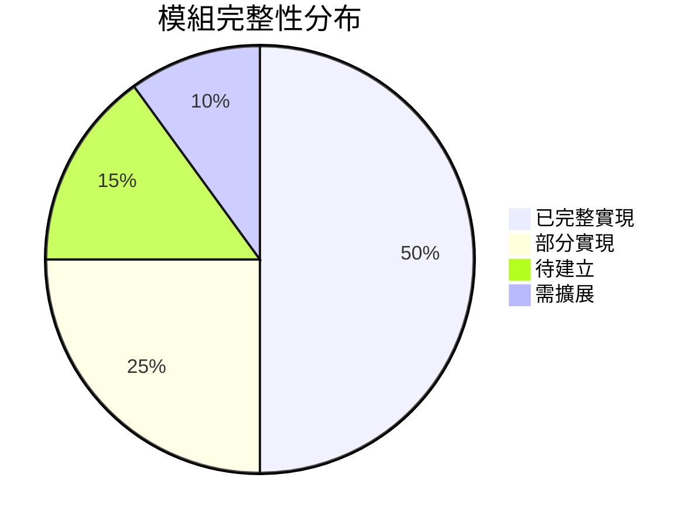
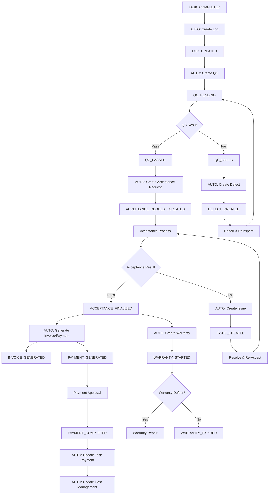
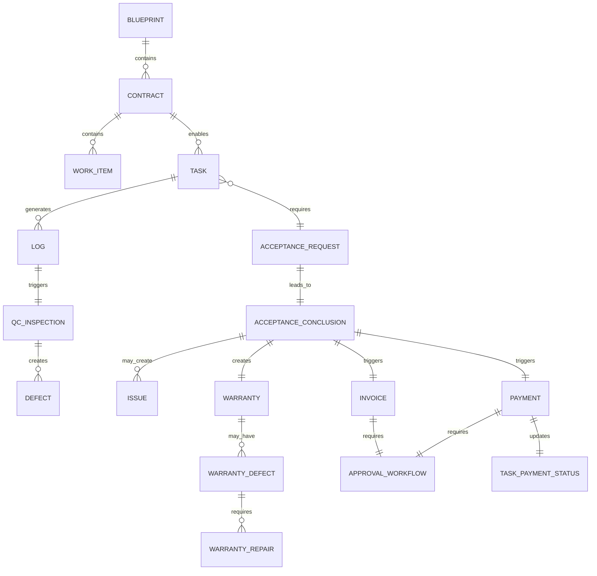
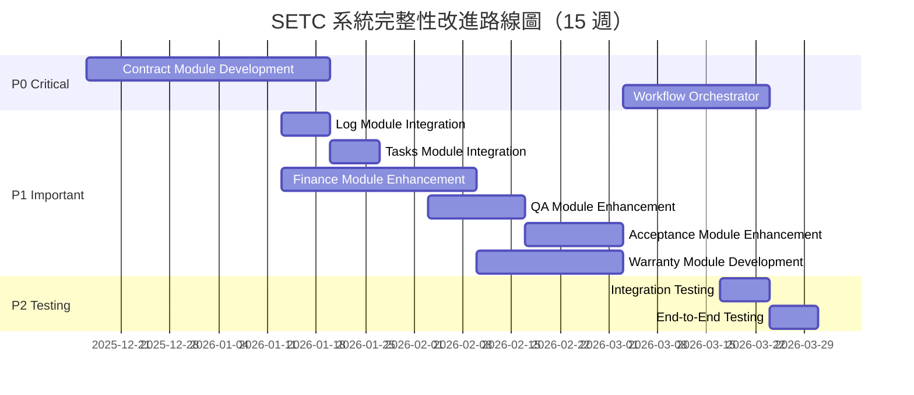

# SETC 工作流程分析總結報告

> **總結版本**: 1.1.0  
> **分析完成日期**: 2025-12-15  
> **最後更新日期**: 2025-12-16  
> **分析範圍**: 完整 SETC 工作流程、模組規劃、實施路線圖

---

## 📊 執行摘要

本報告完整分析了 GigHub 系統的 SETC 工作流程，評估系統完整性，規劃新模組開發與現有模組擴展，並提供詳細的實施路線圖。

### 🎉 實作進度更新 (2025-12-16)

✅ **已完成實作**: 3 個模組 (23 個 SETC 任務)
1. **Issue Module** (SETC-001 ~ 008) - 21 個 TypeScript 檔案
2. **Contract Module** (SETC-009 ~ 017) - 24 個 TypeScript 檔案  
3. **Event Automation** (SETC-018 ~ 023) - 13 個 TypeScript 檔案

✅ **事件驅動自動化已實現**:
- TaskCompletedHandler - 任務完成自動建立日誌
- LogCreatedHandler - 日誌建立自動建立 QC 待驗
- QCPassedHandler - QC 通過自動建立驗收
- QCFailedHandler - QC 失敗自動建立缺失
- AcceptanceFinalizedHandler - 驗收通過自動建立請款與保固

### 核心成果

✅ **已完成分析文件**: 4 份
1. **SETC-ANALYSIS.md** - 工作流程完整性分析（75/100 分）
2. **MODULE-PLANNING.md** - 新模組規劃（Contract、Warranty、Issue）
3. **MODULE-MODIFICATIONS.md** - 現有模組修改分析（6 個模組）
4. **TREE-EXPANSION.md** - 專案檔案樹擴展規劃

### 關鍵發現

#### 優勢 ✅
- ✅ SETC 工作流程定義完整且符合建築業實務
- ✅ 現有 13 個模組架構良好，Blueprint Container 設計完善
- ✅ 事件驅動架構已建立，適合工作流程自動化
- ✅ TypeScript 嚴格模式 + Angular 20 現代特性

#### 待改進 ⚠️
- ❌ 缺少 **Contract Module**（合約管理）- P0 關鍵
- ❌ 缺少 **Warranty Module**（保固管理）- P1 重要
- ❌ **Issue Module** 需獨立為新模組 - P1 重要 ⭐
- ⚠️ Finance Module 請款/付款功能不完整
- ⚠️ QA Module 缺失管理需強化
- ⚠️ 事件驅動自動化流程需實現

---

## 1. 工作流程完整性評估

### 1.1 三大階段覆蓋度

| 階段 | 覆蓋度 | 狀態 | 說明 |
|------|--------|------|------|
| **階段零: 合約建立與來源** | 0% | ❌ 缺失 | 缺少 Contract Module |
| **階段一: 任務與施工** | 90% | ✅ 良好 | Tasks Module 已實現 |
| **階段二: 品質與驗收** | 70% | ⚠️ 部分 | 缺少缺失/問題管理、保固模組 |
| **階段三: 財務與成本** | 40% | ⚠️ 不足 | Invoice/Payment 功能不完整 |

**總體評分**: **75/100**

### 1.2 模組完整性



**現狀統計**:
- 已完整實現：6/13 模組（Tasks, Log, Audit Logs, Material, Safety, Communication, Climate）
- 部分實現：2/13 模組（Finance, QA）
- 需擴展：4/13 模組（Workflow, Tasks, Log, Cloud）
- 待建立：3 個新模組（Contract, Warranty, Issue）⭐

**Issue Module 獨立說明**：
- 原本嵌入在 Acceptance Module 中
- 現獨立為新模組，支援手動與自動建立
- 可從多個來源建立（Acceptance、QC、Warranty、Safety）

---

## 2. 新增模組規劃

### 2.1 Contract Module（合約管理模組）

#### 基本資訊
- **Module ID**: `contract`
- **Priority**: **P0（關鍵核心）**
- **預估工時**: 5 週
- **實施週次**: Week 1-5

#### 核心功能
```typescript
// 6 個核心服務
1. ContractManagementService    // 合約 CRUD
2. ContractUploadService         // 合約上傳
3. ContractParsingService        // OCR/AI 解析
4. ContractStatusService         // 狀態管理
5. ContractItemsService          // 工項管理
6. ContractChangeService         // 變更管理
```

#### 資料模型
- Contract（合約主模型）
- ContractParty（合約雙方）
- ContractWorkItem（合約工項）
- ContractTerm（合約條款）
- ContractChange（合約變更）
- ContractFile（合約檔案）

#### 整合點
- **Tasks Module**: 驗證合約是否已生效
- **Finance Module**: 提供工項與金額資料
- **Workflow Module**: 合約審批流程
- **Audit Logs Module**: 記錄合約操作

### 2.2 Warranty Module（保固管理模組）

#### 基本資訊
- **Module ID**: `warranty`
- **Priority**: **P1（重要）**
- **預估工時**: 3 週
- **實施週次**: Week 10-12

#### 核心功能
```typescript
// 5 個核心服務
1. WarrantyPeriodService         // 保固期管理
2. WarrantyItemService           // 保固項目
3. WarrantyDefectService         // 保固缺失
4. WarrantyRepairService         // 保固維修
5. WarrantyCertificateService    // 保固證明
```

#### 整合點
- **Acceptance Module**: 驗收通過後自動建立保固記錄
- **Communication Module**: 保固期滿提醒
- **QA Module**: 保固缺失可能觸發 QC 檢查
- **Issue Module**: 保固缺失可建立 Issue 追蹤

### 2.3 Issue Module（問題管理模組）⭐ 新增

#### 基本資訊
- **Module ID**: `issue`
- **Priority**: **P1（重要）**
- **預估工時**: 2 週
- **實施週次**: Week 9-10
- **狀態**: 從 Acceptance Module 獨立為新模組

#### 獨立原因
**當前問題**：
- Issue 嵌入在 Acceptance Module 中
- 限制了應用範圍（只能從驗收失敗建立）
- 無法手動建立問題單
- 無法從其他模組建立

**獨立後優勢**：
- ✅ 彈性建立方式（手動 + 自動）
- ✅ 多來源整合（Acceptance、QC、Warranty、Safety 等）
- ✅ 獨立生命週期管理
- ✅ 統一的問題追蹤與報表

#### 核心功能
```typescript
// 5 個核心服務
1. IssueManagementService       // 問題單 CRUD（手動建立）
2. IssueCreationService          // 自動建立服務（多來源）
3. IssueResolutionService        // 問題處理
4. IssueVerificationService      // 問題驗證
5. IssueLifecycleService         // 生命週期管理
```

#### 資料模型
```typescript
export interface Issue {
  source: 'manual' | 'acceptance' | 'qc' | 'warranty' | 'safety';
  // ... 其他欄位
}
```

#### 整合點
1. **Acceptance Module** - 驗收失敗時自動建立
2. **QA Module** - QC 檢查失敗時可選擇性建立
3. **Warranty Module** - 保固缺失建立 Issue 追蹤
4. **Safety Module** - 安全事故建立 Issue 追蹤
5. **手動建立** - 使用者可直接建立問題單

---

## 3. 現有模組修改規劃

### 3.1 修改優先順序

| 模組 | 優先級 | 預估時間 | 主要修改 |
|------|--------|----------|----------|
| Issue Module | P1 | 2 週 | **獨立為新模組**，手動+自動建立 ⭐ |
| Finance Module | P1 | 4 週 | 擴展 Invoice/Payment，新增審核流程 |
| QA Module | P1 | 2 週 | 擴展 Defect Management，完整生命週期 |
| Acceptance Module | P1 | 1 週 | 移除 Issue，整合 Issue Module API |
| Workflow Module | P0 | 3 週 | 新增 SETC Orchestrator |
| Tasks Module | P2 | 1 週 | 整合合約驗證、款項狀態 |
| Log Module | P2 | 1 週 | 整合自動建立機制 |

### 3.2 關鍵修改內容

#### Issue Module 獨立 ⭐ 新增
```typescript
// 核心服務（5 個）
- IssueManagementService        // 問題單 CRUD（手動建立）
- IssueCreationService           // 自動建立服務（多來源）
- IssueResolutionService         // 問題處理
- IssueVerificationService       // 問題驗證
- IssueLifecycleService          // 生命週期管理

// 核心功能
- 支援手動建立問題單
- 從多個來源自動建立（Acceptance、QC、Warranty、Safety）
- 獨立的問題追蹤生命週期
- 統一的問題管理與統計
- 關注點分離（Acceptance 專注於驗收流程）
```

#### Finance Module 擴展
```typescript
// 新增服務（4 個）
- InvoiceGenerationService       // 請款單生成
- InvoiceApprovalService         // 請款審核
- PaymentGenerationService       // 付款單生成
- PaymentApprovalService         // 付款審核

// 新增功能
- 自動生成請款/付款清單
- 業主/承商分離管理
- 可請款/可付款百分比計算
- 審核流程整合
- 自動更新任務款項狀態
```

#### QA Module 擴展
```typescript
// 新增服務（3 個）
- DefectLifecycleService         // 缺失生命週期
- DefectResolutionService        // 缺失整改
- DefectReinspectionService      // 缺失複驗

// 新增功能
- 從 QC 檢查自動建立缺失單
- 完整缺失處理流程（整改→複驗→關閉）
- 缺失統計與報表
```

#### Acceptance Module 修改
```typescript
// 主要修改
- 移除內嵌的 Issue Service
- 整合獨立的 Issue Module API
- 驗收不通過時，呼叫 IssueModule.creation.autoCreateFromAcceptance()
- 維持驗收核心功能：申請、審查、初驗、複驗、結論
```

#### Workflow Module 擴展
```typescript
// 新增核心服務（1 個）
- SETCOrchestratorService        // SETC 工作流程編排器

// 新增功能
- 統一事件處理
- 自動化流程編排
- 階段間自動觸發
- 錯誤處理與重試
```

---

## 4. 事件驅動自動化流程

### 4.1 完整事件流



### 4.2 關鍵自動化節點

| 節點 | 觸發事件 | 自動動作 | 後續事件 |
|------|----------|----------|----------|
| 1 | TASK_COMPLETED | 建立施工日誌 | LOG_CREATED |
| 2 | LOG_CREATED | 建立 QC 待驗 | QC_PENDING |
| 3 | QC_FAILED | 建立缺失單 | DEFECT_CREATED |
| 4 | QC_PASSED | 建立驗收申請 | ACCEPTANCE_REQUEST_CREATED |
| 5 | ACCEPTANCE_FINALIZED | 生成請款/付款單 | INVOICE_GENERATED, PAYMENT_GENERATED |
| 6 | ACCEPTANCE_FINALIZED | 建立保固記錄 | WARRANTY_STARTED |
| 7 | PAYMENT_COMPLETED | 更新任務款項狀態 | TASK_PAYMENT_UPDATED |

---

## 5. 資料模型設計

### 5.1 Firestore Collections 架構

```
根 Collections（15 個）:
├── /blueprints                 # 專案
├── /contracts                  # ⭐ 新增：合約
├── /tasks                      # 任務
├── /construction_logs          # 施工日誌
├── /qc_inspections            # QC 檢查
├── /defects                    # ⭐ 新增：缺失（獨立）
├── /acceptance_requests        # 驗收申請
├── /acceptance_conclusions     # 驗收結論
├── /issues                     # ⭐ 新增：問題（獨立）
├── /warranties                 # ⭐ 新增：保固
├── /invoices                   # 請款單
├── /payments                   # 付款單
├── /audit_logs                 # 稽核日誌
├── /notifications              # 通知
└── /files                      # 檔案

Subcollections:
├── /contracts/{id}/work_items          # 合約工項
├── /contracts/{id}/terms               # 合約條款
├── /contracts/{id}/changes             # 合約變更
├── /defects/{id}/resolutions           # 缺失整改
├── /defects/{id}/reinspections         # 缺失複驗
├── /warranties/{id}/items              # 保固項目
├── /warranties/{id}/defects            # 保固缺失
├── /warranties/{id}/repairs            # 保固維修
├── /invoices/{id}/items                # 請款項目
├── /invoices/{id}/approvals            # 請款審核
├── /payments/{id}/items                # 付款項目
└── /payments/{id}/approvals            # 付款審核
```

### 5.2 關鍵資料實體關係



---

## 6. 實施路線圖

### 6.1 時程總覽



### 6.2 里程碑

| 里程碑 | 日期 | 交付內容 |
|--------|------|----------|
| M1 | Week 5 | Contract Module 完成 |
| M2 | Week 9 | Finance Module 擴展完成 |
| M3 | Week 10 | QA & Acceptance 擴展完成 |
| M4 | Week 12 | Warranty Module 完成 |
| M5 | Week 15 | Workflow Orchestrator & 整合測試完成 |

### 6.3 資源需求

| 角色 | 人數 | 週數 | 工作內容 |
|------|------|------|----------|
| Backend Developer | 2 | 15 | 模組開發、API 設計 |
| Frontend Developer | 1 | 10 | UI 元件開發（後期） |
| QA Engineer | 1 | 5 | 測試案例、整合測試（後期） |
| Tech Lead | 1 | 15 | 架構設計、Code Review |

**總人月**: 約 **9-10 人月**

---

## 7. 風險與挑戰

### 7.1 技術風險

| 風險 | 嚴重性 | 機率 | 緩解策略 |
|------|--------|------|----------|
| OCR/AI 解析準確度不足 | 高 | 中 | 加入人工補正機制，逐步提升模型 |
| Event Bus 效能瓶頸 | 中 | 低 | 實施事件批次處理與優先級 |
| Firestore 讀寫成本 | 中 | 中 | 實施快取策略、批次操作 |
| 複雜工作流程除錯困難 | 高 | 中 | 完善日誌系統、事件追蹤 |

### 7.2 業務風險

| 風險 | 影響 | 緩解策略 |
|------|------|----------|
| 需求變更頻繁 | 高 | 採用敏捷開發、每週 Demo |
| 使用者培訓成本高 | 中 | 建立詳細文件、提供培訓課程 |
| 資料遷移複雜 | 中 | 提前規劃遷移策略、提供工具 |

---

## 8. 成功指標

### 8.1 技術指標

- ✅ 代碼覆蓋率 ≥ 80%
- ✅ API 回應時間 < 500ms（P95）
- ✅ 事件處理成功率 ≥ 99%
- ✅ 零 Critical 安全漏洞
- ✅ TypeScript 嚴格模式無錯誤

### 8.2 業務指標

- ✅ SETC 工作流程完整覆蓋 ≥ 95%
- ✅ 手動操作減少 ≥ 60%
- ✅ 資料一致性 = 100%
- ✅ 用戶滿意度 ≥ 4.5/5

---

## 9. 後續行動

### 9.1 立即行動（本週）

1. ✅ 評審分析文件（本文件）
2. ✅ 確認實施優先順序
3. ✅ 成立開發團隊
4. ✅ 設定專案管理工具（Jira/GitHub Projects）

### 9.2 下週行動

1. ⚡ 開始 Contract Module 開發
2. ⚡ 建立開發環境與 CI/CD
3. ⚡ 撰寫詳細技術規格文件
4. ⚡ 建立測試環境

---

## 10. 附錄

### 10.1 相關文件

| 文件名稱 | 路徑 | 說明 |
|----------|------|------|
| SETC 工作流程 | `docs/discussions/SETC.md` | 原始工作流程定義 |
| 完整性分析 | `docs/discussions/SETC-ANALYSIS.md` | 詳細分析報告 |
| 新模組規劃 | `docs/discussions/MODULE-PLANNING.md` | Contract & Warranty 規劃 |
| 模組修改分析 | `docs/discussions/MODULE-MODIFICATIONS.md` | 現有模組修改計畫 |
| 檔案樹擴展 | `docs/discussions/TREE-EXPANSION.md` | TREE.md 擴展規劃 |
| 專案檔案樹 | `docs/discussions/TREE.md` | 當前檔案結構 |
| 系統架構 | `docs/GigHub_Architecture.md` | 系統架構文件 |

### 10.2 聯絡資訊

**專案負責人**: GigHub Development Team  
**技術聯絡**: 請透過 GitHub Issues 回報問題  
**文件更新**: 2025-12-15

---

## 結論

本次分析完整評估了 GigHub 系統基於 SETC 工作流程的完整性，識別出關鍵缺失（Contract & Warranty 模組），規劃了詳細的實施路線圖（15 週），並提供了清晰的技術與業務指標。

**核心建議**: 優先實施 **Contract Module**（P0），作為整個系統的基石，然後依序擴展 Finance、QA、Acceptance 模組，最後建立 Warranty Module 和 Workflow Orchestrator，實現完整的 SETC 工作流程自動化。

**預期成果**: 系統完整性從 **75/100** 提升至 **95/100**，實現 SETC 工作流程 95%+ 覆蓋，手動操作減少 60%+，為 GigHub 系統奠定堅實的企業級基礎。

---

**文件版本**: 1.1.0  
**文件狀態**: 進行中  
**最後更新**: 2025-12-16  
**維護單位**: GigHub Development Team
