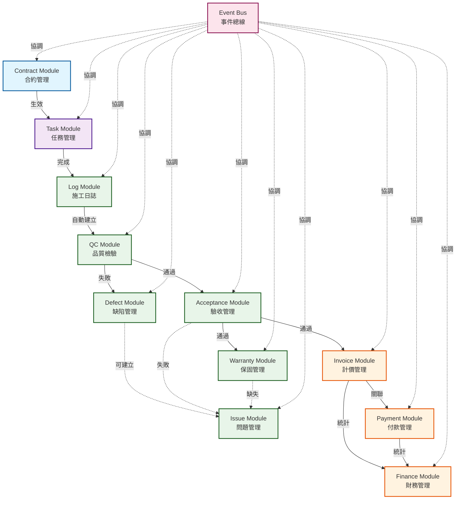
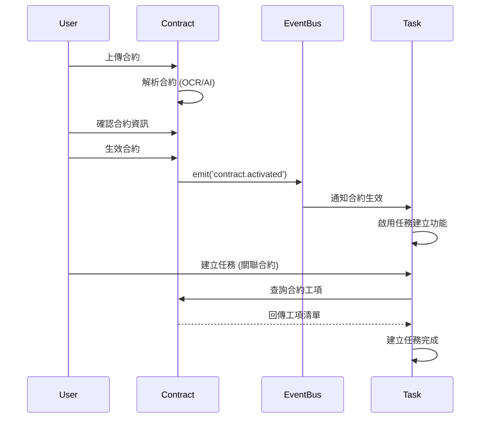
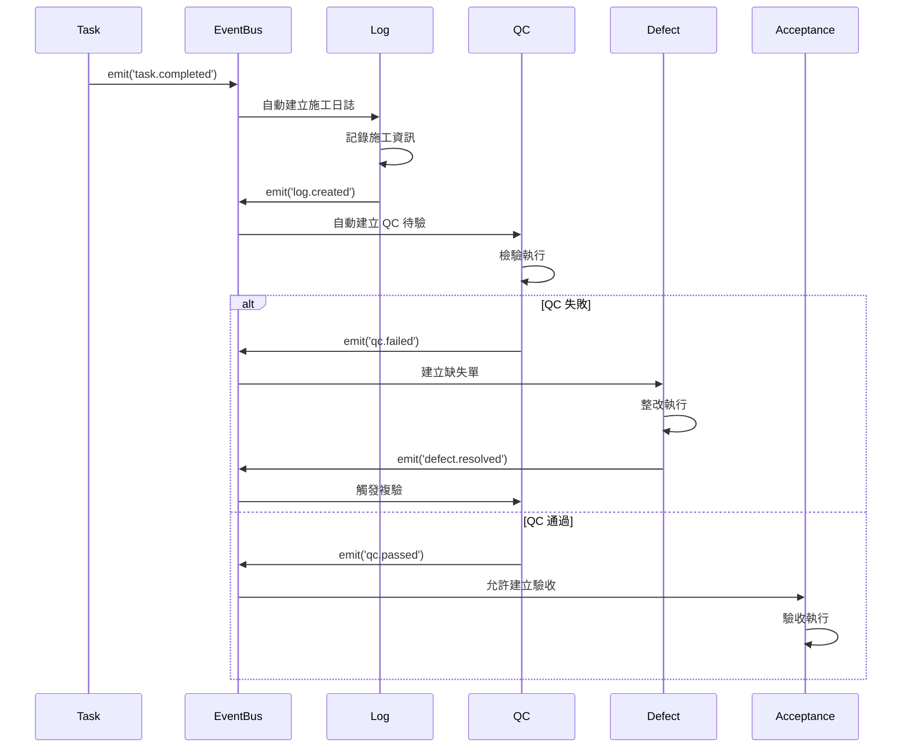
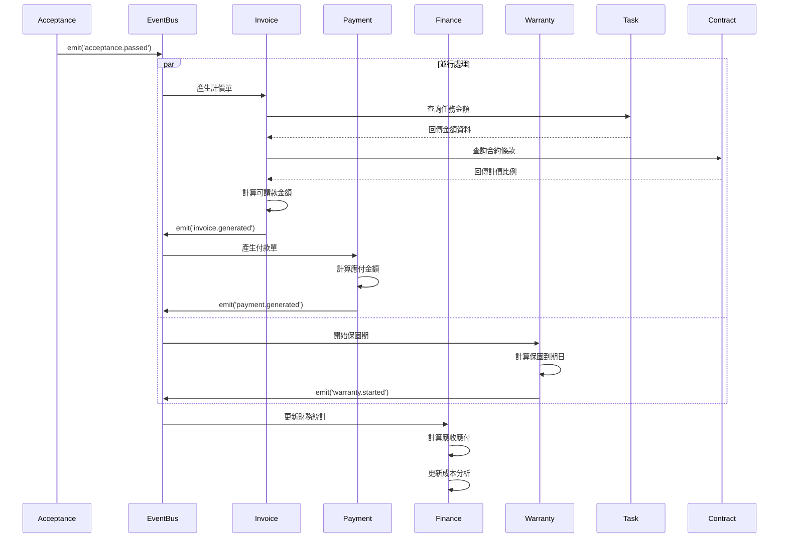

# 模組依賴分析 (Module Dependencies Analysis)

> **文件版本**: 1.0.0  
> **建立日期**: 2025-12-16  
> **目的**: 詳細分析各模組間的依賴關係、資料流向與整合點

---

## 📊 依賴關係總覽

### 依賴圖



---

## 🔗 依賴類型說明

### 強依賴 (Strong Dependency)
- **定義**: 模組 A 的核心功能必須依賴模組 B 的輸出
- **特徵**: 無法單獨測試或運行
- **範例**: Task → Contract (任務必須關聯合約)

### 弱依賴 (Weak Dependency)
- **定義**: 模組 A 可選擇性使用模組 B 的功能
- **特徵**: 可獨立運作，但整合後功能更完整
- **範例**: Defect → Issue (缺失可選擇建立問題單)

### 事件依賴 (Event-Driven Dependency)
- **定義**: 透過事件總線解耦的非同步依賴
- **特徵**: 鬆散耦合、非阻塞
- **範例**: Task.completed → Log.autoCreate

---

## 📋 依賴矩陣

### 完整依賴表

| 模組 | 依賴模組 | 依賴類型 | 依賴強度 | 整合方式 | SETC 範圍 |
|------|---------|---------|---------|---------|----------|
| **Contract** | - | - | - | - | 009~017 |
| **Task** | Contract | 強依賴 | 必須 | 直接呼叫 + 事件 | 046~053 |
| **Log** | Task | 強依賴 | 必須 | 事件驅動 | - |
| **QC** | Log | 強依賴 | 必須 | 事件驅動 | - |
| **Defect** | QC | 強依賴 | 必須 | 事件驅動 | 040~045 |
| **Defect** | Issue | 弱依賴 | 選填 | 事件驅動 | 040~045 |
| **Acceptance** | QC | 強依賴 | 必須 | 事件驅動 | 054~061 |
| **Acceptance** | Task | 強依賴 | 必須 | 直接查詢 | 054~061 |
| **Acceptance** | Issue | 弱依賴 | 選填 | 事件驅動 | 054~061 |
| **Issue** | Acceptance, QC, Warranty | 弱依賴 | 選填 | 事件驅動 | 001~008 |
| **Warranty** | Acceptance | 強依賴 | 必須 | 事件驅動 | 032~039 |
| **Warranty** | Issue | 弱依賴 | 選填 | 事件驅動 | 032~039 |
| **Invoice** | Acceptance | 強依賴 | 必須 | 事件驅動 | 024~031, 062~069 |
| **Invoice** | Task | 強依賴 | 必須 | 直接查詢 | 024~031, 062~069 |
| **Invoice** | Contract | 強依賴 | 必須 | 直接查詢 | 024~031, 062~069 |
| **Payment** | Invoice | 強依賴 | 必須 | 直接呼叫 + 事件 | 024~031, 062~069 |
| **Payment** | Contract | 強依賴 | 必須 | 直接查詢 | 024~031, 062~069 |
| **Finance** | Invoice | 強依賴 | 必須 | 聚合查詢 + 事件 | 062~069 |
| **Finance** | Payment | 強依賴 | 必須 | 聚合查詢 + 事件 | 062~069 |

---

## 🔄 資料流分析

### Phase 0 → Phase 1 資料流



**資料流向**:
1. Contract.workItems → Task.relatedWorkItems
2. Contract.budget → Task.estimatedCost
3. Contract.id → Task.contractId

**共享資料**:
- 工項清單 (Work Items)
- 預算金額 (Budget)
- 業主資訊 (Owner Info)
- 承商資訊 (Contractor Info)

---

### Phase 1 → Phase 2 資料流



**資料流向**:
1. Task.completionData → Log.workContent
2. Task.photos → Log.photos
3. Log.id → QC.sourceId
4. QC.findings → Defect.description
5. QC.id → Acceptance.prerequisite

**共享資料**:
- 任務資訊 (Task Info)
- 施工照片 (Photos)
- 檢驗結果 (Inspection Results)
- 缺失描述 (Defect Description)

---

### Phase 2 → Phase 3 資料流



**資料流向**:
1. Acceptance.taskId → Invoice.relatedTask
2. Task.amount → Invoice.baseAmount
3. Contract.paymentTerms → Invoice.percentage
4. Invoice.totalAmount → Payment.payableAmount
5. Invoice + Payment → Finance.ledger

**共享資料**:
- 驗收資訊 (Acceptance Info)
- 任務金額 (Task Amount)
- 計價比例 (Billing Percentage)
- 付款條款 (Payment Terms)
- 保固期限 (Warranty Period)

---

## 🔍 依賴分析

### Contract Module (Phase 0)

#### 無依賴 (Independent)
- 完全獨立模組
- 可單獨開發與測試
- 為其他模組提供基礎資料

#### 提供給其他模組的介面
```typescript
interface ContractPublicAPI {
  // 查詢
  getById(id: string): Observable<Contract>;
  getActiveContracts(blueprintId: string): Observable<Contract[]>;
  getWorkItems(contractId: string): Observable<WorkItem[]>;
  
  // 事件
  on('contract.activated'): Observable<ContractActivatedEvent>;
  on('contract.updated'): Observable<ContractUpdatedEvent>;
}
```

#### 被依賴的資料
- 合約基本資訊 (Contract Info)
- 工項清單 (Work Items)
- 預算金額 (Budget)
- 計價比例 (Billing Percentage)
- 保固條款 (Warranty Terms)

---

### Task Module (Phase 1)

#### 依賴模組
- **Contract Module** (強依賴)
  - 查詢合約工項
  - 驗證合約狀態
  - 關聯合約 ID

#### 提供給其他模組的介面
```typescript
interface TaskPublicAPI {
  // 查詢
  getById(id: string): Observable<Task>;
  getByContract(contractId: string): Observable<Task[]>;
  getTaskAmount(taskId: string): Observable<number>;
  
  // 事件
  on('task.created'): Observable<TaskCreatedEvent>;
  on('task.completed'): Observable<TaskCompletedEvent>;
  on('task.updated'): Observable<TaskUpdatedEvent>;
}
```

#### 被依賴的資料
- 任務基本資訊 (Task Info)
- 任務金額 (Task Amount)
- 完工資料 (Completion Data)
- 關聯合約 (Related Contract)

---

### Issue Module (Phase 2)

#### 依賴模組
- **Acceptance Module** (弱依賴)
  - 接收驗收失敗事件
  - 建立驗收問題單

- **QC Module** (弱依賴)
  - 接收 QC 失敗事件
  - 建立 QC 問題單

- **Warranty Module** (弱依賴)
  - 接收保固缺失事件
  - 建立保固問題單

#### 特點：反向依賴模式
- Issue Module 不主動呼叫其他模組
- 完全透過事件被動接收
- 高度解耦，易於擴展

#### 提供給其他模組的介面
```typescript
interface IssuePublicAPI {
  // 建立
  createFromAcceptance(data: AcceptanceFailureData): Promise<string>;
  createFromQC(data: QCFailureData): Promise<string>;
  createFromWarranty(data: WarrantyDefectData): Promise<string>;
  
  // 查詢
  getBySource(source: string, sourceId: string): Observable<Issue[]>;
  
  // 事件
  on('issue.created'): Observable<IssueCreatedEvent>;
  on('issue.resolved'): Observable<IssueResolvedEvent>;
}
```

---

### Acceptance Module (Phase 2)

#### 依賴模組
- **QC Module** (強依賴)
  - 驗證 QC 通過狀態
  - 查詢 QC 檢驗結果

- **Task Module** (強依賴)
  - 查詢任務資訊
  - 關聯任務 ID

- **Issue Module** (弱依賴)
  - 驗收失敗時建立問題單

#### 提供給其他模組的介面
```typescript
interface AcceptancePublicAPI {
  // 查詢
  getById(id: string): Observable<Acceptance>;
  getByTask(taskId: string): Observable<Acceptance[]>;
  
  // 狀態
  isApproved(acceptanceId: string): Observable<boolean>;
  
  // 事件
  on('acceptance.passed'): Observable<AcceptancePassedEvent>;
  on('acceptance.failed'): Observable<AcceptanceFailedEvent>;
}
```

#### 被依賴的資料
- 驗收狀態 (Acceptance Status)
- 驗收金額 (Acceptance Amount)
- 驗收日期 (Acceptance Date)
- 關聯任務 (Related Task)

---

### Finance Module (Phase 3)

#### 依賴模組
- **Invoice Module** (強依賴)
  - 聚合計價資料
  - 計算應收總額

- **Payment Module** (強依賴)
  - 聚合付款資料
  - 計算應付總額

#### 特點：聚合模式
- 不直接操作業務流程
- 僅負責資料統計與分析
- 高度依賴其他模組的事件

#### 提供給其他模組的介面
```typescript
interface FinancePublicAPI {
  // 統計查詢
  getTotalReceivable(blueprintId: string): Observable<number>;
  getTotalPayable(blueprintId: string): Observable<number>;
  getGrossProfit(blueprintId: string): Observable<number>;
  getCostAnalysis(blueprintId: string): Observable<CostAnalysis>;
  
  // 事件
  on('finance.ledger_updated'): Observable<LedgerUpdatedEvent>;
}
```

---

## ⚙️ 依賴注入模式

### Repository 層依賴
```typescript
// ✅ 正確: Repository 無業務邏輯依賴
@Injectable({ providedIn: 'root' })
export class TaskRepository {
  private firestore = inject(Firestore);
  
  // 只依賴基礎設施 (Firestore)
  findAll(): Observable<Task[]> { ... }
}
```

### Service 層依賴
```typescript
// ✅ 正確: Service 注入 Repository + 事件總線
@Injectable({ providedIn: 'root' })
export class TaskService {
  private repository = inject(TaskRepository);
  private eventBus = inject(EnhancedEventBusService);
  private contractService = inject(ContractService); // 強依賴
  
  async createTask(data: CreateTaskDto): Promise<string> {
    // 驗證合約
    const contract = await this.contractService.getById(data.contractId);
    if (contract.status !== 'active') {
      throw new Error('Contract is not active');
    }
    
    // 建立任務
    const taskId = await this.repository.create(data);
    
    // 發送事件
    this.eventBus.emit({ type: 'task.created', ... });
    
    return taskId;
  }
}
```

### 元件層依賴
```typescript
// ✅ 正確: 元件只注入 Service，不直接依賴 Repository
@Component({ ... })
export class TaskListComponent {
  private taskService = inject(TaskService);
  private contractService = inject(ContractService);
  
  tasks = signal<Task[]>([]);
  availableContracts = signal<Contract[]>([]);
  
  ngOnInit(): void {
    this.loadTasks();
    this.loadContracts();
  }
}
```

---

## 🚫 反模式與解決方案

### 反模式 1: 循環依賴

**問題**:
```typescript
// ❌ 錯誤
class TaskService {
  constructor(private acceptanceService: AcceptanceService) {}
}

class AcceptanceService {
  constructor(private taskService: TaskService) {}
}
```

**解決方案**:
```typescript
// ✅ 正確: 使用事件解耦
class TaskService {
  constructor(private eventBus: EventBusService) {}
  
  completeTask(id: string): void {
    this.eventBus.emit({ type: 'task.completed', data: { taskId: id } });
  }
}

class AcceptanceService {
  constructor(private eventBus: EventBusService) {}
  
  ngOnInit(): void {
    this.eventBus.on('task.completed').subscribe(event => {
      this.createAcceptanceRequest(event.data.taskId);
    });
  }
}
```

---

### 反模式 2: 跨層依賴

**問題**:
```typescript
// ❌ 錯誤: 元件直接注入 Repository
@Component({ ... })
export class TaskComponent {
  constructor(private taskRepository: TaskRepository) {}
}
```

**解決方案**:
```typescript
// ✅ 正確: 元件注入 Service
@Component({ ... })
export class TaskComponent {
  private taskService = inject(TaskService);
}
```

---

### 反模式 3: 過度依賴

**問題**:
```typescript
// ❌ 錯誤: 注入過多依賴
class InvoiceService {
  constructor(
    private taskService: TaskService,
    private contractService: ContractService,
    private acceptanceService: AcceptanceService,
    private qcService: QCService,
    private logService: LogService
  ) {}
}
```

**解決方案**:
```typescript
// ✅ 正確: 只注入必要依賴，其他透過事件
class InvoiceService {
  private repository = inject(InvoiceRepository);
  private eventBus = inject(EventBusService);
  private taskService = inject(TaskService); // 必要依賴
  
  ngOnInit(): void {
    // 透過事件接收資料
    this.eventBus.on('acceptance.passed').subscribe(event => {
      this.autoGenerate(event.data);
    });
  }
}
```

---

## 🔗 相關文檔

- **模組整合指南**: [SETC-MODULE-INTEGRATION.md](../01-overview/SETC-MODULE-INTEGRATION.md)
- **工作流程階段**: [SETC-WORKFLOW-PHASES.md](../01-overview/SETC-WORKFLOW-PHASES.md)
- **實施時程**: [IMPLEMENTATION-TIMELINE.md](./IMPLEMENTATION-TIMELINE.md)
- **架構文檔**: [../../ARCHITECTURE.md](../../ARCHITECTURE.md)

---

**最後更新**: 2025-12-16  
**維護者**: GigHub Development Team  
**版本**: 1.0.0
