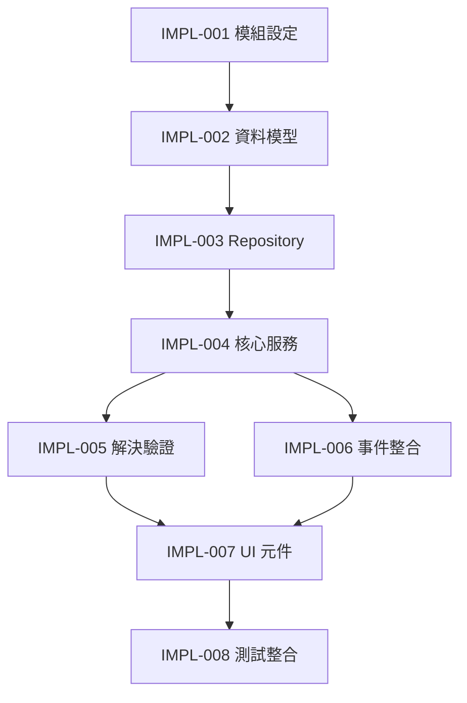

# 🔧 實作指南 (Implementation Guides)

> **目的**: Issue Module 實作步驟詳細指南 (SETC-IMPLEMENTATION-001 ~ 008)

---

## 📁 文件清單

### 實作步驟文檔

#### SETC-IMPLEMENTATION-001: Issue Module Setup
**檔案**: `SETC-IMPLEMENTATION-001-issue-module-setup.md`  
**內容**: 模組初始化與環境設定

#### SETC-IMPLEMENTATION-002: Data Models
**檔案**: `SETC-IMPLEMENTATION-002-data-models.md`  
**內容**: TypeScript 資料模型定義

#### SETC-IMPLEMENTATION-003: Repository
**檔案**: `SETC-IMPLEMENTATION-003-repository.md`  
**內容**: Repository 層實作

#### SETC-IMPLEMENTATION-004: Core Services
**檔案**: `SETC-IMPLEMENTATION-004-core-services.md`  
**內容**: 核心業務邏輯服務

#### SETC-IMPLEMENTATION-005: Resolution Verification
**檔案**: `SETC-IMPLEMENTATION-005-resolution-verification.md`  
**內容**: 解決與驗證流程

#### SETC-IMPLEMENTATION-006: Event Integration
**檔案**: `SETC-IMPLEMENTATION-006-event-integration.md`  
**內容**: 事件驅動整合

#### SETC-IMPLEMENTATION-007: UI Components
**檔案**: `SETC-IMPLEMENTATION-007-ui-components.md`  
**內容**: 使用者介面實作

#### SETC-IMPLEMENTATION-008: Testing Integration
**檔案**: `SETC-IMPLEMENTATION-008-testing-integration.md`  
**內容**: 測試覆蓋與整合

---

### 輔助文檔

#### SETC-IMPLEMENTATION-INDEX.md
**目的**: 實作步驟總索引  
**內容**: 
- 8 個實作步驟概覽
- 步驟間依賴關係
- 快速導航連結

#### SETC-IMPLEMENTATION-READINESS.md
**目的**: 實作就緒檢查清單  
**內容**:
- 環境準備檢查
- 依賴項確認
- 工具準備確認
- 前置知識評估

#### SETC-IMPLEMENTATION-SUMMARY.md
**目的**: 實作總結與經驗分享  
**內容**:
- 實作要點總結
- 常見問題 FAQ
- 最佳實踐建議
- 陷阱與注意事項

---

## 🎯 實作流程

---

## 📖 使用指南

### 開始實作前
1. ✅ 閱讀 **SETC-IMPLEMENTATION-READINESS.md** 確認準備就緒
2. 📖 瀏覽 **SETC-IMPLEMENTATION-INDEX.md** 了解全局
3. 📚 準備必要工具與環境

### 實作過程中
1. 📋 按序號順序執行 (001 → 008)
2. ✅ 完成每步驟後檢查驗收標準
3. 🧪 及時執行單元測試
4. 📝 記錄遇到的問題與解決方案

### 實作完成後
1. 📊 閱讀 **SETC-IMPLEMENTATION-SUMMARY.md**
2. 🔍 對照最佳實踐檢查
3. 📝 更新文檔或貢獻經驗

---

## 📊 實作統計

| 項目 | 數值 |
|------|------|
| 實作步驟 | 8 個 |
| 輔助文檔 | 3 個 |
| 預估工時 | 已完成（首個模組） |
| 程式碼覆蓋率目標 | > 80% |

---

## 🔗 相關連結

- **Issue Module 任務**: [10-issue-module](../10-issue-module/)
- **總覽文檔**: [01-overview](../01-overview/)
- **核心規範**: [00-core](../00-core/)

---

**適用模組**: Issue Module  
**最後更新**: 2025-12-16  
**文件數量**: 11 個  
**狀態**: ✅ 已整理
