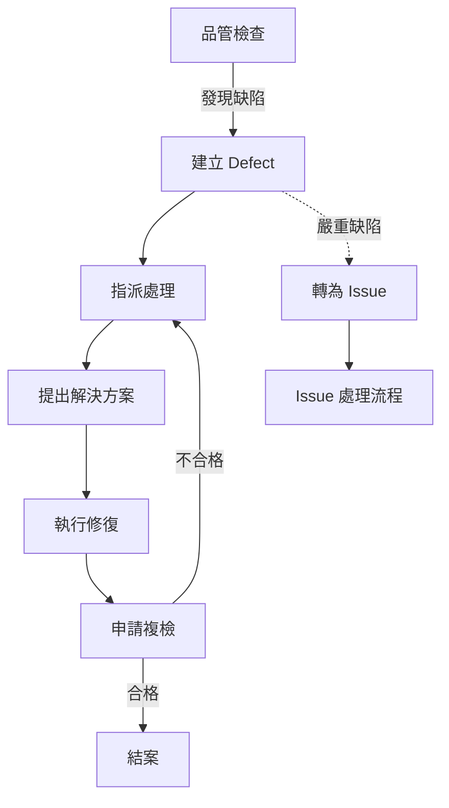

# 🔧 Defect Module (缺陷管理模組)

> **SETC 任務編號**: SETC-040 ~ SETC-045  
> **模組狀態**: ✅ 文檔完成  
> **預估工時**: 10 天

---

## 📋 任務清單

### SETC-040: Defect Service Expansion
**檔案**: `SETC-040-defect-service-expansion.md`  
**目的**: 擴展缺陷服務基礎功能  
**內容**: 服務架構優化、功能擴展規劃

### SETC-041: Defect Lifecycle Service
**檔案**: `SETC-041-defect-lifecycle-service.md`  
**目的**: 缺陷生命週期管理服務  
**內容**: 狀態機、生命週期追蹤、自動化觸發

### SETC-042: Defect Resolution Service
**檔案**: `SETC-042-defect-resolution-service.md`  
**目的**: 缺陷解決服務  
**內容**: 解決方案提交、責任歸屬、成本追蹤

### SETC-043: Defect Reinspection Service
**檔案**: `SETC-043-defect-reinspection-service.md`  
**目的**: 缺陷複檢服務  
**內容**: 複檢流程、合格判定、不合格處理

### SETC-044: Defect-Issue Integration
**檔案**: `SETC-044-defect-issue-integration.md`  
**目的**: 缺陷與問題模組整合  
**內容**: Defect → Issue 轉換、雙向同步、狀態映射

### SETC-045: Defect Testing & Integration
**檔案**: `SETC-045-defect-testing-integration.md`  
**目的**: 缺陷模組測試與整合  
**內容**: 單元測試、整合測試、E2E 測試

---

## 🏗️ 核心功能

### 生命週期管理
- ✅ 缺陷狀態轉換 (New → InProgress → Resolved → Verified)
- ✅ 自動化狀態觸發
- ✅ 生命週期事件通知
- ✅ 狀態歷史追蹤

### 解決流程
- ✅ 解決方案提交
- ✅ 責任歸屬判定
- ✅ 修復成本追蹤
- ✅ 解決進度監控

### 複檢機制
- ✅ 複檢申請流程
- ✅ 複檢結果判定
- ✅ 合格 → 結案
- ✅ 不合格 → 重新處理

### Issue 整合
- ✅ Defect → Issue 自動轉換
- ✅ 狀態雙向同步
- ✅ 資料一致性維護
- ✅ 歷史記錄保留

---

## 🔄 業務流程

---

## 📊 進度追蹤

| 任務編號 | 任務名稱 | 文檔狀態 | 實作狀態 |
|---------|---------|---------|---------|
| SETC-040 | Expansion | ✅ 完成 | ⏳ 未開始 |
| SETC-041 | Lifecycle | ✅ 完成 | ⏳ 未開始 |
| SETC-042 | Resolution | ✅ 完成 | ⏳ 未開始 |
| SETC-043 | Reinspection | ✅ 完成 | ⏳ 未開始 |
| SETC-044 | Issue Integration | ✅ 完成 | ⏳ 未開始 |
| SETC-045 | Testing | ✅ 完成 | ⏳ 未開始 |

---

## 🔗 相關連結

- **上層目錄**: [返回 discussions](../)
- **Issue Module**: [10-issue-module](../10-issue-module/)
- **Warranty Module**: [50-warranty-module](../50-warranty-module/)

---

**優先級**: P1 (中優先級)  
**最後更新**: 2025-12-16  
**任務數**: 6 個  
**狀態**: ✅ 文檔完成
