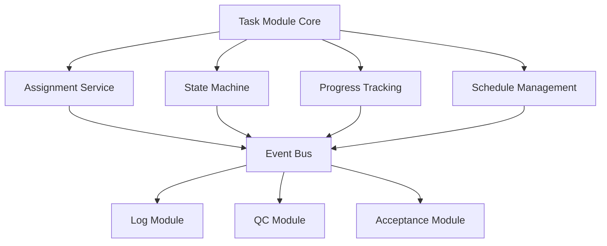

# 📋 Task Module Enhancement (任務模組擴展)

> **SETC 任務編號**: SETC-046 ~ SETC-053  
> **模組狀態**: ✅ 文檔完成  
> **預估工時**: 16 天

---

## 📋 任務清單

### SETC-046: Task Module Enhancement Planning
**檔案**: `SETC-046-task-module-enhancement-planning.md`  
**目的**: 任務模組擴展規劃  
**內容**: 功能分析、擴展方向、優先級排序

### SETC-047: Task Repository Enhancement
**檔案**: `SETC-047-task-repository-enhancement.md`  
**目的**: Repository 層增強  
**內容**: 複雜查詢、效能優化、快取策略

### SETC-048: Task Assignment Service
**檔案**: `SETC-048-task-assignment-service.md`  
**目的**: 任務指派服務  
**內容**: 智慧指派、負載平衡、技能匹配

### SETC-049: Task State Machine Service
**檔案**: `SETC-049-task-state-machine-service.md`  
**目的**: 任務狀態機服務  
**內容**: 狀態轉換、驗證規則、自動化觸發

### SETC-050: Task Progress Tracking Service
**檔案**: `SETC-050-task-progress-tracking-service.md`  
**目的**: 任務進度追蹤服務  
**內容**: 進度計算、里程碑、預警機制

### SETC-051: Task Schedule Management Service
**檔案**: `SETC-051-task-schedule-management-service.md`  
**目的**: 任務排程管理服務  
**內容**: 時程規劃、依賴關係、資源分配

### SETC-052: Task Event Integration
**檔案**: `SETC-052-task-event-integration.md`  
**目的**: 任務事件整合  
**內容**: 領域事件、跨模組通訊、自動化觸發

### SETC-053: Task UI Components & Testing
**檔案**: `SETC-053-task-ui-components-testing.md`  
**目的**: 任務 UI 元件與測試  
**內容**: 進階元件、甘特圖、看板視圖

---

## 🏗️ 核心功能擴展

### 智慧指派
- ✅ 技能匹配演算法
- ✅ 負載平衡
- ✅ 優先級調度
- ✅ 自動重新指派

### 狀態機管理
- ✅ 完整狀態轉換規則
- ✅ 條件驗證
- ✅ 自動化觸發
- ✅ 狀態歷史追蹤

### 進度追蹤
- ✅ 自動進度計算
- ✅ 里程碑管理
- ✅ 延遲預警
- ✅ 進度報表

### 排程管理
- ✅ 任務依賴關係
- ✅ 資源衝突偵測
- ✅ 關鍵路徑分析
- ✅ 時程優化建議

### UI 增強
- ✅ 甘特圖視圖
- ✅ 看板視圖
- ✅ 行事曆視圖
- ✅ 拖拽排程

---

## 🔄 擴展架構

---

## 📊 進度追蹤

| 任務編號 | 任務名稱 | 文檔狀態 | 實作狀態 |
|---------|---------|---------|---------|
| SETC-046 | Planning | ✅ 完成 | ⏳ 未開始 |
| SETC-047 | Repository | ✅ 完成 | ⏳ 未開始 |
| SETC-048 | Assignment | ✅ 完成 | ⏳ 未開始 |
| SETC-049 | State Machine | ✅ 完成 | ⏳ 未開始 |
| SETC-050 | Progress | ✅ 完成 | ⏳ 未開始 |
| SETC-051 | Schedule | ✅ 完成 | ⏳ 未開始 |
| SETC-052 | Events | ✅ 完成 | ⏳ 未開始 |
| SETC-053 | UI & Test | ✅ 完成 | ⏳ 未開始 |

---

## 🔗 相關連結

- **上層目錄**: [返回 discussions](../)
- **Automation**: [30-automation](../30-automation/)
- **Acceptance**: [80-acceptance-module](../80-acceptance-module/)

---

**優先級**: P1 (中優先級)  
**最後更新**: 2025-12-16  
**任務數**: 8 個  
**狀態**: ✅ 文檔完成
