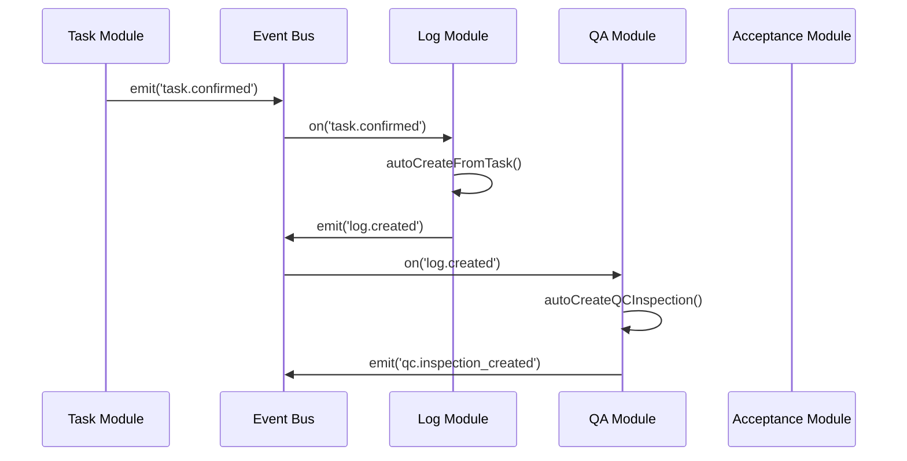
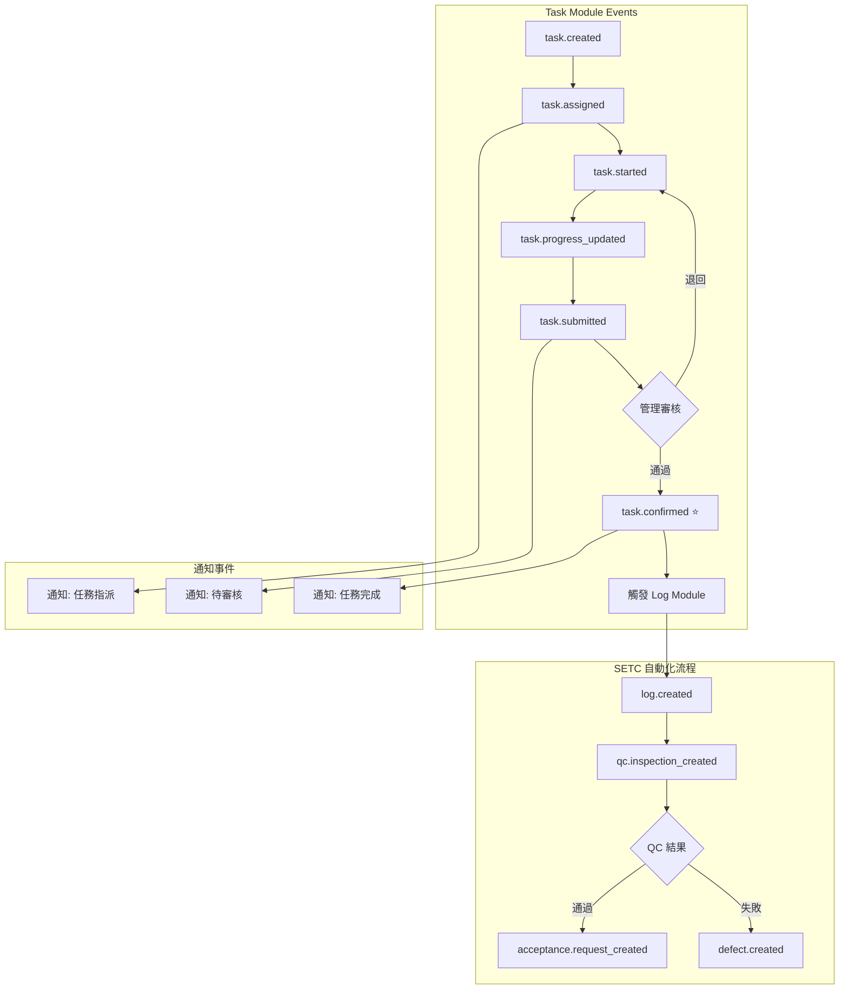

# SETC-052: Task Event Integration

> **任務編號**: SETC-052  
> **模組**: Task Module (任務模組)  
> **優先級**: P1 (Important)  
> **預估工時**: 2 天  
> **依賴**: SETC-050, SETC-051  
> **狀態**: 📋 待開始

---

## 📋 任務概述

### 目標
實作任務模組的事件整合服務，與 SETC 工作流程中的其他模組透過 Event Bus 進行通訊，確保任務完成後自動觸發後續流程。

### 範圍
- 定義任務模組所有事件類型
- 實作事件發送機制
- 設定與其他模組的事件訂閱
- 整合 SETC 自動化工作流程

---

## 🔄 SETC 工作流程整合

### 任務在 SETC 中的位置

```
階段一：任務與施工階段
───────────────────────
任務建立（關聯合約/工項/金額）【手動】
    ↓
指派用戶 / 團隊【手動】
    ↓
施工執行
    ↓
提報完成【手動】
    ↓
管理確認完成【手動】⭐ 關鍵控制點
    ↓
[EVENT: task.confirmed]
    ↓
自動建立施工日誌 【自動】→ Log Module 處理
```

### 關鍵事件流程



---

## 🏗️ 技術實作

### 事件類型定義

```typescript
/**
 * Task Module 事件類型定義
 */
export const TASK_EVENT_TYPES = {
  // 生命週期事件
  TASK_CREATED: 'task.created',
  TASK_UPDATED: 'task.updated',
  TASK_DELETED: 'task.deleted',
  
  // 指派事件
  TASK_ASSIGNED: 'task.assigned',
  TASK_REASSIGNED: 'task.reassigned',
  TASK_UNASSIGNED: 'task.unassigned',
  
  // 狀態事件
  TASK_STATUS_CHANGED: 'task.status_changed',
  TASK_STARTED: 'task.started',
  TASK_SUBMITTED: 'task.submitted',
  TASK_CONFIRMED: 'task.confirmed',      // ⭐ SETC 關鍵事件
  TASK_CANCELLED: 'task.cancelled',
  
  // 進度事件
  TASK_PROGRESS_UPDATED: 'task.progress_updated',
  TASK_PROGRESS_COMPLETE: 'task.progress_complete',
  
  // 排程事件
  TASK_SCHEDULED: 'task.scheduled',
  TASK_RESCHEDULED: 'task.rescheduled',
  TASK_DUE_SOON: 'task.due_soon',
  TASK_OVERDUE: 'task.overdue'
} as const;

export type TaskEventType = typeof TASK_EVENT_TYPES[keyof typeof TASK_EVENT_TYPES];

// ============ 事件 Payload 定義 ============

export interface TaskCreatedEvent {
  taskId: string;
  taskTitle: string;
  blueprintId: string;
  contractId?: string;
  createdBy: string;
  timestamp: Date;
}

export interface TaskAssignedEvent {
  taskId: string;
  taskTitle: string;
  blueprintId: string;
  assigneeId: string;
  assigneeType: 'user' | 'team';
  assigneeName: string;
  assignedBy: string;
  previousAssignee?: string;
  timestamp: Date;
}

export interface TaskStatusChangedEvent {
  taskId: string;
  taskTitle: string;
  blueprintId: string;
  fromStatus: string;
  toStatus: string;
  changedBy: string;
  notes?: string;
  timestamp: Date;
}

/**
 * ⭐ SETC 關鍵事件：任務確認完成
 * 此事件觸發自動建立施工日誌
 */
export interface TaskConfirmedEvent {
  taskId: string;
  taskTitle: string;
  blueprintId: string;
  contractId?: string;
  workItemId?: string;
  confirmedBy: string;
  confirmedByName: string;
  confirmedAt: Date;
  completionNotes?: string;
  
  // 用於自動建立施工日誌的資料
  taskData: {
    category: string;
    description?: string;
    assignedTo?: string;
    assignedTeam?: string;
    actualStartDate?: Date;
    actualEndDate?: Date;
    progress: number;
  };
}

export interface TaskProgressUpdatedEvent {
  taskId: string;
  taskTitle: string;
  blueprintId: string;
  previousProgress: number;
  newProgress: number;
  updatedBy: string;
  timestamp: Date;
}

export interface TaskOverdueEvent {
  taskId: string;
  taskTitle: string;
  blueprintId: string;
  dueDate: Date;
  daysOverdue: number;
  assigneeId?: string;
  assigneeName?: string;
  timestamp: Date;
}
```

### 事件服務實作

```typescript
import { Injectable, inject, OnDestroy } from '@angular/core';
import { Subject, takeUntil, interval } from 'rxjs';
import { IEventBus } from '@core/blueprint/platform/event-bus';
import { TaskRepository } from '../repositories/task.repository';
import { 
  TASK_EVENT_TYPES,
  TaskCreatedEvent,
  TaskConfirmedEvent,
  TaskOverdueEvent
} from './task-events.types';

@Injectable({ providedIn: 'root' })
export class TaskEventService implements OnDestroy {
  private eventBus = inject(IEventBus);
  private taskRepository = inject(TaskRepository);
  
  private destroy$ = new Subject<void>();
  
  // 逾期檢查間隔 (每小時)
  private readonly OVERDUE_CHECK_INTERVAL = 60 * 60 * 1000;

  constructor() {
    this.setupEventListeners();
    this.startOverdueChecker();
  }

  ngOnDestroy(): void {
    this.destroy$.next();
    this.destroy$.complete();
  }

  // ============ 事件發送方法 ============

  /**
   * 發送任務建立事件
   */
  emitTaskCreated(data: TaskCreatedEvent): void {
    this.eventBus.emit(TASK_EVENT_TYPES.TASK_CREATED, data);
    console.log('[TaskEventService] Task created:', data.taskId);
  }

  /**
   * 發送任務確認完成事件 ⭐ SETC 關鍵
   */
  emitTaskConfirmed(data: TaskConfirmedEvent): void {
    this.eventBus.emit(TASK_EVENT_TYPES.TASK_CONFIRMED, data);
    console.log('[TaskEventService] Task confirmed (SETC key point):', data.taskId);
    
    // 記錄 SETC 關鍵控制點
    this.recordControlPoint({
      type: 'task.confirmed',
      taskId: data.taskId,
      actor: data.confirmedBy,
      timestamp: data.confirmedAt,
      notes: data.completionNotes
    });
  }

  /**
   * 發送任務逾期事件
   */
  emitTaskOverdue(data: TaskOverdueEvent): void {
    this.eventBus.emit(TASK_EVENT_TYPES.TASK_OVERDUE, data);
    console.log('[TaskEventService] Task overdue:', data.taskId, data.daysOverdue, 'days');
  }

  // ============ 事件監聽設定 ============

  private setupEventListeners(): void {
    // 監聽合約生效事件 - 可能需要建立關聯任務
    this.eventBus.on('contract.activated')
      .pipe(takeUntil(this.destroy$))
      .subscribe(async (data: any) => {
        console.log('[TaskEventService] Contract activated:', data.contractId);
        // TODO: 根據合約工項自動建議任務
      });

    // 監聽驗收失敗事件 - 可能需要建立修正任務
    this.eventBus.on('acceptance.rejected')
      .pipe(takeUntil(this.destroy$))
      .subscribe(async (data: any) => {
        console.log('[TaskEventService] Acceptance rejected:', data.acceptanceId);
        // TODO: 自動建立修正任務
      });

    // 監聯 QC 失敗事件 - 可能需要建立整改任務
    this.eventBus.on('qc.inspection_failed')
      .pipe(takeUntil(this.destroy$))
      .subscribe(async (data: any) => {
        console.log('[TaskEventService] QC failed:', data.inspectionId);
        // TODO: 自動建立整改任務
      });
  }

  // ============ 逾期任務檢查 ============

  private startOverdueChecker(): void {
    interval(this.OVERDUE_CHECK_INTERVAL)
      .pipe(takeUntil(this.destroy$))
      .subscribe(() => {
        this.checkOverdueTasks();
      });

    // 啟動時立即檢查一次
    this.checkOverdueTasks();
  }

  private async checkOverdueTasks(): Promise<void> {
    try {
      // 取得所有藍圖（簡化實作）
      // TODO: 從 BlueprintService 取得活躍藍圖
      const blueprintIds = ['blueprint-1', 'blueprint-2'];

      for (const blueprintId of blueprintIds) {
        const tasks = await this.taskRepository.findByBlueprint(blueprintId);
        const now = new Date();

        for (const task of tasks) {
          if (!task.plannedEndDate) continue;
          if (['confirmed', 'cancelled'].includes(task.status)) continue;

          const dueDate = new Date(task.plannedEndDate);
          if (dueDate < now) {
            const daysOverdue = Math.ceil(
              (now.getTime() - dueDate.getTime()) / (1000 * 60 * 60 * 24)
            );

            this.emitTaskOverdue({
              taskId: task.id,
              taskTitle: task.title,
              blueprintId: task.blueprintId,
              dueDate,
              daysOverdue,
              assigneeId: task.assignedTo,
              timestamp: now
            });
          }
        }
      }
    } catch (error) {
      console.error('[TaskEventService] Error checking overdue tasks:', error);
    }
  }

  // ============ 控制點記錄 ============

  private async recordControlPoint(data: {
    type: string;
    taskId: string;
    actor: string;
    timestamp: Date;
    notes?: string;
  }): Promise<void> {
    // TODO: 儲存到 Firestore 的 control_points collection
    console.log('[TaskEventService] Control point recorded:', data);
  }
}
```

### 與 Log Module 的整合

```typescript
/**
 * SETC 工作流程整合範例
 * 當 task.confirmed 事件觸發時，Log Module 自動建立施工日誌
 */

// 在 Log Module 中的事件處理器
@Injectable({ providedIn: 'root' })
export class LogEventHandler {
  private eventBus = inject(IEventBus);
  private logService = inject(LogService);

  constructor() {
    this.setupHandlers();
  }

  private setupHandlers(): void {
    // 監聽任務確認完成事件
    this.eventBus.on('task.confirmed').subscribe(
      async (event: TaskConfirmedEvent) => {
        console.log('[LogEventHandler] Received task.confirmed:', event.taskId);
        
        try {
          // 自動建立施工日誌
          const log = await this.logService.autoCreateFromTask({
            taskId: event.taskId,
            taskTitle: event.taskTitle,
            blueprintId: event.blueprintId,
            contractId: event.contractId,
            workItemId: event.workItemId,
            completedBy: event.confirmedBy,
            completedAt: event.confirmedAt,
            taskData: event.taskData
          });

          console.log('[LogEventHandler] Activity log created:', log.id);

          // 發送日誌建立事件 → 觸發 QC 待驗建立
          this.eventBus.emit('log.created', {
            logId: log.id,
            taskId: event.taskId,
            blueprintId: event.blueprintId,
            timestamp: new Date()
          });
        } catch (error) {
          console.error('[LogEventHandler] Failed to create log:', error);
          // TODO: 錯誤處理、重試機制
        }
      }
    );
  }
}
```

---

## 📊 事件流程圖



---

## 🔐 事件安全性

### 事件驗證

```typescript
/**
 * 事件驗證 Schema
 */
export const TASK_EVENT_SCHEMAS = {
  [TASK_EVENT_TYPES.TASK_CONFIRMED]: {
    required: ['taskId', 'taskTitle', 'blueprintId', 'confirmedBy', 'confirmedAt'],
    properties: {
      taskId: { type: 'string' },
      taskTitle: { type: 'string' },
      blueprintId: { type: 'string' },
      confirmedBy: { type: 'string' },
      confirmedAt: { type: 'date' }
    }
  }
};

/**
 * 驗證事件資料
 */
function validateEvent(eventType: string, data: any): boolean {
  const schema = TASK_EVENT_SCHEMAS[eventType];
  if (!schema) return true;

  for (const field of schema.required) {
    if (!(field in data) || data[field] === null || data[field] === undefined) {
      console.error(`Event validation failed: missing required field "${field}"`);
      return false;
    }
  }

  return true;
}
```

---

## ✅ 交付物

- [ ] `task-events.types.ts` - 事件類型定義
- [ ] `task-event.service.ts` - 事件服務實作
- [ ] `task-event-handlers.ts` - 事件處理器
- [ ] `task-event.service.spec.ts` - 單元測試
- [ ] 更新 `index.ts` 匯出

---

## 🎯 驗收標準

1. ✅ 所有事件類型正確定義
2. ✅ 事件發送機制正常運作
3. ✅ SETC 關鍵事件正確觸發後續流程
4. ✅ 事件驗證機制完整
5. ✅ 逾期檢查功能運作
6. ✅ 單元測試覆蓋率 >80%

---

**文件版本**: 1.0.0  
**建立日期**: 2025-12-15  
**最後更新**: 2025-12-15
