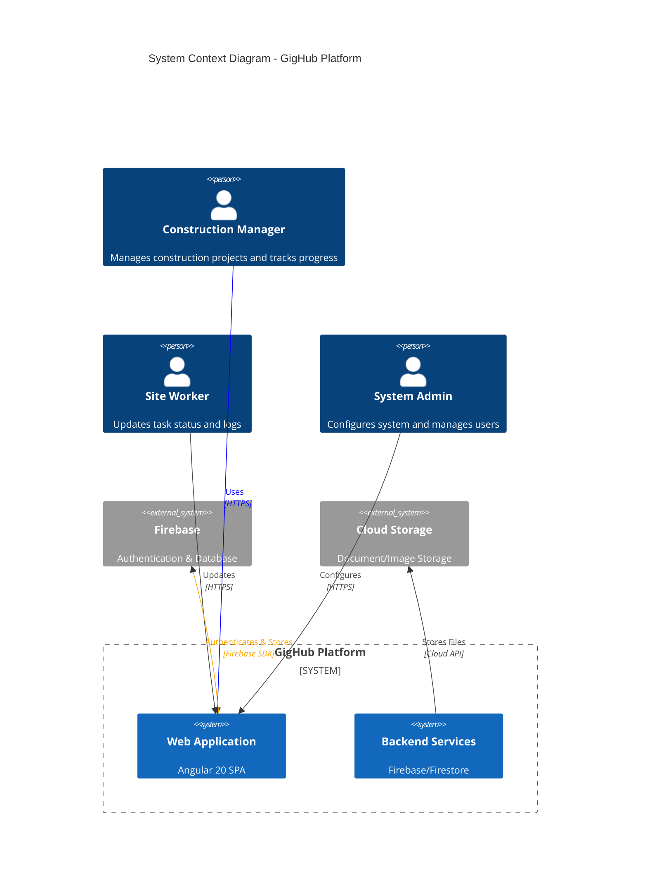

# GigHub - Architecture Plan

> **Document Purpose**: Comprehensive architectural analysis and recommendations for GigHub construction site progress tracking management system  
> **Analysis Date**: 2025-12-11  
> **Document Version**: 1.0.0  
> **Analysis Method**: Sequential Thinking + Software Planning + Complete Code Review

---

## Executive Summary

GigHub is an enterprise-level Angular 20 application for construction site progress tracking, built on the ng-alain framework with a modular Blueprint V2.0 architecture. The system is currently **~70% complete**, with solid foundational architecture but several critical performance bottlenecks and architectural gaps that need attention.

### Key Findings

**Strengths** ✅:
- Modern Angular 20 with Signals and new control flow syntax
- Well-designed three-layer modular architecture
- Complete foundation and container layers
- Comprehensive dependency injection system
- Event-driven module communication

**Critical Issues** 🔴:
- Performance bottlenecks in change detection and memory management
- Incomplete module ecosystem (Quality module missing)
- Mixed state management patterns (Signals + RxJS inconsistency)
- Lack of performance monitoring and E2E testing
- Potential event storm risks in Event Bus

**Completion Status**:
- Foundation Layer: 100% ✅
- Container Layer: 100% ✅
- Business Layer: 67% (Tasks ✅, Logs ✅, Quality ❌)
- UI Components: 40% 🚧
- Testing Infrastructure: 60% 🚧

---

## System Context

### System Context Diagram

### Explanation

**System Purpose**:
GigHub is a construction site progress tracking management system that enables construction managers to organize projects into customizable Blueprints containing modular business functions (Tasks, Logs, Quality inspections, Documents, etc.).

**Key External Actors**:
1. **Construction Managers**: Primary users who create Blueprints, configure modules, and monitor progress
2. **Site Workers**: Field users who update task statuses and submit work logs
3. **System Administrators**: Configure organizations, teams, and system-level settings

**External Systems**:
1. **Firebase**: Provides authentication (Firebase Auth) and primary database (Firestore)
2. **Cloud Storage**: Stores documents, images, and attachments

**System Boundaries**:
- **In Scope**: Web-based SPA, client-side routing, state management, modular business logic
- **Out of Scope**: Native mobile apps (future), real-time collaboration (future), offline mode (future)
