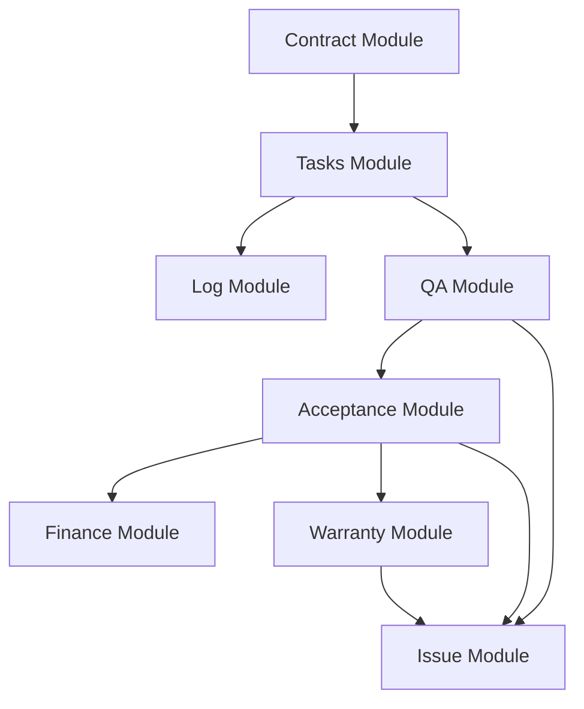

# GigHub 模組功能歸檔索引

> **歸檔目的**: 記錄 GigHub 專案所有功能模組的架構設計與實作細節，供未來備查使用  
> **建立日期**: 2025-12-16  
> **文檔版本**: 1.0.0  
> **維護團隊**: Architecture Team

---

## 📚 目錄

本目錄包含 GigHub 專案所有 15 個功能模組的詳細文檔，每個模組一個獨立檔案。

### 核心模組 (P0-P1) - 6個

| 編號 | 模組名稱 | 優先級 | 狀態 | 文檔檔案 |
|------|---------|--------|------|----------|
| SETC-000-01 | Tasks Module (任務管理) | P0 | ✅ 已實作 | [SETC-000-01-tasks-module.md](./SETC-000-01-tasks-module.md) |
| SETC-000-02 | Log Module (活動日誌) | P1 | ✅ 已實作 | [SETC-000-02-log-module.md](./SETC-000-02-log-module.md) |
| SETC-000-04 | Contract Module (合約管理) | P0 | ✅ 已實作 | [SETC-000-04-contract-module.md](./SETC-000-04-contract-module.md) |
| SETC-000-07 | Issue Module (問題追蹤) | P1 | ✅ 已實作 | [SETC-000-07-issue-module.md](./SETC-000-07-issue-module.md) |
| SETC-000-12 | Workflow Module (流程管理) | P1 | ✅ 已實作 | [SETC-000-12-workflow-module.md](./SETC-000-12-workflow-module.md) |

### 必要模組 (P2) - 5個

| 編號 | 模組名稱 | 優先級 | 狀態 | 文檔檔案 |
|------|---------|--------|------|----------|
| SETC-000-03 | QA Module (品質控管) | P2 | ✅ 已實作 | [SETC-000-03-qa-module.md](./SETC-000-03-qa-module.md) |
| SETC-000-05 | Acceptance Module (驗收管理) | P2 | ✅ 已實作 | [SETC-000-05-acceptance-module.md](./SETC-000-05-acceptance-module.md) |
| SETC-000-06 | Finance Module (財務管理) | P2 | ✅ 已實作 | [SETC-000-06-finance-module.md](./SETC-000-06-finance-module.md) |
| SETC-000-08 | Warranty Module (保固管理) | P2 | ✅ 已實作 | [SETC-000-08-warranty-module.md](./SETC-000-08-warranty-module.md) |

### 推薦模組 (P3) - 2個

| 編號 | 模組名稱 | 優先級 | 狀態 | 文檔檔案 |
|------|---------|--------|------|----------|
| SETC-000-09 | Material Module (材料管理) | P3 | ✅ 已實作 | [SETC-000-09-material-module.md](./SETC-000-09-material-module.md) |
| SETC-000-15 | Audit Logs Module (稽核日誌) | P3 | ✅ 已實作 | [SETC-000-15-audit-logs-module.md](./SETC-000-15-audit-logs-module.md) |

### 可選模組 (P4-P5) - 4個

| 編號 | 模組名稱 | 優先級 | 狀態 | 文檔檔案 |
|------|---------|--------|------|----------|
| SETC-000-10 | Safety Module (安全管理) | P4 | ✅ 已實作 | [SETC-000-10-safety-module.md](./SETC-000-10-safety-module.md) |
| SETC-000-11 | Communication Module (溝通訊息) | P4 | ✅ 已實作 | [SETC-000-11-communication-module.md](./SETC-000-11-communication-module.md) |
| SETC-000-13 | Cloud Module (雲端儲存) | P5 | ✅ 已實作 | [SETC-000-13-cloud-module.md](./SETC-000-13-cloud-module.md) |
| SETC-000-14 | Climate Module (氣候監測) | P5 | ✅ 已實作 | [SETC-000-14-climate-module.md](./SETC-000-14-climate-module.md) |

---

## 📊 統計摘要

### 模組分佈

- **總模組數**: 15
- **核心模組 (P0-P1)**: 5 個
- **必要模組 (P2)**: 4 個
- **推薦模組 (P3)**: 2 個
- **可選模組 (P4-P5)**: 4 個

### 實作狀態

- ✅ **已實作**: 15 個 (100%)
- 🔴 **未實作**: 0 個 (0%)

### 文檔大小

- **總文檔大小**: 約 120KB
- **平均每個模組**: 約 8KB
- **最大文檔**: Finance Module (8.8KB)
- **最小文檔**: Material Module (2.1KB)

---

## 🏗️ 架構概覽

### Blueprint Container 架構

所有模組都遵循 Blueprint Container 模組化架構設計：

```
Blueprint Container
├── Foundation Layer (容器核心)
├── Module Registry (模組註冊表)
├── Event Bus (事件總線)
└── Business Modules (業務模組)
    ├── Tasks Module
    ├── Log Module
    ├── QA Module
    ├── Contract Module
    ├── Acceptance Module
    ├── Finance Module
    ├── Issue Module
    ├── Warranty Module
    ├── Material Module
    ├── Safety Module
    ├── Communication Module
    ├── Workflow Module
    ├── Cloud Module
    ├── Climate Module
    └── Audit Logs Module
```

### 三層架構模式

每個模組都採用統一的三層架構：

```
UI Layer (Presentation)
    ↓ 呼叫
Service Layer (Business Logic)
    ↓ 呼叫
Repository Layer (Data Access)
    ↓ 存取
Firestore (Database)
```

### 事件驅動通訊

模組間透過 BlueprintEventBus 進行零耦合通訊：

```typescript
// 發送事件
eventBus.emit({
  type: 'task.created',
  blueprintId: 'bp-123',
  data: { taskId: 'task-456' }
});

// 訂閱事件
eventBus.on('task.created').subscribe(event => {
  // 處理事件
});
```

---

## 📝 模組依賴關係

### 核心依賴



### 支援依賴

```
Workflow Module → 所有模組 (提供工作流程)
Communication Module → 所有模組 (提供通知)
Cloud Module → 所有模組 (提供儲存)
Log Module → 所有模組 (記錄操作)
Audit Logs Module → 所有模組 (稽核記錄)
```

---

## 🎯 模組功能矩陣

| 功能 | Tasks | Log | QA | Contract | Acceptance | Finance | Issue | Warranty | Material | Safety | Comm | Workflow | Cloud | Climate | Audit |
|------|-------|-----|----|----|-------|---------|-------|----------|----------|--------|------|----------|-------|---------|-------|
| CRUD | ✅ | ✅ | ✅ | ✅ | ✅ | ✅ | ✅ | ✅ | ✅ | ✅ | ✅ | ✅ | ✅ | ✅ | ✅ |
| 狀態機 | ✅ | ❌ | ✅ | ✅ | ✅ | ✅ | ✅ | ✅ | ❌ | ❌ | ❌ | ✅ | ❌ | ❌ | ❌ |
| 事件發送 | ✅ | ✅ | ✅ | ✅ | ✅ | ✅ | ✅ | ✅ | ✅ | ✅ | ✅ | ✅ | ✅ | ✅ | ✅ |
| 事件訂閱 | ✅ | ✅ | ✅ | ✅ | ✅ | ✅ | ✅ | ✅ | ✅ | ✅ | ✅ | ✅ | ✅ | ✅ | ✅ |
| 自動化 | ❌ | ❌ | ❌ | ❌ | ❌ | ✅ | ✅ | ✅ | ❌ | ❌ | ✅ | ✅ | ❌ | ✅ | ❌ |
| 審批流程 | ❌ | ❌ | ❌ | ❌ | ✅ | ✅ | ❌ | ❌ | ❌ | ❌ | ❌ | ✅ | ❌ | ❌ | ❌ |
| 報表功能 | ✅ | ✅ | ✅ | ✅ | ✅ | ✅ | ✅ | ✅ | ✅ | ✅ | ❌ | ✅ | ❌ | ✅ | ✅ |

---

## 🔍 快速查詢

### 按功能查找模組

**任務與工作管理**:
- [Tasks Module](./SETC-000-01-tasks-module.md) - 任務管理
- [Workflow Module](./SETC-000-12-workflow-module.md) - 工作流程

**品質與驗收**:
- [QA Module](./SETC-000-03-qa-module.md) - 品質控管
- [Acceptance Module](./SETC-000-05-acceptance-module.md) - 驗收管理
- [Issue Module](./SETC-000-07-issue-module.md) - 問題追蹤

**財務與合約**:
- [Contract Module](./SETC-000-04-contract-module.md) - 合約管理
- [Finance Module](./SETC-000-06-finance-module.md) - 財務管理

**保固與售後**:
- [Warranty Module](./SETC-000-08-warranty-module.md) - 保固管理

**資源與安全**:
- [Material Module](./SETC-000-09-material-module.md) - 材料管理
- [Safety Module](./SETC-000-10-safety-module.md) - 安全管理

**通訊與記錄**:
- [Log Module](./SETC-000-02-log-module.md) - 活動日誌
- [Communication Module](./SETC-000-11-communication-module.md) - 溝通訊息
- [Audit Logs Module](./SETC-000-15-audit-logs-module.md) - 稽核日誌

**基礎設施**:
- [Cloud Module](./SETC-000-13-cloud-module.md) - 雲端儲存
- [Climate Module](./SETC-000-14-climate-module.md) - 氣候監測

---

## 📚 相關資源

### 核心文檔
- [專案架構文檔](../ARCHITECTURE.md)
- [核心開發規範](../discussions/⭐.md)
- [SETC 任務規劃總覽](../discussions/SETC-MASTER-INDEX.md)

### 開發指引
- [Angular 現代特性指引](../../.github/instructions/angular-modern-features.instructions.md)
- [企業架構模式指引](../../.github/instructions/enterprise-angular-architecture.instructions.md)
- [TypeScript 開發指引](../../.github/instructions/typescript-5-es2022.instructions.md)

### 框架文檔
- [ng-alain 框架指引](../../.github/instructions/ng-alain-delon.instructions.md)
- [ng-zorro-antd 元件指引](../../.github/instructions/ng-zorro-antd.instructions.md)

---

## 🔄 文檔更新記錄

| 日期 | 版本 | 變更內容 | 維護者 |
|------|------|----------|--------|
| 2025-12-16 | 1.0.0 | 初始建立，完成 15 個模組文檔 | Architecture Team |

---

## 📞 聯絡資訊

如有任何問題或建議，請透過以下方式聯絡：

- **GitHub Issues**: [ng-gighub Issues](https://github.com/7Spade/ng-gighub/issues)
- **專案團隊**: Architecture Team
- **維護頻率**: 每季度更新一次

---

**最後更新**: 2025-12-16  
**文檔版本**: 1.0.0  
**維護狀態**: ✅ Active
