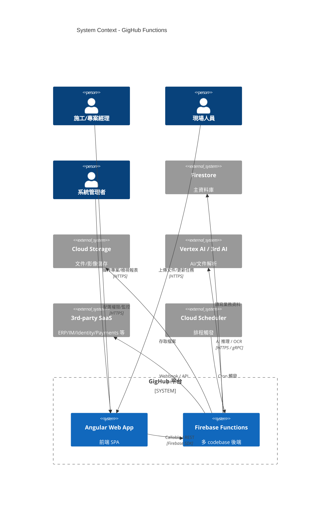
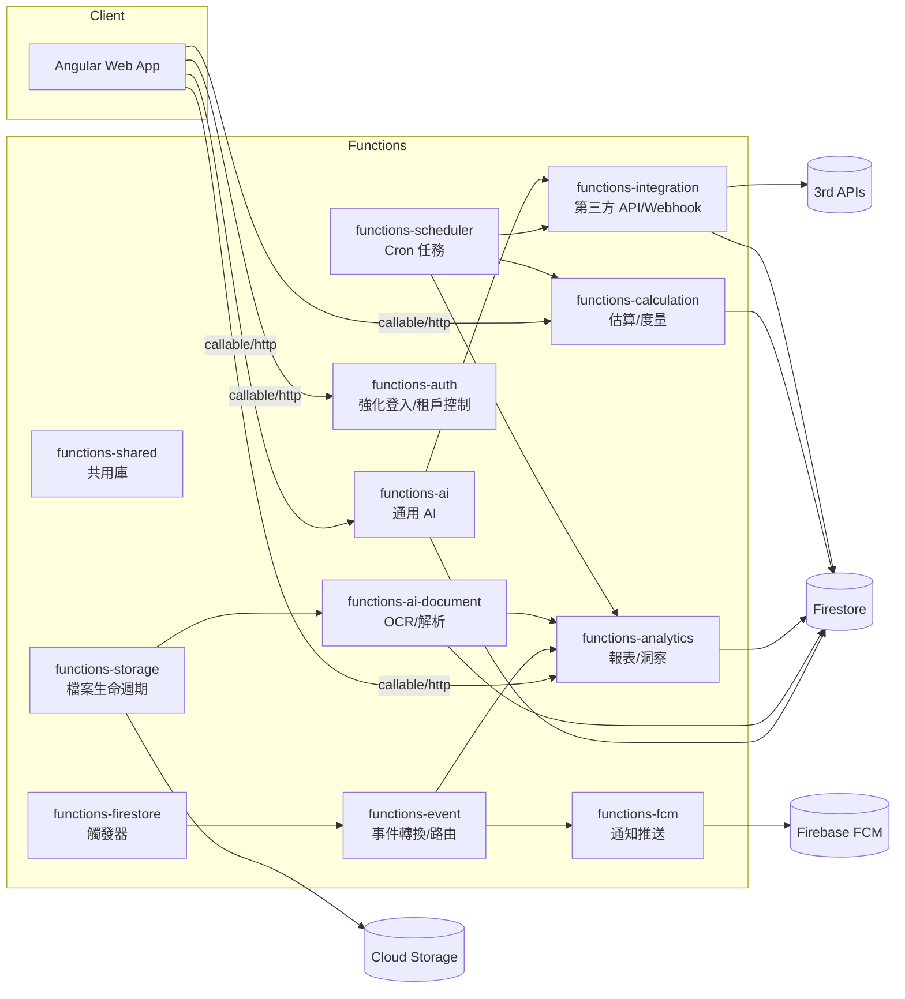
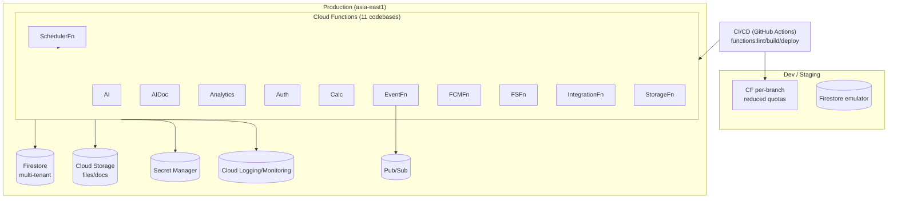
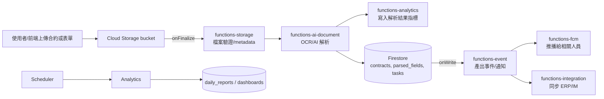
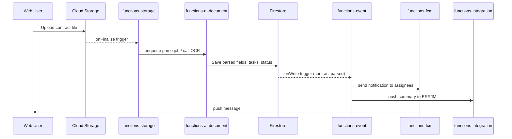

# GigHub Functions - Architecture Plan

## Executive Summary
GigHub 的 Firebase Functions 目前涵蓋 AI、文件處理、分析、認證、計算、事件、推播（FCM）、Firestore 觸發、整合、排程、共用庫與 Storage 等 11 個 codebase。整體足以支撐核心產品路徑（文件 AI、任務分析、事件驅動自動化），但缺少「可觀測性與審計」、「佇列/補償機制」、「設定/金鑰治理」三類低成本且高性價比的橫切能力。本文提供現況架構、缺口評估與分階段演進方案。

---

## System Context

**Overview**: 描繪 GigHub Functions 與前端、資料層、外部服務的邊界與互動。  
**Key Components**: 前端 SPA、Functions（多 codebase）、Firestore、Storage、AI 供應商、第三方 SaaS、Cloud Scheduler。  
**Relationships**: 前端透過 callable/HTTPS 進入 Functions；Functions 存取 Firestore/Storage，或呼叫 AI/第三方；Scheduler 觸發排程。  
**Design Decisions**: 採 serverless + 多 codebase 以隔離部署責任，降低 blast radius。  
**NFR Considerations**:  
- 可擴展：Functions 水平擴展；Firestore/Storage 托管。  
- 性能：熱路徑以 callable/HTTP，重計算以 Scheduler/事件觸發。  
- 安全：Auth 閘道 + Firestore Rules；外部 API 需使用服務帳戶/Secret Manager。  
- 可靠：多區域託管（asia-east1），盡量無狀態。  
- 可維護：codebase 分域、Shared 模組共用工具。  
**Trade-offs**: 多 codebase 帶來 CI/CD 複雜度；沒有集中 API Gateway 時前端需知道多個 callable 名稱。  
**Risks & Mitigations**: AI/外部依賴不可控 → 增設重試/降級；缺少全域可觀測性 → 需補強（見缺口）。

---

## Architecture Overview
- **現況覆蓋**：AI（functions-ai、functions-ai-document）、分析（functions-analytics）、核心業務計算（functions-calculation）、事件/排程（functions-event、functions-scheduler）、資料觸發（functions-firestore）、檔案生命週期（functions-storage）、訊息推送（functions-fcm）、第三方整合（functions-integration）、認證增強（functions-auth）、共用程式庫（functions-shared）。  
- **缺口（高性價比新增）**：
  1) **Observability & Audit**：集中日誌/指標/追蹤與審計留存（建議新增 `functions-observability` 或在 shared 中提供鉤子 + BigQuery sink）。  
  2) **Queue / DLQ / 補償**：事件與 AI 任務需工作佇列與死信路徑（可利用 Cloud Tasks + Pub/Sub，由 `functions-orchestration` 輕量實作）。  
  3) **Config / Secrets / Feature Flags**：集中租戶設定、速率限制、金鑰輪替（建議 `functions-governance`，封裝 Secret Manager/Config）。  
- **成本優先順序**：Observability（低成本高收益） > Governance（避免密鑰外洩/超用） > Orchestration（保障 AI/外部整合可靠度）。

---

## Component Architecture

**Overview**: 展示 11 個 Functions codebase 的責任與互動。  
**Key Components**: 各 codebase、Shared、Firestore/Storage、外部 API、FCM。  
**Relationships**: 前端/排程觸發 callable；Firestore/Storage 觸發事件 → Event/Storage functions；共用庫橫切。  
**Design Decisions**: 按業務域拆分 codebase；事件/排程與呼叫式分離；共用庫避免重複。  
**NFR Considerations**:  
- 可擴展：各 codebase 獨立佈署、獨立配額。  
- 性能：熱路徑（AI/Calc）應與事件批次（Scheduler/Event）解耦。  
- 安全：Auth/Firestore Rules；第三方存取集中於 Integration。  
- 可靠：Scheduler + EventFn 提供重試；但缺少 DLQ（待補）。  
- 可維護：Shared 封裝共用邏輯，降低重複。  
**Trade-offs**: 多 codebase 需要多重 pipeline；事件流缺少統一佇列管理。  
**Risks & Mitigations**: 外部 API 失敗影響事件鏈 → 引入 Pub/Sub + DLQ；缺乏審計 → 新增 observability/gov 模組。

---

## Deployment Architecture

**Overview**: 描述多 codebase Functions 部署到同區域，並與資料層、Secrets、可觀測性串接。  
**Key Components**: Functions codebases、Firestore、Storage、Secret Manager、（建議）Pub/Sub、Logging/Monitoring、CI/CD。  
**Relationships**: CI/CD 佈署到 Dev/Prod；Functions 取用 Secrets、寫入 Firestore/Storage；建議事件透過 Pub/Sub。  
**Design Decisions**: 同區域降低延遲；環境隔離；CI predeploy lint/build。  
**NFR Considerations**:  
- 可擴展：無伺服器自動擴展；Pub/Sub 供背壓。  
- 性能：區域共置；避免跨區延遲。  
- 安全：Secret Manager 儲存金鑰；部署以 least privilege 服務帳戶。  
- 可靠：多副本 + 重試；建議加 DLQ。  
- 可維護：CI 模板化；Shared lib。  
**Trade-offs**: 全在單區，抗區域故障較弱；Pub/Sub 引入新成本。  
**Risks & Mitigations**: 區域性故障 → 考慮 dual-region Firestore/Storage；佈署多人協作需 release gates。

---

## Data Flow

**Overview**: 展示文件處理與後續事件的資料流。  
**Key Components**: Storage 觸發、storage function、AI Document、Analytics、Firestore、Event、FCM、Integration、Scheduler。  
**Relationships**: 檔案 → Storage 觸發 → AI 解析 → Firestore 寫入 → 事件/通知/外部同步；排程產生報表。  
**Design Decisions**: 採事件鏈避免長同步路徑；分析與通知分離。  
**NFR Considerations**:  
- 可擴展：每步 serverless，自動擴展。  
- 性能：AI 解析耗時，應非同步；事件鏈可用 Pub/Sub 緩衝。  
- 安全：檔案掃描/驗證；寫入前驗證租戶；通知遵守 ACL。  
- 可靠：每段可重試；需 DLQ 保障。  
- 可維護：資料表/集合清晰分層。  
**Trade-offs**: 非同步造成最終一致；鏈長增加故障點。  
**Risks & Mitigations**: AI 解析失敗 → 補償/重試；外部同步失敗 → DLQ + 手動重放。

---

## Key Workflows

### Sequence: 合約上傳與通知

**Overview**: 說明文件上傳到通知的關鍵步驟。  
**Key Components**: Storage、storage function、AI Document、Firestore、Event、FCM、Integration。  
**Relationships**: 觸發鏈路串接，最終通知與外部同步。  
**Design Decisions**: 解析與通知解耦；事件觸發避免前端等待。  
**NFR Considerations**:  
- 可擴展：事件式；可插入佇列。  
- 性能：上傳後即返回；後端異步。  
- 安全：權限驗證（storage rule + Firestore rule）；通知只送給 ACL 內使用者。  
- 可靠：需對 AI/外部同步加入重試與 DLQ。  
- 可維護：單一責任，每步可獨立演進。  
**Trade-offs**: 使用者需輪詢/等待通知；鏈路增加延遲。  
**Risks & Mitigations**: AI/外部失敗 → 重試+DLQ；通知爆量 → rate limit。

---

## Additional Diagrams

### (Optional) Security / Governance Highlights
- 鉴別：Firebase Auth + functions-auth 強化租戶/角色。  
- 授權：Firestore/Storage Rules + 服務端角色檢查。  
- 秘密：建議集中 Secret Manager + least-privilege 服務帳戶。  
- 審計：缺少集中審計流水，建議新增 observability/gov 模組將關鍵事件匯出至 BigQuery/Log Sink。

---

## Phased Development

### Phase 1: Initial Implementation (現況)
- 維持 11 個現有 codebase，依 firebase.json predeploy 流程。  
- 事件/排程/AI/通知等基本路徑可運作，但缺少集中觀測與佇列。  
- 安全依賴 Firestore/Storage Rules + functions-auth、各函式內部驗證。

### Phase 2+: Target Architecture (高性價比擴充)
1. **Observability & Audit**（建議新增 `functions-observability` 或擴充 shared hook）  
   - 統一 logger/tracer，將指標匯出至 Cloud Monitoring/BigQuery。  
   - 審計事件（登入、重要資料存取、外部調用）集中。  
2. **Queue / Orchestration**（輕量 `functions-orchestration`）  
   - 引入 Pub/Sub + Cloud Tasks 作為事件總線與 DLQ，包裝重試/去重。  
   - AI/外部整合改為工作項/狀態機，避免長鏈失敗。  
3. **Governance / Config**（`functions-governance`）  
   - 集中 feature flags、租戶級配額/速率限制、金鑰輪替。  
   - 前端/其他函式透過 callable 查詢租戶設定。  
4. **Security Hardening**  
   - 服務帳戶最小權限；對外 Webhook 驗證簽章。  
   - 靜態檔掃描（防惡意檔）可併入 storage 流程。

### Migration Path
1. **Step 1**：在 Shared 建立 logging/tracing wrapper，並導出到 Log Sink/BigQuery；佈署新 observability 函式。  
2. **Step 2**：將 Event/AI/Integration 路徑導入 Pub/Sub 工作佇列，保留原觸發做回退。  
3. **Step 3**：新增 governance 函式並逐步改用 Config API 取得租戶配額/feature flag；對敏感金鑰改用 Secret Manager。  
4. **Step 4**：完成 IaC/CI 強化（佈署門檻、合規掃描）；啟用告警。

---

## Non-Functional Requirements Analysis

### Scalability
- Serverless 自動擴展；建議重度計算/外部依賴導入 Pub/Sub 以平滑流量。  
- 拆分 codebase 降低單點瓶頸；資料多租戶需索引優化。

### Performance
- 熱路徑（callable/HTTP）與慢工（AI、報表）分離；使用 Scheduler/佇列。  
- Firestore 查詢需索引，避免跨集合掃描；前置資料縮減（投影）。  
- 啟用 keep-warm/最小化冷啟動：region 共置、適當的 minInstances（僅對熱函式）。

### Security
- Auth + Rules + 服務端授權；對第三方 Webhook 驗證簽章。  
- 秘密統一 Secret Manager；禁用 runtime config。  
- 審計/告警：需集中日誌與存取追蹤（缺口）。  
- 檔案掃描與型別驗證，避免惡意檔。

### Reliability
- Firebase 內建重試，但需 DLQ 以免無窮重試；對外部 API 設定退避 + 超時。  
- 關鍵資料流記錄狀態（submitted/parsing/failed），允許重放。  
- 考慮 dual-region Firestore/Storage 或備援匯出以抗區域性故障。

### Maintainability
- 共用庫（functions-shared）持續收斂工具/型別。  
- 每個 codebase 保持單一責任；CI 模板化（lint/build/predeploy）。  
- 新增觀測/告警儀表板，降低 MTTR。

---

## Risks and Mitigations
| 風險 | 影響 | 緩解 |
| --- | --- | --- |
| 外部 AI/整合不穩定導致事件鏈停滯 | 高 | 導入 Pub/Sub + DLQ；重試+超時；狀態機/補償流程 |
| 缺少審計/可觀測性造成問題難追蹤 | 高 | 新增 observability 模組，集中 log/trace/metrics 到 BigQuery/Monitoring |
| Secrets/金鑰散落各 codebase | 中 | 使用 Secret Manager + governance 函式提供存取，定期輪替 |
| 單區部署導致區域性故障 | 中 | 考慮 dual-region 資料或定期備份匯出；關鍵函式評估多區熱備 |
| 事件/通知爆量 | 中 | Rate limit + 佇列緩衝；對 FCM 分批；可降級為 email |

---

## Technology Stack Recommendations
- **Serverless**：維持 Firebase Functions，多 codebase 隔離責任；熱函式可配置 minInstances。  
- **Messaging**：新增 Pub/Sub + Cloud Tasks 作為佇列/DLQ。  
- **Observability**：Cloud Logging/Monitoring + BigQuery sink；OpenTelemetry wrapper（shared）。  
- **Governance**：Secret Manager、Config（firestore/remote config 或自建集合）、Feature Flags（可採 LaunchDarkly/ConfigCat，如需 SaaS）。  
- **AI**：現有 functions-ai / ai-document，建議加入模型版本標籤與降級邏輯。  
- **CI/CD**：沿用 GitHub Actions；增加安全掃描、金鑰檢查、分環境參數化。

---

## Next Steps
1. 決策是否新增三個橫切 codebase（observability / orchestration / governance）或擴充 shared。  
2. 實作 log/trace/export 流水線與告警儀表板。  
3. 為 AI/整合路徑加入 Pub/Sub 工作佇列與 DLQ；定義狀態機。  
4. 將 Secrets 轉移至 Secret Manager，建立金鑰輪替 runbook。  
5. 梳理 Firestore/Storage Rules 與 callable 授權，增加租戶/配額檢查與 rate limiting。  
6. 設定災難演練與備份匯出，驗證恢復時間。
