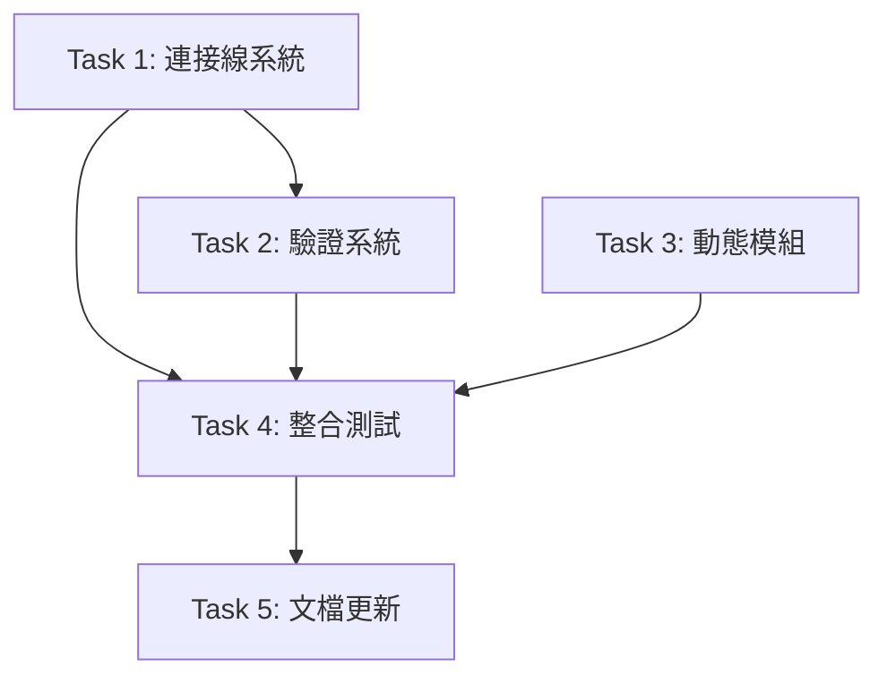

# Blueprint Designer 優化 - SETC (可序列化可執行任務鏈)

> **建立日期**: 2025-12-11  
> **方法**: Software Planning Tool + 奧卡姆剃刀原則  
> **目標**: 以最簡方案增強 Designer 至可用狀態

---

## 📋 SETC 概述

### 目標 (Goal)

將 `blueprint-designer.component.ts` 從「基礎原型」提升至「可用產品」,遵循奧卡姆剃刀原則 - 只實作必要功能。

### 範圍 (Scope)

**包含**:
- ✅ 視覺化連接線系統 (簡化版)
- ✅ 基礎依賴驗證
- ✅ 動態模組來源

**不包含** (依奧卡姆剃刀原則):
- ❌ 複雜動畫效果
- ❌ 進階互動功能  
- ❌ 範本庫系統
- ❌ 匯出/匯入功能

### 成功標準

1. ✅ 使用者可拖拽建立模組間連接
2. ✅ 連接線清晰顯示在畫布上
3. ✅ 系統自動驗證循環依賴
4. ✅ 儲存時包含連接資訊
5. ✅ 模組選擇器動態顯示已註冊模組

### 時程

- **總工時**: 8-9 天
- **開發人員**: 1 人 (熟悉 Angular 20)
- **開始日期**: 建議立即開始
- **預計完成**: 開始後 2 週內

---

## 🔗 任務依賴圖



---

## 📝 詳細任務清單

### Task 1: 連接線視覺化系統 (5.5 天) 🔴

**優先級**: P0  
**依賴**: 無  
**完成標準**: 使用者可視覺化看到模組間的連接關係

#### 子任務

**1.1 連接資料結構設計 (1 天)**
- 定義 `ModuleConnection` 介面
- 定義連接建立 DTO
- 撰寫 JSDoc 註解
- TypeScript strict mode 驗證

**1.2 SVG 連接線渲染元件 (2 天)**
- 建立 `ConnectionLayerComponent`
- 實作貝塞爾曲線路徑計算
- 實作連接線懸停效果
- 實作連接標籤顯示
- 支援動畫選項

**1.3 拖拽建立連接功能 (2 天)**
- 實作連接建立狀態管理
- 實作拖拽端點 UI
- 實作連接預覽
- 防止自我連接與重複連接
- 成功提示訊息

**1.4 連接刪除與編輯 (0.5 天)**
- 實作連接選擇
- 實作右鍵選單
- 實作刪除功能
- 實作編輯抽屜 (簡化版)

---

### Task 2: 基礎驗證系統 (2 天) 🔴

**優先級**: P0  
**依賴**: Task 1.1  
**完成標準**: 系統可自動檢測並警告配置錯誤

#### 子任務

**2.1 循環依賴檢測 (1 天)**
- 建立 `DependencyValidatorService`
- 實作 DFS 循環檢測演算法
- 實作依賴圖建構
- 返回清晰的驗證結果
- 撰寫單元測試 (覆蓋率 ≥ 80%)

**2.2 缺失依賴檢查 (0.5 天)**
- 整合 `ModuleRegistry` API
- 檢查必要依賴是否存在
- 返回缺失依賴清單

**2.3 UI 錯誤提示元件 (0.5 天)**
- 建立 `ValidationAlertsComponent`
- 使用 ng-zorro Alert 元件
- 顯示錯誤與警告
- 整合到 Designer 主頁面
- 儲存前強制驗證

---

### Task 3: 動態模組來源 (1 天) 🟡

**優先級**: P1  
**依賴**: 無 (可並行)  
**完成標準**: 模組選擇器動態顯示已註冊模組

#### 子任務

**3.1 整合 ModuleRegistry (1 天)**
- 移除硬編碼模組列表
- 從 `ModuleRegistry.getAllModules()` 獲取
- 按類別自動分組
- 顯示模組元資料 (名稱、圖示)
- 驗證新模組自動出現

---

### Task 4: 整合測試 (1 天) 🟢

**優先級**: P1  
**依賴**: Task 1, 2, 3  
**完成標準**: 測試覆蓋率 ≥ 80%

#### 子任務

**4.1 單元測試 (0.5 天)**
- `connection-layer.component.spec.ts`
- `dependency-validator.service.spec.ts`
- `validation-alerts.component.spec.ts`
- 覆蓋率目標 ≥ 80%

**4.2 E2E 測試 (0.5 天)**
- 建立連接測試
- 驗證循環依賴測試
- 刪除連接測試
- 儲存功能測試

---

### Task 5: 文檔更新 (0.5 天) 📚

**優先級**: P2  
**依賴**: Task 4  
**完成標準**: 使用者與開發者文檔完整

#### 子任務

**5.1 使用者指南 (0.25 天)**
- Designer 介面說明
- 建立連接教學
- 理解驗證錯誤
- 常見問題 FAQ

**5.2 開發者文檔 (0.25 天)**
- Designer 架構設計
- 連接系統實作細節
- 驗證演算法說明
- API 參考

---

## 📊 執行時程表

| 天數 | 任務 | 交付物 | 驗收標準 |
|------|------|--------|---------|
| Day 1 | Task 1.1 | 連接資料結構 | TypeScript 編譯通過 |
| Day 2-3 | Task 1.2 | 連接線渲染元件 | SVG 連接線顯示 |
| Day 4-5 | Task 1.3 | 拖拽建立連接 | 使用者可建立連接 |
| Day 5.5 | Task 1.4 | 連接刪除編輯 | 使用者可刪除連接 |
| Day 6 | Task 2.1 | 循環依賴檢測 | DFS 演算法運作 |
| Day 6.5 | Task 2.2 | 缺失依賴檢查 | 整合 ModuleRegistry |
| Day 7 | Task 2.3 | UI 錯誤提示 | 驗證結果顯示 |
| Day 7.5 | Task 3.1 | 動態模組來源 | 模組自動更新 |
| Day 8 | Task 4.1-4.2 | 整合測試 | 測試通過 ≥ 80% |
| Day 8.5 | Task 5.1-5.2 | 文檔更新 | 文檔完整 |

**總計**: 8.5 天

---

## 🎯 關鍵里程碑

### M1: 連接系統可用 (Day 5.5)

**交付物**:
- ✅ 連接資料結構完整
- ✅ SVG 連接線正確渲染
- ✅ 使用者可建立與刪除連接

**驗收**:
- [ ] 拖拽端點可建立連接
- [ ] 連接線顯示在畫布上
- [ ] 可點擊刪除連接

### M2: 驗證系統完整 (Day 7)

**交付物**:
- ✅ 循環依賴檢測運作
- ✅ 缺失依賴檢查運作
- ✅ UI 錯誤提示完整

**驗收**:
- [ ] 建立循環連接時顯示錯誤
- [ ] 缺少依賴時顯示警告
- [ ] 儲存前強制驗證

### M3: 動態模組整合 (Day 7.5)

**交付物**:
- ✅ 模組選擇器動態更新

**驗收**:
- [ ] 新模組註冊後自動出現
- [ ] 模組按類別正確分組

### M4: 測試與文檔完成 (Day 8.5)

**交付物**:
- ✅ 單元測試覆蓋率 ≥ 80%
- ✅ E2E 測試通過
- ✅ 使用者與開發者文檔完整

**驗收**:
- [ ] 所有測試通過
- [ ] 文檔審查通過

---

## 📋 驗收清單

### 功能驗收

- [ ] **連接建立**: 使用者可拖拽端點建立連接
- [ ] **連接顯示**: SVG 連接線正確顯示在畫布上
- [ ] **連接刪除**: 使用者可選擇並刪除連接
- [ ] **循環檢測**: 系統自動檢測循環依賴並顯示錯誤
- [ ] **缺失檢查**: 系統檢查缺失依賴並顯示警告
- [ ] **動態模組**: 模組選擇器顯示所有已註冊模組
- [ ] **儲存功能**: 儲存時包含連接資訊且驗證通過

### 程式碼品質

- [ ] **TypeScript**: 編譯無錯誤,strict mode
- [ ] **ESLint**: 所有檢查通過
- [ ] **測試覆蓋率**: ≥ 80%
- [ ] **技術債務**: 無重大技術債務

### 使用者體驗

- [ ] **操作流暢**: 無明顯延遲或卡頓
- [ ] **錯誤提示**: 清晰易懂
- [ ] **視覺一致**: 符合專案風格

### 文檔完整

- [ ] **使用者指南**: 完整且易懂
- [ ] **開發者文檔**: 架構與 API 說明完整
- [ ] **README 更新**: 反映新功能

---

## 🚧 風險管理

### 已識別風險

| 風險 | 機率 | 影響 | 緩解措施 |
|------|------|------|---------|
| SVG 路徑計算複雜 | 中 | 中 | 使用貝塞爾曲線 (業界標準) |
| DFS 演算法實作錯誤 | 低 | 高 | 參考教科書實作 + 完整測試 |
| ModuleRegistry API 變更 | 低 | 中 | 預先確認 API 穩定性 |
| E2E 測試不穩定 | 中 | 低 | 使用 retry 機制 |
| 時程延誤 | 中 | 中 | 保留 buffer time (0.5 天) |

### 應變計畫

**情境 1: Task 1.2 (SVG 渲染) 超時**
- **應變**: 使用簡化的直線連接,延後貝塞爾曲線
- **影響**: 視覺效果較差,但功能可用

**情境 2: Task 2.1 (循環檢測) 困難**
- **應變**: 使用第三方圖論庫 (如 graphlib)
- **影響**: 增加依賴,但降低實作風險

**情境 3: 整體時程延誤**
- **應變**: 優先完成 P0 任務 (Task 1-2),延後 P1-P2
- **影響**: 減少功能,但核心可用

---

## 🎯 成功定義

### 最小可行產品 (MVP)

**必須包含** (P0):
- ✅ 可建立連接
- ✅ 可顯示連接線
- ✅ 可檢測循環依賴
- ✅ 可驗證配置

**不必包含** (可延後):
- ❌ 複雜動畫
- ❌ 進階編輯功能
- ❌ 範本庫
- ❌ 匯出/匯入

### 使用者價值

**對專案經理**:
- ✅ 視覺化模組關係
- ✅ 配置錯誤即時提示
- ✅ 降低配置錯誤風險

**對開發者**:
- ✅ 快速理解藍圖結構
- ✅ 除錯更容易
- ✅ 新模組自動出現

**對系統**:
- ✅ 資料完整性提升
- ✅ 錯誤配置減少
- ✅ 系統穩定性提升

---

## 📚 參考資料

### 技術文檔

- **Angular 20 Signals**: [https://angular.dev/guide/signals](https://angular.dev/guide/signals)
- **ng-zorro-antd CDK**: [https://ng.ant.design/components/cdk/drag-drop](https://ng.ant.design/components/cdk/drag-drop)
- **SVG Path**: [MDN SVG Path Reference](https://developer.mozilla.org/en-US/docs/Web/SVG/Tutorial/Paths)
- **DFS Algorithm**: [Graph Cycle Detection](https://en.wikipedia.org/wiki/Depth-first_search)

### 專案文檔

- **SETC 規範**: `docs/setc.md`
- **Blueprint V2 規格**: `docs/blueprint-v2-specification.md`
- **Designer 分析**: `docs/analysis/blueprint-designer-analysis-2025-12-11.md`

### 類似產品參考

- **Node-RED**: 視覺化連接系統
- **Zapier**: 自動化工作流設計器
- **n8n**: 開源自動化工具

---

## 🔄 持續改進

### Phase 2 (未來考慮)

**P1 任務** (7-10 天):
- 網格對齊與佈局輔助
- 撤銷/重做系統
- 通訊流程預覽

**P2 任務** (7-11 天):
- 匯出/匯入功能
- 模組範本庫
- 進階動畫與互動

### 決策點

**何時執行 Phase 2？**

條件:
1. ✅ Phase 1 (此 SETC) 完成並驗證
2. ✅ 使用者回饋收集完成
3. ✅ ROI 評估通過
4. ✅ 資源可用

**評估標準**:
- 使用者需求強度
- 開發成本 vs 效益
- 競品對照
- 團隊能力

---

## 🎬 開始執行

### 準備工作

**開發環境**:
- [ ] Angular 20.3.x 環境就緒
- [ ] ng-zorro-antd 20.3.x 安裝
- [ ] TypeScript 5.9.x 配置
- [ ] ESLint 配置更新

**知識準備**:
- [ ] 閱讀 Angular Signals 文檔
- [ ] 理解 SETC 規範
- [ ] 理解 Blueprint V2 架構
- [ ] 熟悉 DFS 演算法

**協作準備**:
- [ ] 與 Backend 確認 ModuleRegistry API
- [ ] 與 QA 確認測試計畫
- [ ] 與 PM 確認驗收標準

### 第一步

**建議**: 從 Task 1.1 開始 - 連接資料結構設計

**原因**:
1. 無外部依賴
2. 是後續任務的基礎
3. 工時短 (1 天)
4. 風險低

**行動**:
```bash
# 建立分支
git checkout -b feature/blueprint-designer-connections

# 建立檔案
mkdir -p src/app/routes/blueprint/models
touch src/app/routes/blueprint/models/module-connection.interface.ts

# 開始編碼
code src/app/routes/blueprint/models/module-connection.interface.ts
```

---

**SETC 版本**: 1.0.0  
**建立日期**: 2025-12-11  
**建立者**: GitHub Copilot (Software Planning Tool)  
**狀態**: ✅ 就緒  
**下一步**: 閱讀並確認 → 開始 Task 1.1

---

## 附錄: 奧卡姆剃刀決策記錄

### 為什麼選擇這些功能？

**包含的功能** (必要):
1. **連接線系統** - 核心價值,無此功能 Designer 無意義
2. **循環檢測** - 防止嚴重錯誤,投資回報高
3. **動態模組** - 符合架構設計,避免硬編碼

**排除的功能** (非必要):
1. **複雜動畫** - 視覺效果,非核心功能
2. **範本庫** - 早期使用者少,可手動複製
3. **匯出/匯入** - JSON 複製即可,早期不需要
4. **進階互動** - 增加複雜度,但價值有限

### 如何評估必要性？

**判斷標準**:
1. **阻塞性** - 沒有此功能系統完全不可用？
2. **ROI** - 投入/產出比是否合理？
3. **複雜度** - 實作是否會顯著增加複雜度？
4. **替代方案** - 是否有更簡單的替代方案？

**範例**: 匯出/匯入功能
- 阻塞性: ❌ (可手動複製 JSON)
- ROI: ⭐⭐☆☆☆ (開發 2-3 天,使用頻率低)
- 複雜度: ⭐⭐⭐☆☆ (需處理格式、驗證等)
- 替代方案: ✅ (複製 JSON 到 clipboard)
- **結論**: 排除,非必要

**範例**: 連接線系統
- 阻塞性: ✅ (核心功能)
- ROI: ⭐⭐⭐⭐⭐ (開發 5.5 天,長期價值極高)
- 複雜度: ⭐⭐⭐⭐☆ (中高,但必須)
- 替代方案: ❌ (無替代)
- **結論**: 包含,必要

---

**奧卡姆剃刀總結**: 只實作必要功能,保持系統簡單可維護 ✂️
