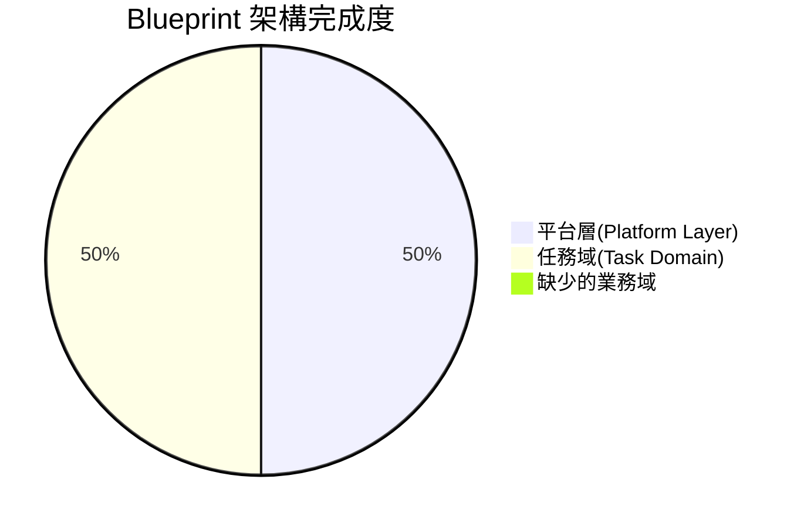

# GigHub Blueprint 架構缺口分析（繁體中文）

> **文件目的**: 對照 `next.md` 藍圖結構與現有實作的差異分析  
> **分析日期**: 2025-12-12  
> **文件版本**: 1.0.0

---

## 📊 執行摘要

### 架構符合度：⚠️ **部分符合** (60%)



### 關鍵發現

**優勢** ✅:
- ✅ 平台層（Context Module + Event Bus）實作完整
- ✅ 模組容器系統設計良好
- ✅ 事件驅動架構已就緒
- ✅ Task Domain 實作完整

**嚴重缺口** 🔴:
- 🔴 **僅實作 1/6 個必要業務域** (只有 Task Domain)
- 🔴 缺少 5 個關鍵業務域
- 🔴 無法執行跨域業務流程
- 🔴 業務能力嚴重受限

---

## 🏗️ next.md 定義的雙層架構

### 架構概覽

```
Blueprint 架構
 │
 ├── 🟦 (A) 平台層 (Platform Layer) ━━━━━━ 不是 Domain
 │    │
 │    ├── Context Module（上下文模組）
 │    │    ├── Blueprint 設定
 │    │    ├── 執行時上下文
 │    │    ├── 狀態機配置
 │    │    ├── Domain 啟用設定
 │    │    └── 共用記憶體（跨模組資料代理）
 │    │
 │    └── Event / Automation Engine（事件/自動化引擎）
 │         ├── Domain 間事件交換
 │         └── Workflow 驅動
 │
 └── 🟥 (B) 業務域 (Business Domains) ━━━━ 6~8 個 Domain
      │
      ├── 1️⃣ Task Domain（任務域）✅ 必要
      ├── 2️⃣ Log Domain（日誌域）🔴 必要
      ├── 3️⃣ Workflow Domain（流程域）🔴 必要
      ├── 4️⃣ QA Domain（品質控管域）🔴 必要
      ├── 5️⃣ Acceptance Domain（驗收域）🔴 必要
      ├── 6️⃣ Finance Domain（財務域）🔴 必要
      ├── 7️⃣ Material Domain（材料域）⚠️ 推薦
      └── 8️⃣ Safety/Communication（安全/通訊域）⚪ 可選
```

---

## 🔍 現有實作結構

### 目前程式碼結構

```
src/app/core/blueprint/
 │
 ├── context/           ✅ 平台層 - Context Module
 ├── events/            ✅ 平台層 - Event Bus
 ├── container/         ✅ 平台層 - Module Container
 ├── services/          ✅ 平台層 - 共用服務
 ├── repositories/      ✅ 平台層 - 共用 Repository
 ├── config/            ✅ 平台層 - 配置管理
 │
 └── modules/           ⚠️ 業務域區（不完整）
      └── implementations/
           └── tasks/    ✅ 唯一已實作的業務域
```

### 架構符合度檢查表

| 元件 | next.md 要求 | 實作狀態 | 缺口 |
|------|-------------|---------|------|
| **平台層 (Layer A)** |  |  |  |
| Context Module | 必要 | ✅ 已實作 | 無 |
| Event Bus | 必要 | ✅ 已實作 | 無 |
| Module Container | 必要 | ✅ 已實作 | 無 |
| **業務域 (Layer B)** |  |  |  |
| 1. Task Domain | 必要 | ✅ 已實作 | 無 |
| 2. Log Domain | 必要 | 🔴 **缺少** | **嚴重** |
| 3. Workflow Domain | 必要 | 🔴 **缺少** | **嚴重** |
| 4. QA Domain | 必要 | 🔴 **缺少** | **嚴重** |
| 5. Acceptance Domain | 必要 | 🔴 **缺少** | **嚴重** |
| 6. Finance Domain | 必要 | 🔴 **缺少** | **嚴重** |
| 7. Material Domain | 推薦 | 🔴 缺少 | 高優先 |
| 8. Safety Domain | 可選 | 🔴 缺少 | 低優先 |
| 9. Communication Domain | 可選 | 🔴 缺少 | 低優先 |

**完成率**: **1/6 個必要域 = 16.7%**

---

## 🚨 缺少的業務域詳細分析

### 1️⃣ Task Domain（任務域）✅

**狀態**: ✅ **已實作**

**位置**: `src/app/core/blueprint/modules/implementations/tasks/`

**功能**:
- ✅ 任務建立與管理
- ✅ 任務指派
- ✅ 狀態追蹤
- ✅ 進度監控
- ✅ 排程管理

---

### 2️⃣ Log / Activity Domain（日誌域）🔴

**狀態**: 🔴 **嚴重缺少**

**預期位置**: `src/app/core/blueprint/modules/implementations/logs/`

**缺少的功能**:
- 🔴 操作紀錄（誰做了什麼、何時做的）
- 🔴 系統事件追蹤
- 🔴 評論系統
- 🔴 附件管理
- 🔴 活動時間軸視覺化
- 🔴 活動搜尋與篩選

**影響**:
- ❌ 沒有稽核軌跡
- ❌ 無法追蹤歷史變更
- ❌ 無法知道誰修改了什麼
- ❌ 沒有協作評論功能
- ❌ 缺少集中式附件管理

**資料庫需求**:
```sql
-- 活動日誌表
CREATE TABLE activity_logs (
  id UUID PRIMARY KEY,
  blueprint_id UUID,
  domain_name TEXT,
  entity_type TEXT,
  entity_id UUID,
  action TEXT,
  user_id UUID,
  metadata JSONB,
  created_at TIMESTAMPTZ
);

-- 評論表
CREATE TABLE comments (
  id UUID PRIMARY KEY,
  activity_log_id UUID,
  user_id UUID,
  content TEXT,
  created_at TIMESTAMPTZ
);

-- 附件表
CREATE TABLE attachments (
  id UUID PRIMARY KEY,
  activity_log_id UUID,
  file_name TEXT,
  file_url TEXT,
  created_at TIMESTAMPTZ
);
```

---

### 3️⃣ Workflow / Process Domain（流程域）🔴

**狀態**: 🔴 **嚴重缺少**

**預期位置**: `src/app/core/blueprint/modules/implementations/workflow/`

**缺少的功能**:
- 🔴 自訂流程定義
- 🔴 可配置的狀態機
- 🔴 自動化觸發規則
- 🔴 流程驗證與執行
- 🔴 流程分析與監控
- 🔴 條件分支邏輯
- 🔴 時間基礎觸發器

**影響**:
- ❌ 無法自訂任務狀態轉換
- ❌ 沒有自動化能力
- ❌ 需要手動管理工作流程
- ❌ 無法重用流程範本
- ❌ 其他域無法使用 workflow 引擎

**依賴關係**:
- Task Domain 需要它來管理狀態轉換
- QA Domain 需要它來定義檢驗流程
- Finance Domain 需要它來處理審核流程
- Acceptance Domain 需要它來執行驗收流程

---

### 4️⃣ QA Domain（品質控管域）🔴

**狀態**: 🔴 **嚴重缺少**

**預期位置**: `src/app/core/blueprint/modules/implementations/qa/`

**缺少的功能**:
- 🔴 例行檢查清單
- 🔴 缺失紀錄
- 🔴 缺失修復流程
- 🔴 現場巡檢記錄（含照片）
- 🔴 可自訂檢驗範本
- 🔴 品質統計報表
- 🔴 合格/不合格判定

**影響**:
- ❌ 沒有品質控制流程
- ❌ 無法追蹤缺陷或問題
- ❌ 沒有檢驗清單
- ❌ 品質保證只能手動進行
- ❌ 無品質指標或報告

**資料庫需求**:
```sql
-- 品質檢驗表
CREATE TABLE qa_inspections (
  id UUID PRIMARY KEY,
  blueprint_id UUID,
  task_id UUID,
  inspector_id UUID,
  inspection_date DATE,
  status TEXT,
  result TEXT,
  notes TEXT,
  created_at TIMESTAMPTZ
);

-- 檢查清單表
CREATE TABLE qa_checklists (
  id UUID PRIMARY KEY,
  inspection_id UUID,
  name TEXT,
  items JSONB,
  created_at TIMESTAMPTZ
);

-- 問題記錄表
CREATE TABLE qa_issues (
  id UUID PRIMARY KEY,
  inspection_id UUID,
  severity TEXT,
  description TEXT,
  status TEXT,
  assigned_to UUID,
  created_at TIMESTAMPTZ
);
```

---

### 5️⃣ Acceptance Domain（驗收域）🔴

**狀態**: 🔴 **嚴重缺少**

**預期位置**: `src/app/core/blueprint/modules/implementations/acceptance/`

**缺少的功能**:
- 🔴 驗收申請提交
- 🔴 驗收審核與批准
- 🔴 初驗流程
- 🔴 複驗流程
- 🔴 驗收結論（通過/不通過）
- 🔴 驗收狀態追蹤
- 🔴 驗收文件產生

**影響**:
- ❌ 沒有正式驗收流程
- ❌ 無法追蹤驗收申請
- ❌ 沒有初驗/複驗工作流程
- ❌ 驗收文件需手動製作
- ❌ 無法在驗收後觸發付款

**依賴關係**:
- Task Domain（驗收與任務完成綁定）
- QA Domain（驗收前需品質檢查）
- Workflow Domain（驗收審核流程）
- Finance Domain（驗收通過後觸發付款）

---

### 6️⃣ Finance Domain（財務域）🔴

**狀態**: 🔴 **嚴重缺少**

**預期位置**: `src/app/core/blueprint/modules/implementations/finance/`

**缺少的功能**:
- 🔴 成本追蹤與分配
- 🔴 發票產生與管理
- 🔴 付款處理與記錄
- 🔴 預算規劃與監控
- 🔴 總帳維護
- 🔴 財務報表
- 🔴 多幣別支援（可選）

**子模組**:
1. **成本管理**: 按任務/類別追蹤施工成本
2. **發票管理**: 為已完成工作產生發票
3. **付款管理**: 記錄與追蹤付款
4. **預算管理**: 規劃與監控專案預算
5. **總帳管理**: 維護財務記錄

**影響**:
- ❌ 無成本追蹤能力
- ❌ 無法產生發票
- ❌ 沒有付款記錄
- ❌ 無預算管理
- ❌ 沒有財務報表
- ❌ 財務管理需手動進行

**資料庫需求**:
```sql
-- 成本表
CREATE TABLE costs (
  id UUID PRIMARY KEY,
  blueprint_id UUID,
  task_id UUID,
  category TEXT,
  amount DECIMAL(15,2),
  description TEXT,
  date DATE,
  created_at TIMESTAMPTZ
);

-- 發票表
CREATE TABLE invoices (
  id UUID PRIMARY KEY,
  blueprint_id UUID,
  invoice_number TEXT,
  amount DECIMAL(15,2),
  status TEXT,
  issued_date DATE,
  due_date DATE,
  created_at TIMESTAMPTZ
);

-- 付款表
CREATE TABLE payments (
  id UUID PRIMARY KEY,
  invoice_id UUID,
  amount DECIMAL(15,2),
  payment_method TEXT,
  payment_date DATE,
  created_at TIMESTAMPTZ
);

-- 預算表
CREATE TABLE budgets (
  id UUID PRIMARY KEY,
  blueprint_id UUID,
  category TEXT,
  planned_amount DECIMAL(15,2),
  actual_amount DECIMAL(15,2),
  created_at TIMESTAMPTZ
);
```

---

### 7️⃣ Material / Asset Domain（材料/資產域）🔴

**狀態**: 🔴 **缺少**（推薦實作）

**預期位置**: `src/app/core/blueprint/modules/implementations/material/`

**缺少的功能**:
- 🔴 材料庫存管理
- 🔴 材料申請與審核
- 🔴 進出料追蹤
- 🔴 設備與工具資產管理
- 🔴 材料消耗追蹤
- 🔴 庫存報表與警示

**優先級**: 🟠 **高**（推薦實作）

---

### 8️⃣ Safety / Communication Domain（安全/通訊域）🔴

**狀態**: 🔴 **缺少**（可選）

**預期位置**: 
- `src/app/core/blueprint/modules/implementations/safety/`
- `src/app/core/blueprint/modules/implementations/communication/`

**優先級**: 🟢 **低**（未來可加入）

---

## 📋 建議的資料夾結構重組

### 問題：平台層與業務域混合

目前的結構沒有清楚區分平台基礎設施與業務域：

```
❌ 目前結構（不清楚）
src/app/core/blueprint/
 ├── context/           # 平台層
 ├── events/            # 平台層
 ├── container/         # 平台層
 ├── modules/           # ⚠️ 包含平台 + 業務
 │    └── implementations/
 │         └── tasks/   # 業務域混在平台中
 ├── services/          # 平台層
 └── repositories/      # 平台層
```

---

### 建議：清楚分離的雙層結構

```
✅ 建議結構（清楚分離）
src/app/core/blueprint/
 │
 ├── 📁 platform/                    # 平台層 (Layer A)
 │    ├── context/                   # 執行上下文
 │    ├── events/                    # 事件匯流排
 │    ├── container/                 # 模組容器與註冊表
 │    ├── services/                  # 平台服務
 │    ├── repositories/              # 平台 Repository
 │    ├── config/                    # Blueprint 配置
 │    └── models/                    # 共用平台模型
 │
 └── 📁 domains/                     # 業務域 (Layer B)
      │
      ├── 📁 task/                   # 任務域 ✅
      │    ├── task.module.ts
      │    ├── task.service.ts
      │    ├── task.repository.ts
      │    ├── task.component.ts
      │    └── index.ts
      │
      ├── 📁 log/                    # 日誌域 🔴
      │    ├── log.module.ts
      │    ├── log.service.ts
      │    ├── log.repository.ts
      │    └── index.ts
      │
      ├── 📁 workflow/               # 流程域 🔴
      │    ├── workflow.module.ts
      │    ├── workflow.service.ts
      │    ├── state-machine.service.ts
      │    └── index.ts
      │
      ├── 📁 qa/                     # 品質控管域 🔴
      │    ├── qa.module.ts
      │    ├── qa.service.ts
      │    ├── inspection.component.ts
      │    └── index.ts
      │
      ├── 📁 acceptance/             # 驗收域 🔴
      │    ├── acceptance.module.ts
      │    ├── acceptance.service.ts
      │    └── index.ts
      │
      ├── 📁 finance/                # 財務域 🔴
      │    ├── finance.module.ts
      │    ├── cost.service.ts
      │    ├── invoice.service.ts
      │    ├── payment.service.ts
      │    └── index.ts
      │
      ├── 📁 material/               # 材料域 🔴
      │    ├── material.module.ts
      │    ├── inventory.service.ts
      │    └── index.ts
      │
      ├── 📁 safety/                 # 安全域（可選）🟢
      │    └── [未來實作]
      │
      └── 📁 communication/          # 通訊域（可選）🟢
           └── [未來實作]
```

---

## 🎯 分階段開發建議

### 第 1 階段：基礎建設（目前狀態）✅

**狀態**: ✅ **完成**

**已交付**:
- ✅ 平台層（Context + Event Bus）
- ✅ 模組容器與註冊表
- ✅ Task Domain（單一域實作）

**缺口**:
- 只有 1/6 個必要域
- 無跨域工作流程
- 業務能力受限

---

### 第 2 階段：核心業務域（關鍵優先）🔴

**目標**: 實作必要業務域

**實作優先順序**:

1. **Log Domain**（第 1-2 週）- 🔴 關鍵
   - 所有其他域都需要它
   - 稽核軌跡基礎

2. **Workflow Domain**（第 3-4 週）- 🔴 關鍵
   - 狀態機需求
   - 自動化引擎

3. **QA Domain**（第 5-6 週）- 🔴 關鍵
   - 品質檢驗流程
   - 問題追蹤

4. **Acceptance Domain**（第 7-8 週）- 🔴 關鍵
   - 正式驗收工作流程
   - 觸發財務流程

5. **Finance Domain**（第 9-12 週）- 🔴 關鍵
   - 成本追蹤與發票
   - 付款處理
   - 預算管理

---

### 第 3 階段：增強功能（高優先）🟠

**目標**: 新增推薦域

**Material Domain**（第 13-16 週）:
- 材料庫存管理
- 申請工作流程
- 資產追蹤
- 與 Task 和 Finance 域整合

---

### 第 4 階段：可選增強（低優先）🟢

**目標**: 如有需要新增可選域

**Safety Domain**（未來）:
- 安全檢查
- 風險評估
- 事故報告

**Communication Domain**（未來）:
- 系統通知
- 群組訊息
- 任務提醒

---

## ⚠️ 風險與建議

### 技術風險

| 風險 | 嚴重性 | 影響 | 緩解措施 |
|------|--------|------|----------|
| **事件風暴** | 🔴 高 | Event Bus 被多個域壓垮 | 實作事件節流、訊息佇列、斷路器 |
| **效能退化** | 🟠 中 | 6-8 個域啟動時 UI 變慢 | 延遲載入、程式碼分割、效能監控 |
| **記憶體洩漏** | 🟠 中 | 模組未正確釋放 | 實作適當清理、記憶體分析 |
| **跨域死鎖** | 🔴 高 | 循環事件依賴 | 依賴圖分析、事件排序規則 |

---

### 組織風險

| 風險 | 嚴重性 | 影響 | 緩解措施 |
|------|--------|------|----------|
| **開發頻寬** | 🔴 高 | 需實作 5-7 個域 | 分階段方法、優先處理關鍵域 |
| **域複雜度** | 🟠 中 | 每個域都有學習曲線 | 完整文件、程式碼範本 |
| **測試覆蓋率** | 🔴 高 | 大型程式碼庫、有限測試 | 自動化測試策略、CI/CD 管線 |
| **技術債** | 🟠 中 | 倉促實作 | 程式碼審查、重構衝刺 |

---

## ✅ 結論與建議

### 符合度總結

**Blueprint 結構符合度**: ⚠️ **60% 符合**

- **平台層 (Layer A)**: ✅ **100% 完成** - 架構正確、實作完整
- **業務域 (Layer B)**: 🔴 **17% 完成** - 僅 1/6 個必要域完成

---

### 關鍵路徑

1. ✅ **承認差距**: 目前實作缺少 5-7 個域
2. 🔴 **優先 Log Domain**: 所有其他域的基礎
3. 🔴 **實作核心域**: Workflow、QA、Acceptance、Finance
4. 🟠 **新增推薦域**: Material
5. 🟢 **可選增強**: Safety、Communication

---

### 成功標準

**架構對齊**:
- [ ] 平台層與業務域清楚分離
- [ ] 所有 6 個必要域已實作
- [ ] 跨域通訊運作中
- [ ] 事件驅動工作流程功能正常

**程式碼品質**:
- [ ] 域間測試覆蓋率 80%+
- [ ] 一致的域結構
- [ ] 完整文件
- [ ] 符合效能基準

**業務能力**:
- [ ] 完整任務管理工作流程
- [ ] 完整稽核軌跡（Log Domain）
- [ ] 品質檢驗流程（QA Domain）
- [ ] 正式驗收工作流程
- [ ] 財務追蹤與報告

---

### 最終建議

**目前的程式碼庫有堅實的基礎，但嚴重不完整**。平台層基礎設施優秀且已準備好支援多個域，但只有 1/6-8 個必要業務域已實作。

**優先級 1**: 實作 5 個缺少的必要域（Log、Workflow、QA、Acceptance、Finance），以實現 Blueprint 架構的完整潛力。

**時間線**: 完整實作所有必要域需要 12-16 週。

**風險**: 沒有這些域，系統無法提供 Blueprint V2.0 架構所設想的全面施工管理能力。

---

**文件結束**
