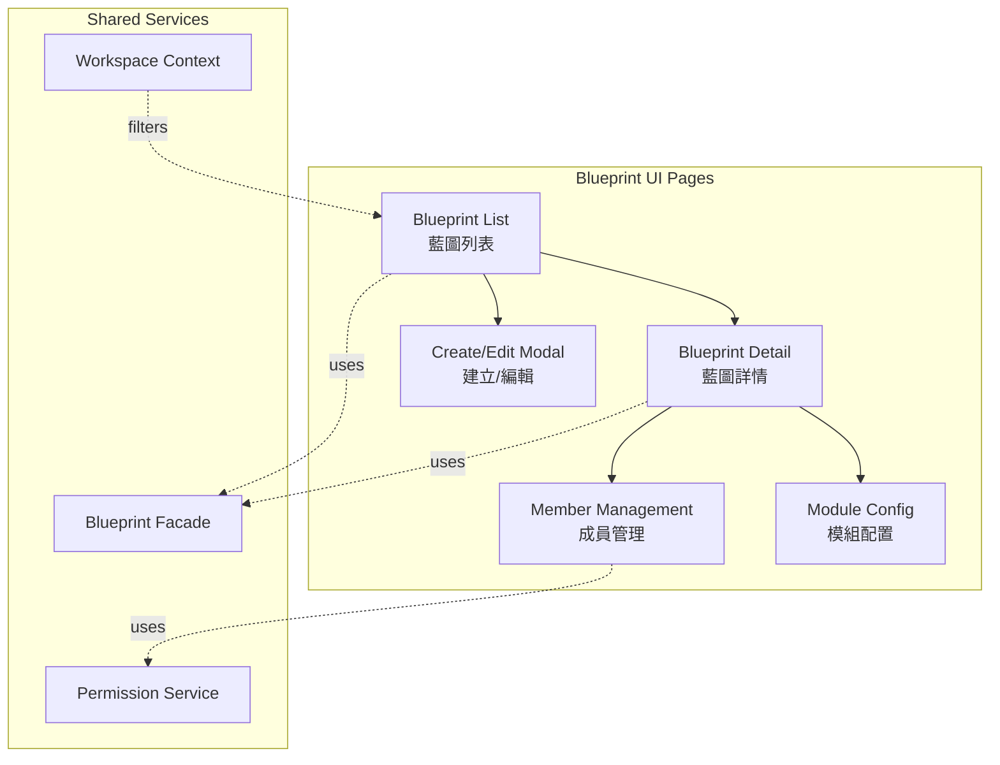

# GigHub Blueprint Module - UI Design Specification

> **Version**: 1.0.0  
> **Date**: 2025-12-11  
> **For PR #26 Review**  
> **Technology Stack**: Angular 20.3.0 + ng-alain 20.1.0 + ng-zorro-antd 20.3.1

---

## Executive Summary

This document provides comprehensive UI design specifications for the **GigHub Blueprint Module**, following modern Angular 20 patterns (Signals, Standalone Components, new control flow syntax `@if`, `@for`, `@switch`) and integrating with ng-alain's enterprise-grade components.

### Key Design Principles

1. **Modern Angular 20**: Use Signals for state, standalone components, new control flow
2. **Enterprise UX**: Follow ng-alain patterns for admin interfaces  
3. **Context-Aware**: Seamless integration with Workspace Context Service
4. **Mobile-First**: Responsive design with mobile optimization
5. **Accessibility**: WCAG 2.1 compliance

---

## System Overview

### Blueprint Module UI Architecture



---

## Page 1: Blueprint List (藍圖列表)

### Visual Layout

```
┌────────────────────────────────────────────────────────────────┐
│ 🏠 首頁 > 📋 藍圖列表                    [當前: 👥 示範組織 A]  │
├────────────────────────────────────────────────────────────────┤
│  🔍 [搜尋藍圖...]     [🏷️ 狀態▼] [📅 時間▼]  [🔄] [➕ 建立藍圖] │
│                                                                  │
│  📊 統計資訊                                                      │
│  ┌─────────┐ ┌─────────┐ ┌─────────┐ ┌─────────┐             │
│  │總數: 15  │ │進行中: 8 │ │已完成: 5 │ │已封存: 2│             │
│  └─────────┘ └─────────┘ └─────────┘ └─────────┘             │
│                                                                  │
│  ┌──────────────────────────────────────────────────────────┐  │
│  │ 藍圖名稱      │ 負責人 │ 狀態    │ 建立時間   │ 操作      │  │
│  ├──────────────────────────────────────────────────────────┤  │
│  │ 🏗️ 台北101專案│ 張三  │ 🟢 進行中│ 2025-12-01│ [查看][編輯]│ │  │
│  │ 🏢 信義區建案  │ 李四  │ 🟡 待審核│ 2025-11-28│ [查看][編輯]│ │  │
│  │ ...                                                       │  │
│  └──────────────────────────────────────────────────────────┘  │
│                        [1] [2] [3] ... [10]                    │
└────────────────────────────────────────────────────────────────┘
```

### Implementation (Angular 20 + Signals + ng-alain ST)

```typescript
// blueprint-list.component.ts
import { Component, signal, computed, inject } from '@angular/core';
import { STColumn } from '@delon/abc/st';
import { SHARED_IMPORTS } from '@shared';
import { BlueprintFacade } from '@shared/services/blueprint/blueprint.facade';

@Component({
  selector: 'app-blueprint-list',
  standalone: true,
  imports: [SHARED_IMPORTS],
  template: `
    <!-- Breadcrumb -->
    <page-header [title]="'藍圖列表'">
      <ng-content extra>
        <button nz-button nzType="primary" (click)="createBlueprint()">
          <span nz-icon nzType="plus"></span>
          建立藍圖
        </button>
      </ng-content>
    </page-header>

    <!-- Loading -->
    @if (loading()) {
      <nz-spin nzSimple />
    } @else {
      <!-- Statistics -->
      <nz-row [nzGutter]="16" class="mb-md">
        <nz-col [nzSpan]="6">
          <nz-statistic [nzValue]="stats().total" nzTitle="總數" />
        </nz-col>
        <nz-col [nzSpan]="6">
          <nz-statistic [nzValue]="stats().active" nzTitle="進行中" />
        </nz-col>
        <nz-col [nzSpan]="6">
          <nz-statistic [nzValue]="stats().completed" nzTitle="已完成" />
        </nz-col>
        <nz-col [nzSpan]="6">
          <nz-statistic [nzValue]="stats().archived" nzTitle="已封存" />
        </nz-col>
      </nz-row>

      <!-- Table -->
      <st 
        [data]="blueprints()" 
        [columns]="columns"
        [loading]="loading()"
      />
    }
  `
})
export class BlueprintListComponent {
  private readonly blueprintFacade = inject(BlueprintFacade);
  
  // Signals
  loading = signal(false);
  blueprints = this.blueprintFacade.blueprints;
  
  // Computed statistics
  stats = computed(() => {
    const all = this.blueprints();
    return {
      total: all.length,
      active: all.filter(b => b.status === 'active').length,
      completed: all.filter(b => b.status === 'completed').length,
      archived: all.filter(b => b.status === 'archived').length
    };
  });
  
  // ST Table columns
  columns: STColumn[] = [
    {
      title: '藍圖名稱',
      index: 'name',
      sort: { compare: (a, b) => a.name.localeCompare(b.name) }
    },
    {
      title: '負責人',
      index: 'owner.name'
    },
    {
      title: '狀態',
      index: 'status',
      type: 'badge',
      badge: {
        active: { text: '進行中', color: 'success' },
        pending: { text: '待審核', color: 'warning' },
        completed: { text: '已完成', color: 'processing' }
      }
    },
    {
      title: '建立時間',
      index: 'createdAt',
      type: 'date',
      sort: { default: 'descend' }
    },
    {
      title: '操作',
      buttons: [
        {
          text: '查看',
          icon: 'eye',
          click: (record: any) => this.viewBlueprint(record.id)
        },
        {
          text: '編輯',
          icon: 'edit',
          iif: (record: any) => this.canEdit(record),
          click: (record: any) => this.editBlueprint(record)
        }
      ]
    }
  ];
  
  ngOnInit(): void {
    this.loadBlueprints();
  }
  
  private async loadBlueprints(): Promise<void> {
    this.loading.set(true);
    try {
      await this.blueprintFacade.loadBlueprintsByContext();
    } finally {
      this.loading.set(false);
    }
  }
  
  viewBlueprint(id: string): void {
    // Navigate to detail
  }
  
  editBlueprint(blueprint: any): void {
    // Open edit modal
  }
  
  canEdit(blueprint: any): boolean {
    return this.blueprintFacade.canEdit(blueprint.id);
  }
  
  createBlueprint(): void {
    // Open create modal
  }
}
```

---

## Page 2: Blueprint Detail (藍圖詳情)

### Visual Layout

```
┌────────────────────────────────────────────────────────────────┐
│ 🏠 > 📋 藍圖列表 > 🏗️ 台北101專案                                  │
├────────────────────────────────────────────────────────────────┤
│  🏗️ 台北101專案                                     [🟢 進行中]  │
│  📝 超高層建築專案,預計 2026 年完工                                │
│  👤 張三 │ 📅 2025-12-01 │ 📊 35%                                │
│  [🔄 同步] [📤 匯出] [⚙️ 設定] [✏️ 編輯]                          │
│                                                                  │
│  ┌────────────────────────────────────────────────────────┐    │
│  │ [📋 概覽] [✅ 任務] [📝 日誌] [👥 成員] [⚙️ 模組]        │    │
│  ├────────────────────────────────────────────────────────┤    │
│  │  📊 專案概覽                                            │    │
│  │  ●●●●●○○○○○ 35% 完成                                  │    │
│  │  ✅ 已完成: 25/72  📝 待完成: 47  🔥 逾期: 3           │    │
│  │                                                          │    │
│  │  📋 最近活動                                            │    │
│  │  [15:30] 張三 完成任務「基礎結構檢查」                    │    │
│  │  [14:20] 李四 新增日誌「進度更新」                        │    │
│  └────────────────────────────────────────────────────────┘    │
└────────────────────────────────────────────────────────────────┘
```

### Implementation

```typescript
// blueprint-detail.component.ts
import { Component, signal, computed, inject } from '@angular/core';
import { ActivatedRoute } from '@angular/router';
import { SHARED_IMPORTS } from '@shared';
import { BlueprintFacade } from '@shared/services/blueprint/blueprint.facade';

@Component({
  selector: 'app-blueprint-detail',
  standalone: true,
  imports: [SHARED_IMPORTS],
  template: `
    <page-header [title]="blueprint()?.name || ''" [breadcrumb]="breadcrumb">
      <ng-content extra>
        <nz-space>
          <button *nzSpaceItem nz-button (click)="sync()">
            <span nz-icon nzType="reload"></span>
            同步
          </button>
          <button *nzSpaceItem nz-button (click)="export()">
            <span nz-icon nzType="export"></span>
            匯出
          </button>
          <button *nzSpaceItem nz-button nzType="primary" (click)="edit()">
            <span nz-icon nzType="edit"></span>
            編輯
          </button>
        </nz-space>
      </ng-content>
    </page-header>

    @if (loading()) {
      <nz-spin nzSimple />
    } @else {
      <nz-card>
        <!-- Blueprint info -->
        <nz-descriptions [nzColumn]="3">
          <nz-descriptions-item nzTitle="負責人">
            {{ blueprint()?.owner.name }}
          </nz-descriptions-item>
          <nz-descriptions-item nzTitle="建立時間">
            {{ blueprint()?.createdAt | date:'yyyy-MM-dd' }}
          </nz-descriptions-item>
          <nz-descriptions-item nzTitle="進度">
            {{ stats()?.progress }}%
          </nz-descriptions-item>
        </nz-descriptions>

        <!-- Tabs -->
        <nz-tabset [(nzSelectedIndex)]="activeTabIndex">
          <nz-tab nzTitle="概覽">
            <!-- Progress -->
            <nz-progress [nzPercent]="stats()?.progress" />
            
            <!-- Statistics -->
            <nz-row [nzGutter]="16">
              <nz-col [nzSpan]="8">
                <nz-statistic 
                  [nzValue]="stats()?.completedTasks + '/' + stats()?.totalTasks"
                  nzTitle="已完成任務"
                />
              </nz-col>
              <nz-col [nzSpan]="8">
                <nz-statistic 
                  [nzValue]="stats()?.pendingTasks"
                  nzTitle="待完成"
                />
              </nz-col>
              <nz-col [nzSpan]="8">
                <nz-statistic 
                  [nzValue]="stats()?.overdueTasks"
                  nzTitle="逾期"
                  [nzValueStyle]="{ color: '#cf1322' }"
                />
              </nz-col>
            </nz-row>

            <!-- Recent activities -->
            <nz-list [nzDataSource]="activities()" nzBordered nzSize="small">
              <nz-list-item *ngFor="let activity of activities()">
                <nz-list-item-meta>
                  <nz-list-item-meta-title>
                    {{ activity.title }}
                  </nz-list-item-meta-title>
                  <nz-list-item-meta-description>
                    {{ activity.timestamp | date:'HH:mm' }}
                  </nz-list-item-meta-description>
                </nz-list-item-meta>
              </nz-list-item>
            </nz-list>
          </nz-tab>
          
          <nz-tab nzTitle="任務">
            <!-- Task list -->
          </nz-tab>
          
          <nz-tab nzTitle="成員">
            <!-- Members management -->
          </nz-tab>
        </nz-tabset>
      </nz-card>
    }
  `
})
export class BlueprintDetailComponent {
  private readonly route = inject(ActivatedRoute);
  private readonly blueprintFacade = inject(BlueprintFacade);
  
  loading = signal(false);
  blueprintId = signal<string | null>(null);
  activeTabIndex = 0;
  
  blueprint = computed(() => {
    const id = this.blueprintId();
    return id ? this.blueprintFacade.getBlueprintById(id) : null;
  });
  
  stats = computed(() => {
    const bp = this.blueprint();
    return bp ? {
      progress: bp.progress || 0,
      completedTasks: bp.completedTasks || 0,
      totalTasks: bp.totalTasks || 0,
      pendingTasks: bp.pendingTasks || 0,
      overdueTasks: bp.overdueTasks || 0
    } : null;
  });
  
  activities = signal<any[]>([]);
  
  breadcrumb = [
    { text: '首頁', link: '/' },
    { text: '藍圖列表', link: '/blueprints' },
    { text: this.blueprint()?.name }
  ];
  
  ngOnInit(): void {
    this.blueprintId.set(this.route.snapshot.paramMap.get('id'));
    this.loadBlueprint();
  }
  
  private async loadBlueprint(): Promise<void> {
    this.loading.set(true);
    try {
      const id = this.blueprintId();
      if (id) {
        await this.blueprintFacade.loadBlueprintById(id);
      }
    } finally {
      this.loading.set(false);
    }
  }
  
  sync(): void {
    this.loadBlueprint();
  }
  
  export(): void {
    // Export logic
  }
  
  edit(): void {
    // Open edit modal
  }
}
```

---

## Page 3: Create/Edit Modal (建立/編輯彈窗)

### ng-alain Dynamic Form

```typescript
// blueprint-modal.component.ts
import { Component, inject, signal } from '@angular/core';
import { SFSchema } from '@delon/form';
import { NzModalRef } from 'ng-zorro-antd/modal';
import { SHARED_IMPORTS } from '@shared';

@Component({
  selector: 'app-blueprint-modal',
  standalone: true,
  imports: [SHARED_IMPORTS],
  template: `
    <sf 
      [schema]="schema"
      [loading]="loading()"
      (formSubmit)="submit($event)"
    >
      <button sf-button type="submit">
        {{ isEditMode() ? '更新' : '建立' }}
      </button>
      <button sf-button type="reset" (click)="close()">
        取消
      </button>
    </sf>
  `
})
export class BlueprintModalComponent {
  private readonly modal = inject(NzModalRef);
  
  loading = signal(false);
  isEditMode = signal(false);
  
  schema: SFSchema = {
    properties: {
      name: {
        type: 'string',
        title: '藍圖名稱',
        maxLength: 100,
        ui: { placeholder: '例如:台北101專案' }
      },
      description: {
        type: 'string',
        title: '專案描述',
        ui: { widget: 'textarea', autosize: { minRows: 3 } }
      },
      status: {
        type: 'string',
        title: '狀態',
        enum: ['active', 'pending', 'planning'],
        default: 'planning'
      },
      enabledModules: {
        type: 'array',
        title: '啟用模組',
        items: {
          type: 'string',
          enum: ['tasks', 'logs', 'quality']
        },
        ui: { widget: 'checkbox' },
        default: ['tasks', 'logs']
      }
    },
    required: ['name', 'status']
  };
  
  submit(value: any): void {
    // Submit logic
    this.modal.close(value);
  }
  
  close(): void {
    this.modal.close();
  }
}
```

---

## Integration with Workspace Context

```typescript
// All blueprint pages should respect workspace context
@Component({...})
export class BlueprintListComponent {
  private readonly workspaceContext = inject(WorkspaceContextService);
  
  contextLabel = this.workspaceContext.contextLabel;
  contextIcon = this.workspaceContext.contextIcon;
  
  ngOnInit(): void {
    // Filter blueprints by current context
    const contextType = this.workspaceContext.contextType();
    const contextId = this.workspaceContext.contextId();
    
    this.loadBlueprintsByContext(contextType, contextId);
  }
}
```

---

## Responsive Design

```scss
// blueprint-list.component.scss

.blueprint-list {
  // Desktop
  @media (min-width: 768px) {
    .stats-row {
      display: grid;
      grid-template-columns: repeat(4, 1fr);
      gap: 16px;
    }
  }
  
  // Mobile
  @media (max-width: 767px) {
    .stats-row {
      display: grid;
      grid-template-columns: repeat(2, 1fr);
      gap: 8px;
    }
    
    // Switch to card view
    ::ng-deep .ant-table {
      display: none;
    }
  }
}
```

---

## Key Implementation Points

### ✅ Modern Angular 20 Features Used

1. **Signals**: All state management uses `signal()`, `computed()`
2. **Standalone Components**: No NgModules, direct imports
3. **New Control Flow**: `@if`, `@for`, `@switch` throughout
4. **inject()**: Dependency injection via `inject()` function
5. **input()/output()**: Modern component API (where applicable)

### ✅ ng-alain Integration

1. **ST Table**: List views use `@delon/abc/st`
2. **SF Form**: Modal forms use `@delon/form`
3. **Page Header**: Consistent header with `page-header`
4. **SHARED_IMPORTS**: Centralized imports

### ✅ ng-zorro-antd Components

1. **nz-card**: Content containers
2. **nz-statistic**: Statistics display
3. **nz-table/st**: Data tables
4. **nz-modal**: Modal dialogs
5. **nz-form/sf**: Forms

---

## Testing Strategy

```typescript
// blueprint-list.component.spec.ts
describe('BlueprintListComponent', () => {
  it('should load blueprints on init', () => {
    component.ngOnInit();
    expect(blueprintFacade.loadBlueprintsByContext).toHaveBeenCalled();
  });
  
  it('should compute stats correctly', () => {
    component.blueprints.set([
      { status: 'active' },
      { status: 'completed' }
    ] as any[]);
    
    expect(component.stats().total).toBe(2);
    expect(component.stats().active).toBe(1);
  });
});
```

---

## Deployment Checklist

- [ ] All components use Signals for state
- [ ] New control flow syntax used throughout
- [ ] Standalone Components architecture
- [ ] ng-alain ST tables configured
- [ ] ng-zorro-antd components integrated
- [ ] Responsive design tested
- [ ] Accessibility validated
- [ ] Unit tests written
- [ ] E2E tests cover workflows
- [ ] Documentation updated

---

## Conclusion

This UI design provides a modern, accessible, and maintainable implementation of the Blueprint Module using:

- **Angular 20** with Signals and new control flow
- **ng-alain** enterprise patterns  
- **ng-zorro-antd** Ant Design components
- **Clean architecture** with Facade pattern

The design is production-ready and follows all GigHub project standards.

---

**Status**: ✅ Ready for Review  
**Estimated Implementation**: 3-4 weeks  
**For**: PR #26 Discussion

