# Blueprint V2.0 Architecture Diagrams

**Version**: 2.0.0  
**Last Updated**: 2025-01-10

This document provides visual architecture diagrams for the Blueprint V2.0 system.

---

## Table of Contents

1. [System Overview](#system-overview)
2. [Component Architecture](#component-architecture)
3. [Module Lifecycle](#module-lifecycle)
4. [Event Flow](#event-flow)
5. [Dependency Resolution](#dependency-resolution)
6. [Data Flow](#data-flow)
7. [Deployment Architecture](#deployment-architecture)

---

## System Overview

### High-Level Architecture

```mermaid
graph TB
    subgraph "Blueprint V2.0 System"
        Container[Blueprint Container<br/>Orchestrator]
        
        subgraph "Core Components"
            Registry[Module Registry<br/>Dependency Resolution]
            Lifecycle[Lifecycle Manager<br/>State Machine]
            EventBus[Event Bus<br/>Zero-Coupling Comm]
            Resources[Resource Provider<br/>DI Container]
            Context[Shared Context<br/>Reactive State]
        end
        
        subgraph "Modules"
            Tasks[Tasks Module]
            Logs[Logs Module]
            Quality[Quality Module]
            Custom[Custom Modules...]
        end
        
        subgraph "Infrastructure"
            Firebase[Firebase/Firestore<br/>@angular/fire]
            Angular[Angular 20<br/>Signals + DI]
        end
    end
    
    Container --> Registry
    Container --> Lifecycle
    Container --> EventBus
    Container --> Resources
    Container --> Context
    
    Registry --> Tasks
    Registry --> Logs
    Registry --> Quality
    Registry --> Custom
    
    Lifecycle --> Tasks
    Lifecycle --> Logs
    Lifecycle --> Quality
    Lifecycle --> Custom
    
    Tasks -.->|events| EventBus
    Logs -.->|events| EventBus
    Quality -.->|events| EventBus
    Custom -.->|events| EventBus
    
    Tasks -.->|resources| Resources
    Logs -.->|resources| Resources
    Quality -.->|resources| Resources
    
    Tasks -.->|state| Context
    Logs -.->|state| Context
    Quality -.->|state| Context
    
    Resources --> Firebase
    Container --> Angular
    
    style Container fill:#1890ff,color:#fff
    style EventBus fill:#52c41a,color:#fff
    style Firebase fill:#ff7875,color:#fff
```

---

## Component Architecture

### Container Components

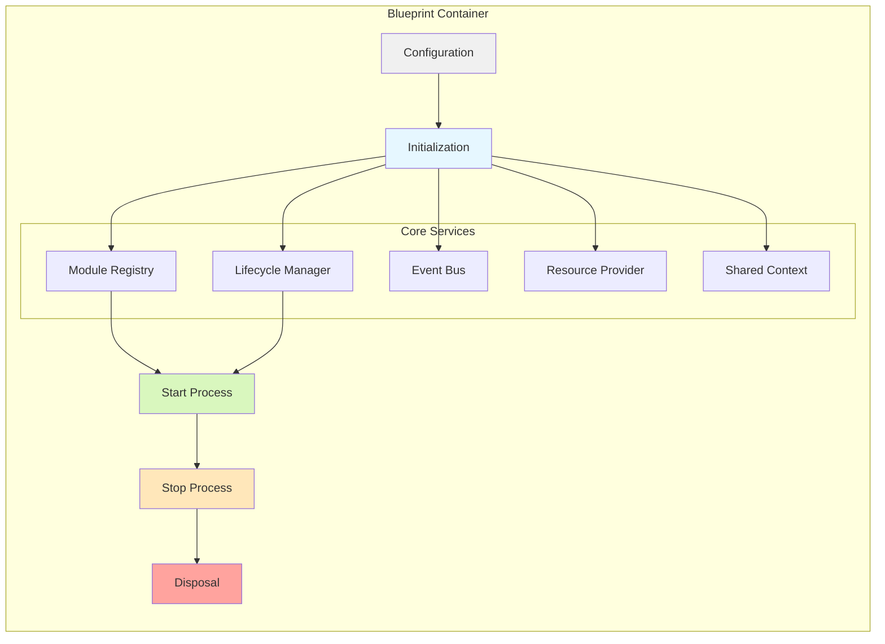

### Module Registry Architecture

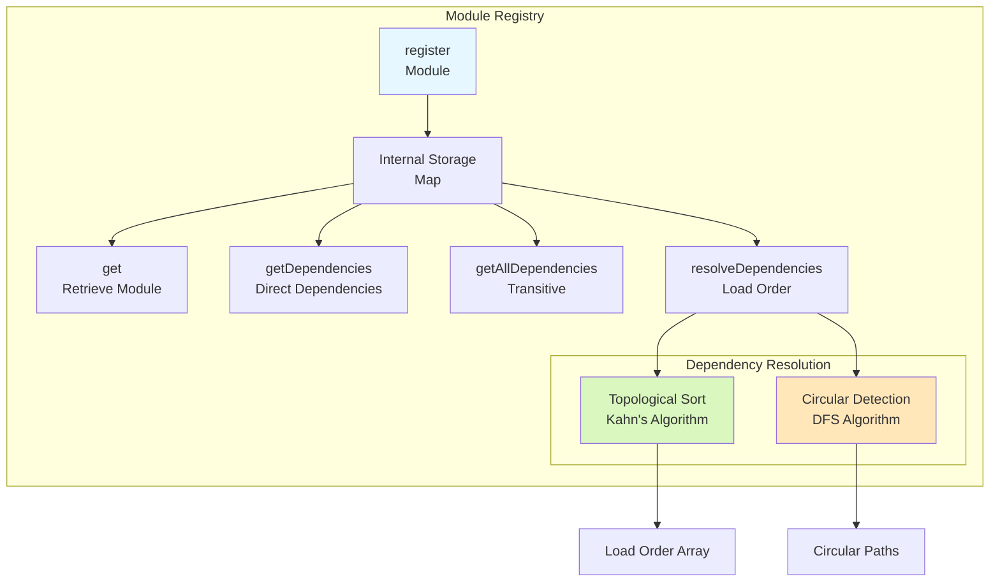

---

## Module Lifecycle

### State Machine Diagram

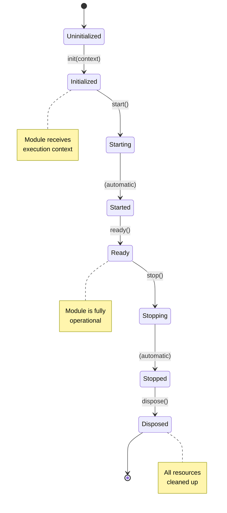

### Lifecycle Flow

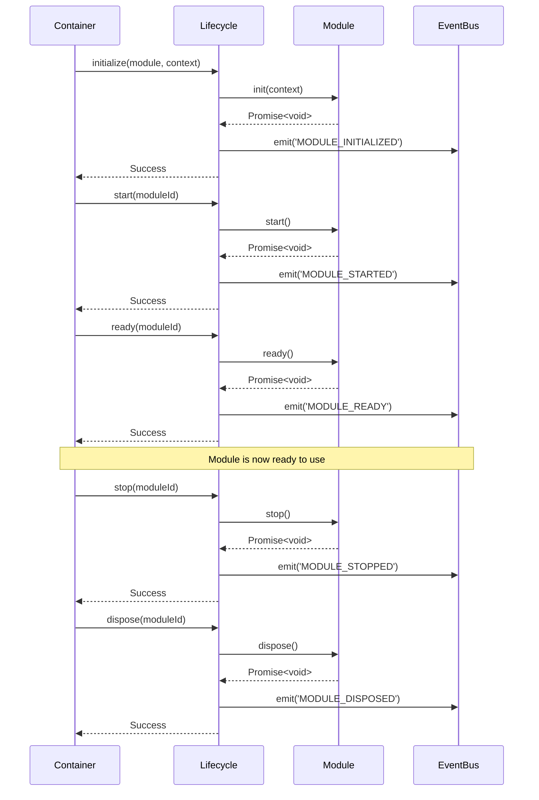

---

## Event Flow

### Event Bus Architecture

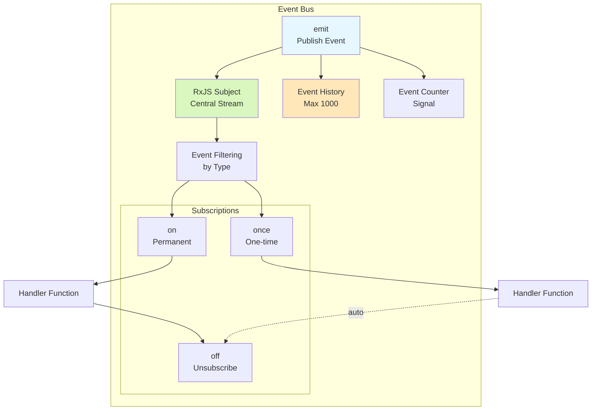

### Module Communication Pattern

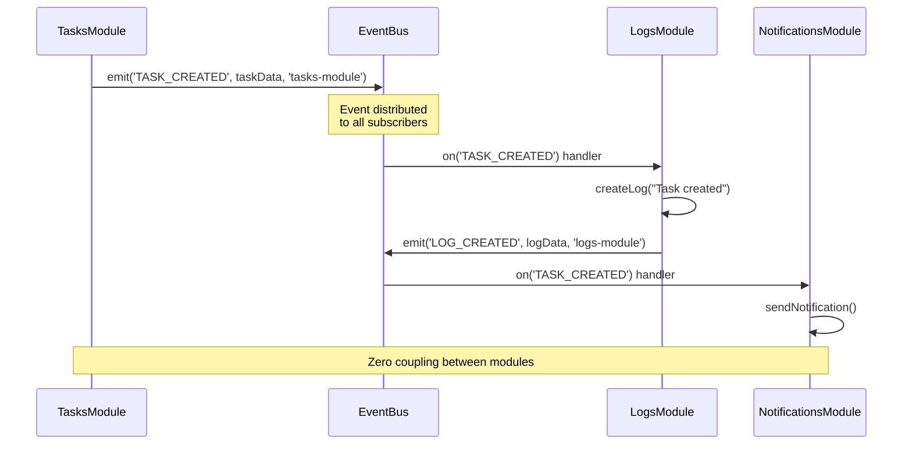

---

## Dependency Resolution

### Dependency Graph Resolution

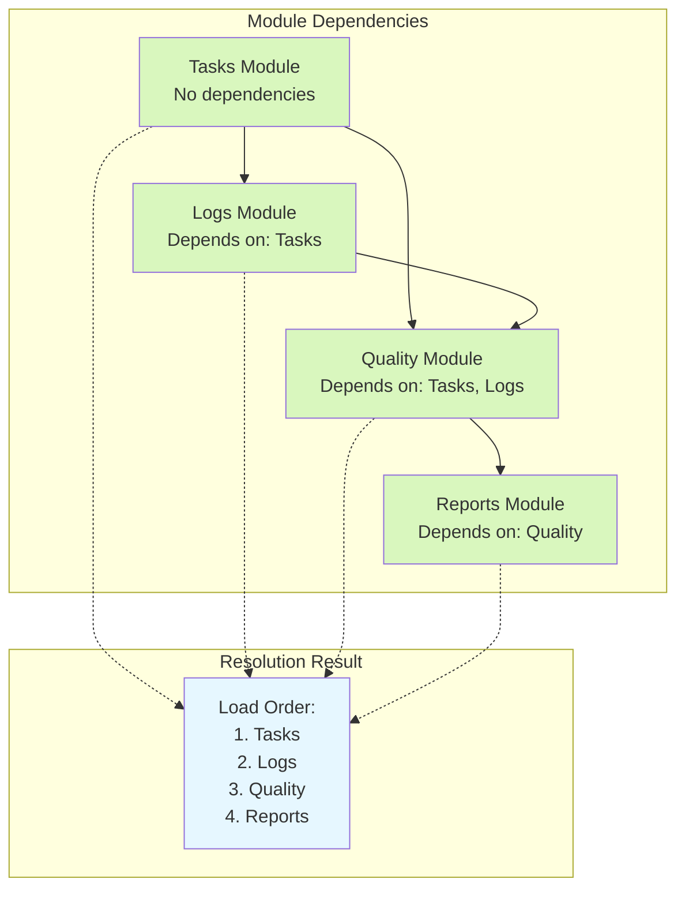

### Circular Dependency Detection

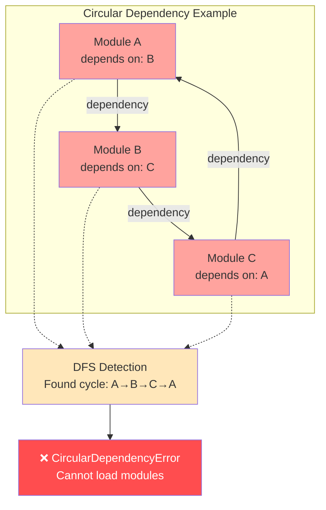

---

## Data Flow

### Complete Data Flow

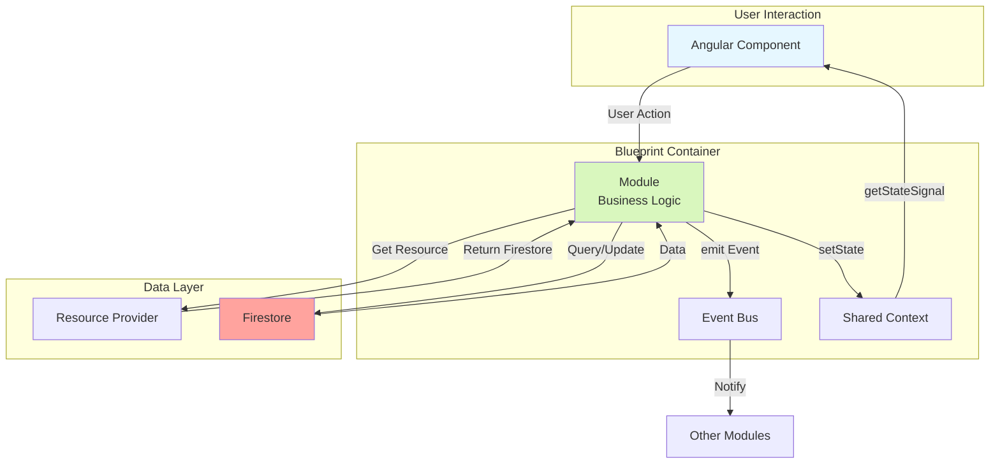

### Resource Provider Flow

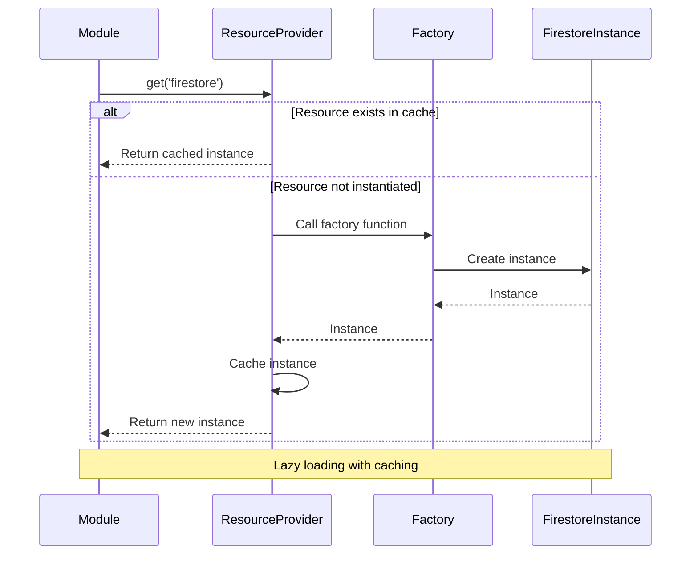

---

## Deployment Architecture

### Production Deployment

```mermaid
graph TB
    subgraph "Client (Browser)"
        Angular[Angular 20 App<br/>Standalone Components]
        Blueprint[Blueprint Container]
        Modules[Loaded Modules]
    end
    
    subgraph "Firebase Platform"
        Auth[Firebase Auth]
        Firestore[Cloud Firestore]
        Storage[Cloud Storage]
        Functions[Cloud Functions]
        Hosting[Firebase Hosting]
    end
    
    subgraph "CI/CD"
        GitHub[GitHub Actions]
        Build[Build Process]
        Test[Test Suite]
        Deploy[Deploy]
    end
    
    Angular --> Blueprint
    Blueprint --> Modules
    
    Modules <-->|@angular/fire| Auth
    Modules <-->|@angular/fire| Firestore
    Modules <-->|@angular/fire| Storage
    Modules <-->|HTTP| Functions
    
    Angular -->|Hosted on| Hosting
    
    GitHub --> Build
    Build --> Test
    Test --> Deploy
    Deploy --> Hosting
    
    style Angular fill:#e6f7ff
    style Blueprint fill:#d9f7be
    style Firestore fill:#ffa39e
    style Hosting fill:#ffe7ba
```

### Multi-Tenant Architecture

```mermaid
graph TB
    subgraph "Client Applications"
        Org1[Organization 1<br/>Blueprint Instance]
        Org2[Organization 2<br/>Blueprint Instance]
        Org3[Organization 3<br/>Blueprint Instance]
    end
    
    subgraph "Shared Infrastructure"
        subgraph "Firestore Collections"
            OrgData[/organizations/{orgId}]
            TeamData[/teams/{teamId}]
            UserData[/users/{userId}]
        end
        
        subgraph "Security"
            RLS[Row Level Security<br/>Firestore Rules]
            Auth[Firebase Auth<br/>Identity Management]
        end
    end
    
    Org1 -->|Isolated Data| OrgData
    Org2 -->|Isolated Data| OrgData
    Org3 -->|Isolated Data| OrgData
    
    OrgData --> RLS
    TeamData --> RLS
    UserData --> RLS
    
    Org1 --> Auth
    Org2 --> Auth
    Org3 --> Auth
    
    Auth --> RLS
    
    style Org1 fill:#e6f7ff
    style Org2 fill:#e6f7ff
    style Org3 fill:#e6f7ff
    style RLS fill:#ffa39e
```

---

## Component Interaction Diagram

### Complete System Interaction

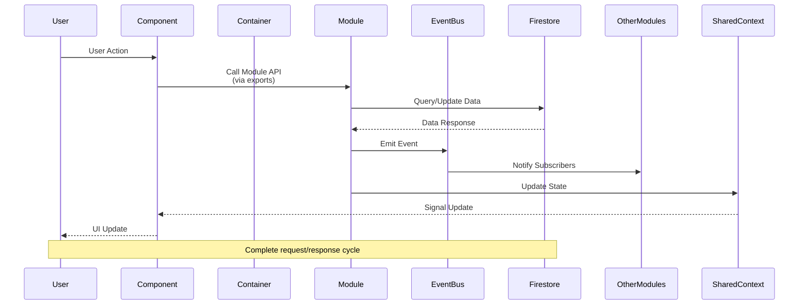

---

## Performance Architecture

### Optimization Strategies

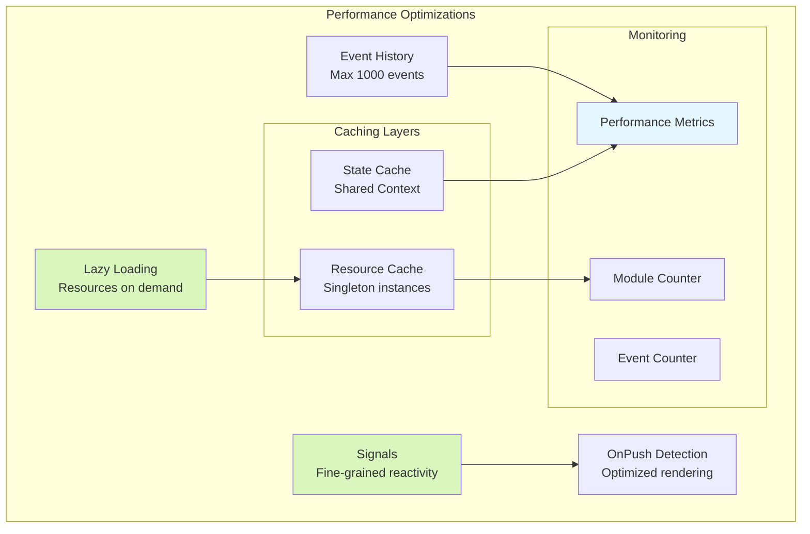

---

## Summary

### Key Architectural Principles

1. **Zero Coupling**: Modules communicate only via Event Bus
2. **Dependency Resolution**: Automatic with topological sort
3. **Lifecycle Management**: Robust state machine
4. **Resource Sharing**: DI container with lazy loading
5. **Reactive State**: Angular Signals for fine-grained reactivity
6. **Multi-Tenant**: Isolated data with Firestore Security Rules
7. **Performance**: Optimized with caching and lazy loading
8. **Scalability**: Infinite module extensibility

---

## Additional Resources

- **API Reference**: [BLUEPRINT_V2_API_REFERENCE.md](./BLUEPRINT_V2_API_REFERENCE.md)
- **Usage Examples**: [BLUEPRINT_V2_USAGE_EXAMPLES.md](./BLUEPRINT_V2_USAGE_EXAMPLES.md)
- **Migration Guide**: [BLUEPRINT_V2_MIGRATION_GUIDE.md](./BLUEPRINT_V2_MIGRATION_GUIDE.md)
- **Specification**: [blueprint-v2-specification.md](./blueprint-v2-specification.md)

---

**Last Updated**: 2025-01-10  
**Version**: 2.0.0  
**Format**: Mermaid Diagrams
