# GigHub - Architecture Plan: Permissions, Logging & Tenant Isolation

> **Document Version**: 1.0  
> **Created**: 2025-12-09  
> **Author**: Senior Cloud Architect  
> **Status**: Design Phase

---

## Executive Summary

This document provides a comprehensive architectural design for GigHub's permission system, activity/operation logging, and tenant isolation strategy. The design follows **Occam's Razor principle** - favoring simplicity while maintaining Blueprint extensibility and scalability.

### Key Design Decisions

1. **Permission Architecture**: Hierarchical role-based access control (RBAC) with Row-Level Security (RLS)
2. **Logging Strategy**: Dual-layer logging (Activity Logs for user actions, Audit Logs for compliance)
3. **Tenant Isolation**: Blueprint-centric isolation with organization-level governance
4. **Cloud Features**: Available at Blueprint level with organization-level quotas
5. **Extensibility**: Plugin-based module system within Blueprint containers

### Current System Context

```
Entity Hierarchy:
User (Account)
├─ Organization [organization_members]
│  └─ Team [team_members] - Organization sub-account
├─ Bot
└─ Blueprint (Logical Container) [blueprint_members] [shared context]
   └─ Created only by User/Organization
   └─ Modules: Tasks, Diary, Quality, Files, etc.
```

---

## System Context

### System Context Diagram

```mermaid
graph TB
    subgraph "External Actors"
        USER[👤 End User]
        ORG_ADMIN[👔 Organization Admin]
        TEAM_MEMBER[👷 Team Member]
        BOT[🤖 Bot/Automation]
        EXTERNAL_SYS[🌐 External Systems]
    end
    
    subgraph "GigHub System Boundary"
        GIGHUB[GigHub Platform]
        
        subgraph "Core Services"
            AUTH[Authentication Service]
            AUTHZ[Authorization Service]
            BLUEPRINT[Blueprint Container Service]
            LOGGING[Logging & Audit Service]
            STORAGE[File Storage Service]
        end
        
        subgraph "Business Modules"
            TASKS[Task Management]
            DIARY[Construction Diary]
            QUALITY[Quality Control]
            FINANCIAL[Financial Management]
        end
    end
    
    subgraph "Infrastructure"
        FIREBASE[(Firebase/PostgreSQL)]
        FIREBASE[Firebase Auth]
        STORAGE_BUCKET[Storage Buckets]
    end
    
    USER --> AUTH
    ORG_ADMIN --> AUTH
    TEAM_MEMBER --> AUTH
    BOT --> AUTH
    
    AUTH --> AUTHZ
    AUTHZ --> BLUEPRINT
    BLUEPRINT --> TASKS
    BLUEPRINT --> DIARY
    BLUEPRINT --> QUALITY
    BLUEPRINT --> FINANCIAL
    
    GIGHUB --> LOGGING
    GIGHUB --> STORAGE
    
    AUTHZ --> FIREBASE
    BLUEPRINT --> FIREBASE
    LOGGING --> FIREBASE
    STORAGE --> STORAGE_BUCKET
    AUTH --> FIREBASE
    
    EXTERNAL_SYS -.->|Webhooks| GIGHUB
    GIGHUB -.->|Notifications| USER
```



**Explanation**:
- **External Actors**: Users, organization admins, team members, bots, and external systems
- **GigHub System**: Core platform with authentication, authorization, blueprint management, and logging
- **Business Modules**: Feature modules that operate within Blueprint containers
- **Infrastructure**: Backend services (Firebase, Firebase, Storage)

### System Boundaries

**Inside GigHub System**:
- User/Organization/Team/Bot account management
- Blueprint container lifecycle management
- Permission and access control enforcement
- Activity and audit logging
- Business module operations (Tasks, Diary, Quality, etc.)
- File storage and management

**Outside GigHub System**:
- User authentication (delegated to Firebase Auth)
- Physical file storage (delegated to Storage Buckets)
- Email/SMS notifications (external providers)
- Payment processing (external gateways)
- External API integrations (webhooks, third-party services)

---

## Architecture Overview

### Architectural Approach

GigHub follows a **three-layer architecture** aligned with the Domain-Driven Design (DDD) pattern:

1. **Foundation Layer** (Account, Auth, Organization)
   - Core identity and access management
   - Multi-tenancy infrastructure
   - Platform-wide configurations

2. **Container Layer** (Blueprint, Permissions, Events)
   - Logical workspace containers (Blueprints)
   - Permission boundaries and enforcement
   - Cross-module event orchestration

3. **Business Layer** (Tasks, Logs, Quality, Financial)
   - Domain-specific business logic
   - Feature modules operating within Blueprints
   - Extensible plugin architecture

### Key Architectural Patterns

- **Multi-Tenancy**: Organization/User-based tenant isolation with Blueprint-level data segregation
- **RBAC + ABAC Hybrid**: Role-Based Access Control with Attribute-Based fine-tuning
- **Event-Driven Architecture**: Domain events for cross-module communication
- **Immutable Audit Trail**: Append-only logging for compliance
- **Row-Level Security (RLS)**: Database-enforced access control

---

## Component Architecture

### Permission System - Component Diagram


**Component Responsibilities**:

1. **Authentication Layer**
   - Validates user identity via Firebase Auth
   - Manages session lifecycle and tokens
   - Handles login/logout flows

2. **Authorization Layer**
   - Determines what authenticated users can do
   - Evaluates policies against user roles and attributes
   - Caches permission decisions for performance

3. **Permission Storage**
   - Stores role assignments at multiple levels
   - Maintains Blueprint-specific permissions
   - Links Teams to Blueprint access levels

4. **RLS Enforcement**
   - Database-level security policies
   - Prevents unauthorized data access
   - Helper functions for permission checks

5. **Application Layer**
   - Route guards prevent unauthorized navigation
   - Component-level permission checks (show/hide UI elements)
   - API interceptors add authorization headers

### Permission Hierarchy


**Role Capabilities**:

| Role | Can Create Blueprint | Can Manage Blueprint | Can Access Blueprint | Can Invite Members |
|------|---------------------|----------------------|----------------------|--------------------|
| **Organization Owner** | ✅ Yes | ✅ All org blueprints | ✅ All org blueprints | ✅ Yes |
| **Organization Admin** | ✅ Yes | ✅ All org blueprints | ✅ All org blueprints | ✅ Yes |
| **Organization Member** | ❌ No | ❌ No | 🔒 Only assigned | ❌ No |
| **Team Leader** | ❌ No | 🔒 Only team blueprints | 🔒 Only team blueprints | 🔒 Within team |
| **Team Member** | ❌ No | ❌ No | 🔒 Only assigned | ❌ No |
| **User (Personal)** | ✅ Yes | ✅ Own blueprints | ✅ Own blueprints | ✅ Yes |
| **Blueprint Owner** | N/A | ✅ Full control | ✅ Full access | ✅ Yes |
| **Blueprint Maintainer** | N/A | ✅ Limited | ✅ Full access | ✅ Limited |
| **Blueprint Contributor** | N/A | ❌ No | ✅ Edit access | ❌ No |
| **Blueprint Viewer** | N/A | ❌ No | 👁️ Read-only | ❌ No |

---

## Logging & Audit Architecture

### Logging System - Data Flow Diagram


**Data Flow Explanation**:

1. **Log Generation**: UI, services, and APIs generate log events
2. **Interception**: Log interceptor captures events automatically
3. **Aggregation**: Logs are collected and batched
4. **Enrichment**: Additional context added (IP, user agent, geolocation, etc.)
5. **Routing**: Logs routed to appropriate storage based on type
6. **Storage**: Persisted in specialized tables (activities, audit_logs, events)
7. **Indexing**: Full-text search index updated for quick queries
8. **Analysis**: Analytics engine processes logs for insights
9. **Alerting**: Critical events trigger alerts

### Dual-Layer Logging Strategy


**Logging Types**:

| Type | Purpose | Retention | Examples | Mutable |
|------|---------|-----------|----------|---------|
| **Activity Logs** | Track user actions for productivity insights | 90 days | Task created, File uploaded, Comment added | ❌ Immutable |
| **Audit Logs** | Compliance, security investigations, legal requirements | 7 years | Permission changed, User deleted, Export executed | ❌ Immutable |
| **Event Logs** | Cross-module communication, integration triggers | 30 days | Blueprint created, Task completed, Payment approved | ❌ Immutable |

### Log Schema

#### Activity Logs

```typescript
interface ActivityLog {
  id: UUID;
  blueprint_id: UUID;           // Tenant isolation
  organization_id: UUID | null; // Optional org context
  
  // Action details
  action_type: string;           // e.g., 'task.created', 'file.uploaded'
  action_category: string;       // e.g., 'task', 'file', 'comment'
  description: string;           // Human-readable description
  
  // Actor
  actor_id: UUID;                // User who performed action
  actor_name: string;            // Name snapshot
  actor_type: 'user' | 'bot' | 'system';
  
  // Context
  entity_type: string;           // e.g., 'task', 'file', 'comment'
  entity_id: UUID;               // ID of affected entity
  entity_name: string | null;    // Name snapshot
  
  // Metadata
  metadata: JSONB;               // Additional data
  duration_ms: number | null;    // Action duration
  
  // Tracking
  ip_address: string | null;
  user_agent: string | null;
  
  created_at: Timestamp;         // When action occurred
}
```

#### Audit Logs

```typescript
interface AuditLog {
  id: UUID;
  blueprint_id: UUID | null;     // May be platform-level
  organization_id: UUID | null;  // May be platform-level
  
  // Entity details
  entity_type: AuditEntityType;  // enum: account, organization, blueprint, etc.
  entity_id: UUID;
  entity_name: string | null;
  
  // Action details
  action: AuditAction;           // enum: create, update, delete, view, export, etc.
  severity: AuditSeverity;       // enum: info, warning, error, critical
  
  // Actor
  actor_id: UUID;
  actor_name: string;
  actor_type: ActorType;         // enum: user, system, bot
  
  // Change tracking
  old_value: JSONB | null;       // Before state
  new_value: JSONB | null;       // After state
  changes: JSONB | null;         // Diff
  
  // Context
  metadata: JSONB;               // Additional context
  context: JSONB;                // Execution context (route, endpoint, etc.)
  
  // Request tracking
  ip_address: INET | null;
  user_agent: TEXT | null;
  request_id: UUID | null;
  
  created_at: Timestamp;         // Immutable timestamp
}
```

### Logging Best Practices

1. **Automatic Logging**
   - Use database triggers for critical operations
   - Implement HTTP interceptors for API calls
   - Use Angular interceptors for UI actions

2. **Contextual Information**
   - Always include blueprint_id for tenant isolation
   - Include organization_id for enterprise-level aggregation
   - Capture user context (role, permissions)

3. **Performance Considerations**
   - Batch log writes to reduce database load
   - Use asynchronous logging (non-blocking)
   - Implement log sampling for high-frequency events

4. **Security & Privacy**
   - Never log sensitive data (passwords, tokens, PII)
   - Encrypt logs at rest
   - Implement access controls on log queries

5. **Compliance Requirements**
   - Immutable audit logs (no updates or deletes)
   - Long-term retention (7+ years for audit logs)
   - Tamper-evident storage (checksums, blockchain anchoring)

---

## Tenant Isolation Strategy

### Deployment Architecture - Tenant Isolation


**Isolation Layers**:

1. **Network Isolation**: CDN and load balancer route requests
2. **Application Isolation**: Tenant resolver determines context
3. **Data Isolation**: RLS policies at database level
4. **Storage Isolation**: Separate storage buckets per organization/blueprint
5. **Service Isolation**: Shared services with tenant-aware APIs

### Tenant Isolation Levels


**Isolation Strategy**:

| Level | Scope | Data Isolation | Storage Isolation | Quota Enforcement |
|-------|-------|----------------|-------------------|-------------------|
| **Platform** | All data | N/A | Shared infrastructure | Global limits |
| **Organization** | Organization data | `organization_id` column + RLS | Organization buckets | Org-level quotas |
| **Blueprint** | Blueprint data | `blueprint_id` column + RLS | Blueprint folders | Blueprint-level quotas |
| **Module** | Module data | `blueprint_id` + `module_type` | Module subfolders | Module-level quotas |

### Cloud Features Placement Decision

**Question**: Should cloud features be available at User/Organization/Team/Blueprint levels, or only Blueprint?

**Answer (Occam's Razor)**: **Blueprint-level only**, with organization-level quotas.

**Rationale**:

1. **Simplicity**: Single point of feature management
2. **Consistency**: All work happens within Blueprints
3. **Scalability**: Easier to meter and bill
4. **Security**: Clear security boundaries
5. **Extensibility**: Modules can be added to Blueprints without changing isolation model

**Implementation**:

```typescript
interface CloudFeatureQuota {
  // Organization-level quotas (inherited by all blueprints)
  organization_id: UUID;
  
  // Feature limits
  max_blueprints: number;        // e.g., 10 for Basic, 100 for Pro
  max_storage_gb: number;        // e.g., 50 GB for Basic, 500 GB for Pro
  max_users_per_blueprint: number; // e.g., 10 for Basic, unlimited for Pro
  max_api_calls_per_month: number; // e.g., 10K for Basic, 1M for Pro
  
  // Feature flags (enabled/disabled at blueprint level)
  enabled_modules: string[];     // e.g., ['tasks', 'diary', 'quality', 'financial']
  enabled_integrations: string[]; // e.g., ['webhooks', 'api', 'zapier']
  
  // Usage tracking (aggregated across blueprints)
  current_blueprints: number;
  current_storage_gb: number;
  current_api_calls_this_month: number;
}

interface BlueprintCloudFeatures {
  blueprint_id: UUID;
  organization_id: UUID;
  
  // Features enabled for this blueprint
  enabled_modules: string[];
  enabled_integrations: string[];
  
  // Blueprint-specific usage
  storage_used_gb: number;
  api_calls_this_month: number;
  
  // Inherits from organization quota
  quota: CloudFeatureQuota; // Reference to org quota
}
```

**Benefits**:
- ✅ **Simple**: One place to manage features
- ✅ **Scalable**: Easy to add new features to Blueprints
- ✅ **Flexible**: Organizations can enable different features per Blueprint
- ✅ **Billing-friendly**: Clear usage metrics per Blueprint
- ✅ **Extensible**: New modules automatically inherit quota system

---

## Key Workflows

### Sequence Diagram: User Accessing Blueprint with Permission Check


**Workflow Explanation**:

1. User attempts to navigate to a Blueprint
2. Route guard intercepts and checks authentication
3. Context service provides current workspace context
4. Authorization engine queries database for user's role in Blueprint
5. RLS policies enforce data-level security
6. If authorized, Blueprint data is loaded and displayed
7. If unauthorized, user is redirected with error message

### Sequence Diagram: Activity Logging Flow


**Workflow Explanation**:

1. User performs an action (e.g., create task)
2. Log interceptor captures the action automatically
3. Activity logger logs the action asynchronously (non-blocking)
4. Main action proceeds (task creation)
5. Audit logger logs critical actions synchronously (blocking)
6. Event bus publishes domain events for other modules
7. Activity logs are batched and persisted
8. Subscribers react to published events

### Sequence Diagram: Permission Grant Flow


**Workflow Explanation**:

1. Blueprint owner grants permission to a user
2. Permission service checks if requester has owner/admin role
3. If authorized, permission record is created
4. Audit log records the permission change
5. Notification sent to the user
6. Owner receives confirmation

---

## Phased Development

### Phase 1: Initial Implementation (MVP)

**Timeline**: 4-6 weeks

**Scope**: Core permission system and basic logging


**Features**:
- ✅ Firebase authentication integration
- ✅ RLS policies for basic access control
- ✅ Activity logging for user actions
- ✅ Simple permission management UI
- ✅ Blueprint-level tenant isolation

**Simplifications**:
- No advanced ABAC (Attribute-Based Access Control)
- No log analytics or dashboards
- No quota enforcement
- No plugin system

**Deliverables**:
1. Authentication service integrated with Firebase
2. RLS policies deployed to database
3. Activity logging service
4. Permission management UI (grant/revoke)
5. Basic audit trail

**Success Criteria**:
- Users can create Blueprints
- Organization admins can invite members
- Team members can access assigned Blueprints
- All actions are logged
- RLS prevents unauthorized access

---

### Phase 2: Final Architecture (Enterprise)

**Timeline**: 8-12 weeks (after Phase 1)

**Scope**: Advanced features, analytics, and enterprise capabilities


**Features**:
- ✅ Attribute-Based Access Control (ABAC)
- ✅ Comprehensive audit logs with 7-year retention
- ✅ Quota management and enforcement
- ✅ Log analytics and monitoring dashboards
- ✅ Plugin system for extensibility
- ✅ Advanced permission UI (role templates, bulk operations)
- ✅ Integration with external identity providers (SAML, OAuth)
- ✅ Compliance reporting (SOC 2, GDPR, ISO 27001)

**Deliverables**:
1. ABAC policy engine
2. Long-term audit log storage with encryption
3. Quota management service
4. Analytics dashboard for logs
5. Plugin architecture and SDK
6. Advanced permission management UI
7. Compliance report generator

**Success Criteria**:
- Granular permissions based on attributes
- Complete audit trail for compliance
- Quota limits enforced automatically
- Real-time log monitoring and alerts
- Plugins can extend Blueprint functionality
- Generate compliance reports on-demand

---

### Migration Path from Phase 1 to Phase 2


**Migration Strategy**:

1. **Add ABAC Policies** (Week 1-2)
   - Extend existing RLS policies with attribute checks
   - Introduce policy evaluation engine
   - Backward compatible with Phase 1 roles

2. **Enhance Audit Logs** (Week 3-4)
   - Add audit_logs table (separate from activities)
   - Implement long-term storage strategy
   - Enable encryption at rest

3. **Implement Quotas** (Week 5-6)
   - Add quota tables and tracking
   - Implement quota enforcement service
   - Build quota management UI

4. **Build Analytics** (Week 7-8)
   - Create analytics views and aggregations
   - Build monitoring dashboard
   - Set up alerts for anomalies

5. **Enable Plugins** (Week 9-12)
   - Design plugin architecture
   - Implement plugin loader and lifecycle
   - Build plugin marketplace UI

**Zero-Downtime Migration**:
- All Phase 1 features continue working during migration
- New features added incrementally
- Feature flags control rollout
- Rollback plan for each migration step

---

## Non-Functional Requirements Analysis

### Scalability

**How the architecture supports scaling**:

1. **Horizontal Scaling**
   - Stateless application servers (can add more instances)
   - Load balancer distributes traffic
   - Database read replicas for read-heavy workloads

2. **Data Partitioning**
   - Blueprint-level isolation enables sharding by blueprint_id
   - Organization-level partitioning for large enterprises
   - Time-based partitioning for logs (archive old data)

3. **Caching Strategy**
   - Permission cache (reduce database queries)
   - Blueprint metadata cache
   - Session cache for authentication

4. **Asynchronous Processing**
   - Activity logging is non-blocking
   - Event processing decoupled from main workflows
   - Background jobs for analytics and cleanup

**Scaling Limits**:
- Single database instance: Up to 10,000 concurrent users
- With read replicas: Up to 50,000 concurrent users
- With sharding: Up to 1,000,000 concurrent users

---

### Performance

**Performance characteristics and optimizations**:

1. **Database Optimizations**
   - Indexes on all foreign keys and query columns
   - RLS policies optimized with helper functions
   - Connection pooling for database connections
   - Query result caching

2. **API Performance**
   - Response time target: < 200ms for 95th percentile
   - Pagination for large datasets
   - GraphQL for flexible queries (reduce over-fetching)
   - HTTP/2 for multiplexing

3. **Frontend Performance**
   - Lazy loading of modules and routes
   - Angular OnPush change detection
   - Virtual scrolling for large lists
   - Service workers for offline capability

4. **Logging Performance**
   - Asynchronous activity logging (no user-facing latency)
   - Batched log writes (reduce database load)
   - Log sampling for high-frequency events
   - Separate log database (isolate from transactional data)

**Performance Monitoring**:
- Application Performance Monitoring (APM) integration
- Real-time dashboards for key metrics
- Alerts for performance degradation
- Regular load testing

---

### Security

**Security architecture and controls**:

1. **Authentication Security**
   - Firebase Authentication (industry-standard)
   - Multi-factor authentication (MFA) support
   - Session management with JWT tokens
   - Token refresh and revocation

2. **Authorization Security**
   - Row-Level Security (database-enforced)
   - Principle of least privilege (default deny)
   - Permission caching with short TTL (reduce stale permissions)
   - Audit trail for all permission changes

3. **Data Security**
   - Encryption at rest (database and storage)
   - Encryption in transit (TLS/HTTPS)
   - Sensitive data masking in logs
   - PII data anonymization

4. **Application Security**
   - Input validation and sanitization
   - SQL injection prevention (parameterized queries)
   - XSS prevention (Angular sanitization)
   - CSRF protection (tokens)
   - Rate limiting and DDoS protection

5. **Compliance**
   - GDPR compliance (data portability, right to deletion)
   - SOC 2 Type II readiness
   - ISO 27001 alignment
   - Regular security audits

**Security Monitoring**:
- Intrusion detection system (IDS)
- Anomaly detection in logs
- Real-time alerts for security events
- Regular penetration testing

---

### Reliability

**High availability, disaster recovery, fault tolerance**:

1. **High Availability (HA)**
   - Multi-region deployment (primary + secondary)
   - Load balancer with health checks
   - Auto-scaling for application servers
   - Database failover (primary → standby)

2. **Disaster Recovery (DR)**
   - Automated daily backups
   - Point-in-time recovery (PITR)
   - Cross-region backup replication
   - Recovery Time Objective (RTO): < 4 hours
   - Recovery Point Objective (RPO): < 15 minutes

3. **Fault Tolerance**
   - Graceful degradation (fallback to read-only mode)
   - Circuit breakers for external services
   - Retry logic with exponential backoff
   - Error handling and recovery workflows

4. **Monitoring & Alerting**
   - Health checks for all services
   - Uptime monitoring (target: 99.9%)
   - Real-time alerts for outages
   - On-call rotation for incident response

**SLA Commitments**:
- Uptime: 99.9% (8.77 hours downtime per year)
- Response time: < 200ms for 95% of requests
- Data durability: 99.999999999% (11 nines)

---

### Maintainability

**Design for maintainability and evolution**:

1. **Code Quality**
   - TypeScript for type safety
   - Strict linting rules (ESLint, Prettier)
   - Code review process (required before merge)
   - Unit test coverage: > 80%
   - Integration test coverage: > 60%

2. **Modular Architecture**
   - Clear separation of concerns (3-layer architecture)
   - Dependency injection for testability
   - Plugin system for extensibility
   - Feature flags for gradual rollout

3. **Documentation**
   - Architecture decision records (ADRs)
   - API documentation (OpenAPI/Swagger)
   - Database schema documentation
   - Runbook for operations

4. **DevOps Practices**
   - Infrastructure as Code (IaC)
   - Continuous Integration / Continuous Deployment (CI/CD)
   - Automated testing in pipeline
   - Blue-green deployments (zero downtime)

5. **Observability**
   - Structured logging
   - Distributed tracing
   - Metrics and dashboards
   - Root cause analysis tools

**Evolution Strategy**:
- Backward compatibility for 2 major versions
- Deprecation notices 6 months in advance
- Migration guides for breaking changes
- Version pinning for dependencies

---

## Risks and Mitigations

### Identified Risks

1. **Risk: Performance Degradation with Large Datasets**
   - **Impact**: Slow queries, poor user experience
   - **Likelihood**: High (as system grows)
   - **Mitigation**:
     - Implement database indexing strategy
     - Use pagination and virtual scrolling
     - Archive old data (move to cold storage)
     - Monitor query performance continuously

2. **Risk: RLS Policy Complexity**
   - **Impact**: Difficult to debug, potential security gaps
   - **Likelihood**: Medium
   - **Mitigation**:
     - Comprehensive testing of RLS policies
     - Policy documentation and examples
     - Automated policy testing in CI/CD
     - Regular security audits

3. **Risk: Log Storage Costs**
   - **Impact**: High costs for long-term log retention
   - **Likelihood**: High (logs accumulate)
   - **Mitigation**:
     - Tiered storage (hot/warm/cold)
     - Log aggregation and compression
     - Implement log retention policies
     - Archive to cost-effective storage (S3 Glacier)

4. **Risk: Permission Cache Staleness**
   - **Impact**: Users see outdated permissions
   - **Likelihood**: Medium
   - **Mitigation**:
     - Short cache TTL (5 minutes)
     - Cache invalidation on permission changes
     - Event-driven cache updates
     - Manual cache refresh option

5. **Risk: Multi-Tenant Data Leakage**
   - **Impact**: Critical security breach, legal liability
   - **Likelihood**: Low (with proper RLS)
   - **Mitigation**:
     - Rigorous RLS policy testing
     - Automated security testing
     - Penetration testing by third party
     - Regular security audits
     - Defense in depth (multiple layers)

6. **Risk: Blueprint Quota Exhaustion**
   - **Impact**: Users cannot create more resources
   - **Likelihood**: Medium
   - **Mitigation**:
     - Proactive quota monitoring
     - Alerts when approaching limits
     - Self-service quota increase
     - Soft vs. hard limits (warnings vs. blocking)

---

## Technology Stack Recommendations

### Backend

| Component | Recommended Technology | Rationale |
|-----------|------------------------|-----------|
| **Authentication** | Firebase Authentication | Already integrated, mature, supports MFA |
| **Storage** | Firebase Storage / Firebase Storage | Integrated with main platform, secure, scalable |
| **API** | RESTful API + GraphQL (optional) | REST for simplicity, GraphQL for complex queries |
| **Backend Language** | PostgreSQL Functions (PL/pgSQL) | Database-native, secure, performant |

### Frontend

| Component | Recommended Technology | Rationale |
|-----------|------------------------|-----------|
| **Framework** | Angular 20 | Already in use, enterprise-ready, strong TypeScript support |
| **UI Library** | ng-alain + ng-zorro-antd | Already in use, comprehensive component library |
| **State Management** | Angular Signals | Native, reactive, simple |
| **HTTP Client** | Angular HttpClient | Built-in, mature, interceptor support |
| **Forms** | Reactive Forms | Type-safe, testable, scalable |

### Infrastructure

| Component | Recommended Technology | Rationale |
|-----------|------------------------|-----------|
| **Hosting** | Vercel / Netlify | Easy deployment, CDN, serverless functions |
| **Database Hosting** | Firebase Cloud | Managed PostgreSQL, backups, scaling |
| **Monitoring** | Sentry (errors) + LogRocket (sessions) | Comprehensive error tracking and session replay |
| **Analytics** | Firebase Analytics + Custom Dashboard | Built-in, customizable |
| **CI/CD** | GitHub Actions | Integrated with GitHub, free for open source |

### Security

| Component | Recommended Technology | Rationale |
|-----------|------------------------|-----------|
| **WAF** | Cloudflare | DDoS protection, rate limiting, firewall |
| **Secrets Management** | Firebase Vault / Vercel Environment Variables | Secure, encrypted, access-controlled |
| **SSL/TLS** | Let's Encrypt (via Vercel/Netlify) | Free, automatic renewal |
| **Security Scanning** | Snyk / Dependabot | Automated vulnerability scanning |

---

## Next Steps

### Immediate Actions (Week 1-2)

1. **Review and Approval**
   - [ ] Stakeholder review of architecture document
   - [ ] Technical team review
   - [ ] Security team review
   - [ ] Approval to proceed

2. **Detailed Design**
   - [ ] Create detailed database schema for audit_logs enhancements
   - [ ] Design permission management UI wireframes
   - [ ] Define API contracts for permission and logging services
   - [ ] Document plugin architecture in detail

3. **Development Setup**
   - [ ] Set up development branches
   - [ ] Configure CI/CD pipeline for automated testing
   - [ ] Prepare staging environment
   - [ ] Set up monitoring and alerting

### Phase 1 Implementation (Week 3-8)

4. **Sprint 1: Authentication & Basic Authorization** (Week 3-4)
   - [ ] Implement authentication service
   - [ ] Deploy RLS policies to database
   - [ ] Create route guards
   - [ ] Build permission check service

5. **Sprint 2: Activity Logging** (Week 5-6)
   - [ ] Implement activity logging service
   - [ ] Add log interceptors
   - [ ] Create activity log UI
   - [ ] Set up log storage and indexing

6. **Sprint 3: Permission Management UI** (Week 7-8)
   - [ ] Build permission management components
   - [ ] Implement role assignment UI
   - [ ] Create permission audit trail view
   - [ ] Add permission testing tools

### Testing & Validation (Week 9-10)

7. **Quality Assurance**
   - [ ] Unit testing (target: 80% coverage)
   - [ ] Integration testing
   - [ ] Security testing (penetration testing)
   - [ ] Performance testing (load testing)
   - [ ] User acceptance testing (UAT)

8. **Documentation**
   - [ ] Update API documentation
   - [ ] Create user guides
   - [ ] Write migration guides
   - [ ] Document runbooks for operations

### Deployment & Monitoring (Week 11-12)

9. **Production Deployment**
   - [ ] Deploy to staging environment
   - [ ] Smoke testing in staging
   - [ ] Blue-green deployment to production
   - [ ] Post-deployment verification

10. **Monitoring & Optimization**
    - [ ] Set up monitoring dashboards
    - [ ] Configure alerts
    - [ ] Monitor performance metrics
    - [ ] Iterate based on feedback

---

## Appendix

### Glossary

- **ABAC**: Attribute-Based Access Control
- **ADR**: Architecture Decision Record
- **RLS**: Row-Level Security
- **RBAC**: Role-Based Access Control
- **RTO**: Recovery Time Objective
- **RPO**: Recovery Point Objective
- **JWT**: JSON Web Token
- **MFA**: Multi-Factor Authentication
- **PITR**: Point-In-Time Recovery
- **WAF**: Web Application Firewall

### References

- [Firebase Authentication](https://firebase.google.com/docs/auth)
- [Angular Architecture Guide](https://angular.dev/guide/architecture)
- [PostgreSQL Security Best Practices](https://www.postgresql.org/docs/current/security.html)
- [OWASP Top 10](https://owasp.org/www-project-top-ten/)
- [GDPR Compliance](https://gdpr.eu/)
- [SOC 2 Compliance](https://www.aicpa.org/soc)

---

**Document End**

---

## Revision History

| Version | Date | Author | Changes |
|---------|------|--------|---------|
| 1.0 | 2025-12-09 | Senior Cloud Architect | Initial architecture design |

---

**Approval**

| Role | Name | Signature | Date |
|------|------|-----------|------|
| Product Owner | [Pending] | | |
| Technical Lead | [Pending] | | |
| Security Lead | [Pending] | | |
| CTO | [Pending] | | |
