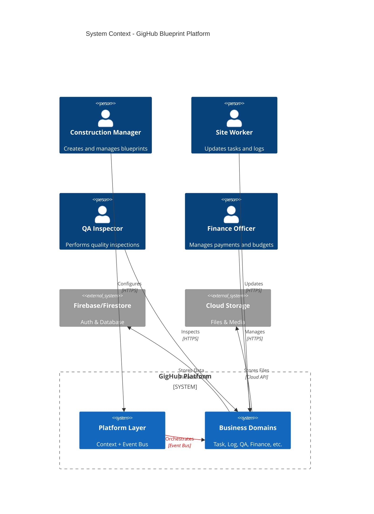
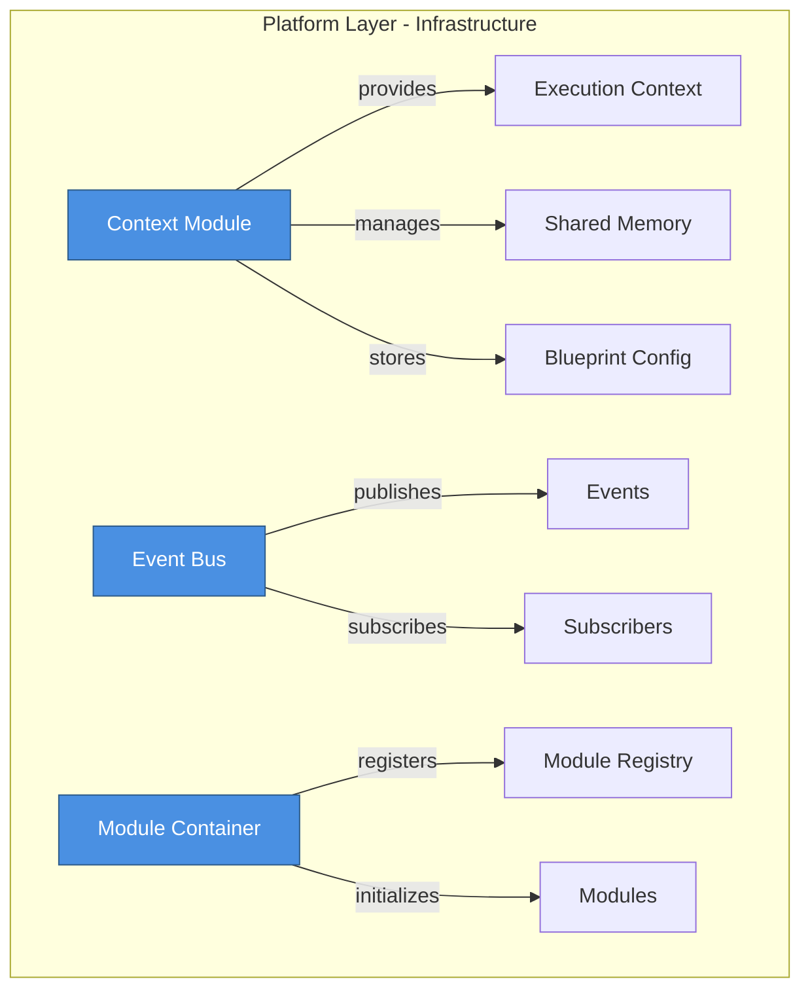
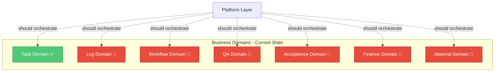
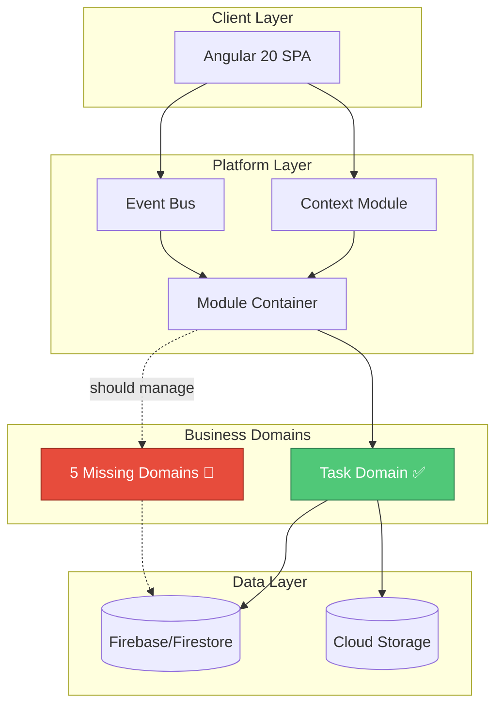
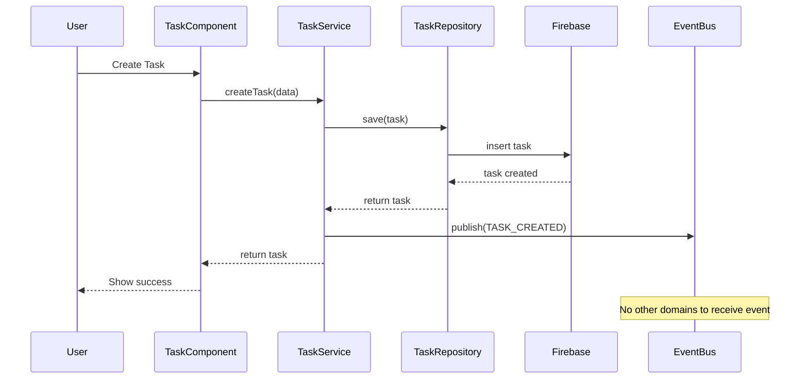
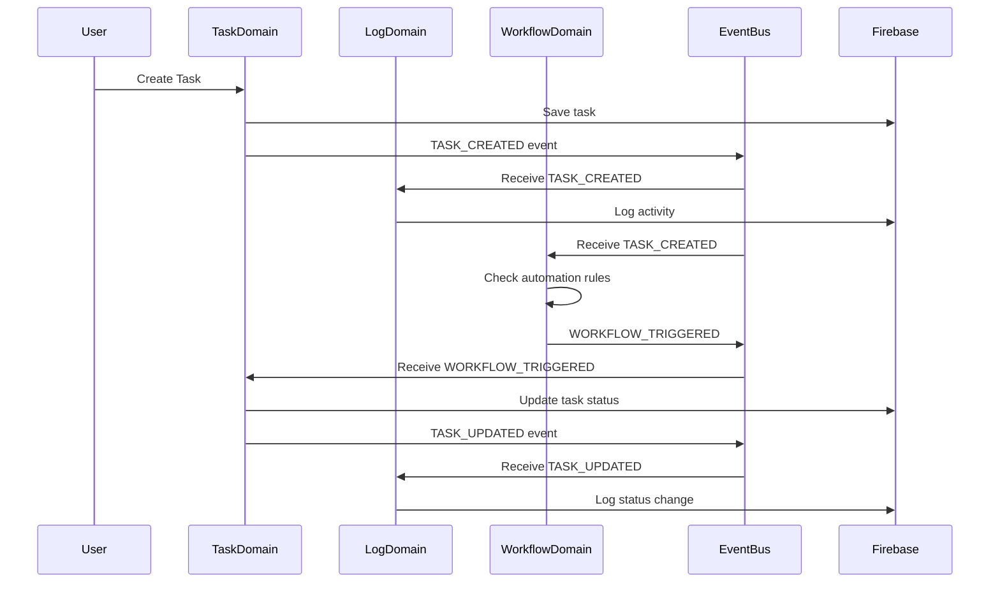
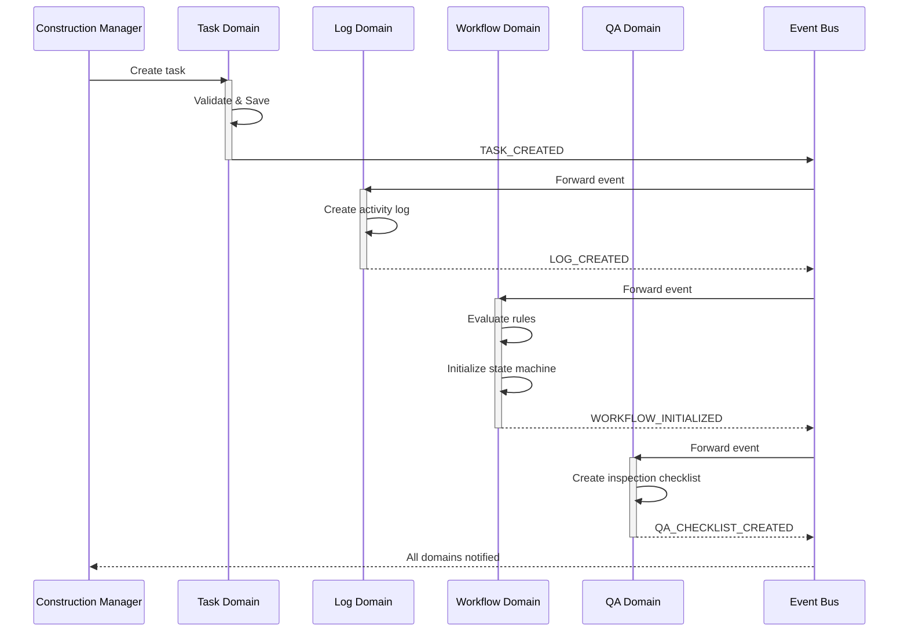
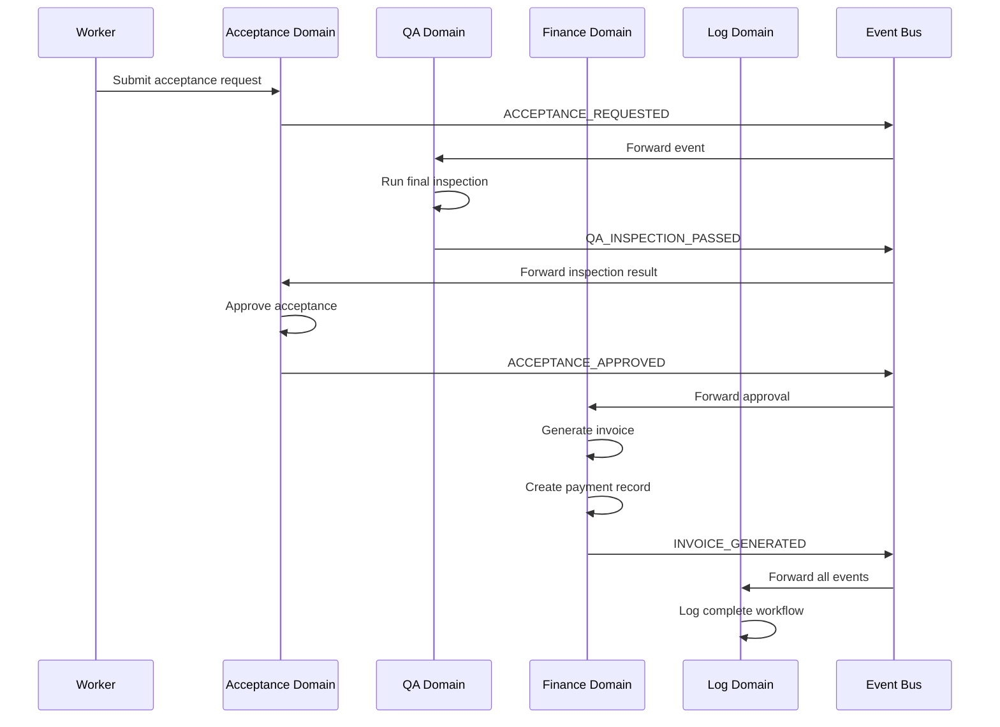

# GigHub Blueprint Architecture Analysis

> **Document Purpose**: Comprehensive analysis comparing the Blueprint V2.0 structure defined in `next.md` with the current implementation  
> **Analysis Date**: 2025-12-12  
> **Document Version**: 1.0.0  
> **Reviewer**: Senior Cloud Architect

---

## Executive Summary

This document analyzes the GigHub Blueprint architecture as defined in `next.md` against the current codebase implementation. The analysis identifies structural gaps, missing domains, and architectural inconsistencies that need to be addressed to align the implementation with the intended two-layer architecture.

### Key Findings

**Alignment Status**: ⚠️ **Partially Aligned** (60% compliance)

**Strengths** ✅:
- Platform Layer (Context Module, Event Bus) is properly implemented
- Core infrastructure follows the two-layer principle
- Module interface system is well-designed
- Event-driven architecture is in place

**Critical Gaps** 🔴:
- **Only 1 out of 6-8 Business Domains implemented** (Task Domain only)
- Missing 5-7 critical business domains (Log, Workflow, QA, Acceptance, Finance, Material)
- No clear separation between Platform Layer and Business Domain folders
- Inconsistent domain structure organization
- Missing domain-specific state management and repositories

**Risk Level**: 🔴 **HIGH** - Current architecture allows unconstrained domain growth and lacks clear Business Domain boundaries

---

## 1. System Context

### 1.1 System Context Diagram



### 1.2 Explanation

**System Purpose**:
GigHub is a construction management platform that organizes projects into customizable Blueprints. Each Blueprint contains modular Business Domains that handle specific aspects of construction management.

**Two-Layer Architecture**:
1. **Platform Layer (🟦 A)**: Infrastructure that enables domains to operate (Context Module + Event/Automation Engine)
2. **Business Domains (🟥 B)**: 6-8 domain modules representing specific business capabilities

**External Dependencies**:
- **Firebase/Firestore**: Primary data storage and authentication
- **Cloud Storage**: Document and media file storage

---

## 2. Architecture Overview - Blueprint Structure Comparison

### 2.1 Expected Structure (from next.md)

```
Blueprint
 ├── (A) Platform Layer ━━━━━━━━━━━━━━━━━━━━ NOT a Domain
 │    ├── Context Module
 │    │    ├── Blueprint Configuration
 │    │    ├── Runtime Context
 │    │    ├── State Machine Config
 │    │    ├── Domain Activation Settings
 │    │    └── Shared Memory (cross-module proxy)
 │    └── Event / Automation Engine
 │         ├── Inter-domain Event Exchange
 │         └── Workflow Driver
 │
 └── (B) Business Domains ━━━━━━━━━━━━━━━━━ 6-8 Domains
      ├── 1. Task Domain ✅ (REQUIRED)
      ├── 2. Log Domain ✅ (REQUIRED)
      ├── 3. Workflow Domain ✅ (REQUIRED)
      ├── 4. QA Domain ✅ (REQUIRED)
      ├── 5. Acceptance Domain ✅ (REQUIRED)
      ├── 6. Finance Domain ✅ (REQUIRED)
      ├── 7. Material Domain ⚠️ (RECOMMENDED)
      └── 8. Safety/Communication Domain ⚪ (OPTIONAL)
```

### 2.2 Current Implementation Structure

```
src/app/core/blueprint/
 ├── context/ ✅ (Platform Layer - Context Module)
 │    ├── execution-context.interface.ts
 │    ├── shared-context.ts
 │    └── tenant-info.interface.ts
 │
 ├── events/ ✅ (Platform Layer - Event Bus)
 │    ├── event-bus.ts
 │    ├── event-types.ts
 │    └── event-bus.interface.ts
 │
 ├── container/ ✅ (Platform Layer - Module Registry)
 │    ├── blueprint-container.ts
 │    ├── module-registry.ts
 │    └── module-registry.interface.ts
 │
 ├── modules/ ⚠️ (Business Domains - Incomplete)
 │    ├── module.interface.ts ✅
 │    ├── module-status.enum.ts ✅
 │    └── implementations/
 │         └── tasks/ ✅ (Only 1 of 6-8 domains implemented)
 │              ├── tasks.module.ts
 │              ├── tasks.service.ts
 │              ├── tasks.repository.ts
 │              └── tasks.component.ts
 │
 ├── services/ ✅ (Platform Services)
 ├── repositories/ ✅ (Platform Repositories)
 ├── models/ ✅ (Shared Models)
 └── config/ ✅ (Blueprint Configuration)
```

### 2.3 Gap Analysis

| Component | Expected | Current Status | Gap |
|-----------|----------|----------------|-----|
| **Platform Layer** | Context + Event Bus | ✅ Implemented | None |
| **Task Domain** | Required | ✅ Implemented | None |
| **Log Domain** | Required | 🔴 Missing | **CRITICAL** |
| **Workflow Domain** | Required | 🔴 Missing | **CRITICAL** |
| **QA Domain** | Required | 🔴 Missing | **CRITICAL** |
| **Acceptance Domain** | Required | 🔴 Missing | **CRITICAL** |
| **Finance Domain** | Required | 🔴 Missing | **CRITICAL** |
| **Material Domain** | Recommended | 🔴 Missing | High Priority |
| **Safety Domain** | Optional | 🔴 Missing | Low Priority |
| **Communication Domain** | Optional | 🔴 Missing | Low Priority |

**Completion Rate**: **1/6 Required Domains = 16.7%**

---

## 3. Component Architecture

### 3.1 Platform Layer (Layer A) - Current Implementation



**Status**: ✅ **Complete and Correct**

**Components**:
1. **Context Module** (`/context/`)
   - Provides execution context to all domains
   - Manages shared memory and cross-module data proxies
   - Stores blueprint configuration and domain activation settings
   - Implements tenant isolation

2. **Event/Automation Engine** (`/events/`)
   - Event Bus for inter-domain communication
   - Publish-subscribe pattern implementation
   - Workflow automation triggers
   - Event type definitions and routing

3. **Module Container** (`/container/`)
   - Module registry and lifecycle management
   - Dependency injection for modules
   - Module initialization sequencing
   - Status tracking and health monitoring

**Design Decisions**:
- ✅ Correctly separated from business logic
- ✅ Provides infrastructure services to all domains
- ✅ Uses Angular Signals for reactive state
- ✅ Implements proper lifecycle management

---

### 3.2 Business Domains (Layer B) - Implementation Gaps



**Status**: 🔴 **Critically Incomplete**

---

## 4. Missing Business Domains Analysis

### 4.1 Domain #1: Task Domain ✅

**Status**: ✅ **Implemented**

**Location**: `src/app/core/blueprint/modules/implementations/tasks/`

**Components**:
- ✅ Task Module (`tasks.module.ts`)
- ✅ Task Service (`tasks.service.ts`)
- ✅ Task Repository (`tasks.repository.ts`)
- ✅ Task Component (`tasks.component.ts`)
- ✅ Module Metadata (`module.metadata.ts`)

**Capabilities**:
- Task creation and management
- Task assignment
- Status tracking via state machine
- Progress monitoring
- Scheduling

---

### 4.2 Domain #2: Log / Activity Domain 🔴

**Status**: 🔴 **MISSING**

**Expected Location**: `src/app/core/blueprint/modules/implementations/logs/`

**Required Components**:
```
logs/
├── logs.module.ts          # Domain module implementation
├── logs.service.ts         # Business logic for activity tracking
├── logs.repository.ts      # Data access layer
├── logs.component.ts       # UI for viewing logs
├── activity-log.model.ts   # Activity log data model
├── event-log.model.ts      # System event model
├── comment.model.ts        # Comment model
├── attachment.model.ts     # Attachment model
├── module.metadata.ts      # Module registration metadata
└── index.ts                # Public API exports
```

**Required Capabilities**:
- 📝 Operation logging (who did what, when)
- 🔔 System event tracking
- 💬 Comments on activities
- 📎 File attachments
- 🔍 Activity search and filtering
- 📊 Activity timeline visualization

**Dependencies**:
- Task Domain (logs task activities)
- Workflow Domain (logs workflow transitions)
- QA Domain (logs inspection results)

**Database Requirements**:
```sql
-- Activity Logs Table
CREATE TABLE activity_logs (
  id UUID PRIMARY KEY,
  blueprint_id UUID REFERENCES blueprints(id),
  domain_name TEXT NOT NULL,
  entity_type TEXT NOT NULL,
  entity_id UUID NOT NULL,
  action TEXT NOT NULL,
  user_id UUID REFERENCES users(id),
  metadata JSONB,
  created_at TIMESTAMPTZ DEFAULT NOW()
);

-- Comments Table
CREATE TABLE comments (
  id UUID PRIMARY KEY,
  activity_log_id UUID REFERENCES activity_logs(id),
  user_id UUID REFERENCES users(id),
  content TEXT NOT NULL,
  created_at TIMESTAMPTZ DEFAULT NOW()
);

-- Attachments Table
CREATE TABLE attachments (
  id UUID PRIMARY KEY,
  activity_log_id UUID REFERENCES activity_logs(id),
  file_name TEXT NOT NULL,
  file_url TEXT NOT NULL,
  file_size INTEGER,
  mime_type TEXT,
  created_at TIMESTAMPTZ DEFAULT NOW()
);
```

**Impact of Missing Log Domain**:
- 🔴 No audit trail for user actions
- 🔴 No historical tracking of changes
- 🔴 Cannot trace who modified what
- 🔴 No comment system for collaboration
- 🔴 No centralized attachment management

---

### 4.3 Domain #3: Workflow / Process Domain 🔴

**Status**: 🔴 **MISSING**

**Expected Location**: `src/app/core/blueprint/modules/implementations/workflow/`

**Required Components**:
```
workflow/
├── workflow.module.ts         # Domain module implementation
├── workflow.service.ts        # Workflow orchestration logic
├── workflow.repository.ts     # Workflow persistence
├── state-machine.service.ts   # State machine engine
├── automation.service.ts      # Automation rule engine
├── workflow-builder.component.ts  # Visual workflow builder
├── workflow.model.ts          # Workflow definition model
├── state-machine.model.ts     # State machine configuration
├── automation-rule.model.ts   # Automation rule model
├── module.metadata.ts         # Module registration
└── index.ts                   # Public API
```

**Required Capabilities**:
- 🔄 Custom workflow definition
- 📊 Configurable state machines
- ⚙️ Automation triggers and rules
- 🎯 Workflow validation and execution
- 📈 Workflow analytics and monitoring
- 🔀 Conditional branching logic
- ⏱️ Time-based triggers

**Dependencies**:
- Task Domain (task workflow transitions)
- QA Domain (inspection workflows)
- Finance Domain (approval workflows)
- Acceptance Domain (acceptance workflows)

**Database Requirements**:
```sql
-- Workflows Table
CREATE TABLE workflows (
  id UUID PRIMARY KEY,
  blueprint_id UUID REFERENCES blueprints(id),
  name TEXT NOT NULL,
  description TEXT,
  definition JSONB NOT NULL,
  status TEXT DEFAULT 'draft',
  created_at TIMESTAMPTZ DEFAULT NOW(),
  updated_at TIMESTAMPTZ DEFAULT NOW()
);

-- State Machines Table
CREATE TABLE state_machines (
  id UUID PRIMARY KEY,
  workflow_id UUID REFERENCES workflows(id),
  name TEXT NOT NULL,
  states JSONB NOT NULL,
  transitions JSONB NOT NULL,
  initial_state TEXT NOT NULL,
  created_at TIMESTAMPTZ DEFAULT NOW()
);

-- Automation Rules Table
CREATE TABLE automation_rules (
  id UUID PRIMARY KEY,
  workflow_id UUID REFERENCES workflows(id),
  trigger_type TEXT NOT NULL,
  trigger_config JSONB NOT NULL,
  action_type TEXT NOT NULL,
  action_config JSONB NOT NULL,
  is_active BOOLEAN DEFAULT true,
  created_at TIMESTAMPTZ DEFAULT NOW()
);
```

**Impact of Missing Workflow Domain**:
- 🔴 Cannot customize task state transitions
- 🔴 No automation capabilities
- 🔴 Manual workflow management required
- 🔴 No workflow templates or reuse
- 🔴 Other domains cannot use workflow engine

---

### 4.4 Domain #4: QA (Quality Assurance) Domain 🔴

**Status**: 🔴 **MISSING**

**Expected Location**: `src/app/core/blueprint/modules/implementations/qa/`

**Required Components**:
```
qa/
├── qa.module.ts              # Domain module implementation
├── qa.service.ts             # Quality inspection logic
├── qa.repository.ts          # QA data persistence
├── checklist.service.ts      # Checklist management
├── issue.service.ts          # Issue tracking
├── inspection.component.ts   # Inspection UI
├── checklist.component.ts    # Checklist UI
├── issue.component.ts        # Issue tracking UI
├── qa-inspection.model.ts    # Inspection model
├── qa-checklist.model.ts     # Checklist model
├── qa-issue.model.ts         # Issue/defect model
├── module.metadata.ts        # Module registration
└── index.ts                  # Public API
```

**Required Capabilities**:
- ✓ Routine inspection checklists
- 🐛 Defect/issue recording
- 🔧 Issue resolution workflow
- 📸 On-site inspection logs with photos
- 📋 Customizable inspection templates
- 📊 QA statistics and reports
- ✅ Pass/fail criteria evaluation

**Dependencies**:
- Task Domain (QA tasks for inspections)
- Log Domain (inspection activity logs)
- Workflow Domain (issue resolution workflow)

**Database Requirements**:
```sql
-- QA Inspections Table
CREATE TABLE qa_inspections (
  id UUID PRIMARY KEY,
  blueprint_id UUID REFERENCES blueprints(id),
  task_id UUID REFERENCES tasks(id),
  inspector_id UUID REFERENCES users(id),
  inspection_date DATE NOT NULL,
  status TEXT DEFAULT 'pending',
  result TEXT,
  notes TEXT,
  created_at TIMESTAMPTZ DEFAULT NOW()
);

-- QA Checklists Table
CREATE TABLE qa_checklists (
  id UUID PRIMARY KEY,
  inspection_id UUID REFERENCES qa_inspections(id),
  name TEXT NOT NULL,
  items JSONB NOT NULL,
  created_at TIMESTAMPTZ DEFAULT NOW()
);

-- QA Issues Table
CREATE TABLE qa_issues (
  id UUID PRIMARY KEY,
  inspection_id UUID REFERENCES qa_inspections(id),
  blueprint_id UUID REFERENCES blueprints(id),
  severity TEXT NOT NULL,
  description TEXT NOT NULL,
  location TEXT,
  status TEXT DEFAULT 'open',
  resolution_notes TEXT,
  assigned_to UUID REFERENCES users(id),
  resolved_at TIMESTAMPTZ,
  created_at TIMESTAMPTZ DEFAULT NOW()
);
```

**Impact of Missing QA Domain**:
- 🔴 No quality control process
- 🔴 Cannot track defects or issues
- 🔴 No inspection checklists
- 🔴 Quality assurance done manually
- 🔴 No quality metrics or reporting

---

### 4.5 Domain #5: Acceptance Domain 🔴

**Status**: 🔴 **MISSING**

**Expected Location**: `src/app/core/blueprint/modules/implementations/acceptance/`

**Required Components**:
```
acceptance/
├── acceptance.module.ts         # Domain module implementation
├── acceptance.service.ts        # Acceptance process logic
├── acceptance.repository.ts     # Acceptance data persistence
├── acceptance-request.component.ts  # Request UI
├── acceptance-review.component.ts   # Review UI
├── acceptance-request.model.ts  # Request model
├── acceptance-review.model.ts   # Review model
├── acceptance-result.model.ts   # Result model
├── module.metadata.ts           # Module registration
└── index.ts                     # Public API
```

**Required Capabilities**:
- 📝 Acceptance request submission
- 👤 Acceptance review and approval
- 🔍 Initial inspection (初驗)
- 🔄 Re-inspection (複驗)
- ✅ Acceptance conclusion (pass/fail)
- 📊 Acceptance status tracking
- 📄 Acceptance document generation

**Dependencies**:
- Task Domain (acceptance tied to task completion)
- QA Domain (quality checks before acceptance)
- Workflow Domain (acceptance approval workflow)
- Finance Domain (payment triggered by acceptance)

**Database Requirements**:
```sql
-- Acceptance Requests Table
CREATE TABLE acceptance_requests (
  id UUID PRIMARY KEY,
  blueprint_id UUID REFERENCES blueprints(id),
  task_id UUID REFERENCES tasks(id),
  requested_by UUID REFERENCES users(id),
  request_date DATE NOT NULL,
  status TEXT DEFAULT 'pending',
  inspection_type TEXT DEFAULT 'initial',
  created_at TIMESTAMPTZ DEFAULT NOW()
);

-- Acceptance Reviews Table
CREATE TABLE acceptance_reviews (
  id UUID PRIMARY KEY,
  request_id UUID REFERENCES acceptance_requests(id),
  reviewer_id UUID REFERENCES users(id),
  review_date DATE NOT NULL,
  result TEXT NOT NULL,
  notes TEXT,
  created_at TIMESTAMPTZ DEFAULT NOW()
);

-- Acceptance Results Table
CREATE TABLE acceptance_results (
  id UUID PRIMARY KEY,
  request_id UUID REFERENCES acceptance_requests(id),
  final_result TEXT NOT NULL,
  conclusion_date DATE NOT NULL,
  signed_by UUID REFERENCES users(id),
  notes TEXT,
  created_at TIMESTAMPTZ DEFAULT NOW()
);
```

**Impact of Missing Acceptance Domain**:
- 🔴 No formal acceptance process
- 🔴 Cannot track acceptance requests
- 🔴 No initial/re-inspection workflow
- 🔴 Manual acceptance documentation
- 🔴 Cannot trigger payments on acceptance

---

### 4.6 Domain #6: Finance Domain 🔴

**Status**: 🔴 **MISSING**

**Expected Location**: `src/app/core/blueprint/modules/implementations/finance/`

**Required Components**:
```
finance/
├── finance.module.ts         # Domain module implementation
├── finance.service.ts        # Financial operations logic
├── finance.repository.ts     # Financial data persistence
├── cost.service.ts           # Cost tracking
├── invoice.service.ts        # Invoicing
├── payment.service.ts        # Payment processing
├── budget.service.ts         # Budget management
├── ledger.service.ts         # General ledger
├── cost.component.ts         # Cost tracking UI
├── invoice.component.ts      # Invoice UI
├── payment.component.ts      # Payment UI
├── budget.component.ts       # Budget UI
├── cost.model.ts             # Cost model
├── invoice.model.ts          # Invoice model
├── payment.model.ts          # Payment model
├── budget.model.ts           # Budget model
├── ledger.model.ts           # Ledger entry model
├── module.metadata.ts        # Module registration
└── index.ts                  # Public API
```

**Required Capabilities**:
- 💰 Cost tracking and allocation
- 🧾 Invoice generation and management
- 💳 Payment processing and recording
- 📊 Budget planning and monitoring
- 📚 General ledger maintenance
- 📈 Financial reporting
- 💱 Multi-currency support (optional)

**Sub-Modules**:
1. **Cost Management**: Track construction costs by task/category
2. **Invoicing**: Generate invoices for completed work
3. **Payment**: Record and track payments
4. **Budget**: Plan and monitor project budgets
5. **Ledger**: Maintain financial records

**Dependencies**:
- Task Domain (costs tied to tasks)
- Acceptance Domain (payment triggered by acceptance)
- Workflow Domain (approval workflows for payments)

**Database Requirements**:
```sql
-- Costs Table
CREATE TABLE costs (
  id UUID PRIMARY KEY,
  blueprint_id UUID REFERENCES blueprints(id),
  task_id UUID REFERENCES tasks(id),
  category TEXT NOT NULL,
  amount DECIMAL(15,2) NOT NULL,
  currency TEXT DEFAULT 'TWD',
  description TEXT,
  date DATE NOT NULL,
  created_at TIMESTAMPTZ DEFAULT NOW()
);

-- Invoices Table
CREATE TABLE invoices (
  id UUID PRIMARY KEY,
  blueprint_id UUID REFERENCES blueprints(id),
  invoice_number TEXT UNIQUE NOT NULL,
  amount DECIMAL(15,2) NOT NULL,
  currency TEXT DEFAULT 'TWD',
  status TEXT DEFAULT 'draft',
  issued_date DATE,
  due_date DATE,
  paid_date DATE,
  created_at TIMESTAMPTZ DEFAULT NOW()
);

-- Payments Table
CREATE TABLE payments (
  id UUID PRIMARY KEY,
  invoice_id UUID REFERENCES invoices(id),
  blueprint_id UUID REFERENCES blueprints(id),
  amount DECIMAL(15,2) NOT NULL,
  currency TEXT DEFAULT 'TWD',
  payment_method TEXT,
  payment_date DATE NOT NULL,
  notes TEXT,
  created_at TIMESTAMPTZ DEFAULT NOW()
);

-- Budgets Table
CREATE TABLE budgets (
  id UUID PRIMARY KEY,
  blueprint_id UUID REFERENCES blueprints(id),
  category TEXT NOT NULL,
  planned_amount DECIMAL(15,2) NOT NULL,
  actual_amount DECIMAL(15,2) DEFAULT 0,
  currency TEXT DEFAULT 'TWD',
  start_date DATE,
  end_date DATE,
  created_at TIMESTAMPTZ DEFAULT NOW()
);

-- Ledger Entries Table
CREATE TABLE ledger_entries (
  id UUID PRIMARY KEY,
  blueprint_id UUID REFERENCES blueprints(id),
  transaction_date DATE NOT NULL,
  account TEXT NOT NULL,
  debit DECIMAL(15,2),
  credit DECIMAL(15,2),
  description TEXT,
  reference_type TEXT,
  reference_id UUID,
  created_at TIMESTAMPTZ DEFAULT NOW()
);
```

**Impact of Missing Finance Domain**:
- 🔴 No cost tracking capability
- 🔴 Cannot generate invoices
- 🔴 No payment recording
- 🔴 No budget management
- 🔴 No financial reporting
- 🔴 Manual financial management required

---

### 4.7 Domain #7: Material / Asset Domain 🔴

**Status**: 🔴 **MISSING** (Recommended Priority)

**Expected Location**: `src/app/core/blueprint/modules/implementations/material/`

**Required Components**:
```
material/
├── material.module.ts          # Domain module implementation
├── material.service.ts         # Material management logic
├── material.repository.ts      # Material data persistence
├── inventory.service.ts        # Inventory tracking
├── requisition.service.ts      # Material requisition
├── asset.service.ts            # Asset management
├── material.component.ts       # Material management UI
├── inventory.component.ts      # Inventory UI
├── requisition.component.ts    # Requisition UI
├── asset.component.ts          # Asset tracking UI
├── material.model.ts           # Material model
├── inventory.model.ts          # Inventory model
├── requisition.model.ts        # Requisition model
├── asset.model.ts              # Asset model
├── module.metadata.ts          # Module registration
└── index.ts                    # Public API
```

**Required Capabilities**:
- 📦 Material inventory management
- 📝 Material requisition and approval
- 🚚 Incoming/outgoing material tracking
- 🔧 Equipment and tool asset management
- 📉 Material consumption tracking
- 📊 Inventory reports and alerts

**Dependencies**:
- Task Domain (materials for tasks)
- Finance Domain (material costs)
- Workflow Domain (requisition approval)

**Database Requirements**:
```sql
-- Materials Table
CREATE TABLE materials (
  id UUID PRIMARY KEY,
  blueprint_id UUID REFERENCES blueprints(id),
  name TEXT NOT NULL,
  unit TEXT NOT NULL,
  unit_price DECIMAL(15,2),
  current_stock INTEGER DEFAULT 0,
  min_stock_level INTEGER,
  created_at TIMESTAMPTZ DEFAULT NOW()
);

-- Material Transactions Table
CREATE TABLE material_transactions (
  id UUID PRIMARY KEY,
  material_id UUID REFERENCES materials(id),
  blueprint_id UUID REFERENCES blueprints(id),
  transaction_type TEXT NOT NULL,
  quantity INTEGER NOT NULL,
  task_id UUID REFERENCES tasks(id),
  user_id UUID REFERENCES users(id),
  transaction_date DATE NOT NULL,
  notes TEXT,
  created_at TIMESTAMPTZ DEFAULT NOW()
);

-- Material Requisitions Table
CREATE TABLE material_requisitions (
  id UUID PRIMARY KEY,
  blueprint_id UUID REFERENCES blueprints(id),
  task_id UUID REFERENCES tasks(id),
  requested_by UUID REFERENCES users(id),
  status TEXT DEFAULT 'pending',
  items JSONB NOT NULL,
  approved_by UUID REFERENCES users(id),
  approved_at TIMESTAMPTZ,
  created_at TIMESTAMPTZ DEFAULT NOW()
);

-- Assets Table
CREATE TABLE assets (
  id UUID PRIMARY KEY,
  blueprint_id UUID REFERENCES blueprints(id),
  asset_type TEXT NOT NULL,
  asset_name TEXT NOT NULL,
  asset_number TEXT UNIQUE,
  status TEXT DEFAULT 'available',
  location TEXT,
  assigned_to UUID REFERENCES users(id),
  purchase_date DATE,
  warranty_end_date DATE,
  created_at TIMESTAMPTZ DEFAULT NOW()
);
```

**Impact of Missing Material Domain**:
- 🟠 No material inventory tracking
- 🟠 Manual material requisition process
- 🟠 Cannot track material consumption
- 🟠 No equipment/tool management
- 🟠 Material costs not integrated

---

### 4.8 Domain #8: Safety / Communication Domain 🔴

**Status**: 🔴 **MISSING** (Optional)

**Expected Location**: 
- `src/app/core/blueprint/modules/implementations/safety/`
- `src/app/core/blueprint/modules/implementations/communication/`

**Safety Domain Components** (Optional):
```
safety/
├── safety.module.ts
├── safety.service.ts
├── safety-inspection.service.ts
├── risk-assessment.service.ts
├── incident-report.service.ts
├── [components and models]
└── index.ts
```

**Communication Domain Components** (Optional):
```
communication/
├── communication.module.ts
├── notification.service.ts
├── message.service.ts
├── broadcast.service.ts
├── [components and models]
└── index.ts
```

**Priority**: 🟢 **Low** (Can be added in later phases)

---

## 5. Deployment Architecture

### 5.1 Current Deployment Structure



### 5.2 Explanation

**Current Deployment**:
- ✅ Angular 20 SPA deployed to Firebase Hosting
- ✅ Firebase/Firestore for database
- ✅ Cloud Storage for files
- ✅ Platform Layer fully functional

**Missing Components**:
- 🔴 5-7 Business Domains not deployed
- 🔴 No domain-specific database tables (except tasks)
- 🔴 No inter-domain communication patterns
- 🔴 Limited business capabilities

---

## 6. Data Flow Analysis

### 6.1 Current Data Flow (Task Domain Only)



### 6.2 Expected Data Flow (Multi-Domain)



### 6.3 Explanation

**Current Limitation**:
- Events published by Task Domain have no subscribers
- No cross-domain data flow
- Each operation is isolated within Task Domain
- Event Bus is underutilized

**Expected Behavior**:
- Task creation triggers log entry
- Workflow engine processes task events
- Automation rules execute cross-domain actions
- All activities logged for audit trail

---

## 7. Key Workflows

### 7.1 Expected: Task Creation with Multi-Domain Integration



**Current Status**: 🔴 **Cannot Execute** - Missing 3 out of 4 domains

---

### 7.2 Expected: Acceptance Process with Payment Trigger



**Current Status**: 🔴 **Cannot Execute** - Missing all 4 domains

---

## 8. Phased Development Approach

### 8.1 Phase 1: Foundation (Current State) ✅

**Status**: ✅ **Complete**

**Delivered**:
- Platform Layer (Context + Event Bus)
- Module Container and Registry
- Task Domain (single domain implementation)
- Basic infrastructure

**Gaps**:
- Only 1 of 6 required domains
- No inter-domain workflows
- Limited business capabilities

---

### 8.2 Phase 2: Core Business Domains (CRITICAL PRIORITY) 🔴

**Target**: Implement required business domains

**Domain Implementation Priority**:
1. **Log Domain** (Week 1-2) - CRITICAL
   - Required by all other domains
   - Foundation for audit trail
   
2. **Workflow Domain** (Week 3-4) - CRITICAL
   - Required for state machines
   - Automation engine
   
3. **QA Domain** (Week 5-6) - CRITICAL
   - Quality inspection process
   - Issue tracking
   
4. **Acceptance Domain** (Week 7-8) - CRITICAL
   - Formal acceptance workflow
   - Triggers finance processes
   
5. **Finance Domain** (Week 9-12) - CRITICAL
   - Cost tracking and invoicing
   - Payment processing
   - Budget management

**Each Domain Must Include**:
```
domain/
├── {domain}.module.ts          # IBlueprintModule implementation
├── {domain}.service.ts         # Business logic
├── {domain}.repository.ts      # Data access
├── {domain}.component.ts       # UI component
├── {domain}.model.ts           # Data models
├── module.metadata.ts          # Registration metadata
├── {domain}.routes.ts          # Routing
├── {domain}.module.spec.ts     # Unit tests
└── index.ts                    # Public API
```

---

### 8.3 Phase 3: Enhanced Features (HIGH PRIORITY) 🟠

**Target**: Add recommended domain

**Material Domain** (Week 13-16):
- Material inventory management
- Requisition workflow
- Asset tracking
- Integration with Task and Finance domains

---

### 8.4 Phase 4: Optional Enhancements (LOW PRIORITY) 🟢

**Target**: Add optional domains if needed

**Safety Domain** (Future):
- Safety inspections
- Risk assessments
- Incident reporting

**Communication Domain** (Future):
- System notifications
- Group messaging
- Task reminders

---

## 9. Non-Functional Requirements Analysis

### 9.1 Scalability

**Current Architecture**:
- ✅ Platform Layer is scalable (event-driven)
- ✅ Module Container supports dynamic loading
- ❌ Limited by single domain implementation

**Recommendations**:
- Implement remaining domains to utilize scalable infrastructure
- Each domain should be independently scalable
- Use lazy loading for domain modules
- Implement caching strategies per domain

---

### 9.2 Performance

**Current Issues**:
- ⚠️ Event Bus performance untested with multiple domains
- ⚠️ No performance monitoring
- ⚠️ Potential memory leaks in single domain

**Recommendations**:
- Implement performance metrics per domain
- Add event throttling/debouncing
- Use virtual scrolling for large datasets
- Implement proper cleanup in domain lifecycle

---

### 9.3 Security

**Current State**:
- ✅ Firebase Authentication
- ✅ RLS policies for Task Domain
- 🔴 No RLS policies for missing domains

**Required Actions**:
- Implement RLS policies for each domain
- Add domain-level access control
- Implement audit logging (via Log Domain)
- Add data encryption for sensitive financial data

---

### 9.4 Reliability

**Current Gaps**:
- 🔴 No error boundaries per domain
- 🔴 No retry logic for inter-domain calls
- 🔴 No health checks per domain

**Recommendations**:
- Implement error handling per domain
- Add circuit breaker pattern for event bus
- Implement health monitoring per domain
- Add graceful degradation strategies

---

### 9.5 Maintainability

**Current Strengths**:
- ✅ Clear module interface (IBlueprintModule)
- ✅ Consistent lifecycle management
- ✅ Event-driven decoupling

**Improvements Needed**:
- 📁 Create `domains/` subfolder structure
- 📝 Add domain-specific documentation
- 🧪 Expand test coverage
- 📊 Add domain health dashboards

---

## 10. Recommended Folder Structure Reorganization

### 10.1 Current Structure Issues

**Problem**: Business Domains mixed with Platform infrastructure

```
src/app/core/blueprint/
 ├── context/           # Platform Layer ✅
 ├── events/            # Platform Layer ✅
 ├── container/         # Platform Layer ✅
 ├── modules/           # ⚠️ Contains both platform + business
 │    └── implementations/
 │         └── tasks/   # Business Domain mixed with platform
 ├── services/          # Platform Services ✅
 ├── repositories/      # Platform Repositories ✅
 └── config/            # Platform Config ✅
```

---

### 10.2 Recommended Structure

**Proposal**: Clear separation of Platform Layer and Business Domains

```
src/app/core/blueprint/
 │
 ├── 📁 platform/                    # Platform Layer (Layer A)
 │    ├── context/                   # Execution Context
 │    ├── events/                    # Event Bus
 │    ├── container/                 # Module Container & Registry
 │    ├── services/                  # Platform Services
 │    ├── repositories/              # Platform Repositories
 │    ├── config/                    # Blueprint Configuration
 │    └── models/                    # Shared Platform Models
 │
 └── 📁 domains/                     # Business Domains (Layer B)
      │
      ├── 📁 task/                   # Task Domain ✅
      │    ├── task.module.ts
      │    ├── task.service.ts
      │    ├── task.repository.ts
      │    ├── task.component.ts
      │    ├── task.model.ts
      │    ├── task.routes.ts
      │    ├── module.metadata.ts
      │    └── index.ts
      │
      ├── 📁 log/                    # Log/Activity Domain 🔴
      │    ├── log.module.ts
      │    ├── log.service.ts
      │    ├── log.repository.ts
      │    ├── activity-log.component.ts
      │    ├── log.model.ts
      │    ├── comment.model.ts
      │    ├── attachment.model.ts
      │    ├── module.metadata.ts
      │    └── index.ts
      │
      ├── 📁 workflow/               # Workflow/Process Domain 🔴
      │    ├── workflow.module.ts
      │    ├── workflow.service.ts
      │    ├── state-machine.service.ts
      │    ├── automation.service.ts
      │    ├── workflow.repository.ts
      │    ├── workflow-builder.component.ts
      │    ├── workflow.model.ts
      │    ├── state-machine.model.ts
      │    ├── automation-rule.model.ts
      │    ├── module.metadata.ts
      │    └── index.ts
      │
      ├── 📁 qa/                     # QA Domain 🔴
      │    ├── qa.module.ts
      │    ├── qa.service.ts
      │    ├── qa.repository.ts
      │    ├── checklist.service.ts
      │    ├── issue.service.ts
      │    ├── inspection.component.ts
      │    ├── qa-inspection.model.ts
      │    ├── qa-checklist.model.ts
      │    ├── qa-issue.model.ts
      │    ├── module.metadata.ts
      │    └── index.ts
      │
      ├── 📁 acceptance/             # Acceptance Domain 🔴
      │    ├── acceptance.module.ts
      │    ├── acceptance.service.ts
      │    ├── acceptance.repository.ts
      │    ├── acceptance-request.component.ts
      │    ├── acceptance-review.component.ts
      │    ├── acceptance-request.model.ts
      │    ├── acceptance-result.model.ts
      │    ├── module.metadata.ts
      │    └── index.ts
      │
      ├── 📁 finance/                # Finance Domain 🔴
      │    ├── finance.module.ts
      │    ├── finance.service.ts
      │    ├── finance.repository.ts
      │    ├── cost.service.ts
      │    ├── invoice.service.ts
      │    ├── payment.service.ts
      │    ├── budget.service.ts
      │    ├── ledger.service.ts
      │    ├── cost.component.ts
      │    ├── invoice.component.ts
      │    ├── payment.component.ts
      │    ├── budget.component.ts
      │    ├── cost.model.ts
      │    ├── invoice.model.ts
      │    ├── payment.model.ts
      │    ├── budget.model.ts
      │    ├── ledger.model.ts
      │    ├── module.metadata.ts
      │    └── index.ts
      │
      ├── 📁 material/               # Material/Asset Domain 🔴
      │    ├── material.module.ts
      │    ├── material.service.ts
      │    ├── material.repository.ts
      │    ├── inventory.service.ts
      │    ├── requisition.service.ts
      │    ├── asset.service.ts
      │    ├── material.component.ts
      │    ├── material.model.ts
      │    ├── inventory.model.ts
      │    ├── requisition.model.ts
      │    ├── asset.model.ts
      │    ├── module.metadata.ts
      │    └── index.ts
      │
      ├── 📁 safety/                 # Safety Domain (Optional) 🟢
      │    └── [future implementation]
      │
      └── 📁 communication/          # Communication Domain (Optional) 🟢
           └── [future implementation]
```

---

### 10.3 Migration Steps

1. **Create `platform/` folder** and move Platform Layer files
2. **Create `domains/` folder** for Business Domains
3. **Move `tasks/` implementation** to `domains/task/`
4. **Update import paths** across the application
5. **Update build configuration** if needed
6. **Test existing Task Domain** functionality after migration
7. **Implement remaining domains** in `domains/` folder

---

## 11. Risks and Mitigations

### 11.1 Technical Risks

| Risk | Severity | Impact | Mitigation |
|------|----------|--------|------------|
| **Event Storm** | 🔴 High | Event Bus overwhelmed by multiple domains | Implement event throttling, message queue, circuit breaker |
| **Performance Degradation** | 🟠 Medium | Slow UI with 6-8 domains active | Lazy loading, code splitting, performance monitoring |
| **Memory Leaks** | 🟠 Medium | Modules not properly disposed | Implement proper cleanup, memory profiling |
| **Inter-Domain Deadlock** | 🔴 High | Circular event dependencies | Dependency graph analysis, event ordering rules |
| **Database Scalability** | 🟠 Medium | Firestore limits with multiple domains | Implement caching, optimize queries, consider sharding |

---

### 11.2 Organizational Risks

| Risk | Severity | Impact | Mitigation |
|------|----------|--------|------------|
| **Development Bandwidth** | 🔴 High | 5-7 domains to implement | Phased approach, prioritize critical domains |
| **Domain Complexity** | 🟠 Medium | Each domain has learning curve | Comprehensive documentation, code templates |
| **Testing Coverage** | 🔴 High | Large codebase, limited tests | Automated testing strategy, CI/CD pipeline |
| **Technical Debt** | 🟠 Medium | Rushed implementation | Code reviews, refactoring sprints |

---

## 12. Technology Stack Recommendations

### 12.1 Current Stack (Keep)

- ✅ **Angular 20**: Modern framework, good choice
- ✅ **ng-alain**: Enterprise UI framework
- ✅ **Firebase/Firestore**: Suitable for MVP
- ✅ **TypeScript 5.x**: Type safety

---

### 12.2 Additions Needed

**State Management**:
- Use Angular Signals consistently across all domains
- Consider NgRx for complex domain state (optional)

**Testing**:
- Jest for unit testing
- Cypress for E2E testing
- Coverage target: 80%+ for domains

**Monitoring**:
- Firebase Performance Monitoring
- Error tracking (Sentry)
- Custom domain health metrics

**Documentation**:
- Compodoc for API documentation
- Storybook for component library (optional)

---

## 13. Next Steps and Recommendations

### 13.1 Immediate Actions (Week 1)

1. **Restructure Folders**:
   - Create `platform/` and `domains/` folders
   - Move existing code to new structure
   - Update import paths

2. **Document Architecture**:
   - Create domain implementation guide
   - Define domain interface standards
   - Document event patterns

3. **Plan Domain Implementation**:
   - Prioritize Log Domain (required by all)
   - Create domain scaffolding tool
   - Define database schemas

---

### 13.2 Phase 2 Implementation (Weeks 2-12)

**Week 1-2: Log Domain**
- Implement activity logging
- Add comment system
- Create attachment management
- Test integration with Task Domain

**Week 3-4: Workflow Domain**
- Build state machine engine
- Create automation rule system
- Implement workflow builder UI
- Test with Task Domain workflows

**Week 5-6: QA Domain**
- Create inspection checklist system
- Build issue tracking
- Implement inspection workflows
- Integrate with Task and Workflow domains

**Week 7-8: Acceptance Domain**
- Build acceptance request workflow
- Implement review process
- Create initial/re-inspection flows
- Test integration with QA and Finance

**Week 9-12: Finance Domain**
- Implement cost tracking (Week 9)
- Build invoicing system (Week 10)
- Add payment processing (Week 11)
- Implement budget management (Week 12)

---

### 13.3 Long-Term Roadmap

**Phase 3 (Weeks 13-16): Material Domain**
- Inventory management
- Requisition workflow
- Asset tracking

**Phase 4 (Future): Optional Domains**
- Safety Domain (if needed)
- Communication Domain (if needed)

---

## 14. Conclusion

### 14.1 Summary of Findings

**Blueprint Structure Compliance**: ⚠️ **60% Aligned**

**Platform Layer (Layer A)**: ✅ **100% Complete**
- Context Module properly implemented
- Event Bus functioning
- Module Container ready

**Business Domains (Layer B)**: 🔴 **17% Complete**
- Only 1 of 6 required domains implemented
- Critical business capabilities missing
- Limited domain ecosystem

---

### 14.2 Critical Path Forward

1. ✅ **Acknowledge the Gap**: Current implementation has 5-7 missing domains
2. 🔴 **Prioritize Log Domain**: Foundation for all other domains
3. 🔴 **Implement Core Domains**: Workflow, QA, Acceptance, Finance
4. 🟠 **Add Recommended Domains**: Material
5. 🟢 **Optional Enhancements**: Safety, Communication

---

### 14.3 Success Criteria

**Architecture Alignment**:
- [ ] Platform Layer and Business Domains clearly separated
- [ ] All 6 required domains implemented
- [ ] Inter-domain communication working
- [ ] Event-driven workflows functional

**Code Quality**:
- [ ] 80%+ test coverage across domains
- [ ] Consistent domain structure
- [ ] Comprehensive documentation
- [ ] Performance benchmarks met

**Business Capability**:
- [ ] Full task management workflow
- [ ] Complete audit trail (Log Domain)
- [ ] Quality inspection process (QA Domain)
- [ ] Formal acceptance workflow
- [ ] Financial tracking and reporting

---

### 14.4 Final Recommendation

**The current codebase has a solid foundation but is critically incomplete**. The Platform Layer infrastructure is excellent and ready to support multiple domains, but only 1 of 6-8 required Business Domains is implemented. 

**Priority 1**: Implement the 5 missing required domains (Log, Workflow, QA, Acceptance, Finance) to realize the full potential of the Blueprint architecture.

**Timeline**: 12-16 weeks for complete implementation of all required domains.

**Risk**: Without these domains, the system cannot provide the comprehensive construction management capabilities envisioned in the Blueprint V2.0 architecture.

---

**Document End**
