# GigHub Blueprint Migration - Architecture Plan

## Executive Summary

This document provides a comprehensive architectural analysis of the GigHub construction site progress tracking system to identify which features should be migrated to the Blueprint "Module" architecture. 

**Key Findings:**
- **Platform Layer**: ✅ 100% Complete (Context, Event Bus, Container)
- **Business Domains**: 🔴 17% Complete (Only Task Domain implemented)
- **Current Routes**: 11 feature areas identified for analysis
- **Migration Candidates**: 6 critical domains need implementation

**Recommendation**: Focus on implementing the 5 missing critical business domains (Log, Workflow, QA, Acceptance, Finance) rather than migrating existing route-based features. Current route features (Organization, Team, User, Explore, Monitoring) should remain as application-level features, NOT migrated to Blueprint modules.

---

## System Context

### Current System Architecture

GigHub is built on a **two-layer Blueprint Container Architecture**:

```mermaid
graph TB
    subgraph "🟦 Platform Layer (Infrastructure)"
        PL1[Context Module]
        PL2[Event Bus]
        PL3[Container Manager]
    end
    
    subgraph "🟥 Business Domains Layer"
        BD1[Task Domain ✅]
        BD2[Log Domain 🔴]
        BD3[Workflow Domain 🔴]
        BD4[QA Domain 🔴]
        BD5[Acceptance Domain 🔴]
        BD6[Finance Domain 🔴]
        BD7[Material Domain 🟡]
    end
    
    subgraph "🟨 Application Routes (NOT Blueprint Modules)"
        AR1[User Management]
        AR2[Organization Management]
        AR3[Team Management]
        AR4[Explore Search]
        AR5[Monitoring Dashboard]
        AR6[Authentication]
    end
    
    PL1 --> BD1
    PL1 --> BD2
    PL1 --> BD3
    PL1 --> BD4
    PL1 --> BD5
    PL1 --> BD6
    PL1 --> BD7
    
    PL2 --> BD1
    PL2 --> BD2
    PL2 --> BD3
    PL2 --> BD4
    PL2 --> BD5
    PL2 --> BD6
    
    AR1 --> PL1
    AR2 --> PL1
    AR3 --> PL1
    
    style BD1 fill:#90EE90
    style BD2 fill:#FFB6C1
    style BD3 fill:#FFB6C1
    style BD4 fill:#FFB6C1
    style BD5 fill:#FFB6C1
    style BD6 fill:#FFB6C1
    style BD7 fill:#FFFFE0
```



### System Boundary

**In Scope (Blueprint Domains)**:
- Business capability modules that operate within Blueprint context
- Domain-specific features tied to individual Blueprints
- Inter-domain communication via Event Bus
- Task, Log, Workflow, QA, Acceptance, Finance, Material domains

**Out of Scope (Application Features)**:
- Cross-blueprint global features (User, Organization, Team management)
- Infrastructure services (Auth, Monitoring, Error Tracking)
- Search and discovery across all entities
- System-level dashboards

---

## Feature Classification Summary

### ✅ Blueprint Domains (Should Be Modules)

| Domain | Status | Priority | Implementation Location |
|--------|--------|----------|-------------------------|
| Task Domain | ✅ Implemented | CRITICAL | `core/blueprint/modules/implementations/tasks/` |
| Log Domain | 🔴 Missing | CRITICAL | To be created |
| Workflow Domain | 🔴 Missing | CRITICAL | To be created |
| QA Domain | 🔴 Missing | CRITICAL | To be created |
| Acceptance Domain | 🔴 Missing | CRITICAL | To be created |
| Finance Domain | 🔴 Missing | CRITICAL | To be created |
| Material Domain | 🟡 Recommended | HIGH | To be created |

### ❌ Application Routes (Should NOT Be Modules)

| Feature | Location | Reason |
|---------|----------|--------|
| User Management | `routes/user/` | Global user profile, not Blueprint-scoped |
| Organization Management | `routes/organization/` | Organizations own Blueprints |
| Team Management | `routes/team/` | Teams are cross-Blueprint entities |
| Explore Search | `routes/explore/` | Global search across all entities |
| Monitoring Dashboard | `routes/monitoring/` | System-level observability |
| Authentication | `routes/passport/` | Pre-Blueprint authentication |
| Blueprint CRUD | `routes/blueprint/` | Manages Blueprints themselves |
| Exception Pages | `routes/exception/` | Error handling UI |

### 🟡 Special Cases

| Feature | Current Location | Recommendation |
|---------|------------------|----------------|
| Construction Log | `routes/blueprint/construction-log/` | Migrate to Log Domain module |
| Audit Logs | `core/blueprint/modules/implementations/audit-logs/` | Consolidate into Log Domain |
| Climate Module | `core/blueprint/modules/implementations/climate/` | Keep as example/demo |

---

## Migration Decision Matrix

### Decision Tree


### Classification Rules

**Feature IS a Blueprint Module if**:
1. ✅ Operates within a single Blueprint context
2. ✅ Represents a discrete business capability
3. ✅ Can be enabled/disabled per Blueprint
4. ✅ May communicate with other domains via events
5. ✅ Data is scoped to a Blueprint

**Feature is NOT a Blueprint Module if**:
1. ❌ Operates across multiple Blueprints
2. ❌ Exists at Foundation Layer (User, Org, Team)
3. ❌ Provides infrastructure services
4. ❌ Manages Blueprints themselves
5. ❌ Global search or discovery feature

---

## Detailed Analysis by Feature Area

### 1. User Management (❌ Do NOT Migrate)

**Location**: `src/app/routes/user/settings/`

**Components**:
- User profile settings
- Password management
- Preferences

**Why NOT a Blueprint Module**:
- User profile is **global** across all Blueprints
- User exists independently of any Blueprint
- User can access multiple Organizations and Blueprints
- Foundation Layer entity

**Architecture Layer**: Foundation Layer (Account Management)

**Recommendation**: ❌ Keep as application route

---

### 2. Organization Management (❌ Do NOT Migrate)

**Location**: `src/app/routes/organization/`

**Components**:
- `members/` - Organization member management
- `teams/` - Team management within org
- `settings/` - Organization settings

**Why NOT a Blueprint Module**:
- Organizations **own** Blueprints
- Organization is the multi-tenancy boundary
- Organization membership is cross-Blueprint
- Foundation Layer entity

**Architecture Layer**: Foundation Layer (Organization Management)

**Recommendation**: ❌ Keep as application route

---

### 3. Team Management (❌ Do NOT Migrate)

**Location**: `src/app/routes/team/`

**Components**:
- Team member listing
- Team member modals

**Why NOT a Blueprint Module**:
- Teams can access **multiple** Blueprints
- Team membership is organizational, not Blueprint-bound
- Teams are access control entities at Organization level
- Foundation Layer entity

**Architecture Layer**: Foundation Layer (Team Management)

**Recommendation**: ❌ Keep as application route

---

### 4. Explore Search (❌ Do NOT Migrate)

**Location**: `src/app/routes/explore/`

**Components**:
- `explore-page.component.ts` - Main search UI
- `components/search-bar.component.ts` - Search input
- `components/filter-panel.component.ts` - Filters
- `components/result-grid.component.ts` - Results display
- `services/search-cache.service.ts` - Caching
- `services/explore-search.facade.ts` - Search orchestration

**Why NOT a Blueprint Module**:
- Searches **across** Users, Organizations, and Blueprints
- Global discovery feature
- Not scoped to a single Blueprint
- Similar to GitHub's Explore page

**Architecture Layer**: Application Layer (Discovery Service)

**Recommendation**: ❌ Keep as application route

---

### 5. Monitoring Dashboard (❌ Do NOT Migrate)

**Location**: `src/app/routes/monitoring/`

**Services**:
- `core/services/performance-monitoring.service.ts`
- `core/services/error-tracking.service.ts`

**Why NOT a Blueprint Module**:
- Monitors **entire application** performance
- System-level observability
- Not Blueprint-specific metrics
- Infrastructure concern

**Architecture Layer**: Infrastructure Layer (Observability)

**Recommendation**: ❌ Keep as application route

---

### 6. Authentication (❌ Do NOT Migrate)

**Location**: `src/app/routes/passport/`

**Components**:
- Login, Register, Callback, Lock screens

**Why NOT a Blueprint Module**:
- Authentication happens **before** Blueprint selection
- Identity management is application-level
- Security boundary at Foundation Layer

**Architecture Layer**: Foundation Layer (Authentication)

**Recommendation**: ❌ Keep as application route

---

### 7. Blueprint CRUD (✅ Correct as Route)

**Location**: `src/app/routes/blueprint/`

**Components**:
- Blueprint list, detail, designer
- Blueprint members management
- Container dashboard
- Event Bus monitor

**Why This Is Correct**:
- These are **CRUD operations for Blueprints themselves**
- Blueprint Designer configures which domains are enabled
- These manage the lifecycle of Blueprints
- NOT business logic within a Blueprint

**Architecture Layer**: Container Layer (Blueprint Management)

**Recommendation**: ✅ Keep as application route (correct location)

---

### 8. Task Domain (✅ Already Correct)

**Location**: `src/app/core/blueprint/modules/implementations/tasks/`

**Components**:
- Task CRUD, state machine, progress tracking
- Multiple view types (List, Kanban, Gantt, Tree, Timeline)
- Task repository, services, models

**Why This Is Correct**:
- Blueprint-scoped business capability
- Represents task management domain
- Can be enabled/disabled per Blueprint
- Communicates via Event Bus

**Architecture Layer**: Business Domain Layer

**Recommendation**: ✅ Already correctly implemented (reference for others)

---

### 9. Construction Log (🟡 Should Migrate)

**Current Location**: `src/app/routes/blueprint/construction-log/`

**Analysis**:
- ⚠️ Currently in routes but is Blueprint-scoped
- Construction logs are activity logs specific to a Blueprint
- Should be part of Log Domain module

**Recommendation**: 🟡 Migrate to Log Domain module

**Migration Steps**:
1. Create Log Domain module structure
2. Move construction log components to Log Domain
3. Extend to support other log types (Activity, Comments, Attachments)
4. Update routing to reference Log Domain

---

## Recommended Implementation Plan

### Phase 1: Critical Missing Domains (Weeks 1-16)

**Priority: 🔴 CRITICAL**

| Week | Domain | Sub-Modules | Dependencies |
|------|--------|-------------|--------------|
| 1 | Setup | Folder refactoring | - |
| 2-3 | **Log Domain** | Activity logs, Comments, Attachments, Change history | Platform |
| 4-5 | **Workflow Domain** | State machine, Automation rules, Workflow engine | Platform, Log |
| 6-7 | **QA Domain** | Checklists, Defects, Inspections, Reports | Platform, Log, Workflow |
| 8-9 | **Acceptance Domain** | Requests, Reviews, Preliminary, Re-inspection | Platform, Log, Workflow, QA |
| 10-11 | **Finance (Part 1)** | Cost management, Invoices | Platform, Log, Workflow |
| 12-13 | **Finance (Part 2)** | Payments, Budgets | Finance Part 1 |
| 14-15 | **Finance (Part 3)** | Ledger, Reports | Finance Part 2 |
| 16 | **Integration Testing** | E2E tests, Performance testing | All domains |

### Phase 2: Recommended Domains (Weeks 17-22)

**Priority: 🟡 HIGH**

| Week | Domain | Sub-Modules |
|------|--------|-------------|
| 17-20 | **Material Domain** | Material mgmt, Inventory, Equipment, Issues |
| 21-22 | **Testing & Polish** | Integration tests, UI polish |

### Phase 3: Optional Enhancements (Future)

**Priority: 🟢 MEDIUM**

- Safety Domain (Safety inspections, Risk assessment, Incidents)
- Communication Domain (Notifications, Messages, Reminders)
- Advanced analytics and reporting
- Mobile app support

---

## Folder Structure Recommendations

### Proposed Domain Structure

```
src/app/core/blueprint/modules/implementations/
├── tasks/                          # ✅ Already Implemented (Reference)
│   ├── tasks.module.ts
│   ├── tasks.service.ts
│   ├── tasks.repository.ts
│   ├── tasks.component.ts
│   ├── views/
│   └── models/
│
├── log/                            # 🔴 To Implement
│   ├── log.module.ts
│   ├── services/
│   │   ├── activity-log.service.ts
│   │   ├── comment.service.ts
│   │   ├── attachment.service.ts
│   │   └── change-history.service.ts
│   ├── components/
│   │   ├── construction-log.component.ts    # Migrated from routes
│   │   ├── activity-log.component.ts
│   │   └── comment-thread.component.ts
│   └── models/
│
├── workflow/                       # 🔴 To Implement
│   ├── workflow.module.ts
│   ├── services/
│   │   ├── workflow-engine.service.ts
│   │   ├── state-machine.service.ts
│   │   └── automation-rule.service.ts
│   └── components/
│
├── qa/                             # 🔴 To Implement
│   ├── qa.module.ts
│   ├── services/
│   │   ├── checklist.service.ts
│   │   ├── defect.service.ts
│   │   └── inspection.service.ts
│   └── components/
│
├── acceptance/                     # 🔴 To Implement
│   ├── acceptance.module.ts
│   ├── services/
│   └── components/
│
├── finance/                        # 🔴 To Implement
│   ├── finance.module.ts
│   ├── services/
│   │   ├── cost-management.service.ts
│   │   ├── invoice.service.ts
│   │   ├── payment.service.ts
│   │   ├── budget.service.ts
│   │   └── ledger.service.ts
│   └── components/
│
└── material/                       # 🟡 To Implement
    ├── material.module.ts
    ├── services/
    └── components/
```

### Application Routes (No Change)

```
src/app/routes/
├── user/                           # ✅ Keep - Global user management
├── organization/                   # ✅ Keep - Foundation layer
├── team/                           # ✅ Keep - Foundation layer
├── blueprint/                      # ✅ Keep - Blueprint CRUD
├── explore/                        # ✅ Keep - Global search
├── monitoring/                     # ✅ Keep - System monitoring
├── passport/                       # ✅ Keep - Authentication
└── exception/                      # ✅ Keep - Error pages
```

---

## Database Schema Requirements

### Existing Tables (Foundation Layer)

```sql
-- ✅ Already implemented
users
organizations
organization_members
teams
team_members
blueprints
blueprint_members
```

### Missing Tables (Business Domains)

```sql
-- Log Domain
activity_logs (log_type, entity_type, entity_id, action, user_id, data, created_at)
comments (entity_type, entity_id, user_id, content, parent_id, created_at)
attachments (entity_type, entity_id, file_url, file_name, file_size, uploaded_by, created_at)
change_history (entity_type, entity_id, field_name, old_value, new_value, changed_by, changed_at)

-- Workflow Domain
workflows (blueprint_id, name, description, status, created_by)
workflow_states (workflow_id, name, type, config)
workflow_transitions (workflow_id, from_state_id, to_state_id, condition, action)
automation_rules (workflow_id, trigger_event, conditions, actions)

-- QA Domain
checklists (blueprint_id, name, description, created_by)
checklist_items (checklist_id, item_text, is_required, order)
defects (blueprint_id, title, description, severity, status, reported_by, assigned_to)
inspections (blueprint_id, checklist_id, inspector_id, inspection_date, status, notes)

-- Acceptance Domain
acceptance_requests (blueprint_id, requested_by, request_date, status)
acceptance_reviews (request_id, reviewer_id, review_date, decision, comments)
preliminary_acceptances (request_id, accepted_by, acceptance_date, notes)
re_inspections (request_id, inspector_id, inspection_date, passed, notes)

-- Finance Domain
costs (blueprint_id, category, amount, date, description, created_by)
invoices (blueprint_id, invoice_number, amount, due_date, status, created_by)
payments (invoice_id, amount, payment_date, method, reference, created_by)
budgets (blueprint_id, category, allocated_amount, spent_amount, fiscal_year)
ledgers (blueprint_id, account, debit, credit, balance, transaction_date)
financial_reports (blueprint_id, report_type, data, generated_at, generated_by)

-- Material Domain
materials (blueprint_id, name, category, unit, unit_price, created_by)
material_issues (blueprint_id, material_id, quantity, issued_to, issue_date, purpose)
inventory_transactions (blueprint_id, material_id, transaction_type, quantity, date)
equipment_assets (blueprint_id, name, category, acquisition_date, current_location)
```

---

## Non-Functional Requirements

### Scalability
- Support 100+ Blueprints per Organization
- Support 10,000+ Tasks per Blueprint
- Handle 1,000+ concurrent users
- Event Bus throughput: 10,000 events/second

### Performance
- Initial page load: < 2 seconds
- Route transition: < 500ms
- Domain module load: < 1 second
- Event propagation: < 100ms
- Database query: < 200ms (95th percentile)

### Security
- Organization-level multi-tenancy via RLS
- Blueprint-level access control
- Domain-level RBAC using @delon/acl
- Audit logging for all operations
- Input validation at service layer

### Reliability
- System uptime: 99.9%
- Event sourcing for critical operations
- Graceful degradation on domain failures
- Health checks per domain

### Maintainability
- 80%+ test coverage
- Consistent domain structure (use Task as reference)
- Comprehensive documentation
- Automated code quality checks

---

## Risks and Mitigations

| Risk | Impact | Mitigation |
|------|--------|------------|
| **Event Storm** | 🔴 High | Event throttling, message queue, circuit breakers |
| **Cross-Domain Deadlock** | 🔴 High | Dependency graph analysis, event ordering, timeouts |
| **Performance Degradation** | 🟠 Medium | Lazy loading, caching, monitoring, load testing |
| **Insufficient Resources** | 🔴 High | Phased approach, prioritize critical domains |
| **Technical Debt** | 🟠 Medium | Code reviews, refactoring sprints, quality gates |

---

## Conclusion

### Key Recommendations

1. **✅ DO Implement These as Blueprint Domains**:
   - Log Domain (CRITICAL - foundation for others)
   - Workflow Domain (CRITICAL - state machines for all)
   - QA Domain (CRITICAL - core business requirement)
   - Acceptance Domain (CRITICAL - formal acceptance process)
   - Finance Domain (CRITICAL - financial management)
   - Material Domain (RECOMMENDED - material tracking)

2. **❌ DO NOT Migrate These to Blueprint Modules**:
   - User Management (routes/user/)
   - Organization Management (routes/organization/)
   - Team Management (routes/team/)
   - Explore Search (routes/explore/)
   - Monitoring Dashboard (routes/monitoring/)
   - Authentication (routes/passport/)
   - Blueprint CRUD (routes/blueprint/)

3. **🟡 Special Migration**:
   - Construction Log → Move to Log Domain module

### Success Criteria

- [ ] All 6 critical domains implemented
- [ ] Construction log migrated to Log Domain
- [ ] Event Bus used for inter-domain communication
- [ ] 80%+ test coverage
- [ ] Performance benchmarks met
- [ ] Security audit passed

### Next Steps

1. Review and approve this architecture document
2. Allocate resources (4-6 developers for 16 weeks)
3. Set up project tracking board
4. Create domain module templates
5. Begin Phase 1 implementation (Log Domain first)

---

**Document Version**: 1.0.0  
**Last Updated**: 2025-12-13  
**Author**: Senior Cloud Architect (Copilot)  
**Status**: ✅ Ready for Review
