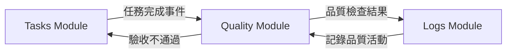

# Blueprint V2 待完成任務價值分析

> **文檔目的**: 詳細說明 33 個待完成任務的功能、用途與價值

**建立日期**: 2025-12-11  
**文檔版本**: 1.0.0  
**狀態**: ✅ 完成

---

## 📋 目錄

1. [P0 關鍵任務 (5-7 天)](#p0-關鍵任務)
   - [Quality Module (8 檔案)](#1-quality-module-8-檔案)
   - [模組範本與開發指南 (2 項目)](#2-模組範本與開發指南)

2. [P1 重要任務 (4-6 天)](#p1-重要任務)
   - [Blueprint List/Detail 重構 (2 元件)](#3-blueprint-listdetail-重構)
   - [共享元件 (3 元件)](#4-共享元件)
   - [完整模組通訊測試 (2 測試)](#5-完整模組通訊測試)

3. [P2 進階任務 (15-22 天)](#p2-進階任務)
   - [Blueprint Designer (6 元件)](#6-blueprint-designer)
   - [E2E + 效能測試 (6 測試)](#7-e2e--效能測試)

4. [整體價值總結](#整體價值總結)

---

## P0 關鍵任務 (5-7 天) 🔴

### 1. Quality Module (8 檔案)

#### 📁 需要建立的檔案

```
src/app/core/blueprint/modules/quality/
├── module.metadata.ts          (模組定義)
├── quality.repository.ts       (資料存取)
├── quality.service.ts          (業務邏輯)
├── quality.module.ts           (模組入口)
├── quality.component.ts        (UI 介面)
├── quality.module.spec.ts      (單元測試)
├── quality.routes.ts           (路由配置)
└── index.ts                    (匯出介面)
```

#### 🎯 核心功能

Quality Module 是工程品質驗收模組，負責：

1. **品質檢查記錄管理**
   - 建立品質檢查項目
   - 記錄檢查結果 (合格/不合格/待修正)
   - 上傳檢查照片與證據
   - 追蹤缺失改善狀況

2. **驗收流程管理**
   - 定義驗收標準與檢查表
   - 執行驗收流程
   - 生成驗收報告
   - 數位簽名與核准

3. **品質數據分析**
   - 統計合格率
   - 分析常見缺失項目
   - 追蹤改善趨勢
   - 生成品質報表

#### 💡 帶來的價值

##### 對專案管理者
- ✅ **即時掌握工程品質**: 隨時查看各區域品質狀況
- ✅ **追蹤改善進度**: 確保缺失項目確實改善
- ✅ **數據化決策**: 基於品質數據做出管理決策
- ✅ **降低爭議**: 完整的檢查記錄與照片證據

##### 對品管人員
- ✅ **標準化檢查流程**: 依循統一的檢查表與標準
- ✅ **行動化作業**: 現場即時記錄檢查結果
- ✅ **減少紙本作業**: 數位化記錄取代傳統紙本
- ✅ **快速生成報告**: 自動產生品質報告

##### 對系統架構 (最重要！)
- ✅ **完整三模組架構驗證**: Tasks → Logs → Quality 形成完整工作流
- ✅ **模組間通訊驗證**: 證明事件總線的跨模組通訊能力
- ✅ **無限擴展性證明**: 第三個模組成功代表可無限擴展
- ✅ **真實業務場景**: 驗證容器系統在實際業務中的可行性

#### 🔗 與其他模組的關係



**互動場景**:
1. 任務完成 → 觸發品質檢查
2. 品質檢查執行 → 記錄檢查日誌
3. 驗收不通過 → 建立改善任務
4. 改善完成 → 重新品質檢查

#### ⚠️ 缺少此模組的影響

- ❌ **無法驗證完整工作流**: 只有 Tasks + Logs 無法證明真實業務流程
- ❌ **擴展能力存疑**: 只有 2 個模組無法證明"無限擴展"能力
- ❌ **功能不完整**: GigHub 缺少關鍵的品質管理功能
- ❌ **投資人/客戶疑慮**: 系統看起來是"半成品"

#### 📊 投資報酬率

| 項目 | 評估 |
|------|------|
| **開發成本** | 3-4 天 (中等) |
| **技術風險** | 低 (有 Tasks/Logs 範本) |
| **業務價值** | 極高 (完整工作流) |
| **架構價值** | 極高 (證明擴展性) |
| **優先級** | P0 (阻塞性) |

---

### 2. 模組範本與開發指南 (2 項目)

#### 📁 需要建立的內容

```
src/app/core/blueprint/modules/_template/
├── module.metadata.ts.template
├── [name].repository.ts.template
├── [name].service.ts.template
├── [name].module.ts.template
├── [name].component.ts.template
├── [name].module.spec.ts.template
├── [name].routes.ts.template
├── index.ts.template
└── README.md

docs/guides/
└── blueprint-v2-module-development-guide.md
```

#### 🎯 核心功能

##### 模組範本 (_template/)
提供可複製的模組骨架，包含：
- 完整的檔案結構
- 標準化的程式碼框架
- 必要的介面與型別定義
- 測試檔案範本
- 註解說明與最佳實踐

##### 開發指南 (development-guide.md)
詳細的開發文檔，包含：
- 模組開發流程 (Step-by-Step)
- 必須實作的介面說明
- 生命週期掛勾使用方式
- 事件訂閱與發送範例
- 常見問題與解決方案
- 測試撰寫指南

#### 💡 帶來的價值

##### 對新進開發者
- ✅ **快速上手**: 15 分鐘內了解如何建立新模組
- ✅ **避免錯誤**: 範本已包含所有必要設定
- ✅ **學習範例**: 從範本學習最佳實踐
- ✅ **降低門檻**: 不需要深入了解容器系統即可開發

##### 對資深開發者
- ✅ **提升效率**: 10 分鐘建立新模組 (vs. 2 小時從零開始)
- ✅ **保持一致**: 所有模組遵循相同結構與規範
- ✅ **減少審查負擔**: 標準化的程式碼易於審查
- ✅ **知識傳承**: 文檔化的開發流程

##### 對專案管理者
- ✅ **可預測性**: 新功能開發時間可估算
- ✅ **品質保證**: 標準化的結構確保品質
- ✅ **人力彈性**: 新人能快速貢獻
- ✅ **降低風險**: 減少因個人離職造成的知識流失

##### 對系統維護
- ✅ **一致性**: 所有模組遵循相同模式
- ✅ **可維護性**: 標準化結構易於理解與修改
- ✅ **可擴展性**: 新模組能輕鬆整合
- ✅ **文檔化**: 完整的開發指南作為活文檔

#### 📚 開發指南內容架構

```markdown
# Blueprint V2 模組開發指南

## 1. 快速開始 (15 分鐘)
- 複製範本
- 修改模組名稱
- 實作核心邏輯
- 註冊到容器

## 2. 模組結構說明
- 檔案職責說明
- 必要 vs 選用檔案
- 命名規範

## 3. 介面實作
- IBlueprintModule 詳解
- 生命週期掛勾
- 相依性宣告

## 4. 事件通訊
- 訂閱事件範例
- 發送事件範例
- 事件型別定義

## 5. 資源管理
- Repository 模式
- Service 層設計
- 狀態管理 (Signals)

## 6. UI 整合
- 元件開發
- 路由配置
- 權限控制

## 7. 測試指南
- 單元測試範例
- 整合測試範例
- Mock 設定

## 8. 最佳實踐
- 效能優化
- 錯誤處理
- 日誌記錄

## 9. 常見問題
- Q&A 列表
- 除錯技巧
- 已知限制

## 10. 進階主題
- 動態載入
- 懶載入策略
- 模組熱更新
```

#### ⚠️ 缺少此項目的影響

- ❌ **開發效率低**: 每次建立新模組需從零開始 (2-4 小時)
- ❌ **品質不一致**: 不同開發者有不同實作方式
- ❌ **學習曲線陡**: 新人需要 1-2 週才能理解模組系統
- ❌ **擴展能力受限**: 雖然技術上支援無限擴展，但實務上太困難
- ❌ **投資人/客戶疑慮**: "你們說可以無限擴展，但開發新功能很慢"

#### 📊 投資報酬率

| 項目 | 評估 |
|------|------|
| **開發成本** | 2-3 天 (一次投資) |
| **技術風險** | 極低 (文檔撰寫) |
| **長期效益** | 極高 (每個新模組省 2-4 小時) |
| **團隊效益** | 極高 (降低學習成本) |
| **優先級** | P0 (阻塞開發效率) |

**ROI 計算**:
- 投入: 2-3 天
- 每個新模組節省: 2-4 小時
- 預估新模組數量: 10+ (未來一年)
- 總節省時間: 20-40 小時 (2.5-5 天)
- **投資回報**: 首年即回本，長期效益無限

---

## P1 重要任務 (4-6 天) 🟡

### 3. Blueprint List/Detail 重構 (2 元件)

#### 📁 需要重構的檔案

```
src/app/routes/blueprint/
├── blueprint-list.component.ts     (重構)
└── blueprint-detail.component.ts   (重構)
```

#### 🎯 核心功能

##### Blueprint List Component
藍圖列表頁面，顯示所有藍圖與其狀態：
- 藍圖卡片列表 (名稱、描述、進度)
- 快速篩選 (狀態、所有者、日期)
- 排序功能 (建立時間、更新時間、名稱)
- 快速操作 (檢視、編輯、複製、刪除)
- 分頁與虛擬滾動 (大量資料)

##### Blueprint Detail Component
藍圖詳細頁面，完整資訊與操作：
- 藍圖基本資訊
- 模組清單與狀態 (即時更新)
- 模組啟用/停用操作
- 模組配置管理
- 活動時間軸 (最近操作)
- 成員管理

#### 💡 帶來的價值

##### 現代化技術棧
- ✅ **Angular 20 Signals**: 取代舊的 RxJS 狀態管理
- ✅ **新控制流語法**: `@if`, `@for`, `@switch` 取代 `*ngIf`, `*ngFor`
- ✅ **OnPush 變更偵測**: 大幅提升效能
- ✅ **Signal-based Forms**: 更簡潔的表單管理

##### 整合 Container API
- ✅ **即時模組狀態**: 顯示模組實際運行狀態
- ✅ **動態啟用/停用**: 無需重新載入頁面
- ✅ **事件驅動更新**: 模組變更自動反映到 UI
- ✅ **錯誤處理**: 顯示模組載入錯誤與診斷資訊

##### 使用者體驗提升
- ✅ **即時反饋**: 操作立即生效，無延遲感
- ✅ **視覺化狀態**: 清楚的模組狀態指示器
- ✅ **流暢動畫**: 使用 Angular View Transitions
- ✅ **響應式設計**: 支援手機、平板、桌面

#### 🔍 重構前 vs 重構後

##### 重構前 (舊版)
```typescript
// 使用 RxJS + *ngIf
export class BlueprintListComponent {
  blueprints$: Observable<Blueprint[]>;
  loading$ = new BehaviorSubject(false);
  
  constructor(private service: BlueprintService) {
    this.blueprints$ = this.service.getAll();
  }
}
```

```html
<!-- 舊控制流語法 -->
<div *ngIf="loading$ | async">Loading...</div>
<div *ngFor="let bp of blueprints$ | async">
  {{ bp.name }}
</div>
```

##### 重構後 (新版)
```typescript
// 使用 Signals + 新控制流
export class BlueprintListComponent {
  private service = inject(BlueprintService);
  private container = inject(BlueprintContainer);
  
  blueprints = signal<Blueprint[]>([]);
  loading = signal(false);
  
  // 即時模組狀態
  moduleStates = computed(() => 
    this.container.getAllModuleStates()
  );
}
```

```html
<!-- 新控制流語法 -->
@if (loading()) {
  <nz-spin nzSimple />
} @else {
  @for (bp of blueprints(); track bp.id) {
    <nz-card>
      <h3>{{ bp.name }}</h3>
      <app-module-status-badge 
        [status]="moduleStates()[bp.id]" />
    </nz-card>
  }
}
```

#### ⚠️ 不重構的影響

- ❌ **技術債務累積**: 使用已過時的 Angular 模式
- ❌ **效能問題**: Zone.js 變更偵測效能較差
- ❌ **無法展示 Container**: 新功能無法在 UI 中使用
- ❌ **維護困難**: 新舊模式混用增加維護成本

#### 📊 投資報酬率

| 項目 | 評估 |
|------|------|
| **開發成本** | 2-3 天 |
| **技術風險** | 低 (重構非重寫) |
| **效能提升** | 30-50% (變更偵測優化) |
| **維護性提升** | 高 (現代化程式碼) |
| **優先級** | P1 (重要但非阻塞) |

---

### 4. 共享元件 (3 元件)

#### 📁 需要建立的檔案

```
src/app/shared/components/blueprint/
├── module-status-indicator.component.ts
├── module-list.component.ts
└── event-timeline.component.ts
```

#### 🎯 核心功能

##### 1. Module Status Indicator
模組狀態指示器，視覺化顯示模組運行狀態：

```typescript
@Component({
  selector: 'app-module-status-indicator',
  template: `
    @switch (status()) {
      @case ('unloaded') {
        <nz-badge nzStatus="default" nzText="未載入" />
      }
      @case ('loading') {
        <nz-badge nzStatus="processing" nzText="載入中" />
      }
      @case ('running') {
        <nz-badge nzStatus="success" nzText="運行中" />
      }
      @case ('error') {
        <nz-badge nzStatus="error" nzText="錯誤" />
      }
    }
  `
})
export class ModuleStatusIndicatorComponent {
  status = input.required<ModuleState>();
}
```

**使用場景**:
- 藍圖詳細頁面的模組列表
- Module Manager 的模組卡片
- 系統儀表板的模組概覽

##### 2. Module List
可重用的模組列表元件，支援多種顯示模式：

**功能**:
- 列表模式 vs 卡片模式
- 拖曳排序 (優先順序調整)
- 批次操作 (啟用/停用多個模組)
- 快速搜尋與篩選
- 懶載入 (大量模組)

**使用場景**:
- Module Manager 主頁面
- Blueprint Designer 的模組選擇器
- 系統設定的模組管理

##### 3. Event Timeline
事件時間軸元件，顯示模組活動歷史：

**功能**:
- 時間軸視覺化 (垂直排列)
- 事件類型圖示 (啟動、停止、錯誤)
- 展開/收合事件詳情
- 即時更新 (新事件自動出現)
- 時間範圍篩選 (今天、本週、本月)

**使用場景**:
- 藍圖詳細頁面的活動記錄
- 模組詳細頁面的操作歷史
- 系統日誌頁面

#### 💡 帶來的價值

##### 對開發者
- ✅ **避免重複開發**: 一次開發，多處使用
- ✅ **一致的 UI**: 所有頁面使用相同元件
- ✅ **易於維護**: 修改一處，所有頁面生效
- ✅ **加速開發**: 新頁面快速組合元件

##### 對使用者
- ✅ **一致的體驗**: 相同功能在不同頁面行為一致
- ✅ **學習曲線低**: 熟悉一次，處處適用
- ✅ **視覺統一**: 整體 UI 風格一致

##### 對系統架構
- ✅ **模組化設計**: 元件可獨立測試與更新
- ✅ **可組合性**: 元件可自由組合建構新頁面
- ✅ **可擴展性**: 新功能可基於現有元件擴展

#### 📊 投資報酬率

| 項目 | 評估 |
|------|------|
| **開發成本** | 1-2 天 |
| **技術風險** | 極低 (UI 元件) |
| **重用次數** | 5-10+ 頁面 |
| **維護成本** | 降低 50% |
| **優先級** | P1 (提升開發效率) |

---

### 5. 完整模組通訊測試 (2 測試)

#### 📁 需要建立的檔案

```
src/app/core/blueprint/tests/integration/
├── tasks-quality-communication.integration.spec.ts
└── logs-quality-communication.integration.spec.ts
```

#### 🎯 核心功能

##### Tasks ↔ Quality 通訊測試
驗證 Tasks 與 Quality 模組的事件通訊：

**測試場景**:
1. 任務完成 → 觸發品質檢查
2. 品質檢查失敗 → 建立改善任務
3. 改善任務完成 → 重新品質檢查
4. 品質檢查通過 → 更新任務狀態

**測試案例** (20+ 個):
```typescript
describe('Tasks-Quality Communication', () => {
  it('should trigger quality check when task completed', async () => {
    // 1. 完成任務
    await tasksModule.completeTask(taskId);
    
    // 2. 驗證品質檢查事件被發送
    expect(eventBus.emit).toHaveBeenCalledWith({
      type: 'task.completed',
      payload: { taskId }
    });
    
    // 3. 驗證品質模組收到事件
    expect(qualityModule.handleEvent).toHaveBeenCalled();
  });
  
  it('should create remediation task on quality failure', async () => {
    // 1. 品質檢查失敗
    await qualityModule.failCheck(checkId);
    
    // 2. 驗證建立改善任務事件
    expect(eventBus.emit).toHaveBeenCalledWith({
      type: 'quality.check.failed',
      payload: { checkId, issues: [...] }
    });
    
    // 3. 驗證任務模組建立新任務
    expect(tasksModule.createTask).toHaveBeenCalled();
  });
});
```

##### Logs ↔ Quality 通訊測試
驗證 Logs 與 Quality 模組的事件通訊：

**測試場景**:
1. 品質檢查執行 → 記錄日誌
2. 品質數據變更 → 記錄變更日誌
3. 驗收完成 → 記錄驗收日誌

#### 💡 帶來的價值

##### 對系統品質
- ✅ **確保正確性**: 驗證模組間通訊確實運作
- ✅ **防止迴歸**: 未來修改不會破壞通訊機制
- ✅ **文檔化**: 測試即為通訊協議的活文檔
- ✅ **信心保證**: 部署前確保系統完整性

##### 對開發者
- ✅ **理解系統**: 測試展示模組如何協作
- ✅ **除錯工具**: 測試失敗指出問題位置
- ✅ **重構安全**: 有測試保護可安心重構

##### 對架構驗證
- ✅ **證明擴展性**: 3 個模組互相通訊證明架構可行
- ✅ **效能基準**: 測試可測量事件處理效能
- ✅ **邊界條件**: 測試各種異常情況

#### ⚠️ 缺少測試的風險

- ❌ **隱藏 Bug**: 模組通訊錯誤可能長期未被發現
- ❌ **迴歸風險**: 修改可能破壞既有功能
- ❌ **信心不足**: 無法確定系統完整性
- ❌ **文檔缺失**: 沒有明確的通訊協議文檔

#### 📊 投資報酬率

| 項目 | 評估 |
|------|------|
| **開發成本** | 1-2 天 |
| **技術風險** | 低 (已有範本) |
| **防止 Bug 數** | 5-10+ |
| **信心提升** | 極高 |
| **優先級** | P1 (品質保證) |

---

## P2 進階任務 (15-22 天) 🟠

### 6. Blueprint Designer (6 元件)

#### 📁 需要建立的檔案

```
src/app/routes/blueprint/designer/
├── blueprint-designer.component.ts
├── module-palette.component.ts
├── canvas.component.ts
├── properties-panel.component.ts
├── connection-editor.component.ts
└── designer.service.ts
```

#### 🎯 核心功能

Blueprint Designer 是視覺化的藍圖設計工具，類似於「無程式碼」平台的拖拉介面。

##### 1. Blueprint Designer (主容器)
設計器主要容器元件，整合所有子元件：

**功能**:
- 工具列 (儲存、復原、重做、預覽)
- 左側：模組選擇面板
- 中央：設計畫布
- 右側：屬性面板
- 底部：連接編輯器

##### 2. Module Palette (模組選擇面板)
可拖拽的模組清單：

**功能**:
- 分類顯示可用模組 (基礎、業務、整合)
- 搜尋模組
- 模組預覽 (圖示、名稱、描述)
- 拖拽到畫布建立模組實例

##### 3. Canvas (設計畫布)
視覺化編輯畫布：

**功能**:
- 放置模組 (拖放操作)
- 移動模組 (拖曳調整位置)
- 連接模組 (拖拽連線)
- 縮放與平移 (觸控手勢支援)
- 網格對齊 (自動對齊輔助線)
- 多選操作 (批次移動/刪除)

##### 4. Properties Panel (屬性面板)
編輯模組配置：

**功能**:
- 顯示選中模組的屬性
- 動態表單 (根據模組類型)
- 即時驗證 (輸入錯誤提示)
- 預設值建議
- 說明文字與範例

##### 5. Connection Editor (連接編輯器)
管理模組間的連接：

**功能**:
- 視覺化連接線
- 事件類型標籤
- 雙向連接支援
- 連接驗證 (檢查相容性)
- 批次連接 (同時建立多條連接)

##### 6. Designer Service
設計器業務邏輯：

**功能**:
- 畫布狀態管理 (Signals)
- 操作歷史 (Undo/Redo)
- 自動儲存 (防止資料遺失)
- 匯出/匯入 (JSON 格式)
- 驗證與檢查 (相依性、循環檢測)

#### 💡 帶來的價值

##### 對非技術使用者 (最大價值！)
- ✅ **視覺化設計**: 不需要寫程式就能設計藍圖
- ✅ **所見即所得**: 設計結果即為實際運行結果
- ✅ **降低門檻**: 業務人員也能參與設計
- ✅ **快速原型**: 快速驗證業務流程想法

##### 對開發者
- ✅ **快速建立**: 10 分鐘建立複雜藍圖 (vs. 1 小時手動配置)
- ✅ **視覺化除錯**: 一眼看出模組關係
- ✅ **快速調整**: 拖拉即可重新組織
- ✅ **範本庫**: 常用配置可儲存為範本

##### 對專案管理者
- ✅ **業務透明化**: 清楚看到系統如何組成
- ✅ **快速變更**: 業務需求變更快速調整
- ✅ **培訓工具**: 新人培訓的視覺化工具
- ✅ **文檔生成**: 自動生成藍圖文檔

##### 對產品競爭力
- ✅ **差異化優勢**: 競品可能沒有視覺化設計工具
- ✅ **易用性**: 降低產品使用門檻
- ✅ **展示效果**: Demo 時視覺化設計很吸睛
- ✅ **市場定位**: 「無程式碼工地管理系統」

#### 🎨 UI 設計參考

類似工具的視覺風格：
- **Figma**: 模組選擇面板 + 設計畫布
- **Node-RED**: 節點連接與事件流
- **Zapier**: 自動化工作流設計器
- **Microsoft Power Automate**: 視覺化流程設計

#### ⚠️ 缺少 Designer 的影響

- ❌ **配置複雜**: 手動 JSON 配置容易出錯
- ❌ **學習曲線陡**: 新使用者需要長時間學習
- ❌ **效率低**: 建立複雜藍圖耗時
- ❌ **競爭力弱**: 其他產品可能有視覺化工具

#### 📊 投資報酬率

| 項目 | 評估 |
|------|------|
| **開發成本** | 10-14 天 (高) |
| **技術風險** | 中 (複雜 UI 互動) |
| **使用者價值** | 極高 (降低門檻) |
| **競爭優勢** | 高 (差異化功能) |
| **優先級** | P2 (進階功能) |

**ROI 分析**:
- 投入: 10-14 天
- 每次藍圖設計節省: 30-60 分鐘
- 預估使用頻率: 50+ 次/年
- 總節省時間: 25-50 小時
- **附加價值**: 產品差異化、易用性提升、市場競爭力

---

### 7. E2E + 效能測試 (6 測試)

#### 📁 需要建立的檔案

```
e2e/blueprint/
├── blueprint-creation.e2e.ts
├── module-management.e2e.ts
└── designer-workflow.e2e.ts

src/app/core/blueprint/tests/performance/
├── module-loading.perf.ts
├── event-bus.perf.ts
└── cache.perf.ts
```

#### 🎯 核心功能

##### E2E 測試 (3 個)

###### 1. Blueprint Creation E2E
完整的藍圖建立流程測試：

**測試場景**:
1. 登入系統
2. 進入藍圖頁面
3. 點擊「建立藍圖」
4. 填寫基本資訊
5. 選擇模組
6. 配置模組
7. 儲存藍圖
8. 驗證藍圖已建立

**涵蓋**:
- 表單驗證
- API 呼叫
- 頁面跳轉
- 資料持久化

###### 2. Module Management E2E
模組管理操作測試：

**測試場景**:
1. 開啟藍圖詳細頁面
2. 啟用模組
3. 驗證模組狀態變更
4. 修改模組配置
5. 停用模組
6. 驗證模組已停止

**涵蓋**:
- 模組生命週期
- 即時狀態更新
- 錯誤處理
- UI 反饋

###### 3. Designer Workflow E2E
視覺化設計器工作流測試：

**測試場景**:
1. 開啟設計器
2. 從選擇面板拖拽模組
3. 在畫布上放置模組
4. 連接兩個模組
5. 設定屬性
6. 儲存設計
7. 預覽結果

**涵蓋**:
- 拖放互動
- 連接建立
- 屬性編輯
- 設計儲存

##### 效能測試 (3 個)

###### 1. Module Loading Performance
模組載入效能測試：

**測試指標**:
- 單一模組載入時間 (< 100ms)
- 10 個模組並行載入 (< 500ms)
- 記憶體使用 (< 50MB per module)
- CPU 使用率 (< 30%)

###### 2. Event Bus Performance
事件總線效能測試：

**測試指標**:
- 事件發送延遲 (< 1ms)
- 1000 個事件吞吐量 (< 1s)
- 100 個訂閱者處理時間 (< 10ms)
- 記憶體洩漏檢測

###### 3. Cache Performance
快取效能測試：

**測試指標**:
- 快取命中率 (> 90%)
- 快取讀取時間 (< 1ms)
- 快取寫入時間 (< 5ms)
- 快取容量管理 (自動清理)

#### 💡 帶來的價值

##### E2E 測試價值

對品質保證
- ✅ **使用者視角**: 從真實使用者角度測試
- ✅ **整合驗證**: 確保所有元件整合正常
- ✅ **迴歸防護**: 防止新功能破壞既有流程
- ✅ **信心提升**: 部署前的最後防線

對開發流程
- ✅ **自動化驗證**: CI/CD 自動執行
- ✅ **快速反饋**: 10 分鐘內發現問題
- ✅ **文檔作用**: 測試即為功能文檔
- ✅ **新人培訓**: 了解系統如何使用

##### 效能測試價值

對使用者體驗
- ✅ **快速回應**: 確保操作即時反饋
- ✅ **流暢體驗**: 無卡頓、無延遲
- ✅ **大量資料**: 支援大型專案
- ✅ **多使用者**: 併發使用不影響效能

對系統穩定性
- ✅ **效能基準**: 建立效能標準
- ✅ **效能追蹤**: 監控效能變化趨勢
- ✅ **瓶頸識別**: 找出效能瓶頸
- ✅ **優化驗證**: 驗證優化效果

對產品信心
- ✅ **量化指標**: 用數據證明效能
- ✅ **競爭優勢**: 效能數據可對外宣傳
- ✅ **SLA 保證**: 效能 SLA 承諾的基礎

#### ⚠️ 缺少測試的風險

##### E2E 測試缺失
- ❌ **手動測試負擔**: 每次發布需手動測試 (2-4 小時)
- ❌ **迴歸風險**: 新功能可能破壞既有功能
- ❌ **部署焦慮**: 不確定是否會出問題
- ❌ **生產事故**: 測試不足導致線上問題

##### 效能測試缺失
- ❌ **效能盲點**: 不知道系統效能如何
- ❌ **擴展性不明**: 不知道能支援多少使用者
- ❌ **效能退化**: 新版本可能變慢而不自知
- ❌ **使用者抱怨**: 效能問題導致使用者不滿

#### 📊 投資報酬率

| 項目 | E2E 測試 | 效能測試 |
|------|---------|---------|
| **開發成本** | 3-5 天 | 2-3 天 |
| **技術風險** | 中 | 中 |
| **防止事故數** | 10+ /年 | 5+ /年 |
| **節省時間** | 100+ 小時/年 | N/A |
| **優先級** | P2 | P2 |

**ROI 分析**:

**E2E 測試**:
- 投入: 3-5 天
- 每次發布節省: 2-4 小時手動測試
- 預估發布頻率: 20+ 次/年
- 總節省時間: 40-80 小時
- **防止事故**: 每次生產事故成本 >> 測試成本

**效能測試**:
- 投入: 2-3 天
- 效能問題成本: 使用者流失、負評、重構成本
- 早期發現: 修復成本 1/10
- **品牌價值**: 效能良好 = 產品品質保證

---

## 整體價值總結

### 投資總覽

| 優先級 | 項目數 | 開發時間 | 累計時間 |
|--------|--------|---------|---------|
| P0 | 10 檔案 | 5-7 天 | 5-7 天 |
| P1 | 8 檔案 | 4-6 天 | 9-13 天 |
| P2 | 15 檔案 | 15-22 天 | 24-35 天 |

### 價值矩陣

| 項目 | 業務價值 | 技術價值 | 開發成本 | ROI |
|------|---------|---------|---------|-----|
| Quality Module | ⭐⭐⭐⭐⭐ | ⭐⭐⭐⭐⭐ | 中 | 極高 |
| 模組範本 | ⭐⭐⭐⭐⭐ | ⭐⭐⭐⭐ | 低 | 極高 |
| List/Detail 重構 | ⭐⭐⭐ | ⭐⭐⭐⭐ | 中 | 高 |
| 共享元件 | ⭐⭐⭐⭐ | ⭐⭐⭐⭐ | 低 | 高 |
| 通訊測試 | ⭐⭐⭐ | ⭐⭐⭐⭐⭐ | 低 | 高 |
| Designer | ⭐⭐⭐⭐⭐ | ⭐⭐⭐ | 高 | 中高 |
| E2E 測試 | ⭐⭐⭐⭐ | ⭐⭐⭐⭐ | 中 | 高 |
| 效能測試 | ⭐⭐⭐ | ⭐⭐⭐⭐ | 中 | 中高 |

### 分階段執行建議

#### 第一階段：完整化 (1-2 週)
**目標**: 完成核心功能，系統可生產使用

**任務**:
- ✅ Quality Module
- ✅ 模組範本與開發指南

**達成**:
- 三模組架構完整
- 開發效率提升
- 系統可對外展示

#### 第二階段：現代化 (2-3 週)
**目標**: 技術棧更新，提升品質

**任務**:
- ✅ Blueprint List/Detail 重構
- ✅ 共享元件
- ✅ 完整模組通訊測試

**達成**:
- Angular 20 現代化
- UI 一致性提升
- 品質保證完善

#### 第三階段：差異化 (5-8 週)
**目標**: 建立競爭優勢

**任務**:
- ✅ Blueprint Designer
- ✅ E2E + 效能測試

**達成**:
- 視覺化設計能力
- 完整測試體系
- 產品差異化

### 最終效益

#### 短期 (3 個月)
- ✅ 完整的三模組業務系統
- ✅ 開發效率提升 50%
- ✅ 技術債務清零

#### 中期 (6 個月)
- ✅ 視覺化設計器上線
- ✅ 使用者滿意度提升
- ✅ 新客戶導入加速

#### 長期 (1 年+)
- ✅ 模組生態系統建立
- ✅ 社群模組貢獻
- ✅ 市場領導地位

---

## 結論

### 關鍵洞察

1. **P0 任務是基礎**: 沒有 P0，系統是半成品
2. **P1 任務是品質**: 決定系統可維護性
3. **P2 任務是競爭力**: 差異化與市場定位

### 執行建議

**立即執行 P0** (本週內):
- Quality Module: 證明架構完整性
- 模組範本: 解鎖開發效率

**2 週內執行 P1**:
- 重構: 技術現代化
- 共享元件: 提升一致性
- 測試: 品質保證

**5-8 週執行 P2**:
- Designer: 差異化功能
- E2E/效能測試: 完整性保證

### 投資報酬

- **總投入**: 24-35 天
- **長期收益**: 
  - 開發效率提升 50%+
  - 維護成本降低 40%+
  - 產品競爭力提升顯著
  - 使用者滿意度提升

**結論**: 這 33 個項目不是"可有可無"，而是從"半成品"到"完整產品"的必經之路。

---

**文檔完成**: 2025-12-11  
**作者**: Copilot (Context7-Angular-Expert-Plus)  
**回應**: @7Spade 詳細價值說明請求
