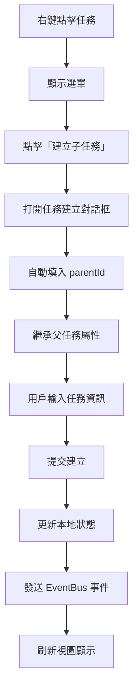
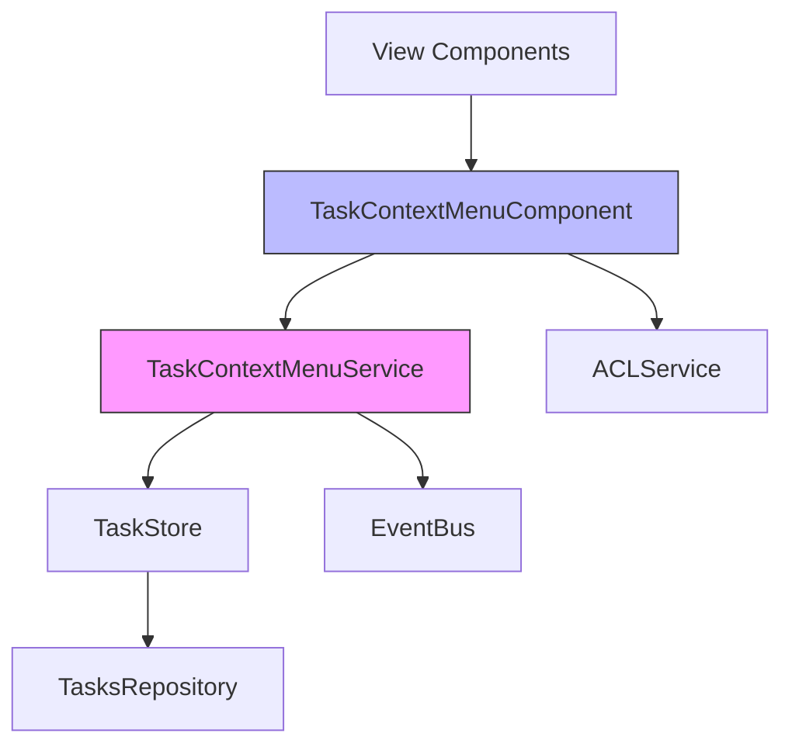

# 📋 任務模組右鍵選單功能實現規劃

> **基於**: ⭐.md 開發流程  
> **需求提出**: @7Spade  
> **規劃日期**: 2025-12-14  
> **狀態**: 討論中 🟡

---

## 📝 原始需求

> 基於⭐.md流程討論如何實現任務模組右鍵功能包括下列投影也具備：
> - 樹狀視圖
> - 看板視圖
> - 時間線視圖
> - 甘特圖視圖
> 
> 右鍵內容包括基礎操作與建立子任務

---

## 🎯 任務定義

### 名稱
**任務模組統一右鍵選單系統 (Task Context Menu System)**

### 背景 / 目的

為任務模組的四種視圖（樹狀、看板、時間線、甘特圖）實現統一的右鍵選單功能，提升用戶操作效率和體驗：

1. **統一體驗**: 不同視圖提供一致的右鍵選單操作
2. **快速操作**: 減少點擊次數，提供快捷方式
3. **層級管理**: 支援建立子任務，完善階層結構
4. **進階功能**: 提供批量操作、複製、移動等進階選項

### 需求說明

#### 核心需求
1. **基礎操作選單**
   - 編輯任務
   - 刪除任務
   - 查看詳情
   - 更新狀態（快速切換）
   - 分配負責人

2. **建立子任務**
   - 右鍵任何任務可建立其子任務
   - 自動設定 parentId 關聯
   - 繼承父任務的部分屬性（如藍圖 ID、標籤等）

3. **視圖特定操作**
   - 樹狀視圖: 展開/收合子任務
   - 看板視圖: 移動到其他列
   - 時間線視圖: 調整時間軸
   - 甘特圖視圖: 設定依賴關係

4. **進階操作**
   - 複製任務
   - 移動到其他藍圖（可選）
   - 批量操作（選中多個任務）

### In Scope / Out of Scope

#### ✅ In Scope
- 四種視圖的右鍵選單實現
- 基礎 CRUD 操作選單項
- 建立子任務功能
- 統一的選單元件設計
- 權限檢查整合
- EventBus 事件發送

#### ❌ Out of Scope
- 鍵盤快捷鍵（如 Ctrl+C 複製）- 可後續實現
- 拖拽操作（看板視圖已有）
- 批量編輯對話框（複雜 UI，後續實現）
- 自訂選單項（用戶配置，未來功能）

### 功能行為

#### 1. 觸發方式
```typescript
// 滑鼠右鍵點擊任務項目
(contextmenu)="onContextMenu($event, task)"

// 阻止瀏覽器預設右鍵選單
$event.preventDefault();
```

#### 2. 選單結構
```
任務操作選單
├─ 📝 編輯任務
├─ 👁️ 查看詳情
├─ ➕ 建立子任務       ← 新增功能
├─ ───────────
├─ 📊 更新狀態 >
│  ├─ 待處理
│  ├─ 進行中
│  ├─ 已完成
│  └─ 已取消
├─ 👤 分配給 >
│  ├─ 成員列表...
├─ ───────────
├─ 📋 複製任務         ← 新增功能
├─ 📦 移動到...        ← 可選
├─ ───────────
└─ 🗑️ 刪除任務
```

#### 3. 建立子任務流程


#### 4. 權限檢查
```typescript
// 根據用戶角色顯示/隱藏選單項
- 編輯/刪除: 需要 contributor/maintainer 權限
- 分配: 需要 maintainer/admin 權限
- 移動: 需要 admin 權限
```

### 資料 / API

#### 新增 Repository 方法
```typescript
// tasks.repository.ts

/**
 * Create child task under parent
 * 建立子任務
 */
async createChildTask(
  blueprintId: string,
  parentId: string,
  data: CreateTaskRequest
): Promise<Task> {
  // 自動設定 parentId
  const childData = {
    ...data,
    parentId
  };
  return this.create(blueprintId, childData);
}

/**
 * Get all children of a task
 * 獲取任務的所有子任務
 */
async getChildren(
  blueprintId: string,
  parentId: string
): Promise<Task[]> {
  const tasks = await firstValueFrom(
    this.findByBlueprintId(blueprintId)
  );
  return tasks.filter(task => task.parentId === parentId);
}

/**
 * Clone task (without children)
 * 複製任務（不包含子任務）
 */
async cloneTask(
  blueprintId: string,
  sourceTaskId: string,
  options?: {
    resetDates?: boolean;
    resetAssignee?: boolean;
  }
): Promise<Task> {
  const source = await firstValueFrom(
    this.findById(blueprintId, sourceTaskId)
  );
  
  if (!source) throw new Error('Source task not found');
  
  const cloneData: CreateTaskRequest = {
    title: `${source.title} (副本)`,
    description: source.description,
    priority: source.priority,
    estimatedHours: source.estimatedHours,
    estimatedBudget: source.estimatedBudget,
    tags: source.tags || [],
    creatorId: source.creatorId, // Will be replaced by current user
    // Reset optional fields
    assigneeId: options?.resetAssignee ? undefined : source.assigneeId,
    assigneeName: options?.resetAssignee ? undefined : source.assigneeName,
    dueDate: options?.resetDates ? undefined : source.dueDate,
    startDate: options?.resetDates ? undefined : source.startDate,
  };
  
  return this.create(blueprintId, cloneData);
}
```

#### 新增 Store 方法
```typescript
// task.store.ts

/**
 * Create child task
 * 建立子任務
 */
async createChildTask(
  blueprintId: string,
  parentId: string,
  data: CreateTaskRequest,
  actorId: string
): Promise<Task> {
  try {
    const childTask = await this.repository.createChildTask(
      blueprintId,
      parentId,
      data
    );
    
    // Update local state
    this._tasks.update(tasks => [childTask, ...tasks]);
    
    // Emit event
    this.eventBus.emit(
      TASKS_MODULE_EVENTS.TASK_CREATED,
      {
        taskId: childTask.id,
        blueprintId,
        parentId,
        task: childTask
      },
      'tasks-module'
    );
    
    // Audit log
    await this.logAuditEvent(blueprintId, {
      blueprintId,
      eventType: AuditEventType.TASK_CREATED,
      category: AuditCategory.DATA,
      severity: AuditSeverity.INFO,
      actorId,
      actorType: ActorType.USER,
      resourceType: 'task',
      resourceId: childTask.id!,
      action: '建立子任務',
      message: `子任務已建立: ${childTask.title} (父任務: ${parentId})`,
      status: AuditStatus.SUCCESS,
      metadata: { parentId }
    });
    
    return childTask;
  } catch (err) {
    this.logger.error('[TaskStore]', 'Failed to create child task', err as Error);
    throw err;
  }
}

/**
 * Clone task
 * 複製任務
 */
async cloneTask(
  blueprintId: string,
  sourceTaskId: string,
  actorId: string,
  options?: {
    resetDates?: boolean;
    resetAssignee?: boolean;
  }
): Promise<Task> {
  try {
    const clonedTask = await this.repository.cloneTask(
      blueprintId,
      sourceTaskId,
      options
    );
    
    // Update local state
    this._tasks.update(tasks => [clonedTask, ...tasks]);
    
    // Emit event
    this.eventBus.emit(
      TASKS_MODULE_EVENTS.TASK_CREATED,
      {
        taskId: clonedTask.id,
        blueprintId,
        clonedFrom: sourceTaskId,
        task: clonedTask
      },
      'tasks-module'
    );
    
    // Audit log
    await this.logAuditEvent(blueprintId, {
      blueprintId,
      eventType: AuditEventType.TASK_CREATED,
      category: AuditCategory.DATA,
      severity: AuditSeverity.INFO,
      actorId,
      actorType: ActorType.USER,
      resourceType: 'task',
      resourceId: clonedTask.id!,
      action: '複製任務',
      message: `任務已複製: ${clonedTask.title} (來源: ${sourceTaskId})`,
      status: AuditStatus.SUCCESS,
      metadata: { sourceTaskId }
    });
    
    return clonedTask;
  } catch (err) {
    this.logger.error('[TaskStore]', 'Failed to clone task', err as Error);
    throw err;
  }
}
```

#### 選單配置資料結構
```typescript
// task-context-menu.types.ts

export interface ContextMenuItem {
  key: string;
  label: string;
  icon?: string;
  divider?: boolean;
  disabled?: boolean;
  hidden?: boolean;
  children?: ContextMenuItem[];
  handler?: (task: Task) => void;
  permission?: string; // ACL permission key
}

export interface TaskContextMenuConfig {
  task: Task;
  position: { x: number; y: number };
  allowEdit: boolean;
  allowDelete: boolean;
  allowCreateChild: boolean;
  allowClone: boolean;
  allowMove: boolean;
}
```

### 影響範圍

#### 新增檔案
```
src/app/core/blueprint/modules/implementations/tasks/
├── components/
│   └── task-context-menu/
│       ├── task-context-menu.component.ts      # 選單元件
│       ├── task-context-menu.component.html
│       ├── task-context-menu.component.less
│       └── task-context-menu.types.ts          # 類型定義
├── services/
│   └── task-context-menu.service.ts            # 選單邏輯服務
```

#### 修改檔案
```
src/app/core/blueprint/modules/implementations/tasks/
├── tasks.repository.ts                         # 新增方法
├── views/
│   ├── task-tree-view.component.ts             # 整合選單
│   ├── task-kanban-view.component.ts           # 整合選單
│   ├── task-timeline-view.component.ts         # 整合選單
│   └── task-gantt-view.component.ts            # 整合選單
└── module.metadata.ts                          # 新增事件定義

src/app/core/state/stores/
└── task.store.ts                                # 新增方法
```

### 驗收條件

#### 功能驗收
- [ ] 所有四種視圖都能正確觸發右鍵選單
- [ ] 選單位置準確（跟隨滑鼠位置）
- [ ] 「建立子任務」功能正常運作
- [ ] 子任務正確設定 parentId
- [ ] 權限檢查生效（根據角色顯示/隱藏選單項）
- [ ] 複製任務功能正常運作
- [ ] 選單項點擊後正確執行對應操作

#### 技術驗收
- [ ] 遵循三層架構（Component → Store → Repository）
- [ ] 使用 Signal 管理選單狀態
- [ ] EventBus 事件正確發送
- [ ] Audit Log 正確記錄
- [ ] 錯誤處理完整
- [ ] 單元測試覆蓋率 >80%

#### UX 驗收
- [ ] 右鍵選單動畫流暢
- [ ] 點擊選單外區域可關閉選單
- [ ] 鍵盤 ESC 可關閉選單
- [ ] 禁用項目顯示灰色且不可點擊
- [ ] 子選單懸停顯示（如「更新狀態」）

---

## 🔍 分析階段

### 步驟 1: 查詢官方文件 (Context7)

#### ng-zorro-antd Dropdown 元件

根據 ng-zorro-antd 文檔，實現右鍵選單的推薦方式：

```typescript
// 使用 nzDropdownMenu 配合 (contextmenu) 事件

// Component
@Component({
  template: `
    <div 
      (contextmenu)="onContextMenu($event, task)"
      [nzDropdownMenu]="menu"
      nzTrigger="contextmenu"
    >
      {{ task.title }}
    </div>
    
    <nz-dropdown-menu #menu="nzDropdownMenu">
      <ul nz-menu>
        <li nz-menu-item (click)="onEdit(task)">編輯</li>
        <li nz-menu-item (click)="onCreateChild(task)">建立子任務</li>
        <li nz-menu-divider></li>
        <li nz-menu-item nzDanger (click)="onDelete(task)">刪除</li>
      </ul>
    </nz-dropdown-menu>
  `
})
```

**關鍵特性**:
- ✅ 支援 `contextmenu` 事件
- ✅ 自動定位（跟隨滑鼠）
- ✅ 支援子選單（submenu）
- ✅ 支援分隔線（divider）
- ✅ 支援禁用狀態
- ✅ 支援圖示顯示

#### Angular 20 Signal 模式

```typescript
// 使用 Signal 管理選單狀態
contextMenuVisible = signal(false);
contextMenuPosition = signal<{ x: number; y: number }>({ x: 0, y: 0 });
selectedTask = signal<Task | null>(null);

// Computed: 根據權限計算可用選單項
availableMenuItems = computed(() => {
  const task = this.selectedTask();
  if (!task) return [];
  
  return this.menuItems.filter(item => 
    !item.hidden && this.checkPermission(item.permission)
  );
});
```

### 步驟 2: 循序思考分析 (Sequential Thinking)

#### 問題拆解

**Q1: 如何在不同視圖中統一選單實現？**

**思考過程**:
1. 觀察: 四種視圖使用不同的元件和佈局
2. 分析: 需要可重用的選單元件
3. 方案: 建立獨立的 `TaskContextMenuComponent`
4. 好處: 
   - 統一 UI/UX
   - 易於維護
   - 邏輯集中

**Q2: 建立子任務時如何自動設定 parentId？**

**思考過程**:
1. 觀察: 右鍵點擊的任務應成為父任務
2. 分析: 需要在選單中記住當前任務
3. 方案: 
   ```typescript
   onCreateChildTask(parentTask: Task) {
     this.openTaskModal({
       mode: 'create',
       parentId: parentTask.id,  // 自動設定
       blueprintId: parentTask.blueprintId
     });
   }
   ```

**Q3: 如何處理權限檢查？**

**思考過程**:
1. 觀察: 不同角色有不同操作權限
2. 分析: 選單項應根據權限動態顯示/禁用
3. 方案: 使用 ACL 服務 + computed signal
   ```typescript
   canEdit = computed(() => 
     this.aclService.can('task:edit') && 
     this.selectedTask()?.creatorId === this.currentUserId()
   );
   ```

**Q4: 看板視圖的拖拽與右鍵如何共存？**

**思考過程**:
1. 觀察: 看板視圖已有拖拽功能
2. 潛在衝突: 右鍵可能干擾拖拽
3. 方案: 
   - 拖拽使用 `(mousedown)` 和 `(mouseup)`
   - 右鍵使用 `(contextmenu)` - 不衝突
   - 右鍵時不觸發拖拽

### 步驟 3: 制定開發計畫 (Software Planning Tool)

#### 技術方案評估

**方案 A: 使用 ng-zorro-antd nz-dropdown** ✅ 推薦
- 優點: 
  - 官方元件，穩定可靠
  - 內建動畫和定位
  - 支援子選單、分隔線
  - 樣式統一
- 缺點:
  - 需要在每個視圖元件中重複整合
  
**方案 B: 自訂右鍵選單元件**
- 優點:
  - 完全客製化
  - 可添加特殊功能
- 缺點:
  - 開發時間長
  - 需要處理定位、動畫、關閉邏輯
  - 樣式可能不一致

**方案 C: 混合方案（推薦）** ✅
- 核心選單: 使用 ng-zorro-antd nz-dropdown
- 封裝服務: `TaskContextMenuService` 統一邏輯
- 共用元件: `TaskContextMenuComponent` 封裝選單 UI

**最終選擇**: 方案 C - 混合方案

#### 依賴關係分析



**關鍵依賴**:
1. `ng-zorro-antd/dropdown` - 選單 UI
2. `@delon/acl` - 權限檢查
3. `TaskStore` - 狀態管理與操作
4. `EventBus` - 事件通知
5. `AuditLogRepository` - 審計日誌

#### 風險識別

| 風險 | 機率 | 影響 | 緩解措施 |
|------|------|------|---------|
| 選單定位不準確 | 中 | 中 | 使用 ng-zorro 內建定位，測試各種場景 |
| 看板拖拽衝突 | 低 | 高 | 分離事件處理，右鍵不觸發拖拽 |
| 權限檢查失效 | 低 | 高 | 單元測試覆蓋所有權限場景 |
| 子任務建立失敗 | 中 | 中 | 完整錯誤處理，回滾本地狀態 |
| 不同視圖行為不一致 | 中 | 中 | 統一封裝，集中測試 |

---

## 📐 規劃階段

### 實施步驟

#### Phase 1: 準備階段（1 天）

**1.1 建立類型定義**
```typescript
// task-context-menu.types.ts
- ContextMenuItem 介面
- TaskContextMenuConfig 介面
- MenuAction 列舉
```

**1.2 更新 module.metadata.ts**
```typescript
// 新增事件定義
TASK_CHILD_CREATED: 'tasks.child_created',
TASK_CLONED: 'tasks.cloned',
```

**1.3 設定測試環境**
- 建立測試用 mock 數據
- 設定 ACL 測試配置

#### Phase 2: Repository & Store 層（2-3 天）

**2.1 擴展 Repository**
```typescript
// tasks.repository.ts
✅ async createChildTask(blueprintId, parentId, data)
✅ async getChildren(blueprintId, parentId)
✅ async cloneTask(blueprintId, sourceTaskId, options)
```

**測試**:
- 單元測試: 子任務建立
- 單元測試: 複製任務
- 整合測試: Firestore 操作

**2.2 擴展 Store**
```typescript
// task.store.ts
✅ async createChildTask(blueprintId, parentId, data, actorId)
✅ async cloneTask(blueprintId, sourceTaskId, actorId, options)
```

**測試**:
- 單元測試: Signal 狀態更新
- 單元測試: EventBus 事件發送
- 單元測試: Audit Log 記錄

#### Phase 3: 選單元件實作（3-4 天）

**3.1 建立服務**
```typescript
// task-context-menu.service.ts
@Injectable({ providedIn: 'root' })
export class TaskContextMenuService {
  // 選單配置
  private menuConfig = signal<TaskContextMenuConfig | null>(null);
  
  // 顯示選單
  showMenu(config: TaskContextMenuConfig): void
  
  // 隱藏選單
  hideMenu(): void
  
  // 處理選單操作
  handleAction(action: MenuAction, task: Task): void
  
  // 檢查權限
  private checkPermission(permission: string): boolean
}
```

**3.2 建立元件**
```typescript
// task-context-menu.component.ts
@Component({
  selector: 'app-task-context-menu',
  standalone: true,
  imports: [SHARED_IMPORTS, NzDropDownModule]
})
export class TaskContextMenuComponent {
  // Signal 狀態
  visible = signal(false);
  position = signal({ x: 0, y: 0 });
  task = signal<Task | null>(null);
  
  // Computed 選單項
  menuItems = computed(() => this.buildMenuItems());
  
  // 權限檢查
  canEdit = computed(() => this.checkEditPermission());
  canDelete = computed(() => this.checkDeletePermission());
  canCreateChild = computed(() => this.checkCreatePermission());
}
```

**3.3 選單 HTML 模板**
```html
<!-- task-context-menu.component.html -->
<nz-dropdown-menu #menu="nzDropdownMenu">
  <ul nz-menu>
    <!-- 編輯 -->
    <li nz-menu-item 
        [nzDisabled]="!canEdit()"
        (click)="onEdit()">
      <span nz-icon nzType="edit"></span>
      編輯任務
    </li>
    
    <!-- 查看詳情 -->
    <li nz-menu-item (click)="onViewDetails()">
      <span nz-icon nzType="eye"></span>
      查看詳情
    </li>
    
    <!-- 建立子任務 -->
    <li nz-menu-item 
        [nzDisabled]="!canCreateChild()"
        (click)="onCreateChild()">
      <span nz-icon nzType="plus-circle"></span>
      建立子任務
    </li>
    
    <li nz-menu-divider></li>
    
    <!-- 更新狀態子選單 -->
    <li nz-submenu nzTitle="更新狀態">
      <ul>
        <li nz-menu-item (click)="onUpdateStatus('pending')">
          待處理
        </li>
        <li nz-menu-item (click)="onUpdateStatus('in_progress')">
          進行中
        </li>
        <li nz-menu-item (click)="onUpdateStatus('completed')">
          已完成
        </li>
        <li nz-menu-item (click)="onUpdateStatus('cancelled')">
          已取消
        </li>
      </ul>
    </li>
    
    <!-- 分配給子選單 -->
    <li nz-submenu nzTitle="分配給">
      <ul>
        @for (member of teamMembers(); track member.id) {
          <li nz-menu-item (click)="onAssign(member)">
            {{ member.name }}
          </li>
        }
      </ul>
    </li>
    
    <li nz-menu-divider></li>
    
    <!-- 複製 -->
    <li nz-menu-item (click)="onClone()">
      <span nz-icon nzType="copy"></span>
      複製任務
    </li>
    
    <li nz-menu-divider></li>
    
    <!-- 刪除 -->
    <li nz-menu-item 
        nzDanger
        [nzDisabled]="!canDelete()"
        (click)="onDelete()">
      <span nz-icon nzType="delete"></span>
      刪除任務
    </li>
  </ul>
</nz-dropdown-menu>
```

**測試**:
- 元件測試: 選單渲染
- 元件測試: 權限控制
- 元件測試: 事件處理

#### Phase 4: 視圖整合（2-3 天）

**4.1 整合到樹狀視圖**
```typescript
// task-tree-view.component.ts
@Component({
  template: `
    <nz-tree-view>
      <nz-tree-node 
        *nzTreeNodeDef="let node"
        (contextmenu)="onContextMenu($event, node.task)">
        <!-- 任務顯示 -->
      </nz-tree-node>
    </nz-tree-view>
    
    <app-task-context-menu
      [task]="selectedTask()"
      [position]="menuPosition()"
      [visible]="menuVisible()"
      (action)="handleMenuAction($event)"
    />
  `
})
export class TaskTreeViewComponent {
  selectedTask = signal<Task | null>(null);
  menuPosition = signal({ x: 0, y: 0 });
  menuVisible = signal(false);
  
  onContextMenu(event: MouseEvent, task: Task): void {
    event.preventDefault();
    this.selectedTask.set(task);
    this.menuPosition.set({ x: event.clientX, y: event.clientY });
    this.menuVisible.set(true);
  }
  
  handleMenuAction(action: MenuAction): void {
    const task = this.selectedTask();
    if (!task) return;
    
    switch (action.type) {
      case 'create-child':
        this.onCreateChildTask(task);
        break;
      case 'edit':
        this.editTask.emit(task);
        break;
      // ... 其他操作
    }
  }
  
  async onCreateChildTask(parentTask: Task): Promise<void> {
    // 打開建立對話框，自動填入 parentId
    this.openTaskModal({
      mode: 'create',
      parentId: parentTask.id,
      blueprintId: this.blueprintId()
    });
  }
}
```

**4.2 整合到看板視圖**
```typescript
// task-kanban-view.component.ts
@Component({
  template: `
    <div class="kanban-board">
      @for (column of columns(); track column.id) {
        <div class="kanban-column">
          @for (task of column.tasks; track task.id) {
            <div 
              class="task-card"
              cdkDrag
              (contextmenu)="onContextMenu($event, task)">
              <!-- 任務卡片內容 -->
            </div>
          }
        </div>
      }
    </div>
    
    <app-task-context-menu
      [task]="selectedTask()"
      [position]="menuPosition()"
      [visible]="menuVisible()"
      (action)="handleMenuAction($event)"
    />
  `
})
```

**4.3 整合到時間線視圖**
- 類似整合方式
- 注意時間軸特定操作

**4.4 整合到甘特圖視圖**
- 類似整合方式
- 注意依賴關係操作

**測試**:
- E2E 測試: 各視圖右鍵功能
- E2E 測試: 建立子任務流程
- E2E 測試: 權限控制

#### Phase 5: 測試與優化（2 天）

**5.1 單元測試**
- Repository 方法測試
- Store 方法測試
- Service 邏輯測試
- Component 渲染測試

**5.2 整合測試**
- 跨層測試（Component → Store → Repository）
- EventBus 事件測試
- Audit Log 記錄測試

**5.3 E2E 測試**
- 用戶操作流程測試
- 權限控制測試
- 錯誤場景測試

**5.4 性能優化**
- 選單渲染優化
- Signal 計算優化
- 事件處理優化

**5.5 UI/UX 改進**
- 選單動畫調整
- 圖示統一
- 提示訊息優化

### 檔案清單

#### 新增檔案

**類型定義**:
- `src/app/core/blueprint/modules/implementations/tasks/types/task-context-menu.types.ts`

**元件**:
- `src/app/core/blueprint/modules/implementations/tasks/components/task-context-menu/task-context-menu.component.ts`
- `src/app/core/blueprint/modules/implementations/tasks/components/task-context-menu/task-context-menu.component.html`
- `src/app/core/blueprint/modules/implementations/tasks/components/task-context-menu/task-context-menu.component.less`

**服務**:
- `src/app/core/blueprint/modules/implementations/tasks/services/task-context-menu.service.ts`

**測試**:
- `src/app/core/blueprint/modules/implementations/tasks/components/task-context-menu/task-context-menu.component.spec.ts`
- `src/app/core/blueprint/modules/implementations/tasks/services/task-context-menu.service.spec.ts`

#### 修改檔案

**Repository**:
- `src/app/core/blueprint/modules/implementations/tasks/tasks.repository.ts`
  - 新增 `createChildTask()` 方法
  - 新增 `getChildren()` 方法
  - 新增 `cloneTask()` 方法

**Store**:
- `src/app/core/state/stores/task.store.ts`
  - 新增 `createChildTask()` 方法
  - 新增 `cloneTask()` 方法

**視圖元件**:
- `src/app/core/blueprint/modules/implementations/tasks/views/task-tree-view.component.ts`
  - 整合右鍵選單
  - 新增選單事件處理
  
- `src/app/core/blueprint/modules/implementations/tasks/views/task-kanban-view.component.ts`
  - 整合右鍵選單
  - 確保與拖拽不衝突
  
- `src/app/core/blueprint/modules/implementations/tasks/views/task-timeline-view.component.ts`
  - 整合右鍵選單
  
- `src/app/core/blueprint/modules/implementations/tasks/views/task-gantt-view.component.ts`
  - 整合右鍵選單

**模組元數據**:
- `src/app/core/blueprint/modules/implementations/tasks/module.metadata.ts`
  - 新增事件定義: `TASK_CHILD_CREATED`, `TASK_CLONED`

---

## 📜 開發規範

### 遵循 ⭐.md 規範

#### ⭐ 使用 Context7
- ✅ 查詢 ng-zorro-antd Dropdown 官方文檔
- ✅ 查詢 Angular Signals 最佳實踐
- ✅ 查詢 @delon/acl 權限控制模式

#### ⭐ 使用 Sequential-thinking
- ✅ 問題拆解: 統一選單 vs 視圖特定
- ✅ 方案評估: 內建元件 vs 自訂元件
- ✅ 風險識別: 拖拽衝突、定位準確性

#### ⭐ 使用 Software-planning-tool
- ✅ 5 階段實施計畫
- ✅ 依賴關係圖
- ✅ 時間估算

#### 基於奧卡姆剃刀定律

1. **KISS (Keep It Simple, Stupid)**
   - 使用 ng-zorro 內建元件，不重複造輪子
   - 選單項目簡潔明瞭

2. **YAGNI（You Aren't Gonna Need It）**
   - 只實現需求中的功能
   - 自訂選單項、鍵盤快捷鍵放入 Out of Scope

3. **單一職責原則（SRP）**
   - TaskContextMenuService: 只負責選單邏輯
   - TaskContextMenuComponent: 只負責選單 UI
   - 操作執行委託給 TaskStore

4. **低耦合、高內聚**
   - 選單元件可獨立測試
   - 視圖元件只需簡單整合

### 🔗 三層架構

```
UI Layer (Component)
  ├─ TaskTreeViewComponent
  ├─ TaskKanbanViewComponent
  ├─ TaskContextMenuComponent
  └─ (contextmenu) 事件 → handleMenuAction()
          ↓
Service Layer (Store + Service)
  ├─ TaskStore.createChildTask()
  ├─ TaskStore.cloneTask()
  └─ TaskContextMenuService (輔助邏輯)
          ↓
Repository Layer
  ├─ TasksRepository.createChildTask()
  ├─ TasksRepository.getChildren()
  └─ TasksRepository.cloneTask()
          ↓
Firestore
```

### ⭐ Blueprint 模組事件通訊

```typescript
// 建立子任務事件
this.eventBus.emit(
  TASKS_MODULE_EVENTS.TASK_CHILD_CREATED,
  {
    taskId: childTask.id,
    parentId: parentTask.id,
    blueprintId
  },
  'tasks-module'
);

// 複製任務事件
this.eventBus.emit(
  TASKS_MODULE_EVENTS.TASK_CLONED,
  {
    taskId: clonedTask.id,
    sourceTaskId: sourceTask.id,
    blueprintId
  },
  'tasks-module'
);
```

---

## ✅ 檢查清單

### 📋 實作檢查點

#### 架構檢查
- [ ] 遵循三層架構（UI → Store → Repository）
- [ ] 使用 Signals 進行狀態管理
- [ ] 使用 Standalone Components
- [ ] 正確使用 inject() 注入依賴

#### 選單功能
- [ ] 右鍵觸發選單（阻止預設行為）
- [ ] 選單位置正確（跟隨滑鼠）
- [ ] 點擊外部區域關閉選單
- [ ] ESC 鍵關閉選單
- [ ] 選單項目根據權限動態顯示

#### 建立子任務
- [ ] 自動設定 parentId
- [ ] 繼承父任務屬性（blueprintId, tags）
- [ ] 打開建立對話框
- [ ] 建立成功後刷新視圖
- [ ] EventBus 事件發送
- [ ] Audit Log 記錄

#### 複製任務
- [ ] 複製所有相關屬性
- [ ] 標題加上「(副本)」
- [ ] 可選重置日期和負責人
- [ ] 複製成功後刷新視圖
- [ ] EventBus 事件發送
- [ ] Audit Log 記錄

#### 權限控制
- [ ] 使用 ACLService 檢查權限
- [ ] 禁用的選單項顯示灰色
- [ ] 隱藏的選單項不顯示
- [ ] 權限不足時顯示提示訊息

#### 錯誤處理
- [ ] Repository 方法包含 try-catch
- [ ] 拋出類型化錯誤
- [ ] UI 顯示錯誤訊息
- [ ] 錯誤記錄到日誌

#### 生命週期
- [ ] 使用 takeUntilDestroyed() 管理訂閱
- [ ] 選單關閉時清理狀態
- [ ] 手動資源清理在 ngOnDestroy

#### 測試
- [ ] 單元測試覆蓋率 > 80%
- [ ] Repository 方法測試
- [ ] Store 方法測試
- [ ] Component 渲染測試
- [ ] E2E 測試涵蓋主要流程

### 💎 程式碼品質

- [ ] TypeScript 嚴格模式無錯誤
- [ ] ESLint 檢查通過
- [ ] 無使用 any 類型
- [ ] 命名清晰且符合規範
- [ ] JSDoc 註解完整

### 🏛️ 架構符合性

- [ ] 遵循 ⭐.md 規範
- [ ] Repository 模式正確實作
- [ ] 事件驅動架構正確使用
- [ ] 上下文傳遞模式正確

### ✨ 功能完整性

- [ ] 所有四種視圖整合完成
- [ ] 基礎操作選單完整
- [ ] 建立子任務功能正常
- [ ] 複製任務功能正常
- [ ] 權限檢查完整

### 📖 文檔完整性

- [ ] README 更新（新增右鍵選單說明）
- [ ] API 文檔完整
- [ ] 使用範例提供
- [ ] 變更日誌記錄

---

## 📊 時間估算

| 階段 | 任務 | 預估時間 |
|------|------|---------|
| **Phase 1** | 準備階段 | 1 天 |
| | - 類型定義 | 2 小時 |
| | - 事件定義 | 1 小時 |
| | - 測試環境設定 | 3 小時 |
| **Phase 2** | Repository & Store | 2-3 天 |
| | - Repository 方法 | 1 天 |
| | - Store 方法 | 1 天 |
| | - 單元測試 | 0.5 天 |
| **Phase 3** | 選單元件實作 | 3-4 天 |
| | - Service 實作 | 1 天 |
| | - Component 實作 | 1.5 天 |
| | - HTML/CSS 調整 | 0.5 天 |
| | - 元件測試 | 1 天 |
| **Phase 4** | 視圖整合 | 2-3 天 |
| | - 樹狀視圖整合 | 0.5 天 |
| | - 看板視圖整合 | 0.5 天 |
| | - 時間線視圖整合 | 0.5 天 |
| | - 甘特圖視圖整合 | 0.5 天 |
| | - E2E 測試 | 1 天 |
| **Phase 5** | 測試與優化 | 2 天 |
| | - 測試補充 | 1 天 |
| | - 性能優化 | 0.5 天 |
| | - UI/UX 改進 | 0.5 天 |
| **總計** | | **10-13 天** |

---

## 🎯 優先級建議

### 🔴 P0 - 核心功能（必須實現）

1. **基礎右鍵選單** (3 天)
   - 編輯任務
   - 刪除任務
   - 查看詳情

2. **建立子任務** (2 天)
   - Repository 方法
   - Store 整合
   - UI 對話框

### 🟡 P1 - 重要功能（應該實現）

3. **更新狀態快捷選單** (1 天)
   - 子選單實現
   - 狀態快速切換

4. **複製任務** (2 天)
   - Repository 方法
   - Store 整合
   - 選項配置

5. **分配負責人** (1 天)
   - 團隊成員查詢
   - 快速分配

### 🟢 P2 - 可選功能（可以實現）

6. **權限控制** (1 天)
   - ACL 整合
   - 動態選單項

7. **視圖特定操作** (2 天)
   - 樹狀: 展開/收合
   - 看板: 移動到其他列
   - 時間線: 調整時間
   - 甘特: 設定依賴

---

## 💡 實施建議

### 分階段實施

#### 第一階段（MVP）: 核心功能（5 天）
```
✅ 基礎右鍵選單（編輯、刪除、查看）
✅ 建立子任務
✅ 樹狀視圖整合
✅ 基本權限檢查
```

**目標**: 快速驗證技術方案，提供基本功能

#### 第二階段: 完善功能（5 天）
```
✅ 更新狀態快捷選單
✅ 複製任務
✅ 分配負責人
✅ 所有視圖整合
✅ 完整權限控制
```

**目標**: 提供完整的右鍵選單體驗

#### 第三階段: 優化與擴展（3 天）
```
✅ 視圖特定操作
✅ 性能優化
✅ UI/UX 改進
✅ 完整測試覆蓋
```

**目標**: 達到生產就緒狀態

### 技術債管理

**可接受的技術債**:
- 第一階段可使用簡化的權限檢查
- 第一階段可只實現樹狀視圖
- 暫時不實現自訂選單項功能

**不可接受的技術債**:
- 跳過錯誤處理
- 跳過 EventBus 事件
- 跳過 Audit Log 記錄
- 破壞三層架構

---

## 🔒 安全考量

### Firestore Security Rules

確保現有規則支援子任務建立：

```javascript
// firestore.rules
match /blueprints/{blueprintId}/tasks/{taskId} {
  allow create: if canEditBlueprint(blueprintId)
    && request.resource.data.creatorId == getCurrentAccountId()
    // 允許設定 parentId（子任務）
    && (
      !request.resource.data.parentId ||
      exists(/databases/$(database)/documents/blueprints/$(blueprintId)/tasks/$(request.resource.data.parentId))
    );
}
```

### 權限驗證

```typescript
// 雙重檢查: 前端 + 後端
// 前端 (UI)
if (!this.aclService.can('task:edit')) {
  // 禁用選單項
}

// 後端 (Firestore Rules)
// 確保規則驗證權限
```

---

## 📚 參考文檔

### 專案文檔
- **⭐.md** - 開發流程與規範
- **TASK_MODULE_COMPLIANCE_AUDIT.md** - 任務模組合規性審計
- **TASK_MODULE_CRUD_ANALYSIS.md** - CRUD 操作分析

### 技術文檔
- **ng-zorro-antd Dropdown** - https://ng.ant.design/components/dropdown
- **Angular Signals** - https://angular.dev/guide/signals
- **@delon/acl** - https://ng-alain.com/acl
- **CDK Drag Drop** - https://material.angular.io/cdk/drag-drop

### 架構文檔
- **docs/architecture/FINAL_PROJECT_STRUCTURE.md** - 專案架構
- **.github/instructions/quick-reference.instructions.md** - 快速參考

---

## 🎓 討論要點

### 待確認問題

1. **複製任務時是否包含子任務？**
   - 選項 A: 僅複製當前任務（推薦）
   - 選項 B: 可選複製整個子樹（複雜度高）

2. **是否實現移動到其他藍圖？**
   - 影響: 需要跨藍圖權限檢查
   - 建議: 第一階段不實現，放入 Phase 3

3. **權限粒度如何設定？**
   - 選項 A: 粗粒度（contributor 可編輯所有）
   - 選項 B: 細粒度（僅建立者可編輯）- 推薦

4. **選單定制化程度？**
   - 選項 A: 固定選單項（推薦）
   - 選項 B: 允許用戶自訂（未來功能）

### 技術選型確認

1. **使用 ng-zorro-antd nz-dropdown？**
   ✅ 推薦 - 官方元件，穩定可靠

2. **選單狀態管理使用 Service 還是 Component？**
   ✅ 推薦 - Service 統一管理，Component 負責 UI

3. **是否需要選單動畫？**
   ✅ 推薦 - 使用 ng-zorro 內建動畫

---

## 📈 成功指標

### 功能指標
- [ ] 所有四種視圖支援右鍵選單
- [ ] 建立子任務成功率 100%
- [ ] 選單響應時間 < 100ms
- [ ] 權限檢查準確率 100%

### 技術指標
- [ ] 單元測試覆蓋率 > 80%
- [ ] E2E 測試覆蓋主要流程
- [ ] 無 TypeScript 錯誤
- [ ] ESLint 檢查通過

### 用戶體驗指標
- [ ] 選單定位準確（0 誤差）
- [ ] 操作流暢（無卡頓）
- [ ] 錯誤提示清晰
- [ ] 符合用戶直覺

---

## 💬 下一步行動

### 立即行動
1. **確認需求細節**
   - 複製任務是否包含子任務？
   - 是否需要移動到其他藍圖？
   - 權限粒度如何設定？

2. **技術驗證**
   - ng-zorro-antd Dropdown POC
   - 看板拖拽與右鍵共存測試
   - Signal 狀態管理驗證

3. **開始實施**
   - Phase 1: 準備階段
   - 建立類型定義
   - 更新 module.metadata.ts

### 長期規劃
- Phase 2-5 依序實施
- 定期回顧與調整
- 收集用戶反饋

---

**規劃完成日期**: 2025-12-14  
**規劃者**: GitHub Copilot  
**狀態**: 等待確認與實施  
**預估總時間**: 10-13 天

---

## 附錄 A: 選單配置範例

```typescript
// 完整選單配置
const TASK_CONTEXT_MENU_CONFIG: ContextMenuItem[] = [
  {
    key: 'edit',
    label: '編輯任務',
    icon: 'edit',
    permission: 'task:edit',
    handler: (task) => this.onEdit(task)
  },
  {
    key: 'view',
    label: '查看詳情',
    icon: 'eye',
    handler: (task) => this.onViewDetails(task)
  },
  {
    key: 'create-child',
    label: '建立子任務',
    icon: 'plus-circle',
    permission: 'task:create',
    handler: (task) => this.onCreateChild(task)
  },
  { key: 'divider-1', divider: true },
  {
    key: 'status',
    label: '更新狀態',
    icon: 'check-circle',
    children: [
      { key: 'status-pending', label: '待處理', handler: (task) => this.onUpdateStatus(task, 'pending') },
      { key: 'status-in-progress', label: '進行中', handler: (task) => this.onUpdateStatus(task, 'in_progress') },
      { key: 'status-completed', label: '已完成', handler: (task) => this.onUpdateStatus(task, 'completed') },
      { key: 'status-cancelled', label: '已取消', handler: (task) => this.onUpdateStatus(task, 'cancelled') }
    ]
  },
  {
    key: 'assign',
    label: '分配給',
    icon: 'user',
    permission: 'task:assign',
    children: [] // 動態載入團隊成員
  },
  { key: 'divider-2', divider: true },
  {
    key: 'clone',
    label: '複製任務',
    icon: 'copy',
    handler: (task) => this.onClone(task)
  },
  { key: 'divider-3', divider: true },
  {
    key: 'delete',
    label: '刪除任務',
    icon: 'delete',
    permission: 'task:delete',
    handler: (task) => this.onDelete(task)
  }
];
```

---

## 附錄 B: 事件定義

```typescript
// module.metadata.ts
export const TASKS_MODULE_EVENTS = {
  // 現有事件
  TASK_LOADED: 'tasks.task_loaded',
  TASK_CREATED: 'tasks.task_created',
  TASK_UPDATED: 'tasks.task_updated',
  TASK_DELETED: 'tasks.task_deleted',
  TASK_ASSIGNED: 'tasks.task_assigned',
  TASK_STATUS_CHANGED: 'tasks.task_status_changed',
  TASK_COMPLETED: 'tasks.task_completed',
  
  // 新增事件
  TASK_CHILD_CREATED: 'tasks.child_created',    // 子任務建立
  TASK_CLONED: 'tasks.cloned',                  // 任務複製
  TASK_CONTEXT_MENU_OPENED: 'tasks.context_menu_opened',  // 右鍵選單開啟
  TASK_CONTEXT_MENU_CLOSED: 'tasks.context_menu_closed'   // 右鍵選單關閉
} as const;
```
