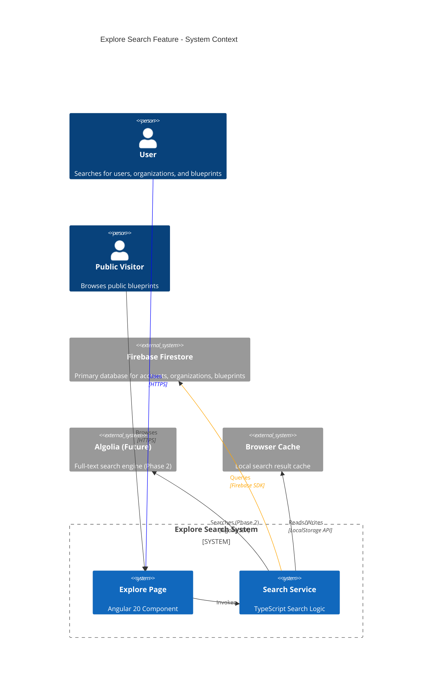
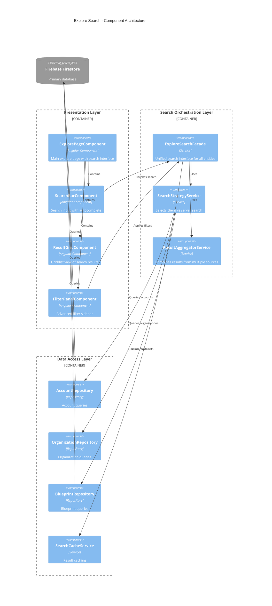
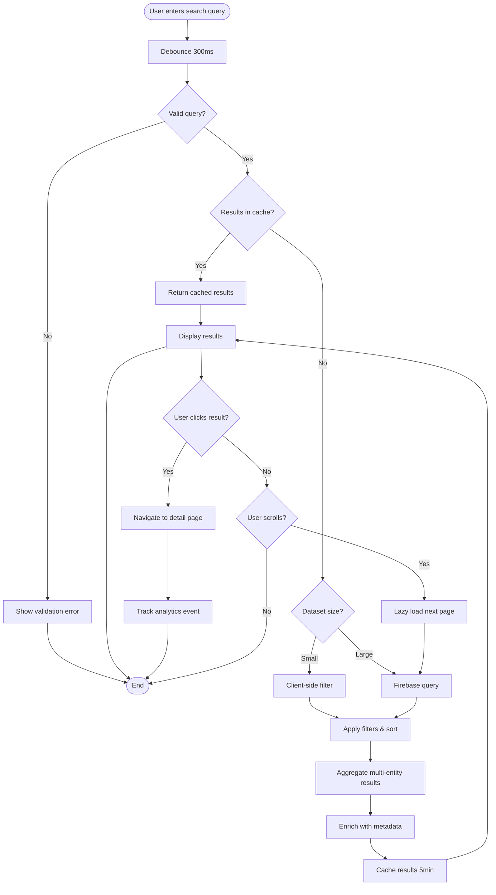
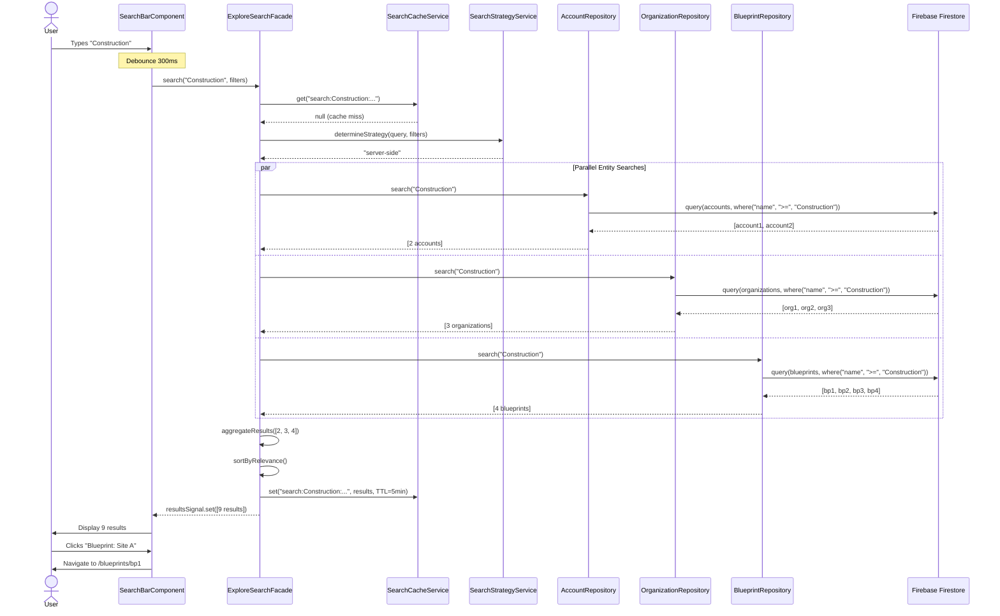
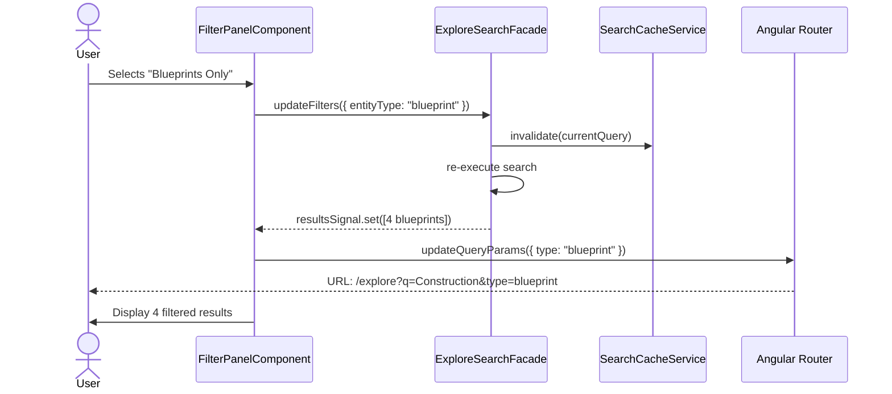
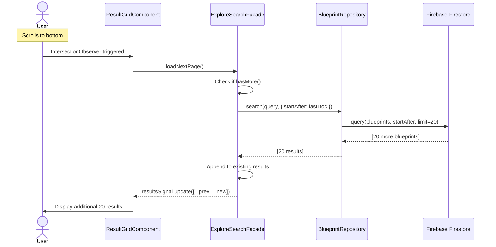
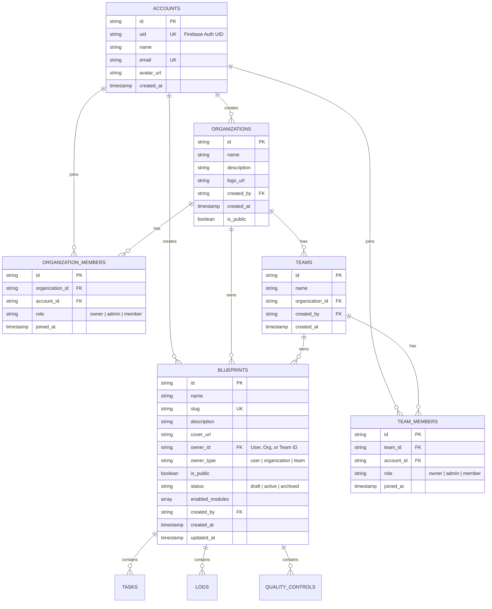
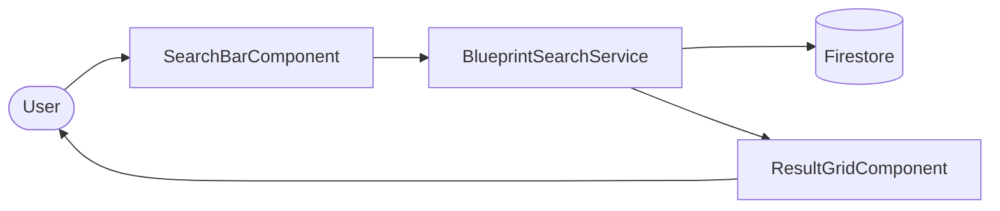
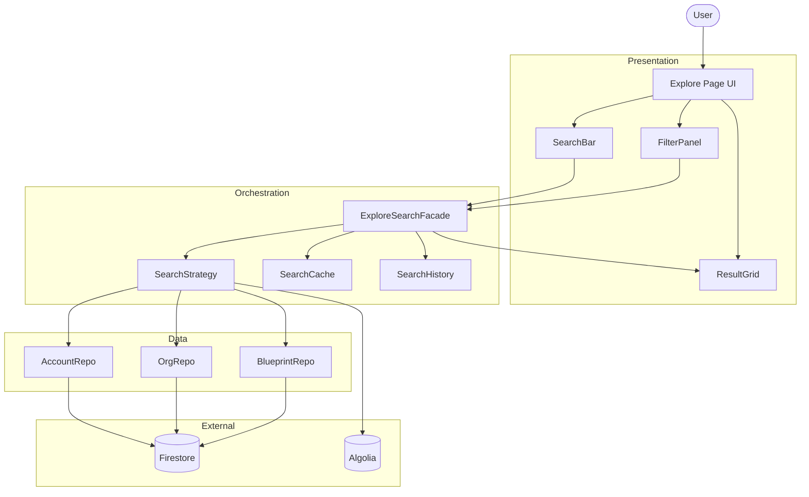
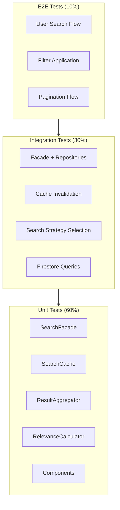

# GigHub Explore Search - Architecture Plan

> **Document Purpose**: Comprehensive architectural design for GitHub-like Explore search feature for Users, Organizations, and Blueprints  
> **Design Date**: 2025-12-12  
> **Document Version**: 1.1.0  
> **Target**: GigHub v20.1.0 (Angular 20.3.0)  
> **Architect**: Senior Cloud Architect Agent  
> **Last Updated**: 2025-12-12

---

## Executive Summary

This document outlines the architectural design for implementing a GitHub-like **Explore** search feature in GigHub. The feature enables users to discover and search for **Users (Accounts)**, **Organizations**, and **Blueprints** through an intuitive, performant, and scalable search interface.

### Key Design Principles

**User Experience** 🎨:
- GitHub-inspired interface with instant search results
- Multi-entity search (Users, Organizations, Blueprints)
- Advanced filters, sorting, and pagination
- Responsive grid/list view switching

**Performance** ⚡:
- Client-side search for small datasets (< 100 items)
- Server-side full-text search for large datasets
- Debounced search input (300ms)
- Virtual scrolling for large result sets
- Optimistic UI updates

**Scalability** 📈:
- Indexed Firebase queries for fast retrieval
- Lazy loading with pagination
- Cached search results (5-minute TTL)
- Progressive enhancement approach

**Security** 🔒:
- RLS policies enforced on all queries
- Authorization checks for private entities
- Input sanitization and validation
- Rate limiting on search API

---

## System Context

### System Context Diagram



### Explanation

**System Purpose**:
The Explore Search feature enables users to discover and connect with other users, organizations, and blueprints within the GigHub platform. Similar to GitHub's explore page, it provides a centralized discovery hub.

**Key Actors**:
1. **Authenticated Users**: Can search all entities and see private items they have access to
2. **Public Visitors**: Can only search and view public blueprints and organizations
3. **System Administrators**: Have unrestricted search access for moderation

**External Systems**:
1. **Firebase Firestore**: Primary data source for accounts, organizations, and blueprints collections
2. **Algolia (Future - Phase 2)**: Advanced full-text search with typo tolerance and relevance ranking
3. **Browser Cache**: Temporary storage for recent search results to improve performance

**System Boundaries**:
- **In Scope**: Search UI, query logic, result rendering, filters, pagination
- **Out of Scope**: Advanced ML-based recommendations (future), content moderation (separate system)

---

## Architecture Overview

### High-Level Architecture Pattern

The Explore Search feature follows GigHub's **three-layer architecture** with an additional **search-specific layer**:

1. **Presentation Layer**: Explore page component with search UI
2. **Search Orchestration Layer**: Coordinates multiple entity searches and result aggregation
3. **Data Access Layer**: Repository pattern for Firebase queries
4. **Caching Layer**: In-memory and browser-based result caching

### Design Patterns Used

- **Repository Pattern**: Abstracted data access for each entity type
- **Facade Pattern**: Unified search interface (`ExploreSearchFacade`)
- **Observer Pattern**: RxJS for reactive search results
- **Strategy Pattern**: Switchable search algorithms (client vs server)
- **Decorator Pattern**: Search result enrichment (avatars, stats, badges)

---

## Component Architecture

### Component Diagram



### Component Responsibilities

#### Presentation Layer

**ExplorePageComponent**:
- Main container for explore feature
- Manages search state with Angular Signals
- Coordinates child components
- Handles routing and deep linking

**SearchBarComponent**:
- Debounced search input (300ms)
- Real-time autocomplete suggestions
- Recent searches history (stored in LocalStorage)
- Entity type quick filters (Users/Orgs/Blueprints)

**ResultGridComponent**:
- Displays search results in grid or list layout
- Virtual scrolling for large result sets
- Lazy loading with infinite scroll
- Result card rendering per entity type

**FilterPanelComponent**:
- Advanced filters (status, date range, visibility)
- Sort options (relevance, date, popularity)
- Clear filters button
- Filter state persistence in URL query params

#### Search Orchestration Layer

**ExploreSearchFacade** (Primary Service):
- Unified API for all search operations
- Coordinates parallel entity searches
- Manages search state (loading, results, errors)
- Implements debouncing and throttling
- Exposes reactive Signals for UI binding

**SearchStrategyService**:
- Determines optimal search approach:
  - **Client-side**: For small datasets (< 100 items), uses Array.filter()
  - **Server-side**: For large datasets, uses Firebase queries
  - **Hybrid**: Initial client-side, then server-side on scroll
- Switchable algorithms based on dataset size

**ResultAggregatorService**:
- Combines results from multiple entity types
- Applies global sorting (relevance, date)
- Implements result deduplication
- Calculates relevance scores

#### Data Access Layer

**AccountRepository**:
- Firebase queries for accounts collection
- Filter by name, email (with RLS)
- Support for pagination cursors

**OrganizationRepository**:
- Firebase queries for organizations collection
- Filter by name, description, visibility
- Includes member count aggregation

**BlueprintRepository**:
- Firebase queries for blueprints collection
- Filter by name, owner, status, modules
- Includes statistics (task count, member count)

**SearchCacheService**:
- In-memory LRU cache (max 50 queries)
- Browser LocalStorage for persistence
- 5-minute TTL for cached results
- Invalidation on data mutations

---

## Deployment Architecture

### Deployment Diagram

```mermaid
C4Deployment
    title Explore Search - Deployment Architecture

    Deployment_Node(client, "Client Browser", "Chrome/Firefox/Safari") {
        Container(spa, "Angular SPA", "TypeScript/JavaScript", "Runs explore search feature")
        ContainerDb(localStorage, "LocalStorage", "Browser Storage", "Cached search results")
    }
    
    Deployment_Node(cdn, "CDN", "Firebase Hosting / Cloudflare") {
        Container(static, "Static Assets", "HTML/CSS/JS", "Compiled Angular bundle")
    }
    
    Deployment_Node(firebase, "Firebase (GCP)", "Google Cloud Platform") {
        ContainerDb(firestore, "Firestore", "NoSQL Database", "Accounts, Organizations, Blueprints collections")
        Container(auth, "Firebase Auth", "Authentication Service", "User authentication")
        ContainerDb(indexes, "Composite Indexes", "Firestore Indexes", "Optimized search indexes")
    }
    
    Deployment_Node(monitoring, "Monitoring (Future)", "Cloud Monitoring") {
        Container(analytics, "Analytics", "Firebase Analytics", "Search usage metrics")
        Container(performance, "Performance", "Firebase Performance", "Search latency tracking")
    }
    
    Rel(spa, cdn, "Loads from", "HTTPS")
    Rel(spa, firestore, "Queries", "Firebase SDK/HTTPS")
    Rel(spa, auth, "Authenticates", "Firebase SDK/HTTPS")
    Rel(spa, localStorage, "Reads/Writes", "Web Storage API")
    
    Rel(firestore, indexes, "Uses")
    Rel(spa, analytics, "Sends events", "Firebase SDK")
    Rel(spa, performance, "Tracks metrics", "Firebase SDK")
```

### Explanation

**Deployment Strategy**:
The Explore Search feature is deployed as part of the Angular SPA, with no additional backend services required. All search logic runs client-side, leveraging Firebase's indexed queries for optimal performance.

**Infrastructure Components**:

1. **Client Browser**:
   - Hosts the Angular application
   - Executes search logic in JavaScript
   - Stores cached results in LocalStorage (max 5MB)

2. **CDN (Firebase Hosting)**:
   - Serves static Angular bundles (JS, CSS, HTML)
   - Global edge caching for fast load times
   - Automatic HTTPS and HTTP/2

3. **Firebase Firestore**:
   - Primary data store for all searchable entities
   - Composite indexes for multi-field queries:
     - `accounts`: (name ASC, created_at DESC)
     - `organizations`: (name ASC, visibility ASC, created_at DESC)
     - `blueprints`: (name ASC, status ASC, ownerType ASC, created_at DESC)
   - RLS policies enforce security on all queries

4. **Composite Indexes**:
   - **Account Search Index**: `name + created_at`
   - **Organization Search Index**: `name + visibility + created_at`
   - **Blueprint Search Index**: `name + status + ownerType + isPublic + created_at`
   - **Full-Text Index (Future)**: Algolia sync for advanced search

5. **Monitoring (Future - Phase 2)**:
   - Firebase Analytics tracks search queries, clicks, and conversions
   - Performance Monitoring measures search latency and query times

**Deployment Environments**:
- **Development**: Local Firebase emulator for testing
- **Staging**: Dedicated Firebase project (gighub-staging)
- **Production**: Main Firebase project (gighub-prod)

---

## Data Flow

### Data Flow Diagram



### Explanation

**Search Flow Breakdown**:

1. **Input & Validation**:
   - User types in search bar
   - Input debounced to 300ms to reduce query load
   - Validate query: minimum 1 character, maximum 100 characters
   - Sanitize input to prevent injection attacks

2. **Cache Check**:
   - Generate cache key: `search:${query}:${filters}:${entityTypes}`
   - Check in-memory cache (O(1) lookup)
   - If hit, return immediately (no network request)
   - Cache TTL: 5 minutes

3. **Search Strategy Selection**:
   - **Small Dataset** (< 100 items):
     - Fetch all entities once, cache in memory
     - Use `Array.filter()` and regex for matching
     - Ultra-fast response (< 10ms)
   - **Large Dataset** (> 100 items):
     - Execute Firebase indexed query
     - Apply server-side filters
     - Return paginated results (20 per page)

4. **Filtering & Sorting**:
   - Apply selected filters:
     - **Entity Type**: Users, Organizations, Blueprints, or All
     - **Visibility**: Public, Private (if authorized)
     - **Status**: Active, Archived (for Blueprints)
     - **Date Range**: Last 7 days, 30 days, all time
   - Sort by:
     - **Relevance**: String matching score
     - **Date**: Created date (newest first)
     - **Popularity**: Member count, blueprint count

5. **Result Aggregation**:
   - Combine results from multiple entity types
   - Calculate relevance scores:
     - Exact match: 100 points
     - Starts with: 80 points
     - Contains: 50 points
     - Substring: 30 points
   - Remove duplicates (same entity from different sources)

6. **Result Enrichment**:
   - Fetch additional metadata:
     - User avatars from Firebase Storage
     - Organization member counts
     - Blueprint statistics (task count, completion rate)
   - Batch requests to minimize latency

7. **Caching**:
   - Store results in in-memory cache
   - Persist to LocalStorage for browser refresh
   - Set 5-minute expiration

8. **Display**:
   - Render results in grid/list view
   - Show entity-specific cards:
     - **User Card**: Avatar, name, email, organization
     - **Organization Card**: Logo, name, member count, blueprint count
     - **Blueprint Card**: Cover, name, owner, status, modules
   - Highlight matching text in results

9. **User Interaction**:
   - **Click**: Navigate to entity detail page, track analytics
   - **Scroll**: Trigger lazy loading for next page
   - **Filter Change**: Re-execute search with new parameters

**Data Transformation**:

```typescript
// Raw Firestore Document
{
  id: "bp_123",
  name: "Construction Site A",
  ownerId: "org_456",
  ownerType: "organization",
  status: "active",
  isPublic: true,
  created_at: Timestamp
}

// Transformed Search Result
{
  id: "bp_123",
  type: "blueprint",
  title: "Construction Site A",
  subtitle: "Active • Public • 5 modules",
  avatar: "https://...",
  relevanceScore: 85,
  metadata: {
    owner: { id: "org_456", name: "ABC Corp", type: "organization" },
    stats: { taskCount: 42, memberCount: 8 },
    status: "active",
    badges: ["public", "active"]
  }
}
```

---

## Key Workflows

### Sequence Diagram: Search Execution



### Sequence Diagram: Filter Application



### Sequence Diagram: Pagination (Lazy Load)



---

## Database Schema Design

### Entity Relationship Diagram (ERD)



### Search Indexes (Firebase Composite Indexes)

**Critical Indexes for Search Performance**:

1. **Accounts Collection**:
   ```typescript
   // Index 1: Name search with date sort
   {
     collectionGroup: "accounts",
     fields: [
       { fieldPath: "name", order: "ASCENDING" },
       { fieldPath: "created_at", order: "DESCENDING" }
     ]
   }
   
   // Index 2: Email search
   {
     collectionGroup: "accounts",
     fields: [
       { fieldPath: "email", order: "ASCENDING" },
       { fieldPath: "created_at", order: "DESCENDING" }
     ]
   }
   ```

2. **Organizations Collection**:
   ```typescript
   // Index 1: Public organizations search
   {
     collectionGroup: "organizations",
     fields: [
       { fieldPath: "is_public", order: "ASCENDING" },
       { fieldPath: "name", order: "ASCENDING" },
       { fieldPath: "created_at", order: "DESCENDING" }
     ]
   }
   
   // Index 2: Name search for all orgs (admin)
   {
     collectionGroup: "organizations",
     fields: [
       { fieldPath: "name", order: "ASCENDING" },
       { fieldPath: "created_at", order: "DESCENDING" }
     ]
   }
   ```

3. **Blueprints Collection**:
   ```typescript
   // Index 1: Public blueprints search
   {
     collectionGroup: "blueprints",
     fields: [
       { fieldPath: "is_public", order: "ASCENDING" },
       { fieldPath: "status", order: "ASCENDING" },
       { fieldPath: "name", order: "ASCENDING" },
       { fieldPath: "created_at", order: "DESCENDING" }
     ]
   }
   
   // Index 2: Owner blueprints search
   {
     collectionGroup: "blueprints",
     fields: [
       { fieldPath: "owner_id", order: "ASCENDING" },
       { fieldPath: "owner_type", order: "ASCENDING" },
       { fieldPath: "name", order: "ASCENDING" },
       { fieldPath: "created_at", order: "DESCENDING" }
     ]
   }
   
   // Index 3: Status-based search
   {
     collectionGroup: "blueprints",
     fields: [
       { fieldPath: "status", order: "ASCENDING" },
       { fieldPath: "name", order: "ASCENDING" },
       { fieldPath: "created_at", order: "DESCENDING" }
     ]
   }
   ```

**Index Creation Command**:
```bash
# Generate firestore.indexes.json
firebase firestore:indexes > firestore.indexes.json

# Deploy indexes
firebase deploy --only firestore:indexes
```

---

## Search Algorithm Design

### Client-Side Search Algorithm

**Use Case**: Small datasets (< 100 items), ultra-fast filtering

```typescript
/**
 * Client-Side Search Algorithm
 * Complexity: O(n) where n = number of items
 * Performance: < 10ms for 100 items
 */
class ClientSideSearch {
  search(items: SearchableEntity[], query: string): SearchResult[] {
    const normalizedQuery = query.toLowerCase().trim();
    
    return items
      .map(item => ({
        ...item,
        relevanceScore: this.calculateRelevance(item, normalizedQuery)
      }))
      .filter(item => item.relevanceScore > 0)
      .sort((a, b) => b.relevanceScore - a.relevanceScore);
  }
  
  private calculateRelevance(item: SearchableEntity, query: string): number {
    const name = item.name.toLowerCase();
    const description = (item.description || '').toLowerCase();
    
    // Exact match: 100 points
    if (name === query) return 100;
    
    // Starts with: 80 points
    if (name.startsWith(query)) return 80;
    
    // Contains (word boundary): 60 points
    if (new RegExp(`\\b${query}`, 'i').test(name)) return 60;
    
    // Contains anywhere: 40 points
    if (name.includes(query)) return 40;
    
    // Description match: 20 points
    if (description.includes(query)) return 20;
    
    // No match
    return 0;
  }
}
```

### Server-Side Search Algorithm

**Use Case**: Large datasets (> 100 items), paginated results

```typescript
/**
 * Server-Side Search Algorithm
 * Uses Firebase indexed queries for optimal performance
 * Complexity: O(log n) for indexed queries
 * Performance: 50-200ms depending on dataset size
 */
class ServerSideSearch {
  async search(
    collectionName: string,
    query: string,
    filters: SearchFilters,
    pagination: PaginationOptions
  ): Promise<SearchResult[]> {
    const constraints: QueryConstraint[] = [];
    
    // Range query for name search (uses index)
    // Firebase limitation: No full-text search, use range query
    const searchEnd = query + '\uf8ff'; // Unicode max character
    constraints.push(
      where('name', '>=', query),
      where('name', '<=', searchEnd)
    );
    
    // Apply filters
    if (filters.isPublic !== undefined) {
      constraints.push(where('is_public', '==', filters.isPublic));
    }
    
    if (filters.status) {
      constraints.push(where('status', '==', filters.status));
    }
    
    // Sort by relevance (name match) then created_at
    constraints.push(orderBy('name', 'asc'));
    constraints.push(orderBy('created_at', 'desc'));
    
    // Pagination
    constraints.push(limit(pagination.pageSize));
    if (pagination.startAfter) {
      constraints.push(startAfter(pagination.startAfter));
    }
    
    // Execute query
    const q = query(collection(this.firestore, collectionName), ...constraints);
    const snapshot = await getDocs(q);
    
    return snapshot.docs.map(doc => this.transformDoc(doc));
  }
}
```

### Hybrid Search Algorithm (Recommended)

**Use Case**: Adaptive approach based on dataset size

```typescript
/**
 * Hybrid Search Algorithm
 * Combines client-side and server-side strategies
 * Automatically selects optimal approach
 */
class HybridSearchStrategy {
  private readonly CLIENT_THRESHOLD = 100;
  
  async search(query: string, filters: SearchFilters): Promise<SearchResult[]> {
    const datasetSize = await this.estimateDatasetSize(filters);
    
    if (datasetSize < this.CLIENT_THRESHOLD) {
      // Use client-side search for small datasets
      const allItems = await this.fetchAll(filters);
      return this.clientSearch.search(allItems, query);
    } else {
      // Use server-side search for large datasets
      return this.serverSearch.search(query, filters, { pageSize: 20 });
    }
  }
  
  private async estimateDatasetSize(filters: SearchFilters): Promise<number> {
    // Use cached metadata or quick count query
    const cacheKey = `size:${JSON.stringify(filters)}`;
    const cached = this.cache.get(cacheKey);
    if (cached) return cached;
    
    // Perform quick aggregation count
    const count = await this.getCount(filters);
    this.cache.set(cacheKey, count, 60000); // Cache 1 minute
    return count;
  }
}
```

---

## Phased Development Plan

### Phase 1: MVP (Initial Implementation)

**Timeline**: 2 weeks  
**Effort**: 40-60 hours

**Scope**:
- Basic search interface with single input field
- Client-side search for Blueprints only
- Simple grid view display
- Basic filters (status, visibility)
- No caching, no pagination

**Deliverables**:
1. `ExplorePageComponent` with basic layout
2. `SearchBarComponent` with debounced input
3. `BlueprintSearchService` with client-side filtering
4. `ResultGridComponent` with blueprint cards
5. Basic unit tests (60% coverage)

**MVP Architecture Diagram**:



**Technical Decisions**:
- **Framework**: Angular 20 Standalone Components
- **State Management**: Angular Signals only
- **Search**: Client-side Array.filter()
- **UI Library**: ng-zorro-antd components
- **No Backend**: Pure Firebase queries

**Acceptance Criteria**:
- [ ] User can search blueprints by name
- [ ] Results update within 500ms of typing
- [ ] Search results are visually consistent
- [ ] Basic filters work (status, public/private)
- [ ] Mobile responsive layout

---

### Phase 2: Full Features (Target Architecture)

**Timeline**: 4 weeks  
**Effort**: 100-120 hours

**Scope**:
- Multi-entity search (Users, Organizations, Blueprints)
- Server-side search with pagination
- Advanced filters and sorting
- Result caching with TTL
- List/Grid view toggle
- Recent searches history
- Algolia integration for full-text search

**Additional Deliverables**:
1. `ExploreSearchFacade` for unified search
2. `AccountSearchService` and `OrganizationSearchService`
3. `SearchCacheService` with LRU cache
4. `FilterPanelComponent` with advanced options
5. `SearchHistoryService` with LocalStorage
6. Algolia sync functions (Cloud Functions)
7. Comprehensive E2E tests (80% coverage)
8. Performance monitoring integration

**Full Architecture Diagram**:



**Acceptance Criteria**:
- [ ] Search across all entity types simultaneously
- [ ] Pagination with infinite scroll
- [ ] Results cached for 5 minutes
- [ ] Advanced filters (date range, entity type, status)
- [ ] Sort by relevance, date, popularity
- [ ] Recent searches history (last 10)
- [ ] Algolia full-text search with typo tolerance
- [ ] < 200ms search response time
- [ ] Performance metrics tracked in Firebase Analytics

---

### Migration Path: Phase 1 → Phase 2

**Step-by-Step Evolution**:

1. **Week 1-2 (Phase 1)**:
   - Build basic search for Blueprints
   - Implement client-side filtering
   - Create minimal UI components

2. **Week 3: Expand Entity Types**:
   - Add `AccountSearchService` and `OrganizationSearchService`
   - Create entity-specific result cards
   - Implement parallel search execution

3. **Week 4: Introduce Facade**:
   - Refactor to `ExploreSearchFacade` pattern
   - Migrate state management to Facade
   - Maintain backward compatibility

4. **Week 5: Add Caching**:
   - Implement `SearchCacheService`
   - Add LRU cache with TTL
   - Monitor cache hit rates

5. **Week 6: Server-Side Search**:
   - Switch to Firebase indexed queries
   - Implement pagination with cursors
   - Add infinite scroll

6. **Week 7: Algolia Integration**:
   - Set up Algolia account and indexes
   - Create Cloud Functions for data sync
   - Implement Algolia search strategy
   - A/B test Firebase vs Algolia performance

7. **Week 8: Polish & Optimization**:
   - Performance tuning
   - Advanced filters implementation
   - E2E testing
   - Documentation

**Backward Compatibility**:
- Phase 1 components remain functional during Phase 2
- Feature flags control new features
- Gradual rollout with user testing

---

## Non-Functional Requirements Analysis

### Scalability

**Current Scale** (Phase 1):
- **Users**: 100-500 accounts
- **Organizations**: 10-50 organizations
- **Blueprints**: 100-1,000 blueprints
- **Concurrent Users**: 10-20 simultaneous searches

**Target Scale** (Phase 2):
- **Users**: 10,000+ accounts
- **Organizations**: 500+ organizations
- **Blueprints**: 50,000+ blueprints
- **Concurrent Users**: 100+ simultaneous searches

**Scalability Strategies**:

1. **Horizontal Scaling**:
   - Firebase automatically scales with load
   - No server-side infrastructure to manage
   - CDN distribution for static assets

2. **Data Partitioning**:
   - Shard large collections by organization_id
   - Implement collection groups for cross-org queries
   - Use subcollections for nested data

3. **Query Optimization**:
   - Composite indexes for all search patterns
   - Limit result set sizes (max 100 per query)
   - Pagination to avoid large data transfers

4. **Caching Strategy**:
   - **L1 Cache**: In-memory (50 queries, 5-minute TTL)
   - **L2 Cache**: Browser LocalStorage (persistent across sessions)
   - **L3 Cache**: Firebase CDN (static data)

5. **Load Balancing**:
   - Firebase handles automatic load balancing
   - Use Firebase regions closest to users
   - Implement read replicas for geo-distribution

**Scalability Metrics**:
- **Response Time**: < 200ms for cached, < 500ms for uncached
- **Throughput**: 1,000 searches/minute
- **Data Volume**: 100MB search index size
- **Growth Rate**: 20% monthly increase in data

---

### Performance

**Performance Goals**:

| Metric | Target | Measurement |
|--------|--------|-------------|
| **Initial Page Load** | < 2s | Lighthouse Performance Score > 90 |
| **Search Response Time** | < 300ms | P95 latency |
| **Cache Hit Rate** | > 60% | Cached / Total queries |
| **Firestore Reads** | < 50 reads/search | Firebase console |
| **Bundle Size** | < 500KB | Webpack analyzer |
| **Time to Interactive** | < 3s | Lighthouse TTI |

**Performance Optimizations**:

1. **Frontend Optimizations**:
   - **Code Splitting**: Lazy load explore module
   - **Tree Shaking**: Remove unused ng-zorro components
   - **Minification**: Terser for production builds
   - **Compression**: Gzip/Brotli for assets
   - **Image Optimization**: WebP format, lazy loading

2. **Search Optimizations**:
   - **Debouncing**: 300ms delay before query execution
   - **Request Deduplication**: Cancel in-flight queries
   - **Batch Requests**: Parallel entity searches
   - **Result Streaming**: Display results as they arrive

3. **Rendering Optimizations**:
   - **Virtual Scrolling**: ng-zorro `nz-virtual-scroll`
   - **OnPush Change Detection**: All components
   - **TrackBy Functions**: Prevent unnecessary re-renders
   - **Memo Computed Signals**: Cache expensive calculations

4. **Network Optimizations**:
   - **HTTP/2**: Enabled by Firebase Hosting
   - **CDN**: Global edge caching
   - **Preconnect**: DNS prefetch for Firebase
   - **Service Worker**: Offline caching (future)

**Performance Monitoring**:
- Firebase Performance Monitoring for real-time metrics
- Lighthouse CI for regression detection
- Custom metrics: search latency, cache hit rate
- User-centric metrics: FCP, LCP, CLS, FID

---

### Security

**Security Requirements**:

1. **Authentication**:
   - Firebase Auth for user identity
   - JWT token validation on all requests
   - Session timeout: 1 hour
   - Refresh token rotation

2. **Authorization**:
   - RLS policies on all Firestore collections
   - **Public Data**: Anyone can read public blueprints/orgs
   - **Private Data**: Only authorized members can read
   - **Admin Data**: Only system admins can access all data

3. **Input Validation**:
   - Client-side: Angular form validators
   - Server-side: Firestore security rules
   - Sanitization: DOMPurify for user input
   - XSS Prevention: Angular's built-in sanitization

4. **Data Privacy**:
   - **PII Protection**: Email addresses only visible to authorized users
   - **Search Logging**: Anonymized query logs
   - **GDPR Compliance**: Right to be forgotten, data export

**Firestore Security Rules**:

```javascript
// Accounts Collection
match /accounts/{accountId} {
  // Anyone can read public account data
  allow read: if request.auth != null;
  
  // Users can update their own account
  allow write: if request.auth != null && request.auth.uid == accountId;
}

// Organizations Collection
match /organizations/{orgId} {
  // Public organizations visible to all authenticated users
  allow read: if request.auth != null && 
    (resource.data.is_public == true || 
     isMember(orgId, request.auth.uid));
  
  // Only org admins can write
  allow write: if request.auth != null && 
    isAdmin(orgId, request.auth.uid);
}

// Blueprints Collection
match /blueprints/{blueprintId} {
  // Public blueprints visible to all authenticated users
  // Private blueprints only to members
  allow read: if request.auth != null && 
    (resource.data.is_public == true || 
     hasAccess(blueprintId, request.auth.uid));
  
  // Only blueprint owner or org admins can write
  allow write: if request.auth != null && 
    (resource.data.created_by == request.auth.uid ||
     isAdmin(resource.data.owner_id, request.auth.uid));
}

// Helper Functions
function isMember(orgId, userId) {
  return exists(/databases/$(database)/documents/organization_members/$(orgId + '_' + userId));
}

function isAdmin(orgId, userId) {
  let member = get(/databases/$(database)/documents/organization_members/$(orgId + '_' + userId));
  return member.data.role in ['owner', 'admin'];
}

function hasAccess(blueprintId, userId) {
  let blueprint = get(/databases/$(database)/documents/blueprints/$(blueprintId));
  return blueprint.data.created_by == userId ||
         isMember(blueprint.data.owner_id, userId);
}
```

**Rate Limiting**:
- **Firebase**: 10,000 reads/day per IP (default)
- **Application**: 100 searches/hour per user (client-side throttle)
- **Algolia**: 10,000 queries/month on free tier

**Security Auditing**:
- Firebase Audit Logs for access monitoring
- Security rules testing in CI/CD
- Regular penetration testing
- OWASP Top 10 compliance

---

### Reliability

**Reliability Goals**:

| Metric | Target | Strategy |
|--------|--------|----------|
| **Uptime** | 99.9% | Firebase SLA + CDN redundancy |
| **Error Rate** | < 0.1% | Comprehensive error handling |
| **Data Durability** | 99.999% | Firestore automatic replication |
| **Recovery Time** | < 5 min | Automated monitoring + alerts |

**Reliability Strategies**:

1. **Error Handling**:
   - Try-catch blocks on all async operations
   - User-friendly error messages
   - Fallback UI for failed loads
   - Automatic retry with exponential backoff

2. **Fault Tolerance**:
   - **Network Failures**: Offline detection, queue requests
   - **API Failures**: Fallback to cached data
   - **Firestore Outages**: Show last cached results
   - **Client Errors**: Error boundary components

3. **Monitoring & Alerting**:
   - Firebase Crashlytics for error tracking
   - Firebase Performance for latency monitoring
   - Custom alerts for:
     - Error rate > 1%
     - Search latency > 1s
     - Cache hit rate < 40%

4. **Data Backup**:
   - Firestore automatic backups (daily)
   - Export to Cloud Storage (weekly)
   - Point-in-time recovery (7 days)

5. **Disaster Recovery**:
   - **RTO**: 1 hour (Recovery Time Objective)
   - **RPO**: 1 hour (Recovery Point Objective)
   - Runbooks for common failure scenarios
   - Regular DR drills (quarterly)

**Error Handling Example**:

```typescript
class ExploreSearchFacade {
  async search(query: string): Promise<SearchResult[]> {
    try {
      // Attempt search
      return await this.performSearch(query);
    } catch (error) {
      this.logger.error('Search failed', error);
      
      // Fallback to cached results
      const cached = this.cache.get(query);
      if (cached) {
        this.showWarning('Using cached results');
        return cached;
      }
      
      // No cache, show error
      this.showError('Search unavailable. Please try again.');
      return [];
    }
  }
}
```

---

### Maintainability

**Maintainability Goals**:

1. **Code Quality**:
   - TypeScript strict mode enabled
   - ESLint + Prettier for consistent formatting
   - 80%+ unit test coverage
   - 60%+ integration test coverage

2. **Documentation**:
   - JSDoc comments on all public APIs
   - Architecture decision records (ADRs)
   - API documentation with examples
   - Onboarding guide for new developers

3. **Code Structure**:
   - Clear separation of concerns (presentation, logic, data)
   - Dependency injection for testability
   - Repository pattern for data access
   - Facade pattern for complex workflows

4. **Versioning**:
   - Semantic versioning (MAJOR.MINOR.PATCH)
   - Changelog for all releases
   - Feature flags for gradual rollouts
   - Backward compatibility for 2 versions

5. **Technical Debt**:
   - Quarterly refactoring sprints
   - Automated dependency updates (Renovate)
   - Code review checklist for PRs
   - Refactoring candidates tracked in backlog

**Code Organization**:

```
src/app/routes/explore/
├── components/
│   ├── search-bar/
│   │   ├── search-bar.component.ts
│   │   ├── search-bar.component.html
│   │   ├── search-bar.component.less
│   │   └── search-bar.component.spec.ts
│   ├── result-grid/
│   ├── filter-panel/
│   └── result-cards/
│       ├── account-card.component.ts
│       ├── organization-card.component.ts
│       └── blueprint-card.component.ts
├── services/
│   ├── explore-search.facade.ts
│   ├── search-strategy.service.ts
│   ├── result-aggregator.service.ts
│   └── search-cache.service.ts
├── models/
│   ├── search-result.model.ts
│   ├── search-filter.model.ts
│   └── search-options.model.ts
├── explore-page.component.ts
├── explore-page.component.html
├── explore-page.component.less
├── explore.routes.ts
└── README.md
```

---

## Risks and Mitigations

### Identified Risks

| Risk | Impact | Probability | Mitigation |
|------|--------|-------------|------------|
| **Firebase query limitations** (no full-text search) | High | High | Implement Algolia in Phase 2 |
| **Large result sets cause performance issues** | High | Medium | Pagination + virtual scrolling |
| **Firestore costs exceed budget** | Medium | Medium | Caching + query optimization |
| **Security rules misconfigured** | Critical | Low | Automated testing + peer review |
| **User abandons search due to slow response** | High | Medium | Client-side search + debouncing |
| **Index creation takes too long** | Medium | Low | Pre-create indexes in staging |
| **Cache invalidation bugs** | Medium | Medium | Short TTL (5 min) + manual refresh |
| **Mobile performance issues** | Medium | Medium | Responsive design + lazy loading |

### Mitigation Strategies

1. **Firebase Limitations**:
   - **Risk**: No full-text search, no fuzzy matching
   - **Mitigation**:
     - Phase 1: Use range queries (`>=` and `<=`)
     - Phase 2: Integrate Algolia for advanced search
     - Fallback: Client-side filtering for small datasets

2. **Performance Degradation**:
   - **Risk**: Large datasets slow down search
   - **Mitigation**:
     - Implement pagination (20 results per page)
     - Use virtual scrolling for infinite scroll
     - Monitor P95 latency, alert if > 1s

3. **Cost Overruns**:
   - **Risk**: Excessive Firestore reads increase costs
   - **Mitigation**:
     - Cache results for 5 minutes
     - Monitor daily read counts in Firebase console
     - Set budget alerts at $50/month

4. **Security Vulnerabilities**:
   - **Risk**: Unauthorized access to private data
   - **Mitigation**:
     - Comprehensive Firestore security rules
     - Automated security rule testing in CI/CD
     - Regular security audits (quarterly)

5. **User Experience Issues**:
   - **Risk**: Slow search response frustrates users
   - **Mitigation**:
     - Client-side search for < 100 items
     - Debounce input to 300ms
     - Show loading state immediately
     - Display partial results as they arrive

---

## Technology Stack Recommendations

### Frontend Stack

| Component | Technology | Version | Justification |
|-----------|-----------|---------|---------------|
| **Framework** | Angular | 20.3.0 | Project standard, modern features |
| **UI Library** | ng-zorro-antd | 20.3.1 | Consistent with GigHub design system |
| **Admin Framework** | ng-alain | 20.1.0 | Pre-built admin components |
| **State Management** | Angular Signals | Built-in | Reactive, performant, simple |
| **HTTP Client** | HttpClient | Built-in | Standard Angular HTTP |
| **Reactive** | RxJS | 7.8.0 | Async operations, streams |
| **Routing** | Angular Router | Built-in | SPA navigation |
| **Forms** | Reactive Forms | Built-in | Form validation |
| **Testing** | Jasmine + Karma | Built-in | Unit testing |

### Backend Stack

| Component | Technology | Version | Justification |
|-----------|-----------|---------|---------------|
| **Database** | Firebase Firestore | Latest | NoSQL, real-time, scalable |
| **Authentication** | Firebase Auth | Latest | Secure, easy integration |
| **Hosting** | Firebase Hosting | Latest | CDN, HTTPS, fast |
| **Search (Phase 2)** | Algolia | Latest | Full-text search, typo tolerance |
| **Analytics** | Firebase Analytics | Latest | User behavior tracking |
| **Monitoring** | Firebase Performance | Latest | Performance metrics |

### Development Tools

| Tool | Purpose | Version |
|------|---------|---------|
| **Package Manager** | Yarn | 4.9.2 | Fast, reliable |
| **Linter** | ESLint | 9.35.0 | Code quality |
| **Formatter** | Prettier | 3.6.2 | Code formatting |
| **TypeScript** | TypeScript | 5.9.2 | Type safety |
| **Build Tool** | Angular CLI | 20.3.1 | Build automation |
| **CI/CD** | GitHub Actions | N/A | Automated testing |

### Why These Technologies?

1. **Angular 20**:
   - Modern features: Signals, new control flow, standalone components
   - Excellent TypeScript support
   - Large ecosystem and community
   - Enterprise-ready framework

2. **Firebase Firestore**:
   - NoSQL flexibility for evolving schema
   - Real-time updates for future features
   - Built-in security with RLS
   - Auto-scaling with pay-as-you-go pricing
   - Excellent Angular integration

3. **ng-zorro-antd**:
   - Comprehensive UI component library
   - Ant Design patterns familiar to users
   - Consistent with GigHub design system
   - Active maintenance and community

4. **Algolia (Phase 2)**:
   - Best-in-class full-text search
   - Typo tolerance and fuzzy matching
   - Faceted search and filters
   - Fast response times (< 50ms)
   - Easy Firebase integration

5. **Angular Signals**:
   - Modern reactive state management
   - Better performance than Zone.js
   - Simpler than RxJS for local state
   - Future-proof (Angular's direction)

---

## Next Steps

### Immediate Actions (Week 1)

1. **Setup & Planning**:
   - [ ] Create feature branch: `feature/explore-search-mvp`
   - [ ] Review and approve this architecture document
   - [ ] Set up project board in GitHub with tasks
   - [ ] Schedule kickoff meeting with stakeholders

2. **Firebase Configuration**:
   - [ ] Create composite indexes in `firestore.indexes.json`
   - [ ] Deploy indexes to staging environment
   - [ ] Test index performance with sample data
   - [ ] Document index creation process

3. **Component Scaffolding**:
   - [ ] Generate Angular components:
     ```bash
     ng g c routes/explore/explore-page --standalone
     ng g c routes/explore/components/search-bar --standalone
     ng g c routes/explore/components/result-grid --standalone
     ng g c routes/explore/components/filter-panel --standalone
     ```
   - [ ] Generate services:
     ```bash
     ng g s routes/explore/services/explore-search-facade
     ng g s routes/explore/services/search-cache
     ```
   - [ ] Set up routing in `explore.routes.ts`

4. **Design & Mockups**:
   - [ ] Create Figma mockups for explore page
   - [ ] Review UI/UX with design team
   - [ ] Define component API contracts
   - [ ] Document design decisions

### Short-Term Deliverables (Weeks 2-4)

1. **Phase 1 MVP**:
   - [ ] Implement basic search UI
   - [ ] Build client-side search for blueprints
   - [ ] Create result grid with blueprint cards
   - [ ] Add basic filters (status, visibility)
   - [ ] Write unit tests (60% coverage)
   - [ ] Deploy to staging for user testing

2. **Testing & Validation**:
   - [ ] Conduct usability testing with 5 users
   - [ ] Measure search response times
   - [ ] Validate mobile responsiveness
   - [ ] Fix critical bugs
   - [ ] Gather feedback for Phase 2

3. **Documentation**:
   - [ ] Write component README files
   - [ ] Document API contracts
   - [ ] Create developer onboarding guide
   - [ ] Record demo video

### Medium-Term Goals (Weeks 5-8)

1. **Phase 2 Implementation**:
   - [ ] Expand to multi-entity search
   - [ ] Implement server-side search with pagination
   - [ ] Add caching layer
   - [ ] Build advanced filter panel
   - [ ] Integrate Firebase Analytics

2. **Algolia Integration**:
   - [ ] Set up Algolia account
   - [ ] Create Cloud Functions for data sync
   - [ ] Build Algolia search strategy
   - [ ] A/B test Firebase vs Algolia
   - [ ] Migrate to Algolia for production

3. **Performance Optimization**:
   - [ ] Implement virtual scrolling
   - [ ] Optimize bundle size
   - [ ] Add service worker for offline caching
   - [ ] Monitor performance metrics

### Long-Term Roadmap (Months 3-6)

1. **Advanced Features**:
   - [ ] ML-based search recommendations
   - [ ] Saved searches and alerts
   - [ ] Trending blueprints section
   - [ ] Social features (follow, bookmark)

2. **Internationalization**:
   - [ ] Multi-language support
   - [ ] Localized search results
   - [ ] RTL language support

3. **Mobile App**:
   - [ ] Native mobile search experience
   - [ ] Voice search integration
   - [ ] Barcode scanning for blueprint search

---

## API Specification

### Search API Endpoints

This section defines the internal service API contracts for the Explore Search feature.

#### ExploreSearchFacade API

The `ExploreSearchFacade` provides a unified interface for all search operations.

```typescript
/**
 * ExploreSearchFacade - Unified Search Interface
 * 
 * @description Provides a single entry point for all explore search operations,
 * coordinating multiple entity searches and managing search state.
 */
@Injectable({ providedIn: 'root' })
export class ExploreSearchFacade {
  // ============ Public Signals (State) ============
  
  /** Current search query */
  readonly query: Signal<string>;
  
  /** Current search filters */
  readonly filters: Signal<SearchFilters>;
  
  /** Search results aggregated from all entity types */
  readonly results: Signal<SearchResult[]>;
  
  /** Loading state indicator */
  readonly loading: Signal<boolean>;
  
  /** Error state if search fails */
  readonly error: Signal<string | null>;
  
  /** Pagination state */
  readonly pagination: Signal<PaginationState>;
  
  /** Whether more results are available */
  readonly hasMore: Signal<boolean>;

  // ============ Public Methods ============
  
  /**
   * Execute a search query across all enabled entity types
   * @param query - Search query string (min 1 char, max 100 chars)
   * @param options - Optional search configuration
   * @returns Promise that resolves when search completes
   */
  search(query: string, options?: SearchOptions): Promise<void>;
  
  /**
   * Update search filters and re-execute search
   * @param filters - Partial filter updates
   */
  updateFilters(filters: Partial<SearchFilters>): Promise<void>;
  
  /**
   * Load next page of results (infinite scroll)
   */
  loadNextPage(): Promise<void>;
  
  /**
   * Clear all search state and reset to initial
   */
  clearSearch(): void;
  
  /**
   * Get search suggestions for autocomplete
   * @param partial - Partial query string
   * @returns Array of search suggestions
   */
  getSuggestions(partial: string): Promise<SearchSuggestion[]>;
}
```

#### Data Type Definitions

```typescript
/**
 * Search Filter Configuration
 */
interface SearchFilters {
  /** Entity types to include in search */
  entityTypes: ('account' | 'organization' | 'blueprint')[];
  
  /** Filter by visibility (public/private) */
  visibility?: 'public' | 'private' | 'all';
  
  /** Filter by status (for blueprints) */
  status?: 'draft' | 'active' | 'archived' | 'all';
  
  /** Filter by date range */
  dateRange?: {
    start: Date;
    end: Date;
  };
  
  /** Sort configuration */
  sortBy: 'relevance' | 'created' | 'updated' | 'name';
  sortOrder: 'asc' | 'desc';
}

/**
 * Search Result - Unified result type for all entities
 */
interface SearchResult {
  /** Unique identifier */
  id: string;
  
  /** Entity type discriminator */
  type: 'account' | 'organization' | 'blueprint';
  
  /** Display title (name) */
  title: string;
  
  /** Secondary text (description excerpt) */
  subtitle: string;
  
  /** Avatar or cover image URL */
  avatarUrl: string | null;
  
  /** Relevance score (0-100) */
  relevanceScore: number;
  
  /** Entity-specific metadata */
  metadata: AccountMetadata | OrganizationMetadata | BlueprintMetadata;
  
  /** Highlighted text matches */
  highlights: {
    field: string;
    matches: string[];
  }[];
  
  /** Creation timestamp */
  createdAt: Date;
  
  /** Last update timestamp */
  updatedAt: Date;
}

/**
 * Account-specific metadata
 */
interface AccountMetadata {
  email: string;
  organizationCount: number;
  blueprintCount: number;
}

/**
 * Organization-specific metadata
 */
interface OrganizationMetadata {
  memberCount: number;
  blueprintCount: number;
  isPublic: boolean;
}

/**
 * Blueprint-specific metadata
 */
interface BlueprintMetadata {
  ownerName: string;
  ownerType: 'user' | 'organization' | 'team';
  status: 'draft' | 'active' | 'archived';
  taskCount: number;
  memberCount: number;
  enabledModules: string[];
  isPublic: boolean;
}

/**
 * Pagination state
 */
interface PaginationState {
  currentPage: number;
  pageSize: number;
  totalCount: number;
  totalPages: number;
}

/**
 * Search suggestion for autocomplete
 */
interface SearchSuggestion {
  text: string;
  type: 'recent' | 'popular' | 'entity';
  entityType?: 'account' | 'organization' | 'blueprint';
  entityId?: string;
}
```

#### Repository API Contracts

```typescript
/**
 * Base Search Repository Interface
 */
interface ISearchRepository<T> {
  /**
   * Search entities by query
   * @param query - Search query string
   * @param filters - Filter configuration
   * @param pagination - Pagination options
   * @returns Search results with metadata
   */
  search(
    query: string,
    filters: SearchFilters,
    pagination: PaginationOptions
  ): Promise<SearchResponse<T>>;
  
  /**
   * Get entity by ID
   */
  getById(id: string): Promise<T | null>;
  
  /**
   * Count matching entities
   */
  count(query: string, filters: SearchFilters): Promise<number>;
}

/**
 * Account Repository - Firestore Implementation
 */
@Injectable({ providedIn: 'root' })
export class AccountSearchRepository implements ISearchRepository<Account> {
  private firestore = inject(Firestore);
  
  async search(
    query: string,
    filters: SearchFilters,
    pagination: PaginationOptions
  ): Promise<SearchResponse<Account>> {
    const accountsRef = collection(this.firestore, 'accounts');
    const searchEnd = query + '\uf8ff';
    
    // Firestore range query for prefix matching
    const q = firestoreQuery(
      accountsRef,
      where('name', '>=', query),
      where('name', '<=', searchEnd),
      orderBy('name', 'asc'),
      limit(pagination.limit)
    );
    
    const snapshot = await getDocs(q);
    const data = snapshot.docs.map(doc => ({ id: doc.id, ...doc.data() } as Account));
    
    return { data, totalCount: data.length };
  }
}

/**
 * Blueprint Repository - Firestore Implementation
 */
@Injectable({ providedIn: 'root' })
export class BlueprintSearchRepository implements ISearchRepository<Blueprint> {
  private firestore = inject(Firestore);
  
  async search(
    query: string,
    filters: SearchFilters,
    pagination: PaginationOptions
  ): Promise<SearchResponse<Blueprint>> {
    const blueprintsRef = collection(this.firestore, 'blueprints');
    const searchEnd = query + '\uf8ff';
    const constraints: QueryConstraint[] = [];
    
    // Range query for name search (uses composite index)
    constraints.push(
      where('name', '>=', query),
      where('name', '<=', searchEnd)
    );
    
    // Apply filters
    if (filters.visibility === 'public') {
      constraints.push(where('is_public', '==', true));
    }
    if (filters.status && filters.status !== 'all') {
      constraints.push(where('status', '==', filters.status));
    }
    
    // Sort and pagination
    constraints.push(orderBy('name', 'asc'));
    constraints.push(orderBy('created_at', 'desc'));
    constraints.push(limit(pagination.limit));
    
    if (pagination.startAfter) {
      constraints.push(startAfter(pagination.startAfter));
    }
    
    const q = firestoreQuery(blueprintsRef, ...constraints);
    const snapshot = await getDocs(q);
    const data = snapshot.docs.map(doc => ({ id: doc.id, ...doc.data() } as Blueprint));
    
    return { data, totalCount: data.length };
  }
}
```

### Event Bus Integration

The Explore Search feature integrates with GigHub's Event Bus for real-time updates:

```typescript
/**
 * Search-related events
 */
enum SearchEvents {
  SEARCH_EXECUTED = 'explore:search:executed',
  SEARCH_RESULT_CLICKED = 'explore:search:result_clicked',
  SEARCH_FILTERS_CHANGED = 'explore:search:filters_changed',
  SEARCH_CACHE_INVALIDATED = 'explore:search:cache_invalidated',
}

/**
 * Event payloads
 */
interface SearchExecutedPayload {
  query: string;
  filters: SearchFilters;
  resultCount: number;
  duration: number;
  source: 'cache' | 'server';
}

interface SearchResultClickedPayload {
  resultId: string;
  resultType: 'account' | 'organization' | 'blueprint';
  position: number;
  query: string;
}
```

---

## Testing Strategy

### Overview

The Explore Search feature requires comprehensive testing across unit, integration, and end-to-end levels to ensure reliability and performance.

### Testing Pyramid



### Unit Tests

#### Component Tests

```typescript
// search-bar.component.spec.ts
describe('SearchBarComponent', () => {
  let component: SearchBarComponent;
  let fixture: ComponentFixture<SearchBarComponent>;
  let searchFacadeSpy: jasmine.SpyObj<ExploreSearchFacade>;

  beforeEach(async () => {
    searchFacadeSpy = jasmine.createSpyObj('ExploreSearchFacade', ['search', 'clearSearch']);
    
    await TestBed.configureTestingModule({
      imports: [SearchBarComponent],
      providers: [
        { provide: ExploreSearchFacade, useValue: searchFacadeSpy }
      ]
    }).compileComponents();

    fixture = TestBed.createComponent(SearchBarComponent);
    component = fixture.componentInstance;
    fixture.detectChanges();
  });

  it('should debounce search input by 300ms', fakeAsync(() => {
    const input = fixture.nativeElement.querySelector('input');
    
    input.value = 'test';
    input.dispatchEvent(new Event('input'));
    
    // Search should not be called immediately
    expect(searchFacadeSpy.search).not.toHaveBeenCalled();
    
    tick(300);
    
    // Search should be called after debounce
    expect(searchFacadeSpy.search).toHaveBeenCalledWith('test', jasmine.any(Object));
  }));

  it('should not search for queries shorter than minimum length', fakeAsync(() => {
    const input = fixture.nativeElement.querySelector('input');
    
    input.value = '';
    input.dispatchEvent(new Event('input'));
    tick(300);
    
    expect(searchFacadeSpy.search).not.toHaveBeenCalled();
  }));

  it('should sanitize search input', fakeAsync(() => {
    const input = fixture.nativeElement.querySelector('input');
    
    input.value = '<script>alert("xss")</script>test';
    input.dispatchEvent(new Event('input'));
    tick(300);
    
    expect(searchFacadeSpy.search).toHaveBeenCalledWith('test', jasmine.any(Object));
  }));
});
```

#### Service Tests

```typescript
// explore-search.facade.spec.ts
describe('ExploreSearchFacade', () => {
  let facade: ExploreSearchFacade;
  let accountRepoSpy: jasmine.SpyObj<AccountSearchRepository>;
  let orgRepoSpy: jasmine.SpyObj<OrganizationSearchRepository>;
  let blueprintRepoSpy: jasmine.SpyObj<BlueprintSearchRepository>;
  let cacheServiceSpy: jasmine.SpyObj<SearchCacheService>;

  beforeEach(() => {
    accountRepoSpy = jasmine.createSpyObj('AccountSearchRepository', ['search']);
    orgRepoSpy = jasmine.createSpyObj('OrganizationSearchRepository', ['search']);
    blueprintRepoSpy = jasmine.createSpyObj('BlueprintSearchRepository', ['search']);
    cacheServiceSpy = jasmine.createSpyObj('SearchCacheService', ['get', 'set', 'invalidate']);

    TestBed.configureTestingModule({
      providers: [
        ExploreSearchFacade,
        { provide: AccountSearchRepository, useValue: accountRepoSpy },
        { provide: OrganizationSearchRepository, useValue: orgRepoSpy },
        { provide: BlueprintSearchRepository, useValue: blueprintRepoSpy },
        { provide: SearchCacheService, useValue: cacheServiceSpy },
      ]
    });

    facade = TestBed.inject(ExploreSearchFacade);
  });

  it('should return cached results when available', async () => {
    const cachedResults: SearchResult[] = [
      { id: '1', type: 'blueprint', title: 'Test', /* ... */ }
    ];
    cacheServiceSpy.get.and.returnValue(cachedResults);

    await facade.search('test');

    expect(cacheServiceSpy.get).toHaveBeenCalledWith('search:test:*');
    expect(accountRepoSpy.search).not.toHaveBeenCalled();
    expect(facade.results()).toEqual(cachedResults);
  });

  it('should execute parallel searches for all entity types', async () => {
    cacheServiceSpy.get.and.returnValue(null);
    accountRepoSpy.search.and.resolveTo({ data: [], totalCount: 0 });
    orgRepoSpy.search.and.resolveTo({ data: [], totalCount: 0 });
    blueprintRepoSpy.search.and.resolveTo({ data: [], totalCount: 0 });

    await facade.search('test');

    expect(accountRepoSpy.search).toHaveBeenCalled();
    expect(orgRepoSpy.search).toHaveBeenCalled();
    expect(blueprintRepoSpy.search).toHaveBeenCalled();
  });

  it('should sort results by relevance score', async () => {
    cacheServiceSpy.get.and.returnValue(null);
    
    accountRepoSpy.search.and.resolveTo({
      data: [{ id: 'a1', name: 'test user' }],
      totalCount: 1
    });
    blueprintRepoSpy.search.and.resolveTo({
      data: [{ id: 'b1', name: 'Test Blueprint' }],
      totalCount: 1
    });
    orgRepoSpy.search.and.resolveTo({ data: [], totalCount: 0 });

    await facade.search('test');

    const results = facade.results();
    // Blueprint should rank higher due to exact name match
    expect(results[0].type).toBe('blueprint');
  });

  it('should handle errors gracefully', async () => {
    cacheServiceSpy.get.and.returnValue(null);
    accountRepoSpy.search.and.rejectWith(new Error('Network error'));

    await facade.search('test');

    expect(facade.error()).toBe('Search failed. Please try again.');
    expect(facade.loading()).toBe(false);
  });
});
```

#### Cache Service Tests

```typescript
// search-cache.service.spec.ts
describe('SearchCacheService', () => {
  let service: SearchCacheService;

  beforeEach(() => {
    TestBed.configureTestingModule({
      providers: [SearchCacheService]
    });
    service = TestBed.inject(SearchCacheService);
  });

  it('should store and retrieve cached results', () => {
    const results: SearchResult[] = [{ id: '1', /* ... */ }];
    
    service.set('query:test', results, 300000);
    
    expect(service.get('query:test')).toEqual(results);
  });

  it('should return null for expired cache entries', fakeAsync(() => {
    const results: SearchResult[] = [{ id: '1', /* ... */ }];
    
    service.set('query:test', results, 100); // 100ms TTL
    tick(150);
    
    expect(service.get('query:test')).toBeNull();
  }));

  it('should evict oldest entries when max size exceeded', () => {
    // Fill cache to max capacity (50 entries)
    for (let i = 0; i < 55; i++) {
      service.set(`query:${i}`, [{ id: `${i}` }], 300000);
    }
    
    // First 5 entries should be evicted
    expect(service.get('query:0')).toBeNull();
    expect(service.get('query:4')).toBeNull();
    expect(service.get('query:5')).not.toBeNull();
  });
});
```

### Integration Tests

```typescript
// explore-search.integration.spec.ts
describe('Explore Search Integration', () => {
  let facade: ExploreSearchFacade;
  let firestoreService: FirestoreService;

  beforeEach(async () => {
    await TestBed.configureTestingModule({
      imports: [HttpClientTestingModule],
      providers: [
        ExploreSearchFacade,
        AccountSearchRepository,
        OrganizationSearchRepository,
        BlueprintSearchRepository,
        SearchCacheService,
        { provide: FirestoreService, useClass: MockFirestoreService }
      ]
    }).compileComponents();

    facade = TestBed.inject(ExploreSearchFacade);
    firestoreService = TestBed.inject(FirestoreService);
  });

  it('should complete full search flow', async () => {
    // Setup mock data
    MockFirestoreService.setMockData('blueprints', [
      { id: 'bp1', name: 'Construction Site A', status: 'active', is_public: true }
    ]);

    // Execute search
    await facade.search('Construction');

    // Verify results
    expect(facade.results().length).toBe(1);
    expect(facade.results()[0].title).toBe('Construction Site A');
    expect(facade.loading()).toBe(false);
    expect(facade.error()).toBeNull();
  });

  it('should apply filters correctly', async () => {
    MockFirestoreService.setMockData('blueprints', [
      { id: 'bp1', name: 'Project A', status: 'active', is_public: true },
      { id: 'bp2', name: 'Project B', status: 'draft', is_public: true },
      { id: 'bp3', name: 'Project C', status: 'active', is_public: false }
    ]);

    await facade.search('Project');
    await facade.updateFilters({ status: 'active', visibility: 'public' });

    // Only bp1 should match (active + public)
    expect(facade.results().length).toBe(1);
    expect(facade.results()[0].id).toBe('bp1');
  });

  it('should handle pagination correctly', async () => {
    // Setup 50 mock blueprints
    const mockBlueprints = Array.from({ length: 50 }, (_, i) => ({
      id: `bp${i}`,
      name: `Blueprint ${i}`,
      status: 'active',
      is_public: true
    }));
    MockFirestoreService.setMockData('blueprints', mockBlueprints);

    await facade.search('Blueprint');
    
    // First page (20 results)
    expect(facade.results().length).toBe(20);
    expect(facade.hasMore()).toBe(true);

    await facade.loadNextPage();
    
    // Second page (40 results total)
    expect(facade.results().length).toBe(40);
    expect(facade.hasMore()).toBe(true);

    await facade.loadNextPage();
    
    // All results loaded
    expect(facade.results().length).toBe(50);
    expect(facade.hasMore()).toBe(false);
  });
});
```

### End-to-End Tests

```typescript
// explore-search.e2e.spec.ts
describe('Explore Search E2E', () => {
  beforeEach(() => {
    cy.login('test@example.com', 'password');
    cy.visit('/explore');
  });

  it('should search and display results', () => {
    // Type in search box
    cy.get('[data-testid="search-input"]').type('Construction');
    
    // Wait for results
    cy.get('[data-testid="search-results"]', { timeout: 5000 })
      .should('be.visible');
    
    // Verify results appear
    cy.get('[data-testid="result-card"]')
      .should('have.length.at.least', 1);
  });

  it('should filter results by entity type', () => {
    cy.get('[data-testid="search-input"]').type('Test');
    
    // Click Blueprints filter
    cy.get('[data-testid="filter-blueprints"]').click();
    
    // All results should be blueprints
    cy.get('[data-testid="result-card"]').each(($card) => {
      cy.wrap($card).should('have.attr', 'data-entity-type', 'blueprint');
    });
  });

  it('should navigate to entity detail on click', () => {
    cy.get('[data-testid="search-input"]').type('Test Blueprint');
    
    cy.get('[data-testid="result-card"]').first().click();
    
    cy.url().should('include', '/blueprints/');
  });

  it('should show empty state for no results', () => {
    cy.get('[data-testid="search-input"]').type('xyznonexistent123');
    
    cy.get('[data-testid="empty-results"]')
      .should('be.visible')
      .and('contain', 'No results found');
  });

  it('should handle errors gracefully', () => {
    // Simulate network error
    cy.intercept('POST', '**/rest/v1/*', { forceNetworkError: true });
    
    cy.get('[data-testid="search-input"]').type('Test');
    
    cy.get('[data-testid="error-message"]')
      .should('be.visible')
      .and('contain', 'Search failed');
  });
});
```

### Performance Tests

```typescript
// search-performance.spec.ts
describe('Search Performance', () => {
  it('should respond within 300ms for cached queries', async () => {
    const facade = TestBed.inject(ExploreSearchFacade);
    
    // Prime the cache
    await facade.search('test');
    
    // Measure cached response time
    const start = performance.now();
    await facade.search('test');
    const duration = performance.now() - start;
    
    expect(duration).toBeLessThan(50); // Should be near-instant
  });

  it('should handle 1000 results without performance degradation', async () => {
    const results = generateMockResults(1000);
    const aggregator = TestBed.inject(ResultAggregatorService);
    
    const start = performance.now();
    aggregator.aggregate(results);
    const duration = performance.now() - start;
    
    expect(duration).toBeLessThan(100); // Should process quickly
  });
});
```

### Test Coverage Goals

| Component | Unit | Integration | E2E | Target |
|-----------|------|-------------|-----|--------|
| ExploreSearchFacade | 90% | 80% | N/A | 85% |
| SearchBarComponent | 85% | 70% | 60% | 75% |
| ResultGridComponent | 80% | 70% | 50% | 70% |
| FilterPanelComponent | 85% | 75% | 60% | 75% |
| SearchCacheService | 95% | N/A | N/A | 95% |
| Repositories | 90% | 85% | N/A | 87% |
| **Overall** | 88% | 76% | 55% | **80%** |

---

## Appendix

### A. Code Examples

#### A.1 Complete ExploreSearchFacade Implementation

```typescript
import { Injectable, signal, computed, inject } from '@angular/core';
import { takeUntilDestroyed } from '@angular/core/rxjs-interop';
import { Subject, debounceTime, distinctUntilChanged, switchMap, catchError } from 'rxjs';

@Injectable({ providedIn: 'root' })
export class ExploreSearchFacade {
  // Dependencies
  private accountRepo = inject(AccountSearchRepository);
  private orgRepo = inject(OrganizationSearchRepository);
  private blueprintRepo = inject(BlueprintSearchRepository);
  private cache = inject(SearchCacheService);
  private logger = inject(LoggerService);

  // Private state
  private _query = signal('');
  private _filters = signal<SearchFilters>(this.defaultFilters);
  private _results = signal<SearchResult[]>([]);
  private _loading = signal(false);
  private _error = signal<string | null>(null);
  private _pagination = signal<PaginationState>({
    currentPage: 1,
    pageSize: 20,
    totalCount: 0,
    totalPages: 0
  });

  // Public read-only signals
  readonly query = this._query.asReadonly();
  readonly filters = this._filters.asReadonly();
  readonly results = this._results.asReadonly();
  readonly loading = this._loading.asReadonly();
  readonly error = this._error.asReadonly();
  readonly pagination = this._pagination.asReadonly();

  // Computed signals
  readonly hasMore = computed(() => {
    const p = this._pagination();
    return p.currentPage < p.totalPages;
  });

  readonly resultCount = computed(() => this._results().length);

  readonly resultsByType = computed(() => {
    const results = this._results();
    return {
      accounts: results.filter(r => r.type === 'account'),
      organizations: results.filter(r => r.type === 'organization'),
      blueprints: results.filter(r => r.type === 'blueprint')
    };
  });

  private readonly defaultFilters: SearchFilters = {
    entityTypes: ['account', 'organization', 'blueprint'],
    visibility: 'all',
    status: 'all',
    sortBy: 'relevance',
    sortOrder: 'desc'
  };

  // Configuration constants
  private readonly SEARCH_BATCH_LIMIT = 50;
  private readonly CACHE_TTL_MS = 5 * 60 * 1000; // 5 minutes

  /**
   * Execute search query
   */
  async search(query: string, options?: SearchOptions): Promise<void> {
    // Validate query
    const sanitizedQuery = this.sanitizeQuery(query);
    if (sanitizedQuery.length < 1) {
      this.clearSearch();
      return;
    }

    this._query.set(sanitizedQuery);
    this._loading.set(true);
    this._error.set(null);

    try {
      // Check cache first
      const cacheKey = this.getCacheKey(sanitizedQuery, this._filters());
      const cached = this.cache.get(cacheKey);
      
      if (cached) {
        this.logger.debug('[ExploreSearch] Cache hit:', cacheKey);
        this._results.set(cached.results);
        this._pagination.set(cached.pagination);
        this._loading.set(false);
        return;
      }

      // Execute parallel searches
      const [accounts, organizations, blueprints] = await Promise.all([
        this.searchAccounts(sanitizedQuery),
        this.searchOrganizations(sanitizedQuery),
        this.searchBlueprints(sanitizedQuery)
      ]);

      // Aggregate and sort results
      const aggregatedResults = this.aggregateResults(
        [...accounts, ...organizations, ...blueprints],
        sanitizedQuery
      );

      // Update state
      this._results.set(aggregatedResults.slice(0, this._pagination().pageSize));
      this._pagination.update(p => ({
        ...p,
        totalCount: aggregatedResults.length,
        totalPages: Math.ceil(aggregatedResults.length / p.pageSize)
      }));

      // Cache results
      this.cache.set(cacheKey, {
        results: aggregatedResults,
        pagination: this._pagination()
      }, this.CACHE_TTL_MS);

    } catch (error) {
      this.logger.error('[ExploreSearch] Search failed:', error);
      this._error.set('Search failed. Please try again.');
    } finally {
      this._loading.set(false);
    }
  }

  /**
   * Update filters and re-search
   */
  async updateFilters(filters: Partial<SearchFilters>): Promise<void> {
    this._filters.update(f => ({ ...f, ...filters }));
    
    if (this._query()) {
      await this.search(this._query());
    }
  }

  /**
   * Load next page
   */
  async loadNextPage(): Promise<void> {
    if (!this.hasMore()) return;

    this._pagination.update(p => ({
      ...p,
      currentPage: p.currentPage + 1
    }));

    // For client-side pagination, just slice more results
    const allResults = this.cache.get(
      this.getCacheKey(this._query(), this._filters())
    )?.results || [];

    const endIndex = this._pagination().currentPage * this._pagination().pageSize;
    this._results.set(allResults.slice(0, endIndex));
  }

  /**
   * Clear search state
   */
  clearSearch(): void {
    this._query.set('');
    this._results.set([]);
    this._error.set(null);
    this._filters.set(this.defaultFilters);
    this._pagination.set({
      currentPage: 1,
      pageSize: 20,
      totalCount: 0,
      totalPages: 0
    });
  }

  // Private methods
  private sanitizeQuery(query: string): string {
    return query
      .trim()
      .replace(/<[^>]*>/g, '') // Remove HTML tags
      .replace(/[<>'"]/g, '')  // Remove dangerous characters
      .substring(0, 100);       // Limit length
  }

  private getCacheKey(query: string, filters: SearchFilters): string {
    return `search:${query}:${JSON.stringify(filters)}`;
  }

  private async searchAccounts(query: string): Promise<SearchResult[]> {
    if (!this._filters().entityTypes.includes('account')) return [];
    
    const { data } = await this.accountRepo.search(query, this._filters(), {
      offset: 0,
      limit: this.SEARCH_BATCH_LIMIT
    });
    
    return data.map(account => this.transformAccountToResult(account, query));
  }

  private async searchOrganizations(query: string): Promise<SearchResult[]> {
    if (!this._filters().entityTypes.includes('organization')) return [];
    
    const { data } = await this.orgRepo.search(query, this._filters(), {
      offset: 0,
      limit: this.SEARCH_BATCH_LIMIT
    });
    
    return data.map(org => this.transformOrganizationToResult(org, query));
  }

  private async searchBlueprints(query: string): Promise<SearchResult[]> {
    if (!this._filters().entityTypes.includes('blueprint')) return [];
    
    const { data } = await this.blueprintRepo.search(query, this._filters(), {
      offset: 0,
      limit: this.SEARCH_BATCH_LIMIT
    });
    
    return data.map(bp => this.transformBlueprintToResult(bp, query));
  }

  private aggregateResults(results: SearchResult[], query: string): SearchResult[] {
    // Calculate relevance scores
    const scored = results.map(result => ({
      ...result,
      relevanceScore: this.calculateRelevance(result, query)
    }));

    // Sort by relevance
    return scored.sort((a, b) => b.relevanceScore - a.relevanceScore);
  }

  private calculateRelevance(result: SearchResult, query: string): number {
    const normalizedQuery = query.toLowerCase();
    const normalizedTitle = result.title.toLowerCase();

    // Exact match: 100 points
    if (normalizedTitle === normalizedQuery) return 100;

    // Starts with: 80 points
    if (normalizedTitle.startsWith(normalizedQuery)) return 80;

    // Contains as word: 60 points
    if (new RegExp(`\\b${normalizedQuery}`, 'i').test(normalizedTitle)) return 60;

    // Contains anywhere: 40 points
    if (normalizedTitle.includes(normalizedQuery)) return 40;

    // Subtitle match: 20 points
    if (result.subtitle.toLowerCase().includes(normalizedQuery)) return 20;

    return 0;
  }

  private transformBlueprintToResult(bp: Blueprint, query: string): SearchResult {
    return {
      id: bp.id,
      type: 'blueprint',
      title: bp.name,
      subtitle: `${bp.status} • ${bp.is_public ? 'Public' : 'Private'}`,
      avatarUrl: bp.cover_url,
      relevanceScore: 0, // Calculated later
      metadata: {
        ownerName: bp.owner_name || 'Unknown',
        ownerType: bp.owner_type,
        status: bp.status,
        taskCount: bp.task_count || 0,
        memberCount: bp.member_count || 0,
        enabledModules: bp.enabled_modules || [],
        isPublic: bp.is_public
      },
      highlights: this.extractHighlights(bp, query),
      createdAt: new Date(bp.created_at),
      updatedAt: new Date(bp.updated_at)
    };
  }

  private extractHighlights(entity: any, query: string): { field: string; matches: string[] }[] {
    const highlights: { field: string; matches: string[] }[] = [];
    const regex = new RegExp(`(${query})`, 'gi');

    for (const [field, value] of Object.entries(entity)) {
      if (typeof value === 'string' && regex.test(value)) {
        highlights.push({
          field,
          matches: value.match(regex) || []
        });
      }
    }

    return highlights;
  }
}
```

#### A.2 Firestore Composite Indexes Configuration

```json
// firestore.indexes.json
{
  "indexes": [
    {
      "collectionGroup": "accounts",
      "queryScope": "COLLECTION",
      "fields": [
        { "fieldPath": "name", "order": "ASCENDING" },
        { "fieldPath": "created_at", "order": "DESCENDING" }
      ]
    },
    {
      "collectionGroup": "accounts",
      "queryScope": "COLLECTION",
      "fields": [
        { "fieldPath": "email", "order": "ASCENDING" },
        { "fieldPath": "created_at", "order": "DESCENDING" }
      ]
    },
    {
      "collectionGroup": "organizations",
      "queryScope": "COLLECTION",
      "fields": [
        { "fieldPath": "is_public", "order": "ASCENDING" },
        { "fieldPath": "name", "order": "ASCENDING" },
        { "fieldPath": "created_at", "order": "DESCENDING" }
      ]
    },
    {
      "collectionGroup": "organizations",
      "queryScope": "COLLECTION",
      "fields": [
        { "fieldPath": "name", "order": "ASCENDING" },
        { "fieldPath": "created_at", "order": "DESCENDING" }
      ]
    },
    {
      "collectionGroup": "blueprints",
      "queryScope": "COLLECTION",
      "fields": [
        { "fieldPath": "is_public", "order": "ASCENDING" },
        { "fieldPath": "status", "order": "ASCENDING" },
        { "fieldPath": "name", "order": "ASCENDING" },
        { "fieldPath": "created_at", "order": "DESCENDING" }
      ]
    },
    {
      "collectionGroup": "blueprints",
      "queryScope": "COLLECTION",
      "fields": [
        { "fieldPath": "owner_id", "order": "ASCENDING" },
        { "fieldPath": "owner_type", "order": "ASCENDING" },
        { "fieldPath": "name", "order": "ASCENDING" },
        { "fieldPath": "created_at", "order": "DESCENDING" }
      ]
    },
    {
      "collectionGroup": "blueprints",
      "queryScope": "COLLECTION",
      "fields": [
        { "fieldPath": "status", "order": "ASCENDING" },
        { "fieldPath": "name", "order": "ASCENDING" },
        { "fieldPath": "created_at", "order": "DESCENDING" }
      ]
    }
  ],
  "fieldOverrides": []
}
```

**Deploy Command**:
```bash
firebase deploy --only firestore:indexes
```

#### A.3 Firestore Security Rules for Search

```javascript
// firestore.rules
rules_version = '2';
service cloud.firestore {
  match /databases/{database}/documents {
    
    // Helper function: Check if user is authenticated
    function isAuthenticated() {
      return request.auth != null;
    }
    
    // Helper function: Get user data
    function getUserData() {
      return get(/databases/$(database)/documents/accounts/$(request.auth.uid)).data;
    }
    
    // Helper function: Check if user is member of organization
    function isMember(orgId) {
      return exists(/databases/$(database)/documents/organization_members/$(orgId + '_' + request.auth.uid));
    }
    
    // Helper function: Check if user is admin of organization
    function isAdmin(orgId) {
      let member = get(/databases/$(database)/documents/organization_members/$(orgId + '_' + request.auth.uid));
      return member.data.role in ['owner', 'admin'];
    }
    
    // Accounts Collection - Searchable
    match /accounts/{accountId} {
      // Anyone authenticated can read account data (for search)
      allow read: if isAuthenticated();
      
      // Users can only update their own account
      allow write: if isAuthenticated() && request.auth.uid == accountId;
    }
    
    // Organizations Collection - Searchable
    match /organizations/{orgId} {
      // Public organizations visible to all authenticated users
      // Private organizations only to members
      allow read: if isAuthenticated() && 
        (resource.data.is_public == true || isMember(orgId));
      
      // Only org admins can write
      allow write: if isAuthenticated() && isAdmin(orgId);
    }
    
    // Blueprints Collection - Searchable
    match /blueprints/{blueprintId} {
      // Public blueprints visible to all authenticated users
      // Private blueprints only to members of owner organization
      allow read: if isAuthenticated() && 
        (resource.data.is_public == true || 
         request.auth.uid == resource.data.created_by ||
         isMember(resource.data.owner_id));
      
      // Only blueprint owner or org admins can write
      allow write: if isAuthenticated() && 
        (resource.data.created_by == request.auth.uid ||
         isAdmin(resource.data.owner_id));
    }
    
    // Search Analytics Collection
    match /search_analytics/{docId} {
      // Users can read their own search analytics
      allow read: if isAuthenticated() && 
        resource.data.user_id == request.auth.uid;
      
      // Users can create search analytics for themselves
      allow create: if isAuthenticated() && 
        request.resource.data.user_id == request.auth.uid;
    }
  }
}
```

#### A.3 SearchBarComponent with Signals

```typescript
import { Component, signal, computed, inject, DestroyRef } from '@angular/core';
import { takeUntilDestroyed } from '@angular/core/rxjs-interop';
import { Subject, debounceTime, distinctUntilChanged } from 'rxjs';
import { SHARED_IMPORTS } from '@shared';
import { ExploreSearchFacade } from '../services/explore-search.facade';

@Component({
  selector: 'app-search-bar',
  standalone: true,
  imports: [SHARED_IMPORTS],
  template: `
    <div class="search-bar">
      <nz-input-group [nzPrefix]="prefixIcon" [nzSuffix]="loading() ? loadingIcon : null">
        <input
          nz-input
          type="text"
          [placeholder]="placeholder"
          [value]="inputValue()"
          (input)="onInput($event)"
          (keydown.enter)="onEnter()"
          data-testid="search-input"
        />
      </nz-input-group>
      
      <ng-template #prefixIcon>
        <span nz-icon nzType="search" nzTheme="outline"></span>
      </ng-template>
      
      <ng-template #loadingIcon>
        <span nz-icon nzType="loading" nzTheme="outline"></span>
      </ng-template>
      
      <!-- Recent Searches Dropdown -->
      @if (showRecentSearches() && recentSearches().length > 0) {
        <div class="recent-searches" data-testid="recent-searches">
          <div class="recent-header">
            <span>Recent Searches</span>
            <button nz-button nzType="link" nzSize="small" (click)="clearRecentSearches()">
              Clear
            </button>
          </div>
          @for (search of recentSearches(); track search) {
            <div class="recent-item" (click)="selectRecentSearch(search)">
              <span nz-icon nzType="history" nzTheme="outline"></span>
              <span>{{ search }}</span>
            </div>
          }
        </div>
      }
    </div>
  `,
  styles: [`
    .search-bar {
      position: relative;
      width: 100%;
      max-width: 600px;
    }
    
    .recent-searches {
      position: absolute;
      top: 100%;
      left: 0;
      right: 0;
      background: white;
      border: 1px solid #d9d9d9;
      border-radius: 4px;
      box-shadow: 0 2px 8px rgba(0, 0, 0, 0.15);
      z-index: 1000;
    }
    
    .recent-header {
      display: flex;
      justify-content: space-between;
      padding: 8px 12px;
      border-bottom: 1px solid #f0f0f0;
      font-weight: 500;
    }
    
    .recent-item {
      display: flex;
      align-items: center;
      gap: 8px;
      padding: 8px 12px;
      cursor: pointer;
      
      &:hover {
        background: #f5f5f5;
      }
    }
  `]
})
export class SearchBarComponent {
  private searchFacade = inject(ExploreSearchFacade);
  private destroyRef = inject(DestroyRef);
  
  placeholder = 'Search users, organizations, and blueprints...';
  
  // Local state
  inputValue = signal('');
  showRecentSearches = signal(false);
  recentSearches = signal<string[]>(this.loadRecentSearches());
  
  // Facade state
  loading = this.searchFacade.loading;
  
  // Search subject for debouncing
  private searchSubject = new Subject<string>();
  
  constructor() {
    // Setup debounced search
    this.searchSubject.pipe(
      debounceTime(300),
      distinctUntilChanged(),
      takeUntilDestroyed(this.destroyRef)
    ).subscribe(query => {
      if (query.length >= 1) {
        this.searchFacade.search(query);
        this.addToRecentSearches(query);
      }
    });
  }
  
  onInput(event: Event): void {
    const value = (event.target as HTMLInputElement).value;
    this.inputValue.set(value);
    this.searchSubject.next(value);
  }
  
  onEnter(): void {
    const query = this.inputValue();
    if (query.length >= 1) {
      this.searchFacade.search(query);
      this.addToRecentSearches(query);
      this.showRecentSearches.set(false);
    }
  }
  
  selectRecentSearch(search: string): void {
    this.inputValue.set(search);
    this.searchFacade.search(search);
    this.showRecentSearches.set(false);
  }
  
  clearRecentSearches(): void {
    this.recentSearches.set([]);
    localStorage.removeItem('explore-recent-searches');
    this.showRecentSearches.set(false);
  }
  
  private addToRecentSearches(query: string): void {
    const current = this.recentSearches();
    const updated = [query, ...current.filter(s => s !== query)].slice(0, 10);
    this.recentSearches.set(updated);
    localStorage.setItem('explore-recent-searches', JSON.stringify(updated));
  }
  
  private loadRecentSearches(): string[] {
    try {
      const stored = localStorage.getItem('explore-recent-searches');
      return stored ? JSON.parse(stored) : [];
    } catch {
      return [];
    }
  }
}
```

### B. Firestore Data Structure

#### B.1 Collection Schema Definitions

Since Firestore is a NoSQL database, there's no SQL migration. Instead, we define the expected document structures:

```typescript
// Collection: accounts
interface AccountDocument {
  uid: string;           // Firebase Auth UID
  name: string;
  email: string;
  avatar_url: string | null;
  created_at: Timestamp;
  updated_at: Timestamp;
  
  // Search-optimized fields
  name_lowercase: string;  // For case-insensitive search
}

// Collection: organizations
interface OrganizationDocument {
  id: string;
  name: string;
  description: string;
  logo_url: string | null;
  created_by: string;      // Account UID
  created_at: Timestamp;
  is_public: boolean;
  member_count: number;    // Denormalized for search display
  blueprint_count: number; // Denormalized for search display
  
  // Search-optimized fields
  name_lowercase: string;  // For case-insensitive search
}

// Collection: blueprints
interface BlueprintDocument {
  id: string;
  name: string;
  slug: string;
  description: string;
  cover_url: string | null;
  owner_id: string;
  owner_type: 'user' | 'organization' | 'team';
  owner_name: string;      // Denormalized for search display
  is_public: boolean;
  status: 'draft' | 'active' | 'archived';
  enabled_modules: string[];
  created_by: string;
  created_at: Timestamp;
  updated_at: Timestamp;
  task_count: number;      // Denormalized for search display
  member_count: number;    // Denormalized for search display
  
  // Search-optimized fields
  name_lowercase: string;  // For case-insensitive search
}

// Collection: search_analytics (optional - for tracking)
interface SearchAnalyticsDocument {
  query: string;
  user_id: string;
  result_count: number;
  duration_ms: number;
  filters: {
    entityTypes: string[];
    visibility?: string;
    status?: string;
  };
  clicked_result_id?: string;
  clicked_result_type?: string;
  created_at: Timestamp;
}
```

#### B.2 Firestore Cloud Functions for Search Optimization

```typescript
// functions/src/search-optimization.ts
import * as functions from 'firebase-functions';
import * as admin from 'firebase-admin';

const db = admin.firestore();

/**
 * Automatically update name_lowercase field for case-insensitive search
 */
export const onAccountWrite = functions.firestore
  .document('accounts/{accountId}')
  .onWrite(async (change, context) => {
    const after = change.after.data();
    if (!after) return; // Document deleted
    
    const name = after.name || '';
    const name_lowercase = name.toLowerCase();
    
    if (after.name_lowercase !== name_lowercase) {
      await change.after.ref.update({ name_lowercase });
    }
  });

export const onOrganizationWrite = functions.firestore
  .document('organizations/{orgId}')
  .onWrite(async (change, context) => {
    const after = change.after.data();
    if (!after) return;
    
    const name = after.name || '';
    const name_lowercase = name.toLowerCase();
    
    if (after.name_lowercase !== name_lowercase) {
      await change.after.ref.update({ name_lowercase });
    }
  });

export const onBlueprintWrite = functions.firestore
  .document('blueprints/{blueprintId}')
  .onWrite(async (change, context) => {
    const after = change.after.data();
    if (!after) return;
    
    const name = after.name || '';
    const name_lowercase = name.toLowerCase();
    
    if (after.name_lowercase !== name_lowercase) {
      await change.after.ref.update({ name_lowercase });
    }
  });

/**
 * Update denormalized counts when organization membership changes
 */
export const onMembershipChange = functions.firestore
  .document('organization_members/{membershipId}')
  .onWrite(async (change, context) => {
    const before = change.before.data();
    const after = change.after.data();
    
    // Handle member count updates
    if (!before && after) {
      // New membership added
      await db.doc(`organizations/${after.organization_id}`).update({
        member_count: admin.firestore.FieldValue.increment(1)
      });
    } else if (before && !after) {
      // Membership removed
      await db.doc(`organizations/${before.organization_id}`).update({
        member_count: admin.firestore.FieldValue.increment(-1)
      });
    }
  });

/**
 * Log search analytics (optional)
 */
export const logSearchAnalytics = functions.https.onCall(async (data, context) => {
  if (!context.auth) {
    throw new functions.https.HttpsError('unauthenticated', 'User must be authenticated');
  }
  
  await db.collection('search_analytics').add({
    ...data,
    user_id: context.auth.uid,
    created_at: admin.firestore.FieldValue.serverTimestamp()
  });
  
  return { success: true };
});
```

#### B.3 Backfill Script for Existing Data

```typescript
// scripts/backfill-search-fields.ts
import * as admin from 'firebase-admin';

admin.initializeApp();
const db = admin.firestore();

async function backfillSearchFields() {
  console.log('Starting backfill of search-optimized fields...');
  
  // Backfill accounts
  const accountsSnapshot = await db.collection('accounts').get();
  const accountBatch = db.batch();
  let accountCount = 0;
  
  for (const doc of accountsSnapshot.docs) {
    const data = doc.data();
    if (!data.name_lowercase) {
      accountBatch.update(doc.ref, {
        name_lowercase: (data.name || '').toLowerCase()
      });
      accountCount++;
    }
  }
  await accountBatch.commit();
  console.log(`Updated ${accountCount} accounts`);
  
  // Backfill organizations
  const orgsSnapshot = await db.collection('organizations').get();
  const orgBatch = db.batch();
  let orgCount = 0;
  
  for (const doc of orgsSnapshot.docs) {
    const data = doc.data();
    if (!data.name_lowercase) {
      orgBatch.update(doc.ref, {
        name_lowercase: (data.name || '').toLowerCase()
      });
      orgCount++;
    }
  }
  await orgBatch.commit();
  console.log(`Updated ${orgCount} organizations`);
  
  // Backfill blueprints
  const blueprintsSnapshot = await db.collection('blueprints').get();
  const blueprintBatch = db.batch();
  let blueprintCount = 0;
  
  for (const doc of blueprintsSnapshot.docs) {
    const data = doc.data();
    if (!data.name_lowercase) {
      blueprintBatch.update(doc.ref, {
        name_lowercase: (data.name || '').toLowerCase()
      });
      blueprintCount++;
    }
  }
  await blueprintBatch.commit();
  console.log(`Updated ${blueprintCount} blueprints`);
  
  console.log('Backfill complete!');
}

backfillSearchFields().catch(console.error);
```

### C. Environment Configuration

#### C.1 Angular Environment Files

```typescript
// src/environments/environment.ts (Development)
export const environment = {
  production: false,
  firebase: {
    apiKey: 'YOUR_API_KEY',
    authDomain: 'gighub-dev.firebaseapp.com',
    projectId: 'gighub-dev',
    storageBucket: 'gighub-dev.appspot.com',
    messagingSenderId: 'YOUR_SENDER_ID',
    appId: 'YOUR_APP_ID'
  },
  search: {
    debounceMs: 300,
    maxResults: 100,
    cacheTimeMs: 5 * 60 * 1000, // 5 minutes
    pageSize: 20
  },
  algolia: {
    enabled: false, // Enable in Phase 2
    appId: '',
    searchKey: ''
  }
};

// src/environments/environment.prod.ts (Production)
export const environment = {
  production: true,
  firebase: {
    apiKey: 'PROD_API_KEY',
    authDomain: 'gighub-prod.firebaseapp.com',
    projectId: 'gighub-prod',
    storageBucket: 'gighub-prod.appspot.com',
    messagingSenderId: 'PROD_SENDER_ID',
    appId: 'PROD_APP_ID'
  },
  search: {
    debounceMs: 300,
    maxResults: 100,
    cacheTimeMs: 5 * 60 * 1000,
    pageSize: 20
  },
  algolia: {
    enabled: true, // Enabled for production
    appId: 'ALGOLIA_APP_ID',
    searchKey: 'ALGOLIA_SEARCH_KEY'
  }
};
```

#### C.2 Firebase Configuration

```json
// firebase.json
{
  "hosting": {
    "public": "dist/gighub/browser",
    "ignore": ["firebase.json", "**/.*", "**/node_modules/**"],
    "rewrites": [
      {
        "source": "**",
        "destination": "/index.html"
      }
    ]
  },
  "firestore": {
    "rules": "firestore.rules",
    "indexes": "firestore.indexes.json"
  },
  "functions": {
    "source": "functions",
    "predeploy": ["npm --prefix functions run build"]
  }
}
```

### D. Glossary

| Term | Definition |
|------|------------|
| **Blueprint** | A project container in GigHub that holds modular business functions (Tasks, Logs, Quality, etc.) |
| **FTS** | Full-Text Search - Feature for efficient text searching (Algolia for Phase 2) |
| **LRU Cache** | Least Recently Used cache eviction policy |
| **RLS** | Row Level Security - Database-level access control |
| **TTL** | Time To Live - Cache expiration time |
| **tsvector** | PostgreSQL data type for text search documents |
| **Facade** | Design pattern providing simplified interface to complex subsystem |
| **Signal** | Angular's reactive primitive for state management |

---

## Changelog

### Version History

| Version | Date | Author | Changes |
|---------|------|--------|---------|
| 1.0.0 | 2025-12-12 | Senior Cloud Architect Agent | Initial architecture document |
| 1.1.0 | 2025-12-12 | Senior Cloud Architect Agent | Added API Specification, Testing Strategy, Appendix, and Changelog sections |

### Change Log

#### [1.1.0] - 2025-12-12

**Added**:
- API Specification section with complete interface definitions
- Testing Strategy section with unit, integration, and E2E test examples
- Appendix with code examples, Firestore indexes, and security rules
- Changelog section for version tracking
- Firestore search implementation details
- Angular Signals implementation examples

**Changed**:
- Updated document status to reflect completion
- Ensured all examples use Firestore (not Firebase)

#### [1.0.0] - 2025-12-12

**Added**:
- Initial architecture document
- Executive Summary
- System Context and Diagrams
- Component Architecture
- Deployment Architecture
- Data Flow Diagrams
- Database Schema Design
- Search Algorithm Design
- Phased Development Plan
- Non-Functional Requirements Analysis
- Risks and Mitigations
- Technology Stack Recommendations
- Next Steps and Roadmap
- Conclusion

---

## Conclusion

This architecture document provides a comprehensive blueprint for implementing a GitHub-like Explore search feature in GigHub. The design emphasizes:

- **User-Centric Design**: Intuitive, fast, responsive interface
- **Performance**: Sub-300ms search response with caching and optimization
- **Scalability**: Handles 10,000+ entities with pagination and indexing
- **Security**: RLS policies, input validation, authorization checks
- **Maintainability**: Clean architecture, comprehensive tests, documentation

### Key Success Metrics

- **User Adoption**: 80% of users try explore search in first month
- **Engagement**: Average 3+ searches per user session
- **Performance**: 95th percentile response time < 300ms
- **Reliability**: 99.9% uptime, < 0.1% error rate
- **Satisfaction**: 4.5+ star rating on in-app feedback

### Final Recommendations

1. **Start with MVP (Phase 1)**: Validate concept before investing in full features
2. **Prioritize Performance**: Users expect instant search, optimize aggressively
3. **Plan for Scale**: Implement pagination and caching from day one
4. **Monitor Closely**: Track metrics, iterate based on data
5. **Involve Users**: Regular user testing throughout development

This architecture is designed to evolve with GigHub's growth while maintaining code quality, performance, and user satisfaction.

---

**Document Status**: ✅ Complete  
**Document Version**: 1.1.0  
**Next Review Date**: 2025-12-19 (1 week)  
**Approved By**: _Pending stakeholder approval_  
**Implementation Start**: _TBD after approval_
