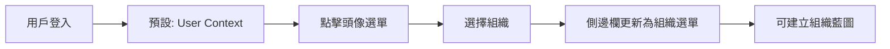
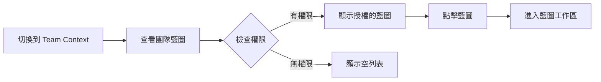
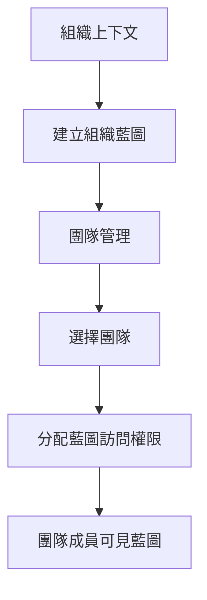

# GigHub 側邊欄功能設計 (Sidebar Features Design)

## 概述 (Overview)

本文檔說明 GigHub 工地施工進度追蹤管理系統中，不同工作區上下文（User, Organization, Team, Bot）的側邊欄「最基礎」功能設計。

This document describes the "most basic" sidebar features design for different workspace contexts (User, Organization, Team, Bot) in the GigHub construction site progress tracking management system.

## 設計原則 (Design Principles)

### 1. 最小化原則 (Minimization Principle)

每個上下文的側邊欄只包含「最基礎」的必要功能：
- ✅ 儀錶盤 (Dashboard) - 資訊概覽
- ✅ 藍圖管理 (Blueprint Management) - 核心業務功能
- ✅ 成員/團隊管理 - 協作基礎
- ✅ 設定 (Settings) - 配置管理
- ❌ 進階功能 - 暫不包含

### 2. 上下文感知 (Context Awareness)

側邊欄功能根據當前工作區上下文動態調整：
- 不同上下文有不同的側邊欄選單
- 功能與權限對應上下文類型
- 藍圖訪問遵循擁有權規則

### 3. 一致性原則 (Consistency Principle)

所有上下文遵循相同的選單結構模式：
```
儀錶盤 (Dashboard)
↓
核心功能 (Core Features)
↓
管理功能 (Management)
↓
設定 (Settings)
```

## 上下文側邊欄設計 (Context Sidebar Design)

### 1. User Context（用戶上下文）

#### 功能清單 (Feature List)

```json
{
  "user": [
    {
      "儀錶盤": {
        "icon": "anticon-dashboard",
        "link": "/dashboard/user",
        "description": "個人工作概覽、待辦事項、最近活動"
      }
    },
    {
      "我的藍圖": {
        "icon": "anticon-project",
        "link": "/blueprint/list",
        "description": "個人建立的藍圖列表、快速訪問、狀態追蹤"
      }
    },
    {
      "個人設定": {
        "icon": "anticon-setting",
        "link": "/user/settings",
        "description": "個人資料、通知設定、偏好設定"
      }
    }
  ]
}
```

#### 設計理由 (Design Rationale)

1. **儀錶盤 (Dashboard)**
   - 最基礎需求：快速查看個人工作狀態
   - 顯示內容：
     - 我的藍圖統計
     - 待辦任務數量
     - 最近訪問的藍圖
     - 活動時間線

2. **我的藍圖 (My Blueprints)**
   - 最基礎需求：管理個人建立的藍圖
   - 功能包含：
     - 建立新藍圖
     - 查看藍圖列表
     - 快速進入藍圖
     - 藍圖狀態（草稿/活躍/封存）

3. **個人設定 (Settings)**
   - 最基礎需求：管理個人帳戶設定
   - 包含選項：
     - 個人資料編輯
     - 密碼修改
     - 通知偏好
     - 語言和時區

#### 限制說明 (Limitations)

- ❌ 不包含組織管理功能
- ❌ 不包含團隊協作功能
- ✅ 可以被邀請到組織/團隊藍圖作為協作者

### 2. Organization Context（組織上下文）

#### 功能清單 (Feature List)

```json
{
  "organization": [
    {
      "組織儀錶盤": {
        "icon": "anticon-dashboard",
        "link": "/dashboard/organization",
        "description": "組織整體概覽、藍圖統計、成員活動"
      }
    },
    {
      "組織藍圖": {
        "icon": "anticon-project",
        "link": "/organization/blueprints",
        "description": "組織建立的藍圖、藍圖分類、訪問控制"
      }
    },
    {
      "成員管理": {
        "icon": "anticon-team",
        "link": "/organization/members",
        "description": "成員列表、角色分配、邀請管理"
      }
    },
    {
      "團隊管理": {
        "icon": "anticon-usergroup-add",
        "link": "/organization/teams",
        "description": "團隊建立、團隊成員、團隊權限"
      }
    },
    {
      "組織設定": {
        "icon": "anticon-setting",
        "link": "/organization/settings",
        "description": "組織資料、帳單資訊、整合設定"
      }
    }
  ]
}
```

#### 設計理由 (Design Rationale)

1. **組織儀錶盤 (Organization Dashboard)**
   - 最基礎需求：監控組織整體狀況
   - 顯示內容：
     - 組織藍圖數量與狀態
     - 活躍成員統計
     - 團隊活動概覽
     - 重要通知

2. **組織藍圖 (Organization Blueprints)**
   - 最基礎需求：管理組織級別的專案
   - 功能包含：
     - 建立組織藍圖
     - 藍圖分類管理
     - 設定團隊訪問權限
     - 藍圖效能分析

3. **成員管理 (Member Management)**
   - 最基礎需求：管理組織成員
   - 功能包含：
     - 邀請新成員
     - 分配組織角色（Owner/Admin/Member）
     - 查看成員活動
     - 停用/移除成員

4. **團隊管理 (Team Management)**
   - 最基礎需求：組織內部團隊結構
   - 功能包含：
     - 建立團隊
     - 分配團隊成員
     - 設定團隊權限
     - 團隊藍圖訪問控制

5. **組織設定 (Organization Settings)**
   - 最基礎需求：組織配置與管理
   - 包含選項：
     - 組織資料編輯
     - Logo 與品牌設定
     - 整合設定（如第三方工具）
     - 帳單與訂閱管理

#### 權限層級 (Permission Levels)

```typescript
enum OrganizationRole {
  OWNER = 'owner',     // 完全控制權
  ADMIN = 'admin',     // 管理權限（除刪除組織外）
  MEMBER = 'member'    // 基本訪問權限
}
```

#### 限制說明 (Limitations)

- ✅ 只有 Owner/Admin 可以建立藍圖
- ✅ 只有 Owner/Admin 可以管理成員和團隊
- ✅ Member 可以訪問被授權的藍圖

### 3. Team Context（團隊上下文）

#### 功能清單 (Feature List)

```json
{
  "team": [
    {
      "團隊工作臺": {
        "icon": "anticon-dashboard",
        "link": "/dashboard/team",
        "description": "團隊待辦任務、藍圖進度、成員狀態"
      }
    },
    {
      "團隊藍圖": {
        "icon": "anticon-project",
        "link": "/team/blueprints",
        "description": "團隊可訪問的組織藍圖（只讀訪問）",
        "note": "團隊不能建立藍圖，只能訪問組織藍圖"
      }
    },
    {
      "團隊成員": {
        "icon": "anticon-team",
        "link": "/team/members",
        "description": "團隊成員列表、角色、聯絡資訊"
      }
    }
  ]
}
```

#### 設計理由 (Design Rationale)

1. **團隊工作臺 (Team Workspace)**
   - 最基礎需求：團隊協作中心
   - 顯示內容：
     - 團隊待辦事項
     - 分配給團隊的任務
     - 團隊藍圖快速訪問
     - 成員活動狀態

2. **團隊藍圖 (Team Blueprints)**
   - 最基礎需求：訪問組織分配的藍圖
   - 重要限制：
     - ❌ 團隊**不能建立**藍圖
     - ✅ 只能訪問組織授權的藍圖
     - ✅ 可以在藍圖內執行任務
     - ✅ 權限由組織管理員設定

3. **團隊成員 (Team Members)**
   - 最基礎需求：了解團隊組成
   - 功能包含：
     - 查看成員列表
     - 成員角色（Leader/Member）
     - 聯絡資訊
     - 成員狀態（線上/離線）

#### 權限層級 (Permission Levels)

```typescript
enum TeamRole {
  LEADER = 'leader',   // 團隊領導（管理團隊成員）
  MEMBER = 'member'    // 團隊成員（協作執行任務）
}
```

#### 重要限制 (Critical Limitations)

⚠️ **團隊與藍圖的關係**

```
組織 (Organization)
  ├─ 建立 → 藍圖 A
  ├─ 建立 → 藍圖 B
  └─ 建立 → 團隊 1
       └─ 授權訪問 → 藍圖 A（只讀）
```

- 團隊是組織的子單元
- 團隊**不能建立**藍圖
- 團隊只能訪問組織授權的藍圖
- 團隊成員在藍圖中的權限由組織控制

### 4. Bot Context（機器人上下文）

#### 功能清單 (Feature List)

```json
{
  "bot": [
    {
      "機器人控制台": {
        "icon": "anticon-dashboard",
        "link": "/dashboard/monitor",
        "description": "機器人狀態監控、日誌、性能指標"
      }
    }
  ]
}
```

#### 設計理由 (Design Rationale)

1. **機器人控制台 (Bot Dashboard)**
   - 最基礎需求：監控機器人運行狀態
   - 顯示內容：
     - 機器人狀態（運行/停止/錯誤）
     - 執行日誌
     - 性能指標
     - 錯誤報告

#### 重要限制 (Critical Limitations)

⚠️ **機器人的限制**

- ❌ 機器人**不能建立**藍圖
- ❌ 機器人**不能管理**成員或團隊
- ✅ 機器人可以被授權訪問藍圖（自動化任務）
- ✅ 機器人適用於自動化工作流程

## 藍圖訪問矩陣 (Blueprint Access Matrix)

| 上下文 (Context) | 建立藍圖 (Create) | 訪問藍圖 (Access) | 管理權限 (Manage) |
|-----------------|------------------|------------------|------------------|
| User            | ✅ 個人藍圖       | ✅ 自己的藍圖      | ✅ 完全控制       |
| Organization    | ✅ 組織藍圖       | ✅ 組織的藍圖      | ✅ 完全控制       |
| Team            | ❌ 不能建立       | ✅ 授權的藍圖      | ❌ 只讀訪問       |
| Bot             | ❌ 不能建立       | ✅ 授權的藍圖      | ❌ 只讀訪問       |

## 選單資料結構 (Menu Data Structure)

### ng-zorro-antd Menu 格式 (Format)

```typescript
interface MenuItem {
  text: string;              // 顯示文字
  i18n?: string;            // 國際化 key
  icon?: string;            // 圖標（ng-zorro icon type）
  link?: string;            // 路由連結
  badge?: number;           // 徽章數字（未讀通知等）
  group?: boolean;          // 是否為群組
  children?: MenuItem[];    // 子選單
  hideInBreadcrumb?: boolean; // 是否在麵包屑中隱藏
  shortcutRoot?: boolean;   // 是否為快捷根節點
}
```

### 實作範例 (Implementation Example)

```typescript
// src/app/layout/basic/basic.component.ts
import { Component, inject, computed } from '@angular/core';
import { WorkspaceContextService } from '@shared/services/workspace-context.service';
import { MenuService } from '@delon/theme';

@Component({
  selector: 'app-basic-layout',
  template: `
    <layout-default>
      <layout-sidebar>
        <div layout-sider-logo>
          <a [routerLink]="['/']">
            <h1>GigHub</h1>
          </a>
        </div>
        <!-- 動態側邊欄選單 -->
        <sidebar-nav [items]="menu()"></sidebar-nav>
      </layout-sidebar>
      
      <layout-header>
        <!-- 上下文切換器 -->
        <app-context-switcher></app-context-switcher>
      </layout-header>
      
      <router-outlet></router-outlet>
    </layout-default>
  `
})
export class BasicComponent {
  private workspaceContext = inject(WorkspaceContextService);
  private menuService = inject(MenuService);
  
  // 根據上下文自動載入對應選單
  menu = computed(() => {
    const contextType = this.workspaceContext.contextType();
    return this.menuService.getMenuByContext(contextType);
  });
}
```

## 使用者體驗流程 (User Experience Flow)

### 場景 1: 用戶切換上下文



### 場景 2: 團隊成員訪問藍圖



### 場景 3: 組織管理員分配權限



## 實作檢查清單 (Implementation Checklist)

### Phase 1: 基礎結構
- [x] 定義 `app-data.json` 選單結構
- [x] 建立 Blueprint 邏輯容器設計文件
- [ ] 實作 WorkspaceContextService 上下文切換
- [ ] 實作動態選單載入

### Phase 2: User Context
- [ ] 實作用戶儀錶盤
- [ ] 實作我的藍圖列表頁
- [ ] 實作個人設定頁

### Phase 3: Organization Context
- [ ] 實作組織儀錶盤
- [ ] 實作組織藍圖管理
- [ ] 實作成員管理功能
- [ ] 實作團隊管理功能
- [ ] 實作組織設定頁

### Phase 4: Team Context
- [ ] 實作團隊工作臺
- [ ] 實作團隊藍圖列表（只讀）
- [ ] 實作團隊成員頁面

### Phase 5: Bot Context
- [ ] 實作機器人控制台
- [ ] 實作機器人日誌監控

### Phase 6: 整合測試
- [ ] 測試上下文切換
- [ ] 測試權限控制
- [ ] 測試藍圖訪問規則
- [ ] 測試選單動態載入

## 技術規格 (Technical Specifications)

### 使用的技術棧 (Technology Stack)

- **Angular**: 20.3.0 (Standalone Components, Signals)
- **ng-alain**: 20.1.0 (Admin 框架)
- **ng-zorro-antd**: 20.3.1 (UI 元件庫)

### 狀態管理 (State Management)

使用 Angular Signals 進行反應式狀態管理：

```typescript
// 選單狀態
const currentMenu = signal<MenuItem[]>([]);

// 上下文狀態
const contextType = signal<ContextType>('user');

// 計算屬性
const menuItems = computed(() => {
  return getMenuByContext(contextType());
});
```

### 路由守衛 (Route Guards)

```typescript
// 檢查 Blueprint 訪問權限
export const blueprintAccessGuard: CanActivateFn = (route, state) => {
  const blueprintService = inject(BlueprintService);
  const workspaceContext = inject(WorkspaceContextService);
  
  const blueprintId = route.params['id'];
  const contextType = workspaceContext.contextType();
  
  // 團隊和機器人不能建立藍圖
  if (contextType === 'team' || contextType === 'bot') {
    if (state.url.includes('/create')) {
      return false; // 重定向到列表頁
    }
  }
  
  return blueprintService.hasAccess(blueprintId);
};
```

## 未來擴展 (Future Extensions)

### 可能的進階功能

1. **個人化選單**
   - 用戶可自訂選單順序
   - 常用功能快捷方式
   - 隱藏不常用功能

2. **快捷鍵支援**
   - 鍵盤導航選單
   - 全局搜尋功能
   - 快速切換上下文

3. **選單分析**
   - 追蹤功能使用頻率
   - 優化選單結構
   - 個人化推薦

4. **進階權限**
   - 細粒度權限控制
   - 自訂角色
   - 權限繼承規則

## 總結 (Summary)

本設計遵循「最小化原則」，為每個上下文提供「最基礎」的必要功能：

### User Context (3 功能)
- ✅ 儀錶盤、我的藍圖、個人設定

### Organization Context (5 功能)
- ✅ 組織儀錶盤、組織藍圖、成員管理、團隊管理、組織設定

### Team Context (3 功能)
- ✅ 團隊工作臺、團隊藍圖（只讀）、團隊成員

### Bot Context (1 功能)
- ✅ 機器人控制台

**重要原則**：
- 只有 User 和 Organization 可以建立藍圖
- Team 和 Bot 只能訪問授權的藍圖
- 側邊欄根據上下文動態調整
- 權限與上下文類型緊密整合
