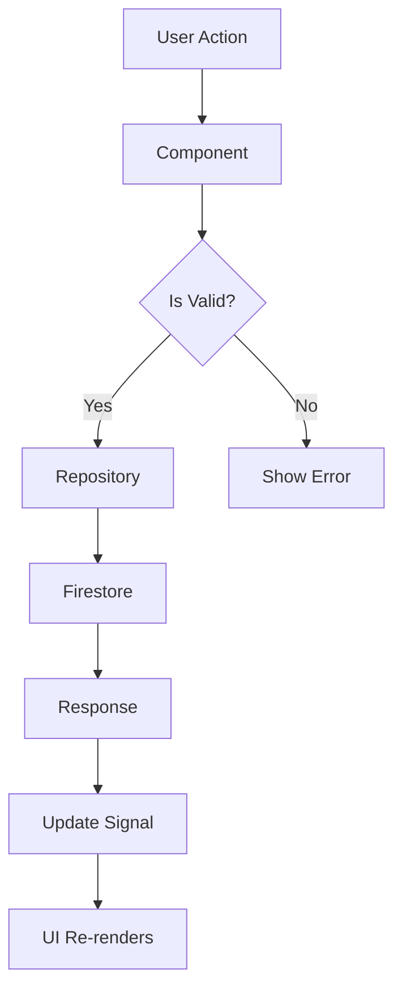

# Team Management Refactoring - Technical Documentation

## Architecture Overview

This document provides technical details about the refactored team management system, focusing on the modern Angular 20 patterns and architectural decisions.

## Modern Angular 20 Patterns

### 1. Signals for State Management

#### Why Signals?
- Fine-grained reactivity without Zone.js overhead
- Better performance than RxJS for synchronous state
- Clearer data flow and dependencies
- Automatic change detection optimization

#### Implementation Example
```typescript
export class OrganizationTeamsComponent {
  // Private state signal
  private readonly teamsState = signal<Team[]>([]);
  
  // Public loading signal
  loading = signal(false);
  
  // Computed signal (derived state)
  readonly teams = computed<Team[]>(() => {
    const orgId = this.currentOrgId();
    if (!orgId) return [];
    return this.teamsState();
  });
  
  // Effect for side effects
  constructor() {
    effect(() => {
      const orgId = this.currentOrgId();
      if (orgId) {
        this.loadTeams(orgId);
      }
    });
  }
}
```

### 2. input() Function (Angular 19+)

#### Migration from @Input()
**Before (Old Pattern)**:
```typescript
export class CreateTeamComponent {
  @Input() organizationId?: string;
}
```

**After (Modern Pattern)**:
```typescript
export class CreateTeamComponent {
  organizationId = input.required<string>();
  // or
  organizationId = input<string>(); // optional
}
```

#### Benefits
- Type-safe and reactive
- Better null safety
- Works seamlessly with signals
- Required vs optional is explicit

### 3. Standalone Components

All components are standalone, eliminating the need for NgModules:

```typescript
@Component({
  selector: 'app-team-members',
  standalone: true,
  imports: [
    SHARED_IMPORTS,
    NzTableModule,
    NzTagModule,
    // ... other imports
  ],
  // ...
})
```

### 4. OnPush Change Detection

All components use `ChangeDetectionStrategy.OnPush` for optimal performance:

```typescript
@Component({
  // ...
  changeDetection: ChangeDetectionStrategy.OnPush
})
```

Benefits:
- Components only re-render when signals change
- Reduces unnecessary change detection cycles
- Better performance for large applications

## Component Architecture

### Component Hierarchy

```
App
├── Layout (Basic)
│   └── Header Context Switcher
│       └── Organization / Team Selection
│
├── Organization Routes
│   ├── Members
│   ├── Teams (OrganizationTeamsComponent)
│   │   ├── CreateTeamModalComponent
│   │   └── EditTeamModalComponent
│   └── Settings
│
└── Team Routes
    └── Members (TeamMembersComponent)
        └── Add Member Modal (inline)
```

### Data Flow



### State Management Flow

```typescript
// 1. User triggers action
openCreateTeamModal() {
  // 2. Open modal with input data
  const modalRef = this.modal.create({
    nzContent: CreateTeamModalComponent,
    nzData: { organizationId: this.currentOrgId() }
  });
  
  // 3. Wait for result
  modalRef.afterClose.subscribe((team: Team) => {
    if (team) {
      // 4. Reload data
      this.loadTeams(team.organization_id);
    }
  });
}

// 5. Load updates signal
private loadTeams(orgId: string) {
  this.teamRepository.findByOrganization(orgId).subscribe({
    next: (teams) => this.teamsState.set(teams)
  });
}

// 6. Computed signal updates automatically
readonly teams = computed(() => {
  return this.teamsState();
});
```

## Repository Pattern

### Design Philosophy
Following the Repository pattern for data access abstraction:

```typescript
@Injectable({ providedIn: 'root' })
export class TeamRepository {
  private firestore = inject(Firestore);
  
  // CRUD operations
  async create(team: Omit<Team, 'id'>): Promise<Team>
  async update(id: string, data: Partial<Team>): Promise<void>
  async delete(id: string): Promise<void>
  findById(id: string): Observable<Team | null>
  findByOrganization(orgId: string): Observable<Team[]>
}
```

### RxJS Integration

Repositories return Observables for async operations:

```typescript
findByOrganization(orgId: string): Observable<Team[]> {
  const q = query(
    this.getCollectionRef(),
    where('organization_id', '==', orgId)
  );
  
  return from(getDocs(q)).pipe(
    map(snapshot => 
      snapshot.docs.map(doc => this.toTeam(doc.data(), doc.id))
    ),
    catchError(error => {
      this.logger.error('findByOrganization failed', error);
      return of([]);
    })
  );
}
```

## Form Management

### Reactive Forms with Validation

All forms use reactive forms with proper validation:

```typescript
form: FormGroup = this.fb.group({
  name: ['', [
    Validators.required,
    Validators.minLength(2),
    Validators.maxLength(50)
  ]],
  description: ['', [
    Validators.maxLength(500)
  ]]
});

get nameErrorTip(): string {
  const control = this.form.get('name');
  if (control?.hasError('required')) {
    return '請輸入團隊名稱';
  }
  if (control?.hasError('minlength')) {
    return '團隊名稱至少需要 2 個字符';
  }
  if (control?.hasError('maxlength')) {
    return '團隊名稱最多 50 個字符';
  }
  return '';
}
```

### Form Submission Pattern

```typescript
async submit(): Promise<void> {
  // 1. Validate form
  if (this.form.invalid) {
    Object.values(this.form.controls).forEach(control => {
      control.markAsTouched();
      control.updateValueAndValidity();
    });
    return;
  }
  
  // 2. Set loading state
  this.loading.set(true);
  
  try {
    // 3. Call repository
    const result = await this.repository.create(this.form.value);
    
    // 4. Show success message
    this.message.success('操作成功');
    
    // 5. Close modal with result
    this.modal.destroy(result);
  } catch (error) {
    // 6. Handle error
    console.error('Operation failed:', error);
    this.message.error('操作失敗');
    this.loading.set(false);
  }
}
```

## Modal Pattern

### Modern Modal Usage with ng-zorro-antd

#### Creating Modal with Component
```typescript
const modalRef = this.modal.create({
  nzTitle: '建立團隊',
  nzContent: CreateTeamModalComponent,
  nzData: {
    organizationId: 'org-123'
  },
  nzFooter: null,  // Component handles footer
  nzWidth: 520
});
```

#### Modal Component Implementation
```typescript
@Component({
  selector: 'app-create-team-modal',
  template: `
    <div class="modal-content">
      <form [formGroup]="form">
        <!-- form fields -->
      </form>
      
      <div class="modal-footer">
        <button (click)="cancel()">取消</button>
        <button (click)="submit()">確定</button>
      </div>
    </div>
  `
})
export class CreateTeamModalComponent {
  // Access modal data via input()
  organizationId = input.required<string>();
  
  // Inject modal reference
  private modal = inject(NzModalRef);
  
  cancel() {
    this.modal.destroy();
  }
  
  submit() {
    // ... validation and save
    this.modal.destroy(result);
  }
}
```

#### Handling Modal Results
```typescript
modalRef.afterClose.subscribe((result: Team | undefined) => {
  if (result) {
    console.log('Team created:', result);
    this.loadTeams(result.organization_id);
  }
});
```

## Performance Optimizations

### 1. Signal-based Reactivity
- Signals provide fine-grained reactivity
- Only affected components re-render
- No Zone.js overhead

### 2. OnPush Change Detection
- Components only check when:
  - Input signals change
  - Events fire
  - Observables emit
  - Manual markForCheck()

### 3. Computed Signals
- Memoization built-in
- Only recalculate when dependencies change
- Efficient for derived state

### 4. Lazy Loading
- Routes are lazy loaded
- Reduces initial bundle size
- Faster app startup

### 5. Effect for Auto-reload
```typescript
constructor() {
  effect(() => {
    const orgId = this.currentOrgId();
    if (orgId) {
      this.loadTeams(orgId);
    }
  });
}
```
- Automatically reloads when context changes
- No manual subscription management
- Clean and declarative

## Error Handling Strategy

### Repository Level
```typescript
findByOrganization(orgId: string): Observable<Team[]> {
  return from(getDocs(query)).pipe(
    map(snapshot => this.toTeams(snapshot)),
    catchError(error => {
      this.logger.error('findByOrganization failed', error);
      return of([]); // Return empty array on error
    })
  );
}
```

### Component Level
```typescript
private loadTeams(orgId: string): void {
  this.loading.set(true);
  this.teamRepository.findByOrganization(orgId).subscribe({
    next: (teams) => {
      this.teamsState.set(teams);
      this.loading.set(false);
    },
    error: (error) => {
      console.error('Failed to load teams:', error);
      this.teamsState.set([]);
      this.loading.set(false);
      this.message.error('載入失敗');
    }
  });
}
```

### User Feedback
- Success messages: `this.message.success('操作成功')`
- Error messages: `this.message.error('操作失敗')`
- Warning messages: `this.message.warning('注意事項')`
- Loading states: `loading = signal(false)`

## Testing Considerations

### Unit Testing with Signals

```typescript
describe('OrganizationTeamsComponent', () => {
  let component: OrganizationTeamsComponent;
  let fixture: ComponentFixture<OrganizationTeamsComponent>;
  
  beforeEach(() => {
    TestBed.configureTestingModule({
      imports: [OrganizationTeamsComponent],
      providers: [
        { provide: TeamRepository, useValue: mockTeamRepository }
      ]
    });
    
    fixture = TestBed.createComponent(OrganizationTeamsComponent);
    component = fixture.componentInstance;
  });
  
  it('should load teams when organization context changes', () => {
    // Arrange
    const teams = [{ id: '1', name: 'Team 1' }];
    spyOn(mockTeamRepository, 'findByOrganization').and.returnValue(of(teams));
    
    // Act
    // Trigger effect by changing organization context
    component.ngOnInit();
    
    // Assert
    expect(component.teams()).toEqual(teams);
  });
});
```

### Integration Testing

Test complete user flows:
1. Create team
2. Verify in list
3. Edit team
4. Verify changes
5. Delete team
6. Verify removal

## Migration Guide

### From Old Pattern to New Pattern

#### 1. Replace @Input() with input()
```typescript
// Before
@Input() organizationId?: string;

// After
organizationId = input<string>();
// or
organizationId = input.required<string>();
```

#### 2. Replace BehaviorSubject with Signal
```typescript
// Before
private teamsSubject = new BehaviorSubject<Team[]>([]);
teams$ = this.teamsSubject.asObservable();

// After
private teamsState = signal<Team[]>([]);
teams = computed(() => this.teamsState());
```

#### 3. Replace *ngIf with @if
```typescript
// Before
<div *ngIf="loading">Loading...</div>

// After
@if (loading()) {
  <div>Loading...</div>
}
```

#### 4. Replace *ngFor with @for
```typescript
// Before
<div *ngFor="let team of teams; track team.id">
  {{ team.name }}
</div>

// After
@for (team of teams(); track team.id) {
  <div>{{ team.name }}</div>
}
```

## Security Considerations

### 1. Input Validation
All user inputs are validated before submission:
- Form validators (required, minLength, maxLength)
- Server-side validation in Firestore rules

### 2. XSS Prevention
- Angular's built-in sanitization
- No innerHTML usage
- All user content is bound via interpolation

### 3. Authentication & Authorization
- User must be authenticated
- Organization membership verified
- Team permissions checked via Firestore rules

### 4. Firestore Security Rules
```javascript
// Example rules
match /teams/{teamId} {
  allow read: if isOrganizationMember(resource.data.organization_id);
  allow create: if isOrganizationMember(request.resource.data.organization_id);
  allow update: if isOrganizationMember(resource.data.organization_id);
  allow delete: if isOrganizationAdmin(resource.data.organization_id);
}
```

## Future Enhancements

### Planned Features
1. **Team Templates**: Pre-configured team structures
2. **Member Roles**: More granular permission system
3. **Team Analytics**: Member activity tracking
4. **Bulk Operations**: Add/remove multiple members
5. **Search & Filter**: Advanced member search
6. **Team Archiving**: Soft delete teams
7. **Team Cloning**: Duplicate existing teams
8. **Member Import**: CSV import for bulk member addition

### Technical Improvements
1. **Virtual Scrolling**: For large member lists
2. **Pagination**: Server-side pagination for teams
3. **Real-time Updates**: WebSocket for live updates
4. **Offline Support**: PWA with service workers
5. **Optimistic UI**: Instant feedback before server confirmation
6. **Undo/Redo**: Action history and reversal
7. **Keyboard Shortcuts**: Power user features
8. **Accessibility**: WCAG 2.1 AAA compliance

## Troubleshooting

### Common Issues

#### Issue: Signals not updating UI
**Solution**: Ensure you're calling the signal as a function `signal()` not `signal`

#### Issue: Modal not closing
**Solution**: Make sure to call `this.modal.destroy()` or return a value from `nzOnOk`

#### Issue: Form validation not working
**Solution**: 
1. Check validators are properly configured
2. Mark fields as touched on submit
3. Call `updateValueAndValidity()`

#### Issue: Loading state stuck
**Solution**: Always set loading to false in both success and error callbacks

## References

- [Angular Signals Documentation](https://angular.dev/guide/signals)
- [Angular Standalone Components](https://angular.dev/guide/components/importing)
- [ng-zorro-antd Documentation](https://ng.ant.design/)
- [RxJS Documentation](https://rxjs.dev/)
- [TypeScript Handbook](https://www.typescriptlang.org/docs/)

---

**Last Updated**: 2025-12-10
**Version**: 1.0.0
**Angular Version**: 20.3.0
