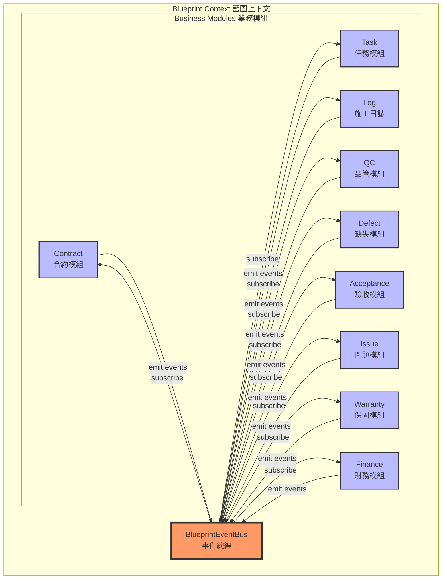
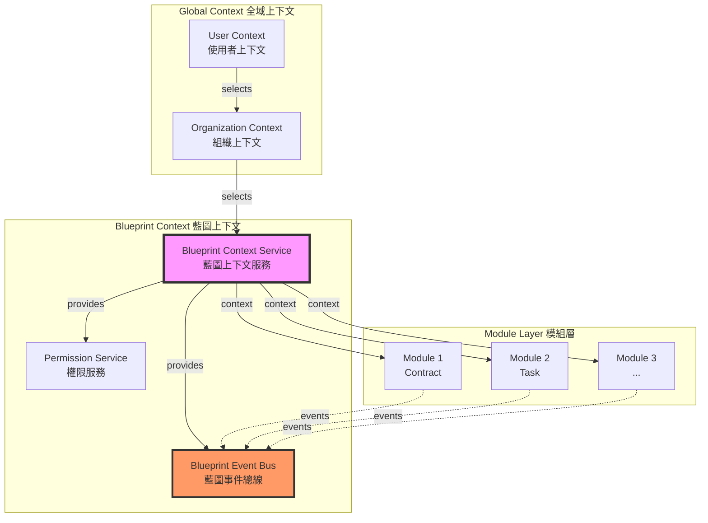

# 📝 用戶需求提交區

> **使用說明**: 請在下方區塊中直接描述您的需求，使用自然語言即可。Copilot Agent 將會自動將您的需求轉換為結構化的開發任務。

## 原始需求

```
[請在此處輸入您的需求描述]

範例：
- 我想要新增一個任務管理功能，可以讓使用者建立、編輯、刪除任務
- 需要在施工日誌中加入照片上傳功能
- 希望能夠匯出施工進度報表為 PDF 格式
```

---

## 🤖 Copilot Agent 轉換指引

> **⚠️ Copilot Agent 專用區域** - 請將上方「原始需求」轉換為下方結構化格式

### 轉換流程

1. **理解需求階段**
   - 仔細閱讀用戶的原始需求
   - 識別核心功能點和業務目標
   - 確認需求的範圍和優先級

2. **使用必要工具** (MANDATORY)
   - ✅ 使用 **context7** 查詢相關技術文檔和最佳實踐
   - ✅ 使用 **sequential-thinking** 進行邏輯分析和問題拆解
   - ✅ 使用 **software-planning-tool** 制定實施計畫

3. **格式化輸出**
   - 將需求轉換為「任務定義」格式
   - 填寫完整的分析和規劃章節
   - 確保符合專案架構規範

### 轉換檢查清單

#### 🔧 工具使用驗證
- [ ] 已使用 context7 查詢技術文檔
- [ ] 已使用 sequential-thinking 分析需求
- [ ] 已使用 software-planning-tool 制定計畫

#### 🏗️ 三層架構嚴格分離
- [ ] 已確認 UI 層（routes/）僅負責展示與使用者互動
- [ ] 已確認 Service 層（core/services/）負責業務邏輯協調
- [ ] 已確認 Repository 層（core/data-access/）負責資料存取抽象
- [ ] 已確認無跨層直接依賴（UI 不直接呼叫 Repository）

#### 📦 Repository 模式強制
- [ ] 禁止直接操作 Firestore，必須使用 Repository 模式
- [ ] 已實作 Firestore Security Rules
- [ ] Repository 放置遵循決策樹（shared/ vs 模組專屬）

#### 🔄 生命週期管理標準化
- [ ] Construction：僅注入依賴
- [ ] Initialization：在 ngOnInit 中執行業務邏輯
- [ ] Active：使用 Signals 處理響應式
- [ ] Cleanup：在 ngOnDestroy 中清理
- [ ] 禁止在 constructor 中執行業務邏輯
- [ ] 禁止在 ngOnDestroy 中執行非同步操作

#### 🔗 上下文傳遞原則
- [ ] 已遵循統一上下文模式：User Context → Organization Context → Blueprint Context → Module Context
- [ ] 已使用 inject() 注入上層上下文服務
- [ ] 已使用 signal() 保存當前上下文狀態
- [ ] 上下文變更會自動傳播到子元件

#### 📡 事件驅動架構 (Blueprint Event Bus - MANDATORY)
- [ ] 🚨 所有模組間通訊透過 BlueprintEventBus（嚴禁直接依賴）
- [ ] 🚨 禁止模組服務直接注入其他模組服務
- [ ] 🚨 禁止跨模組直接查詢 Firestore
- [ ] 事件命名遵循規範：[module].[action]（例如：task.created）
- [ ] 發送事件包含：type、blueprintId、timestamp、actor、data
- [ ] 訂閱事件使用 takeUntilDestroyed() 進行清理
- [ ] 每個服務注入 BlueprintEventBusService
- [ ] 在 constructor 或 ngOnInit 中設定事件監聽器

#### 🧩 模組擴展規範（四階段）
- [ ] 註冊階段：在 module-registry.ts 註冊模塊定義
- [ ] 實作階段：Repository → Service → Component，整合 Event Bus
- [ ] 整合階段：註冊路由與守衛，更新 Firestore Security Rules
- [ ] 測試階段：單元測試、元件測試、整合測試、E2E 測試

#### 🔒 安全性原則（Security First）
- [ ] 已實作 Firestore Security Rules
- [ ] 在守衛中使用 permissionService.hasRole() 檢查角色
- [ ] 在元件中使用 permissionService.canEdit() 檢查權限
- [ ] 禁止在客戶端信任使用者輸入

#### ⚡ 效能優化原則
- [ ] 使用懶載入模式（Lazy Loading）
- [ ] 使用 OnPush 變更檢測策略
- [ ] 使用 Firestore Snapshots 進行即時資料同步
- [ ] 使用 computed() 快取衍生狀態，避免不必要計算

#### ♿ 可訪問性原則（Accessibility）
- [ ] 遵循 WCAG 2.1 指南
- [ ] 使用語義化 HTML
- [ ] 提供適當的 ARIA 標籤
- [ ] 支援鍵盤導航

#### 🚫 禁止行為清單
- [ ] 已確認無建立 NgModule
- [ ] 已確認無使用 NgRx/Redux
- [ ] 已確認無建立不必要的 Facade 層
- [ ] 已確認無手動管理訂閱
- [ ] 已確認無使用 any 類型
- [ ] 已確認無忽略錯誤處理
- [ ] 已確認無直接操作 Firestore
- [ ] 已確認無建立 SQL/RLS（使用 Firestore Security Rules）

#### 🎯 決策樹驗證
- [ ] 狀態管理：需要 → 使用 signal()；不需要 → 無狀態
- [ ] 衍生狀態：需要 → 使用 computed()；不需要 → 直接使用原始 signal
- [ ] 訂閱管理：需要 → 使用 takeUntilDestroyed()；不需要 → 不訂閱
- [ ] 新模塊：需要 → 遵循「模塊擴展規範」；不需要 → 擴展現有模塊
- [ ] 錯誤處理：可恢復 → recoverable=true；不可恢復 → recoverable=false

---

> **工作流程**: 理解需求 → 格式化任務 → 分析 → 規劃 → 實施
---
## 🎯 任務定義
### 名稱
### 背景 / 目的
### 需求說明
### In Scope / Out of Scope
### 功能行為
### 資料 / API
- **說明**: 需要的資料模型、API 端點、Firestore 集合結構
### 影響範圍
- **說明**: 列出會受影響的模組、元件、服務、路由
### 驗收條件
- **說明**: 可測試、可驗證的驗收標準
## 🔍 分析階段
> **Agent 指引**: 在此區塊進行技術分析，必須使用以下工具和流程：
### 步驟 1: 查詢官方文件 (Context7)
- **目的**: 查詢Context7獲取最新最佳實踐
### 步驟 2: 循序思考分析 (Sequential Thinking)
- **目的**: 將複雜問題拆解成可驗證的思考步驟
### 步驟 3: 制定開發計畫 (Software Planning Tool)
- **目的**: 將需求轉化為可執行的開發計畫

### 分析輸出格式
```markdown
## 技術分析

### 1. 架構影響分析
- [ ] 檢查是否符合 `docs/architecture/FINAL_PROJECT_STRUCTURE.md` 結構
- [ ] 確認 Repository 放置位置（shared/ 或模組專屬）
- [ ] 確認是否需要新增 Store 或使用現有 Store

### 2. 依賴關係分析
- [ ] 識別需要使用的現有服務、Repository、Store
- [ ] 確認模組間依賴關係
- [ ] 檢查是否需要更新 Firestore Security Rules

### 3. 技術方案評估
- [ ] 評估不同實作方案的優缺點
- [ ] 選擇最符合專案規範的方案
- [ ] 確認技術可行性

### 4. 風險識別
- [ ] 列出潛在技術風險
- [ ] 評估風險影響程度
- [ ] 制定風險緩解措施
```

## 📐 規劃階段

> **Agent 指引**: 基於分析結果，制定詳細的實施計畫。必須遵循專案架構規範。

### 實施步驟

#### Phase 1: 準備階段
#### Phase 2: 資料層實作
#### Phase 3: 元件實作
#### Phase 4: 路由整合
#### Phase 5: 測試與驗證

### 檔案清單
- **新增檔案**:

- **修改檔案**:

## 📜 開發規範

# 規範:
- ⭐使用Context7(即時查詢並引用「官方文件」作為上下文，避免憑印象或過時知識做決策。)
- ⭐使用sequential-thinking(用「一步接一步」的邏輯順序，把複雜問題拆解成可驗證、可執行的思考流程。)
- ⭐使用software-planning-tool(把需求轉化為「可實作的開發計畫」，系統性拆解成任務、順序、風險與交付物。)
- ⭐基於奧卡姆剃刀定律
- 1️⃣ KISS (Keep It Simple, Stupid)
- 2️⃣ YAGNI（You Aren’t Gonna Need It）
- 3️⃣ 最小可行方案(MVP / MVS)
- 4️⃣ 單一職責原則（SRP）
- 5️⃣ 低耦合、高內聚
- 6️⃣ 法則（帕雷托原則）
- 7️⃣ 技術債是「利息」不是「罪惡」
- 8️⃣ 可讀性 > 聰明 
- 9️⃣失敗要可控（Fail Fast, Fail Safe）
- ⭐藍圖內所有模組都必須透過Events (事件總線)交互
- ⭐擴展需基於docs\architecture\FINAL_PROJECT_STRUCTURE.md結構

### 🔗 專案特定規範

#### ⭐ Blueprint 模組事件通訊 (MANDATORY)

**核心原則**: 🚨 **藍圖內所有模組間通訊必須透過 BlueprintEventBus，嚴禁直接依賴**



##### 🚫 禁止模式 (Anti-Patterns)
```typescript
// ❌ 禁止: 模組間直接依賴
@Injectable({ providedIn: 'root' })
export class TaskService {
  private logService = inject(LogService);  // ❌ 直接注入其他模組服務
  
  async completeTask(taskId: string): Promise<void> {
    await this.repository.update(taskId, { status: 'completed' });
    await this.logService.createLog({ taskId });  // ❌ 直接呼叫其他模組
  }
}

// ❌ 禁止: 模組間資料庫互相查詢
@Injectable({ providedIn: 'root' })
export class AcceptanceService {
  private firestore = inject(Firestore);
  
  async checkTaskStatus(taskId: string): Promise<boolean> {
    const taskDoc = await getDoc(doc(this.firestore, 'tasks', taskId));  // ❌ 跨模組查詢
    return taskDoc.data()?.status === 'completed';
  }
}
```

##### ✅ 正確模式 (Correct Patterns)
```typescript
// ✅ 正確: 透過 EventBus 發送事件
@Injectable({ providedIn: 'root' })
export class TaskService {
  private eventBus = inject(BlueprintEventBusService);
  private blueprintContext = inject(BlueprintContextService);
  
  async completeTask(taskId: string): Promise<void> {
    const task = await this.repository.update(taskId, { status: 'completed' });
    
    // 發送領域事件
    this.eventBus.emit({
      type: 'task.completed',
      blueprintId: task.blueprintId,
      timestamp: new Date(),
      actor: this.userContext.currentUser()?.id,
      data: {
        taskId: task.id,
        taskName: task.name,
        completedAt: new Date(),
        workItemId: task.workItemId
      }
    });
  }
}

// ✅ 正確: 訂閱事件並回應
@Injectable({ providedIn: 'root' })
export class LogService {
  private eventBus = inject(BlueprintEventBusService);
  private destroyRef = inject(DestroyRef);
  
  constructor() {
    this.setupEventListeners();
  }
  
  private setupEventListeners(): void {
    this.eventBus.on('task.completed')
      .pipe(takeUntilDestroyed(this.destroyRef))
      .subscribe(event => {
        this.autoCreateLog(event.data);
      });
  }
  
  private async autoCreateLog(data: any): Promise<void> {
    const log = await this.repository.create({
      blueprintId: data.blueprintId,
      taskId: data.taskId,
      type: 'auto_generated',
      content: `任務 ${data.taskName} 已完成`,
      createdAt: new Date()
    });
    
    // 繼續發送事件給下游
    this.eventBus.emit({
      type: 'log.created',
      blueprintId: data.blueprintId,
      timestamp: new Date(),
      data: { logId: log.id, taskId: data.taskId }
    });
  }
}
```

##### 📋 事件命名規範
- **格式**: `[module].[action]`
- **範例**: 
  - `contract.activated` - 合約生效
  - `task.completed` - 任務完成
  - `log.created` - 日誌建立
  - `qc.passed` / `qc.failed` - QC 結果
  - `acceptance.passed` / `acceptance.failed` - 驗收結果
  - `issue.created` / `issue.resolved` - 問題狀態
  - `invoice.generated` - 計價單產生
  - `warranty.started` - 保固開始

##### 🔄 模組整合流程範例

**自動化流程鏈**: Task → Log → QC → Acceptance → Invoice + Warranty

```typescript
// 1. Task 完成 → 自動建立 Log
TaskService.completeTask() 
  → emit('task.completed')
  → LogService listens 
  → auto create log
  → emit('log.created')

// 2. Log 建立 → 自動觸發 QC
LogService.autoCreateLog()
  → emit('log.created')
  → QCService listens
  → create QC record
  → emit('qc.pending_created')

// 3. QC 完成 → 條件分支
QCService.completeInspection()
  → if passed: emit('qc.passed') → AcceptanceService
  → if failed: emit('qc.failed') → DefectService

// 4. Acceptance 通過 → 並行產生 Invoice + Warranty
AcceptanceService.approve()
  → emit('acceptance.passed')
  → InvoiceService listens → create invoice
  → WarrantyService listens → start warranty period
```

#### ⭐ Blueprint 架構規範

**架構層級**: User Context → Organization Context → **Blueprint Context** → Module Context



##### Blueprint Context 職責
1. **上下文管理**: 保存當前藍圖資訊 (currentBlueprint signal)
2. **事件總線**: 提供 BlueprintEventBus 實例
3. **權限控制**: 整合 PermissionService
4. **模組隔離**: 確保模組間透過事件通訊

##### 實作要求
```typescript
// ✅ 每個模組服務必須注入 BlueprintContext
@Injectable({ providedIn: 'root' })
export class TaskService {
  private blueprintContext = inject(BlueprintContextService);
  private eventBus = inject(BlueprintEventBusService);
  
  // 使用 signal 追蹤當前藍圖
  currentBlueprint = computed(() => this.blueprintContext.currentBlueprint());
  
  // 所有操作限定在當前藍圖內
  async getTasks(): Promise<Task[]> {
    const blueprintId = this.currentBlueprint()?.id;
    if (!blueprintId) throw new Error('No active blueprint');
    
    return this.repository.findByBlueprintId(blueprintId);
  }
}
```

#### ⭐ 架構結構規範

所有擴展必須遵循 `docs/architecture/FINAL_PROJECT_STRUCTURE.md` 定義的結構

## ✅ 檢查清單

### 📋 程式碼審查檢查點

#### 架構檢查
- [ ] 遵循三層架構（UI → Service → Repository）
- [ ] 使用 Signals 進行狀態管理
- [ ] 使用 Standalone Components（無 NgModules）
- [ ] 正確使用 inject() 注入依賴

#### 上下文檢查
- [ ] Blueprint Context 正確傳遞
- [ ] 使用 computed() 計算衍生狀態
- [ ] 上下文清理正確實作

#### 事件檢查 (Blueprint Event Bus)
- [ ] 🚨 所有模組間通訊透過 BlueprintEventBus（零直接依賴）
- [ ] 🚨 禁止注入其他模組的 Service
- [ ] 🚨 禁止跨模組 Firestore 查詢
- [ ] 所有領域事件透過 EventBus 發送
- [ ] 事件命名遵循規範：[module].[action]
- [ ] 事件訂閱使用 takeUntilDestroyed()
- [ ] 事件包含完整元數據 (type, blueprintId, timestamp, actor, data)

#### 錯誤處理檢查
- [ ] Service 方法包含 try-catch
- [ ] 拋出類型化錯誤
- [ ] UI 使用 Error Boundary Component
- [ ] 錯誤分級正確設定

#### 生命週期檢查
- [ ] 禁止在 constructor 執行業務邏輯
- [ ] 使用 takeUntilDestroyed() 管理訂閱
- [ ] 手動資源清理在 ngOnDestroy

#### 文檔檢查
- [ ] 更新或建立模塊 AGENTS.md
- [ ] 程式碼包含 JSDoc 註解
- [ ] 複雜邏輯有文字說明

#### 測試檢查
- [ ] 單元測試覆蓋率 > 80%
- [ ] 關鍵業務邏輯有測試
- [ ] E2E 測試涵蓋主要流程

### 💎 程式碼品質
- [ ] TypeScript 嚴格模式無錯誤
- [ ] ESLint 檢查通過
- [ ] 無使用 any 類型
- [ ] 命名清晰且符合規範

### 🏛️ 架構符合性
- [ ] 遵循三層架構分離 (UI → Service → Repository)
- [ ] Repository 模式正確實作
- [ ] 🚨 Blueprint Event Bus 強制使用（模組間零直接依賴）
- [ ] 事件驅動架構正確使用
- [ ] Blueprint Context 正確傳遞
- [ ] 上下文傳遞模式正確

### ✨ 功能完整性
- [ ] 功能需求完整實作
- [ ] 邊界情況處理完整
- [ ] 錯誤處理完整
- [ ] 權限檢查完整

### 📖 文檔完整性
- [ ] README 或 AGENTS.md 已更新
- [ ] API 文檔完整
- [ ] 架構圖已更新（如有變更）
- [ ] 變更日誌已記錄
