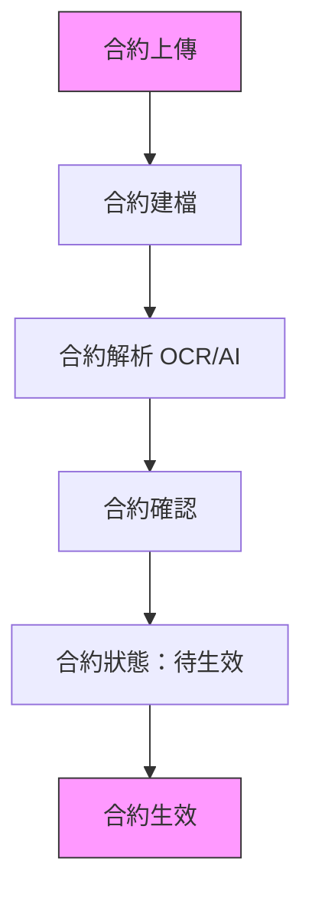
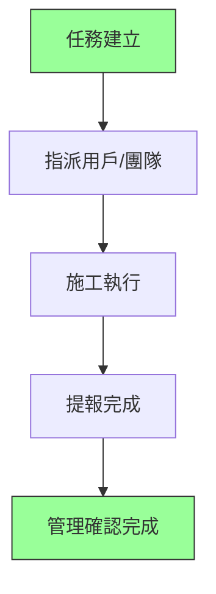
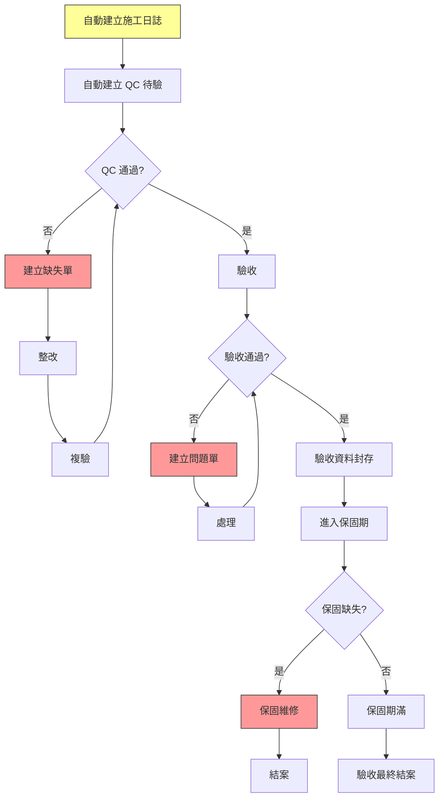
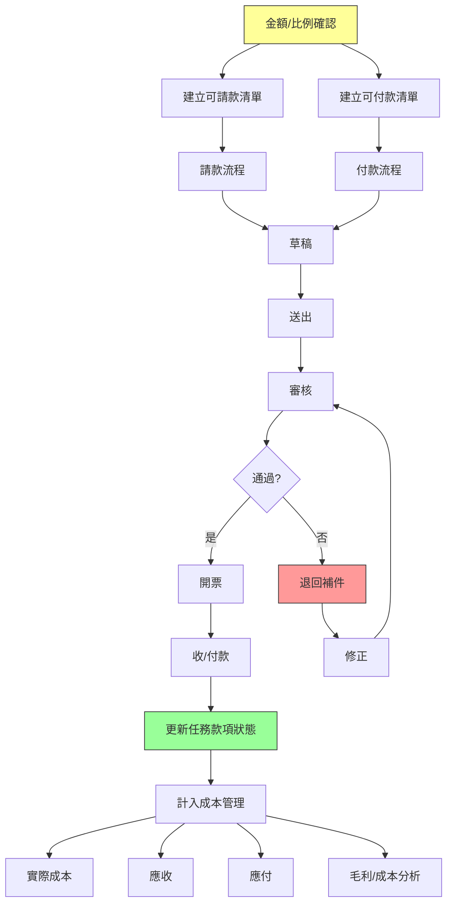
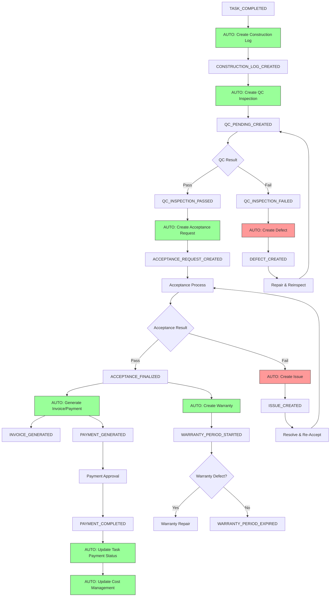
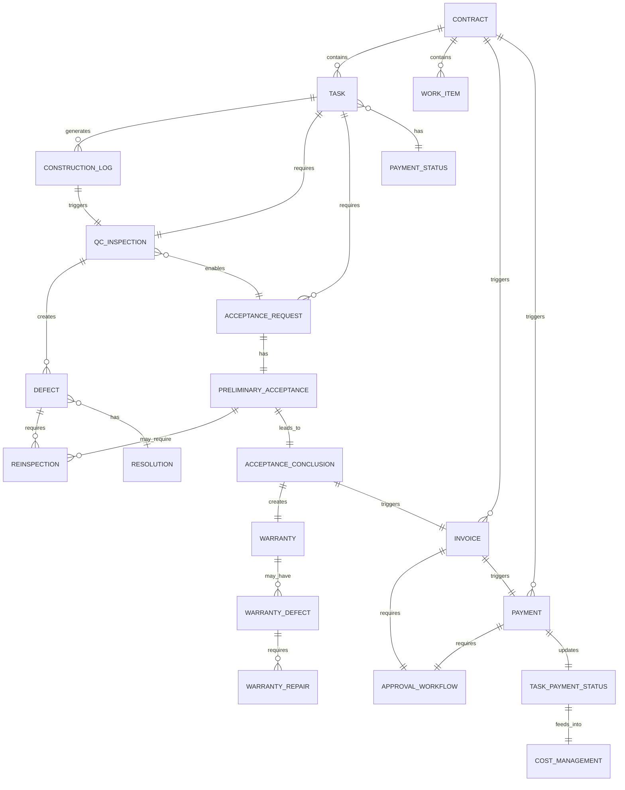
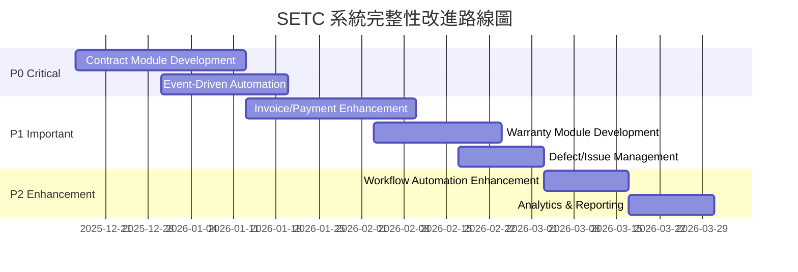

# SETC 工作流程完整性分析報告

> **文件版本**: 1.0.0  
> **分析日期**: 2025-12-15  
> **分析工具**: context7 (Angular v18, Firebase)  
> **分析方法**: 系統工作流程分析 + 模組架構檢視

---

## 📋 執行摘要

本報告基於 `docs/discussions/SETC.md` 定義的工作流程，分析 GigHub 系統的完整性、模組覆蓋度及架構合理性。

### 核心發現

✅ **優勢**:
- 工作流程定義完整且符合建築業實務
- 三層架構設計清晰（合約→品質→財務）
- 現有模組架構支援良好的擴展性
- 事件驅動設計適合工作流程自動化

⚠️ **需要強化**:
- 缺少「合約管理模組」（Contract Module）
- 缺少「保固管理模組」（Warranty Module）
- 缺少「請款/付款模組」（Invoice/Payment Module）
- QA 與 Acceptance 模組需整合缺失單機制
- 財務模組需擴展請款/付款子模組

📊 **完整性評分**: **75/100**
- 基礎架構：95/100 ✅
- 工作流程覆蓋：65/100 ⚠️
- 模組整合度：70/100 ⚠️
- 資料模型：80/100 ✅

---

## 1. SETC 工作流程分析

### 1.1 工作流程三大階段

根據 SETC.md，系統定義了三大核心階段：

#### 📌 階段零：合約建立與來源（0% 實現）



**現狀**: ❌ **缺少 Contract Module**

**需求分析**:
- 合約上傳（PDF/圖檔）
- 合約基本資料建檔（業主、承商資訊）
- AI/OCR 自動解析（條款、金額、工項）
- 合約確認與人工補正
- 合約生效管理（只有已生效合約可建立任務）

**關鍵控制點**:
- 🔒 合約狀態管理（待生效 → 已生效）
- 🔒 合約與任務關聯驗證
- 📝 合約條款變更追蹤
- 🧾 操作紀錄（Audit Log）

#### 📌 階段一：任務與施工階段（90% 實現）



**現狀**: ✅ **Tasks Module 已實現**

**已實現功能**:
- ✅ 任務 CRUD 操作
- ✅ 任務指派
- ✅ 任務狀態管理
- ✅ 任務進度追蹤
- ✅ 子任務支援

**需要增強**:
- ⚠️ 合約關聯驗證（需要 Contract Module）
- ⚠️ 工項金額關聯（需要與 Finance Module 整合）
- ⚠️ 任務完成觸發後續流程（需要 Workflow 整合）

#### 📌 階段二：品質與驗收階段（70% 實現）



**現狀**: ⚠️ **部分實現**

**已實現**:
- ✅ Log Module（施工日誌）
- ✅ QA Module（品質檢查）
- ✅ Acceptance Module（驗收管理）

**缺少實現**:
- ❌ 自動建立施工日誌機制（Event Trigger）
- ❌ 自動建立 QC 待驗機制（Event Trigger）
- ❌ 缺失單管理系統（Defect Management）
- ❌ **問題單管理系統（Issue Management）- 需獨立為 Issue Module** ⭐
- ❌ 保固期管理模組（Warranty Module）
- ❌ 保固維修流程（Warranty Repair）

**整合需求**:
- 需要與 Workflow Module 整合實現自動化流程
- 需要擴展 QA Module 支援缺失單管理
- **需要建立獨立的 Issue Module 支援問題單管理（從 Acceptance 獨立）** ⭐
- 需要建立 Warranty Module 管理保固期

#### 📌 階段三：財務與成本階段（40% 實現）



**現狀**: ⚠️ **基礎架構存在，功能不完整**

**已實現**:
- ✅ Finance Module 基礎架構
- ✅ 成本管理服務（Cost Management）
- ✅ 預算管理服務（Budget）
- ✅ 帳務服務（Ledger）
- ✅ 財務報表服務（Financial Report）

**缺少實現**:
- ❌ 請款管理完整流程（Invoice Management）
- ❌ 付款管理完整流程（Payment Management）
- ❌ 審核流程管理（Approval Workflow）
- ❌ 可請款/可付款百分比計算
- ❌ 自動更新任務款項狀態
- ❌ 業主/承商分離的請款/付款清單

**整合需求**:
- 需要擴展 Finance Module 的 Invoice 和 Payment 子模組
- 需要與 Workflow Module 整合實現審核流程
- 需要與 Task Module 整合實現款項狀態自動更新
- 需要與 Acceptance Module 整合實現驗收觸發請款

---

## 2. 模組完整性評估

### 2.1 現有模組清單

| 模組名稱 | 模組 ID | 狀態 | SETC 覆蓋 | 優先級 |
|---------|---------|------|-----------|--------|
| Tasks | tasks | ✅ 已實現 | 階段一 | P0 |
| Log | log | ✅ 已實現 | 階段二 | P0 |
| QA | qa | ✅ 已實現 | 階段二 | P1 |
| Acceptance | acceptance | ✅ 已實現 | 階段二 | P1 |
| Finance | finance | ⚠️ 部分實現 | 階段三 | P1 |
| Workflow | workflow | ✅ 已實現 | 跨階段 | P0 |
| Audit Logs | audit-logs | ✅ 已實現 | 跨階段 | P1 |
| Material | material | ✅ 已實現 | 支援功能 | P2 |
| Safety | safety | ✅ 已實現 | 支援功能 | P2 |
| Communication | communication | ✅ 已實現 | 支援功能 | P2 |
| Cloud | cloud | ✅ 已實現 | 支援功能 | P2 |
| Climate | climate | ✅ 已實現 | 支援功能 | P3 |

**模組覆蓋率**: 12/12 核心模組已建立 ✅

### 2.2 缺少的關鍵模組

#### ❌ Contract Module（合約管理模組）- **P0 優先級**

**職責**: 合約生命週期管理

**需求分析**:
```typescript
// 核心功能
- 合約上傳與儲存
- 合約基本資料建檔
- OCR/AI 合約解析
- 合約條款管理
- 合約狀態管理
- 合約金額與工項管理
- 合約變更管理
- 合約與任務關聯

// 子模組設計
contract/
├── services/
│   ├── contract-upload.service.ts      # 合約上傳
│   ├── contract-parsing.service.ts     # OCR/AI 解析
│   ├── contract-management.service.ts  # 合約 CRUD
│   ├── contract-status.service.ts      # 狀態管理
│   ├── contract-items.service.ts       # 工項管理
│   └── contract-change.service.ts      # 合約變更
```

**資料模型**:
```typescript
interface Contract {
  id: string;
  blueprintId: string;
  contractNumber: string;
  title: string;
  
  // 合約雙方
  owner: ContractParty;         // 業主
  contractor: ContractParty;    // 承商
  
  // 合約金額
  totalAmount: number;
  currency: string;
  
  // 合約工項
  workItems: ContractWorkItem[];
  
  // 合約條款
  terms: ContractTerm[];
  
  // 合約狀態
  status: ContractStatus;       // draft, pending_activation, active, completed, terminated
  
  // 合約期限
  signedDate?: Date;
  startDate: Date;
  endDate: Date;
  
  // 合約文件
  originalFiles: FileAttachment[];
  parsedData?: ContractParsedData;
  
  // 審計
  createdBy: string;
  createdAt: Date;
  updatedAt: Date;
}

interface ContractWorkItem {
  id: string;
  code: string;
  name: string;
  description: string;
  unit: string;
  quantity: number;
  unitPrice: number;
  totalPrice: number;
  
  // 關聯任務
  linkedTaskIds?: string[];
  
  // 執行狀態
  completedQuantity: number;
  completedAmount: number;
  completionPercentage: number;
}
```

**整合點**:
- Tasks Module: 驗證任務關聯的合約是否已生效
- Finance Module: 提供合約金額與工項資料
- Workflow Module: 合約審批流程
- Audit Logs: 記錄合約變更

#### ❌ Warranty Module（保固管理模組）- **P1 優先級**

**職責**: 保固期管理與保固維修

**需求分析**:
```typescript
// 核心功能
- 保固期設定與追蹤
- 保固項目管理
- 保固缺失記錄
- 保固維修管理
- 保固期滿通知
- 保固證明文件

// 子模組設計
warranty/
├── services/
│   ├── warranty-period.service.ts      # 保固期管理
│   ├── warranty-item.service.ts        # 保固項目
│   ├── warranty-defect.service.ts      # 保固缺失
│   ├── warranty-repair.service.ts      # 保固維修
│   └── warranty-certificate.service.ts # 保固證明
```

**資料模型**:
```typescript
interface Warranty {
  id: string;
  blueprintId: string;
  acceptanceId: string;         // 關聯驗收記錄
  
  // 保固資訊
  warrantyNumber: string;
  warrantyType: WarrantyType;   // 'standard' | 'extended' | 'special'
  
  // 保固項目
  items: WarrantyItem[];
  
  // 保固期限
  startDate: Date;
  endDate: Date;
  periodInMonths: number;
  
  // 保固條件
  conditions: string[];
  exclusions: string[];
  
  // 保固責任
  warrantor: string;            // 保固負責方
  contact: ContactInfo;
  
  // 狀態
  status: WarrantyStatus;       // 'active' | 'expired' | 'voided'
  
  // 保固記錄
  defects: WarrantyDefect[];
  repairs: WarrantyRepair[];
  
  createdAt: Date;
  updatedAt: Date;
}

interface WarrantyDefect {
  id: string;
  warrantyId: string;
  defectNumber: string;
  
  // 缺失資訊
  description: string;
  location: string;
  severity: DefectSeverity;
  discoveredDate: Date;
  reportedBy: string;
  
  // 照片證據
  photos: string[];
  
  // 處理狀態
  status: DefectStatus;         // 'reported' | 'under_repair' | 'repaired' | 'verified' | 'closed'
  repairId?: string;
  
  createdAt: Date;
  updatedAt: Date;
}

interface WarrantyRepair {
  id: string;
  warrantyId: string;
  defectIds: string[];
  repairNumber: string;
  
  // 維修資訊
  description: string;
  repairMethod: string;
  estimatedCost?: number;
  actualCost?: number;
  
  // 時程
  scheduledDate: Date;
  startDate?: Date;
  completionDate?: Date;
  
  // 負責人
  assignedTo: string;
  performedBy?: string;
  
  // 驗證
  verifiedBy?: string;
  verifiedAt?: Date;
  verificationResult?: VerificationResult;
  
  // 狀態
  status: RepairStatus;         // 'scheduled' | 'in_progress' | 'completed' | 'verified'
  
  createdAt: Date;
  updatedAt: Date;
}
```

**整合點**:
- Acceptance Module: 驗收通過後自動建立保固記錄
- QA Module: 保固缺失可能觸發 QC 檢查
- Communication Module: 保固期滿提醒通知
- Audit Logs: 記錄保固操作

#### ⚠️ Invoice/Payment Sub-Modules（請款/付款子模組）- **P1 優先級**

**職責**: 擴展 Finance Module 的請款與付款功能

**需求分析**:
```typescript
// Invoice Sub-Module（請款子模組）
finance/services/
├── invoice.service.ts                  # 已存在，需擴展
├── invoice-generation.service.ts       # 新增：請款單生成
├── invoice-approval.service.ts         # 新增：請款審核
└── invoice-tracking.service.ts         # 新增：請款追蹤

// Payment Sub-Module（付款子模組）
finance/services/
├── payment.service.ts                  # 已存在，需擴展
├── payment-generation.service.ts       # 新增：付款單生成
├── payment-approval.service.ts         # 新增：付款審核
└── payment-tracking.service.ts         # 新增：付款追蹤
```

**資料模型**:
```typescript
interface Invoice {
  id: string;
  blueprintId: string;
  invoiceNumber: string;
  invoiceType: InvoiceType;     // 'receivable' | 'payable'
  
  // 關聯資訊
  contractId: string;
  acceptanceId?: string;        // 關聯驗收記錄
  taskIds: string[];            // 關聯任務
  
  // 請款資訊
  invoiceItems: InvoiceItem[];
  subtotal: number;
  tax: number;
  total: number;
  
  // 請款百分比
  billingPercentage: number;
  accumulatedBilling: number;
  
  // 雙方資訊
  billingParty: PartyInfo;      // 請款方
  payingParty: PartyInfo;       // 付款方
  
  // 狀態
  status: InvoiceStatus;        // 'draft' | 'submitted' | 'under_review' | 'approved' | 'rejected' | 'paid'
  
  // 審核流程
  approvalWorkflow: ApprovalWorkflow;
  
  // 付款資訊
  dueDate: Date;
  paidDate?: Date;
  paidAmount?: number;
  paymentMethod?: string;
  
  // 文件
  attachments: FileAttachment[];
  
  createdBy: string;
  createdAt: Date;
  updatedAt: Date;
}

interface InvoiceItem {
  id: string;
  workItemId: string;           // 關聯合約工項
  description: string;
  
  // 數量與金額
  unit: string;
  quantity: number;
  unitPrice: number;
  amount: number;
  
  // 完成比例
  completionPercentage: number;
  
  // 關聯任務
  taskId?: string;
  acceptanceId?: string;
}

interface ApprovalWorkflow {
  currentStep: number;
  totalSteps: number;
  approvers: Approver[];
  history: ApprovalHistory[];
}

interface Approver {
  userId: string;
  userName: string;
  role: string;
  step: number;
  status: ApprovalStatus;       // 'pending' | 'approved' | 'rejected'
  approvedAt?: Date;
  comments?: string;
}
```

**整合點**:
- Contract Module: 獲取合約工項與金額資料
- Acceptance Module: 驗收通過後觸發可請款
- Task Module: 任務完成更新款項狀態
- Workflow Module: 審核流程管理

#### ❌ Issue Module（問題管理模組）- **P1 優先級** ⭐ 獨立新增

**職責**: 獨立的問題追蹤管理，支援手動與多來源自動生成

**需求分析**:
```typescript
// 核心功能
- 手動建立問題單（使用者直接建立）
- 從多個來源自動建立（Acceptance、QC、Warranty、Safety）
- 完整問題生命週期管理
- 問題處理與驗證流程
- 統一的問題追蹤與報表

// 模組設計
issue/
├── services/
│   ├── issue-management.service.ts     # 問題單 CRUD（手動建立）
│   ├── issue-creation.service.ts       # 自動建立（多來源）
│   ├── issue-resolution.service.ts     # 問題處理
│   ├── issue-verification.service.ts   # 問題驗證
│   └── issue-lifecycle.service.ts      # 生命週期管理
```

**資料模型**:
```typescript
interface Issue {
  id: string;
  blueprintId: string;
  issueNumber: string;
  
  // 來源（關鍵：支援多來源）
  source: IssueSource;          // 'manual' | 'acceptance' | 'qc' | 'warranty' | 'safety'
  sourceId: string | null;      // 來源記錄 ID（手動建立時為 null）
  
  // 問題資訊
  title: string;
  description: string;
  location: string;
  severity: IssueSeverity;      // 'critical' | 'major' | 'minor'
  category: IssueCategory;      // 'quality' | 'safety' | 'warranty' | 'other'
  
  // 責任
  responsibleParty: string;
  assignedTo?: string;
  
  // 處理
  resolution?: IssueResolution;
  verification?: IssueVerification;
  
  // 狀態
  status: IssueStatus;          // 'open' | 'in_progress' | 'resolved' | 'verified' | 'closed'
  
  // 照片
  beforePhotos: string[];
  afterPhotos: string[];
  
  createdBy: string;
  createdAt: Date;
  updatedAt: Date;
  closedAt?: Date;
}

interface IssueResolution {
  resolutionMethod: string;
  resolutionDate: Date;
  resolvedBy: string;
  cost?: number;
  notes: string;
  evidencePhotos: string[];
}

interface IssueVerification {
  verifiedBy: string;
  verifiedAt: Date;
  result: VerificationResult;   // 'approved' | 'rejected'
  notes: string;
  verificationPhotos: string[];
}
```

**整合點**:
- **Acceptance Module**: 驗收失敗時呼叫 `IssueModule.creation.autoCreateFromAcceptance()`
- **QA Module**: QC 檢查失敗時可選擇性建立 Issue
- **Warranty Module**: 保固缺失建立 Issue 進行追蹤
- **Safety Module**: 安全事故建立 Issue 進行追蹤
- **手動建立**: 使用者可直接建立問題單

**獨立原因**:
- ✅ 彈性建立方式（手動 + 自動）
- ✅ 多來源整合（不限於 Acceptance）
- ✅ 獨立生命週期管理
- ✅ 統一的問題追蹤與報表
- ✅ 關注點分離（Acceptance 專注於驗收流程）

#### ⚠️ Defect Management（缺失管理）- **P1 優先級**

**職責**: 整合到 QA Module（施工缺失管理）

**說明**: Defect（缺失）與 Issue（問題）為不同概念
- **Defect**: 施工過程中的品質缺失，由 QC 檢查發現
- **Issue**: 需追蹤的問題單，可從多個來源建立（包括 Defect）

**需求分析**:
```typescript
// QA Module 擴展
qa/services/
├── defect.service.ts                   # 已存在，需擴展
├── defect-lifecycle.service.ts         # 新增：缺失生命週期
├── defect-resolution.service.ts        # 新增：缺失整改
└── defect-reinspection.service.ts      # 新增：缺失複驗
```

**資料模型**:
```typescript
interface Defect {
  id: string;
  blueprintId: string;
  defectNumber: string;
  
  // 來源
  source: DefectSource;         // 'qc_inspection' | 'acceptance' | 'warranty'
  sourceId: string;             // QC ID 或 Acceptance ID
  
  // 缺失資訊
  title: string;
  description: string;
  location: string;
  severity: DefectSeverity;     // 'critical' | 'major' | 'minor'
  category: DefectCategory;
  
  // 責任
  responsibleParty: string;
  assignedTo: string;
  
  // 整改
  resolution?: DefectResolution;
  
  // 複驗
  reinspections: Reinspection[];
  
  // 狀態
  status: DefectStatus;         // 'open' | 'in_progress' | 'resolved' | 'verified' | 'closed'
  
  // 照片
  beforePhotos: string[];
  afterPhotos: string[];
  
  createdBy: string;
  createdAt: Date;
  updatedAt: Date;
  closedAt?: Date;
}

interface DefectResolution {
  resolutionMethod: string;
  resolutionDate: Date;
  resolvedBy: string;
  cost?: number;
  notes: string;
  evidencePhotos: string[];
}

interface Reinspection {
  id: string;
  inspectionDate: Date;
  inspector: string;
  result: ReinspectionResult;   // 'passed' | 'failed' | 'requires_improvement'
  notes: string;
  photos: string[];
}
```

**整合點**:
- **QA Module**: QC 檢查發現缺失自動建立 Defect
- **Issue Module**: 嚴重的 Defect 可選擇性建立 Issue 進行追蹤
- **Workflow Module**: 缺失整改流程管理

---

## 3. 工作流程自動化需求

### 3.1 Event-Driven Architecture

SETC.md 明確要求：
> ⚙️ 自動節點皆應由事件（Event）或 Queue 觸發

**需要實現的自動化流程**:

#### 1. 任務完成 → 自動建立施工日誌

```typescript
// 在 Workflow Module 中定義
context.eventBus.on('TASK_COMPLETED', async (data: TaskCompletedEvent) => {
  // 自動建立施工日誌
  await logApi.activityLog.autoCreateFromTask({
    taskId: data.taskId,
    completedBy: data.completedBy,
    completedAt: data.completedAt,
    workDescription: data.description,
    photos: data.photos
  });
  
  // 發送事件：施工日誌已建立
  context.eventBus.emit('CONSTRUCTION_LOG_CREATED', {
    logId: log.id,
    taskId: data.taskId
  });
});
```

#### 2. 施工日誌建立 → 自動建立 QC 待驗

```typescript
context.eventBus.on('CONSTRUCTION_LOG_CREATED', async (data: LogCreatedEvent) => {
  // 自動建立 QC 檢查
  await qaApi.inspection.autoCreateFromLog({
    logId: data.logId,
    taskId: data.taskId,
    inspectionType: 'routine',
    priority: 'normal',
    scheduledDate: new Date()  // 可根據規則計算
  });
  
  // 發送事件：QC 待驗已建立
  context.eventBus.emit('QC_PENDING_CREATED', {
    inspectionId: inspection.id,
    logId: data.logId
  });
});
```

#### 3. QC 通過 → 觸發驗收流程

```typescript
context.eventBus.on('QC_INSPECTION_PASSED', async (data: QCPassedEvent) => {
  // 檢查是否符合驗收條件
  const eligible = await acceptanceApi.checkEligibility(data.taskId);
  
  if (eligible) {
    // 自動建立驗收申請
    await acceptanceApi.request.autoCreate({
      taskIds: [data.taskId],
      inspectionIds: [data.inspectionId],
      requestType: 'preliminary'
    });
    
    // 發送事件：驗收申請已建立
    context.eventBus.emit('ACCEPTANCE_REQUEST_CREATED', {
      requestId: request.id
    });
  }
});
```

#### 4. QC 不通過 → 建立缺失單

```typescript
context.eventBus.on('QC_INSPECTION_FAILED', async (data: QCFailedEvent) => {
  // 自動建立缺失單
  await qaApi.defect.autoCreateFromInspection({
    inspectionId: data.inspectionId,
    taskId: data.taskId,
    defects: data.failedItems.map(item => ({
      title: item.itemName,
      description: item.notes,
      severity: item.severity,
      location: item.location,
      photos: item.photos
    }))
  });
  
  // 發送事件：缺失單已建立
  context.eventBus.emit('DEFECT_CREATED', {
    defectIds: defects.map(d => d.id),
    inspectionId: data.inspectionId
  });
});
```

#### 5. 驗收通過 → 觸發請款流程

```typescript
context.eventBus.on('ACCEPTANCE_FINALIZED', async (data: AcceptanceEvent) => {
  if (data.finalDecision === 'accepted') {
    // 自動建立可請款清單
    await financeApi.invoice.autoGenerateReceivable({
      contractId: data.contractId,
      acceptanceId: data.acceptanceId,
      taskIds: data.taskIds,
      billingPercentage: calculateBillingPercentage(data)
    });
    
    // 自動建立可付款清單
    await financeApi.payment.autoGeneratePayable({
      contractId: data.contractId,
      acceptanceId: data.acceptanceId,
      taskIds: data.taskIds,
      paymentPercentage: calculatePaymentPercentage(data)
    });
    
    // 發送事件
    context.eventBus.emit('INVOICE_GENERATED', { invoiceId: receivable.id });
    context.eventBus.emit('PAYMENT_GENERATED', { paymentId: payable.id });
  }
});
```

#### 6. 付款完成 → 更新任務款項狀態

```typescript
context.eventBus.on('PAYMENT_COMPLETED', async (data: PaymentEvent) => {
  // 自動更新任務款項狀態
  for (const taskId of data.taskIds) {
    await tasksApi.updatePaymentStatus(taskId, {
      paidAmount: calculateTaskPaidAmount(taskId, data),
      paidPercentage: calculateTaskPaidPercentage(taskId, data),
      lastPaymentDate: data.paidDate
    });
  }
  
  // 更新成本管理
  await financeApi.costManagement.updateActualCost({
    taskIds: data.taskIds,
    paidAmount: data.paidAmount,
    paidDate: data.paidDate
  });
  
  // 發送事件
  context.eventBus.emit('TASK_PAYMENT_STATUS_UPDATED', {
    taskIds: data.taskIds
  });
});
```

#### 7. 驗收通過 → 進入保固期

```typescript
context.eventBus.on('ACCEPTANCE_FINALIZED', async (data: AcceptanceEvent) => {
  if (data.finalDecision === 'accepted') {
    // 自動建立保固記錄
    await warrantyApi.autoCreateFromAcceptance({
      acceptanceId: data.acceptanceId,
      blueprintId: data.blueprintId,
      warrantyPeriod: data.warrantyPeriod || 12, // 預設 12 個月
      warrantyItems: data.warrantyItems,
      startDate: data.acceptanceDate,
      warrantor: data.contractorId
    });
    
    // 設定保固期滿提醒
    await communicationApi.scheduleNotification({
      type: 'warranty_expiry_reminder',
      targetDate: addMonths(data.acceptanceDate, data.warrantyPeriod - 1), // 提前 1 個月提醒
      recipients: [data.ownerId, data.projectManagerId]
    });
    
    // 發送事件
    context.eventBus.emit('WARRANTY_PERIOD_STARTED', {
      warrantyId: warranty.id,
      acceptanceId: data.acceptanceId
    });
  }
});
```

### 3.2 事件流程圖



---

## 4. 資料模型完整性分析

### 4.1 關鍵資料實體

基於 SETC 工作流程，以下是關鍵資料實體及其關係：



### 4.2 Firestore Collection 設計

基於 Firebase/Firestore 的資料模型設計：

#### Collection 結構

```typescript
// 根 Collections
/blueprints/{blueprintId}
/contracts/{contractId}
/tasks/{taskId}
/construction_logs/{logId}
/qc_inspections/{inspectionId}
/defects/{defectId}
/acceptance_requests/{requestId}
/acceptance_conclusions/{conclusionId}
/warranties/{warrantyId}
/invoices/{invoiceId}
/payments/{paymentId}
/audit_logs/{logId}

// Subcollections（層次結構）
/contracts/{contractId}/work_items/{itemId}
/contracts/{contractId}/changes/{changeId}

/tasks/{taskId}/subtasks/{subtaskId}
/tasks/{taskId}/comments/{commentId}
/tasks/{taskId}/attachments/{attachmentId}

/qc_inspections/{inspectionId}/check_results/{resultId}
/qc_inspections/{inspectionId}/photos/{photoId}

/defects/{defectId}/resolutions/{resolutionId}
/defects/{defectId}/reinspections/{reinspectionId}

/acceptance_requests/{requestId}/reviews/{reviewId}
/acceptance_requests/{requestId}/documents/{documentId}

/warranties/{warrantyId}/items/{itemId}
/warranties/{warrantyId}/defects/{defectId}
/warranties/{warrantyId}/repairs/{repairId}

/invoices/{invoiceId}/items/{itemId}
/invoices/{invoiceId}/approvals/{approvalId}

/payments/{paymentId}/items/{itemId}
/payments/{paymentId}/approvals/{approvalId}
```

#### 索引策略

```typescript
// Firestore Composite Indexes
// firestore.indexes.json

{
  "indexes": [
    // Contract 查詢
    {
      "collectionGroup": "contracts",
      "queryScope": "COLLECTION",
      "fields": [
        { "fieldPath": "blueprintId", "order": "ASCENDING" },
        { "fieldPath": "status", "order": "ASCENDING" },
        { "fieldPath": "createdAt", "order": "DESCENDING" }
      ]
    },
    
    // Task 查詢
    {
      "collectionGroup": "tasks",
      "queryScope": "COLLECTION",
      "fields": [
        { "fieldPath": "blueprintId", "order": "ASCENDING" },
        { "fieldPath": "contractId", "order": "ASCENDING" },
        { "fieldPath": "status", "order": "ASCENDING" },
        { "fieldPath": "priority", "order": "DESCENDING" }
      ]
    },
    
    // QC Inspection 查詢
    {
      "collectionGroup": "qc_inspections",
      "queryScope": "COLLECTION",
      "fields": [
        { "fieldPath": "blueprintId", "order": "ASCENDING" },
        { "fieldPath": "taskId", "order": "ASCENDING" },
        { "fieldPath": "status", "order": "ASCENDING" },
        { "fieldPath": "inspectionDate", "order": "DESCENDING" }
      ]
    },
    
    // Defect 查詢
    {
      "collectionGroup": "defects",
      "queryScope": "COLLECTION",
      "fields": [
        { "fieldPath": "blueprintId", "order": "ASCENDING" },
        { "fieldPath": "severity", "order": "ASCENDING" },
        { "fieldPath": "status", "order": "ASCENDING" },
        { "fieldPath": "createdAt", "order": "DESCENDING" }
      ]
    },
    
    // Invoice/Payment 查詢
    {
      "collectionGroup": "invoices",
      "queryScope": "COLLECTION",
      "fields": [
        { "fieldPath": "blueprintId", "order": "ASCENDING" },
        { "fieldPath": "contractId", "order": "ASCENDING" },
        { "fieldPath": "status", "order": "ASCENDING" },
        { "fieldPath": "dueDate", "order": "ASCENDING" }
      ]
    },
    
    // Warranty 查詢
    {
      "collectionGroup": "warranties",
      "queryScope": "COLLECTION",
      "fields": [
        { "fieldPath": "blueprintId", "order": "ASCENDING" },
        { "fieldPath": "status", "order": "ASCENDING" },
        { "fieldPath": "endDate", "order": "ASCENDING" }
      ]
    }
  ]
}
```

---

## 5. 總結與建議

### 5.1 完整性評估總結

| 評估面向 | 得分 | 狀態 | 說明 |
|---------|------|------|------|
| 工作流程定義 | 95/100 | ✅ 優秀 | SETC.md 定義完整清晰 |
| 基礎架構 | 95/100 | ✅ 優秀 | Blueprint Container 設計完善 |
| 模組覆蓋度 | 65/100 | ⚠️ 需強化 | 缺少 Contract、Warranty、Invoice/Payment 完整實現 |
| 事件驅動機制 | 70/100 | ⚠️ 需強化 | Event Bus 已建立，但自動化流程未完整實現 |
| 資料模型 | 80/100 | ✅ 良好 | 核心模型完整，部分模型需擴展 |
| 整合度 | 70/100 | ⚠️ 需強化 | 模組間事件整合需加強 |

**總分**: **75/100**

### 5.2 優先實施建議

#### 🔴 P0 - 立即實施（必要且關鍵）

1. **Contract Module 開發**
   - 影響範圍：整個系統的起點
   - 預估工時：3-4 週
   - 關鍵功能：合約管理、狀態控制、工項管理

2. **Event-Driven 自動化流程**
   - 影響範圍：階段二（品質與驗收）
   - 預估工時：2-3 週
   - 關鍵流程：任務完成→日誌→QC→驗收

#### 🟡 P1 - 優先實施（重要但可階段進行）

3. **Invoice/Payment Sub-Modules 擴展**
   - 影響範圍：階段三（財務）
   - 預估工時：3-4 週
   - 關鍵功能：請款/付款流程、審核管理

4. **Warranty Module 開發**
   - 影響範圍：階段二後續
   - 預估工時：2-3 週
   - 關鍵功能：保固期管理、保固維修

5. **Defect/Issue Management 整合**
   - 影響範圍：QA & Acceptance Modules
   - 預估工時：2 週
   - 關鍵功能：缺失單、問題單完整生命週期

#### 🟢 P2 - 持續改進（增強功能）

6. **Workflow Automation Enhancement**
   - 審核流程自動化
   - 通知機制強化
   - 狀態機整合

7. **Analytics & Reporting**
   - 財務分析報表
   - 進度追蹤儀表板
   - 成本毛利分析

### 5.3 實施路線圖



### 5.4 架構改進建議

#### 1. 強化 Event Bus 機制

```typescript
// 建立統一的事件類型定義
export enum SystemEventType {
  // Task Events
  TASK_CREATED = 'TASK_CREATED',
  TASK_UPDATED = 'TASK_UPDATED',
  TASK_COMPLETED = 'TASK_COMPLETED',
  
  // Log Events
  CONSTRUCTION_LOG_CREATED = 'CONSTRUCTION_LOG_CREATED',
  
  // QC Events
  QC_PENDING_CREATED = 'QC_PENDING_CREATED',
  QC_INSPECTION_PASSED = 'QC_INSPECTION_PASSED',
  QC_INSPECTION_FAILED = 'QC_INSPECTION_FAILED',
  
  // Defect Events
  DEFECT_CREATED = 'DEFECT_CREATED',
  DEFECT_RESOLVED = 'DEFECT_RESOLVED',
  DEFECT_VERIFIED = 'DEFECT_VERIFIED',
  
  // Acceptance Events
  ACCEPTANCE_REQUEST_CREATED = 'ACCEPTANCE_REQUEST_CREATED',
  ACCEPTANCE_FINALIZED = 'ACCEPTANCE_FINALIZED',
  
  // Finance Events
  INVOICE_GENERATED = 'INVOICE_GENERATED',
  PAYMENT_GENERATED = 'PAYMENT_GENERATED',
  PAYMENT_COMPLETED = 'PAYMENT_COMPLETED',
  
  // Warranty Events
  WARRANTY_PERIOD_STARTED = 'WARRANTY_PERIOD_STARTED',
  WARRANTY_PERIOD_EXPIRED = 'WARRANTY_PERIOD_EXPIRED',
  WARRANTY_DEFECT_REPORTED = 'WARRANTY_DEFECT_REPORTED'
}

// 建立事件資料介面
export interface SystemEvent<T = any> {
  type: SystemEventType;
  timestamp: Date;
  source: string;          // 事件來源模組
  blueprintId: string;
  userId?: string;
  data: T;
  correlationId?: string;  // 用於追蹤相關事件鏈
}

// 事件發送範例
context.eventBus.emit<TaskCompletedEventData>({
  type: SystemEventType.TASK_COMPLETED,
  timestamp: new Date(),
  source: 'tasks',
  blueprintId: task.blueprintId,
  userId: task.completedBy,
  data: {
    taskId: task.id,
    taskTitle: task.title,
    completedBy: task.completedBy,
    completedAt: task.completedAt
  },
  correlationId: generateCorrelationId()
});
```

#### 2. 建立工作流程編排器（Workflow Orchestrator）

```typescript
// workflow/orchestrator/setc-orchestrator.ts

export class SETCWorkflowOrchestrator {
  constructor(
    private eventBus: IEventBus,
    private tasksModule: ITasksModuleApi,
    private logModule: ILogModuleApi,
    private qaModule: IQAModuleApi,
    private acceptanceModule: IAcceptanceModuleApi,
    private financeModule: IFinanceModuleApi,
    private warrantyModule: IWarrantyModuleApi
  ) {
    this.setupEventHandlers();
  }
  
  private setupEventHandlers(): void {
    // 階段一：任務 → 日誌
    this.eventBus.on(SystemEventType.TASK_COMPLETED, this.handleTaskCompleted);
    
    // 階段二：日誌 → QC
    this.eventBus.on(SystemEventType.CONSTRUCTION_LOG_CREATED, this.handleLogCreated);
    
    // QC → 缺失 / 驗收
    this.eventBus.on(SystemEventType.QC_INSPECTION_PASSED, this.handleQCPassed);
    this.eventBus.on(SystemEventType.QC_INSPECTION_FAILED, this.handleQCFailed);
    
    // 驗收 → 請款 / 保固
    this.eventBus.on(SystemEventType.ACCEPTANCE_FINALIZED, this.handleAcceptanceFinalized);
    
    // 階段三：付款 → 狀態更新
    this.eventBus.on(SystemEventType.PAYMENT_COMPLETED, this.handlePaymentCompleted);
  }
  
  private async handleTaskCompleted(event: SystemEvent<TaskCompletedEventData>): Promise<void> {
    // 實現自動化邏輯
    const log = await this.logModule.activityLog.autoCreateFromTask(event.data);
    
    // 發送後續事件
    this.eventBus.emit({
      type: SystemEventType.CONSTRUCTION_LOG_CREATED,
      timestamp: new Date(),
      source: 'log',
      blueprintId: event.blueprintId,
      data: { logId: log.id, taskId: event.data.taskId },
      correlationId: event.correlationId
    });
  }
  
  // ... 其他事件處理器
}
```

#### 3. 加強模組間契約（Module Contracts）

```typescript
// 定義模組間的公開 API 契約
export interface IContractModuleApi {
  // 供 Tasks Module 使用
  validateContractActive(contractId: string): Promise<boolean>;
  getWorkItems(contractId: string): Promise<ContractWorkItem[]>;
  
  // 供 Finance Module 使用
  getContractAmount(contractId: string): Promise<number>;
  getContractParties(contractId: string): Promise<{ owner: Party, contractor: Party }>;
}

export interface ITasksModuleApi {
  // 供 Log Module 使用
  getTaskDetails(taskId: string): Promise<Task>;
  
  // 供 Finance Module 使用
  updatePaymentStatus(taskId: string, status: PaymentStatus): Promise<void>;
}

export interface IFinanceModuleApi {
  // 供 Acceptance Module 使用
  autoGenerateInvoice(params: InvoiceGenerationParams): Promise<Invoice>;
  autoGeneratePayment(params: PaymentGenerationParams): Promise<Payment>;
  
  // 供內部使用
  costManagement: ICostManagementApi;
  invoice: IInvoiceApi;
  payment: IPaymentApi;
}
```

---

## 6. 附錄

### 6.1 關鍵術語對照

| 中文 | 英文 | 說明 |
|------|------|------|
| 合約 | Contract | 工程合約，包含業主、承商、工項、金額等 |
| 工項 | Work Item | 合約中的具體工作項目 |
| 任務 | Task | 施工任務，關聯合約工項 |
| 施工日誌 | Construction Log | 記錄施工活動 |
| 品質檢查 | QC/Quality Control | 施工品質檢查 |
| 缺失 | Defect | QC 發現的缺失 |
| 驗收 | Acceptance | 正式驗收流程 |
| 問題 | Issue | 驗收發現的問題 |
| 請款 | Invoice/Receivable | 向業主請款 |
| 付款 | Payment/Payable | 向承商付款 |
| 保固 | Warranty | 驗收後的保固期 |

### 6.2 參考文件

- SETC.md - 工作流程定義
- TREE.md - 專案檔案結構
- GigHub_Architecture.md - 系統架構文件
- Angular v18 文檔 - 前端框架
- Firebase/Firestore 文檔 - 後端服務

### 6.3 版本歷史

| 版本 | 日期 | 修改說明 |
|------|------|----------|
| 1.0.0 | 2025-12-15 | 初版發布 |

---

**文件維護**: GigHub Development Team  
**最後更新**: 2025-12-15  
**聯絡方式**: 請透過 GitHub Issues 回報問題
