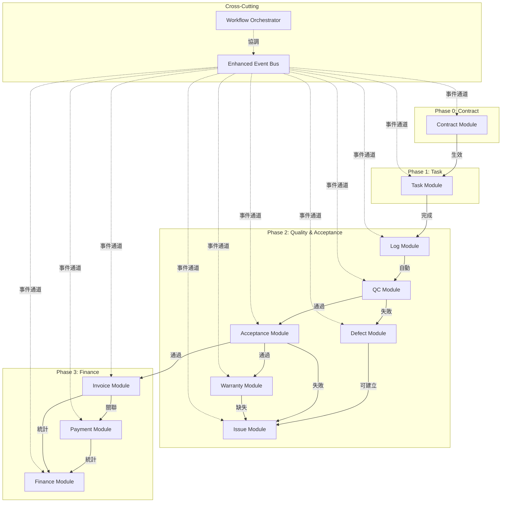
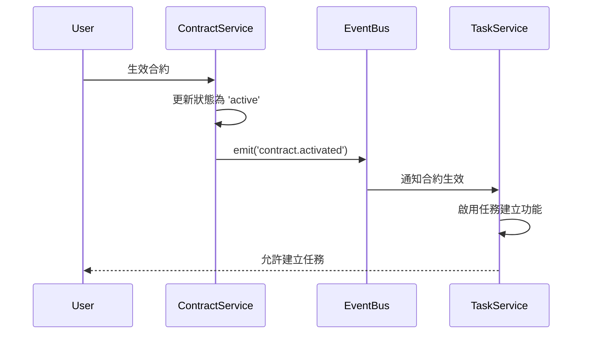
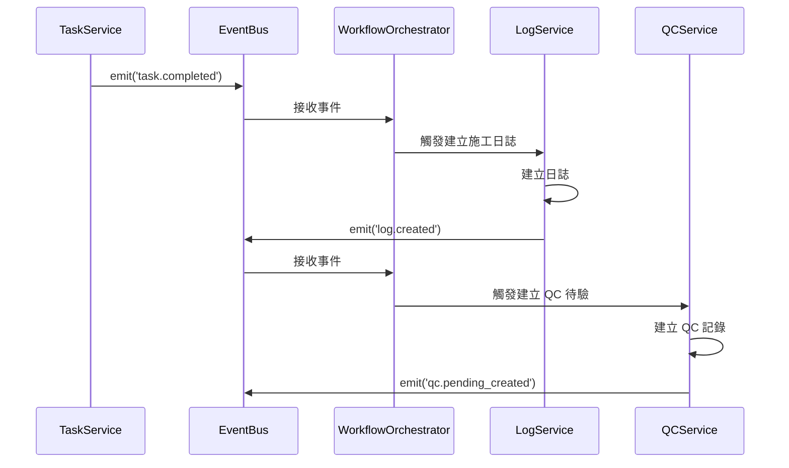
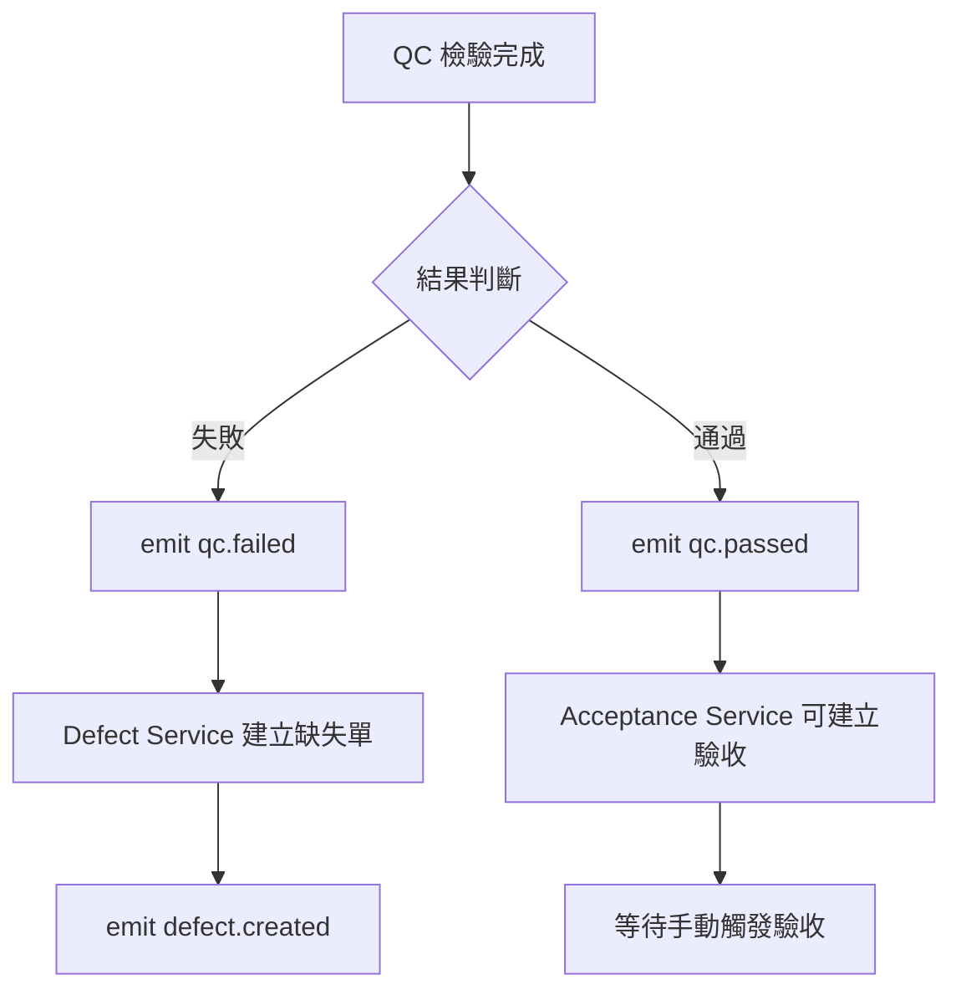
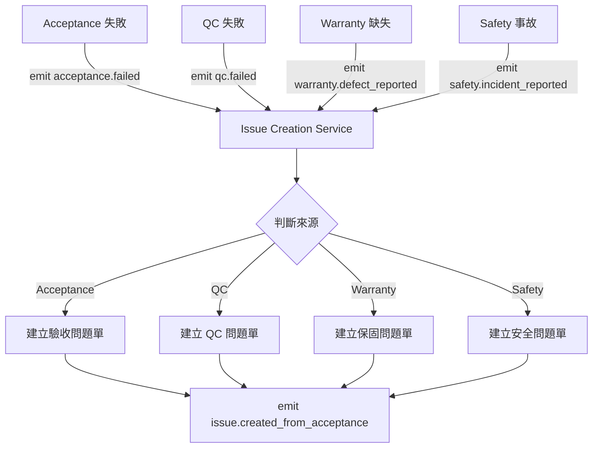
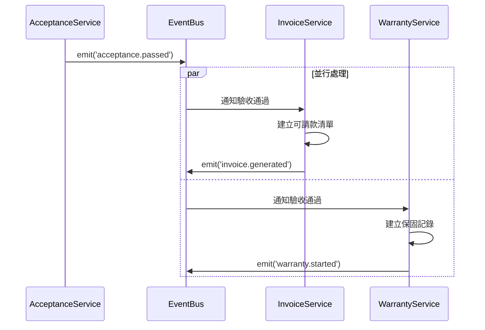

# SETC 模組整合指南 (Module Integration Guide)

> **文件版本**: 1.0.0  
> **建立日期**: 2025-12-16  
> **目的**: 說明各模組間的整合方式、依賴關係與事件通訊機制

---

## 📊 模組整合架構總覽



---

## 🔗 模組依賴矩陣

| 模組 | 依賴模組 | 依賴類型 | 整合方式 |
|------|---------|---------|---------|
| **Contract** | - | 無 | 獨立模組 |
| **Task** | Contract | 強依賴 | 直接呼叫 + 事件 |
| **Log** | Task | 強依賴 | 事件驅動 |
| **QC** | Log | 強依賴 | 事件驅動 |
| **Defect** | QC | 強依賴 | 事件驅動 |
| **Acceptance** | QC, Task | 強依賴 | 事件驅動 |
| **Issue** | Acceptance, QC, Warranty, Safety | 弱依賴 | 事件驅動 |
| **Warranty** | Acceptance | 強依賴 | 事件驅動 |
| **Invoice** | Acceptance, Task, Contract | 強依賴 | 事件驅動 |
| **Payment** | Invoice, Contract | 強依賴 | 直接呼叫 + 事件 |
| **Finance** | Invoice, Payment | 強依賴 | 聚合查詢 + 事件 |

---

## 📡 事件整合機制

### 事件命名規範

所有模組事件遵循 `[module].[action]` 格式：

```typescript
// 事件命名範例
'contract.activated'         // 合約生效
'task.created'              // 任務建立
'task.completed'            // 任務完成
'log.created'               // 施工日誌建立
'qc.passed'                 // QC 通過
'qc.failed'                 // QC 失敗
'defect.created'            // 缺失建立
'acceptance.passed'         // 驗收通過
'acceptance.failed'         // 驗收失敗
'issue.created'             // 問題建立
'issue.resolved'            // 問題解決
'warranty.started'          // 保固開始
'warranty.defect_reported'  // 保固缺失回報
'invoice.generated'         // 計價單產生
'payment.approved'          // 付款核准
'finance.ledger_updated'    // 分類帳更新
```

### 事件結構

```typescript
interface BlueprintEvent<T = any> {
  type: string;                    // 事件類型
  blueprintId: string;             // 藍圖 ID
  timestamp: Date;                 // 時間戳記
  actor?: string;                  // 操作者 ID (選填)
  data: T;                         // 事件資料
  metadata?: Record<string, any>;  // 額外元數據
}
```

---

## 🔄 模組整合模式

### 1. Contract → Task 整合

**整合方式**: 直接依賴 + 事件通知

#### 流程


#### 程式碼範例

**Contract Service (發送方)**
```typescript
async activateContract(contractId: string): Promise<void> {
  // 更新合約狀態
  await this.repository.update(contractId, { status: 'active' });
  
  // 發送事件
  this.eventBus.emit({
    type: 'contract.activated',
    blueprintId: contract.blueprintId,
    timestamp: new Date(),
    actor: this.userContext.currentUser()?.id,
    data: {
      contractId,
      workItems: contract.workItems,
      budget: contract.budget
    }
  });
}
```

**Task Service (接收方)**
```typescript
ngOnInit(): void {
  // 訂閱合約生效事件
  this.eventBus.on('contract.activated')
    .pipe(takeUntilDestroyed(this.destroyRef))
    .subscribe(event => {
      this.handleContractActivated(event.data);
    });
}

private handleContractActivated(data: any): void {
  // 更新可用合約清單
  this.availableContracts.update(contracts => 
    [...contracts, { id: data.contractId, ...data }]
  );
}
```

---

### 2. Task → Log → QC 自動化鏈

**整合方式**: 純事件驅動 (Event-Driven)

#### 流程


#### 程式碼範例

**Workflow Orchestrator**
```typescript
@Injectable({ providedIn: 'root' })
export class WorkflowOrchestrator {
  private eventBus = inject(EnhancedEventBusService);
  private logService = inject(LogService);
  private qcService = inject(QCService);
  
  ngOnInit(): void {
    this.setupAutomation();
  }
  
  private setupAutomation(): void {
    // Task → Log 自動化
    this.eventBus.on('task.completed')
      .pipe(takeUntilDestroyed(this.destroyRef))
      .subscribe(event => this.autoCreateLog(event));
    
    // Log → QC 自動化
    this.eventBus.on('log.created')
      .pipe(takeUntilDestroyed(this.destroyRef))
      .subscribe(event => this.autoCreateQC(event));
  }
  
  private async autoCreateLog(event: BlueprintEvent): Promise<void> {
    const taskData = event.data;
    await this.logService.autoCreateFromTask({
      taskId: taskData.taskId,
      blueprintId: event.blueprintId,
      workDate: new Date(),
      content: `任務 ${taskData.taskName} 已完成`,
      photos: taskData.completionPhotos || []
    });
  }
  
  private async autoCreateQC(event: BlueprintEvent): Promise<void> {
    const logData = event.data;
    await this.qcService.autoCreateFromLog({
      logId: logData.logId,
      blueprintId: event.blueprintId,
      inspectionType: 'standard',
      priority: 'normal'
    });
  }
}
```

---

### 3. QC → Defect/Acceptance 條件分支

**整合方式**: 事件驅動 + 條件路由

#### 流程


#### 程式碼範例

**QC Service**
```typescript
async completeInspection(
  qcId: string, 
  result: 'passed' | 'failed',
  findings: InspectionFinding[]
): Promise<void> {
  // 更新 QC 狀態
  await this.repository.update(qcId, { 
    status: result,
    findings,
    completedAt: new Date()
  });
  
  // 根據結果發送不同事件
  const eventType = result === 'passed' ? 'qc.passed' : 'qc.failed';
  
  this.eventBus.emit({
    type: eventType,
    blueprintId: qc.blueprintId,
    timestamp: new Date(),
    actor: this.userContext.currentUser()?.id,
    data: {
      qcId,
      taskId: qc.taskId,
      result,
      findings
    }
  });
}
```

**Defect Service (接收 QC 失敗)**
```typescript
ngOnInit(): void {
  this.eventBus.on('qc.failed')
    .pipe(takeUntilDestroyed(this.destroyRef))
    .subscribe(event => this.autoCreateDefect(event));
}

private async autoCreateDefect(event: BlueprintEvent): Promise<void> {
  const { qcId, taskId, findings } = event.data;
  
  // 為每個不合格項建立缺失單
  for (const finding of findings.filter(f => f.status === 'failed')) {
    await this.defectService.create({
      blueprintId: event.blueprintId,
      source: 'qc',
      sourceId: qcId,
      taskId,
      description: finding.description,
      severity: finding.severity,
      location: finding.location,
      photos: finding.photos
    });
  }
}
```

**Acceptance Service (接收 QC 通過)**
```typescript
ngOnInit(): void {
  this.eventBus.on('qc.passed')
    .pipe(takeUntilDestroyed(this.destroyRef))
    .subscribe(event => this.enableAcceptanceCreation(event));
}

private enableAcceptanceCreation(event: BlueprintEvent): void {
  // 標記任務為「可驗收」狀態
  this.eligibleForAcceptance.update(tasks => 
    [...tasks, event.data.taskId]
  );
  
  // 通知 UI 顯示「建立驗收」按鈕
  this.eventBus.emit({
    type: 'acceptance.eligible',
    blueprintId: event.blueprintId,
    timestamp: new Date(),
    data: { taskId: event.data.taskId }
  });
}
```

---

### 4. Issue Module 多來源整合

**整合方式**: 統一 Issue 介面 + 多來源事件訂閱

#### 流程


#### 程式碼範例

**Issue Creation Service**
```typescript
@Injectable({ providedIn: 'root' })
export class IssueCreationService {
  private eventBus = inject(EnhancedEventBusService);
  private issueManagement = inject(IssueManagementService);
  
  ngOnInit(): void {
    this.subscribeToAllSources();
  }
  
  private subscribeToAllSources(): void {
    // 來源 1: 驗收失敗
    this.eventBus.on('acceptance.failed')
      .pipe(takeUntilDestroyed(this.destroyRef))
      .subscribe(event => this.autoCreateFromAcceptance(event));
    
    // 來源 2: QC 失敗
    this.eventBus.on('qc.failed')
      .pipe(takeUntilDestroyed(this.destroyRef))
      .subscribe(event => this.autoCreateFromQC(event));
    
    // 來源 3: 保固缺失
    this.eventBus.on('warranty.defect_reported')
      .pipe(takeUntilDestroyed(this.destroyRef))
      .subscribe(event => this.autoCreateFromWarranty(event));
    
    // 來源 4: 安全事故
    this.eventBus.on('safety.incident_reported')
      .pipe(takeUntilDestroyed(this.destroyRef))
      .subscribe(event => this.autoCreateFromSafety(event));
  }
  
  async autoCreateFromAcceptance(event: BlueprintEvent): Promise<string> {
    const { acceptanceId, taskId, failureReason } = event.data;
    
    const issueId = await this.issueManagement.create({
      blueprintId: event.blueprintId,
      title: `驗收未通過 - ${taskId}`,
      description: failureReason,
      source: 'acceptance',
      sourceId: acceptanceId,
      relatedTaskId: taskId,
      priority: 'high',
      category: 'quality'
    });
    
    this.eventBus.emit({
      type: 'issue.created_from_acceptance',
      blueprintId: event.blueprintId,
      timestamp: new Date(),
      data: { issueId, acceptanceId }
    });
    
    return issueId;
  }
  
  // 其他來源類似實作...
}
```

---

### 5. Acceptance → Invoice/Warranty 並行觸發

**整合方式**: 單一事件 → 多個訂閱者

#### 流程


#### 程式碼範例

**Acceptance Service (發送方)**
```typescript
async approveAcceptance(acceptanceId: string): Promise<void> {
  await this.repository.update(acceptanceId, {
    status: 'approved',
    approvedAt: new Date()
  });
  
  // 單一事件，多個模組訂閱
  this.eventBus.emit({
    type: 'acceptance.passed',
    blueprintId: acceptance.blueprintId,
    timestamp: new Date(),
    actor: this.userContext.currentUser()?.id,
    data: {
      acceptanceId,
      taskId: acceptance.taskId,
      contractId: acceptance.contractId,
      workItems: acceptance.workItems,
      amount: acceptance.amount
    }
  });
}
```

**Invoice Service (訂閱者 1)**
```typescript
ngOnInit(): void {
  this.eventBus.on('acceptance.passed')
    .pipe(takeUntilDestroyed(this.destroyRef))
    .subscribe(event => this.autoGenerateInvoice(event));
}

private async autoGenerateInvoice(event: BlueprintEvent): Promise<void> {
  const { acceptanceId, taskId, amount, workItems } = event.data;
  
  await this.invoiceService.generate({
    blueprintId: event.blueprintId,
    source: 'acceptance',
    sourceId: acceptanceId,
    taskId,
    items: workItems,
    totalAmount: amount,
    type: 'receivable' // 可請款
  });
}
```

**Warranty Service (訂閱者 2)**
```typescript
ngOnInit(): void {
  this.eventBus.on('acceptance.passed')
    .pipe(takeUntilDestroyed(this.destroyRef))
    .subscribe(event => this.startWarrantyPeriod(event));
}

private async startWarrantyPeriod(event: BlueprintEvent): Promise<void> {
  const { acceptanceId, taskId, contractId } = event.data;
  
  // 取得保固條款
  const contract = await this.contractService.getById(contractId);
  const warrantyPeriod = contract.warrantyPeriod || 365; // 預設 1 年
  
  await this.warrantyService.create({
    blueprintId: event.blueprintId,
    taskId,
    acceptanceId,
    startDate: new Date(),
    endDate: addDays(new Date(), warrantyPeriod),
    status: 'active'
  });
}
```

---

## 📋 整合檢查清單

### 新模組整合時必須確認

- [ ] **事件命名**: 遵循 `[module].[action]` 格式
- [ ] **事件結構**: 包含 type, blueprintId, timestamp, actor, data
- [ ] **訂閱清理**: 使用 `takeUntilDestroyed(this.destroyRef)`
- [ ] **錯誤處理**: 事件處理函式包含 try-catch
- [ ] **日誌記錄**: 關鍵事件記錄到 Audit Log
- [ ] **測試覆蓋**: 整合測試涵蓋事件通訊路徑
- [ ] **文檔更新**: 更新本文件的依賴矩陣與流程圖

---

## 🔧 整合除錯工具

### Event Bus 除錯模式

```typescript
// 啟用事件追蹤
this.eventBus.enableDebugMode();

// 監聽所有事件
this.eventBus.on('*').subscribe(event => {
  console.log('[Event Debug]', event.type, event.data);
});

// 檢查訂閱者數量
const subscriberCount = this.eventBus.getSubscriberCount('task.completed');
console.log(`task.completed has ${subscriberCount} subscribers`);
```

### 整合測試範例

```typescript
describe('Task → Log → QC Integration', () => {
  it('should auto-create log and QC when task completed', fakeAsync(() => {
    const eventBus = TestBed.inject(EnhancedEventBusService);
    const logService = TestBed.inject(LogService);
    const qcService = TestBed.inject(QCService);
    
    const logSpy = spyOn(logService, 'autoCreateFromTask');
    const qcSpy = spyOn(qcService, 'autoCreateFromLog');
    
    // 發送任務完成事件
    eventBus.emit({
      type: 'task.completed',
      blueprintId: 'test-blueprint',
      timestamp: new Date(),
      data: { taskId: 'task-123' }
    });
    
    tick(100);
    
    expect(logSpy).toHaveBeenCalled();
    expect(qcSpy).toHaveBeenCalled();
  }));
});
```

---

## 🔗 相關文檔

- **Event Bus 文檔**: [Enhanced Event Bus Service](../../ARCHITECTURE.md#event-bus)
- **工作流程階段**: [SETC-WORKFLOW-PHASES.md](./SETC-WORKFLOW-PHASES.md)
- **模組規劃**: [MODULE-PLANNING.md](../02-planning/MODULE-PLANNING.md)
- **SETC 主索引**: [SETC-MASTER-INDEX.md](./SETC-MASTER-INDEX.md)

---

**最後更新**: 2025-12-16  
**維護者**: GigHub Development Team  
**版本**: 1.0.0
