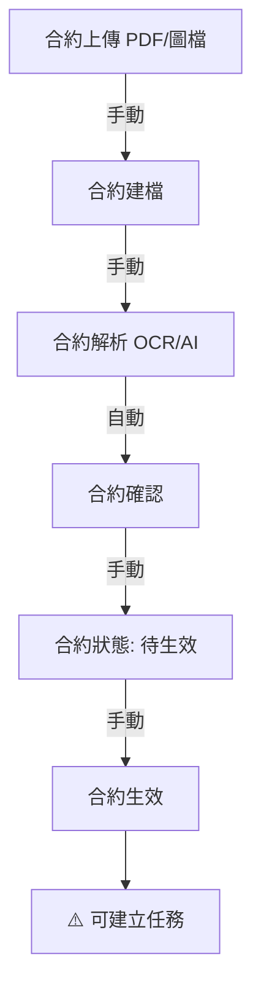
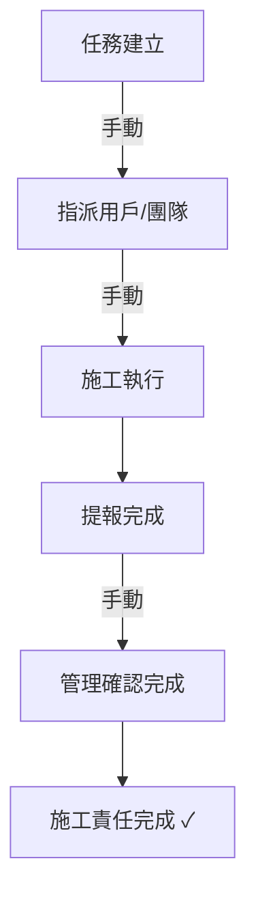
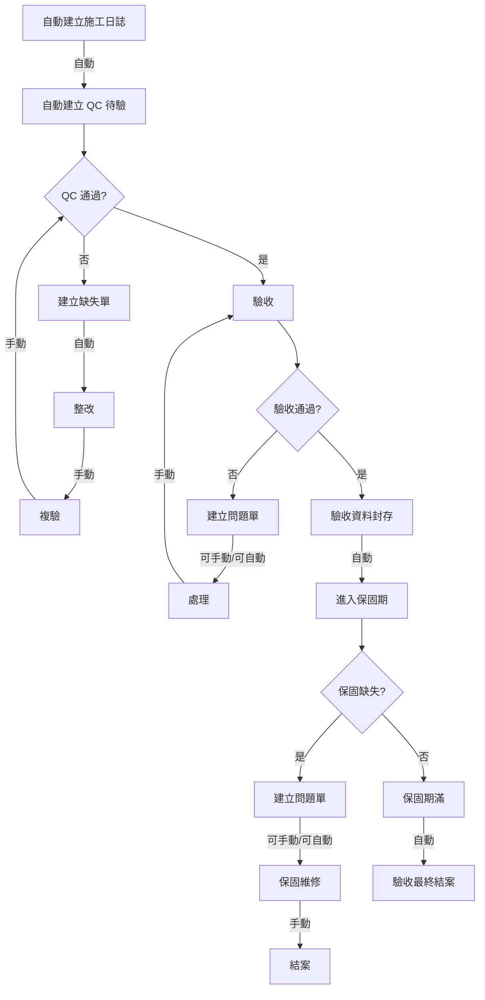
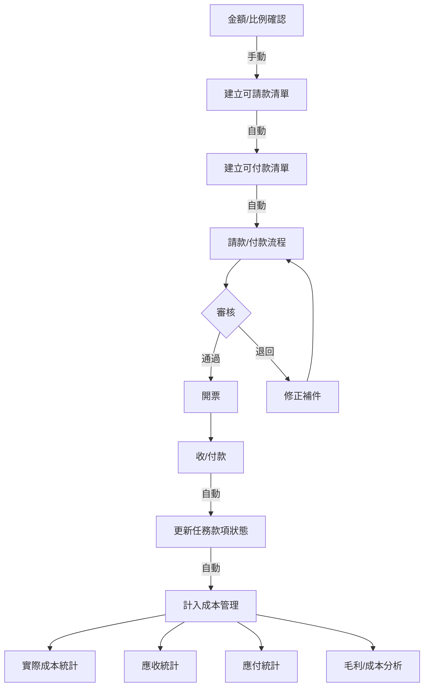
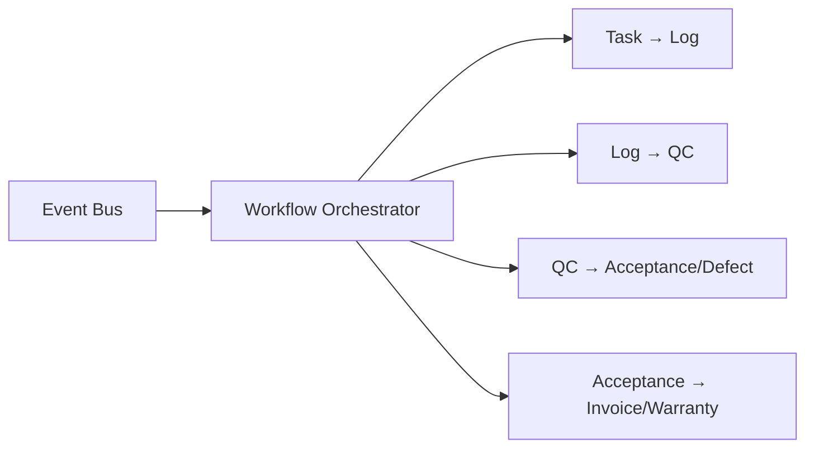

# SETC 工作流程階段對照表 (Workflow Phases Mapping)

> **文件版本**: 1.0.0  
> **建立日期**: 2025-12-16  
> **目的**: 將 SETC 任務與工作流程階段明確對照，提供完整的實施路線圖

---

## 📊 工作流程階段總覽

SETC 工作流程分為 **4 個主要階段**，共 **69 個任務**分布於 **9 個模組**：

| 階段 | 名稱 | 節點數 | SETC 任務範圍 | 狀態 |
|------|------|--------|--------------|------|
| **Phase 0** | 合約建立與來源 | 7 | SETC-009~017 | ✅ 文檔完成 |
| **Phase 1** | 任務與施工階段 | 5 | SETC-046~053 | ✅ 文檔完成 |
| **Phase 2** | 品質與驗收階段 | 12 | SETC-001~008, 032~061 | ✅ 文檔完成 |
| **Phase 3** | 財務與成本階段 | 8 | SETC-024~031, 062~069 | ✅ 文檔完成 |
| **Cross-Cutting** | 事件驅動自動化 | 6 | SETC-018~023 | ✅ 文檔完成 |

---

## 🔄 Phase 0: 合約建立與來源

### 工作流程節點



### 對應 SETC 任務

#### SETC-009~017: Contract Module (合約管理模組)

| SETC 編號 | 任務名稱 | 工作流程節點 | 類型 |
|-----------|---------|-------------|------|
| **SETC-009** | Contract Module Foundation | 模組基礎建設 | 架構 |
| **SETC-010** | Contract Repository Layer | 資料存取層 | 基礎設施 |
| **SETC-011** | Contract Management Service | 合約建檔 | 核心功能 |
| **SETC-012** | Contract Upload & Parsing Service | 合約上傳 + 解析 | 核心功能 |
| **SETC-013** | Contract Status Lifecycle Service | 合約狀態管理 | 核心功能 |
| **SETC-014** | Contract Work Items Management | 工項管理 | 核心功能 |
| **SETC-015** | Contract Event Integration | 事件整合 | 整合層 |
| **SETC-016** | Contract UI Components | UI 層 | 使用者介面 |
| **SETC-017** | Contract Testing & Integration | 測試整合 | 品質保證 |

### 實作狀態: ✅ 已完成

---

## 🏗️ Phase 1: 任務與施工階段

### 工作流程節點



### 對應 SETC 任務

#### SETC-046~053: Task Module Enhancement (任務模組擴展)

| SETC 編號 | 任務名稱 | 工作流程節點 | 類型 |
|-----------|---------|-------------|------|
| **SETC-046** | Task Module Enhancement Planning | 模組規劃 | 規劃 |
| **SETC-047** | Task Repository Enhancement | 資料存取強化 | 基礎設施 |
| **SETC-048** | Task Assignment Service | 指派用戶/團隊 | 核心功能 |
| **SETC-049** | Task State Machine Service | 任務狀態機 | 核心功能 |
| **SETC-050** | Task Progress Tracking Service | 施工執行追蹤 | 核心功能 |
| **SETC-051** | Task Schedule Management Service | 排程管理 | 核心功能 |
| **SETC-052** | Task Event Integration | 事件整合 | 整合層 |
| **SETC-053** | Task UI Components & Testing | UI + 測試 | 使用者介面 |

### 實作狀態: ✅ 文檔完成

---

## ✅ Phase 2: 品質與驗收階段

### 工作流程節點



### 對應 SETC 任務

#### SETC-001~008: Issue Module (問題管理模組) ✅ 已實作

| SETC 編號 | 任務名稱 | 工作流程節點 | 類型 |
|-----------|---------|-------------|------|
| **SETC-001** | Issue Module Foundation | 模組基礎建設 | 架構 |
| **SETC-002** | Issue Repository Layer | 資料存取層 | 基礎設施 |
| **SETC-003** | Issue Core Services | 建立問題單 | 核心功能 |
| **SETC-004** | Issue Resolution & Verification | 問題處理 + 驗證 | 核心功能 |
| **SETC-005** | Issue Event Integration | 事件整合 | 整合層 |
| **SETC-006** | Issue Module Facade | Facade 層 | 整合層 |
| **SETC-007** | Issue UI Components | UI 層 | 使用者介面 |
| **SETC-008** | Issue Module Testing | 測試 | 品質保證 |

#### SETC-040~045: Defect Management (缺陷管理) ✅ 已實作

| SETC 編號 | 任務名稱 | 工作流程節點 | 類型 |
|-----------|---------|-------------|------|
| **SETC-040** | Defect Service Expansion | 缺失單基礎 | 核心功能 |
| **SETC-041** | Defect Lifecycle Service | 缺失狀態管理 | 核心功能 |
| **SETC-042** | Defect Resolution Service | 整改處理 | 核心功能 |
| **SETC-043** | Defect Reinspection Service | 複驗機制 | 核心功能 |
| **SETC-044** | Defect-Issue Integration | 與 Issue 整合 | 整合層 |
| **SETC-045** | Defect Testing & Integration | 測試整合 | 品質保證 |

#### SETC-054~061: Acceptance Module (驗收模組擴展)

| SETC 編號 | 任務名稱 | 工作流程節點 | 類型 |
|-----------|---------|-------------|------|
| **SETC-054** | Acceptance Module Enhancement Planning | 模組規劃 | 規劃 |
| **SETC-055** | Acceptance Repository Implementation | 資料存取實作 | 基礎設施 |
| **SETC-056** | Acceptance Request Service | 驗收申請 | 核心功能 |
| **SETC-057** | Preliminary Acceptance Service | 初驗服務 | 核心功能 |
| **SETC-058** | Reinspection Service | 複驗服務 | 核心功能 |
| **SETC-059** | Acceptance Conclusion Service | 驗收結案 | 核心功能 |
| **SETC-060** | Acceptance Event Integration | 事件整合 | 整合層 |
| **SETC-061** | Acceptance UI Components & Testing | UI + 測試 | 使用者介面 |

#### SETC-032~039: Warranty Module (保固管理模組) ✅ 已實作

| SETC 編號 | 任務名稱 | 工作流程節點 | 類型 |
|-----------|---------|-------------|------|
| **SETC-032** | Warranty Module Foundation | 模組基礎建設 | 架構 |
| **SETC-033** | Warranty Repository Implementation | 資料存取實作 | 基礎設施 |
| **SETC-034** | Warranty Period Management | 保固期管理 | 核心功能 |
| **SETC-035** | Warranty Defect Management | 保固缺失管理 | 核心功能 |
| **SETC-036** | Warranty Repair Management | 保固維修管理 | 核心功能 |
| **SETC-037** | Warranty Event Integration | 事件整合 | 整合層 |
| **SETC-038** | Warranty UI Components | UI 層 | 使用者介面 |
| **SETC-039** | Warranty Testing & Integration | 測試整合 | 品質保證 |

### 實作狀態
- ✅ Issue Module: 已實作完成
- ✅ Defect Management: 已實作完成
- ✅ Warranty Module: 已實作完成
- ✅ Acceptance Module: 文檔完成

---

## 💰 Phase 3: 財務與成本階段

### 工作流程節點



### 對應 SETC 任務

#### SETC-024~031: Invoice/Payment (初期開發) ✅ 已實作

| SETC 編號 | 任務名稱 | 工作流程節點 | 類型 |
|-----------|---------|-------------|------|
| **SETC-024** | Invoice Service Expansion | 計價服務基礎 | 核心功能 |
| **SETC-025** | Invoice Generation Service | 建立可請款清單 | 核心功能 |
| **SETC-026** | Invoice Approval Workflow | 請款審核流程 | 核心功能 |
| **SETC-027** | Payment Generation Service | 建立可付款清單 | 核心功能 |
| **SETC-028** | Payment Approval Workflow | 付款審核流程 | 核心功能 |
| **SETC-029** | Payment Status Tracking | 款項狀態追蹤 | 核心功能 |
| **SETC-030** | Invoice/Payment UI Components | UI 層 | 使用者介面 |
| **SETC-031** | Finance Integration Testing | 測試整合 | 品質保證 |

#### SETC-062~069: Finance Module Enhancement (模組擴展)

| SETC 編號 | 任務名稱 | 工作流程節點 | 類型 |
|-----------|---------|-------------|------|
| **SETC-062** | Finance Module Enhancement Planning | 模組規劃 | 規劃 |
| **SETC-063** | Finance Repository Implementation | 資料存取實作 | 基礎設施 |
| **SETC-064** | Invoice Service Enhancement | 計價服務強化 | 核心功能 |
| **SETC-065** | Payment Service Enhancement | 付款服務強化 | 核心功能 |
| **SETC-066** | Budget Management Service | 預算管理 | 核心功能 |
| **SETC-067** | Ledger & Accounting Service | 分類帳 + 會計 | 核心功能 |
| **SETC-068** | Finance Event Integration | 事件整合 | 整合層 |
| **SETC-069** | Finance UI Components & Testing | UI + 測試 | 使用者介面 |

### 實作狀態
- ✅ Invoice/Payment (SETC-024~031): 已實作完成
- ✅ Finance Enhancement (SETC-062~069): 文檔完成

---

## 🔄 Cross-Cutting Concerns: 事件驅動自動化

### 工作流程整合

事件驅動自動化貫穿所有階段，負責工作流程的自動觸發與協調。



### 對應 SETC 任務

#### SETC-018~023: Event Automation ✅ 已實作

| SETC 編號 | 任務名稱 | 涵蓋範圍 | 類型 |
|-----------|---------|---------|------|
| **SETC-018** | Event Bus Enhancement | 事件總線強化 | 基礎設施 |
| **SETC-019** | Workflow Orchestrator | 工作流程協調器 | 核心功能 |
| **SETC-020** | Task → Log Automation | 任務完成 → 施工日誌 | 自動化 |
| **SETC-021** | Log → QC Automation | 施工日誌 → QC 待驗 | 自動化 |
| **SETC-022** | QC → Acceptance/Defect Automation | QC → 驗收/缺失 | 自動化 |
| **SETC-023** | Acceptance → Invoice/Warranty Automation | 驗收 → 計價/保固 | 自動化 |

### 實作狀態: ✅ 已實作完成

---

## 📊 階段依賴關係

### 實施順序

```
Phase 0 (Contract)
    ↓
Phase 1 (Task) ← Cross-Cutting (Event Automation)
    ↓
Phase 2 (QC, Acceptance, Issue, Defect, Warranty)
    ↓
Phase 3 (Invoice, Payment, Finance)
```

### 關鍵依賴

| 階段 | 依賴前置階段 | 原因 |
|------|------------|------|
| Phase 1 | Phase 0 | 必須有合約才能建立任務 |
| Phase 2 | Phase 1 | 任務完成後才能驗收 |
| Phase 3 | Phase 2 | 驗收通過後才能請款 |
| Event Automation | Phase 0, 1 | 需要基礎模組事件定義 |

---

## 🎯 實施里程碑

### 已完成里程碑 ✅

1. **Issue Module** (SETC-001~008) - ✅ 已實作
2. **Contract Module** (SETC-009~017) - ✅ 已實作
3. **Event Automation** (SETC-018~023) - ✅ 已實作
4. **Invoice/Payment** (SETC-024~031) - ✅ 已實作
5. **Warranty Module** (SETC-032~039) - ✅ 已實作
6. **Defect Management** (SETC-040~045) - ✅ 已實作

### 文檔完成，待實作

7. **Task Module** (SETC-046~053) - ✅ 文檔完成
8. **Acceptance Module** (SETC-054~061) - ✅ 文檔完成
9. **Finance Enhancement** (SETC-062~069) - ✅ 文檔完成

---

## 📈 進度追蹤

### 整體進度

| 類別 | 數量 | 完成 | 百分比 |
|------|------|------|--------|
| **SETC 任務** | 69 | 45 | 65% |
| **模組** | 9 | 6 | 67% |
| **文檔** | 93 | 93 | 100% |

### 階段完成度

| 階段 | 任務數 | 已完成 | 百分比 | 狀態 |
|------|--------|--------|--------|------|
| Phase 0 (Contract) | 9 | 9 | 100% | ✅ |
| Phase 1 (Task) | 8 | 0 | 0% | 📄 文檔完成 |
| Phase 2 (QC/Acceptance) | 30 | 22 | 73% | 🔄 部分完成 |
| Phase 3 (Finance) | 16 | 8 | 50% | 🔄 部分完成 |
| Cross-Cutting (Events) | 6 | 6 | 100% | ✅ |

---

## 🔗 相關文檔

- **SETC 主文檔**: [SETC.md](./SETC.md)
- **主索引**: [SETC-MASTER-INDEX.md](./SETC-MASTER-INDEX.md)
- **任務摘要**: [SETC-TASKS-SUMMARY.md](./SETC-TASKS-SUMMARY.md)
- **模組規劃**: [../../02-planning/MODULE-PLANNING.md](../02-planning/MODULE-PLANNING.md)

---

**最後更新**: 2025-12-16  
**維護者**: GigHub Development Team  
**版本**: 1.0.0
