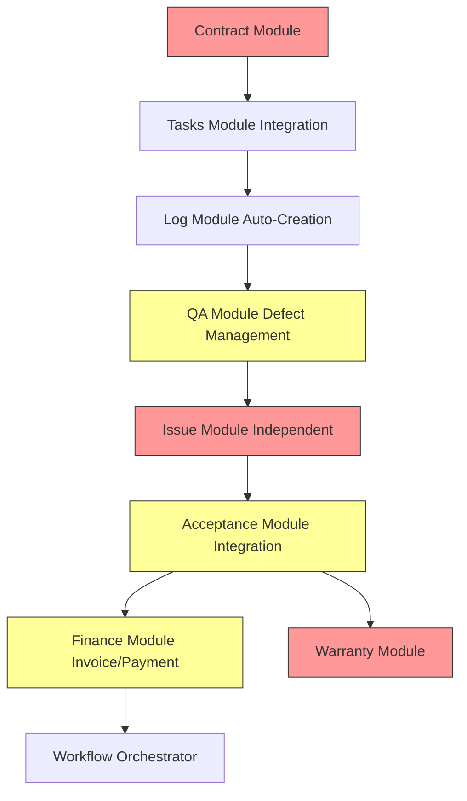

# 模組規劃文件

> **文件版本**: 2.0.0  
> **規劃日期**: 2025-12-15  
> **更新日期**: 2025-12-16  
> **基於**: SETC 工作流程分析  
> **規劃範圍**: 新增模組 + 現有模組擴展

---

## 🏗️ Blueprint Event Bus 架構要求 (MANDATORY)

### 🚨 所有新增或擴展模組必須遵循以下原則

1. **零直接依賴**: 模組間嚴禁直接注入其他模組服務
2. **事件驅動通訊**: 所有模組間通訊透過 BlueprintEventBus
3. **上下文隔離**: 每個模組在 Blueprint Context 內運作
4. **事件規範**: 遵循 `[module].[action]` 命名格式

### 模組整合檢查清單

每個模組實作時必須完成：

- [ ] 定義模組領域事件（emit events）
- [ ] 定義訂閱其他模組事件（subscribe events）
- [ ] 實作 EventService（事件處理服務）
- [ ] 禁止注入其他模組服務
- [ ] 禁止直接查詢其他模組 Firestore 資料
- [ ] 文檔化事件整合（README 中加入 Event Bus 章節）

詳細整合指南: [SETC-MODULE-INTEGRATION.md](../01-overview/SETC-MODULE-INTEGRATION.md)

---

## 📋 執行摘要

基於 SETC 工作流程分析，本文件規劃需要新建立的模組以及需要修改的現有模組。

### 規劃概覽

**新增模組**: 3 個
- Contract Module（合約管理模組）- P0
- Warranty Module（保固管理模組）- P1
- Issue Module（問題管理模組）- P1 ⭐ 獨立為新模組

**擴展模組**: 3 個（原 4 個，Issue 已獨立）
- Finance Module（財務模組）- 擴展 Invoice/Payment 子模組
- QA Module（品質檢查模組）- 擴展 Defect Management
- Workflow Module（工作流程模組）- 擴展自動化編排器

**整合模組**: 6 個
- Tasks Module - 整合合約驗證與款項狀態
- Log Module - 整合自動建立機制
- Audit Logs Module - 擴展稽核記錄
- Communication Module - 擴展通知機制
- Cloud Module - 擴展檔案管理
- Climate Module - 無需變更

---

## 1. 新增模組規劃

### 1.1 Contract Module（合約管理模組）

#### 基本資訊

| 屬性 | 值 |
|------|-----|
| Module ID | `contract` |
| Module Name | 合約管理 / Contract Management |
| Priority | P0（關鍵核心） |
| Status | 🔴 待建立 |
| Dependencies | `[]` |
| Dependents | `['tasks', 'finance', 'workflow', 'audit-logs']` |

#### 目錄結構

```
src/app/core/blueprint/modules/implementations/contract/
├── contract.module.ts                  # 模組主檔案
├── module.metadata.ts                  # 模組元資料
├── index.ts                            # 統一匯出
├── README.md                           # 模組說明文件
│
├── models/                             # 資料模型
│   ├── index.ts
│   ├── contract.model.ts               # 合約主模型
│   ├── contract-party.model.ts         # 合約雙方資訊
│   ├── contract-work-item.model.ts     # 合約工項
│   ├── contract-term.model.ts          # 合約條款
│   └── contract-change.model.ts        # 合約變更
│
├── services/                           # 業務服務
│   ├── index.ts
│   ├── contract-management.service.ts  # 合約 CRUD
│   ├── contract-upload.service.ts      # 合約上傳
│   ├── contract-parsing.service.ts     # OCR/AI 解析
│   ├── contract-status.service.ts      # 狀態管理
│   ├── contract-items.service.ts       # 工項管理
│   └── contract-change.service.ts      # 變更管理
│
├── repositories/                       # 資料存取
│   ├── index.ts
│   └── contract.repository.ts          # Firestore 存取
│
├── config/                             # 配置
│   ├── index.ts
│   └── contract.config.ts              # 模組配置
│
├── exports/                            # 公開 API
│   ├── index.ts
│   └── contract-api.exports.ts         # API 匯出定義
│
└── views/                              # UI 元件（未來）
    ├── contract-list.component.ts
    ├── contract-detail.component.ts
    ├── contract-form.component.ts
    └── contract-upload.component.ts
```

#### 核心功能

##### 1. 合約管理服務（Contract Management Service）

```typescript
export class ContractManagementService {
  // CRUD 操作
  createContract(data: CreateContractData): Promise<Contract>;
  updateContract(contractId: string, data: Partial<Contract>): Promise<Contract>;
  deleteContract(contractId: string): Promise<void>;
  getContract(contractId: string): Promise<Contract | null>;
  listContracts(blueprintId: string, filters?: ContractFilters): Promise<Contract[]>;
  
  // 合約查詢
  findActiveContracts(blueprintId: string): Promise<Contract[]>;
  findContractByNumber(contractNumber: string): Promise<Contract | null>;
  
  // 合約驗證
  validateContract(contractId: string): Promise<ValidationResult>;
  checkContractActive(contractId: string): Promise<boolean>;
}
```

##### 2. 合約上傳服務（Contract Upload Service）

```typescript
export class ContractUploadService {
  // 檔案上傳
  uploadContractFile(file: File, metadata: UploadMetadata): Promise<FileUploadResult>;
  uploadMultipleFiles(files: File[], metadata: UploadMetadata): Promise<FileUploadResult[]>;
  
  // 檔案管理
  getContractFiles(contractId: string): Promise<ContractFile[]>;
  deleteContractFile(fileId: string): Promise<void>;
  downloadContractFile(fileId: string): Promise<Blob>;
}
```

##### 3. 合約解析服務（Contract Parsing Service）

```typescript
export class ContractParsingService {
  // OCR 解析
  parseContractOCR(fileUrl: string): Promise<ContractParsedData>;
  
  // AI 解析
  parseContractAI(fileUrl: string): Promise<ContractParsedData>;
  
  // 解析確認
  confirmParsedData(contractId: string, confirmedData: ContractParsedData): Promise<Contract>;
  
  // 手動補正
  manualCorrection(contractId: string, corrections: ContractCorrections): Promise<Contract>;
}
```

##### 4. 合約狀態服務（Contract Status Service）

```typescript
export class ContractStatusService {
  // 狀態轉換
  changeStatus(contractId: string, newStatus: ContractStatus, reason?: string): Promise<Contract>;
  activateContract(contractId: string): Promise<Contract>;
  terminateContract(contractId: string, reason: string): Promise<Contract>;
  
  // 狀態查詢
  getStatusHistory(contractId: string): Promise<ContractStatusHistory[]>;
  
  // 狀態驗證
  canChangeStatus(contractId: string, targetStatus: ContractStatus): Promise<boolean>;
}
```

##### 5. 合約工項服務（Contract Items Service）

```typescript
export class ContractItemsService {
  // 工項管理
  addWorkItem(contractId: string, item: ContractWorkItem): Promise<void>;
  updateWorkItem(contractId: string, itemId: string, data: Partial<ContractWorkItem>): Promise<void>;
  removeWorkItem(contractId: string, itemId: string): Promise<void>;
  getWorkItems(contractId: string): Promise<ContractWorkItem[]>;
  
  // 工項查詢
  findWorkItem(contractId: string, itemId: string): Promise<ContractWorkItem | null>;
  searchWorkItems(contractId: string, keyword: string): Promise<ContractWorkItem[]>;
  
  // 工項統計
  calculateTotalAmount(contractId: string): Promise<number>;
  getCompletionStatus(contractId: string): Promise<WorkItemCompletionStatus>;
}
```

##### 6. 合約變更服務（Contract Change Service）

```typescript
export class ContractChangeService {
  // 變更管理
  requestChange(contractId: string, change: ContractChangeRequest): Promise<ContractChange>;
  approveChange(changeId: string, approver: string): Promise<ContractChange>;
  rejectChange(changeId: string, reason: string): Promise<ContractChange>;
  
  // 變更查詢
  getChanges(contractId: string): Promise<ContractChange[]>;
  getPendingChanges(contractId: string): Promise<ContractChange[]>;
  
  // 變更應用
  applyChange(changeId: string): Promise<Contract>;
}
```

#### 資料模型

```typescript
// contract.model.ts
export interface Contract {
  id: string;
  blueprintId: string;
  contractNumber: string;
  title: string;
  
  // 合約雙方
  owner: ContractParty;
  contractor: ContractParty;
  
  // 合約金額
  totalAmount: number;
  currency: string;
  
  // 合約工項
  workItems: ContractWorkItem[];
  
  // 合約條款
  terms: ContractTerm[];
  
  // 合約狀態
  status: ContractStatus;
  statusHistory: ContractStatusHistory[];
  
  // 合約期限
  signedDate?: Date;
  startDate: Date;
  endDate: Date;
  
  // 合約文件
  originalFiles: ContractFile[];
  parsedData?: ContractParsedData;
  
  // 變更記錄
  changes: ContractChange[];
  
  // 審計
  createdBy: string;
  createdAt: Date;
  updatedBy: string;
  updatedAt: Date;
  deletedAt?: Date;
}

export enum ContractStatus {
  DRAFT = 'draft',
  PENDING_ACTIVATION = 'pending_activation',
  ACTIVE = 'active',
  SUSPENDED = 'suspended',
  COMPLETED = 'completed',
  TERMINATED = 'terminated'
}

export interface ContractParty {
  id: string;
  type: PartyType;             // 'owner' | 'contractor' | 'subcontractor'
  name: string;
  legalName: string;
  taxId: string;
  address: string;
  contact: ContactInfo;
  representative: Representative;
}

export interface ContractWorkItem {
  id: string;
  code: string;
  name: string;
  description: string;
  category: string;
  
  // 數量與單位
  unit: string;
  quantity: number;
  
  // 金額
  unitPrice: number;
  totalPrice: number;
  
  // 執行狀態
  completedQuantity: number;
  completedAmount: number;
  completionPercentage: number;
  
  // 關聯任務
  linkedTaskIds: string[];
  
  // 狀態
  status: WorkItemStatus;      // 'pending' | 'in_progress' | 'completed' | 'on_hold'
}

export interface ContractTerm {
  id: string;
  category: TermCategory;      // 'payment' | 'quality' | 'timeline' | 'warranty' | 'penalty' | 'other'
  title: string;
  content: string;
  importance: TermImportance;  // 'critical' | 'important' | 'normal'
  parsedFrom?: string;         // OCR/AI 解析來源
  confirmedBy?: string;
  confirmedAt?: Date;
}

export interface ContractParsedData {
  contractNumber?: string;
  title?: string;
  parties?: {
    owner?: Partial<ContractParty>;
    contractor?: Partial<ContractParty>;
  };
  totalAmount?: number;
  startDate?: Date;
  endDate?: Date;
  workItems?: Partial<ContractWorkItem>[];
  terms?: Partial<ContractTerm>[];
  confidence: number;          // AI 解析信心度 0-1
  parseDate: Date;
  parseMethod: ParseMethod;    // 'ocr' | 'ai' | 'manual'
}

export interface ContractChange {
  id: string;
  contractId: string;
  changeNumber: string;
  changeType: ChangeType;      // 'amount' | 'timeline' | 'scope' | 'terms' | 'parties'
  
  // 變更內容
  description: string;
  reason: string;
  affectedFields: string[];
  before: Record<string, any>;
  after: Record<string, any>;
  
  // 變更影響
  amountDelta?: number;
  timelineDelta?: number;      // 天數
  
  // 審批
  status: ChangeStatus;        // 'draft' | 'pending' | 'approved' | 'rejected' | 'applied'
  requestedBy: string;
  requestedAt: Date;
  approvers: ChangeApprover[];
  
  // 應用
  appliedBy?: string;
  appliedAt?: Date;
  
  createdAt: Date;
  updatedAt: Date;
}
```

#### Module Metadata

```typescript
// module.metadata.ts
export const CONTRACT_MODULE_METADATA = {
  id: 'contract',
  moduleType: 'contract',
  name: '合約管理',
  nameEn: 'Contract Management',
  version: '1.0.0',
  description: '合約管理模組，提供合約上傳、解析、工項管理、狀態控制等功能',
  descriptionEn: 'Contract Management module with upload, parsing, work item management, and status control',
  dependencies: [] as string[],
  defaultOrder: 1,
  icon: 'file-text',
  color: '#722ed1',
  category: 'business',
  tags: ['contract', 'management', 'OCR', 'AI'],
  author: 'GigHub Development Team',
  license: 'Proprietary'
} as const;

export const CONTRACT_MODULE_DEFAULT_CONFIG: BlueprintModuleConfiguration = {
  features: {
    enableContractUpload: true,
    enableOCRParsing: true,
    enableAIParsing: true,
    enableManualCorrection: true,
    enableStatusManagement: true,
    enableWorkItemManagement: true,
    enableChangeManagement: true,
    enableContractValidation: true
  },
  
  settings: {
    contractNumberPrefix: 'CT',
    requireSignedDate: true,
    requireParsedDataConfirmation: true,
    autoActivateAfterConfirmation: false,
    enableContractExpiry Notifications: true,
    expiryNotificationDays: 30,
    maxUploadFileSize: 10485760,    // 10MB
    allowedFileTypes: ['.pdf', '.jpg', '.png', '.doc', '.docx']
  },
  
  ui: {
    icon: 'file-text',
    color: '#722ed1',
    position: 1,
    visibility: 'visible'
  },
  
  permissions: {
    requiredRoles: ['admin', 'project_manager'],
    allowedActions: [
      'contract.create',
      'contract.read',
      'contract.update',
      'contract.delete',
      'contract.activate',
      'contract.terminate',
      'contract.parse',
      'contract.manage_items',
      'contract.manage_changes'
    ]
  },
  
  limits: {
    maxItems: 1000,
    maxStorage: 1073741824,         // 1GB
    maxRequests: 10000
  }
};

export const CONTRACT_MODULE_EVENTS = {
  MODULE_INITIALIZED: 'contract.module_initialized',
  MODULE_STARTED: 'contract.module_started',
  ERROR_OCCURRED: 'contract.error_occurred',
  
  CONTRACT_CREATED: 'contract.created',
  CONTRACT_UPDATED: 'contract.updated',
  CONTRACT_DELETED: 'contract.deleted',
  CONTRACT_STATUS_CHANGED: 'contract.status_changed',
  CONTRACT_ACTIVATED: 'contract.activated',
  CONTRACT_TERMINATED: 'contract.terminated',
  
  FILE_UPLOADED: 'contract.file_uploaded',
  PARSING_STARTED: 'contract.parsing_started',
  PARSING_COMPLETED: 'contract.parsing_completed',
  PARSING_FAILED: 'contract.parsing_failed',
  
  WORK_ITEM_ADDED: 'contract.work_item_added',
  WORK_ITEM_UPDATED: 'contract.work_item_updated',
  WORK_ITEM_REMOVED: 'contract.work_item_removed',
  
  CHANGE_REQUESTED: 'contract.change_requested',
  CHANGE_APPROVED: 'contract.change_approved',
  CHANGE_REJECTED: 'contract.change_rejected',
  CHANGE_APPLIED: 'contract.change_applied'
} as const;
```

#### Public API

```typescript
// exports/contract-api.exports.ts
export interface IContractModuleApi {
  management: IContractManagementApi;
  upload: IContractUploadApi;
  parsing: IContractParsingApi;
  status: IContractStatusApi;
  items: IContractItemsApi;
  change: IContractChangeApi;
}

export interface IContractManagementApi {
  createContract(data: CreateContractData): Promise<Contract>;
  updateContract(contractId: string, data: Partial<Contract>): Promise<Contract>;
  deleteContract(contractId: string): Promise<void>;
  getContract(contractId: string): Promise<Contract | null>;
  listContracts(blueprintId: string, filters?: ContractFilters): Observable<Contract[]>;
  
  // 驗證 API（供其他模組使用）
  validateContract(contractId: string): Promise<ValidationResult>;
  checkContractActive(contractId: string): Promise<boolean>;
}
```

#### Firestore Schema

```typescript
// Firestore Collections
/contracts/{contractId}
  - blueprintId: string
  - contractNumber: string
  - title: string
  - owner: ContractParty
  - contractor: ContractParty
  - totalAmount: number
  - currency: string
  - status: ContractStatus
  - signedDate: Timestamp
  - startDate: Timestamp
  - endDate: Timestamp
  - createdBy: string
  - createdAt: Timestamp
  - updatedAt: Timestamp
  
  /work_items/{itemId}
    - code: string
    - name: string
    - description: string
    - unit: string
    - quantity: number
    - unitPrice: number
    - totalPrice: number
    - completedQuantity: number
    - completedAmount: number
    - status: WorkItemStatus
    
  /terms/{termId}
    - category: TermCategory
    - title: string
    - content: string
    - importance: TermImportance
    
  /changes/{changeId}
    - changeNumber: string
    - changeType: ChangeType
    - description: string
    - status: ChangeStatus
    - requestedBy: string
    - requestedAt: Timestamp
    
  /files/{fileId}
    - fileName: string
    - fileUrl: string
    - fileSize: number
    - mimeType: string
    - uploadedBy: string
    - uploadedAt: Timestamp
```

#### 整合點

1. **Tasks Module**
   - 任務建立時驗證合約是否已啟用
   - 任務關聯合約工項
   - 任務完成更新工項完成度

2. **Finance Module**
   - 提供合約金額與工項資料
   - 計算可請款/可付款比例
   - 財務報表關聯合約

3. **Workflow Module**
   - 合約審批流程
   - 變更審批流程
   - 狀態轉換流程

4. **Audit Logs Module**
   - 記錄所有合約操作
   - 記錄狀態變更
   - 記錄變更審批

#### 實施計畫

**階段 1: 基礎功能（2 週）**
- ✅ 建立模組結構
- ✅ 實現合約 CRUD
- ✅ 實現合約上傳
- ✅ 實現狀態管理
- ✅ 建立 Firestore Schema

**階段 2: 解析功能（1 週）**
- ✅ 整合 OCR 服務
- ✅ 整合 AI 解析
- ✅ 實現解析確認
- ✅ 實現手動補正

**階段 3: 工項管理（1 週）**
- ✅ 實現工項 CRUD
- ✅ 實現工項統計
- ✅ 整合任務關聯

**階段 4: 變更管理（1 週）**
- ✅ 實現變更請求
- ✅ 實現變更審批
- ✅ 整合 Workflow

**總計**: 5 週

---

### 1.2 Warranty Module（保固管理模組）

#### 基本資訊

| 屬性 | 值 |
|------|-----|
| Module ID | `warranty` |
| Module Name | 保固管理 / Warranty Management |
| Priority | P1（重要） |
| Status | 🔴 待建立 |
| Dependencies | `['acceptance']` |
| Dependents | `['communication']` |

#### 目錄結構

```
src/app/core/blueprint/modules/implementations/warranty/
├── warranty.module.ts                  # 模組主檔案
├── module.metadata.ts                  # 模組元資料
├── index.ts                            # 統一匯出
├── README.md                           # 模組說明文件
│
├── models/                             # 資料模型
│   ├── index.ts
│   ├── warranty.model.ts               # 保固主模型
│   ├── warranty-item.model.ts          # 保固項目
│   ├── warranty-defect.model.ts        # 保固缺失
│   └── warranty-repair.model.ts        # 保固維修
│
├── services/                           # 業務服務
│   ├── index.ts
│   ├── warranty-period.service.ts      # 保固期管理
│   ├── warranty-item.service.ts        # 保固項目
│   ├── warranty-defect.service.ts      # 保固缺失
│   ├── warranty-repair.service.ts      # 保固維修
│   └── warranty-certificate.service.ts # 保固證明
│
├── repositories/                       # 資料存取
│   ├── index.ts
│   └── warranty.repository.ts          # Firestore 存取
│
├── config/                             # 配置
│   ├── index.ts
│   └── warranty.config.ts              # 模組配置
│
├── exports/                            # 公開 API
│   ├── index.ts
│   └── warranty-api.exports.ts         # API 匯出定義
│
└── views/                              # UI 元件（未來）
    ├── warranty-list.component.ts
    ├── warranty-detail.component.ts
    ├── warranty-defect-list.component.ts
    └── warranty-repair-form.component.ts
```

#### 核心功能

（詳細內容省略，結構類似 Contract Module）

#### 實施計畫

**階段 1: 基礎功能（1 週）**
- ✅ 建立模組結構
- ✅ 實現保固 CRUD
- ✅ 實現保固期管理
- ✅ 建立 Firestore Schema

**階段 2: 缺失管理（1 週）**
- ✅ 實現缺失記錄
- ✅ 實現缺失追蹤
- ✅ 整合照片上傳

**階段 3: 維修管理（1 週）**
- ✅ 實現維修排程
- ✅ 實現維修記錄
- ✅ 實現維修驗證

**總計**: 3 週

---

### 1.3 Issue Module（問題管理模組）⭐⭐ 新增獨立模組

#### 基本資訊

| 屬性 | 值 |
|------|-----|
| Module ID | `issue` |
| Module Name | 問題管理 / Issue Management |
| Priority | P1（重要） |
| Status | 🔴 待建立（原嵌入 Acceptance Module） |
| Dependencies | `[]` |
| Dependents | `['acceptance', 'qa', 'warranty', 'safety']` |

#### 模組說明

Issue Module 是一個**獨立的問題追蹤管理模組**，支援：
- **手動建立**：使用者可直接建立問題單
- **自動生成**：從多個來源自動建立（Acceptance、QC、Warranty、Safety）
- **完整生命週期**：建立 → 處理 → 驗證 → 關閉
- **多來源整合**：統一追蹤不同來源的問題

#### 核心功能

```typescript
// 5 個核心服務
1. IssueManagementService       // 問題單 CRUD（手動建立）
2. IssueCreationService          // 自動建立服務（多來源）
3. IssueResolutionService        // 問題處理
4. IssueVerificationService      // 問題驗證
5. IssueLifecycleService         // 生命週期管理
```

#### 獨立原因

**當前問題**：
- Issue 嵌入在 Acceptance Module 中
- 限制了應用範圍（只能從驗收失敗建立）
- 無法手動建立問題單
- 無法從其他模組（QC、Warranty）建立

**獨立後優勢**：
- ✅ 彈性建立方式（手動 + 自動）
- ✅ 多來源整合（Acceptance、QC、Warranty、Safety 等）
- ✅ 獨立生命週期管理
- ✅ 統一的問題追蹤與報表
- ✅ 關注點分離（Acceptance 專注於驗收流程）

#### 資料模型

```typescript
export interface Issue {
  id: string;
  blueprintId: string;
  issueNumber: string;
  
  // 來源（關鍵：支援多來源）
  source: IssueSource;          // 'manual' | 'acceptance' | 'qc' | 'warranty' | 'safety'
  sourceId: string | null;      // 來源記錄 ID（手動建立時為 null）
  
  // 問題資訊
  title: string;
  description: string;
  location: string;
  severity: IssueSeverity;      // 'critical' | 'major' | 'minor'
  category: IssueCategory;      // 'quality' | 'safety' | 'warranty' | 'other'
  
  // 責任
  responsibleParty: string;
  assignedTo?: string;
  
  // 處理
  resolution?: IssueResolution;
  verification?: IssueVerification;
  
  // 狀態
  status: IssueStatus;          // 'open' | 'in_progress' | 'resolved' | 'verified' | 'closed'
  
  // 照片
  beforePhotos: string[];
  afterPhotos: string[];
  
  createdBy: string;
  createdAt: Date;
  updatedAt: Date;
  closedAt?: Date;
}
```

#### 整合點

1. **Acceptance Module**
   - 驗收失敗時，呼叫 `IssueModule.creation.autoCreateFromAcceptance()`
   - 接收 `ISSUE_CLOSED` 事件（當關聯問題全部關閉，可重新驗收）

2. **QA Module**
   - QC 檢查失敗時，可選擇性建立 Issue
   - 呼叫 `IssueModule.creation.autoCreateFromQC()`

3. **Warranty Module**
   - 保固缺失建立 Issue 進行追蹤
   - 呼叫 `IssueModule.creation.autoCreateFromWarranty()`

4. **Safety Module**
   - 安全事故建立 Issue 進行追蹤
   - 呼叫 `IssueModule.creation.autoCreateFromSafety()`

#### Public API

```typescript
export interface IIssueModuleApi {
  management: IIssueManagementApi;
  creation: IIssueCreationApi;
  resolution: IIssueResolutionApi;
}

export interface IIssueManagementApi {
  // 手動建立與管理
  createIssue(data: CreateIssueData): Promise<Issue>;
  updateIssue(issueId: string, data: Partial<Issue>): Promise<Issue>;
  getIssue(issueId: string): Promise<Issue | null>;
  listIssues(blueprintId: string, filters?: IssueFilters): Promise<Issue[]>;
  getIssueStatistics(blueprintId: string): Promise<IssueStatistics>;
}

export interface IIssueCreationApi {
  // 自動建立（供其他模組呼叫）
  autoCreateFromAcceptance(params: IssueFromAcceptanceParams): Promise<Issue[]>;
  autoCreateFromQC(params: IssueFromQCParams): Promise<Issue[]>;
  autoCreateFromWarranty(params: IssueFromWarrantyParams): Promise<Issue>;
  autoCreateFromSafety(params: IssueFromSafetyParams): Promise<Issue>;
}
```

#### 實施計畫

**階段 1: 模組建立（1 週）**
- ✅ 建立模組結構
- ✅ 實現核心服務
- ✅ 建立資料模型
- ✅ 建立 Firestore Schema

**階段 2: 整合與測試（1 週）**
- ✅ 與 Acceptance/QA/Warranty 整合
- ✅ 單元測試
- ✅ 整合測試

**總計**: 2 週

---

## 2. 現有模組擴展規劃

### 2.1 Finance Module 擴展

詳見 [MODULE-MODIFICATIONS.md](./MODULE-MODIFICATIONS.md)

### 2.2 QA Module 擴展

詳見 [MODULE-MODIFICATIONS.md](./MODULE-MODIFICATIONS.md)

### 2.3 Acceptance Module 擴展

詳見 [MODULE-MODIFICATIONS.md](./MODULE-MODIFICATIONS.md)

### 2.4 Workflow Module 擴展

詳見 [MODULE-MODIFICATIONS.md](./MODULE-MODIFICATIONS.md)

---

## 3. 實施優先順序

### 3.1 依賴關係圖



### 3.2 實施時程表

| 週次 | 任務 | 產出 |
|------|------|------|
| Week 1-5 | Contract Module 開發 | 完整 Contract Module |
| Week 6-7 | Finance Module 擴展 | Invoice/Payment 子模組 |
| Week 8 | QA Module 擴展 | Defect Management |
| Week 9-10 | Issue Module 開發 | 獨立 Issue Module |
| Week 9 | Acceptance Module 修改 | 整合 Issue Module API |
| Week 10-12 | Warranty Module 開發 | 完整 Warranty Module |
| Week 13-14 | Workflow Orchestrator | 自動化流程編排 |
| Week 15 | 整合測試 | 端到端測試通過 |

**總計**: 15 週（約 4 個月）

---

## 4. 品質保證

### 4.1 測試策略

**單元測試**:
- 每個 Service 需要單元測試
- 覆蓋率目標: 80%+
- 使用 Jasmine + Karma

**整合測試**:
- 模組間 API 整合測試
- Event Bus 事件整合測試
- Firestore 資料存取測試

**端對端測試**:
- SETC 完整工作流程測試
- 使用 Protractor 或 Cypress

### 4.2 Code Review

- 所有程式碼需經過 Code Review
- 遵循 Angular Style Guide
- 遵循 TypeScript Best Practices
- 使用 ESLint + Prettier

### 4.3 文件要求

- 每個模組需要 README.md
- 每個 API 需要 JSDoc
- 關鍵流程需要流程圖
- 資料模型需要 ER 圖

---

## 5. 參考資料

- [SETC-ANALYSIS.md](./SETC-ANALYSIS.md) - 工作流程分析
- [MODULE-MODIFICATIONS.md](./MODULE-MODIFICATIONS.md) - 模組修改規劃
- [TREE-EXPANSION.md](./TREE-EXPANSION.md) - 檔案樹擴展規劃

---

**文件維護**: GigHub Development Team  
**最後更新**: 2025-12-15  
**聯絡方式**: 請透過 GitHub Issues 回報問題
