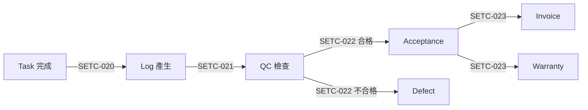

# 🔄 Event Automation (事件驅動自動化)

> **SETC 任務編號**: SETC-018 ~ SETC-023  
> **模組狀態**: ✅ 文檔完成  
> **預估工時**: 15 天

---

## 📋 任務清單

### SETC-018: Event Bus Enhancement
**檔案**: `SETC-018-event-bus-enhancement.md`  
**目的**: 增強事件總線功能  
**內容**: EventBus 優化、事件過濾、優先級隊列

### SETC-019: Workflow Orchestrator
**檔案**: `SETC-019-workflow-orchestrator.md`  
**目的**: 工作流程協調器  
**內容**: 工作流程定義、自動化引擎、狀態機管理

### SETC-020: Task to Log Automation
**檔案**: `SETC-020-task-to-log-automation.md`  
**目的**: 任務到日誌自動化  
**內容**: 任務完成 → 自動產生施工日誌

### SETC-021: Log to QC Automation
**檔案**: `SETC-021-log-to-qc-automation.md`  
**目的**: 日誌到品管自動化  
**內容**: 施工日誌 → 自動觸發品管檢查

### SETC-022: QC to Acceptance/Defect Automation
**檔案**: `SETC-022-qc-to-acceptance-defect-automation.md`  
**目的**: 品管到驗收/缺陷自動化  
**內容**: 品管結果 → 自動產生驗收單或缺陷單

### SETC-023: Acceptance to Invoice/Warranty Automation
**檔案**: `SETC-023-acceptance-to-invoice-warranty-automation.md`  
**目的**: 驗收到計價/保固自動化  
**內容**: 驗收完成 → 自動產生計價單與保固記錄

---

## 🎯 自動化流程鏈

---

## 🏗️ 核心功能

### EventBus 增強
- ✅ 事件過濾機制
- ✅ 優先級隊列
- ✅ 事件回放
- ✅ 錯誤重試

### Workflow Orchestrator
- ✅ 工作流程定義 DSL
- ✅ 自動化觸發規則
- ✅ 條件分支邏輯
- ✅ 失敗回滾機制

### 自動化規則
- ✅ Task → Log (自動產生)
- ✅ Log → QC (自動觸發)
- ✅ QC → Acceptance/Defect (條件分支)
- ✅ Acceptance → Invoice + Warranty (並行產生)

---

## 📊 進度追蹤

| 任務編號 | 任務名稱 | 文檔狀態 | 實作狀態 |
|---------|---------|---------|---------|
| SETC-018 | EventBus | ✅ 完成 | ⏳ 未開始 |
| SETC-019 | Orchestrator | ✅ 完成 | ⏳ 未開始 |
| SETC-020 | Task→Log | ✅ 完成 | ⏳ 未開始 |
| SETC-021 | Log→QC | ✅ 完成 | ⏳ 未開始 |
| SETC-022 | QC→Acc/Defect | ✅ 完成 | ⏳ 未開始 |
| SETC-023 | Acc→Inv/War | ✅ 完成 | ⏳ 未開始 |

---

## 🔗 相關連結

- **上層目錄**: [返回 discussions](../)
- **Issue Module**: [10-issue-module](../10-issue-module/)
- **Contract Module**: [20-contract-module](../20-contract-module/)

---

**優先級**: P1 (中高優先級)  
**最後更新**: 2025-12-16  
**任務數**: 6 個  
**狀態**: ✅ 文檔完成
