# 🔄 Event Automation (事件驅動自動化)

> **SETC 任務編號**: SETC-018 ~ SETC-023  
> **模組狀態**: ✅ 文檔完成  
> **預估工時**: 15 天

---

## 🏗️ Blueprint Event Bus 整合 (MANDATORY)

### 🚨 核心要求
- ✅ **事件總線增強**: 擴展 BlueprintEventBus 功能（優先級、過濾、重試）
- ✅ **工作流程協調**: WorkflowOrchestrator 協調跨模組自動化流程
- ✅ **零直接依賴**: 所有自動化透過事件訂閱實現
- ✅ **事件鏈編排**: 定義 Task → Log → QC → Acceptance → Invoice/Warranty 流程

### 📡 自動化事件鏈

#### 完整自動化流程

```mermaid
graph LR
    A[task.completed] -->|自動| B[log.created]
    B -->|自動| C[qc.pending_created]
    C -->|條件| D{QC 結果}
    D -->|通過| E[acceptance.pending_created]
    D -->|失敗| F[defect.created]
    E -->|通過| G[invoice.generated]
    E -->|通過| H[warranty.started]
    E -->|失敗| I[issue.created]
    
    style A fill:#bbf
    style B fill:#bbf
    style C fill:#bbf
    style D fill:#f96
    style E fill:#bbf
    style F fill:#fbb
    style G fill:#bfb
    style H fill:#bfb
    style I fill:#fbb
```


#### WorkflowOrchestrator 實作範例
```typescript
@Injectable({ providedIn: 'root' })
export class WorkflowOrchestrator {
  private eventBus = inject(EnhancedEventBusService);
  private logService = inject(LogService);
  private qcService = inject(QCService);
  private destroyRef = inject(DestroyRef);
  
  constructor() {
    this.setupAutomationChains();
  }
  
  private setupAutomationChains(): void {
    // Task → Log 自動化
    this.eventBus.on('task.completed')
      .pipe(takeUntilDestroyed(this.destroyRef))
      .subscribe(event => this.autoCreateLog(event));
    
    // Log → QC 自動化
    this.eventBus.on('log.created')
      .pipe(takeUntilDestroyed(this.destroyRef))
      .subscribe(event => this.autoCreateQC(event));
    
    // QC → Acceptance/Defect 分支
    this.eventBus.on('qc.completed')
      .pipe(takeUntilDestroyed(this.destroyRef))
      .subscribe(event => this.handleQCResult(event));
  }
  
  private async autoCreateLog(event: BlueprintEvent): Promise<void> {
    const { taskId, taskName, blueprintId } = event.data;
    await this.logService.autoCreateFromTask({
      blueprintId,
      taskId,
      content: `任務 ${taskName} 已完成`,
      type: 'auto_generated'
    });
  }
}
```

### 🚫 禁止模式
```typescript
// ❌ 禁止: 直接呼叫下游服務
@Injectable({ providedIn: 'root' })
export class TaskService {
  private logService = inject(LogService);  // ❌ 直接依賴
  
  async completeTask(taskId: string) {
    await this.repository.update(taskId, { status: 'completed' });
    await this.logService.createLog({ taskId });  // ❌ 直接呼叫
  }
}
```

### ✅ 正確模式：純事件驅動
```typescript
// ✅ 正確: 發送事件，由 Orchestrator 協調
@Injectable({ providedIn: 'root' })
export class TaskService {
  private eventBus = inject(BlueprintEventBusService);
  
  async completeTask(taskId: string): Promise<void> {
    await this.repository.update(taskId, { status: 'completed' });
    
    // 發送事件，觸發自動化鏈
    this.eventBus.emit({
      type: 'task.completed',
      blueprintId: this.blueprintContext.currentBlueprint()?.id,
      timestamp: new Date(),
      data: { taskId, taskName: task.name }
    });
  }
}
```

---

## 📋 任務清單

### SETC-018: Event Bus Enhancement
**檔案**: `SETC-018-event-bus-enhancement.md`  
**目的**: 增強事件總線功能  
**內容**: EventBus 優化、事件過濾、優先級隊列

### SETC-019: Workflow Orchestrator
**檔案**: `SETC-019-workflow-orchestrator.md`  
**目的**: 工作流程協調器  
**內容**: 工作流程定義、自動化引擎、狀態機管理

### SETC-020: Task to Log Automation
**檔案**: `SETC-020-task-to-log-automation.md`  
**目的**: 任務到日誌自動化  
**內容**: 任務完成 → 自動產生施工日誌

### SETC-021: Log to QC Automation
**檔案**: `SETC-021-log-to-qc-automation.md`  
**目的**: 日誌到品管自動化  
**內容**: 施工日誌 → 自動觸發品管檢查

### SETC-022: QC to Acceptance/Defect Automation
**檔案**: `SETC-022-qc-to-acceptance-defect-automation.md`  
**目的**: 品管到驗收/缺陷自動化  
**內容**: 品管結果 → 自動產生驗收單或缺陷單

### SETC-023: Acceptance to Invoice/Warranty Automation
**檔案**: `SETC-023-acceptance-to-invoice-warranty-automation.md`  
**目的**: 驗收到計價/保固自動化  
**內容**: 驗收完成 → 自動產生計價單與保固記錄

---

## 🎯 自動化流程鏈

```mermaid
graph LR
    A[Task 完成] -->|SETC-020| B[Log 產生]
    B -->|SETC-021| C[QC 檢查]
    C -->|SETC-022 合格| D[Acceptance]
    C -->|SETC-022 不合格| E[Defect]
    D -->|SETC-023| F[Invoice]
    D -->|SETC-023| G[Warranty]
```



---

## 🏗️ 核心功能

### EventBus 增強
- ✅ 事件過濾機制
- ✅ 優先級隊列
- ✅ 事件回放
- ✅ 錯誤重試

### Workflow Orchestrator
- ✅ 工作流程定義 DSL
- ✅ 自動化觸發規則
- ✅ 條件分支邏輯
- ✅ 失敗回滾機制

### 自動化規則
- ✅ Task → Log (自動產生)
- ✅ Log → QC (自動觸發)
- ✅ QC → Acceptance/Defect (條件分支)
- ✅ Acceptance → Invoice + Warranty (並行產生)

---

## 📊 進度追蹤

| 任務編號 | 任務名稱 | 文檔狀態 | 實作狀態 |
|---------|---------|---------|---------|
| SETC-018 | EventBus | ✅ 完成 | ⏳ 未開始 |
| SETC-019 | Orchestrator | ✅ 完成 | ⏳ 未開始 |
| SETC-020 | Task→Log | ✅ 完成 | ⏳ 未開始 |
| SETC-021 | Log→QC | ✅ 完成 | ⏳ 未開始 |
| SETC-022 | QC→Acc/Defect | ✅ 完成 | ⏳ 未開始 |
| SETC-023 | Acc→Inv/War | ✅ 完成 | ⏳ 未開始 |

---

## 🔗 相關連結

- **上層目錄**: [返回 discussions](../)
- **Issue Module**: [10-issue-module](../10-issue-module/)
- **Contract Module**: [20-contract-module](../20-contract-module/)

---

**優先級**: P1 (中高優先級)  
**最後更新**: 2025-12-16  
**任務數**: 6 個  
**狀態**: ✅ 文檔完成
