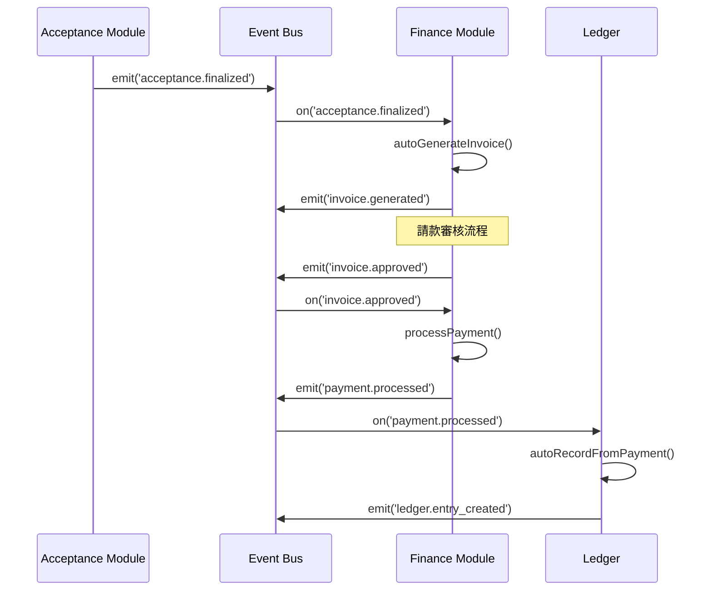
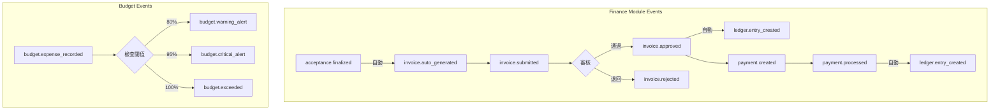

# SETC-068: Finance Event Integration

> **任務編號**: SETC-068  
> **模組**: Finance Module (財務模組)  
> **優先級**: P1 (Important)  
> **預估工時**: 2 天  
> **依賴**: SETC-067  
> **狀態**: 📋 待開始

---

## 📋 任務概述

### 目標
實作財務模組的事件整合服務，與 SETC 工作流程中的 Acceptance、Warranty 等模組透過 Event Bus 進行通訊。

### 範圍
- 定義財務模組所有事件類型
- 設定與其他模組的事件訂閱
- 實作 SETC 自動化工作流程
- 處理驗收完成的自動請款生成

---

## 🔄 SETC 事件流程



---

## 🏗️ 技術實作

### 事件類型定義

```typescript
export const FINANCE_EVENT_TYPES = {
  // 請款事件
  INVOICE_CREATED: 'invoice.created',
  INVOICE_UPDATED: 'invoice.updated',
  INVOICE_SUBMITTED: 'invoice.submitted',
  INVOICE_APPROVED: 'invoice.approved',
  INVOICE_REJECTED: 'invoice.rejected',
  INVOICE_AUTO_GENERATED: 'invoice.auto_generated',
  
  // 付款事件
  PAYMENT_CREATED: 'payment.created',
  PAYMENT_PROCESSED: 'payment.processed',
  PAYMENT_CANCELLED: 'payment.cancelled',
  
  // 預算事件
  BUDGET_CREATED: 'budget.created',
  BUDGET_UPDATED: 'budget.updated',
  BUDGET_EXPENSE_RECORDED: 'budget.expense_recorded',
  BUDGET_WARNING_ALERT: 'budget.warning_alert',
  BUDGET_CRITICAL_ALERT: 'budget.critical_alert',
  BUDGET_EXCEEDED: 'budget.exceeded',
  
  // 帳務事件
  LEDGER_ENTRY_CREATED: 'ledger.entry_created'
} as const;

// ============ 事件 Payload 定義 ============

export interface InvoiceGeneratedEvent {
  invoiceId: string;
  invoiceNumber: string;
  blueprintId: string;
  acceptanceId?: string;
  totalAmount: number;
  timestamp: Date;
}

export interface InvoiceApprovedEvent {
  invoiceId: string;
  invoiceNumber: string;
  blueprintId: string;
  totalAmount: number;
  approvedBy: string;
  timestamp: Date;
}

export interface PaymentProcessedEvent {
  paymentId: string;
  paymentNumber: string;
  blueprintId: string;
  invoiceId: string;
  amount: number;
  paymentDate: Date;
  timestamp: Date;
}

export interface BudgetAlertEvent {
  budgetId: string;
  budgetName: string;
  blueprintId: string;
  alertType: 'warning' | 'critical' | 'exceeded';
  utilizationRate: number;
  timestamp: Date;
}

export interface LedgerEntryCreatedEvent {
  entryId: string;
  entryNumber: string;
  blueprintId: string;
  sourceType: string;
  sourceId?: string;
  amount: number;
  timestamp: Date;
}
```

### 事件服務實作

```typescript
import { Injectable, inject, OnDestroy } from '@angular/core';
import { Subject, takeUntil } from 'rxjs';
import { IEventBus } from '@core/blueprint/platform/event-bus';
import { InvoiceService } from './invoice.service';
import { PaymentService } from './payment.service';
import { LedgerService } from './ledger.service';
import { FINANCE_EVENT_TYPES, AcceptanceFinalizedEvent } from './finance-events.types';

@Injectable({ providedIn: 'root' })
export class FinanceEventService implements OnDestroy {
  private eventBus = inject(IEventBus);
  private invoiceService = inject(InvoiceService);
  private paymentService = inject(PaymentService);
  private ledgerService = inject(LedgerService);
  
  private destroy$ = new Subject<void>();

  constructor() {
    this.setupEventListeners();
  }

  ngOnDestroy(): void {
    this.destroy$.next();
    this.destroy$.complete();
  }

  // ============ 事件監聽設定 ============

  private setupEventListeners(): void {
    // ⭐ 監聽驗收完成事件 - 自動生成請款單
    this.eventBus.on('acceptance.finalized')
      .pipe(takeUntil(this.destroy$))
      .subscribe(async (data: AcceptanceFinalizedEvent) => {
        console.log('[FinanceEventService] Acceptance finalized:', data.conclusionId);
        
        if (data.finalDecision === 'accepted' || data.finalDecision === 'conditionally_accepted') {
          try {
            await this.invoiceService.autoGenerateFromAcceptance({
              conclusionId: data.conclusionId,
              requestId: data.requestId,
              blueprintId: data.blueprintId,
              acceptedAmount: data.acceptedAmount,
              retainageAmount: data.retainageAmount,
              workItemsSummary: data.workItemsSummary
            });
          } catch (error) {
            console.error('[FinanceEventService] Failed to auto-generate invoice:', error);
          }
        }
      });

    // 監聽請款核准事件 - 記錄帳務
    this.eventBus.on('invoice.approved')
      .pipe(takeUntil(this.destroy$))
      .subscribe(async (data: any) => {
        console.log('[FinanceEventService] Invoice approved:', data.invoiceId);
        
        try {
          await this.ledgerService.autoRecordFromInvoice({
            invoiceId: data.invoiceId,
            invoiceNumber: data.invoiceNumber,
            blueprintId: data.blueprintId,
            totalAmount: data.totalAmount,
            subtotal: data.subtotal,
            retainageAmount: data.retainageAmount
          });
        } catch (error) {
          console.error('[FinanceEventService] Failed to record ledger entry:', error);
        }
      });

    // 監聽付款完成事件 - 記錄帳務
    this.eventBus.on('payment.processed')
      .pipe(takeUntil(this.destroy$))
      .subscribe(async (data: any) => {
        console.log('[FinanceEventService] Payment processed:', data.paymentId);
        
        try {
          await this.ledgerService.autoRecordFromPayment({
            paymentId: data.paymentId,
            paymentNumber: data.paymentNumber,
            blueprintId: data.blueprintId,
            invoiceId: data.invoiceId,
            amount: data.amount,
            paymentDate: data.paymentDate
          });
        } catch (error) {
          console.error('[FinanceEventService] Failed to record payment ledger:', error);
        }
      });

    // 監聽預算超支事件 - 發送通知
    this.eventBus.on('budget.exceeded')
      .pipe(takeUntil(this.destroy$))
      .subscribe(async (data: any) => {
        console.log('[FinanceEventService] Budget exceeded:', data.budgetId);
        
        // 發送通知
        this.eventBus.emit('notification.send', {
          type: 'warning',
          title: '預算超支警告',
          message: `預算 "${data.budgetName}" 已超支，超支金額: ${data.excessAmount}`,
          recipients: await this.getFinanceManagerIds(data.blueprintId),
          timestamp: new Date()
        });
      });
  }

  // ============ 事件發送方法 ============

  /**
   * 發送請款生成事件
   */
  emitInvoiceGenerated(data: InvoiceGeneratedEvent): void {
    this.eventBus.emit(FINANCE_EVENT_TYPES.INVOICE_AUTO_GENERATED, data);
    console.log('[FinanceEventService] Invoice auto-generated:', data.invoiceId);
  }

  /**
   * 發送付款完成事件
   */
  emitPaymentProcessed(data: PaymentProcessedEvent): void {
    this.eventBus.emit(FINANCE_EVENT_TYPES.PAYMENT_PROCESSED, data);
    console.log('[FinanceEventService] Payment processed:', data.paymentId);
  }

  /**
   * 發送預算預警事件
   */
  emitBudgetAlert(data: BudgetAlertEvent): void {
    const eventType = data.alertType === 'critical' 
      ? FINANCE_EVENT_TYPES.BUDGET_CRITICAL_ALERT
      : data.alertType === 'exceeded'
        ? FINANCE_EVENT_TYPES.BUDGET_EXCEEDED
        : FINANCE_EVENT_TYPES.BUDGET_WARNING_ALERT;
    
    this.eventBus.emit(eventType, data);
    console.log('[FinanceEventService] Budget alert:', data.alertType, data.budgetId);
  }

  // ============ Private Methods ============

  private async getFinanceManagerIds(blueprintId: string): Promise<string[]> {
    // TODO: 從 BlueprintService 取得財務管理員列表
    return ['finance-manager-1'];
  }
}
```

---

## 📊 事件流程圖



---

## 🔗 與其他模組的事件整合

### 接收的事件

| 來源模組 | 事件 | 處理動作 |
|----------|------|----------|
| Acceptance | `acceptance.finalized` | 自動生成請款單 |

### 發送的事件

| 事件 | 目標模組 | 說明 |
|------|----------|------|
| `invoice.auto_generated` | - | 請款單自動生成 |
| `invoice.approved` | Ledger | 觸發帳務記錄 |
| `payment.processed` | Ledger | 觸發付款帳務 |
| `budget.exceeded` | Notification | 發送超支通知 |

---

## ✅ 交付物

- [ ] `finance-events.types.ts`
- [ ] `finance-event.service.ts`
- [ ] `finance-event.service.spec.ts`
- [ ] 更新 `index.ts` 匯出

---

## 🎯 驗收標準

1. ✅ 所有事件類型正確定義
2. ✅ 驗收完成自動觸發正確
3. ✅ 帳務自動記錄正確
4. ✅ 預算預警通知正確
5. ✅ 與其他模組整合正常
6. ✅ 單元測試覆蓋率 >80%

---

**文件版本**: 1.0.0  
**建立日期**: 2025-12-15  
**最後更新**: 2025-12-15
