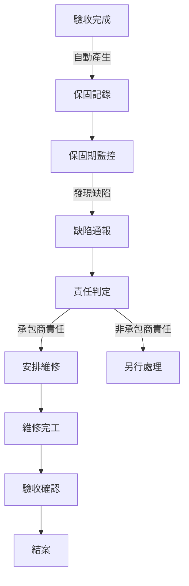

# 🛡️ Warranty Module (保固管理模組)

> **SETC 任務編號**: SETC-032 ~ SETC-039  
> **模組狀態**: ✅ 文檔完成  
> **預估工時**: 18 天

---

## 🏗️ Blueprint Event Bus 整合 (MANDATORY)

### 🚨 核心要求
- ✅ **零直接依賴**: Warranty Module 不得直接注入其他模組服務
- ✅ **事件驅動**: 所有模組間通訊透過 BlueprintEventBus
- ✅ **訂閱上游事件**: 監聽 Acceptance 事件（保固開始觸發點）
- ✅ **發送領域事件**: 發送 warranty.* 系列事件
- ✅ **Issue 整合**: 嚴重保固缺陷轉為 Issue

### 📡 事件整合

#### 訂閱事件 (Subscribe)
```typescript
// Warranty Module 監聽其他模組事件
'acceptance.passed'          → 🔥 自動啟動保固期（關鍵觸發點）
'acceptance.completed'       → 記錄保固基準資訊
```

#### 發送事件 (Emit)
```typescript
// Warranty Module 發送的領域事件
'warranty.started'           → 保固開始
'warranty.expiring_soon'     → 保固即將到期預警
'warranty.expired'           → 保固到期
'warranty.defect_reported'   → 保固缺陷通報
'warranty.repair_scheduled'  → 維修排程
'warranty.repair_completed'  → 維修完成
'warranty.defect_verified'   → 缺陷驗證通過
'warranty.extended'          → 保固期延長
'warranty.closed'            → 保固結案
```

#### 自動啟動保固流程
```typescript
@Injectable({ providedIn: 'root' })
export class WarrantyEventService {
  private eventBus = inject(BlueprintEventBusService);
  private destroyRef = inject(DestroyRef);
  
  constructor() {
    this.setupEventListeners();
  }
  
  private setupEventListeners(): void {
    // 🔥 監聽驗收通過 → 自動啟動保固期
    this.eventBus.on('acceptance.passed')
      .pipe(takeUntilDestroyed(this.destroyRef))
      .subscribe(event => {
        this.autoStartWarranty(event);
      });
  }
  
  private async autoStartWarranty(event: BlueprintEvent): Promise<void> {
    const { acceptanceId, workItems, blueprintId } = event.data;
    
    // 建立保固記錄
    const warranty = await this.repository.create({
      blueprintId,
      acceptanceId,
      startDate: new Date(),
      endDate: this.calculateEndDate(new Date(), 365), // 預設 1 年
      status: 'active',
      workItems
    });
    
    // 發送保固開始事件
    this.eventBus.emit({
      type: 'warranty.started',
      blueprintId,
      timestamp: new Date(),
      data: {
        warrantyId: warranty.id,
        acceptanceId,
        startDate: warranty.startDate,
        endDate: warranty.endDate
      }
    });
  }
  
  // 嚴重保固缺陷 → 升級為 Issue
  private async handleSevereDefect(event: BlueprintEvent): Promise<void> {
    const { defectId, severity } = event.data;
    
    if (severity === 'critical') {
      this.eventBus.emit({
        type: 'warranty.defect_escalated_to_issue',
        blueprintId: event.blueprintId,
        timestamp: new Date(),
        data: {
          warrantyDefectId: defectId,
          severity: 'critical'
        }
      });
    }
  }
}
```

### 🚫 禁止模式
```typescript
// ❌ 禁止: 直接注入其他模組
@Injectable({ providedIn: 'root' })
export class WarrantyService {
  private acceptanceService = inject(AcceptanceService); // ❌ 禁止
  private issueService = inject(IssueService);           // ❌ 禁止
  
  async startWarranty(acceptanceId: string) {
    const acceptance = await this.acceptanceService.getById(acceptanceId); // ❌
  }
}
```

### ✅ 正確模式
```typescript
// ✅ 正確: 透過事件訂閱自動處理
@Injectable({ providedIn: 'root' })
export class WarrantyService {
  private eventBus = inject(BlueprintEventBusService);
  
  async reportDefect(warrantyId: string, defect: WarrantyDefect): Promise<void> {
    const defectRecord = await this.repository.createDefect(warrantyId, defect);
    
    // 發送事件
    this.eventBus.emit({
      type: 'warranty.defect_reported',
      blueprintId: this.blueprintContext.currentBlueprint()?.id,
      timestamp: new Date(),
      data: {
        warrantyId,
        defectId: defectRecord.id,
        severity: defect.severity
      }
    });
  }
}
```

---

## 📋 任務清單

### SETC-032: Warranty Module Foundation
**檔案**: `SETC-032-warranty-module-foundation.md`  
**目的**: 建立保固模組基礎架構  
**內容**: 模組註冊、核心資料模型、基礎結構

### SETC-033: Warranty Repository Implementation
**檔案**: `SETC-033-warranty-repository-implementation.md`  
**目的**: 實作資料存取層  
**內容**: Repository 介面、Firestore 操作、查詢優化

### SETC-034: Warranty Period Management
**檔案**: `SETC-034-warranty-period-management.md`  
**目的**: 保固期限管理  
**內容**: 保固期計算、到期提醒、延長處理

### SETC-035: Warranty Defect Management
**檔案**: `SETC-035-warranty-defect-management.md`  
**目的**: 保固缺陷管理  
**內容**: 缺陷通報、判定流程、責任歸屬

### SETC-036: Warranty Repair Management
**檔案**: `SETC-036-warranty-repair-management.md`  
**目的**: 保固維修管理  
**內容**: 維修派工、進度追蹤、完工驗收

### SETC-037: Warranty Event Integration
**檔案**: `SETC-037-warranty-event-integration.md`  
**目的**: 事件驅動整合  
**內容**: 領域事件、EventBus、跨模組通訊

### SETC-038: Warranty UI Components
**檔案**: `SETC-038-warranty-ui-components.md`  
**目的**: 使用者介面元件  
**內容**: List/Detail/Form Components、維修追蹤介面

### SETC-039: Warranty Testing & Integration
**檔案**: `SETC-039-warranty-testing-integration.md`  
**目的**: 測試覆蓋與整合  
**內容**: 單元測試、整合測試、E2E 測試

---

## 🏗️ 核心功能

### 保固期管理
- ✅ 保固期自動計算 (驗收完成 → 保固開始)
- ✅ 保固到期提醒
- ✅ 保固期延長處理
- ✅ 保固狀態追蹤

### 缺陷管理
- ✅ 保固期內缺陷通報
- ✅ 缺陷責任判定 (施工/材料/設計)
- ✅ 缺陷處理流程
- ✅ 缺陷統計分析

### 維修管理
- ✅ 維修派工
- ✅ 維修進度追蹤
- ✅ 維修完工驗收
- ✅ 維修成本追蹤

### 資料模型
- **Warranty**: 保固記錄
- **WarrantyDefect**: 保固缺陷
- **WarrantyRepair**: 維修記錄
- **WarrantyStatus**: 保固狀態

---

## 🔄 業務流程



---

## 📊 進度追蹤

| 任務編號 | 任務名稱 | 文檔狀態 | 實作狀態 |
|---------|---------|---------|---------|
| SETC-032 | Foundation | ✅ 完成 | ⏳ 未開始 |
| SETC-033 | Repository | ✅ 完成 | ⏳ 未開始 |
| SETC-034 | Period Mgmt | ✅ 完成 | ⏳ 未開始 |
| SETC-035 | Defect Mgmt | ✅ 完成 | ⏳ 未開始 |
| SETC-036 | Repair Mgmt | ✅ 完成 | ⏳ 未開始 |
| SETC-037 | Events | ✅ 完成 | ⏳ 未開始 |
| SETC-038 | UI | ✅ 完成 | ⏳ 未開始 |
| SETC-039 | Testing | ✅ 完成 | ⏳ 未開始 |

---

## 🔗 相關連結

- **上層目錄**: [返回 discussions](../)
- **Acceptance Module**: [80-acceptance-module](../80-acceptance-module/)
- **Defect Module**: [60-defect-module](../60-defect-module/)

---

**優先級**: P1 (中優先級)  
**最後更新**: 2025-12-16  
**任務數**: 8 個  
**狀態**: ✅ 文檔完成
