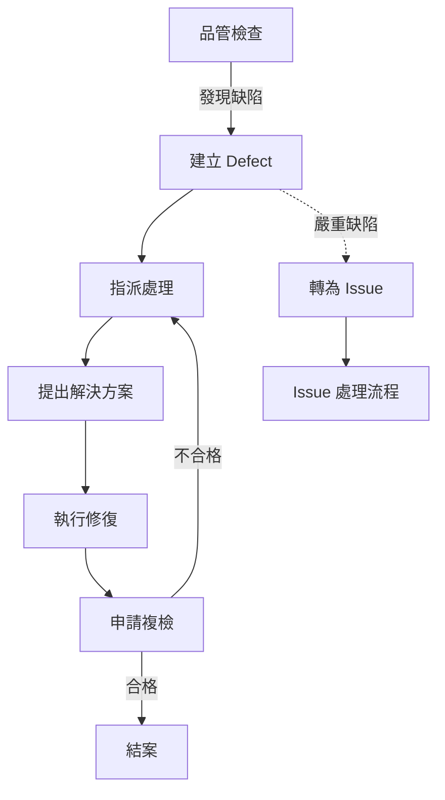

# 🔧 Defect Module (缺陷管理模組)

> **SETC 任務編號**: SETC-040 ~ SETC-045  
> **模組狀態**: ✅ 文檔完成  
> **預估工時**: 10 天

---

## 🏗️ Blueprint Event Bus 整合 (MANDATORY)

### 🚨 核心要求
- ✅ **零直接依賴**: Defect Module 不得直接注入其他模組服務
- ✅ **事件驅動**: 所有模組間通訊透過 BlueprintEventBus
- ✅ **訂閱上游事件**: 監聽 QC、Acceptance 事件
- ✅ **發送領域事件**: 發送 defect.* 系列事件
- ✅ **Issue 整合**: 嚴重缺陷自動轉為 Issue

### 📡 事件整合

#### 訂閱事件 (Subscribe)
```typescript
// Defect Module 監聽其他模組事件
'qc.failed'                  → 自動建立 Defect
'qc.defect_found'            → 自動建立 Defect
'acceptance.item_rejected'   → 建立 Defect (針對單項)
```

#### 發送事件 (Emit)
```typescript
// Defect Module 發送的領域事件
'defect.created'             → 缺陷建立
'defect.assigned'            → 指派處理
'defect.resolved'            → 解決完成
'defect.reinspection_requested' → 申請複檢
'defect.verified'            → 複檢通過
'defect.verification_failed' → 複檢失敗
'defect.closed'              → 缺陷結案
'defect.escalated_to_issue'  → 升級為 Issue（嚴重缺陷）
```

#### 事件處理範例
```typescript
@Injectable({ providedIn: 'root' })
export class DefectEventService {
  private eventBus = inject(BlueprintEventBusService);
  private destroyRef = inject(DestroyRef);
  
  constructor() {
    this.setupEventListeners();
  }
  
  private setupEventListeners(): void {
    // 監聽 QC 失敗 → 自動建立 Defect
    this.eventBus.on('qc.failed')
      .pipe(takeUntilDestroyed(this.destroyRef))
      .subscribe(event => {
        this.autoCreateDefectFromQC(event);
      });
    
    // 監聽嚴重缺陷解決失敗 → 升級為 Issue
    this.eventBus.on('defect.resolution_failed')
      .pipe(
        filter(event => event.data.severity === 'critical'),
        takeUntilDestroyed(this.destroyRef)
      )
      .subscribe(event => {
        this.escalateToIssue(event);
      });
  }
  
  private async escalateToIssue(event: BlueprintEvent): Promise<void> {
    const { defectId, blueprintId } = event.data;
    
    // 發送事件讓 Issue Module 建立
    this.eventBus.emit({
      type: 'defect.escalated_to_issue',
      blueprintId,
      timestamp: new Date(),
      data: {
        defectId,
        severity: 'critical',
        reason: 'Multiple resolution attempts failed'
      }
    });
  }
}
```

### 🚫 禁止模式
```typescript
// ❌ 禁止: 直接注入其他模組
@Injectable({ providedIn: 'root' })
export class DefectService {
  private qcService = inject(QCService);      // ❌ 禁止
  private issueService = inject(IssueService); // ❌ 禁止
  
  async createDefectFromQC(qcId: string) {
    const qc = await this.qcService.getById(qcId);  // ❌ 跨模組呼叫
  }
}
```

### ✅ 正確模式
```typescript
// ✅ 正確: 透過事件通訊
@Injectable({ providedIn: 'root' })
export class DefectService {
  private eventBus = inject(BlueprintEventBusService);
  
  async resolveDefect(defectId: string): Promise<void> {
    await this.repository.update(defectId, {
      status: 'resolved',
      resolvedAt: new Date()
    });
    
    // 發送事件
    this.eventBus.emit({
      type: 'defect.resolved',
      blueprintId: this.blueprintContext.currentBlueprint()?.id,
      timestamp: new Date(),
      data: { defectId }
    });
  }
}
```

---

## 📋 任務清單

### SETC-040: Defect Service Expansion
**檔案**: `SETC-040-defect-service-expansion.md`  
**目的**: 擴展缺陷服務基礎功能  
**內容**: 服務架構優化、功能擴展規劃

### SETC-041: Defect Lifecycle Service
**檔案**: `SETC-041-defect-lifecycle-service.md`  
**目的**: 缺陷生命週期管理服務  
**內容**: 狀態機、生命週期追蹤、自動化觸發

### SETC-042: Defect Resolution Service
**檔案**: `SETC-042-defect-resolution-service.md`  
**目的**: 缺陷解決服務  
**內容**: 解決方案提交、責任歸屬、成本追蹤

### SETC-043: Defect Reinspection Service
**檔案**: `SETC-043-defect-reinspection-service.md`  
**目的**: 缺陷複檢服務  
**內容**: 複檢流程、合格判定、不合格處理

### SETC-044: Defect-Issue Integration
**檔案**: `SETC-044-defect-issue-integration.md`  
**目的**: 缺陷與問題模組整合  
**內容**: Defect → Issue 轉換、雙向同步、狀態映射

### SETC-045: Defect Testing & Integration
**檔案**: `SETC-045-defect-testing-integration.md`  
**目的**: 缺陷模組測試與整合  
**內容**: 單元測試、整合測試、E2E 測試

---

## 🏗️ 核心功能

### 生命週期管理
- ✅ 缺陷狀態轉換 (New → InProgress → Resolved → Verified)
- ✅ 自動化狀態觸發
- ✅ 生命週期事件通知
- ✅ 狀態歷史追蹤

### 解決流程
- ✅ 解決方案提交
- ✅ 責任歸屬判定
- ✅ 修復成本追蹤
- ✅ 解決進度監控

### 複檢機制
- ✅ 複檢申請流程
- ✅ 複檢結果判定
- ✅ 合格 → 結案
- ✅ 不合格 → 重新處理

### Issue 整合
- ✅ Defect → Issue 自動轉換
- ✅ 狀態雙向同步
- ✅ 資料一致性維護
- ✅ 歷史記錄保留

---

## 🔄 業務流程



---

## 📊 進度追蹤

| 任務編號 | 任務名稱 | 文檔狀態 | 實作狀態 |
|---------|---------|---------|---------|
| SETC-040 | Expansion | ✅ 完成 | ⏳ 未開始 |
| SETC-041 | Lifecycle | ✅ 完成 | ⏳ 未開始 |
| SETC-042 | Resolution | ✅ 完成 | ⏳ 未開始 |
| SETC-043 | Reinspection | ✅ 完成 | ⏳ 未開始 |
| SETC-044 | Issue Integration | ✅ 完成 | ⏳ 未開始 |
| SETC-045 | Testing | ✅ 完成 | ⏳ 未開始 |

---

## 🔗 相關連結

- **上層目錄**: [返回 discussions](../)
- **Issue Module**: [10-issue-module](../10-issue-module/)
- **Warranty Module**: [50-warranty-module](../50-warranty-module/)

---

**優先級**: P1 (中優先級)  
**最後更新**: 2025-12-16  
**任務數**: 6 個  
**狀態**: ✅ 文檔完成
