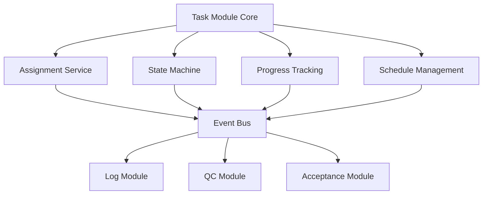

# 📋 Task Module Enhancement (任務模組擴展)

> **SETC 任務編號**: SETC-046 ~ SETC-053  
> **模組狀態**: ✅ 文檔完成  
> **預估工時**: 16 天

---

## 🏗️ Blueprint Event Bus 整合 (MANDATORY)

### 🚨 核心要求
- ✅ **零直接依賴**: Task Module 不得直接注入其他模組服務
- ✅ **事件驅動**: 所有模組間通訊透過 BlueprintEventBus
- ✅ **訂閱上游事件**: 監聽 Contract 事件
- ✅ **發送領域事件**: 發送 task.* 系列事件（觸發自動化鏈）
- ✅ **階段一模組**: 任務完成觸發 Log → QC → Acceptance 自動化流程

### 📡 事件整合

#### 訂閱事件 (Subscribe)
```typescript
// Task Module 監聽其他模組事件
'contract.activated'         → 啟用任務建立功能
'contract.work_item_updated' → 更新可用工項清單
'contract.suspended'         → 暫停新任務建立
```

#### 發送事件 (Emit)
```typescript
// Task Module 發送的領域事件（關鍵：觸發下游自動化）
'task.created'               → 任務建立
'task.assigned'              → 任務指派
'task.started'               → 任務開始
'task.completed'             → 🔥 任務完成（觸發 Log 自動產生）
'task.updated'               → 任務更新
'task.cancelled'             → 任務取消
'task.delayed'               → 任務延遲預警
```

#### 自動化流程起點：task.completed
```typescript
@Injectable({ providedIn: 'root' })
export class TaskService {
  private eventBus = inject(BlueprintEventBusService);
  private blueprintContext = inject(BlueprintContextService);
  
  async completeTask(taskId: string): Promise<void> {
    const task = await this.repository.update(taskId, {
      status: 'completed',
      completedAt: new Date()
    });
    
    // 🔥 發送完成事件，觸發整條自動化鏈
    // Task → Log → QC → Acceptance → Invoice/Warranty
    this.eventBus.emit({
      type: 'task.completed',
      blueprintId: task.blueprintId,
      timestamp: new Date(),
      actor: this.userContext.currentUser()?.id,
      data: {
        taskId: task.id,
        taskName: task.name,
        workItemId: task.workItemId,
        completedAt: new Date(),
        location: task.location,
        photos: task.photos
      }
    });
  }
}
```

#### 監聽 Contract 事件
```typescript
@Injectable({ providedIn: 'root' })
export class TaskEventService {
  private eventBus = inject(BlueprintEventBusService);
  private destroyRef = inject(DestroyRef);
  
  constructor() {
    this.setupEventListeners();
  }
  
  private setupEventListeners(): void {
    // 監聽合約生效 → 啟用任務建立
    this.eventBus.on('contract.activated')
      .pipe(takeUntilDestroyed(this.destroyRef))
      .subscribe(event => {
        this.handleContractActivated(event);
      });
  }
  
  private handleContractActivated(event: BlueprintEvent): void {
    const { contractId, workItems } = event.data;
    
    // 更新可用工項清單（不直接呼叫 ContractService）
    this.availableWorkItems.update(items => [
      ...items,
      ...workItems
    ]);
  }
}
```

### 🚫 禁止模式
```typescript
// ❌ 禁止: 直接注入下游模組
@Injectable({ providedIn: 'root' })
export class TaskService {
  private logService = inject(LogService);          // ❌ 絕對禁止
  private contractService = inject(ContractService); // ❌ 絕對禁止
  
  async completeTask(taskId: string) {
    await this.repository.update(taskId, { status: 'completed' });
    await this.logService.createLog({ taskId });  // ❌ 直接呼叫
  }
}
```

### ✅ 正確模式：純事件驅動
```typescript
// ✅ 正確: 只發送事件，讓 WorkflowOrchestrator 協調
@Injectable({ providedIn: 'root' })
export class TaskService {
  private eventBus = inject(BlueprintEventBusService);
  
  async completeTask(taskId: string): Promise<void> {
    await this.repository.update(taskId, { status: 'completed' });
    
    // 只負責發送事件
    this.eventBus.emit({
      type: 'task.completed',
      blueprintId: this.blueprintContext.currentBlueprint()?.id,
      timestamp: new Date(),
      data: { taskId }
    });
    // 後續 Log、QC、Acceptance 由 WorkflowOrchestrator 自動處理
  }
}
```

---

## 📋 任務清單

### SETC-046: Task Module Enhancement Planning
**檔案**: `SETC-046-task-module-enhancement-planning.md`  
**目的**: 任務模組擴展規劃  
**內容**: 功能分析、擴展方向、優先級排序

### SETC-047: Task Repository Enhancement
**檔案**: `SETC-047-task-repository-enhancement.md`  
**目的**: Repository 層增強  
**內容**: 複雜查詢、效能優化、快取策略

### SETC-048: Task Assignment Service
**檔案**: `SETC-048-task-assignment-service.md`  
**目的**: 任務指派服務  
**內容**: 智慧指派、負載平衡、技能匹配

### SETC-049: Task State Machine Service
**檔案**: `SETC-049-task-state-machine-service.md`  
**目的**: 任務狀態機服務  
**內容**: 狀態轉換、驗證規則、自動化觸發

### SETC-050: Task Progress Tracking Service
**檔案**: `SETC-050-task-progress-tracking-service.md`  
**目的**: 任務進度追蹤服務  
**內容**: 進度計算、里程碑、預警機制

### SETC-051: Task Schedule Management Service
**檔案**: `SETC-051-task-schedule-management-service.md`  
**目的**: 任務排程管理服務  
**內容**: 時程規劃、依賴關係、資源分配

### SETC-052: Task Event Integration
**檔案**: `SETC-052-task-event-integration.md`  
**目的**: 任務事件整合  
**內容**: 領域事件、跨模組通訊、自動化觸發

### SETC-053: Task UI Components & Testing
**檔案**: `SETC-053-task-ui-components-testing.md`  
**目的**: 任務 UI 元件與測試  
**內容**: 進階元件、甘特圖、看板視圖

---

## 🏗️ 核心功能擴展

### 智慧指派
- ✅ 技能匹配演算法
- ✅ 負載平衡
- ✅ 優先級調度
- ✅ 自動重新指派

### 狀態機管理
- ✅ 完整狀態轉換規則
- ✅ 條件驗證
- ✅ 自動化觸發
- ✅ 狀態歷史追蹤

### 進度追蹤
- ✅ 自動進度計算
- ✅ 里程碑管理
- ✅ 延遲預警
- ✅ 進度報表

### 排程管理
- ✅ 任務依賴關係
- ✅ 資源衝突偵測
- ✅ 關鍵路徑分析
- ✅ 時程優化建議

### UI 增強
- ✅ 甘特圖視圖
- ✅ 看板視圖
- ✅ 行事曆視圖
- ✅ 拖拽排程

---

## 🔄 擴展架構



---

## 📊 進度追蹤

| 任務編號 | 任務名稱 | 文檔狀態 | 實作狀態 |
|---------|---------|---------|---------|
| SETC-046 | Planning | ✅ 完成 | ⏳ 未開始 |
| SETC-047 | Repository | ✅ 完成 | ⏳ 未開始 |
| SETC-048 | Assignment | ✅ 完成 | ⏳ 未開始 |
| SETC-049 | State Machine | ✅ 完成 | ⏳ 未開始 |
| SETC-050 | Progress | ✅ 完成 | ⏳ 未開始 |
| SETC-051 | Schedule | ✅ 完成 | ⏳ 未開始 |
| SETC-052 | Events | ✅ 完成 | ⏳ 未開始 |
| SETC-053 | UI & Test | ✅ 完成 | ⏳ 未開始 |

---

## 🔗 相關連結

- **上層目錄**: [返回 discussions](../)
- **Automation**: [30-automation](../30-automation/)
- **Acceptance**: [80-acceptance-module](../80-acceptance-module/)

---

**優先級**: P1 (中優先級)  
**最後更新**: 2025-12-16  
**任務數**: 8 個  
**狀態**: ✅ 文檔完成
