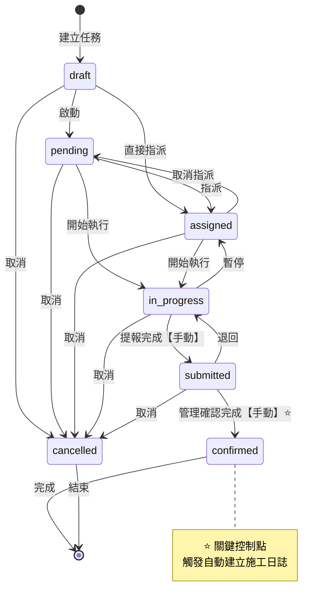

# SETC-049: Task State Machine Service

> **任務編號**: SETC-049  
> **模組**: Task Module (任務模組)  
> **優先級**: P1 (Important)  
> **預估工時**: 2 天  
> **依賴**: SETC-047  
> **狀態**: 📋 待開始

---

## 📋 任務概述

### 目標
實作任務狀態機服務，管理任務狀態流轉規則，確保狀態轉換符合 SETC 工作流程定義，並記錄完整狀態變更歷史。

### 範圍
- 定義任務狀態與轉換規則
- 實作狀態流轉驗證
- 記錄狀態變更歷史
- 整合 SETC 工作流程關鍵控制點

---

## 🔄 狀態定義

### 任務狀態

```typescript
/**
 * 任務狀態定義
 * 遵循 SETC.md 工作流程
 */
export type TaskStatus = 
  | 'draft'           // 草稿 - 任務建立但尚未啟動
  | 'pending'         // 待開始 - 等待指派或啟動
  | 'assigned'        // 已指派 - 已指派給使用者/團隊
  | 'in_progress'     // 進行中 - 施工執行中
  | 'submitted'       // 已提報 - 承包商提報完成【手動】
  | 'confirmed'       // 已確認 - 管理確認完成【手動】⭐關鍵控制點
  | 'cancelled';      // 已取消 - 任務取消

/**
 * 狀態詳細資訊
 */
export const TASK_STATUS_INFO: Record<TaskStatus, TaskStatusInfo> = {
  draft: {
    label: '草稿',
    color: 'default',
    icon: 'file-text',
    description: '任務建立中，尚未正式啟動'
  },
  pending: {
    label: '待開始',
    color: 'warning',
    icon: 'clock-circle',
    description: '等待指派或啟動'
  },
  assigned: {
    label: '已指派',
    color: 'processing',
    icon: 'user',
    description: '已指派給使用者或團隊'
  },
  in_progress: {
    label: '進行中',
    color: 'processing',
    icon: 'loading',
    description: '施工執行中'
  },
  submitted: {
    label: '已提報',
    color: 'purple',
    icon: 'check-square',
    description: '承包商已提報完成，待管理確認'
  },
  confirmed: {
    label: '已確認',
    color: 'success',
    icon: 'check-circle',
    description: '管理已確認完成'
  },
  cancelled: {
    label: '已取消',
    color: 'error',
    icon: 'close-circle',
    description: '任務已取消'
  }
};

export interface TaskStatusInfo {
  label: string;
  color: string;
  icon: string;
  description: string;
}
```

### 狀態轉換規則

```typescript
/**
 * 狀態轉換規則定義
 * 定義每個狀態可以轉換到哪些狀態
 */
export const TASK_STATE_TRANSITIONS: Record<TaskStatus, TaskStatus[]> = {
  draft: ['pending', 'assigned', 'cancelled'],
  pending: ['assigned', 'in_progress', 'cancelled'],
  assigned: ['in_progress', 'pending', 'cancelled'],
  in_progress: ['submitted', 'assigned', 'cancelled'],
  submitted: ['confirmed', 'in_progress', 'cancelled'],  // 可退回
  confirmed: [],  // 終態，不可再轉換
  cancelled: []   // 終態，不可再轉換
};

/**
 * 狀態轉換權限要求
 */
export const TASK_STATE_TRANSITION_PERMISSIONS: Record<string, string[]> = {
  'draft->pending': ['task:edit'],
  'draft->assigned': ['task:assign'],
  'pending->assigned': ['task:assign'],
  'pending->in_progress': ['task:execute'],
  'assigned->in_progress': ['task:execute'],
  'in_progress->submitted': ['task:submit'],      // 承包商提報
  'submitted->confirmed': ['task:confirm'],       // 管理確認 ⭐
  'submitted->in_progress': ['task:reject'],      // 退回
  '*->cancelled': ['task:cancel']
};
```

---

## 🏗️ 技術實作

### 服務介面定義

```typescript
import { Observable } from 'rxjs';

export interface ITaskStateMachineService {
  // 狀態轉換
  transition(
    taskId: string, 
    toStatus: TaskStatus, 
    actor: string,
    options?: TransitionOptions
  ): Promise<TaskStateTransition>;
  
  // 驗證
  canTransition(
    taskId: string, 
    toStatus: TaskStatus, 
    actor: string
  ): Promise<TransitionValidation>;
  
  getAvailableTransitions(
    taskId: string, 
    actor: string
  ): Promise<AvailableTransition[]>;
  
  // 歷史
  getStateHistory(taskId: string): Promise<TaskStateHistory[]>;
  watchStateHistory(taskId: string): Observable<TaskStateHistory[]>;
  
  // 批次操作
  transitionBatch(
    transitions: BatchTransitionRequest[]
  ): Promise<TaskStateTransition[]>;
  
  // SETC 關鍵點
  submitForConfirmation(taskId: string, actor: string, notes?: string): Promise<TaskStateTransition>;
  confirmCompletion(taskId: string, actor: string, notes?: string): Promise<TaskStateTransition>;
  rejectSubmission(taskId: string, actor: string, reason: string): Promise<TaskStateTransition>;
}

export interface TransitionOptions {
  notes?: string;
  force?: boolean;
  skipValidation?: boolean;
}

export interface TaskStateTransition {
  id: string;
  taskId: string;
  fromStatus: TaskStatus;
  toStatus: TaskStatus;
  actor: string;
  actorName: string;
  notes?: string;
  transitionedAt: Date;
  isKeyControlPoint: boolean;
}

export interface TransitionValidation {
  allowed: boolean;
  reasons: string[];
  requiredPermissions: string[];
  missingPermissions: string[];
}

export interface AvailableTransition {
  toStatus: TaskStatus;
  label: string;
  description: string;
  requiredPermissions: string[];
  isKeyControlPoint: boolean;
}

export interface TaskStateHistory {
  id: string;
  taskId: string;
  fromStatus?: TaskStatus;
  toStatus: TaskStatus;
  actor: string;
  actorName: string;
  notes?: string;
  transitionedAt: Date;
  isKeyControlPoint: boolean;
}

export interface BatchTransitionRequest {
  taskId: string;
  toStatus: TaskStatus;
  notes?: string;
}
```

### 服務實作

```typescript
import { Injectable, inject, signal } from '@angular/core';
import { Observable } from 'rxjs';
import { TaskRepository } from '../repositories/task.repository';
import { IEventBus } from '@core/blueprint/platform/event-bus';
import { ACLService } from '@delon/acl';
import { 
  ITaskStateMachineService, 
  TaskStateTransition,
  TransitionValidation,
  AvailableTransition,
  TaskStateHistory,
  TransitionOptions,
  BatchTransitionRequest
} from './task-state-machine.interface';
import { 
  TaskStatus, 
  TASK_STATE_TRANSITIONS, 
  TASK_STATE_TRANSITION_PERMISSIONS,
  TASK_STATUS_INFO 
} from '../models/task-status.model';

@Injectable({ providedIn: 'root' })
export class TaskStateMachineService implements ITaskStateMachineService {
  private taskRepository = inject(TaskRepository);
  private eventBus = inject(IEventBus);
  private aclService = inject(ACLService);

  // SETC 關鍵控制點狀態
  private readonly KEY_CONTROL_POINTS: TaskStatus[] = ['submitted', 'confirmed'];

  /**
   * 執行狀態轉換
   */
  async transition(
    taskId: string,
    toStatus: TaskStatus,
    actor: string,
    options?: TransitionOptions
  ): Promise<TaskStateTransition> {
    // 驗證轉換
    if (!options?.skipValidation) {
      const validation = await this.canTransition(taskId, toStatus, actor);
      if (!validation.allowed) {
        throw new Error(`Invalid transition: ${validation.reasons.join(', ')}`);
      }
    }

    // 取得任務
    const task = await this.taskRepository.findById(taskId);
    if (!task) {
      throw new Error(`Task ${taskId} not found`);
    }

    const fromStatus = task.status;
    const isKeyControlPoint = this.KEY_CONTROL_POINTS.includes(toStatus);

    // 更新任務狀態
    const updateData: any = {
      status: toStatus,
      updatedAt: new Date()
    };

    // 特殊狀態處理
    if (toStatus === 'in_progress' && !task.actualStartDate) {
      updateData.actualStartDate = new Date();
    }
    if (toStatus === 'confirmed') {
      updateData.completedBy = actor;
      updateData.completedAt = new Date();
      updateData.completionNotes = options?.notes;
    }

    await this.taskRepository.update(taskId, updateData);

    // 建立轉換記錄
    const transition: TaskStateTransition = {
      id: `trans-${Date.now()}`,
      taskId,
      fromStatus,
      toStatus,
      actor,
      actorName: await this.getActorName(actor),
      notes: options?.notes,
      transitionedAt: new Date(),
      isKeyControlPoint
    };

    // 記錄歷史
    await this.recordStateHistory(transition);

    // 發送事件
    this.emitTransitionEvent(transition, task);

    return transition;
  }

  /**
   * 驗證是否可以執行狀態轉換
   */
  async canTransition(
    taskId: string,
    toStatus: TaskStatus,
    actor: string
  ): Promise<TransitionValidation> {
    const task = await this.taskRepository.findById(taskId);
    if (!task) {
      return {
        allowed: false,
        reasons: ['任務不存在'],
        requiredPermissions: [],
        missingPermissions: []
      };
    }

    const reasons: string[] = [];
    const fromStatus = task.status;

    // 檢查狀態轉換規則
    const allowedTransitions = TASK_STATE_TRANSITIONS[fromStatus] || [];
    if (!allowedTransitions.includes(toStatus)) {
      reasons.push(`不允許從 ${fromStatus} 轉換到 ${toStatus}`);
    }

    // 檢查權限
    const transitionKey = `${fromStatus}->${toStatus}`;
    const requiredPermissions = TASK_STATE_TRANSITION_PERMISSIONS[transitionKey] || 
                                TASK_STATE_TRANSITION_PERMISSIONS[`*->${toStatus}`] || 
                                [];
    const missingPermissions = requiredPermissions.filter(
      perm => !this.aclService.can(perm)
    );

    if (missingPermissions.length > 0) {
      reasons.push(`缺少權限: ${missingPermissions.join(', ')}`);
    }

    // 特殊驗證
    if (toStatus === 'confirmed') {
      // 確認完成需要先提報
      if (fromStatus !== 'submitted') {
        reasons.push('需要先提報完成才能確認');
      }
    }

    return {
      allowed: reasons.length === 0,
      reasons,
      requiredPermissions,
      missingPermissions
    };
  }

  /**
   * 取得可用的狀態轉換
   */
  async getAvailableTransitions(
    taskId: string,
    actor: string
  ): Promise<AvailableTransition[]> {
    const task = await this.taskRepository.findById(taskId);
    if (!task) {
      return [];
    }

    const currentStatus = task.status;
    const possibleStatuses = TASK_STATE_TRANSITIONS[currentStatus] || [];
    const available: AvailableTransition[] = [];

    for (const status of possibleStatuses) {
      const validation = await this.canTransition(taskId, status, actor);
      if (validation.allowed) {
        const statusInfo = TASK_STATUS_INFO[status];
        available.push({
          toStatus: status,
          label: statusInfo.label,
          description: statusInfo.description,
          requiredPermissions: validation.requiredPermissions,
          isKeyControlPoint: this.KEY_CONTROL_POINTS.includes(status)
        });
      }
    }

    return available;
  }

  /**
   * 提報完成 - SETC 關鍵控制點
   */
  async submitForConfirmation(
    taskId: string,
    actor: string,
    notes?: string
  ): Promise<TaskStateTransition> {
    return this.transition(taskId, 'submitted', actor, { notes });
  }

  /**
   * 管理確認完成 - SETC 關鍵控制點 ⭐
   * 此動作會觸發自動建立施工日誌
   */
  async confirmCompletion(
    taskId: string,
    actor: string,
    notes?: string
  ): Promise<TaskStateTransition> {
    const transition = await this.transition(taskId, 'confirmed', actor, { notes });

    // 發送 SETC 關鍵事件
    // 此事件會被 WorkflowOrchestrator 監聽，觸發自動建立施工日誌
    this.eventBus.emit('task.confirmed', {
      taskId,
      blueprintId: (await this.taskRepository.findById(taskId))?.blueprintId,
      confirmedBy: actor,
      confirmedAt: new Date(),
      notes
    });

    return transition;
  }

  /**
   * 退回提報
   */
  async rejectSubmission(
    taskId: string,
    actor: string,
    reason: string
  ): Promise<TaskStateTransition> {
    return this.transition(taskId, 'in_progress', actor, { 
      notes: `退回原因: ${reason}` 
    });
  }

  /**
   * 取得狀態歷史
   */
  async getStateHistory(taskId: string): Promise<TaskStateHistory[]> {
    // TODO: 從 Firestore 取得歷史記錄
    return [];
  }

  // ============ Private Methods ============

  private async recordStateHistory(transition: TaskStateTransition): Promise<void> {
    // TODO: 儲存到 Firestore
    console.log('Recording state history:', transition);
  }

  private emitTransitionEvent(transition: TaskStateTransition, task: any): void {
    // 通用狀態變更事件
    this.eventBus.emit('task.status_changed', {
      taskId: transition.taskId,
      taskTitle: task.title,
      blueprintId: task.blueprintId,
      fromStatus: transition.fromStatus,
      toStatus: transition.toStatus,
      actor: transition.actor,
      timestamp: transition.transitionedAt
    });

    // 特定狀態事件
    switch (transition.toStatus) {
      case 'in_progress':
        this.eventBus.emit('task.started', {
          taskId: transition.taskId,
          startedBy: transition.actor,
          startedAt: transition.transitionedAt
        });
        break;
      case 'submitted':
        this.eventBus.emit('task.submitted', {
          taskId: transition.taskId,
          submittedBy: transition.actor,
          submittedAt: transition.transitionedAt
        });
        break;
      case 'cancelled':
        this.eventBus.emit('task.cancelled', {
          taskId: transition.taskId,
          cancelledBy: transition.actor,
          reason: transition.notes
        });
        break;
    }
  }

  private async getActorName(actorId: string): Promise<string> {
    // TODO: 從 UserService 取得
    return `User ${actorId}`;
  }
}
```

---

## 📊 狀態流程圖



---

## ✅ 交付物

- [ ] `task-state-machine.service.ts` - 狀態機服務實作
- [ ] `task-state-machine.interface.ts` - 介面定義
- [ ] `task-status.model.ts` - 狀態定義
- [ ] `task-state-machine.service.spec.ts` - 單元測試
- [ ] 更新 `index.ts` 匯出

---

## 🎯 驗收標準

1. ✅ 所有狀態轉換規則正確實作
2. ✅ 權限驗證正確執行
3. ✅ 狀態歷史完整記錄
4. ✅ 關鍵控制點事件正確發送
5. ✅ 與 SETC 工作流程一致
6. ✅ 單元測試覆蓋率 >80%

---

**文件版本**: 1.0.0  
**建立日期**: 2025-12-15  
**最後更新**: 2025-12-15
