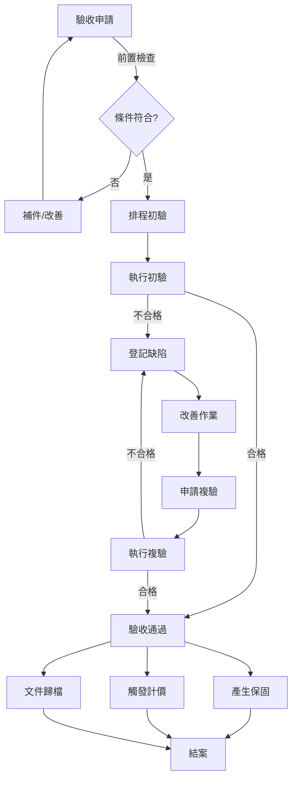

# ✅ Acceptance Module Enhancement (驗收模組擴展)

> **SETC 任務編號**: SETC-054 ~ SETC-061  
> **模組狀態**: ✅ 文檔完成  
> **預估工時**: 16 天

---

## 🏗️ Blueprint Event Bus 整合 (MANDATORY)

### 🚨 核心要求
- ✅ **零直接依賴**: Acceptance Module 不得直接注入其他模組服務
- ✅ **事件驅動**: 所有模組間通訊透過 BlueprintEventBus
- ✅ **訂閱上游事件**: 監聽 QC 事件
- ✅ **發送領域事件**: 發送 acceptance.* 系列事件
- ✅ **關鍵分支點**: 驗收結果決定下游流程（Invoice+Warranty 或 Issue）

### 📡 事件整合

#### 訂閱事件 (Subscribe)
```typescript
// Acceptance Module 監聽其他模組事件
'qc.passed'                  → 自動建立驗收待辦
'qc.all_passed'              → 可申請驗收
```

#### 發送事件 (Emit) - 關鍵分支點
```typescript
// Acceptance Module 發送的領域事件（決定下游流程）
'acceptance.requested'       → 驗收申請
'acceptance.scheduled'       → 驗收排程
'acceptance.in_progress'     → 驗收進行中
'acceptance.passed'          → 🔥 驗收通過（觸發 Invoice + Warranty）
'acceptance.failed'          → 🔥 驗收失敗（觸發 Issue）
'acceptance.partially_passed'→ 部分通過（觸發 Issue + 繼續驗收）
'acceptance.item_rejected'   → 單項不通過（可能建立 Defect）
'acceptance.completed'       → 驗收流程完成
'acceptance.cancelled'       → 驗收取消
```

#### 關鍵分支邏輯：驗收結果處理
```typescript
@Injectable({ providedIn: 'root' })
export class AcceptanceEventService {
  private eventBus = inject(BlueprintEventBusService);
  private blueprintContext = inject(BlueprintContextService);
  
  async completeAcceptance(acceptanceId: string, result: AcceptanceResult): Promise<void> {
    const acceptance = await this.repository.update(acceptanceId, {
      status: 'completed',
      result: result.overallResult,
      completedAt: new Date()
    });
    
    if (result.overallResult === 'passed') {
      // 🔥 驗收通過 → 觸發 Invoice + Warranty
      this.eventBus.emit({
        type: 'acceptance.passed',
        blueprintId: acceptance.blueprintId,
        timestamp: new Date(),
        actor: this.userContext.currentUser()?.id,
        data: {
          acceptanceId: acceptance.id,
          contractId: acceptance.contractId,
          workItems: acceptance.workItems,
          totalAmount: acceptance.totalAmount,
          completedAt: new Date()
        }
      });
    } else if (result.overallResult === 'failed') {
      // 🔥 驗收失敗 → 觸發 Issue 建立
      this.eventBus.emit({
        type: 'acceptance.failed',
        blueprintId: acceptance.blueprintId,
        timestamp: new Date(),
        data: {
          acceptanceId: acceptance.id,
          rejectedItems: result.rejectedItems,
          createIssue: true,  // 指示 Issue Module 建立問題單
          severity: this.determineSeverity(result.rejectedItems)
        }
      });
    }
  }
}
```

#### 監聽 QC 事件
```typescript
private setupEventListeners(): void {
  // 監聽 QC 全部通過 → 可申請驗收
  this.eventBus.on('qc.all_passed')
    .pipe(takeUntilDestroyed(this.destroyRef))
    .subscribe(event => {
      this.enableAcceptanceRequest(event);
    });
}

private enableAcceptanceRequest(event: BlueprintEvent): void {
  const { taskId, blueprintId } = event.data;
  
  // 更新狀態：可申請驗收（不直接呼叫 QCService）
  this.acceptanceReadyTasks.update(tasks => [
    ...tasks,
    { taskId, blueprintId, qcPassedAt: new Date() }
  ]);
}
```

### 🚫 禁止模式
```typescript
// ❌ 禁止: 直接注入其他模組
@Injectable({ providedIn: 'root' })
export class AcceptanceService {
  private qcService = inject(QCService);             // ❌ 禁止
  private invoiceService = inject(InvoiceService);   // ❌ 禁止
  private warrantyService = inject(WarrantyService); // ❌ 禁止
  
  async completeAcceptance(acceptanceId: string) {
    const acceptance = await this.repository.update(acceptanceId, { status: 'completed' });
    
    // ❌ 直接呼叫下游服務
    await this.invoiceService.generateInvoice(acceptanceId);
    await this.warrantyService.startWarranty(acceptanceId);
  }
}
```

### ✅ 正確模式：純事件驅動
```typescript
// ✅ 正確: 透過事件通知下游，讓各模組自行處理
@Injectable({ providedIn: 'root' })
export class AcceptanceService {
  private eventBus = inject(BlueprintEventBusService);
  
  async completeAcceptance(acceptanceId: string, result: AcceptanceResult): Promise<void> {
    await this.repository.update(acceptanceId, { status: 'completed' });
    
    // 只負責發送事件
    this.eventBus.emit({
      type: 'acceptance.passed',
      blueprintId: this.blueprintContext.currentBlueprint()?.id,
      timestamp: new Date(),
      data: { acceptanceId, workItems: result.workItems }
    });
    
    // Invoice Module 和 Warranty Module 會自動訂閱此事件並處理
    // 不需要直接呼叫
  }
}
```

---

## 📋 任務清單

### SETC-054: Acceptance Module Enhancement Planning
**檔案**: `SETC-054-acceptance-module-enhancement-planning.md`  
**目的**: 驗收模組擴展規劃  
**內容**: 功能分析、擴展方向、優先級排序

### SETC-055: Acceptance Repository Implementation
**檔案**: `SETC-055-acceptance-repository-implementation.md`  
**目的**: Repository 層完整實作  
**內容**: 資料存取、複雜查詢、效能優化

### SETC-056: Acceptance Request Service
**檔案**: `SETC-056-acceptance-request-service.md`  
**目的**: 驗收申請服務  
**內容**: 申請提交、資格檢查、排程安排

### SETC-057: Preliminary Acceptance Service
**檔案**: `SETC-057-preliminary-acceptance-service.md`  
**目的**: 初驗服務  
**內容**: 初驗流程、檢查項目、初驗報告

### SETC-058: Reinspection Service
**檔案**: `SETC-058-reinspection-service.md`  
**目的**: 複驗服務  
**內容**: 複驗申請、缺陷確認、複驗通過

### SETC-059: Acceptance Conclusion Service
**檔案**: `SETC-059-acceptance-conclusion-service.md`  
**目的**: 驗收結案服務  
**內容**: 結案流程、文件歸檔、後續處理

### SETC-060: Acceptance Event Integration
**檔案**: `SETC-060-acceptance-event-integration.md`  
**目的**: 驗收事件整合  
**內容**: 領域事件、跨模組通訊、自動化觸發

### SETC-061: Acceptance UI Components & Testing
**檔案**: `SETC-061-acceptance-ui-components-testing.md`  
**目的**: 驗收 UI 元件與測試  
**內容**: 進階元件、工作流視圖、測試覆蓋

---

## 🏗️ 核心功能擴展

### 驗收申請
- ✅ 智慧申請檢查 (前置條件驗證)
- ✅ 自動排程建議
- ✅ 驗收人員指派
- ✅ 通知機制

### 初驗流程
- ✅ 檢查項目範本
- ✅ 線上檢查紀錄
- ✅ 照片/文件上傳
- ✅ 初驗報告產生

### 複驗機制
- ✅ 缺陷追蹤整合
- ✅ 改善驗證
- ✅ 複驗合格判定
- ✅ 通過通知

### 結案處理
- ✅ 自動產生保固記錄
- ✅ 自動觸發計價流程
- ✅ 文件自動歸檔
- ✅ 結案報告

---

## 🔄 驗收流程



---

## 📊 進度追蹤

| 任務編號 | 任務名稱 | 文檔狀態 | 實作狀態 |
|---------|---------|---------|---------|
| SETC-054 | Planning | ✅ 完成 | ⏳ 未開始 |
| SETC-055 | Repository | ✅ 完成 | ⏳ 未開始 |
| SETC-056 | Request | ✅ 完成 | ⏳ 未開始 |
| SETC-057 | Preliminary | ✅ 完成 | ⏳ 未開始 |
| SETC-058 | Reinspection | ✅ 完成 | ⏳ 未開始 |
| SETC-059 | Conclusion | ✅ 完成 | ⏳ 未開始 |
| SETC-060 | Events | ✅ 完成 | ⏳ 未開始 |
| SETC-061 | UI & Test | ✅ 完成 | ⏳ 未開始 |

---

## 🔗 相關連結

- **上層目錄**: [返回 discussions](../)
- **Automation**: [30-automation](../30-automation/)
- **Warranty**: [50-warranty-module](../50-warranty-module/)
- **Finance**: [40-finance](../40-finance/)

---

**優先級**: P1 (中優先級)  
**最後更新**: 2025-12-16  
**任務數**: 8 個  
**狀態**: ✅ 文檔完成
