# ✅ Acceptance Module Enhancement (驗收模組擴展)

> **SETC 任務編號**: SETC-054 ~ SETC-061  
> **模組狀態**: ✅ 文檔完成  
> **預估工時**: 16 天

---

## 📋 任務清單

### SETC-054: Acceptance Module Enhancement Planning
**檔案**: `SETC-054-acceptance-module-enhancement-planning.md`  
**目的**: 驗收模組擴展規劃  
**內容**: 功能分析、擴展方向、優先級排序

### SETC-055: Acceptance Repository Implementation
**檔案**: `SETC-055-acceptance-repository-implementation.md`  
**目的**: Repository 層完整實作  
**內容**: 資料存取、複雜查詢、效能優化

### SETC-056: Acceptance Request Service
**檔案**: `SETC-056-acceptance-request-service.md`  
**目的**: 驗收申請服務  
**內容**: 申請提交、資格檢查、排程安排

### SETC-057: Preliminary Acceptance Service
**檔案**: `SETC-057-preliminary-acceptance-service.md`  
**目的**: 初驗服務  
**內容**: 初驗流程、檢查項目、初驗報告

### SETC-058: Reinspection Service
**檔案**: `SETC-058-reinspection-service.md`  
**目的**: 複驗服務  
**內容**: 複驗申請、缺陷確認、複驗通過

### SETC-059: Acceptance Conclusion Service
**檔案**: `SETC-059-acceptance-conclusion-service.md`  
**目的**: 驗收結案服務  
**內容**: 結案流程、文件歸檔、後續處理

### SETC-060: Acceptance Event Integration
**檔案**: `SETC-060-acceptance-event-integration.md`  
**目的**: 驗收事件整合  
**內容**: 領域事件、跨模組通訊、自動化觸發

### SETC-061: Acceptance UI Components & Testing
**檔案**: `SETC-061-acceptance-ui-components-testing.md`  
**目的**: 驗收 UI 元件與測試  
**內容**: 進階元件、工作流視圖、測試覆蓋

---

## 🏗️ 核心功能擴展

### 驗收申請
- ✅ 智慧申請檢查 (前置條件驗證)
- ✅ 自動排程建議
- ✅ 驗收人員指派
- ✅ 通知機制

### 初驗流程
- ✅ 檢查項目範本
- ✅ 線上檢查紀錄
- ✅ 照片/文件上傳
- ✅ 初驗報告產生

### 複驗機制
- ✅ 缺陷追蹤整合
- ✅ 改善驗證
- ✅ 複驗合格判定
- ✅ 通過通知

### 結案處理
- ✅ 自動產生保固記錄
- ✅ 自動觸發計價流程
- ✅ 文件自動歸檔
- ✅ 結案報告

---

## 🔄 驗收流程

```mermaid
graph TD
    A[驗收申請] -->|前置檢查| B{條件符合?}
    B -->|否| C[補件/改善]
    C --> A
    B -->|是| D[排程初驗]
    D --> E[執行初驗]
    E -->|合格| F[驗收通過]
    E -->|不合格| G[登記缺陷]
    G --> H[改善作業]
    H --> I[申請複驗]
    I --> J[執行複驗]
    J -->|合格| F
    J -->|不合格| G
    
    F --> K[產生保固]
    F --> L[觸發計價]
    F --> M[文件歸檔]
    K --> N[結案]
    L --> N
    M --> N
```

---

## 📊 進度追蹤

| 任務編號 | 任務名稱 | 文檔狀態 | 實作狀態 |
|---------|---------|---------|---------|
| SETC-054 | Planning | ✅ 完成 | ⏳ 未開始 |
| SETC-055 | Repository | ✅ 完成 | ⏳ 未開始 |
| SETC-056 | Request | ✅ 完成 | ⏳ 未開始 |
| SETC-057 | Preliminary | ✅ 完成 | ⏳ 未開始 |
| SETC-058 | Reinspection | ✅ 完成 | ⏳ 未開始 |
| SETC-059 | Conclusion | ✅ 完成 | ⏳ 未開始 |
| SETC-060 | Events | ✅ 完成 | ⏳ 未開始 |
| SETC-061 | UI & Test | ✅ 完成 | ⏳ 未開始 |

---

## 🔗 相關連結

- **上層目錄**: [返回 discussions](../)
- **Automation**: [30-automation](../30-automation/)
- **Warranty**: [50-warranty-module](../50-warranty-module/)
- **Finance**: [40-finance](../40-finance/)

---

**優先級**: P1 (中優先級)  
**最後更新**: 2025-12-16  
**任務數**: 8 個  
**狀態**: ✅ 文檔完成
