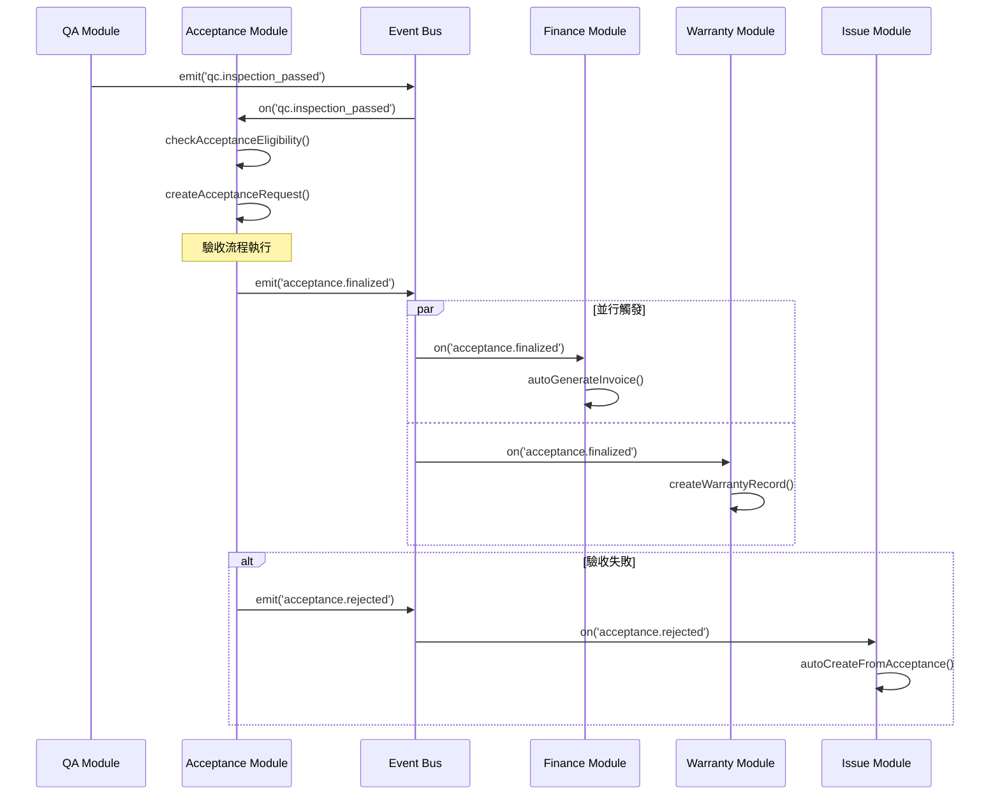

# SETC-054: Acceptance Module Enhancement Planning

> **任務編號**: SETC-054  
> **模組**: Acceptance Module (驗收模組)  
> **優先級**: P1 (Important)  
> **預估工時**: 1 天  
> **依賴**: 現有 Acceptance Module 基礎實作  
> **狀態**: 📋 待開始

---

## 📋 任務概述

### 目標
規劃 Acceptance Module 的擴展架構，完善現有基礎實作，建立完整的驗收管理系統，與 SETC 工作流程完全整合。

### 範圍
- 分析現有 Acceptance Module 實作狀態
- 識別待實作的功能模塊
- 設計擴展架構與資料模型
- 定義與其他模組的事件整合方案
- 制定實作計畫與驗收標準

---

## 🔍 現有實作分析

### 已完成功能
根據 `src/app/core/blueprint/modules/implementations/acceptance/README.md`：

- ✅ 模組基礎結構 (`AcceptanceModule`, `module.metadata.ts`)
- ✅ 目錄結構規劃 (`models/`, `repositories/`, `services/`)
- ✅ 基本資料模型設計
- ✅ Blueprint Container 整合準備

### 待實作功能
- 🔴 Acceptance Request Sub-Module (驗收申請)
- 🔴 Acceptance Review Sub-Module (驗收審核)
- 🔴 Preliminary Acceptance Sub-Module (初驗)
- 🔴 Re-inspection Sub-Module (複驗)
- 🔴 Acceptance Conclusion Sub-Module (驗收結論)
- 🔴 Event Bus 完整整合

---

## 🔄 SETC 工作流程整合

### 驗收在 SETC 流程中的位置

```
階段二：品質與驗收階段
─────────────────────
QC 通過？
    ├─ 否 → 建立缺失單【自動】 → 整改【手動】 → 複驗【手動】 ↺ QC
    └─ 是
↓
驗收【手動】
↓
驗收通過？
    ├─ 否 → 建立問題單【可手動 / 可自動】⭐ → 處理【手動】 ↺ 驗收
    └─ 是
↓
驗收資料封存【自動】
↓
進入保固期【自動】
↓
[EVENT: acceptance.finalized] → 觸發請款生成、保固記錄建立
```

### 關鍵事件流程



---

## 🏗️ 架構設計

### 模組結構

```
acceptance/
├── acceptance.module.ts              # Domain 主模塊
├── module.metadata.ts                # Domain 元資料
├── acceptance.routes.ts              # Domain 路由配置
├── repositories/
│   ├── acceptance-request.repository.ts
│   ├── acceptance-review.repository.ts
│   ├── preliminary.repository.ts
│   ├── reinspection.repository.ts
│   └── conclusion.repository.ts
├── services/
│   ├── acceptance-request.service.ts    # 驗收申請
│   ├── acceptance-review.service.ts     # 驗收審核
│   ├── preliminary.service.ts           # 初驗
│   ├── reinspection.service.ts          # 複驗
│   ├── conclusion.service.ts            # 驗收結論
│   ├── acceptance-event.service.ts      # 事件整合
│   └── certificate.service.ts           # 證書生成
├── models/
│   ├── acceptance-request.model.ts
│   ├── acceptance-review.model.ts
│   ├── preliminary-acceptance.model.ts
│   ├── reinspection.model.ts
│   └── acceptance-conclusion.model.ts
├── components/
│   ├── acceptance-request-list/
│   ├── acceptance-request-form/
│   ├── acceptance-review/
│   ├── preliminary-checklist/
│   └── conclusion-report/
├── config/
│   └── acceptance.config.ts
├── exports/
│   └── acceptance-api.exports.ts
└── index.ts
```

---

## 📊 擴展任務分解

### SETC-054 ~ SETC-061 任務清單

| SETC ID | 任務名稱 | 工時 | 依賴 |
|---------|---------|------|------|
| SETC-054 | Acceptance Module Enhancement Planning | 1 天 | - |
| SETC-055 | Acceptance Repository Implementation | 2 天 | SETC-054 |
| SETC-056 | Acceptance Request Service | 2 天 | SETC-055 |
| SETC-057 | Preliminary Acceptance Service | 2 天 | SETC-056 |
| SETC-058 | Reinspection Service | 2 天 | SETC-057 |
| SETC-059 | Acceptance Conclusion Service | 2 天 | SETC-058 |
| SETC-060 | Acceptance Event Integration | 2 天 | SETC-059 |
| SETC-061 | Acceptance UI Components & Testing | 3 天 | SETC-060 |

**總計**: 8 個任務，16 天

---

## ✅ 交付物

### 文件交付
- [ ] Acceptance Module 擴展架構設計文檔
- [ ] 資料模型定義文檔
- [ ] API 契約定義
- [ ] 事件整合規格書
- [ ] 實作計畫與時程表

### 技術交付
- [ ] 更新 `acceptance/README.md`
- [ ] 更新模組元資料
- [ ] Firestore Collection 設計
- [ ] Security Rules 草案

---

## 🎯 驗收標準

1. ✅ 完成現有實作狀態分析報告
2. ✅ 制定完整的擴展架構設計
3. ✅ 定義所有資料模型與介面
4. ✅ 規劃事件整合方案
5. ✅ 建立 SETC-055 ~ SETC-061 任務文檔
6. ✅ 更新 SETC 主索引與追蹤文件

---

**文件版本**: 1.0.0  
**建立日期**: 2025-12-15  
**最後更新**: 2025-12-15
