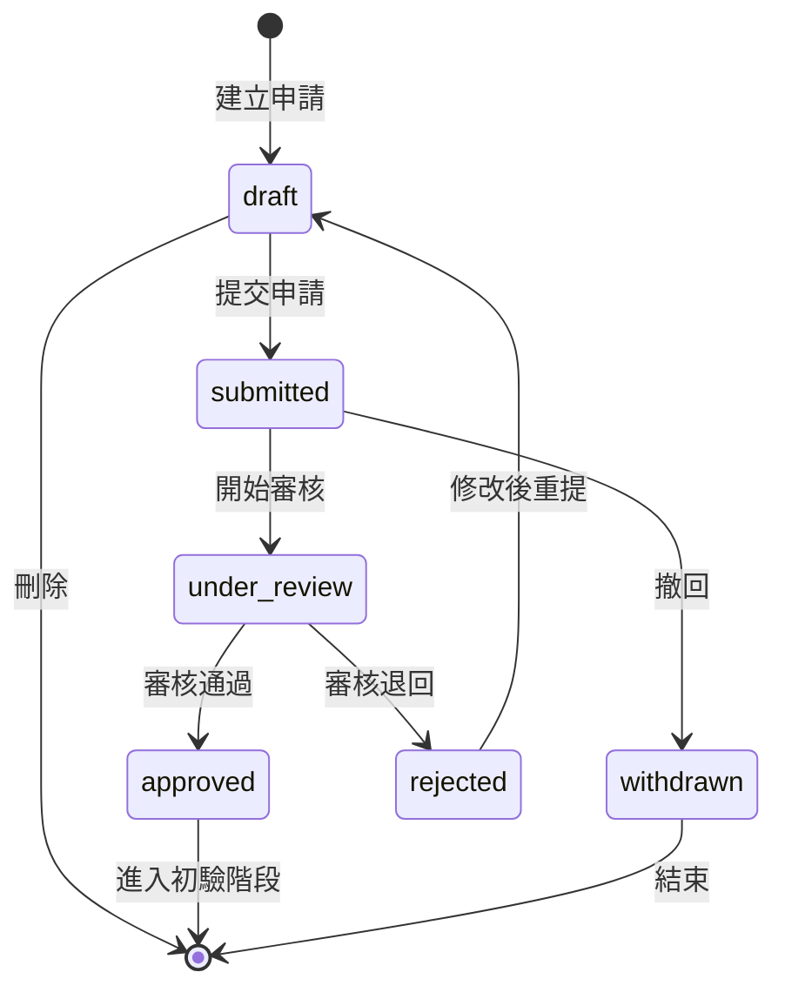

# SETC-056: Acceptance Request Service

> **任務編號**: SETC-056  
> **模組**: Acceptance Module (驗收模組)  
> **優先級**: P1 (Important)  
> **預估工時**: 2 天  
> **依賴**: SETC-055  
> **狀態**: 📋 待開始

---

## 📋 任務概述

### 目標
實作驗收申請服務，管理驗收申請的建立、提交、審核和狀態流轉。

### 範圍
- 驗收申請建立與編輯
- 申請狀態管理
- 文件上傳與驗證
- 申請審核流程
- 自動建立觸發（從 QC 通過）

---

## 🏗️ 技術實作

### 服務介面

```typescript
import { Observable } from 'rxjs';

export interface IAcceptanceRequestService {
  // CRUD
  createRequest(data: CreateAcceptanceRequestInput): Promise<AcceptanceRequest>;
  updateRequest(id: string, data: UpdateAcceptanceRequestInput): Promise<AcceptanceRequest>;
  deleteRequest(id: string): Promise<void>;
  
  // 狀態操作
  submitRequest(id: string): Promise<AcceptanceRequest>;
  withdrawRequest(id: string, reason: string): Promise<AcceptanceRequest>;
  approveRequest(id: string, reviewNotes?: string): Promise<AcceptanceRequest>;
  rejectRequest(id: string, reason: string): Promise<AcceptanceRequest>;
  
  // 查詢
  getRequest(id: string): Promise<AcceptanceRequest | null>;
  getRequestsByBlueprint(blueprintId: string, filters?: RequestFilters): Observable<AcceptanceRequest[]>;
  getPendingRequests(blueprintId: string): Observable<AcceptanceRequest[]>;
  
  // 文件管理
  uploadDocument(requestId: string, document: DocumentUpload): Promise<SubmittedDocument>;
  verifyDocument(requestId: string, documentId: string, result: VerificationResult): Promise<void>;
  
  // 自動建立
  autoCreateFromQCPass(qcData: QCPassData): Promise<AcceptanceRequest>;
  checkEligibility(taskId: string): Promise<EligibilityResult>;
}

export interface CreateAcceptanceRequestInput {
  blueprintId: string;
  requestType: AcceptanceType;
  title: string;
  description?: string;
  scope: AcceptanceScope;
  taskIds?: string[];
  contractId?: string;
  requestedBy: string;
  proposedDate?: Date;
}

export interface EligibilityResult {
  eligible: boolean;
  reasons: string[];
  missingRequirements: string[];
  suggestedDate?: Date;
}
```

### 服務實作

```typescript
import { Injectable, inject, signal } from '@angular/core';
import { Observable } from 'rxjs';
import { AcceptanceRequestRepository } from '../repositories/acceptance-request.repository';
import { IEventBus } from '@core/blueprint/platform/event-bus';
import { 
  IAcceptanceRequestService,
  AcceptanceRequest,
  CreateAcceptanceRequestInput,
  EligibilityResult
} from './acceptance-request.interface';

@Injectable({ providedIn: 'root' })
export class AcceptanceRequestService implements IAcceptanceRequestService {
  private repository = inject(AcceptanceRequestRepository);
  private eventBus = inject(IEventBus);

  /**
   * 建立驗收申請
   */
  async createRequest(data: CreateAcceptanceRequestInput): Promise<AcceptanceRequest> {
    // 驗證必要欄位
    this.validateRequestData(data);
    
    // 檢查驗收資格
    if (data.taskIds && data.taskIds.length > 0) {
      for (const taskId of data.taskIds) {
        const eligibility = await this.checkEligibility(taskId);
        if (!eligibility.eligible) {
          throw new Error(`Task ${taskId} not eligible: ${eligibility.reasons.join(', ')}`);
        }
      }
    }
    
    const request = await this.repository.create({
      ...data,
      requestedAt: new Date()
    });
    
    // 發送事件
    this.eventBus.emit('acceptance.request_created', {
      requestId: request.id,
      blueprintId: request.blueprintId,
      requestType: request.requestType,
      createdBy: data.requestedBy,
      timestamp: new Date()
    });
    
    return request;
  }

  /**
   * 提交驗收申請
   */
  async submitRequest(id: string): Promise<AcceptanceRequest> {
    const request = await this.repository.findById(id);
    if (!request) {
      throw new Error(`Request ${id} not found`);
    }
    
    if (request.status !== 'draft') {
      throw new Error(`Cannot submit request in status: ${request.status}`);
    }
    
    // 驗證必要文件
    const missingDocs = this.checkRequiredDocuments(request);
    if (missingDocs.length > 0) {
      throw new Error(`Missing required documents: ${missingDocs.join(', ')}`);
    }
    
    const updated = await this.repository.update(id, {
      status: 'submitted',
      submittedAt: new Date()
    });
    
    // 發送事件
    this.eventBus.emit('acceptance.request_submitted', {
      requestId: updated.id,
      blueprintId: updated.blueprintId,
      requestedBy: updated.requestedBy,
      timestamp: new Date()
    });
    
    return updated;
  }

  /**
   * 審核通過
   */
  async approveRequest(id: string, reviewNotes?: string): Promise<AcceptanceRequest> {
    const request = await this.repository.findById(id);
    if (!request) {
      throw new Error(`Request ${id} not found`);
    }
    
    if (request.status !== 'submitted' && request.status !== 'under_review') {
      throw new Error(`Cannot approve request in status: ${request.status}`);
    }
    
    const updated = await this.repository.update(id, {
      status: 'approved',
      reviewNotes,
      reviewedAt: new Date()
    });
    
    // 發送事件 - 觸發初驗排程
    this.eventBus.emit('acceptance.request_approved', {
      requestId: updated.id,
      blueprintId: updated.blueprintId,
      timestamp: new Date()
    });
    
    return updated;
  }

  /**
   * 審核退回
   */
  async rejectRequest(id: string, reason: string): Promise<AcceptanceRequest> {
    const request = await this.repository.findById(id);
    if (!request) {
      throw new Error(`Request ${id} not found`);
    }
    
    const updated = await this.repository.update(id, {
      status: 'rejected',
      reviewNotes: reason,
      reviewedAt: new Date()
    });
    
    this.eventBus.emit('acceptance.request_rejected', {
      requestId: updated.id,
      blueprintId: updated.blueprintId,
      reason,
      timestamp: new Date()
    });
    
    return updated;
  }

  /**
   * 從 QC 通過自動建立驗收申請
   */
  async autoCreateFromQCPass(qcData: QCPassData): Promise<AcceptanceRequest> {
    // 檢查是否已有待處理的驗收申請
    const existingRequests = await this.repository.findByBlueprint(qcData.blueprintId, {
      status: ['draft', 'submitted', 'under_review', 'approved']
    });
    
    const hasExisting = existingRequests.some(r => 
      r.taskIds?.includes(qcData.taskId)
    );
    
    if (hasExisting) {
      throw new Error('Acceptance request already exists for this task');
    }
    
    // 自動建立
    const request = await this.createRequest({
      blueprintId: qcData.blueprintId,
      requestType: 'preliminary',
      title: `QC 通過自動建立 - ${qcData.taskTitle}`,
      description: `來源: QC 檢驗 ${qcData.inspectionId}`,
      scope: {
        areaDescription: qcData.inspectionArea
      },
      taskIds: [qcData.taskId],
      requestedBy: 'system',
      proposedDate: this.calculateProposedDate()
    });
    
    console.log('[AcceptanceRequestService] Auto-created from QC pass:', request.id);
    
    return request;
  }

  /**
   * 檢查任務的驗收資格
   */
  async checkEligibility(taskId: string): Promise<EligibilityResult> {
    const reasons: string[] = [];
    const missingRequirements: string[] = [];
    
    // TODO: 從 TaskService 取得任務資訊
    // 檢查任務狀態是否為 confirmed
    // 檢查是否有 QC 通過記錄
    // 檢查是否有未解決的缺失
    
    // 模擬檢查結果
    const eligible = true;
    
    return {
      eligible,
      reasons,
      missingRequirements,
      suggestedDate: this.calculateProposedDate()
    };
  }

  // ============ Private Methods ============

  private validateRequestData(data: CreateAcceptanceRequestInput): void {
    if (!data.blueprintId) {
      throw new Error('Blueprint ID is required');
    }
    if (!data.title) {
      throw new Error('Title is required');
    }
    if (!data.requestType) {
      throw new Error('Request type is required');
    }
  }

  private checkRequiredDocuments(request: AcceptanceRequest): string[] {
    const missing: string[] = [];
    
    for (const requirement of request.requiredDocuments || []) {
      if (requirement.isRequired) {
        const submitted = request.submittedDocuments?.find(
          d => d.requirementId === requirement.id
        );
        if (!submitted) {
          missing.push(requirement.name);
        }
      }
    }
    
    return missing;
  }

  private calculateProposedDate(): Date {
    const date = new Date();
    date.setDate(date.getDate() + 7); // 預設 7 天後
    return date;
  }
}
```

---

## 🔄 狀態流轉圖



---

## ✅ 交付物

- [ ] `acceptance-request.service.ts`
- [ ] `acceptance-request.interface.ts`
- [ ] `acceptance-request.service.spec.ts`
- [ ] 更新 `index.ts` 匯出

---

## 🎯 驗收標準

1. ✅ 驗收申請 CRUD 功能完整
2. ✅ 狀態流轉正確
3. ✅ 文件驗證機制運作
4. ✅ 自動建立功能正確
5. ✅ 事件正確發送
6. ✅ 單元測試覆蓋率 >80%

---

**文件版本**: 1.0.0  
**建立日期**: 2025-12-15  
**最後更新**: 2025-12-15
