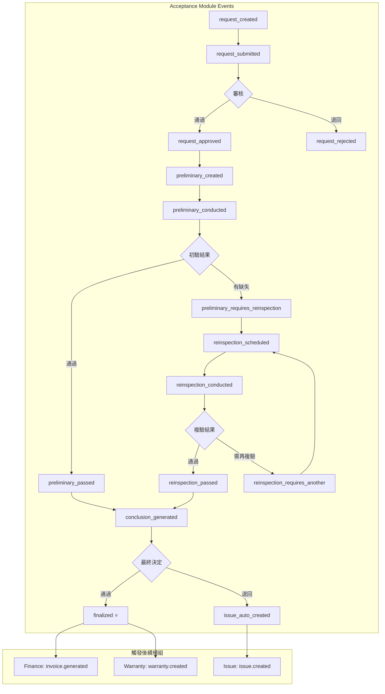

# SETC-060: Acceptance Event Integration

> **任務編號**: SETC-060  
> **模組**: Acceptance Module (驗收模組)  
> **優先級**: P1 (Important)  
> **預估工時**: 2 天  
> **依賴**: SETC-059  
> **狀態**: 📋 待開始

---

## 📋 任務概述

### 目標
實作驗收模組的事件整合服務，與 SETC 工作流程中的 QA、Finance、Warranty、Issue 等模組透過 Event Bus 進行通訊。

### 範圍
- 定義驗收模組所有事件類型
- 設定與其他模組的事件訂閱
- 實作 SETC 自動化工作流程
- 處理驗收失敗的問題單建立

---

## 🔄 事件定義

### 驗收模組事件類型

```typescript
export const ACCEPTANCE_EVENT_TYPES = {
  // 申請事件
  REQUEST_CREATED: 'acceptance.request_created',
  REQUEST_SUBMITTED: 'acceptance.request_submitted',
  REQUEST_APPROVED: 'acceptance.request_approved',
  REQUEST_REJECTED: 'acceptance.request_rejected',
  
  // 初驗事件
  PRELIMINARY_CREATED: 'acceptance.preliminary_created',
  PRELIMINARY_CONDUCTED: 'acceptance.preliminary_conducted',
  PRELIMINARY_PASSED: 'acceptance.preliminary_passed',
  PRELIMINARY_REQUIRES_REINSPECTION: 'acceptance.preliminary_requires_reinspection',
  DEFECT_FOUND: 'acceptance.defect_found',
  
  // 複驗事件
  REINSPECTION_SCHEDULED: 'acceptance.reinspection_scheduled',
  REINSPECTION_CONDUCTED: 'acceptance.reinspection_conducted',
  REINSPECTION_PASSED: 'acceptance.reinspection_passed',
  REINSPECTION_REQUIRES_ANOTHER: 'acceptance.reinspection_requires_another',
  
  // 結論事件
  CONCLUSION_GENERATED: 'acceptance.conclusion_generated',
  FINALIZED: 'acceptance.finalized',           // ⭐ SETC 關鍵事件
  CERTIFICATE_ISSUED: 'acceptance.certificate_issued',
  
  // 問題事件
  ISSUE_AUTO_CREATED: 'acceptance.issue_auto_created'
} as const;

// ============ 事件 Payload 定義 ============

/**
 * ⭐ SETC 關鍵事件：驗收完成
 * 觸發：請款生成、保固建立
 */
export interface AcceptanceFinalizedEvent {
  conclusionId: string;
  requestId: string;
  blueprintId: string;
  finalDecision: 'accepted' | 'conditionally_accepted' | 'rejected';
  
  // 財務資訊
  acceptedAmount: number;
  retainageAmount?: number;
  workItemsSummary: WorkItemSummary[];
  
  // 保固資訊
  warranties: WarrantyItem[];
  warrantyPeriodStart: Date;
  warrantyPeriodEnd: Date;
  
  timestamp: Date;
}

export interface AcceptanceDefectFoundEvent {
  preliminaryId: string;
  defectId: string;
  defectNumber: string;
  severity: 'critical' | 'major' | 'minor';
  description: string;
  timestamp: Date;
}

export interface AcceptanceRejectedEvent {
  conclusionId: string;
  requestId: string;
  blueprintId: string;
  reason: string;
  defectsSummary: DefectSummary[];
  timestamp: Date;
}
```

---

## 🏗️ 事件服務實作

```typescript
import { Injectable, inject, OnDestroy } from '@angular/core';
import { Subject, takeUntil } from 'rxjs';
import { IEventBus } from '@core/blueprint/platform/event-bus';
import { AcceptanceRequestService } from './acceptance-request.service';
import { ACCEPTANCE_EVENT_TYPES, AcceptanceFinalizedEvent } from './acceptance-events.types';

@Injectable({ providedIn: 'root' })
export class AcceptanceEventService implements OnDestroy {
  private eventBus = inject(IEventBus);
  private requestService = inject(AcceptanceRequestService);
  
  private destroy$ = new Subject<void>();

  constructor() {
    this.setupEventListeners();
  }

  ngOnDestroy(): void {
    this.destroy$.next();
    this.destroy$.complete();
  }

  // ============ 事件監聽設定 ============

  private setupEventListeners(): void {
    // 監聽 QC 通過事件 - 自動建立驗收申請
    this.eventBus.on('qc.inspection_passed')
      .pipe(takeUntil(this.destroy$))
      .subscribe(async (data: any) => {
        console.log('[AcceptanceEventService] QC passed:', data.inspectionId);
        
        try {
          // 檢查是否符合驗收條件
          const eligible = await this.requestService.checkEligibility(data.taskId);
          
          if (eligible.eligible) {
            await this.requestService.autoCreateFromQCPass({
              blueprintId: data.blueprintId,
              taskId: data.taskId,
              taskTitle: data.taskTitle,
              inspectionId: data.inspectionId,
              inspectionArea: data.inspectionArea
            });
          }
        } catch (error) {
          console.error('[AcceptanceEventService] Failed to auto-create request:', error);
        }
      });

    // 監聽驗收失敗 - 自動建立問題單
    this.eventBus.on('acceptance.finalized')
      .pipe(takeUntil(this.destroy$))
      .subscribe(async (data: AcceptanceFinalizedEvent) => {
        if (data.finalDecision === 'rejected') {
          console.log('[AcceptanceEventService] Acceptance rejected, creating issue');
          await this.createIssueFromRejection(data);
        }
      });
  }

  // ============ 事件發送方法 ============

  /**
   * 發送驗收完成事件 ⭐ SETC 關鍵
   */
  emitAcceptanceFinalized(data: AcceptanceFinalizedEvent): void {
    this.eventBus.emit(ACCEPTANCE_EVENT_TYPES.FINALIZED, data);
    console.log('[AcceptanceEventService] Acceptance finalized (SETC key point):', data.conclusionId);
    
    // 記錄控制點
    this.recordControlPoint({
      type: 'acceptance.finalized',
      conclusionId: data.conclusionId,
      decision: data.finalDecision,
      timestamp: data.timestamp
    });
  }

  /**
   * 發送初驗缺失發現事件
   */
  emitDefectFound(data: AcceptanceDefectFoundEvent): void {
    this.eventBus.emit(ACCEPTANCE_EVENT_TYPES.DEFECT_FOUND, data);
    
    // 如果是嚴重缺失，可能需要建立問題單
    if (data.severity === 'critical') {
      this.createIssueFromCriticalDefect(data);
    }
  }

  // ============ 自動化處理 ============

  /**
   * 從驗收失敗建立問題單
   */
  private async createIssueFromRejection(data: AcceptanceFinalizedEvent): Promise<void> {
    this.eventBus.emit('issue.auto_create_request', {
      source: 'acceptance',
      sourceId: data.conclusionId,
      blueprintId: data.blueprintId,
      title: `驗收未通過 - ${data.conclusionId}`,
      description: `驗收結論：${data.finalDecision}`,
      severity: 'major',
      timestamp: new Date()
    });
    
    this.eventBus.emit(ACCEPTANCE_EVENT_TYPES.ISSUE_AUTO_CREATED, {
      conclusionId: data.conclusionId,
      timestamp: new Date()
    });
  }

  /**
   * 從嚴重缺失建立問題單
   */
  private async createIssueFromCriticalDefect(data: AcceptanceDefectFoundEvent): Promise<void> {
    this.eventBus.emit('issue.auto_create_request', {
      source: 'acceptance_defect',
      sourceId: data.defectId,
      blueprintId: '', // TODO: 從 preliminary 取得
      title: `嚴重缺失 - ${data.defectNumber}`,
      description: data.description,
      severity: 'critical',
      timestamp: new Date()
    });
  }

  /**
   * 記錄控制點
   */
  private async recordControlPoint(data: any): Promise<void> {
    // TODO: 儲存到 Firestore 的 control_points collection
    console.log('[AcceptanceEventService] Control point recorded:', data);
  }
}
```

---

## 📊 事件流程圖



---

## 🔗 與其他模組的事件整合

### 接收的事件

| 來源模組 | 事件 | 處理動作 |
|----------|------|----------|
| QA Module | `qc.inspection_passed` | 檢查是否建立驗收申請 |
| Task Module | `task.confirmed` | 可能觸發驗收資格檢查 |

### 發送的事件

| 事件 | 目標模組 | 觸發動作 |
|------|----------|----------|
| `acceptance.finalized` | Finance, Warranty | 生成請款、建立保固 |
| `acceptance.issue_auto_created` | Issue | 建立問題單 |
| `acceptance.defect_found` | Defect | 記錄缺失 |

---

## ✅ 交付物

- [ ] `acceptance-events.types.ts`
- [ ] `acceptance-event.service.ts`
- [ ] `acceptance-event.service.spec.ts`
- [ ] 更新 `index.ts` 匯出

---

## 🎯 驗收標準

1. ✅ 所有事件類型正確定義
2. ✅ QC 通過自動觸發正確
3. ✅ SETC 關鍵事件正確發送
4. ✅ 問題單自動建立正確
5. ✅ 與其他模組整合正常
6. ✅ 單元測試覆蓋率 >80%

---

**文件版本**: 1.0.0  
**建立日期**: 2025-12-15  
**最後更新**: 2025-12-15
