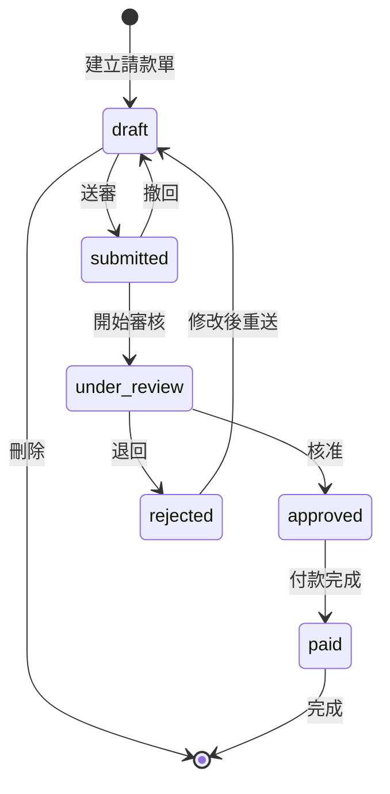

# SETC-064: Invoice Service

> **任務編號**: SETC-064  
> **模組**: Finance Module (財務模組)  
> **優先級**: P1 (Important)  
> **預估工時**: 2 天  
> **依賴**: SETC-063  
> **狀態**: 📋 待開始

---

## 📋 任務概述

### 目標
實作請款服務，管理請款單的建立、審核、核准流程，支援從驗收自動生成請款。

### 範圍
- 請款單建立與編輯
- 請款狀態管理
- 請款審核流程
- 自動從驗收生成請款
- 扣款項目管理

---

## 🔄 SETC 關鍵控制點

```
驗收完成 (acceptance.finalized)
    ↓
生成可請款項目 / 請款金額 / 扣款資訊【自動】
    ↓
（可選）請款單調整【手動】
    ↓
請款送審【手動】
    ↓
請款審核【手動】
    ↓
請款通過？
    ├─ 否 → 退回調整【手動】
    └─ 是 → 進入付款流程
```

---

## 🏗️ 技術實作

### 服務介面

```typescript
import { Observable } from 'rxjs';

export interface IInvoiceService {
  // CRUD
  createInvoice(data: CreateInvoiceInput): Promise<Invoice>;
  updateInvoice(id: string, data: UpdateInvoiceInput): Promise<Invoice>;
  deleteInvoice(id: string): Promise<void>;
  
  // 明細管理
  addLineItem(invoiceId: string, item: InvoiceLineItem): Promise<Invoice>;
  removeLineItem(invoiceId: string, itemId: string): Promise<Invoice>;
  updateLineItem(invoiceId: string, itemId: string, item: Partial<InvoiceLineItem>): Promise<Invoice>;
  
  // 扣款管理
  addDeduction(invoiceId: string, deduction: InvoiceDeduction): Promise<Invoice>;
  removeDeduction(invoiceId: string, deductionId: string): Promise<Invoice>;
  
  // 狀態操作
  submitForApproval(id: string): Promise<Invoice>;
  approveInvoice(id: string, notes?: string): Promise<Invoice>;
  rejectInvoice(id: string, reason: string): Promise<Invoice>;
  
  // 自動生成 ⭐ SETC 關鍵
  autoGenerateFromAcceptance(acceptanceData: AcceptanceFinalizedData): Promise<Invoice>;
  
  // 查詢
  getInvoice(id: string): Promise<Invoice | null>;
  getInvoicesByBlueprint(blueprintId: string, filters?: InvoiceFilters): Observable<Invoice[]>;
  getPendingApproval(blueprintId: string): Observable<Invoice[]>;
  
  // 計算
  recalculateTotals(invoiceId: string): Promise<Invoice>;
  calculateRetention(invoiceId: string, rate: number): Promise<number>;
}

export interface CreateInvoiceInput {
  blueprintId: string;
  acceptanceId?: string;
  contractId?: string;
  title: string;
  description?: string;
  invoiceDate: Date;
  dueDate?: Date;
  lineItems: InvoiceLineItem[];
  taxRate?: number;
  createdBy: string;
}

export interface AcceptanceFinalizedData {
  conclusionId: string;
  requestId: string;
  blueprintId: string;
  acceptedAmount: number;
  retainageAmount?: number;
  workItemsSummary: WorkItemSummary[];
}
```

### 服務實作

```typescript
import { Injectable, inject } from '@angular/core';
import { Observable } from 'rxjs';
import { InvoiceRepository } from '../repositories/invoice.repository';
import { IEventBus } from '@core/blueprint/platform/event-bus';
import { 
  IInvoiceService,
  Invoice,
  CreateInvoiceInput,
  AcceptanceFinalizedData
} from './invoice.interface';

@Injectable({ providedIn: 'root' })
export class InvoiceService implements IInvoiceService {
  private repository = inject(InvoiceRepository);
  private eventBus = inject(IEventBus);

  // 預設稅率
  private readonly DEFAULT_TAX_RATE = 0.05; // 5%

  /**
   * 建立請款單
   */
  async createInvoice(data: CreateInvoiceInput): Promise<Invoice> {
    const taxRate = data.taxRate ?? this.DEFAULT_TAX_RATE;
    
    // 計算金額
    const subtotal = data.lineItems.reduce((sum, item) => sum + item.amount, 0);
    const taxAmount = Math.round(subtotal * taxRate);
    const totalAmount = subtotal + taxAmount;
    
    const invoice = await this.repository.create({
      ...data,
      subtotal,
      taxRate,
      taxAmount,
      deductions: [],
      totalDeductions: 0,
      totalAmount,
      paidAmount: 0,
      unpaidAmount: totalAmount,
      paymentStatus: 'unpaid'
    });
    
    this.eventBus.emit('invoice.created', {
      invoiceId: invoice.id,
      blueprintId: invoice.blueprintId,
      amount: invoice.totalAmount,
      timestamp: new Date()
    });
    
    return invoice;
  }

  /**
   * 從驗收自動生成請款單 ⭐ SETC 關鍵功能
   */
  async autoGenerateFromAcceptance(
    acceptanceData: AcceptanceFinalizedData
  ): Promise<Invoice> {
    console.log('[InvoiceService] Auto-generating from acceptance:', acceptanceData.conclusionId);
    
    // 從驗收資料建立請款明細
    const lineItems: InvoiceLineItem[] = acceptanceData.workItemsSummary.map((item, index) => ({
      id: `line-${index + 1}`,
      workItemId: item.workItemId,
      description: item.workItemName,
      unit: 'lot',
      quantity: 1,
      unitPrice: item.acceptedQuantity * (item.unitPrice || 0),
      amount: item.acceptedQuantity * (item.unitPrice || 0)
    }));
    
    // 計算金額
    const subtotal = acceptanceData.acceptedAmount;
    const taxRate = this.DEFAULT_TAX_RATE;
    const taxAmount = Math.round(subtotal * taxRate);
    
    // 建立扣款項目（保留款）
    const deductions: InvoiceDeduction[] = [];
    if (acceptanceData.retainageAmount && acceptanceData.retainageAmount > 0) {
      deductions.push({
        id: 'retention-1',
        type: 'retention',
        description: '保留款',
        amount: acceptanceData.retainageAmount,
        percentage: (acceptanceData.retainageAmount / subtotal) * 100
      });
    }
    
    const totalDeductions = deductions.reduce((sum, d) => sum + d.amount, 0);
    const totalAmount = subtotal + taxAmount - totalDeductions;
    
    const invoice = await this.repository.create({
      blueprintId: acceptanceData.blueprintId,
      acceptanceId: acceptanceData.conclusionId,
      title: `驗收請款 - ${acceptanceData.conclusionId}`,
      description: `來源: 驗收結論 ${acceptanceData.conclusionId}`,
      invoiceDate: new Date(),
      dueDate: this.calculateDueDate(30), // 30 天內付款
      lineItems,
      subtotal,
      taxRate,
      taxAmount,
      deductions,
      totalDeductions,
      totalAmount,
      paidAmount: 0,
      unpaidAmount: totalAmount,
      paymentStatus: 'unpaid',
      createdBy: 'system'
    });
    
    this.eventBus.emit('invoice.auto_generated', {
      invoiceId: invoice.id,
      acceptanceId: acceptanceData.conclusionId,
      blueprintId: invoice.blueprintId,
      amount: invoice.totalAmount,
      timestamp: new Date()
    });
    
    console.log('[InvoiceService] Invoice auto-generated:', invoice.id);
    
    return invoice;
  }

  /**
   * 送審
   */
  async submitForApproval(id: string): Promise<Invoice> {
    const invoice = await this.repository.findById(id);
    if (!invoice) {
      throw new Error(`Invoice ${id} not found`);
    }
    
    if (invoice.status !== 'draft') {
      throw new Error(`Cannot submit invoice in status: ${invoice.status}`);
    }
    
    // 驗證必要資料
    if (invoice.lineItems.length === 0) {
      throw new Error('Invoice must have at least one line item');
    }
    
    const updated = await this.repository.update(id, {
      status: 'submitted',
      submittedAt: new Date()
    });
    
    this.eventBus.emit('invoice.submitted', {
      invoiceId: id,
      blueprintId: invoice.blueprintId,
      amount: invoice.totalAmount,
      timestamp: new Date()
    });
    
    return updated;
  }

  /**
   * 核准
   */
  async approveInvoice(id: string, notes?: string): Promise<Invoice> {
    const invoice = await this.repository.findById(id);
    if (!invoice) {
      throw new Error(`Invoice ${id} not found`);
    }
    
    if (invoice.status !== 'submitted' && invoice.status !== 'under_review') {
      throw new Error(`Cannot approve invoice in status: ${invoice.status}`);
    }
    
    const updated = await this.repository.update(id, {
      status: 'approved',
      approvedAt: new Date(),
      approvalNotes: notes
    });
    
    // 發送核准事件 - 可觸發付款流程
    this.eventBus.emit('invoice.approved', {
      invoiceId: id,
      blueprintId: invoice.blueprintId,
      amount: invoice.totalAmount,
      timestamp: new Date()
    });
    
    return updated;
  }

  /**
   * 退回
   */
  async rejectInvoice(id: string, reason: string): Promise<Invoice> {
    const invoice = await this.repository.findById(id);
    if (!invoice) {
      throw new Error(`Invoice ${id} not found`);
    }
    
    const updated = await this.repository.update(id, {
      status: 'rejected',
      rejectedAt: new Date(),
      rejectionReason: reason
    });
    
    this.eventBus.emit('invoice.rejected', {
      invoiceId: id,
      blueprintId: invoice.blueprintId,
      reason,
      timestamp: new Date()
    });
    
    return updated;
  }

  /**
   * 重新計算總金額
   */
  async recalculateTotals(invoiceId: string): Promise<Invoice> {
    const invoice = await this.repository.findById(invoiceId);
    if (!invoice) {
      throw new Error(`Invoice ${invoiceId} not found`);
    }
    
    const subtotal = invoice.lineItems.reduce((sum, item) => sum + item.amount, 0);
    const taxAmount = Math.round(subtotal * invoice.taxRate);
    const totalDeductions = invoice.deductions.reduce((sum, d) => sum + d.amount, 0);
    const totalAmount = subtotal + taxAmount - totalDeductions;
    const unpaidAmount = totalAmount - invoice.paidAmount;
    
    return this.repository.update(invoiceId, {
      subtotal,
      taxAmount,
      totalDeductions,
      totalAmount,
      unpaidAmount
    });
  }

  // ============ Private Methods ============

  private calculateDueDate(days: number): Date {
    const date = new Date();
    date.setDate(date.getDate() + days);
    return date;
  }
}
```

---

## 📊 狀態流轉圖



---

## ✅ 交付物

- [ ] `invoice.service.ts`
- [ ] `invoice.interface.ts`
- [ ] `invoice.service.spec.ts`
- [ ] 更新 `index.ts` 匯出

---

## 🎯 驗收標準

1. ✅ 請款單 CRUD 功能完整
2. ✅ 金額計算正確
3. ✅ 自動生成功能正確
4. ✅ 審核流程完整
5. ✅ 事件正確發送
6. ✅ 單元測試覆蓋率 >80%

---

**文件版本**: 1.0.0  
**建立日期**: 2025-12-15  
**最後更新**: 2025-12-15
