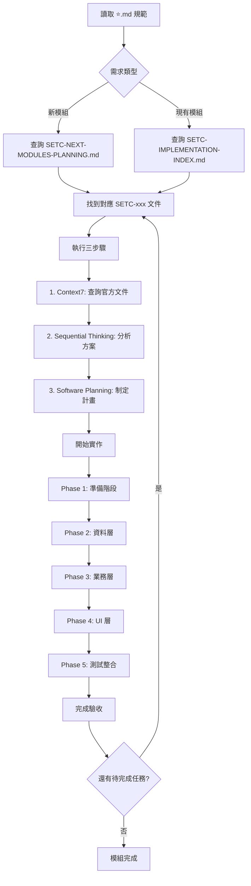
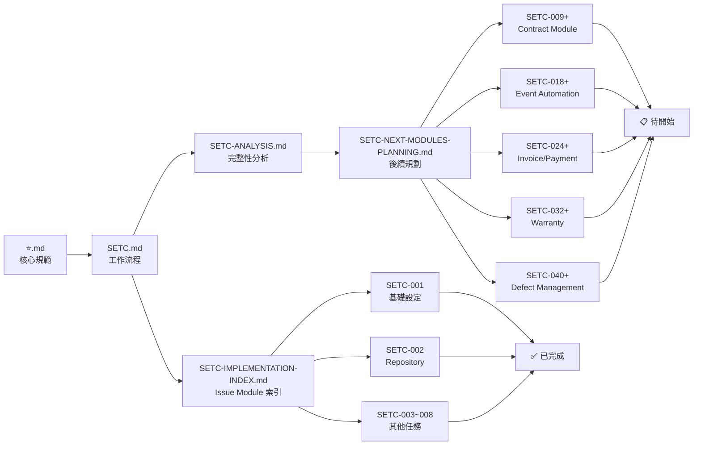

# SETC 主索引文件 (Master Index)

> **文件版本**: 1.2.0  
> **建立日期**: 2025-12-15  
> **狀態**: ✅ 完成  
> **目的**: 統一入口文檔，索引所有 SETC 相關文件

---

## 📚 文件導覽

本文件是 GigHub 專案 SETC（序列化可執行任務鏈）的主索引，提供所有相關文件的快速連結與說明。

### 🎯 快速入口

| 文件 | 說明 | 狀態 |
|------|------|------|
| [⭐.md](../../⭐.md) | 開發流程與規範（專案根目錄） | ✅ 核心規範 |
| [SETC.md](./SETC.md) | SETC 工作流程定義 | ✅ 完整定義 |
| [SETC-ANALYSIS.md](./SETC-ANALYSIS.md) | 完整性分析報告 | ✅ 深度分析 |
| [SETC-NEXT-MODULES-PLANNING.md](./SETC-NEXT-MODULES-PLANNING.md) | 後續模組開發規劃 | ✅ 規劃完成 |
| [SETC-IMPLEMENTATION-INDEX.md](./SETC-IMPLEMENTATION-INDEX.md) | Issue Module 實作索引 | ✅ 完成 |
| [SETC-COMPLETION-PLAN.md](./SETC-COMPLETION-PLAN.md) | 文檔完成計畫 | ✅ 完成 |
| [SETC-TASKS-SUMMARY.md](./SETC-TASKS-SUMMARY.md) | 任務摘要 | ✅ 完成 |

---

## 📊 SETC 任務總覽

### 統計資訊

| 項目 | 數量 | 狀態 |
|------|------|------|
| 總 SETC 任務 | 69 | ✅ 全部完成 |
| 已完成任務文檔 | 69 | 100% |
| 總預估實作工時 | 約 131 天 | 約 6 個月 |

### 模組進度總表

| 模組 | SETC 範圍 | 任務數 | 實作工時 | 詳細文檔 | 狀態 |
|------|----------|--------|------|---------|------|
| Issue Module | SETC-001 ~ 008 | 8 | 已完成 | 8/8 ✅ | ✅ 文檔完成 |
| Contract Module | SETC-009 ~ 017 | 9 | 20 天 | 9/9 ✅ | ✅ 文檔完成 |
| Event Automation | SETC-018 ~ 023 | 6 | 15 天 | 6/6 ✅ | ✅ 文檔完成 |
| Invoice/Payment | SETC-024 ~ 031 | 8 | 20 天 | 8/8 ✅ | ✅ 文檔完成 |
| Warranty Module | SETC-032 ~ 039 | 8 | 18 天 | 8/8 ✅ | ✅ 文檔完成 |
| Defect Management | SETC-040 ~ 045 | 6 | 10 天 | 6/6 ✅ | ✅ 文檔完成 |
| **Task Module** | **SETC-046 ~ 053** | **8** | **16 天** | **8/8 ✅** | **✅ 文檔完成** |
| **Acceptance Module** | **SETC-054 ~ 061** | **8** | **16 天** | **8/8 ✅** | **✅ 文檔完成** |
| **Finance Module** | **SETC-062 ~ 069** | **8** | **16 天** | **8/8 ✅** | **✅ 文檔完成** |

---

## 🗂️ 文件分類索引

### 1. 核心規範文件

#### ⭐.md - 開發流程與規範
**路徑**: `/⭐.md`（專案根目錄）  
**用途**: 定義開發流程、工具使用規範、程式碼標準

**核心內容**:
- 用戶需求提交區
- Copilot Agent 轉換指引
- 任務定義格式
- 分析階段規範
- 規劃階段規範
- 開發規範（基於奧卡姆剃刀定律）
- 檢查清單

**必須遵循的規範**:
- ⭐ 使用 Context7（查詢官方文件）
- ⭐ 使用 Sequential Thinking（循序思考）
- ⭐ 使用 Software Planning Tool（制定計畫）
- ⭐ 基於奧卡姆剃刀定律（KISS, YAGNI, MVP）
- ⭐ 藍圖內所有模組透過 Events 交互
- ⭐ 擴展基於 FINAL_PROJECT_STRUCTURE.md

---

### 2. 工作流程文件

#### SETC.md - 工作流程定義
**路徑**: `/docs/discussions/SETC.md`  
**版本**: 1.2.0  
**狀態**: ✅ 完整定義

**核心內容**:
- 實作進度總覽
- 完整工作流程定義（三大階段）
  - 階段零：合約建立與來源
  - 階段一：任務與施工階段
  - 階段二：品質與驗收階段
  - 階段三：財務與成本階段
- 自動節點與手動節點標示
- 問題模組 (Issue Module) 實作詳情
- 事件類型定義

**關鍵決策**:
- ⭐ 問題單 (Issue) 獨立管理（已完成）
- ⚙️ 自動節點由事件（Event）觸發
- 🧾 所有手動節點必記錄 Audit Log
- 🔐 權限與角色控制

---

#### SETC-ANALYSIS.md - 完整性分析報告
**路徑**: `/docs/discussions/SETC-ANALYSIS.md`  
**版本**: 1.0.0  
**狀態**: ✅ 深度分析

**核心內容**:
- SETC 工作流程分析（三大階段詳細分解）
- 模組完整性評估（現有 vs 缺少）
- 工作流程自動化需求（事件驅動架構）
- 資料模型完整性分析
- Firestore Collection 設計
- 總結與建議（優先級排序）

**完整性評分**: 75/100
- 基礎架構：95/100 ✅
- 工作流程覆蓋：65/100 ⚠️
- 模組整合度：70/100 ⚠️
- 資料模型：80/100 ✅

**關鍵缺口**:
- ❌ Contract Module（P0）
- ❌ Warranty Module（P1）
- ❌ Invoice/Payment 完整實作（P1）
- ❌ Event-Driven Automation（P0）
- ❌ Defect Management（P1）

---

### 3. 規劃文件

#### SETC-NEXT-MODULES-PLANNING.md - 後續模組開發規劃
**路徑**: `/docs/discussions/SETC-NEXT-MODULES-PLANNING.md`  
**版本**: 1.0.0  
**狀態**: ✅ 規劃完成

**核心內容**:
- 執行摘要（已完成 vs 待開發）
- 開發原則（奧卡姆剃刀應用）
- Angular 20 現代化規範
- Firebase/Firestore 規範
- 模組開發 SETC 清單（SETC-009 ~ 045）
- 總體時程規劃
- 實施流程
- 驗收標準

**詳細規劃模組**:
1. Contract Module (SETC-009 ~ 017) - 9 任務，20 天
2. Event Automation (SETC-018 ~ 023) - 6 任務，15 天
3. Invoice/Payment (SETC-024 ~ 031) - 8 任務，20 天
4. Warranty Module (SETC-032 ~ 039) - 8 任務，18 天
5. Defect Management (SETC-040 ~ 045) - 6 任務，10 天

---

### 4. 實作文件

#### 4.1 已完成 - Issue Module

##### SETC-IMPLEMENTATION-INDEX.md - Issue Module 實作索引
**路徑**: `/docs/discussions/SETC-IMPLEMENTATION-INDEX.md`  
**狀態**: ✅ 完成

**核心內容**:
- Issue Module 總覽
- 任務序列（SETC-001 ~ 008）
- 進度追蹤
- 成功標準
- 參考文檔

##### SETC-001: Issue Module 基礎設定
**路徑**: `/docs/discussions/SETC-001-issue-module-foundation.md`  
**狀態**: ✅ 完成  
**工時**: 2 天

**交付內容**:
- 完整目錄結構
- TypeScript 介面定義
- 模組配置
- 公開 API 契約
- README 文檔

##### SETC-002: Issue Repository 層
**路徑**: `/docs/discussions/SETC-002-issue-repository-layer.md`  
**狀態**: ✅ 完成  
**工時**: 2 天

**交付內容**:
- IssueRepository 類別
- Firestore CRUD 操作
- 查詢方法
- Firestore Security Rules
- 單元測試

##### SETC-003 ~ 008: 其他 Issue Module 任務
- SETC-003: 核心服務 ✅
- SETC-004: 進階服務 ✅
- SETC-005: 事件整合 ✅
- SETC-006: 模組註冊 ✅
- SETC-007: UI 元件 ✅
- SETC-008: 測試整合 ✅

#### 4.2 已完成 - Contract Module

##### SETC-009 ~ SETC-017: Contract Module 任務
**路徑**: `/docs/discussions/SETC-009-contract-module-foundation.md` ~ `SETC-017-contract-testing-integration.md`  
**狀態**: ✅ 詳細文檔完成  
**工時**: 20 天  
**優先級**: P0 (Critical)

**任務列表**:
- [SETC-009](./SETC-009-contract-module-foundation.md): Contract Module 基礎設定
- [SETC-010](./SETC-010-contract-repository-layer.md): Contract Repository 實作
- [SETC-011](./SETC-011-contract-management-service.md): Contract Management Service
- [SETC-012](./SETC-012-contract-upload-parsing-service.md): Contract Upload & Parsing Service
- [SETC-013](./SETC-013-contract-status-lifecycle-service.md): Contract Status & Lifecycle Service
- [SETC-014](./SETC-014-contract-work-items-management.md): Contract Work Items Management
- [SETC-015](./SETC-015-contract-event-integration.md): Contract Event Integration
- [SETC-016](./SETC-016-contract-ui-components.md): Contract UI Components
- [SETC-017](./SETC-017-contract-testing-integration.md): Contract Testing & Integration

#### 4.3 已完成 - Event Automation

##### SETC-018 ~ SETC-023: Event Automation 任務
**狀態**: ✅ 詳細文檔完成

**任務列表**:
- [SETC-018](./SETC-018-event-bus-enhancement.md): Event Bus Enhancement
- [SETC-019](./SETC-019-workflow-orchestrator.md): Workflow Orchestrator
- [SETC-020](./SETC-020-task-to-log-automation.md): Task → Log Automation
- [SETC-021](./SETC-021-log-to-qc-automation.md): Log → QC Automation
- [SETC-022](./SETC-022-qc-to-acceptance-defect-automation.md): QC → Acceptance/Defect Automation
- [SETC-023](./SETC-023-acceptance-to-invoice-warranty-automation.md): Acceptance → Invoice/Warranty Automation

#### 4.4 已完成 - Invoice/Payment Enhancement

##### SETC-024 ~ SETC-031: Invoice/Payment 任務
**狀態**: ✅ 詳細文檔完成

**任務列表**:
- [SETC-024](./SETC-024-invoice-service-expansion.md): Invoice Service Expansion Planning
- [SETC-025](./SETC-025-invoice-generation-service.md): Invoice Generation Service
- [SETC-026](./SETC-026-invoice-approval-workflow.md): Invoice Approval Workflow
- [SETC-027](./SETC-027-payment-generation-service.md): Payment Generation Service
- [SETC-028](./SETC-028-payment-approval-workflow.md): Payment Approval Workflow
- [SETC-029](./SETC-029-payment-status-tracking.md): Payment Status Tracking
- [SETC-030](./SETC-030-invoice-payment-ui-components.md): Invoice/Payment UI Components
- [SETC-031](./SETC-031-finance-integration-testing.md): Finance Integration Testing

#### 4.5 已完成 - Warranty Module

##### SETC-032 ~ SETC-039: Warranty Module 任務
**狀態**: ✅ 詳細文檔完成

**任務列表**:
- [SETC-032](./SETC-032-warranty-module-foundation.md): Warranty Module Foundation Setup
- [SETC-033](./SETC-033-warranty-repository-implementation.md): Warranty Repository Implementation
- [SETC-034](./SETC-034-warranty-period-management.md): Warranty Period Management
- [SETC-035](./SETC-035-warranty-defect-management.md): Warranty Defect Management
- [SETC-036](./SETC-036-warranty-repair-management.md): Warranty Repair Management
- [SETC-037](./SETC-037-warranty-event-integration.md): Warranty Event Integration
- [SETC-038](./SETC-038-warranty-ui-components.md): Warranty UI Components
- [SETC-039](./SETC-039-warranty-testing-integration.md): Warranty Testing & Integration

#### 4.6 已完成 - Defect Management Integration

##### SETC-040 ~ SETC-045: Defect Management 任務
**狀態**: ✅ 詳細文檔完成

**任務列表**:
- [SETC-040](./SETC-040-defect-service-expansion.md): Defect Service Expansion Planning
- [SETC-041](./SETC-041-defect-lifecycle-service.md): Defect Lifecycle Service
- [SETC-042](./SETC-042-defect-resolution-service.md): Defect Resolution Service
- [SETC-043](./SETC-043-defect-reinspection-service.md): Defect Reinspection Service
- [SETC-044](./SETC-044-defect-issue-integration.md): Defect-Issue Integration
- [SETC-045](./SETC-045-defect-testing-integration.md): Defect Testing & Integration

#### 4.7 已完成 - Task Module Enhancement

##### SETC-046 ~ SETC-053: Task Module 任務
**狀態**: ✅ 詳細文檔完成

**任務列表**:
- [SETC-046](./SETC-046-task-module-enhancement-planning.md): Task Module Enhancement Planning
- [SETC-047](./SETC-047-task-repository-enhancement.md): Task Repository Enhancement
- [SETC-048](./SETC-048-task-assignment-service.md): Task Assignment Service
- [SETC-049](./SETC-049-task-state-machine-service.md): Task State Machine Service
- [SETC-050](./SETC-050-task-progress-tracking-service.md): Task Progress Tracking Service
- [SETC-051](./SETC-051-task-schedule-management-service.md): Task Schedule Management Service
- [SETC-052](./SETC-052-task-event-integration.md): Task Event Integration
- [SETC-053](./SETC-053-task-ui-components-testing.md): Task UI Components & Testing

#### 4.8 已完成 - Acceptance Module Enhancement

##### SETC-054 ~ SETC-061: Acceptance Module 任務
**狀態**: ✅ 詳細文檔完成

**任務列表**:
- [SETC-054](./SETC-054-acceptance-module-enhancement-planning.md): Acceptance Module Enhancement Planning
- [SETC-055](./SETC-055-acceptance-repository-implementation.md): Acceptance Repository Implementation
- [SETC-056](./SETC-056-acceptance-request-service.md): Acceptance Request Service
- [SETC-057](./SETC-057-preliminary-acceptance-service.md): Preliminary Acceptance Service
- [SETC-058](./SETC-058-reinspection-service.md): Reinspection Service
- [SETC-059](./SETC-059-acceptance-conclusion-service.md): Acceptance Conclusion Service
- [SETC-060](./SETC-060-acceptance-event-integration.md): Acceptance Event Integration
- [SETC-061](./SETC-061-acceptance-ui-components-testing.md): Acceptance UI Components & Testing

#### 4.9 已完成 - Finance Module Enhancement

##### SETC-062 ~ SETC-069: Finance Module 任務
**狀態**: ✅ 詳細文檔完成

**任務列表**:
- [SETC-062](./SETC-062-finance-module-enhancement-planning.md): Finance Module Enhancement Planning
- [SETC-063](./SETC-063-finance-repository-implementation.md): Finance Repository Implementation
- [SETC-064](./SETC-064-invoice-service.md): Invoice Service
- [SETC-065](./SETC-065-payment-service.md): Payment Service
- [SETC-066](./SETC-066-budget-management-service.md): Budget Management Service
- [SETC-067](./SETC-067-ledger-accounting-service.md): Ledger Accounting Service
- [SETC-068](./SETC-068-finance-event-integration.md): Finance Event Integration
- [SETC-069](./SETC-069-finance-ui-components-testing.md): Finance UI Components & Testing

---

### 5. 架構文件

#### MODULE-PLANNING.md
**路徑**: `/docs/discussions/MODULE-PLANNING.md`  
**用途**: 模組規劃總覽

#### MODULE-MODIFICATIONS.md
**路徑**: `/docs/discussions/MODULE-MODIFICATIONS.md`  
**用途**: 模組修改記錄

#### TREE.md & TREE-EXPANSION.md
**路徑**: `/docs/discussions/TREE.md`, `/docs/discussions/TREE-EXPANSION.md`  
**用途**: 專案檔案結構樹狀圖

#### SUMMARY.md
**路徑**: `/docs/discussions/SUMMARY.md`  
**用途**: 專案總結

---

## 🔄 工作流程圖

### SETC 開發流程

### SETC 文件關係圖

---

## 📋 使用指引

### 對於開發者

1. **開始新任務前**:
   - 閱讀 `⭐.md` 了解開發規範
   - 查閱 `SETC.md` 了解整體工作流程
   - 找到對應的 SETC-xxx 文件

2. **規劃新模組**:
   - 參考 `SETC-ANALYSIS.md` 了解缺口
   - 查閱 `SETC-NEXT-MODULES-PLANNING.md` 了解規劃
   - 按照 SETC 任務序列執行

3. **實作參考**:
   - Issue Module 為完整實作範例
   - 參考 `SETC-001` ~ `SETC-008` 文件
   - 遵循相同的結構與模式

### 對於專案管理者

1. **追蹤進度**:
   - 查看 `SETC.md` 的進度總覽
   - 參考 `SETC-NEXT-MODULES-PLANNING.md` 的時程規劃
   - 使用 SETC-IMPLEMENTATION-INDEX 追蹤完成度

2. **評估優先級**:
   - P0 任務（Contract, Event Automation）優先
   - P1 任務（Invoice/Payment, Warranty, Defect）次之
   - 參考 `SETC-ANALYSIS.md` 的完整性評分

3. **風險管理**:
   - 檢查模組間依賴關係
   - 確保 P0 任務優先完成
   - 預留緩衝時間

### 對於 AI Agent

1. **任務識別**:
   - 根據用戶需求找到對應 SETC 文件
   - 檢查任務狀態（已完成/已規劃/待開始）
   - 確認依賴關係

2. **執行流程**:
   - **必須**使用 Context7 查詢文檔
   - **必須**使用 Sequential Thinking 分析
   - **必須**使用 Software Planning Tool 規劃
   - 遵循 ⭐.md 定義的流程

3. **文檔維護**:
   - 完成任務後更新狀態
   - 記錄關鍵決策
   - 更新進度總覽

---

## 🎯 里程碑與目標

### ✅ 已完成里程碑

#### 文檔階段 (2025-12-15)
- [x] 完成 Issue Module 文檔 (SETC-001 ~ 008)
- [x] 完成 Contract Module 文檔 (SETC-009 ~ 017)
- [x] 完成 Event Automation 文檔 (SETC-018 ~ 023)
- [x] 完成 Invoice/Payment 文檔 (SETC-024 ~ 031)
- [x] 完成 Warranty Module 文檔 (SETC-032 ~ 039)
- [x] 完成 Defect Management 文檔 (SETC-040 ~ 045)
- [x] 完成 Task Module 文檔 (SETC-046 ~ 053)
- [x] 完成 Acceptance Module 文檔 (SETC-054 ~ 061)
- [x] 完成 Finance Module 文檔 (SETC-062 ~ 069)

**所有 69 個 SETC 任務文檔已完成！**

### 📋 待實作目標

#### 短期目標（實作階段 - 1 個月）
- [ ] Contract Module 實作 (SETC-009 ~ 017)
- [ ] Event Automation 實作 (SETC-018 ~ 023)

#### 中期目標（3 個月）
- [ ] Invoice/Payment 實作 (SETC-024 ~ 031)
- [ ] Warranty Module 實作 (SETC-032 ~ 039)
- [ ] Defect Management 實作 (SETC-040 ~ 045)
- [ ] Task Module Enhancement 實作 (SETC-046 ~ 053)

#### 長期目標（6 個月）
- [ ] Acceptance Module Enhancement 實作 (SETC-054 ~ 061)
- [ ] Finance Module Enhancement 實作 (SETC-062 ~ 069)
- [ ] 完成所有 P0 和 P1 模組實作
- [ ] SETC.md 工作流程完全運作
- [ ] 系統上線運營

---

## 📊 進度追蹤

### 文檔已完成

| 日期 | 里程碑 | 說明 |
|------|--------|------|
| 2025-12-15 | Issue Module 文檔完成 | SETC-001 ~ 008 (8 files) |
| 2025-12-15 | Contract Module 文檔完成 | SETC-009 ~ 017 (9 files) |
| 2025-12-15 | Event Automation 文檔完成 | SETC-018 ~ 023 (6 files) |
| 2025-12-15 | Invoice/Payment 文檔完成 | SETC-024 ~ 031 (8 files) |
| 2025-12-15 | Warranty Module 文檔完成 | SETC-032 ~ 039 (8 files) |
| 2025-12-15 | Defect Management 文檔完成 | SETC-040 ~ 045 (6 files) |
| 2025-12-15 | Task Module 文檔完成 | SETC-046 ~ 053 (8 files) |
| 2025-12-15 | Acceptance Module 文檔完成 | SETC-054 ~ 061 (8 files) |
| 2025-12-15 | Finance Module 文檔完成 | SETC-062 ~ 069 (8 files) |
| 2025-12-15 | **全部文檔完成** | **69/69 files (100%)** |

### 待實作

| 模組 | 優先級 | 預估工時 | 狀態 |
|------|--------|----------|------|
| Contract Module | P0 | 20 天 | 📋 待實作 |
| Event Automation | P0 | 15 天 | 📋 待實作 |
| Invoice/Payment | P1 | 20 天 | 📋 待實作 |
| Warranty Module | P1 | 18 天 | 📋 待實作 |
| Defect Management | P1 | 10 天 | 📋 待實作 |
| Task Module | P1 | 16 天 | 📋 待實作 |
| Acceptance Module | P1 | 16 天 | 📋 待實作 |
| Finance Module | P1 | 16 天 | 📋 待實作 |

---

## 📚 相關資源

### 專案文檔
- [GigHub Architecture](../GigHub_Architecture.md)
- [Final Project Structure](../archive/system/FINAL_PROJECT_STRUCTURE.md)
- [Development Guide](../developer-guide/)

### 技術文檔
- [Angular 20 官方文檔](https://angular.dev)
- [Firebase 官方文檔](https://firebase.google.com/docs)
- [TypeScript 5.9 文檔](https://www.typescriptlang.org/docs/)
- [ng-alain 文檔](https://ng-alain.com)
- [ng-zorro-antd 文檔](https://ng.ant.design)

### Context7 資源
- Angular: `/websites/angular_dev_v20`
- Firebase: `/websites/firebase_google`
- TypeScript: `/microsoft/typescript`

---

## 🔄 文件版本歷史

| 版本 | 日期 | 修改內容 | 作者 |
|------|------|----------|------|
| 1.2.0 | 2025-12-15 | 新增 Task/Acceptance/Finance 模組文檔 (SETC-046~069)，總計 69 個任務完成 | GitHub Copilot |
| 1.1.0 | 2025-12-15 | 更新所有 45 個 SETC 文檔完成狀態 | GitHub Copilot |
| 1.0.0 | 2025-12-15 | 初始版本建立，整合所有 SETC 文件索引 | GitHub Copilot |

---

## 📞 支援與回饋

### 問題回報
如有任何問題或建議，請：
1. 檢查相關 SETC 文件是否已有說明
2. 參考 Issue Module 實作範例
3. 查閱 ⭐.md 核心規範

### 文檔改進
如需改進文檔，請：
1. 遵循現有文檔格式
2. 保持一致性
3. 提供清晰的範例

---

**文件維護**: GigHub Development Team  
**最後更新**: 2025-12-15  
**版本**: 1.2.0  
**狀態**: ✅ 完成
