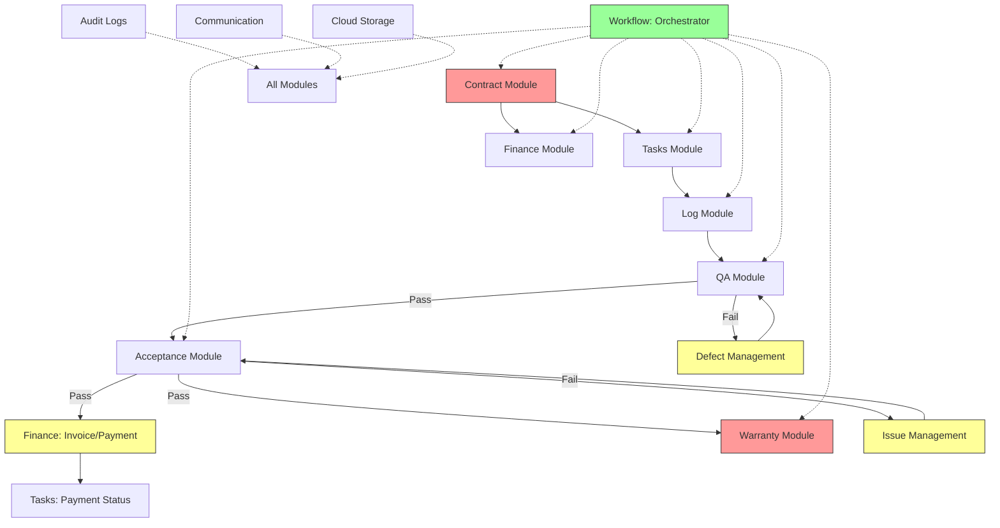
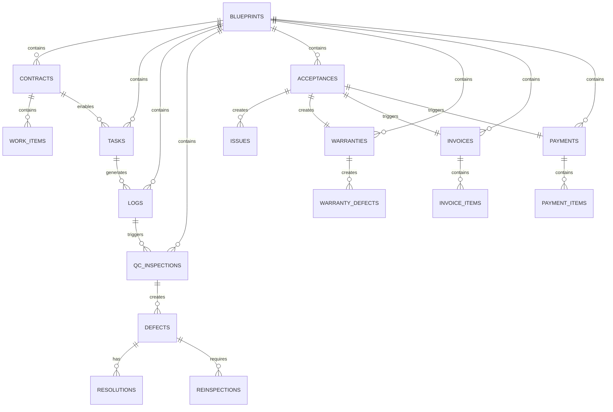

# TREE.md 專案檔案樹擴展規劃

> **文件版本**: 1.0.0  
> **規劃日期**: 2025-12-15  
> **基於**: SETC 工作流程分析 + 模組規劃  
> **目標**: 擴展 TREE.md 以反映新增與修改的模組結構

---

## 📋 執行摘要

本文件規劃如何擴展 `docs/discussions/TREE.md`，加入新增的模組與修改的模組結構，保持檔案樹的完整性與可讀性。

### 擴展概覽

**新增模組目錄**: 3 個
- `contract/` - 合約管理模組
- `warranty/` - 保固管理模組
- `issue/` - 問題管理模組（獨立新增）⭐

**擴展模組目錄**: 3 個（原 4 個，Issue 已獨立）
- `finance/` - 擴展請款/付款子模組
- `qa/` - 擴展缺失管理
- `workflow/` - 擴展編排器
- ~~`acceptance/` - 移除內嵌 Issue，改為整合 Issue Module API~~

**新增整合點**: 多處
- Event Bus 事件定義
- 模組間 API 契約
- 共享資料模型

---

## 1. 當前 TREE.md 結構分析

### 1.1 現有模組列表

基於 TREE.md，當前模組結構為：

```
src/app/core/blueprint/modules/implementations/
├── acceptance/
├── audit-logs/
├── climate/
├── cloud/
├── communication/
├── finance/
├── log/
├── material/
├── qa/
├── safety/
├── tasks/
└── workflow/
```

**現狀**: 13 個模組，結構完整但需要擴展

### 1.2 標準模組結構模式

```
<module>/
├── <module>.module.ts
├── module.metadata.ts
├── index.ts
├── README.md
├── models/
│   ├── index.ts
│   └── <model>.model.ts
├── services/
│   ├── index.ts
│   └── <service>.service.ts
├── repositories/
│   ├── index.ts
│   └── <repository>.repository.ts
├── config/
│   ├── index.ts
│   └── <module>.config.ts
├── exports/
│   ├── index.ts
│   └── <module>-api.exports.ts
└── views/（可選）
    └── <component>.component.ts
```

---

## 2. 擴展後的 TREE.md 結構

### 2.1 完整模組目錄樹

```
src/app/core/blueprint/modules/implementations/
│
├── acceptance/                             # 驗收域（已存在，需修改）⭐
│   ├── acceptance.module.ts
│   ├── module.metadata.ts
│   ├── index.ts
│   ├── README.md
│   │
│   ├── models/
│   │   ├── index.ts
│   │   ├── acceptance.model.ts
│   │   ├── acceptance-request.model.ts
│   │   ├── preliminary-acceptance.model.ts
│   │   ├── re-inspection.model.ts
│   │   └── acceptance-conclusion.model.ts
│   │   // ⭐ 移除：issue.model.ts（已獨立為 Issue Module）
│   │
│   ├── repositories/
│   │   ├── index.ts
│   │   └── acceptance.repository.ts
│   │   // ⭐ 移除：issue.repository.ts（已獨立）
│   │
│   ├── services/
│   │   ├── index.ts
│   │   ├── request.service.ts
│   │   ├── review.service.ts
│   │   ├── preliminary.service.ts
│   │   ├── re-inspection.service.ts
│   │   └── conclusion.service.ts          # ⭐ 修改：整合 Issue Module API
│   │   // ⭐ 移除：issue.service.ts、issue-resolution.service.ts、issue-verification.service.ts
│   │   // ⭐ 這些服務已移至獨立的 Issue Module
│   │
│   ├── config/
│   │   ├── index.ts
│   │   └── acceptance.config.ts
│   │
│   └── exports/
│       ├── index.ts
│       └── acceptance-api.exports.ts
│
├── audit-logs/                             # 稽核日誌（已存在，保持不變）
│   ├── audit-logs.module.ts
│   ├── module.metadata.ts
│   ├── index.ts
│   ├── README.md
│   │
│   ├── components/
│   │   └── audit-logs.component.ts
│   │
│   ├── config/
│   │   └── audit-logs.config.ts
│   │
│   ├── exports/
│   │   └── audit-logs-api.exports.ts
│   │
│   ├── models/
│   │   ├── audit-log.model.ts
│   │   └── audit-log.types.ts
│   │
│   ├── repositories/
│   │   └── audit-log.repository.ts
│   │
│   └── services/
│       └── audit-logs.service.ts
│
├── climate/                                # 氣象模組（已存在，保持不變）
│   ├── climate.module.ts
│   ├── index.ts
│   ├── README.md
│   │
│   ├── config/
│   │   ├── climate.config.ts
│   │   └── cwb-api.constants.ts
│   │
│   ├── examples/
│   │   └── usage-example.ts
│   │
│   ├── exports/
│   │   └── climate-api.exports.ts
│   │
│   ├── models/
│   │   ├── cwb-api-response.model.ts
│   │   └── weather-forecast.model.ts
│   │
│   ├── repositories/
│   │   └── climate.repository.ts
│   │
│   └── services/
│       ├── climate-cache.service.ts
│       └── cwb-weather.service.ts
│
├── cloud/                                  # 雲端儲存（已存在，保持不變）
│   ├── cloud.module.ts
│   ├── index.ts
│   ├── module.metadata.ts
│   ├── README.md
│   │
│   ├── models/
│   │   ├── cloud.model.ts
│   │   └── index.ts
│   │
│   ├── repositories/
│   │   ├── cloud.repository.ts
│   │   └── index.ts
│   │
│   └── services/
│       ├── cloud-storage.service.ts
│       └── index.ts
│
├── communication/                          # 通訊模組（已存在，保持不變）
│   ├── communication.module.ts
│   ├── index.ts
│   ├── module.metadata.ts
│   ├── README.md
│   │
│   ├── models/
│   │   ├── communication.model.ts
│   │   └── index.ts
│   │
│   ├── repositories/
│   │   └── communication.repository.ts
│   │
│   └── services/
│       ├── group-message.service.ts
│       ├── push-notification.service.ts
│       ├── system-notification.service.ts
│       └── task-reminder.service.ts
│
├── contract/                               # ⭐⭐⭐ 新增：合約管理模組（P0）
│   ├── contract.module.ts                  # 模組主檔案
│   ├── module.metadata.ts                  # 模組元資料
│   ├── index.ts                            # 統一匯出
│   ├── README.md                           # 模組說明文件
│   │
│   ├── models/                             # 資料模型
│   │   ├── index.ts
│   │   ├── contract.model.ts               # 合約主模型
│   │   ├── contract-party.model.ts         # 合約雙方資訊
│   │   ├── contract-work-item.model.ts     # 合約工項
│   │   ├── contract-term.model.ts          # 合約條款
│   │   ├── contract-change.model.ts        # 合約變更
│   │   └── contract-file.model.ts          # 合約檔案
│   │
│   ├── services/                           # 業務服務
│   │   ├── index.ts
│   │   ├── contract-management.service.ts  # 合約 CRUD
│   │   ├── contract-upload.service.ts      # 合約上傳
│   │   ├── contract-parsing.service.ts     # OCR/AI 解析
│   │   ├── contract-status.service.ts      # 狀態管理
│   │   ├── contract-items.service.ts       # 工項管理
│   │   └── contract-change.service.ts      # 變更管理
│   │
│   ├── repositories/                       # 資料存取
│   │   ├── index.ts
│   │   └── contract.repository.ts          # Firestore 存取
│   │
│   ├── config/                             # 配置
│   │   ├── index.ts
│   │   └── contract.config.ts              # 模組配置
│   │
│   ├── exports/                            # 公開 API
│   │   ├── index.ts
│   │   └── contract-api.exports.ts         # API 匯出定義
│   │
│   └── views/                              # UI 元件（未來）
│       ├── contract-list.component.ts
│       ├── contract-detail.component.ts
│       ├── contract-form.component.ts
│       └── contract-upload.component.ts
│
├── finance/                                # 財務域（已存在，需擴展）
│   ├── finance.module.ts
│   ├── index.ts
│   ├── module.metadata.ts
│   ├── README.md
│   │
│   ├── models/                             # 資料模型
│   │   ├── finance.model.ts
│   │   ├── index.ts
│   │   ├── invoice.model.ts                # ⭐ 擴展：請款單模型
│   │   ├── payment.model.ts                # ⭐ 擴展：付款單模型
│   │   ├── approval-workflow.model.ts      # ⭐ 新增：審核流程模型
│   │   └── cost-management.model.ts        # 成本管理模型
│   │
│   ├── repositories/                       # 資料存取
│   │   ├── index.ts
│   │   ├── finance.repository.ts
│   │   ├── invoice.repository.ts           # ⭐ 新增：請款單資料存取
│   │   └── payment.repository.ts           # ⭐ 新增：付款單資料存取
│   │
│   ├── services/                           # 業務服務
│   │   ├── index.ts
│   │   ├── budget.service.ts
│   │   ├── cost-management.service.ts
│   │   ├── financial-report.service.ts
│   │   ├── ledger.service.ts
│   │   ├── invoice.service.ts              # ⭐ 擴展：請款服務
│   │   ├── invoice-generation.service.ts   # ⭐ 新增：請款單生成
│   │   ├── invoice-approval.service.ts     # ⭐ 新增：請款審核
│   │   ├── invoice-tracking.service.ts     # ⭐ 新增：請款追蹤
│   │   ├── payment.service.ts              # ⭐ 擴展：付款服務
│   │   ├── payment-generation.service.ts   # ⭐ 新增：付款單生成
│   │   ├── payment-approval.service.ts     # ⭐ 新增：付款審核
│   │   └── payment-tracking.service.ts     # ⭐ 新增：付款追蹤
│   │
│   ├── config/
│   │   ├── index.ts
│   │   └── finance.config.ts
│   │
│   └── exports/
│       ├── index.ts
│       └── finance-api.exports.ts
│
├── issue/                                  # ⭐⭐⭐ 新增：問題管理模組（P1）獨立新增
│   ├── issue.module.ts                     # 模組主檔案
│   ├── module.metadata.ts                  # 模組元資料
│   ├── index.ts                            # 統一匯出
│   ├── README.md                           # 模組說明文件
│   │
│   ├── models/                             # 資料模型
│   │   ├── index.ts
│   │   ├── issue.model.ts                  # 問題單主模型
│   │   ├── issue-resolution.model.ts       # 處理方案
│   │   └── issue-verification.model.ts     # 驗證記錄
│   │
│   ├── services/                           # 業務服務
│   │   ├── index.ts
│   │   ├── issue-management.service.ts     # 問題單 CRUD（手動建立）
│   │   ├── issue-creation.service.ts       # 建立服務（手動+自動）
│   │   ├── issue-resolution.service.ts     # 問題處理
│   │   ├── issue-verification.service.ts   # 問題驗證
│   │   └── issue-lifecycle.service.ts      # 生命週期管理
│   │
│   ├── repositories/                       # 資料存取
│   │   ├── index.ts
│   │   └── issue.repository.ts             # Firestore 存取
│   │
│   ├── config/                             # 配置
│   │   ├── index.ts
│   │   └── issue.config.ts                 # 模組配置
│   │
│   ├── exports/                            # 公開 API
│   │   ├── index.ts
│   │   └── issue-api.exports.ts            # API 匯出定義
│   │
│   └── views/                              # UI 元件（未來）
│       ├── issue-list.component.ts
│       ├── issue-detail.component.ts
│       ├── issue-form.component.ts
│       └── issue-resolution-form.component.ts
│
├── log/                                    # 施工日誌（已存在，需擴展）
│   ├── index.ts
│   ├── log.module.ts
│   ├── module.metadata.ts
│   ├── README.md
│   │
│   ├── models/
│   │   └── activity-log.model.ts
│   │
│   ├── repositories/
│   │   └── log.repository.ts
│   │
│   └── services/
│       ├── activity-log.service.ts         # ⭐ 擴展：加入自動建立
│       ├── attachment.service.ts
│       ├── change-history.service.ts
│       ├── comment.service.ts
│       └── system-event.service.ts
│
├── material/                               # 材料管理（已存在，保持不變）
│   ├── index.ts
│   ├── material.module.ts
│   ├── module.metadata.ts
│   ├── README.md
│   │
│   ├── models/
│   │   ├── index.ts
│   │   └── material.model.ts
│   │
│   ├── repositories/
│   │   └── material.repository.ts
│   │
│   └── services/
│       ├── consumption.service.ts
│       ├── equipment.service.ts
│       ├── inventory.service.ts
│       ├── material-issue.service.ts
│       └── material-management.service.ts
│
├── qa/                                     # 品質檢查（已存在，需擴展）
│   ├── index.ts
│   ├── module.metadata.ts
│   ├── qa.module.ts
│   ├── README.md
│   │
│   ├── models/
│   │   ├── index.ts
│   │   ├── qa.model.ts
│   │   └── defect.model.ts                 # ⭐ 擴展：缺失單模型
│   │
│   ├── repositories/
│   │   ├── qa.repository.ts
│   │   └── defect.repository.ts            # ⭐ 新增：缺失單資料存取
│   │
│   └── services/
│       ├── checklist.service.ts
│       ├── defect.service.ts               # ⭐ 擴展：缺失管理服務
│       ├── defect-lifecycle.service.ts     # ⭐ 新增：缺失生命週期
│       ├── defect-resolution.service.ts    # ⭐ 新增：缺失整改
│       ├── defect-reinspection.service.ts  # ⭐ 新增：缺失複驗
│       ├── inspection.service.ts
│       └── report.service.ts
│
├── safety/                                 # 安全管理（已存在，保持不變）
│   ├── index.ts
│   ├── module.metadata.ts
│   ├── README.md
│   ├── safety.module.ts
│   │
│   ├── models/
│   │   ├── index.ts
│   │   └── safety-inspection.model.ts
│   │
│   ├── repositories/
│   │   └── safety.repository.ts
│   │
│   └── services/
│       ├── incident-report.service.ts
│       ├── risk-assessment.service.ts
│       ├── safety-inspection.service.ts
│       └── safety-training.service.ts
│
├── tasks/                                  # 任務管理（已存在，需擴展）
│   ├── index.ts
│   ├── module.metadata.ts
│   ├── README.md
│   ├── task-modal.component.ts
│   ├── tasks.component.ts
│   ├── tasks.module.spec.ts
│   ├── tasks.module.ts
│   ├── tasks.repository.ts
│   ├── tasks.routes.ts
│   ├── tasks.service.ts                    # ⭐ 擴展：加入合約驗證、款項狀態
│   │
│   ├── components/
│   │   └── task-context-menu/
│   │       ├── task-context-menu.component.html
│   │       ├── task-context-menu.component.less
│   │       └── task-context-menu.component.ts
│   │
│   ├── services/
│   │   └── task-context-menu.service.ts
│   │
│   ├── types/
│   │   ├── index.ts
│   │   └── task-context-menu.types.ts
│   │
│   └── views/
│       ├── task-gantt-view.component.ts
│       ├── task-kanban-view.component.ts
│       ├── task-list-view.component.ts
│       ├── task-timeline-view.component.ts
│       └── task-tree-view.component.ts
│
├── warranty/                               # ⭐⭐⭐ 新增：保固管理模組（P1）
│   ├── warranty.module.ts                  # 模組主檔案
│   ├── module.metadata.ts                  # 模組元資料
│   ├── index.ts                            # 統一匯出
│   ├── README.md                           # 模組說明文件
│   │
│   ├── models/                             # 資料模型
│   │   ├── index.ts
│   │   ├── warranty.model.ts               # 保固主模型
│   │   ├── warranty-item.model.ts          # 保固項目
│   │   ├── warranty-defect.model.ts        # 保固缺失
│   │   └── warranty-repair.model.ts        # 保固維修
│   │
│   ├── services/                           # 業務服務
│   │   ├── index.ts
│   │   ├── warranty-period.service.ts      # 保固期管理
│   │   ├── warranty-item.service.ts        # 保固項目
│   │   ├── warranty-defect.service.ts      # 保固缺失
│   │   ├── warranty-repair.service.ts      # 保固維修
│   │   └── warranty-certificate.service.ts # 保固證明
│   │
│   ├── repositories/                       # 資料存取
│   │   ├── index.ts
│   │   └── warranty.repository.ts          # Firestore 存取
│   │
│   ├── config/                             # 配置
│   │   ├── index.ts
│   │   └── warranty.config.ts              # 模組配置
│   │
│   ├── exports/                            # 公開 API
│   │   ├── index.ts
│   │   └── warranty-api.exports.ts         # API 匯出定義
│   │
│   └── views/                              # UI 元件（未來）
│       ├── warranty-list.component.ts
│       ├── warranty-detail.component.ts
│       ├── warranty-defect-list.component.ts
│       └── warranty-repair-form.component.ts
│
└── workflow/                               # 工作流程（已存在，需擴展）
    ├── index.ts
    ├── module.metadata.ts
    ├── README.md
    ├── workflow.module.ts
    │
    ├── models/
    │   ├── index.ts
    │   └── workflow.model.ts
    │
    ├── repositories/
    │   └── workflow.repository.ts
    │
    └── services/
        ├── approval.service.ts
        ├── automation.service.ts
        ├── custom-workflow.service.ts
        ├── state-machine.service.ts
        ├── template.service.ts
        └── setc-orchestrator.service.ts    # ⭐ 新增：SETC 工作流程編排器
```

---

## 3. 新增/修改標記說明

### 3.1 標記系統

```
⭐      - 單一檔案新增/修改
⭐⭐    - 重要新增模組
⭐⭐⭐  - 關鍵新增模組
```

### 3.2 變更統計

| 類別 | 數量 | 說明 |
|------|------|------|
| 新增模組 | 3 | Contract, Warranty, Issue（獨立新增）⭐ |
| 修改模組 | 3 | Finance, QA, Workflow（Acceptance 改為移除內嵌 Issue）|
| 保持不變 | 6 | Audit Logs, Climate, Cloud, Communication, Material, Safety |
| 新增檔案 | 40+ | Services, Models, Repositories |
| 修改檔案 | 6+ | 現有 Services 擴展，Acceptance 移除 Issue |
| 移除檔案 | 5 | Acceptance 模組的 Issue 相關檔案（移至 Issue Module）|

---

## 4. 模組依賴關係圖



---

## 5. Firestore Collection 擴展

### 5.1 新增 Collections

```typescript
// 新增根 Collections

/contracts/{contractId}                     // ⭐ 新增：合約
  /work_items/{itemId}
  /terms/{termId}
  /changes/{changeId}
  /files/{fileId}

/warranties/{warrantyId}                    // ⭐ 新增：保固
  /items/{itemId}
  /defects/{defectId}
  /repairs/{repairId}

/defects/{defectId}                         // ⭐ 新增：缺失（獨立 collection，QA 專用）
  /resolutions/{resolutionId}
  /reinspections/{reinspectionId}

/issues/{issueId}                           // ⭐⭐ 新增：問題（獨立 collection，多來源）
  // 支援來源：manual, acceptance, qc, warranty, safety
  // 扁平結構，無子集合

/invoices/{invoiceId}                       // ⭐ 擴展：請款單
  /items/{itemId}                          // 新增子集合
  /approvals/{approvalId}                  // 新增子集合

/payments/{paymentId}                       // ⭐ 擴展：付款單
  /items/{itemId}                          // 新增子集合
  /approvals/{approvalId}                  // 新增子集合
```

### 5.2 Collection 關係圖



---

## 6. 事件系統擴展

### 6.1 新增事件定義

```typescript
// src/app/core/blueprint/events/system-events.ts（擴展）

export enum SystemEventType {
  // === 現有事件（保留）===
  
  // === 新增：合約事件 ===
  CONTRACT_CREATED = 'CONTRACT_CREATED',
  CONTRACT_UPDATED = 'CONTRACT_UPDATED',
  CONTRACT_ACTIVATED = 'CONTRACT_ACTIVATED',
  CONTRACT_TERMINATED = 'CONTRACT_TERMINATED',
  CONTRACT_WORK_ITEM_UPDATED = 'CONTRACT_WORK_ITEM_UPDATED',
  
  // === 新增：缺失事件（QA Module）===
  DEFECT_CREATED = 'DEFECT_CREATED',
  DEFECTS_CREATED_FROM_QC = 'DEFECTS_CREATED_FROM_QC',
  DEFECT_RESOLVED = 'DEFECT_RESOLVED',
  DEFECT_REINSPECTION_SCHEDULED = 'DEFECT_REINSPECTION_SCHEDULED',
  DEFECT_VERIFIED = 'DEFECT_VERIFIED',
  DEFECT_CLOSED = 'DEFECT_CLOSED',
  
  // === 新增：問題事件（Issue Module - 獨立）⭐⭐ ===
  ISSUE_CREATED = 'ISSUE_CREATED',
  ISSUE_CREATED_MANUAL = 'ISSUE_CREATED_MANUAL',
  ISSUES_CREATED_FROM_ACCEPTANCE = 'ISSUES_CREATED_FROM_ACCEPTANCE',
  ISSUES_CREATED_FROM_QC = 'ISSUES_CREATED_FROM_QC',
  ISSUE_CREATED_FROM_WARRANTY = 'ISSUE_CREATED_FROM_WARRANTY',
  ISSUE_CREATED_FROM_SAFETY = 'ISSUE_CREATED_FROM_SAFETY',
  ISSUE_UPDATED = 'ISSUE_UPDATED',
  ISSUE_ASSIGNED = 'ISSUE_ASSIGNED',
  ISSUE_RESOLVED = 'ISSUE_RESOLVED',
  ISSUE_VERIFICATION_FAILED = 'ISSUE_VERIFICATION_FAILED',
  ISSUE_VERIFIED = 'ISSUE_VERIFIED',
  ISSUE_CLOSED = 'ISSUE_CLOSED',
  
  // === 新增：請款/付款事件 ===
  INVOICE_GENERATED = 'INVOICE_GENERATED',
  INVOICE_SUBMITTED = 'INVOICE_SUBMITTED',
  INVOICE_APPROVED = 'INVOICE_APPROVED',
  INVOICE_REJECTED = 'INVOICE_REJECTED',
  INVOICE_PAID = 'INVOICE_PAID',
  
  PAYMENT_GENERATED = 'PAYMENT_GENERATED',
  PAYMENT_SUBMITTED = 'PAYMENT_SUBMITTED',
  PAYMENT_APPROVED = 'PAYMENT_APPROVED',
  PAYMENT_REJECTED = 'PAYMENT_REJECTED',
  PAYMENT_COMPLETED = 'PAYMENT_COMPLETED',
  
  // === 新增：保固事件 ===
  WARRANTY_PERIOD_STARTED = 'WARRANTY_PERIOD_STARTED',
  WARRANTY_PERIOD_EXPIRED = 'WARRANTY_PERIOD_EXPIRED',
  WARRANTY_DEFECT_REPORTED = 'WARRANTY_DEFECT_REPORTED',
  WARRANTY_REPAIR_SCHEDULED = 'WARRANTY_REPAIR_SCHEDULED',
  WARRANTY_REPAIR_COMPLETED = 'WARRANTY_REPAIR_COMPLETED',
  
  // === 新增：編排器事件 ===
  ORCHESTRATOR_ERROR = 'ORCHESTRATOR_ERROR',
  WORKFLOW_STAGE_COMPLETED = 'WORKFLOW_STAGE_COMPLETED'
}
```

---

## 7. 更新 TREE.md 的建議方式

### 7.1 段落式更新

建議在 TREE.md 中使用清晰的段落標記：

```markdown
# GigHub 專案檔案樹

## 更新紀錄
- 2025-12-15: 新增 Contract & Warranty 模組，擴展 Finance/QA/Acceptance 模組

## src/app/core/blueprint/modules/implementations/

### 核心模組（Core Modules）

#### ⭐ contract/ - 合約管理模組（P0 - 新增）
合約生命週期管理，包含上傳、OCR/AI 解析、工項管理、狀態控制

#### finance/ - 財務管理模組（擴展）
⭐ 新增：Invoice/Payment 完整生命週期管理、審核流程整合

#### tasks/ - 任務管理模組（擴展）
⭐ 新增：合約驗證、款項狀態管理

...
```

### 7.2 視覺標記系統

使用圖示標記變更類型：

```
⭐      新增檔案/功能
🔄      修改/擴展
❌      刪除/廢棄
✅      已完成
🚧      開發中
```

---

## 8. 實施檢查清單

### 8.1 TREE.md 更新檢查

- [ ] 新增 Contract Module 完整目錄結構
- [ ] 新增 Warranty Module 完整目錄結構
- [ ] 新增 Issue Module 完整目錄結構（獨立新增）⭐
- [ ] 更新 Finance Module（標記新增檔案）
- [ ] 更新 QA Module（標記新增檔案）
- [ ] 更新 Acceptance Module（標記移除 Issue 相關檔案）⭐
- [ ] 更新 Workflow Module（標記新增檔案）
- [ ] 更新 Tasks Module（標記修改檔案）
- [ ] 更新 Log Module（標記修改檔案）
- [ ] 新增事件系統定義（包含 Issue Module 事件）
- [ ] 新增 Firestore Collections（包含 issues collection）
- [ ] 更新模組依賴關係圖（Issue Module 獨立）
- [ ] 新增變更說明段落（Issue Module 獨立原因）

### 8.2 文件同步檢查

- [x] SETC-ANALYSIS.md 與 TREE-EXPANSION.md 一致（Issue Module 獨立）⭐
- [x] MODULE-PLANNING.md 與 TREE-EXPANSION.md 一致（Issue Module 為新模組）⭐
- [x] MODULE-MODIFICATIONS.md 與 TREE-EXPANSION.md 一致（Acceptance 移除 Issue）⭐
- [ ] 所有模組 README.md 已更新

---

## 9. 範例：完整更新後的 Contract Module 段落

```markdown
### contract/ - 合約管理模組 ⭐ 新增（P0）

**職責**: 合約生命週期管理，包含上傳、OCR/AI 解析、工項管理、狀態控制

**核心功能**:
- 合約上傳與檔案管理
- OCR/AI 自動解析合約內容
- 合約工項管理與追蹤
- 合約狀態管理（草稿→待生效→已生效→完成/終止）
- 合約變更管理與審批
- 與任務模組整合（驗證合約生效狀態）

**目錄結構**:
```
contract/
├── contract.module.ts              # 模組主檔案
├── module.metadata.ts              # 模組元資料
├── index.ts                        # 統一匯出
├── README.md                       # 模組說明
│
├── models/                         # 6 個資料模型
├── services/                       # 6 個核心服務
├── repositories/                   # 1 個資料存取層
├── config/                         # 模組配置
├── exports/                        # 公開 API 定義
└── views/                          # UI 元件（未來）
```

**整合點**:
- Tasks Module: 任務建立時驗證合約狀態
- Finance Module: 提供合約工項與金額資料
- Workflow Module: 合約審批與變更流程
- Audit Logs Module: 記錄所有合約操作

**Events**:
- CONTRACT_CREATED, CONTRACT_ACTIVATED, CONTRACT_TERMINATED
- CONTRACT_WORK_ITEM_UPDATED, CONTRACT_CHANGE_REQUESTED
```

---

## 10. 參考資料

- [SETC-ANALYSIS.md](./SETC-ANALYSIS.md) - 工作流程分析
- [MODULE-PLANNING.md](./MODULE-PLANNING.md) - 新模組規劃
- [MODULE-MODIFICATIONS.md](./MODULE-MODIFICATIONS.md) - 模組修改分析
- [TREE.md](./TREE.md) - 當前專案檔案樹

---

**文件維護**: GigHub Development Team  
**最後更新**: 2025-12-15  
**聯絡方式**: 請透過 GitHub Issues 回報問題
