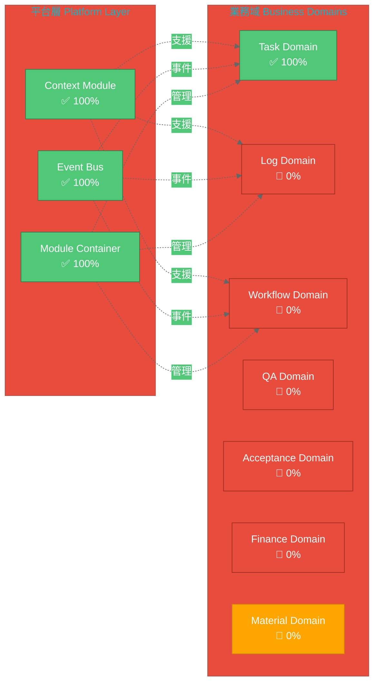
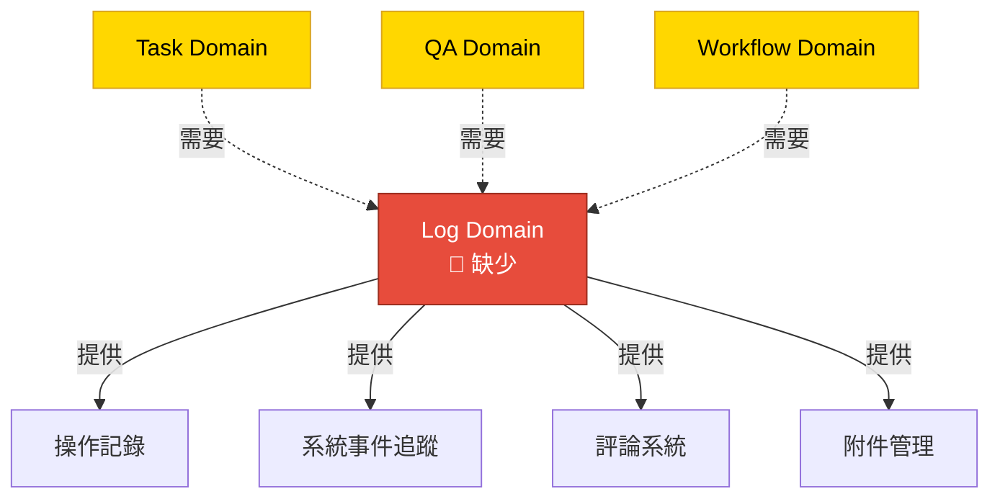
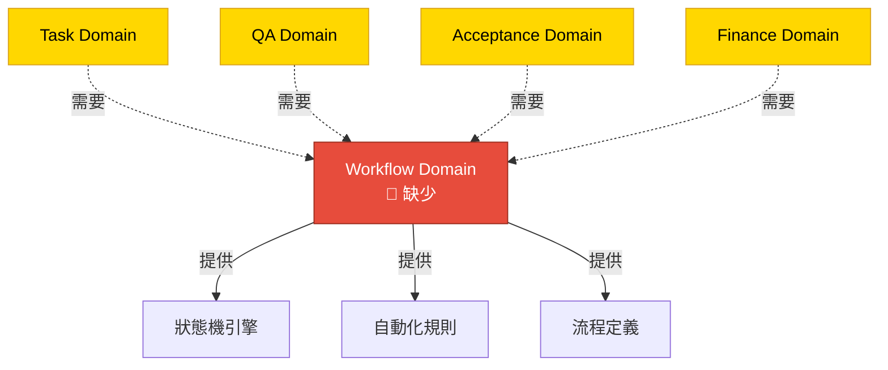
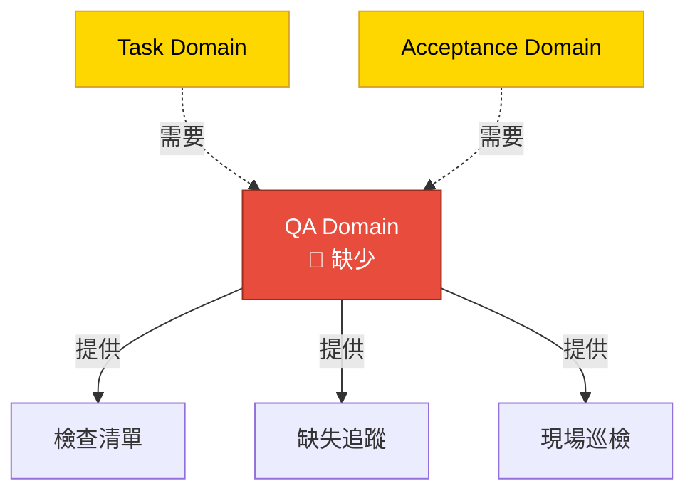
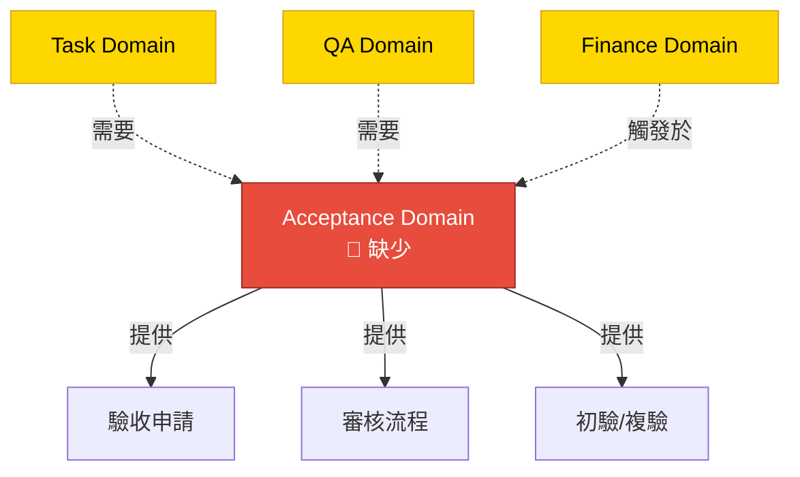
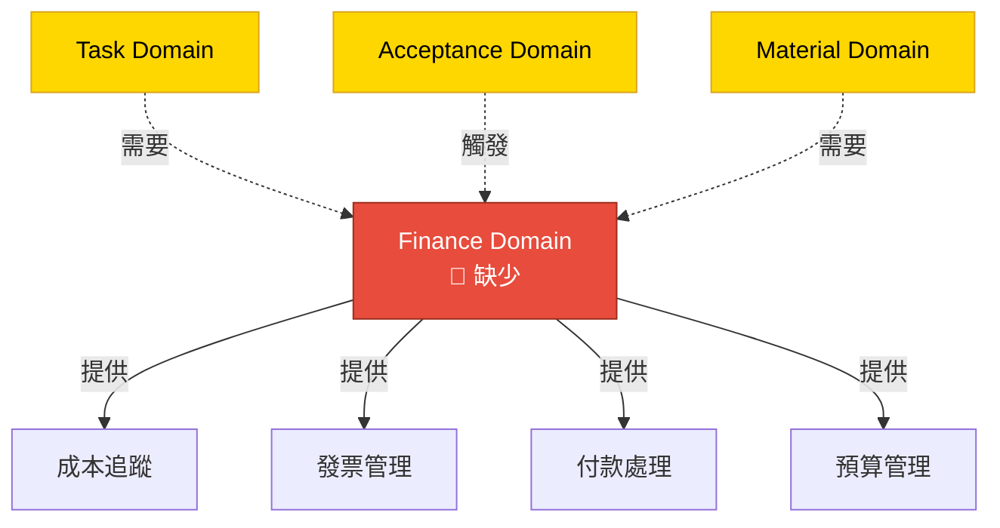
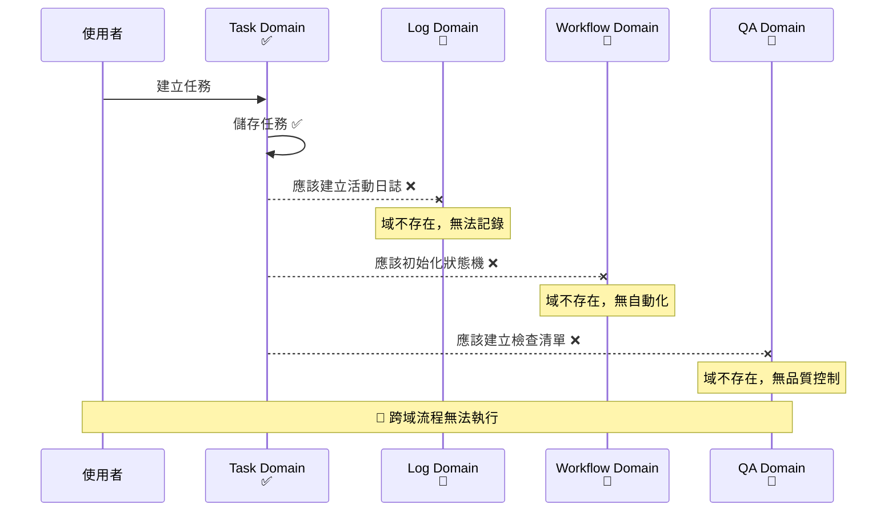
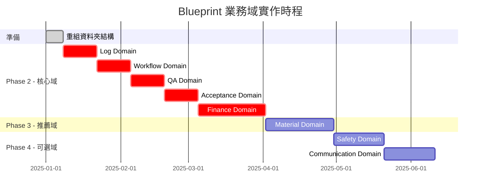

# Blueprint 架構缺口視覺化總結

> **快速參考**: next.md 藍圖結構與目前實作的視覺化對比

---

## 🎯 一句話總結

**目前只實作了 1/6 個必要業務域（Task Domain），缺少 5 個關鍵域導致無法執行完整業務流程。**

---

## 📊 完成度儀表板



**圖例**:
- 🟢 綠色 = 已完成 (100%)
- 🔴 紅色 = 缺少 (0%) - 必要域
- 🟠 橙色 = 缺少 (0%) - 推薦域

---

## 🏗️ next.md 要求的架構 vs 目前實作

### 對照表

| 層級/域 | next.md 要求 | 目前狀態 | 完成度 | 優先級 |
|---------|-------------|---------|--------|--------|
| **🟦 平台層 (Layer A)** |  |  |  |  |
| Context Module | ✅ 必要 | ✅ 已實作 | 100% | - |
| Event/Automation Engine | ✅ 必要 | ✅ 已實作 | 100% | - |
| Module Container | ✅ 必要 | ✅ 已實作 | 100% | - |
| **🟥 業務域 (Layer B)** |  |  |  |  |
| 1. Task Domain | ✅ 必要 | ✅ 已實作 | 100% | - |
| 2. Log Domain | ✅ 必要 | 🔴 **缺少** | 0% | 🔴 最高 |
| 3. Workflow Domain | ✅ 必要 | 🔴 **缺少** | 0% | 🔴 最高 |
| 4. QA Domain | ✅ 必要 | 🔴 **缺少** | 0% | 🔴 最高 |
| 5. Acceptance Domain | ✅ 必要 | 🔴 **缺少** | 0% | 🔴 最高 |
| 6. Finance Domain | ✅ 必要 | 🔴 **缺少** | 0% | 🔴 最高 |
| 7. Material Domain | ⚠️ 推薦 | 🔴 缺少 | 0% | 🟠 高 |
| 8. Safety Domain | ⚪ 可選 | 🔴 缺少 | 0% | 🟢 低 |
| 9. Communication Domain | ⚪ 可選 | 🔴 缺少 | 0% | 🟢 低 |

---

## 🚨 缺少的 5 個關鍵業務域

### 2️⃣ Log Domain（日誌域）- 🔴 最高優先



**影響**:
- ❌ 沒有稽核軌跡
- ❌ 無法追蹤誰做了什麼
- ❌ 沒有評論功能
- ❌ 缺少附件管理

---

### 3️⃣ Workflow Domain（流程域）- 🔴 最高優先



**影響**:
- ❌ 無法自訂狀態轉換
- ❌ 沒有自動化能力
- ❌ 無流程範本重用

---

### 4️⃣ QA Domain（品質控管域）- 🔴 最高優先



**影響**:
- ❌ 沒有品質控制
- ❌ 無法追蹤缺陷
- ❌ 無檢驗流程

---

### 5️⃣ Acceptance Domain（驗收域）- 🔴 最高優先



**影響**:
- ❌ 沒有正式驗收流程
- ❌ 無法觸發付款
- ❌ 驗收文件需手動製作

---

### 6️⃣ Finance Domain（財務域）- 🔴 最高優先



**影響**:
- ❌ 無成本追蹤
- ❌ 無法產生發票
- ❌ 沒有預算管理
- ❌ 無財務報表

---

## 🔄 跨域工作流程無法執行

### 範例：任務建立應該觸發的流程



**目前狀態**: Task Domain 發出的事件沒有任何域接收，Event Bus 功能未被充分利用。

---

## 📁 建議的資料夾結構

### 目前結構（不清楚）❌

```
src/app/core/blueprint/
 ├── context/           ✅ 平台層
 ├── events/            ✅ 平台層
 ├── container/         ✅ 平台層
 ├── modules/           ⚠️ 混合
 │    └── implementations/
 │         └── tasks/   ⚠️ 業務域混在一起
 ├── services/          ✅ 平台層
 └── repositories/      ✅ 平台層
```

### 建議結構（清楚）✅

```
src/app/core/blueprint/
 │
 ├── 📁 platform/       ✅ 平台層 (Layer A)
 │    ├── context/
 │    ├── events/
 │    ├── container/
 │    ├── services/
 │    └── repositories/
 │
 └── 📁 domains/        🔴 業務域 (Layer B)
      ├── task/         ✅ 已實作
      ├── log/          🔴 待實作
      ├── workflow/     🔴 待實作
      ├── qa/           🔴 待實作
      ├── acceptance/   🔴 待實作
      ├── finance/      🔴 待實作
      └── material/     🔴 待實作
```

**好處**:
- ✅ 清楚區分平台與業務
- ✅ 符合 next.md 雙層架構
- ✅ 易於維護和擴展
- ✅ 新開發人員容易理解

---

## 📅 實作時程建議

### 總覽



### 詳細時程

| 階段 | 域 | 週數 | 優先級 | 說明 |
|------|-----|------|--------|------|
| **準備** | 資料夾重組 | 1 | 🔴 | 分離 platform/ 和 domains/ |
| **Phase 2** | Log Domain | 2 | 🔴 | 所有域的基礎 |
|  | Workflow Domain | 2 | 🔴 | 狀態機與自動化 |
|  | QA Domain | 2 | 🔴 | 品質控制 |
|  | Acceptance Domain | 2 | 🔴 | 驗收流程 |
|  | Finance Domain | 4 | 🔴 | 財務管理 |
| **Phase 3** | Material Domain | 4 | 🟠 | 材料管理 |
| **Phase 4** | Safety Domain | 3 | 🟢 | 可選 |
|  | Communication Domain | 3 | 🟢 | 可選 |

**總時程**: 12-16 週完成所有必要域

---

## ✅ 成功標準檢查清單

### 架構對齊

- [ ] 平台層與業務域清楚分離
- [ ] 資料夾結構符合 next.md 定義
- [ ] 所有 6 個必要域已實作
- [ ] 跨域事件通訊正常運作
- [ ] Event Bus 被充分利用

### 業務能力

- [ ] 完整任務管理工作流程
- [ ] 完整稽核軌跡（Log Domain）
- [ ] 可自訂工作流程（Workflow Domain）
- [ ] 品質檢驗流程（QA Domain）
- [ ] 正式驗收工作流程（Acceptance Domain）
- [ ] 財務追蹤與報告（Finance Domain）

### 程式碼品質

- [ ] 每個域至少 80% 測試覆蓋率
- [ ] 一致的域結構與命名
- [ ] 完整的 API 文件
- [ ] 效能符合基準

---

## 🎯 結論

### 目前狀態

✅ **平台層完整** - 基礎設施優秀  
🔴 **業務域嚴重不足** - 只有 1/6 個必要域

### 關鍵行動

1. **立即**: 重組資料夾結構
2. **第 1 優先**: Log Domain（所有域的基礎）
3. **第 2-5 優先**: Workflow、QA、Acceptance、Finance
4. **推薦**: Material Domain
5. **未來**: Safety、Communication（可選）

### 風險提醒

⚠️ **沒有這 5 個缺少的域，系統無法提供 next.md 藍圖設想的完整施工管理能力**

---

**相關文件**:
- 詳細分析（英文）: `GigHub_Blueprint_Architecture_Analysis.md`
- 詳細分析（中文）: `Blueprint架構缺口分析_繁中.md`
- 藍圖定義: `../next.md`
- 現有架構: `GigHub_Architecture.md`
