# GigHub Blueprint Module - Architecture Plan

## Executive Summary

This document provides a comprehensive architectural plan for restructuring the Blueprint logic container in GigHub, a construction site progress tracking management system. The current implementation suffers from tight coupling issues that hinder systematic modular development. This plan addresses these concerns by introducing clear architectural boundaries, proper abstraction layers, and a phased migration strategy to achieve a decoupled, maintainable, and extensible architecture.

### Current State
- Monolithic service layer with direct repository dependencies
- Tight coupling between UI components and business logic
- No clear domain boundaries
- Limited extensibility for future modules

### Target State
- Clean hexagonal architecture with clear boundaries
- Domain-driven design principles
- Pluggable module system
- Event-driven inter-module communication
- Testable and maintainable codebase

---

## System Context

### System Context Diagram

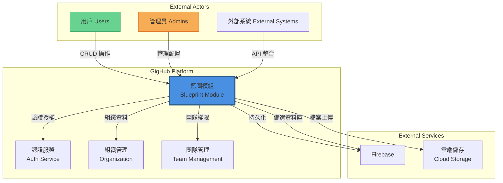

### System Explanation

**GigHub Blueprint Module** serves as the core container layer within the GigHub construction management platform. It acts as the central orchestrator for:

1. **Project Blueprint Management**: Creation, configuration, and lifecycle management of construction project blueprints
2. **Module Configuration**: Dynamic enabling/disabling of feature modules (Tasks, Logs, Quality Checks, etc.)
3. **Access Control**: Member and team-based permissions management
4. **Audit Trail**: Comprehensive activity logging for compliance and debugging

**External Interactions**:
- **Users/Admins**: Primary actors who create, manage, and configure blueprints through Angular web UI
- **External Systems**: Third-party integrations via REST API (future capability)
- **Auth Service**: Delegates authentication and authorization decisions
- **Organization/Team**: Retrieves ownership and membership information
- **Firebase/Firebase**: Persistence layer with flexible database backend support
- **Cloud Storage**: Handles cover images and file attachments

---

## Architecture Overview

### Architectural Patterns

The restructured Blueprint module adopts the following architectural patterns:

1. **Hexagonal Architecture (Ports & Adapters)**
   - Clear separation between core domain logic and external dependencies
   - Inversion of dependencies through interface abstractions
   - Pluggable infrastructure adapters

2. **Domain-Driven Design (DDD)**
   - Aggregate roots with clear boundaries (Blueprint, BlueprintMember)
   - Value objects for immutable data (BlueprintStatus, OwnerType)
   - Domain events for inter-module communication
   - Repository pattern for persistence abstraction

3. **Event-Driven Architecture**
   - Asynchronous communication between modules
   - Eventual consistency for cross-aggregate operations
   - Event sourcing for audit trail

4. **CQRS (Command Query Responsibility Segregation)**
   - Separate read and write models for optimal performance
   - Command handlers for mutations
   - Query handlers for retrievals

---

## Component Architecture

### Component Diagram - Current State

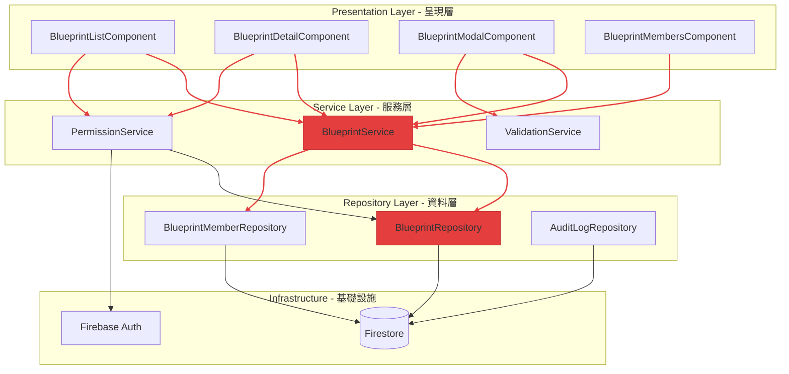

**Current Issues (Red Lines = Tight Coupling)**:
- Direct dependency on concrete repository implementations
- Service layer knows about Firestore specifics
- No abstraction for external services
- UI components directly inject multiple services

### Component Diagram - Target State

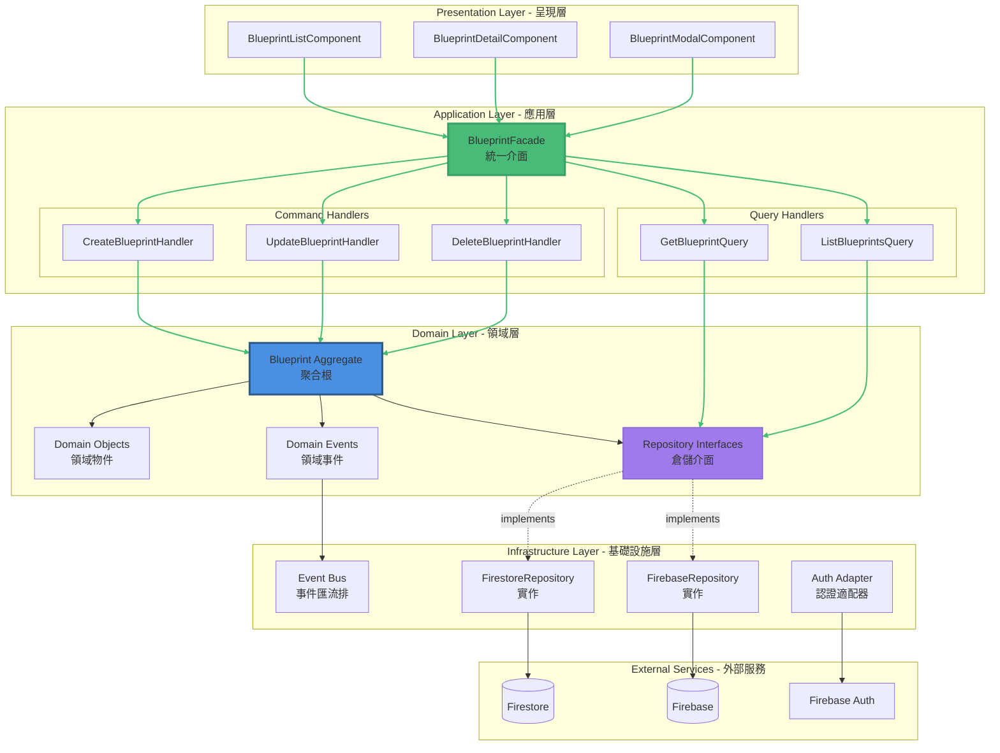

### Component Responsibilities

#### 1. Presentation Layer (呈現層)
**Components**: UI components for displaying and interacting with blueprints

**Responsibilities**:
- Render UI based on application state
- Capture user input and trigger actions
- Display validation errors and feedback
- Navigate between views

**Technology**: Angular 20 Standalone Components, Signals, ng-zorro-antd

**Design Decisions**:
- Use Signal-based reactive state management
- Inject only the Facade service
- Minimal business logic (presentation logic only)
- Reusable components with clear inputs/outputs

---

#### 2. Application Layer (應用層)

**A. Blueprint Facade**
- **Purpose**: Single entry point for presentation layer
- **Responsibilities**:
  - Route commands to appropriate handlers
  - Route queries to appropriate handlers
  - Coordinate multi-aggregate operations
  - Transform DTOs to/from domain models
- **Pattern**: Facade Pattern

**B. Command Handlers**
- **Purpose**: Execute write operations (mutations)
- **Responsibilities**:
  - Validate command parameters
  - Load aggregates from repository
  - Execute domain logic
  - Persist changes
  - Publish domain events
- **Examples**:
  - `CreateBlueprintHandler`: Creates new blueprint aggregate
  - `UpdateBlueprintHandler`: Modifies existing blueprint
  - `DeleteBlueprintHandler`: Soft-deletes blueprint
  - `AddMemberHandler`: Adds member to blueprint

**C. Query Handlers**
- **Purpose**: Execute read operations (queries)
- **Responsibilities**:
  - Validate query parameters
  - Retrieve data from read models
  - Transform to DTOs
  - Apply filtering/sorting
- **Examples**:
  - `GetBlueprintByIdQuery`: Retrieves single blueprint
  - `ListBlueprintsQuery`: Lists blueprints with filters
  - `GetBlueprintMembersQuery`: Retrieves members

---

#### 3. Domain Layer (領域層)

**A. Blueprint Aggregate**
- **Purpose**: Consistency boundary for blueprint operations
- **Responsibilities**:
  - Enforce business rules (invariants)
  - Encapsulate state transitions
  - Generate domain events
  - Protect data integrity
- **Key Methods**:
  ```typescript
  class BlueprintAggregate {
    // Creation
    static create(data: CreateBlueprintData): BlueprintAggregate
    
    // Mutations
    updateInfo(name: string, description: string): void
    enableModule(module: ModuleType): void
    disableModule(module: ModuleType): void
    changeStatus(newStatus: BlueprintStatus): void
    archive(): void
    
    // Queries (internal)
    isModuleEnabled(module: ModuleType): boolean
    canBeDeleted(): boolean
    
    // Event generation
    private addEvent(event: DomainEvent): void
  }
  ```

**B. Domain Objects**
- **Value Objects**: Immutable objects representing domain concepts
  - `BlueprintId`, `BlueprintName`, `Slug`
  - `OwnerInfo(ownerId, ownerType)`
  - `ModuleConfiguration`
- **Entities**: Objects with identity
  - `BlueprintMember`
- **Enumerations**: `BlueprintStatus`, `BlueprintRole`, `OwnerType`

**C. Domain Events**
- **Purpose**: Communicate state changes to other modules
- **Examples**:
  - `BlueprintCreated`
  - `BlueprintUpdated`
  - `BlueprintArchived`
  - `ModuleEnabled`
  - `ModuleDisabled`
  - `MemberAdded`
  - `MemberRemoved`

**D. Repository Interfaces**
- **Purpose**: Define persistence contracts without implementation
- **Key Interfaces**:
  ```typescript
  interface IBlueprintRepository {
    findById(id: string): Promise<Blueprint | null>
    findByOwner(ownerType: OwnerType, ownerId: string): Promise<Blueprint[]>
    save(blueprint: Blueprint): Promise<void>
    delete(id: string): Promise<void>
  }
  
  interface IBlueprintMemberRepository {
    findByBlueprintId(blueprintId: string): Promise<BlueprintMember[]>
    findByAccountId(blueprintId: string, accountId: string): Promise<BlueprintMember | null>
    add(member: BlueprintMember): Promise<void>
    remove(blueprintId: string, accountId: string): Promise<void>
  }
  ```

---

#### 4. Infrastructure Layer (基礎設施層)

**A. Repository Implementations**
- **FirestoreRepository**: Firestore-specific implementation
  - Maps domain objects to Firestore documents
  - Handles Timestamp conversions
  - Implements query optimizations
- **FirebaseRepository**: Firebase/PostgreSQL implementation
  - SQL query generation
  - Relational data mapping
  - Transaction management

**B. Event Bus**
- **Purpose**: Publish/Subscribe mechanism for domain events
- **Implementation**: RxJS Subject or Angular's built-in services
- **Responsibilities**:
  - Route events to subscribers
  - Support async/sync handlers
  - Error isolation

**C. External Service Adapters**
- **Auth Adapter**: Abstracts authentication provider (Firebase Auth)
- **Storage Adapter**: Abstracts file storage (Firebase Storage, S3)
- **Notification Adapter**: Email/Push notification services

---

### Design Decisions & Rationale

#### 1. Why Hexagonal Architecture?
**Decision**: Adopt ports and adapters pattern

**Rationale**:
- **Testability**: Core domain logic can be tested without external dependencies
- **Flexibility**: Easy to swap database (Firestore ↔ Firebase)
- **Maintainability**: Changes to external services don't affect domain logic
- **Clarity**: Clear boundaries make codebase easier to understand

**Trade-off**: Increased initial complexity and more files/interfaces

---

#### 2. Why CQRS?
**Decision**: Separate read and write paths

**Rationale**:
- **Performance**: Optimize read models independently from write models
- **Scalability**: Scale read and write operations independently
- **Simplicity**: Read queries bypass domain logic validation
- **Flexibility**: Different data models for different use cases (e.g., list view vs. detail view)

**Trade-off**: Data consistency challenges (eventual consistency)

---

#### 3. Why Domain Events?
**Decision**: Use event-driven communication between modules

**Rationale**:
- **Decoupling**: Modules don't need direct dependencies on each other
- **Extensibility**: New modules can subscribe to existing events
- **Audit Trail**: Events provide complete history
- **Async Processing**: Heavy operations can be deferred

**Trade-off**: Debugging complexity, eventual consistency

---

#### 4. Why Facade Pattern?
**Decision**: Single entry point for UI components

**Rationale**:
- **Simplicity**: Components inject only one service
- **Stability**: Internal refactoring doesn't affect UI
- **Consistency**: Uniform API for all operations
- **Testing**: Easy to mock single interface

**Trade-off**: Additional abstraction layer

---

## Deployment Architecture

### Deployment Diagram

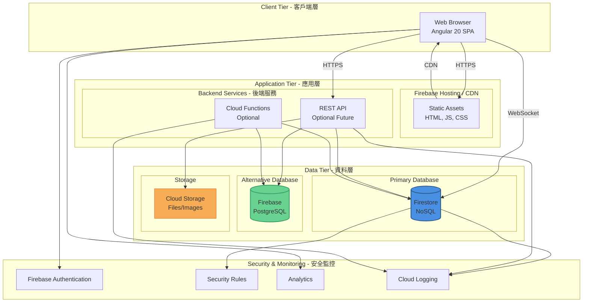

### Deployment Environments

#### Development Environment
- **Frontend**: `ng serve` on localhost:4200
- **Backend**: Firebase Emulator Suite
  - Firestore: localhost:8080
  - Auth: localhost:9099
  - Functions: localhost:5001
- **Configuration**: `.env.development`

#### Staging Environment
- **Frontend**: Firebase Hosting (staging project)
- **Backend**: Firebase Staging Project
- **Database**: Firestore (staging instance)
- **Purpose**: QA testing, client demos

#### Production Environment
- **Frontend**: Firebase Hosting + CDN
  - URL: `https://gighub.app` (example)
  - Auto-scaling, global distribution
- **Backend**: Firebase Production Project
- **Database**: 
  - Primary: Firestore (production instance)
- **Monitoring**: Cloud Monitoring, Error Reporting
- **Backups**: Daily automated backups

### Infrastructure Components

#### 1. Firebase Hosting
- **Purpose**: Serve Angular SPA
- **Features**:
  - SSL/TLS encryption
  - CDN distribution
  - Automatic caching
  - Custom domain support
- **Configuration**: `firebase.json`

#### 2. Firestore
- **Purpose**: Primary NoSQL database
- **Features**:
  - Real-time synchronization
  - Offline support
  - Security rules
  - Automatic scaling
- **Collections**:
  - `blueprints/`
  - `blueprints/{id}/members/`
  - `blueprints/{id}/modules/`
  - `blueprints/{id}/audit_logs/`

##

#### 4. Cloud Functions (Future)
- **Purpose**: Backend business logic
- **Use Cases**:
  - Scheduled jobs (e.g., archiving old blueprints)
  - Webhook handlers
  - Complex data processing
  - Third-party integrations

#### 5. Security Rules
- **Purpose**: Database-level access control
- **Location**: `firestore.rules`
- **Enforcement**: Server-side, cannot be bypassed
- **Coverage**: All CRUD operations on blueprints and subcollections

### Deployment Strategy

#### CI/CD Pipeline
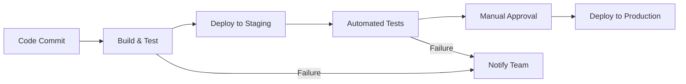

**Steps**:
1. **Code Commit**: Push to `main` branch triggers pipeline
2. **Build & Test**:
   - Install dependencies (`yarn install`)
   - Run linters (`yarn lint`)
   - Run unit tests (`yarn test`)
   - Build production bundle (`yarn build`)
3. **Deploy to Staging**:
   - Deploy to Firebase Hosting (staging)
   - Deploy Firestore rules
   - Deploy Cloud Functions (if any)
4. **Automated Tests**:
   - E2E tests (Cypress/Playwright)
   - Smoke tests on staging environment
5. **Manual Approval**: QA sign-off
6. **Deploy to Production**:
   - Blue-green deployment
   - Gradual rollout (10% → 50% → 100%)
   - Automated rollback on errors

---

## Data Flow

### Data Flow Diagram - Blueprint Creation

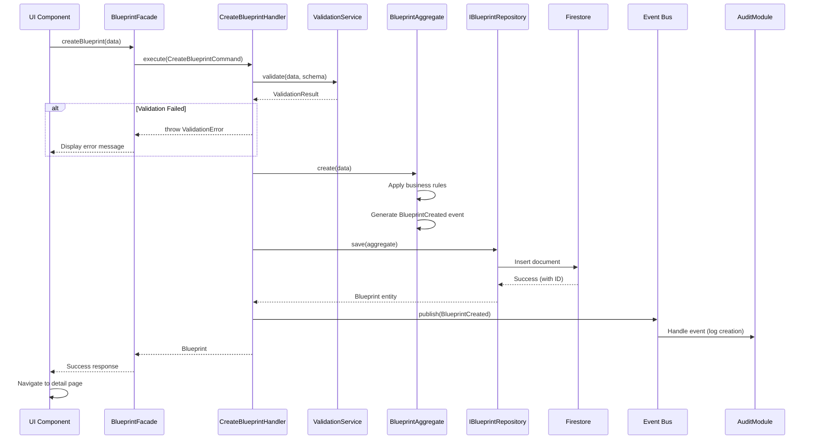

### Data Flow Explanation

#### 1. Input Validation
**Purpose**: Prevent invalid data from entering the system

**Layers**:
1. **Client-side**: Angular reactive forms validation
2. **Application Layer**: Schema-based validation service
3. **Domain Layer**: Business rules validation
4. **Database Layer**: Firestore security rules

**Data Transformations**:
- User input (form values) → CreateBlueprintDTO
- DTO → CreateBlueprintCommand
- Command → Blueprint aggregate
- Aggregate → Firestore document

**Validation Rules**:
- Name: Required, min 3 chars, max 100 chars
- Slug: Required, lowercase, alphanumeric + hyphens, unique
- Owner ID: Required, valid UUID
- Owner Type: Required, enum value (user/organization)
- Enabled Modules: Array of valid ModuleType enums

---

#### 2. Data Storage & Retrieval

**Write Path** (Create/Update/Delete):
```
UI → Facade → Command Handler → Aggregate → Repository → Firestore
```

**Read Path** (Get/List):
```
UI → Facade → Query Handler → Repository → Firestore → DTO → UI
```

**Key Differences**:
- Write path enforces business rules via aggregates
- Read path bypasses aggregates for performance
- Write path publishes events
- Read path uses optimized queries

---

#### 3. Event Processing

**Synchronous Events** (within same transaction):
- Audit log creation
- Permission cache invalidation

**Asynchronous Events** (eventual consistency):
- Email notifications
- Analytics tracking
- Third-party webhooks
- Search index updates

**Event Flow**:
```
Aggregate generates event → EventBus publishes → Multiple subscribers handle event independently
```

**Error Handling**:
- Event publishing failures don't affect primary operation
- Failed event handlers are logged and retried
- Dead letter queue for permanently failed events

---

### Data Transformation Strategy

#### DTOs (Data Transfer Objects)
**Purpose**: Decouple external API from internal domain models

**Types**:
- **CreateBlueprintDTO**: Data for creating blueprint
- **UpdateBlueprintDTO**: Data for updating blueprint
- **BlueprintResponseDTO**: Public API response format
- **BlueprintListItemDTO**: Optimized for list views

**Mapping**:
- Presentation Layer ↔ DTOs: Automatic (Angular forms)
- DTOs ↔ Domain Models: Manual mapping in Facade/Handlers
- Domain Models ↔ Database: Repository layer

**Benefits**:
- API versioning without breaking domain
- Security (hide internal fields)
- Performance (select only needed fields)

---

## Key Workflows

### Sequence Diagram - Blueprint CRUD Operations

#### Create Blueprint

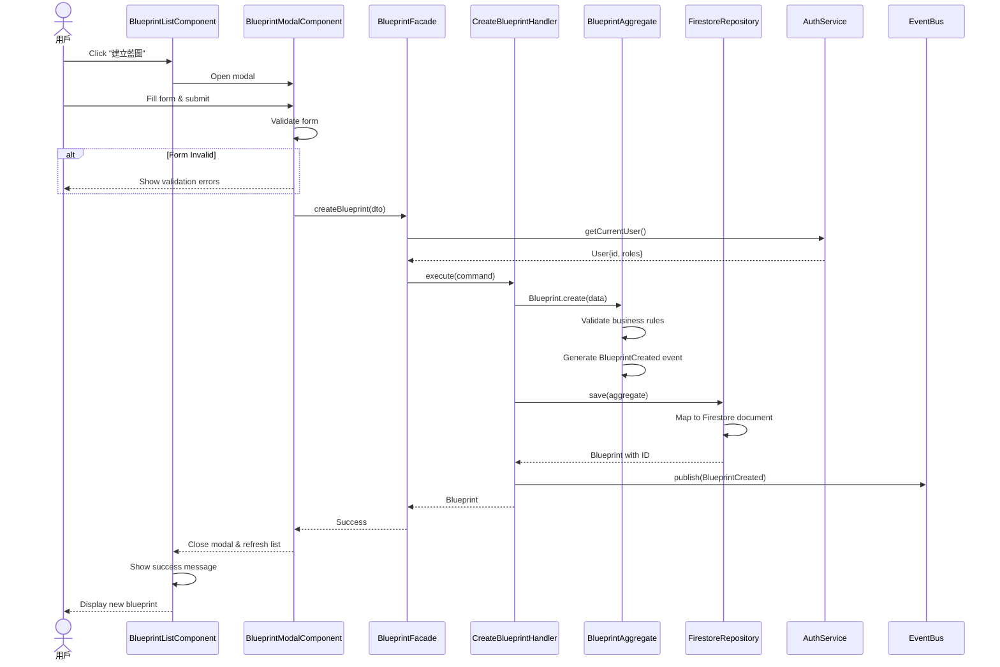

---

#### Update Blueprint

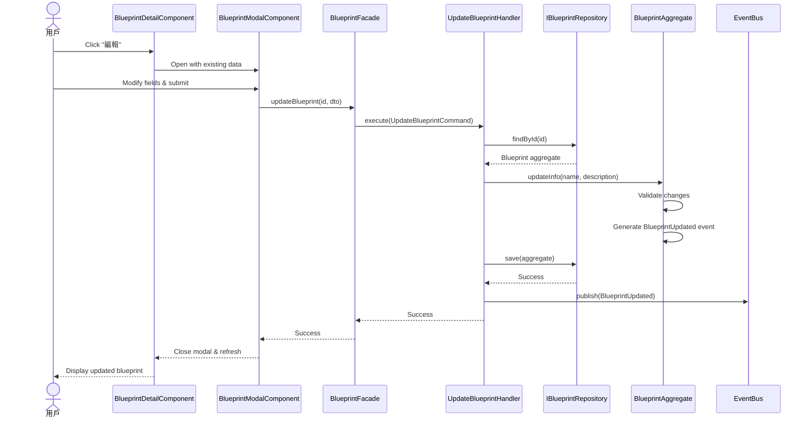

---

#### Delete Blueprint (Soft Delete)

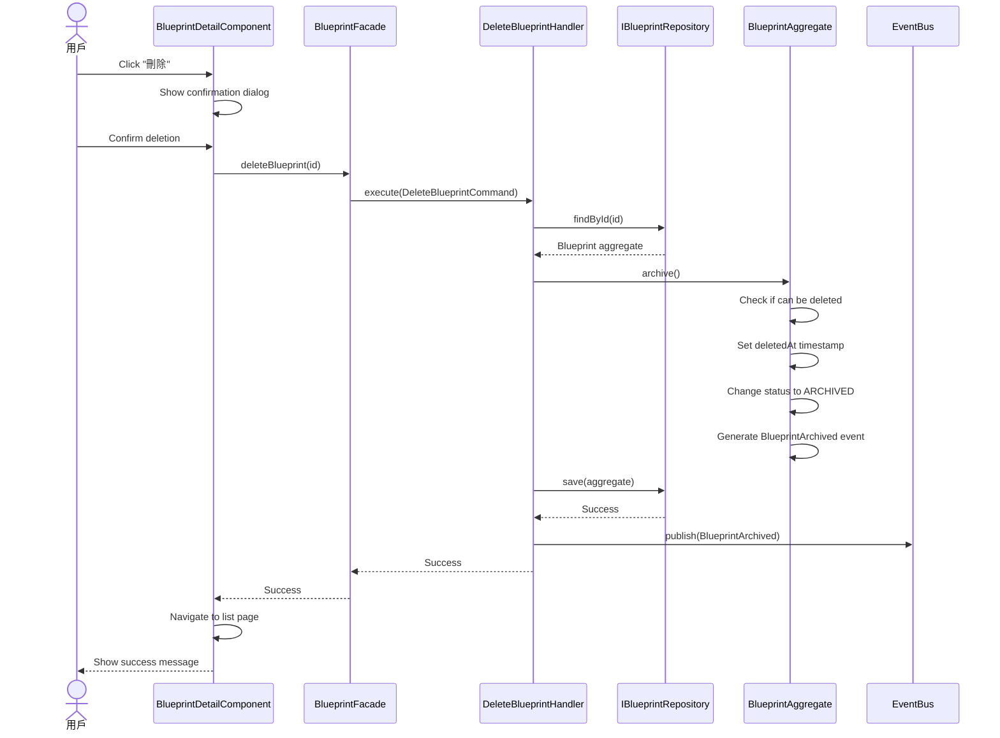

---

### Sequence Diagram - Module Management

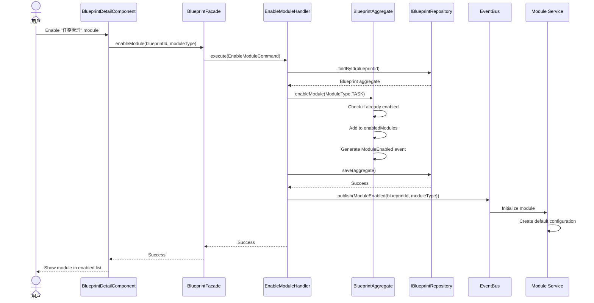

---

### Sequence Diagram - Permission Check

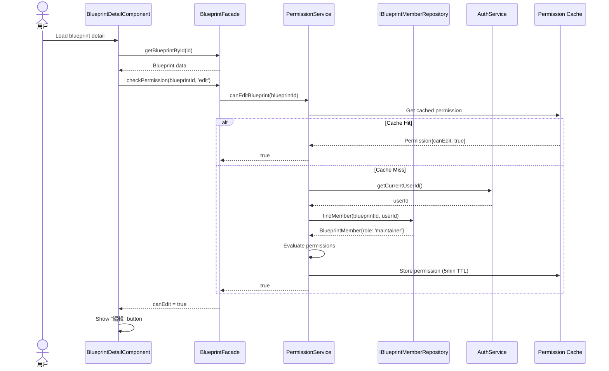

---

## Phased Development

### Phase 1: Foundation Refactoring (Week 1-2)

**Goal**: Establish architectural foundations without breaking existing functionality

#### Tasks:
1. **Create Domain Layer Structure**
   - Define repository interfaces (`IBlueprintRepository`, `IBlueprintMemberRepository`)
   - Create value objects (`BlueprintId`, `OwnerInfo`, etc.)
   - Define domain events (`BlueprintCreated`, `BlueprintUpdated`, etc.)
   - Implement aggregate base class

2. **Introduce Facade Pattern**
   - Create `BlueprintFacade` service
   - Delegate to existing `BlueprintService` internally
   - Update UI components to use Facade instead of direct service calls
   - Keep existing implementation intact

3. **Setup Event Bus Infrastructure**
   - Create `EventBus` service using RxJS
   - Define event interfaces
   - Implement basic publish/subscribe mechanism
   - Add logging for debugging

#### Deliverables:
```
src/app/shared/services/blueprint/
├── domain/
│   ├── interfaces/
│   │   ├── i-blueprint-repository.ts
│   │   └── i-blueprint-member-repository.ts
│   ├── value-objects/
│   │   ├── blueprint-id.ts
│   │   ├── owner-info.ts
│   │   └── slug.ts
│   ├── events/
│   │   ├── blueprint-created.event.ts
│   │   ├── blueprint-updated.event.ts
│   │   └── module-enabled.event.ts
│   └── aggregates/
│       └── aggregate-root.base.ts
├── application/
│   └── blueprint.facade.ts
└── infrastructure/
    └── event-bus.service.ts
```

#### Testing:
- Unit tests for value objects
- Integration tests ensuring Facade delegates correctly
- Regression tests to verify no behavioral changes

---

### Phase 2: Command/Query Separation (Week 3-4)

**Goal**: Implement CQRS pattern and separate write/read paths

#### Tasks:
1. **Create Command Handlers**
   - `CreateBlueprintHandler`
   - `UpdateBlueprintHandler`
   - `DeleteBlueprintHandler`
   - `AddMemberHandler`
   - `RemoveMemberHandler`

2. **Create Query Handlers**
   - `GetBlueprintByIdQuery`
   - `ListBlueprintsQuery`
   - `GetBlueprintMembersQuery`

3. **Implement Blueprint Aggregate**
   - Migrate business logic from service to aggregate
   - Add event generation
   - Implement invariant checks

4. **Update Facade to Use Handlers**
   - Route commands to command handlers
   - Route queries to query handlers
   - Maintain backward compatibility

#### Deliverables:
```
src/app/shared/services/blueprint/
├── application/
│   ├── commands/
│   │   ├── create-blueprint.command.ts
│   │   ├── create-blueprint.handler.ts
│   │   ├── update-blueprint.command.ts
│   │   ├── update-blueprint.handler.ts
│   │   └── ...
│   ├── queries/
│   │   ├── get-blueprint.query.ts
│   │   ├── get-blueprint.handler.ts
│   │   ├── list-blueprints.query.ts
│   │   └── list-blueprints.handler.ts
│   └── blueprint.facade.ts (updated)
├── domain/
│   └── aggregates/
│       └── blueprint.aggregate.ts
```

#### Testing:
- Unit tests for each handler
- Aggregate behavior tests
- End-to-end tests for critical workflows

---

### Phase 3: Repository Abstraction (Week 5-6)

**Goal**: Decouple from Firestore, enable database flexibility

#### Tasks:
1. **Implement Repository Interfaces**
   - Create `FirestoreBlueprintRepository` implementing `IBlueprintRepository`
   - Create `FirestoreMemberRepository` implementing `IBlueprintMemberRepository`
   - Move Firestore-specific code from existing repositories

2. **Dependency Injection Configuration**
   - Configure DI to provide concrete implementations
   - Use `InjectionToken` for interface-based injection

3. **Create Firebase Repository Skeleton**
   - Implement basic CRUD operations
   - Add feature flag for database switching

4. **Update Handlers to Use Interfaces**
   - Inject `IBlueprintRepository` instead of concrete class
   - Remove direct Firestore dependencies

#### Deliverables:
```
src/app/shared/services/blueprint/
├── infrastructure/
│   ├── firestore/
│   │   ├── firestore-blueprint.repository.ts
│   │   └── firestore-member.repository.ts
│   ├── firebase/
│   │   ├── firebase-blueprint.repository.ts (skeleton)
│   │   └── firebase-member.repository.ts (skeleton)
│   └── repository.providers.ts (DI configuration)
```

#### Testing:
- Repository integration tests with Firestore emulator
- Mock repository implementations for handler tests
- Database switching tests

---

### Phase 4: Event-Driven Integration (Week 7-8)

**Goal**: Enable inter-module communication via events

#### Tasks:
1. **Implement Event Publishing**
   - Update aggregates to generate events
   - Publish events from command handlers
   - Add event metadata (timestamp, user, etc.)

2. **Create Event Subscribers**
   - Audit log event handler
   - Permission cache invalidation handler
   - Notification event handler (email/push)

3. **Implement Audit Trail**
   - `AuditLogEventHandler` subscribes to all blueprint events
   - Automatically create audit records
   - Include before/after state for updates

4. **Add Event Replay Capability**
   - Store events in dedicated collection
   - Implement event replay for debugging
   - Add event sourcing foundation

#### Deliverables:
```
src/app/shared/services/blueprint/
├── infrastructure/
│   ├── event-bus.service.ts (enhanced)
│   ├── event-handlers/
│   │   ├── audit-log.handler.ts
│   │   ├── permission-cache.handler.ts
│   │   └── notification.handler.ts
│   └── event-store/
│       ├── event-store.service.ts
│       └── event-replay.service.ts
```

#### Testing:
- Event publishing tests
- Event handler tests (isolated)
- End-to-end event flow tests

---

### Phase 5: Module System & Final Polish (Week 9-10)

**Goal**: Implement pluggable module system and complete migration

#### Tasks:
1. **Create Module Registry**
   - Define module interface
   - Implement module discovery mechanism
   - Add module lifecycle hooks (onEnable, onDisable)

2. **Refactor Existing Modules**
   - Task module
   - Log module
   - Quality check module
   - Wrap each in module interface

3. **Implement Module Communication**
   - Modules subscribe to blueprint events
   - Modules publish their own events
   - Cross-module workflows (e.g., task → log → quality check)

4. **Performance Optimization**
   - Add query result caching
   - Implement pagination helpers
   - Optimize Firestore indexes
   - Add loading states and skeletons

5. **Documentation & Training**
   - Update architecture documentation
   - Create developer guide for adding new modules
   - Record video walkthrough
   - Conduct team training session

#### Deliverables:
```
src/app/shared/services/blueprint/
├── module-system/
│   ├── module-registry.service.ts
│   ├── module.interface.ts
│   └── built-in-modules/
│       ├── task-module.ts
│       ├── log-module.ts
│       └── quality-module.ts
├── docs/
│   ├── architecture-overview.md
│   ├── developer-guide.md
│   └── module-development-guide.md
```

---

### Migration Path

#### From Current State to Phase 1
```
Step 1: Create new directory structure
Step 2: Define interfaces without changing existing code
Step 3: Create Facade that delegates to existing services
Step 4: Update UI components one by one to use Facade
Step 5: Run full regression test suite
```

#### From Phase 1 to Phase 2
```
Step 1: Implement command/query handlers
Step 2: Create Blueprint aggregate with business logic
Step 3: Update Facade to use handlers internally
Step 4: Verify no breaking changes via tests
Step 5: Gradually migrate business rules to aggregate
```

#### From Phase 2 to Phase 3
```
Step 1: Extract interfaces from existing repositories
Step 2: Rename existing repositories (e.g., BlueprintRepository → FirestoreBlueprintRepository)
Step 3: Configure dependency injection
Step 4: Update handlers to inject interfaces
Step 5: Test with existing Firestore implementation
Step 6: Implement Firebase repositories
Step 7: Add feature flag for database selection
```

#### From Phase 3 to Phase 4
```
Step 1: Add event generation to aggregates (initially no-op)
Step 2: Implement EventBus publish/subscribe
Step 3: Create audit log event handler
Step 4: Test event flow end-to-end
Step 5: Add more event subscribers incrementally
```

#### From Phase 4 to Phase 5
```
Step 1: Design module interface
Step 2: Create module registry
Step 3: Wrap one existing feature (e.g., Tasks) as a module
Step 4: Test module enable/disable workflow
Step 5: Migrate remaining features to modules
Step 6: Document and train team
```

---

## Non-Functional Requirements Analysis

### Scalability

#### Current Limitations:
- Monolithic service layer limits horizontal scaling
- Direct Firestore queries in services
- No caching strategy
- All operations synchronous

#### Target Architecture Benefits:
1. **Horizontal Scaling**
   - Stateless command/query handlers can scale independently
   - Event handlers can be distributed across multiple instances
   - Read replicas for query optimization

2. **Database Scaling**
   - Firestore automatically scales
   - Firebase supports read replicas and connection pooling
   - Sharding strategy for multi-tenant isolation (future)

3. **Caching Strategy**
   - Query result caching (Redis or in-memory)
   - Permission cache (5min TTL)
   - Static asset caching via CDN

4. **Asynchronous Processing**
   - Heavy operations moved to event handlers
   - Background jobs for archiving, reporting
   - Webhook delivery via queues

#### Scalability Metrics:
- **Target Users**: 10,000 concurrent users
- **Blueprints per Organization**: Up to 1,000
- **Read/Write Ratio**: 80/20 (read-heavy)
- **Response Time**: < 200ms for reads, < 500ms for writes
- **Event Processing**: < 1s for async operations

---

### Performance

#### Optimization Strategies:

1. **Query Optimization**
   - Firestore composite indexes for common queries
   - Pagination with cursors (not offset)
   - Field selection (don't fetch entire documents)
   - Batch reads for related data

2. **Change Detection Optimization**
   - Angular Signals for fine-grained reactivity
   - `OnPush` change detection strategy
   - Avoid unnecessary re-renders

3. **Bundle Size Optimization**
   - Lazy loading for feature modules
   - Tree-shaking unused code
   - AOT compilation
   - Gzip/Brotli compression

4. **Network Optimization**
   - Service worker for offline support
   - GraphQL-style field selection (future)
   - WebSocket for real-time updates
   - HTTP/2 multiplexing

#### Performance Targets:
| Metric | Target | Current |
|--------|--------|---------|
| Time to Interactive (TTI) | < 3s | ~5s |
| First Contentful Paint (FCP) | < 1.5s | ~2s |
| Bundle Size | < 500KB | ~800KB |
| API Response Time (p95) | < 300ms | ~600ms |
| Firestore Read Operations | < 10/page load | ~25/page load |

---

### Security

#### Multi-Layer Security Architecture:

1. **Client-Side Security**
   - Input validation (Angular forms)
   - XSS prevention (Angular sanitization)
   - CSRF tokens for state-changing operations
   - Content Security Policy (CSP) headers

2. **Application Layer Security**
   - Schema-based validation (ValidationService)
   - Command authorization checks
   - Rate limiting (future)
   - Request logging and anomaly detection

3. **Domain Layer Security**
   - Business rule enforcement in aggregates
   - State transition validation
   - Invariant checks

4. **Database Layer Security**
   - Firestore Security Rules (cannot be bypassed)
   - Row-level security (Firebase)
   - Encryption at rest and in transit
   - Audit trail (immutable)

#### Authentication & Authorization:

**Authentication**:
- Firebase Authentication (OAuth 2.0, OIDC)
- Supported providers: Email/Password, Google, Microsoft
- JWT tokens with 1-hour expiration
- Refresh token rotation

**Authorization**:
- Role-Based Access Control (RBAC)
  - Blueprint owner
  - Organization admin
  - Member role (Viewer, Contributor, Maintainer)
  - Team access level (Read, Write, Admin)
- Attribute-Based Access Control (ABAC) for fine-grained permissions
  - Custom permissions per member
  - Blueprint visibility (public/private)
  - Module-specific permissions

**Security Rules Example**:
```javascript
function canEditBlueprint(blueprintId) {
  let blueprint = get(/databases/$(database)/documents/blueprints/$(blueprintId));
  let userId = request.auth.uid;
  
  // Owner check
  if (blueprint.data.ownerType == 'user' && blueprint.data.ownerId == userId) {
    return true;
  }
  
  // Organization admin check
  if (blueprint.data.ownerType == 'organization') {
    let org = get(/databases/$(database)/documents/organizations/$(blueprint.data.ownerId));
    if (org.data.adminIds.hasAny([userId])) {
      return true;
    }
  }
  
  // Member role check
  let member = get(/databases/$(database)/documents/blueprints/$(blueprintId)/members/$(userId));
  if (member.data.role in ['maintainer', 'contributor']) {
    return true;
  }
  
  return false;
}
```

#### Data Protection:
- Sensitive data encryption (client-side before storage)
- PII anonymization in logs
- GDPR compliance (right to deletion, data export)
- Backup encryption
- Secret management (Firebase/GCP Secret Manager)

---

### Reliability

#### High Availability Architecture:

1. **Application Tier**
   - Multiple hosting regions (Firebase Hosting CDN)
   - Auto-scaling based on traffic
   - Health checks and automatic failover

2. **Database Tier**
   - Firestore multi-region replication
   - Automatic backups (daily)
   - Point-in-time recovery
   - 99.95% uptime SLA

3. **Monitoring & Alerting**
   - Cloud Monitoring dashboards
   - Error rate alerts (> 1% triggers alert)
   - Performance degradation alerts
   - Uptime monitoring (UptimeRobot, Pingdom)

#### Fault Tolerance:

**Error Handling Strategy**:
```typescript
try {
  // Command execution
  await handler.execute(command);
} catch (error) {
  // Classify error
  if (error instanceof ValidationError) {
    // User error - show friendly message
    return { success: false, message: error.userMessage };
  } else if (error instanceof PermissionError) {
    // Security error - log and alert
    logger.warn('Permission denied', { userId, blueprintId });
    return { success: false, message: 'Permission denied' };
  } else {
    // System error - log, alert, and retry
    logger.error('System error', error);
    await alertingService.notify('Blueprint operation failed', error);
    // Retry logic with exponential backoff
    return await retryWithBackoff(() => handler.execute(command));
  }
}
```

**Circuit Breaker Pattern**:
- Prevent cascading failures
- Open circuit after 5 consecutive failures
- Half-open state for health checks
- Auto-recovery after 30s

**Graceful Degradation**:
- Offline support with Service Worker
- Local caching of critical data
- Queue failed mutations for retry
- Fallback UI for external service failures

#### Disaster Recovery:

**Backup Strategy**:
- Daily automated backups (retained 30 days)
- Weekly full backups (retained 1 year)
- Cross-region backup replication
- Backup testing quarterly

**Recovery Time Objectives (RTO/RPO)**:
| Scenario | RTO | RPO |
|----------|-----|-----|
| Database failure | < 1 hour | < 5 minutes |
| Region outage | < 2 hours | < 15 minutes |
| Complete system failure | < 4 hours | < 1 hour |
| Data corruption | < 8 hours | < 1 day |

**Incident Response**:
1. Detection (automated alerts)
2. Assessment (on-call engineer investigates)
3. Mitigation (rollback, failover, or hotfix)
4. Communication (status page updates)
5. Post-mortem (root cause analysis)

---

### Maintainability

#### Code Quality Standards:

1. **TypeScript Strict Mode**
   - `"strict": true` in `tsconfig.json`
   - No `any` types
   - Explicit return types for public methods

2. **Linting & Formatting**
   - ESLint for code quality
   - Prettier for consistent formatting
   - Pre-commit hooks (Husky)

3. **Code Review Process**
   - All changes require PR review
   - Automated checks (lint, test, build)
   - Minimum 1 approval required
   - Security review for sensitive changes

4. **Documentation Standards**
   - JSDoc for all public APIs
   - README for each major module
   - Architecture Decision Records (ADRs)
   - API documentation (Compodoc or Swagger)

#### Testing Strategy:

**Test Pyramid**:
```
        /\
       /E2E\       <- 10% (Cypress)
      /------\
     /  Int   \    <- 20% (Integration tests)
    /----------\
   /   Unit     \  <- 70% (Jest)
  /--------------\
```

**Coverage Targets**:
- Unit tests: 80% coverage minimum
- Integration tests: Critical paths
- E2E tests: Happy path workflows
- Security tests: Firestore rules

**Testing Tools**:
- **Unit**: Jest, Angular Testing Library
- **Integration**: Jest with Firebase emulator
- **E2E**: Cypress or Playwright
- **Load**: k6 or Artillery

#### Refactoring Guidelines:

1. **When to Refactor**:
   - Before adding new features to avoid technical debt
   - When code smells are detected (long methods, duplicated code)
   - After fixing bugs to prevent recurrence

2. **Refactoring Process**:
   - Ensure test coverage before refactoring
   - Make small, incremental changes
   - Run tests after each change
   - Document architectural decisions

3. **Technical Debt Management**:
   - Track debt in issue tracker
   - Allocate 20% sprint capacity for debt reduction
   - Prioritize high-interest debt (frequently changed code)

#### Monitoring & Observability:

1. **Logging**
   - Structured logging (JSON format)
   - Log levels (DEBUG, INFO, WARN, ERROR)
   - Correlation IDs for request tracing
   - Centralized log aggregation (Cloud Logging)

2. **Metrics**
   - Business metrics (blueprints created, active users)
   - Technical metrics (response times, error rates)
   - Infrastructure metrics (CPU, memory, disk)
   - Custom dashboards (Grafana or Firebase Console)

3. **Tracing**
   - Distributed tracing (Cloud Trace)
   - Request/response logging
   - Database query logging
   - Event flow visualization

4. **Alerting**
   - Error rate > 1%
   - Response time p95 > 500ms
   - Failed events > 10/min
   - Authentication failures > 100/min

---

## Risks and Mitigations

### Risk 1: Migration Complexity
**Risk**: Refactoring may introduce bugs or break existing functionality

**Impact**: High (business disruption)
**Probability**: Medium

**Mitigation**:
- Phased migration approach (5 phases over 10 weeks)
- Comprehensive test coverage before refactoring
- Feature flags for gradual rollout
- Parallel run of old and new implementations
- Automated regression testing
- Rollback plan for each phase

**Contingency**:
- Keep old implementation in separate branch
- Database migrations are reversible
- Rollback script available
- Hotfix process defined

---

### Risk 2: Performance Degradation
**Risk**: Additional abstraction layers may slow down operations

**Impact**: Medium (user experience)
**Probability**: Low

**Mitigation**:
- Performance benchmarking before/after each phase
- Load testing with realistic data volumes
- Query optimization with indexes
- Caching strategy for hot paths
- Profiling tools to identify bottlenecks

**Contingency**:
- Performance budgets (fail build if exceeded)
- Optimization sprint if degradation detected
- Temporary feature flags to disable slow features

---

### Risk 3: Database Lock-In
**Risk**: Despite abstraction, Firestore-specific features may leak into domain logic

**Impact**: Medium (migration difficulty)
**Probability**: Medium

**Mitigation**:
- Repository interfaces with no Firestore types in signatures
- Avoid Firestore-specific features (e.g., real-time listeners in domain)
- Document database-agnostic patterns
- Regular architecture reviews
- Proof-of-concept Firebase implementation in Phase 3

**Contingency**:
- Adapter pattern for Firestore-specific features
- Gradual migration of problematic code
- Accept technical debt for rarely-used features

---

### Risk 4: Event Consistency Issues
**Risk**: Event-driven architecture may lead to race conditions or lost events

**Impact**: High (data integrity)
**Probability**: Low

**Mitigation**:
- Transactional outbox pattern (events stored in same transaction)
- Event replay capability for debugging
- Idempotent event handlers
- Event ordering guarantees (sequence numbers)
- Monitoring and alerting for failed events

**Contingency**:
- Event reconciliation job (nightly)
- Manual event replay tools
- Fallback to synchronous processing

---

### Risk 5: Team Learning Curve
**Risk**: Team may struggle with new architectural patterns

**Impact**: Medium (development velocity)
**Probability**: High

**Mitigation**:
- Comprehensive documentation and guides
- Pair programming during implementation
- Lunch & learn sessions
- Code review with feedback
- Gradual introduction of patterns (one per phase)

**Contingency**:
- External architecture consultant
- Extended timeline if needed
- Simplified approach if patterns too complex

---

### Risk 6: Third-Party Service Downtime
**Risk**: Firebase/Firestore outages impact system availability

**Impact**: High (complete downtime)
**Probability**: Low (99.95% SLA)

**Mitigation**:
- Multi-region deployment
- Service Worker for offline functionality
- Local caching of critical data
- Firebase as backup database
- Status page for transparency

**Contingency**:
- Manual failover to Firebase
- Extended cache TTLs during outages
- Read-only mode if write operations unavailable

---

## Technology Stack Recommendations

### Frontend Stack

| Technology | Version | Purpose | Justification |
|------------|---------|---------|---------------|
| **Angular** | 20.3.x | Web framework | Already in use, Standalone Components, Signals |
| **ng-alain** | 20.x | Admin framework | Enterprise UI components, reduces development time |
| **ng-zorro-antd** | 20.x | Component library | Ant Design, comprehensive UI components |
| **TypeScript** | 5.9.x | Language | Type safety, better IDE support |
| **RxJS** | 7.8.x | Reactive programming | Async operations, event handling |

### Backend Stack

| Technology | Version | Purpose | Justification |
|------------|---------|---------|---------------|
| **Firebase** | Latest | BaaS platform | Authentication, hosting, cloud functions |
| **Firestore** | Latest | Primary database | NoSQL, real-time, auto-scaling |
| **Firebase** | Latest | Alternative database | PostgreSQL, open-source, cost-effective |
| **Cloud Functions** | Latest | Serverless compute | Background jobs, webhooks, integrations |

### Development Tools

| Tool | Purpose | Justification |
|------|---------|---------------|
| **Jest** | Unit testing | Fast, parallel execution, great TypeScript support |
| **Cypress** | E2E testing | Modern, developer-friendly, visual debugging |
| **ESLint** | Linting | Code quality, catch errors early |
| **Prettier** | Formatting | Consistent code style |
| **Husky** | Git hooks | Pre-commit checks, prevent bad commits |
| **Compodoc** | Documentation | Generate API docs from JSDoc comments |

### Infrastructure

| Service | Purpose | Justification |
|---------|---------|---------------|
| **Firebase Hosting** | Static hosting | CDN, SSL, custom domains |
| **Cloud Logging** | Centralized logging | Structured logs, powerful search |
| **Cloud Monitoring** | Observability | Metrics, alerts, dashboards |
| **Firebase Analytics** | Product analytics | User behavior, feature usage |

---

## Next Steps

### Immediate Actions (Week 1)

1. **Team Alignment**
   - [ ] Present architecture plan to team
   - [ ] Discuss and refine approach
   - [ ] Get stakeholder buy-in
   - [ ] Assign roles and responsibilities

2. **Environment Setup**
   - [ ] Set up Firebase emulator for local development
   - [ ] Configure test environment
   - [ ] Set up CI/CD pipeline
   - [ ] Create feature branch for refactoring

3. **Documentation**
   - [ ] Review and approve this architecture document
   - [ ] Create developer setup guide
   - [ ] Document current architecture baseline
   - [ ] Set up ADR (Architecture Decision Records) repository

4. **Planning**
   - [ ] Break down Phase 1 into user stories
   - [ ] Estimate effort for each phase
   - [ ] Create project timeline
   - [ ] Schedule team training sessions

### Short-Term Goals (Month 1)

- Complete Phase 1: Foundation Refactoring
- Establish testing standards and coverage baseline
- Set up monitoring and alerting
- Begin Phase 2: Command/Query Separation

### Medium-Term Goals (Month 2-3)

- Complete Phases 2-3
- Achieve 80%+ test coverage
- Implement basic event-driven workflows
- Validate Firebase integration with PoC

### Long-Term Goals (Month 3-6)

- Complete Phases 4-5
- Fully decoupled, event-driven architecture
- Pluggable module system
- Production deployment with monitoring
- Comprehensive documentation and training materials

---

## Appendix A: Glossary

| Term | Definition |
|------|------------|
| **Aggregate** | DDD pattern - consistency boundary for a cluster of domain objects |
| **Blueprint** | Core entity representing a construction project configuration |
| **Command** | Write operation that changes system state |
| **CQRS** | Command Query Responsibility Segregation - separate read and write models |
| **Domain Event** | Notification of something significant that happened in the domain |
| **Facade** | Design pattern providing unified interface to subsystem |
| **Hexagonal Architecture** | Architectural pattern with domain at center, ports/adapters at edges |
| **Repository** | Abstraction for data access, hides persistence details |
| **Query** | Read operation that doesn't change system state |
| **Value Object** | Immutable object representing a domain concept with no identity |

---

## Appendix B: References

### Internal Documentation
- [BLUEPRINT_MODULE_DOCUMENTATION.md](../BLUEPRINT_MODULE_DOCUMENTATION.md)
- [Angular 20 Development Guidelines](../.github/instructions/angular.instructions.md)
- [TypeScript Standards](../.github/instructions/typescript-5-es2022.instructions.md)
- [ng-alain Guidelines](../.github/instructions/ng-alain-delon.instructions.md)

### External Resources
- [Domain-Driven Design by Eric Evans](https://www.domainlanguage.com/ddd/)
- [Implementing Domain-Driven Design by Vaughn Vernon](https://vaughnvernon.com/books/)
- [Angular Architecture Best Practices](https://angular.dev/best-practices)
- [Firebase Firestore Best Practices](https://firebase.google.com/docs/firestore/best-practices)
- [Hexagonal Architecture (Ports & Adapters)](https://alistair.cockburn.us/hexagonal-architecture/)

---

**Document Version**: 1.0.0  
**Last Updated**: 2025-12-09  
**Author**: Senior Cloud Architect Agent  
**Status**: Draft - Pending Review  
**Review Date**: TBD  

---

## Approval Sign-Off

| Role | Name | Date | Signature |
|------|------|------|-----------|
| Technical Lead | | | |
| Product Owner | | | |
| Engineering Manager | | | |
| Senior Cloud Architect | | | |
